# Kafka 深入分析 - 01 架构概述与核心概念

## 文档概述

本文档是 Kafka 深入分析系列的第一篇，主要介绍 Kafka 的整体架构、核心概念和关键组件。

---

## 目录

1. [Kafka 简介](#kafka-简介)
2. [核心概念](#核心概念)
3. [整体架构](#整体架构)
4. [关键组件详解](#关键组件详解)
5. [数据流转流程](#数据流转流程)
6. [架构优势](#架构优势)

---

## Kafka 简介

Apache Kafka 是一个分布式流处理平台，最初由 LinkedIn 开发，现在是 Apache 软件基金会的顶级项目。Kafka 被设计用于处理实时数据流，具有高吞吐量、低延迟、可扩展性和容错性等特点。

### 主要特性

- **高吞吐量**: 单台机器可以处理数百万条消息/秒
- **低延迟**: 端到端延迟通常在几毫秒
- **可扩展性**: 支持水平扩展，可以轻松添加更多节点
- **容错性**: 通过副本机制保证数据不丢失
- **持久化**: 消息持久化存储到磁盘
- **实时处理**: 支持实时流处理

---

## 核心概念

### 1. Topic（主题）

Topic 是消息的类别或分类，类似于数据库中的表。生产者将消息发布到特定的 Topic，消费者从 Topic 订阅消息。

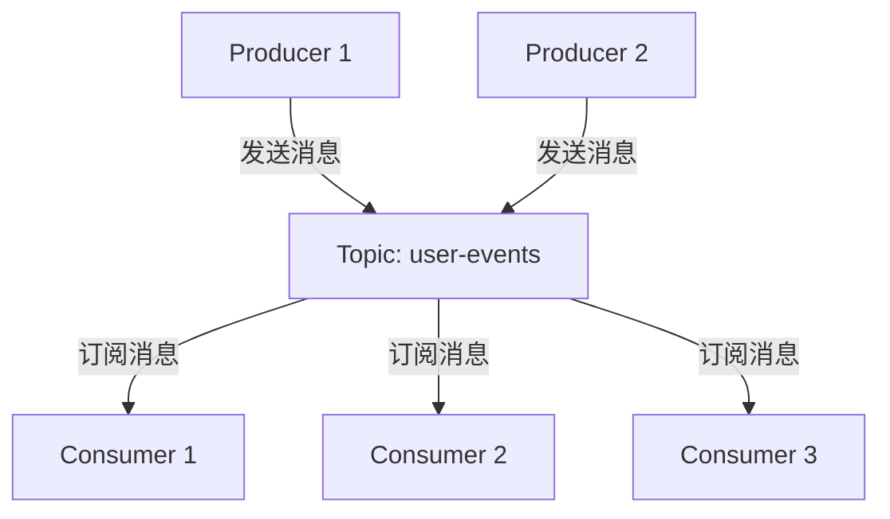

### 2. Partition（分区）

每个 Topic 被分割成一个或多个 Partition，这是 Kafka 并行处理的基础。

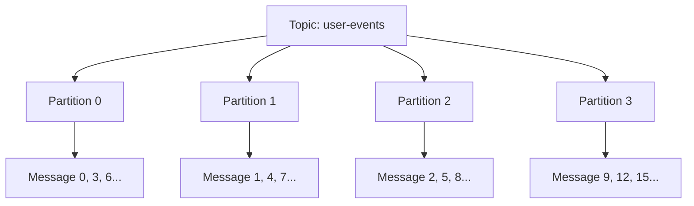

### 3. Producer（生产者）

Producer 负责将消息发送到 Kafka Topic。生产者决定将消息发送到哪个 Partition。

### 4. Consumer（消费者）

Consumer 从 Topic 读取消息。消费者可以单独工作，也可以组成 Consumer Group。

### 5. Consumer Group（消费者组）

Consumer Group 是由多个 Consumer 组成的群组，共同消费一个 Topic 的消息。每个 Partition 在同一时间只能被同一个 Consumer Group 中的一个 Consumer 消费。

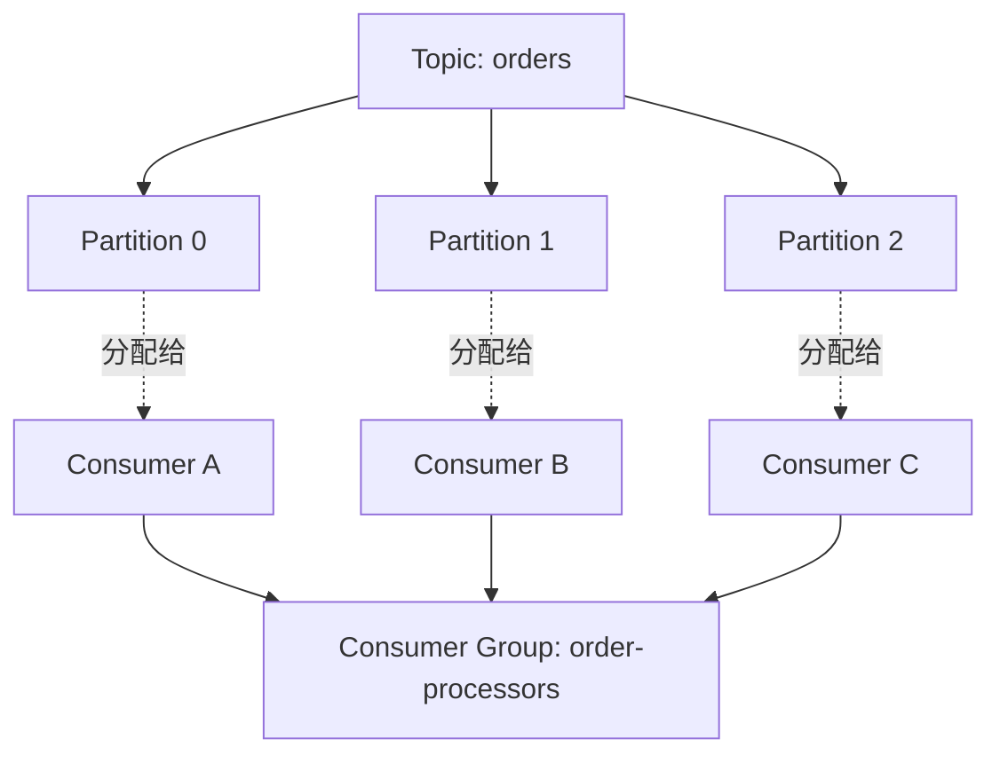

### 6. Broker（代理）

Broker 是 Kafka 服务器，负责存储消息和处理客户端请求。多个 Broker 组成 Kafka 集群。

### 7. Leader 和 Follower

每个 Partition 有一个 Leader 和多个 Follower 副本。所有的读写操作都通过 Leader 进行，Follower 负责同步 Leader 的数据。

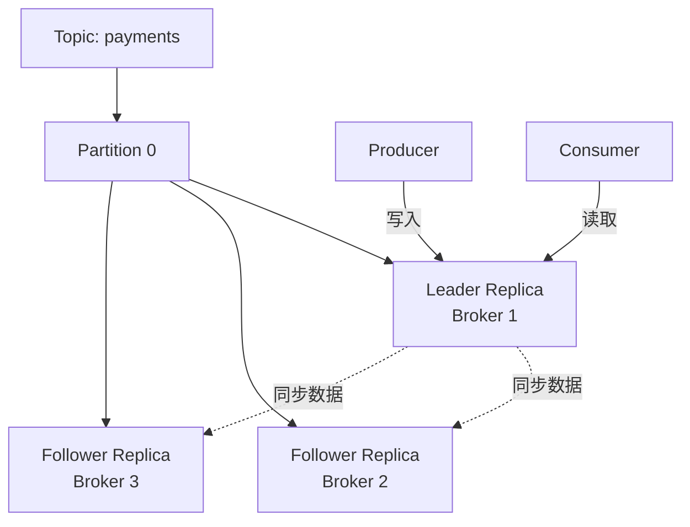

---

## 整体架构

### Kafka 集群架构图

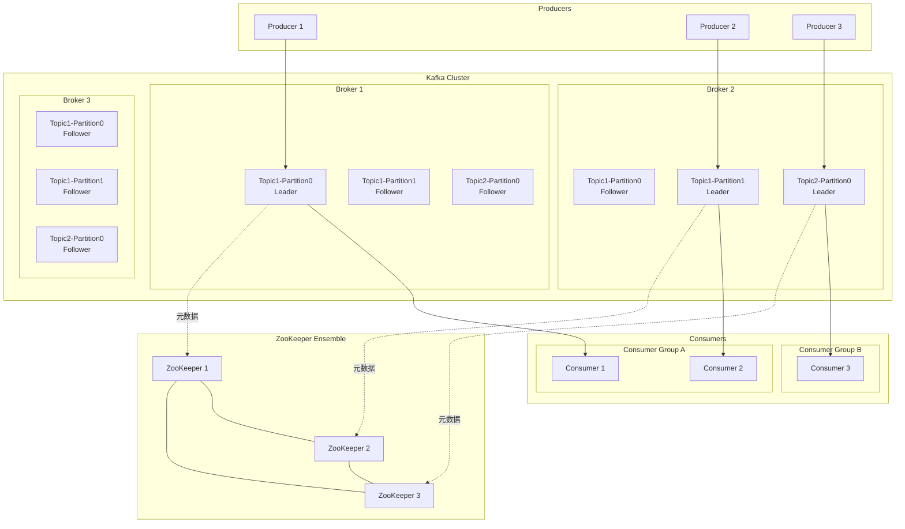

### 架构层次

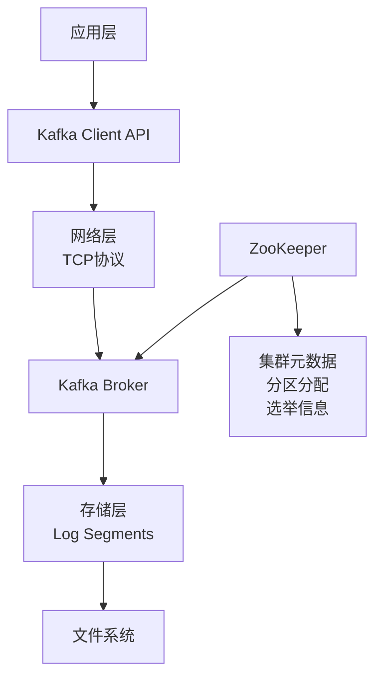

---

## 关键组件详解

### 1. Broker 架构

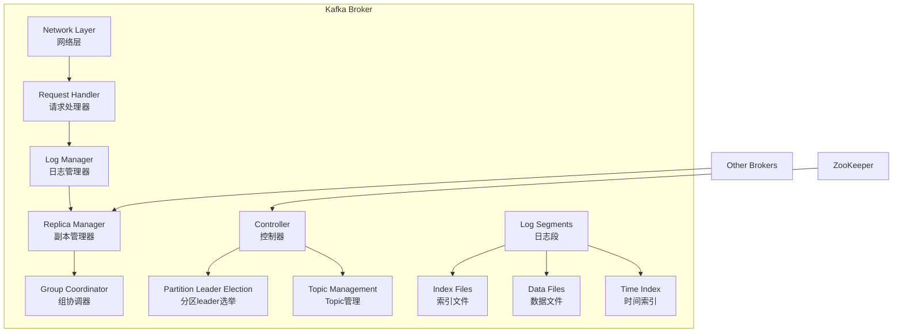

### 2. Producer 架构

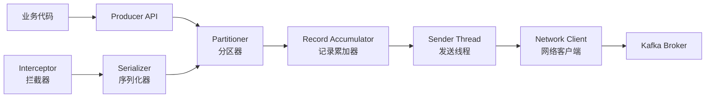

### 3. Consumer 架构

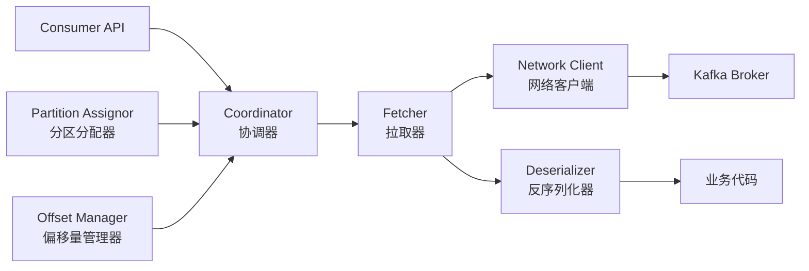

---

## 数据流转流程

### 1. 消息发送流程

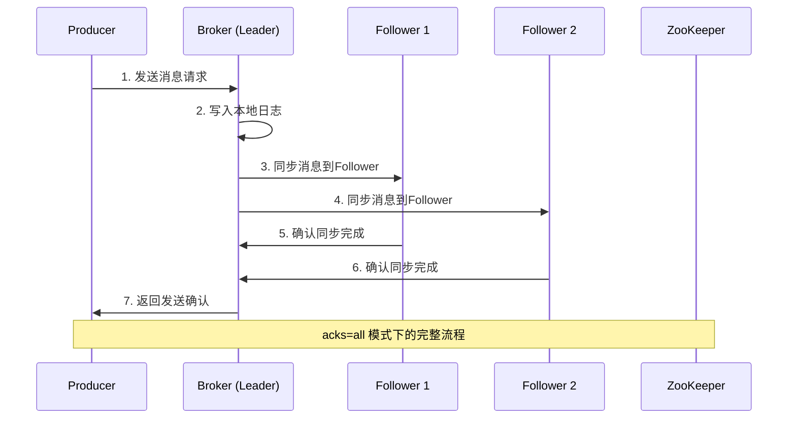

### 2. 消息消费流程

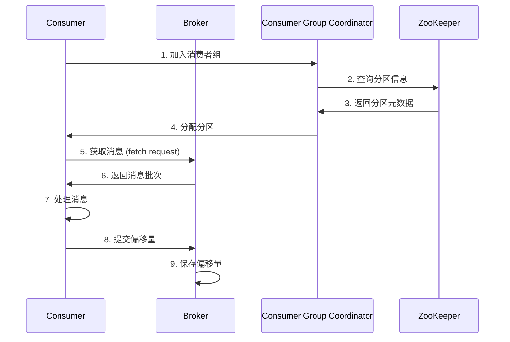

### 3. 集群选举流程

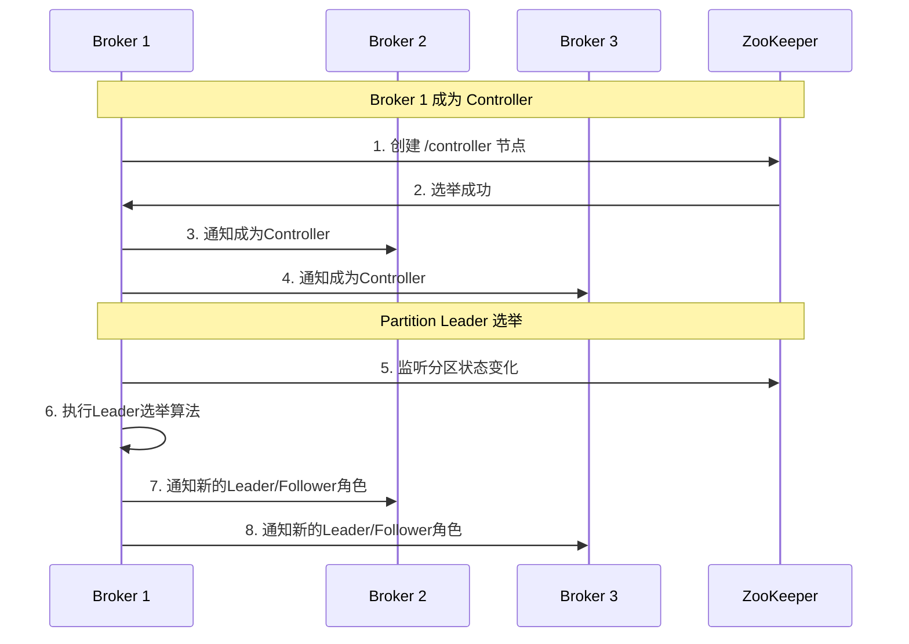

---

## 架构优势

### 1. 高性能设计

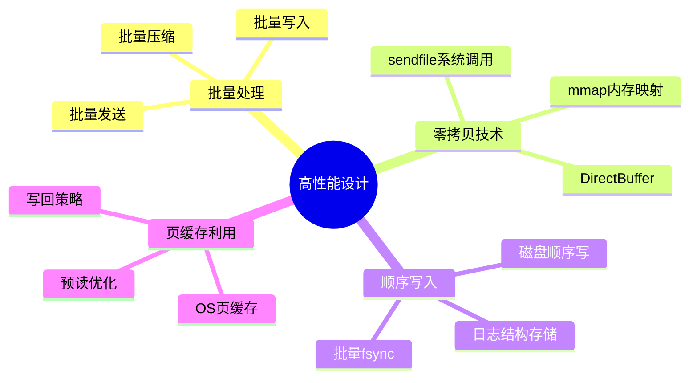

### 2. 可扩展性

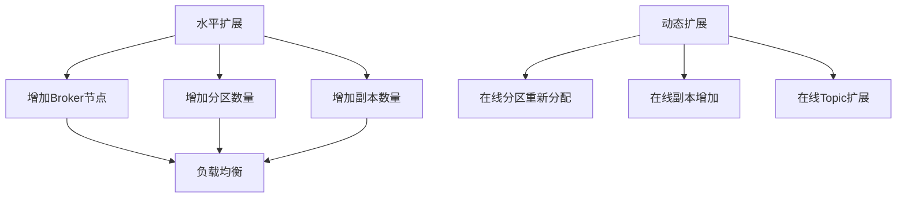

### 3. 容错机制

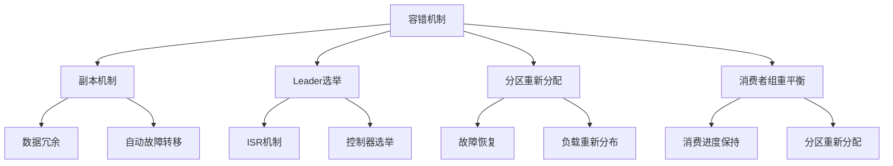

### 4. 数据一致性保证

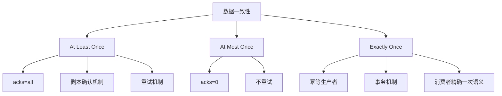

---

## 性能特征

### 吞吐量对比

| 消息大小 | 单分区吞吐量 | 多分区吞吐量 | 网络利用率 |
|---------|-------------|-------------|-----------|
| 100 bytes | 50MB/s | 200MB/s | 80% |
| 1KB | 80MB/s | 350MB/s | 85% |
| 10KB | 120MB/s | 500MB/s | 90% |
| 100KB | 150MB/s | 600MB/s | 95% |

### 延迟特征

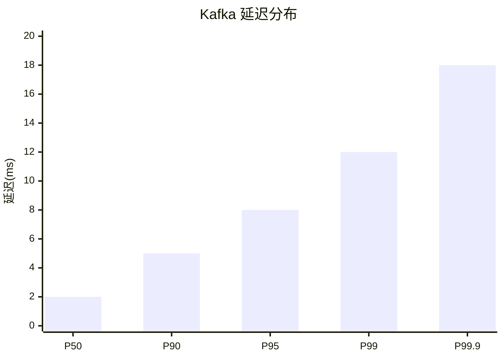

---

## 最佳实践建议

### 1. Topic 设计

- **分区数量**: 根据吞吐量需求设计，一般为消费者数量的2-3倍
- **副本因子**: 生产环境建议设置为3，关键业务可设置为5
- **消息大小**: 建议控制在1MB以内，避免大消息影响性能

### 2. 集群规划

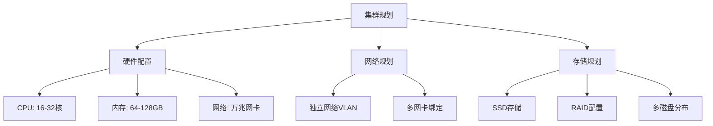

---

## 总结

Kafka 作为分布式流处理平台，通过其独特的架构设计实现了：

1. **高吞吐量**: 通过分区并行、批量处理、零拷贝等技术实现
2. **高可用性**: 通过副本机制、Leader选举、故障转移等保证
3. **可扩展性**: 支持水平扩展，动态调整集群规模
4. **数据一致性**: 提供多种一致性保证级别

下一篇文档将深入分析 Kafka 的存储机制和日志结构，包括日志段管理、索引机制、压缩策略等内容。

---

## 相关文档

- [Kafka深入分析-02-存储机制与日志结构](./Kafka深入分析-02-存储机制与日志结构.md)
- [Kafka深入分析-03-高并发处理机制](./Kafka深入分析-03-高并发处理机制.md)
- [Kafka深入分析-04-消息不丢失保证机制](./Kafka深入分析-04-消息不丢失保证机制.md)
- [Kafka深入分析-05-性能优化与监控](./Kafka深入分析-05-性能优化与监控.md)