# Kafka 深入分析 - 02 存储机制与日志结构

## 文档概述

本文档是 Kafka 深入分析系列的第二篇，深入分析 Kafka 的存储机制、日志结构、文件组织形式以及存储优化策略。

---

## 目录

1. [存储架构概览](#存储架构概览)
2. [日志结构详解](#日志结构详解)
3. [索引机制](#索引机制)
4. [压缩与清理策略](#压缩与清理策略)
5. [存储性能优化](#存储性能优化)
6. [故障恢复机制](#故障恢复机制)

---

## 存储架构概览

### Kafka 存储层次结构

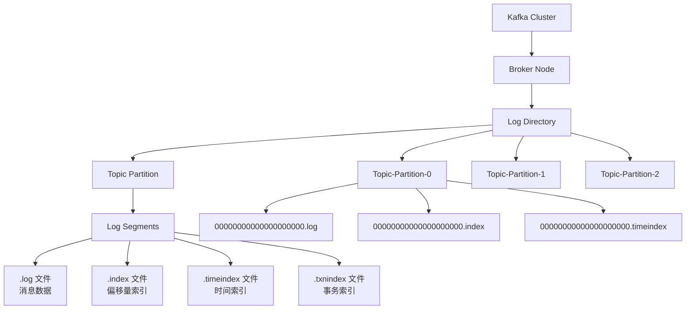

### 目录结构示例

```
/var/kafka-logs/
├── my-topic-0/                    # Topic分区目录
│   ├── 00000000000000000000.log   # 日志文件
│   ├── 00000000000000000000.index # 偏移量索引
│   ├── 00000000000000000000.timeindex # 时间索引
│   ├── 00000000000000001000.log   # 下一个segment
│   ├── 00000000000000001000.index
│   ├── 00000000000000001000.timeindex
│   └── leader-epoch-checkpoint    # Leader纪元检查点
├── my-topic-1/
└── __consumer_offsets-0/          # 消费者偏移量存储
```

---

## 日志结构详解

### 1. 日志段（Log Segment）概念

Kafka 将每个分区的日志分割成多个段（Segment），每个段包含一定数量的消息。

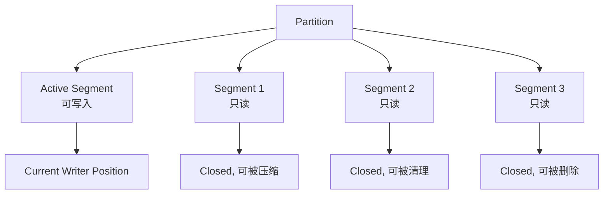

### 2. 消息格式

#### Record Format V2 (Magic Byte = 2)

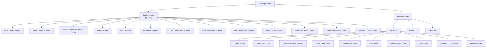

### 3. 日志段滚动策略

Kafka 根据以下条件创建新的日志段：

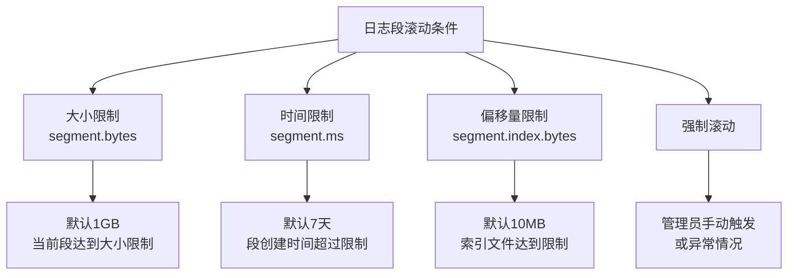

### 4. 写入流程详解

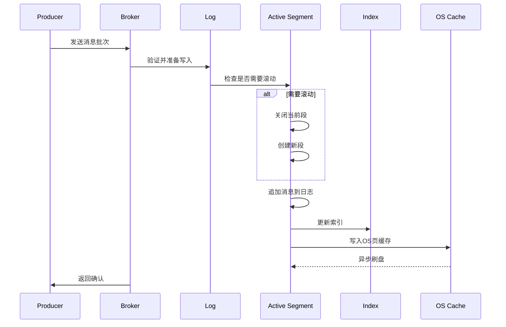

---

## 索引机制

### 1. 偏移量索引（Offset Index）

偏移量索引用于快速定位特定偏移量的消息在日志文件中的位置。

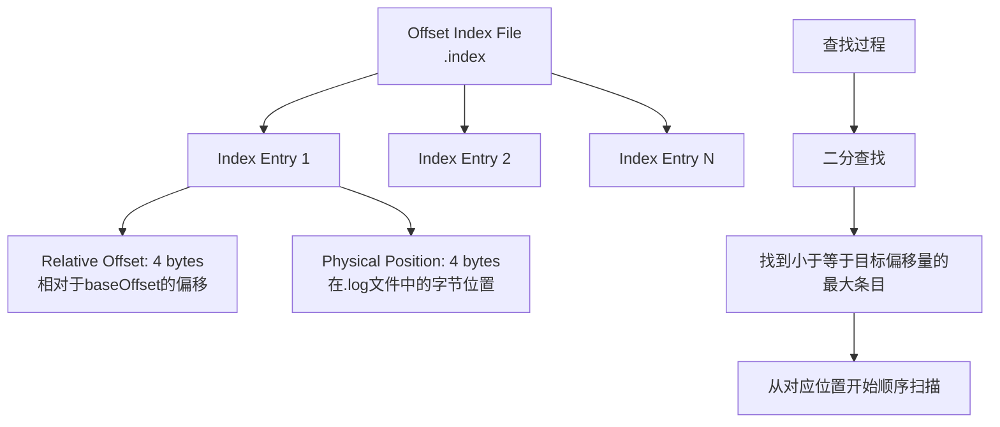

#### 索引查找示例

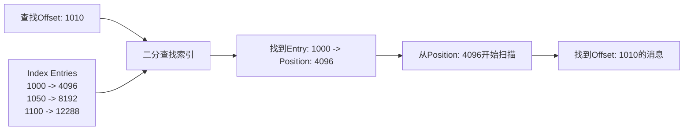

### 2. 时间索引（Time Index）

时间索引用于按时间戳查找消息，支持按时间进行数据清理和查询。

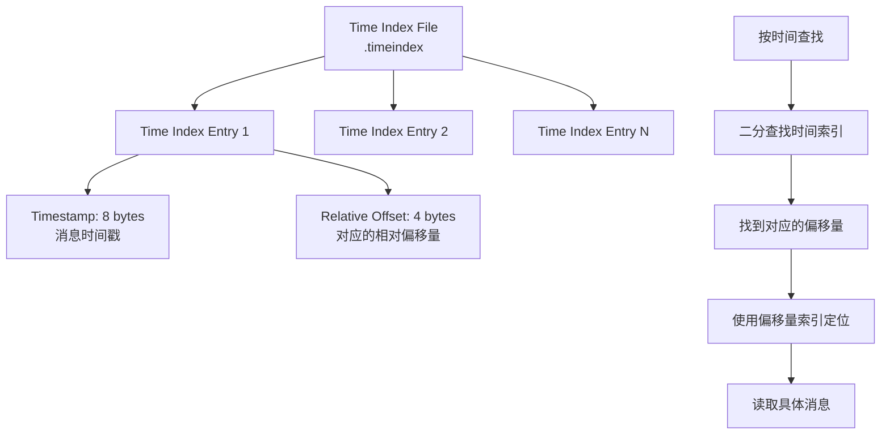

### 3. 事务索引（Transaction Index）

事务索引用于支持 Kafka 的事务功能，记录事务的开始和结束位置。

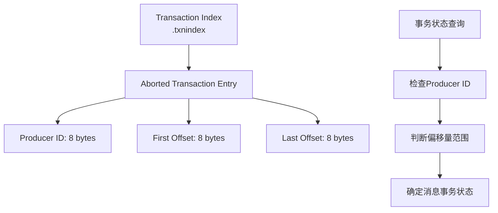

### 4. 索引构建过程

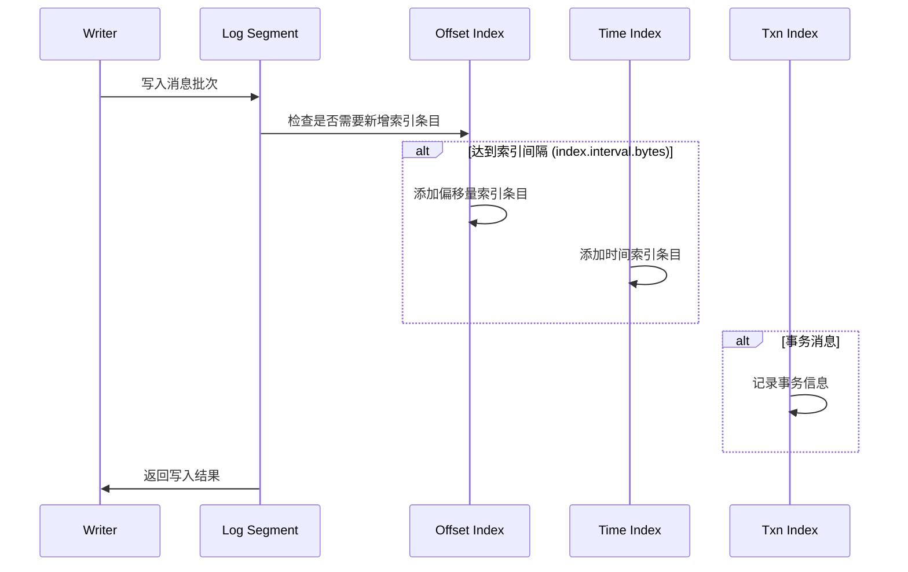

---

## 压缩与清理策略

### 1. 日志清理策略

Kafka 提供两种日志清理策略：

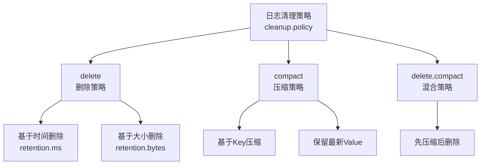

### 2. 删除策略详解

#### 基于时间的删除

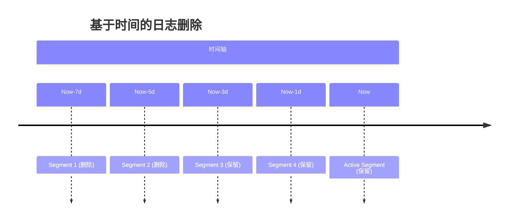

#### 基于大小的删除

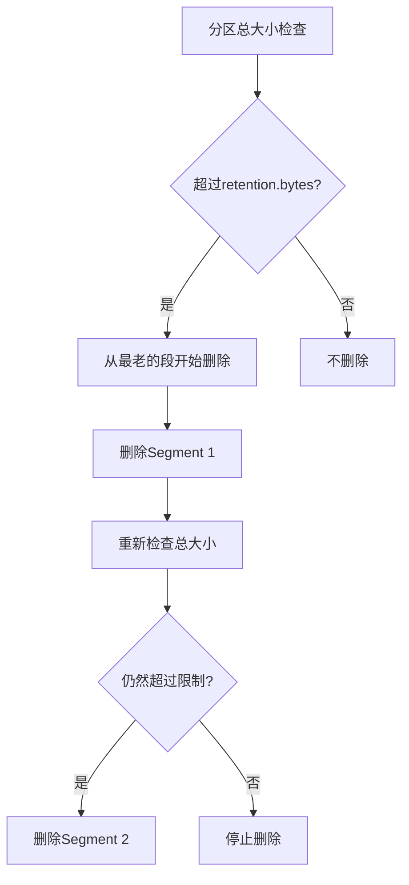

### 3. 压缩策略详解

#### Log Compaction 原理

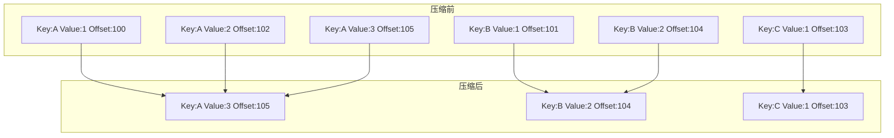

#### 压缩执行流程

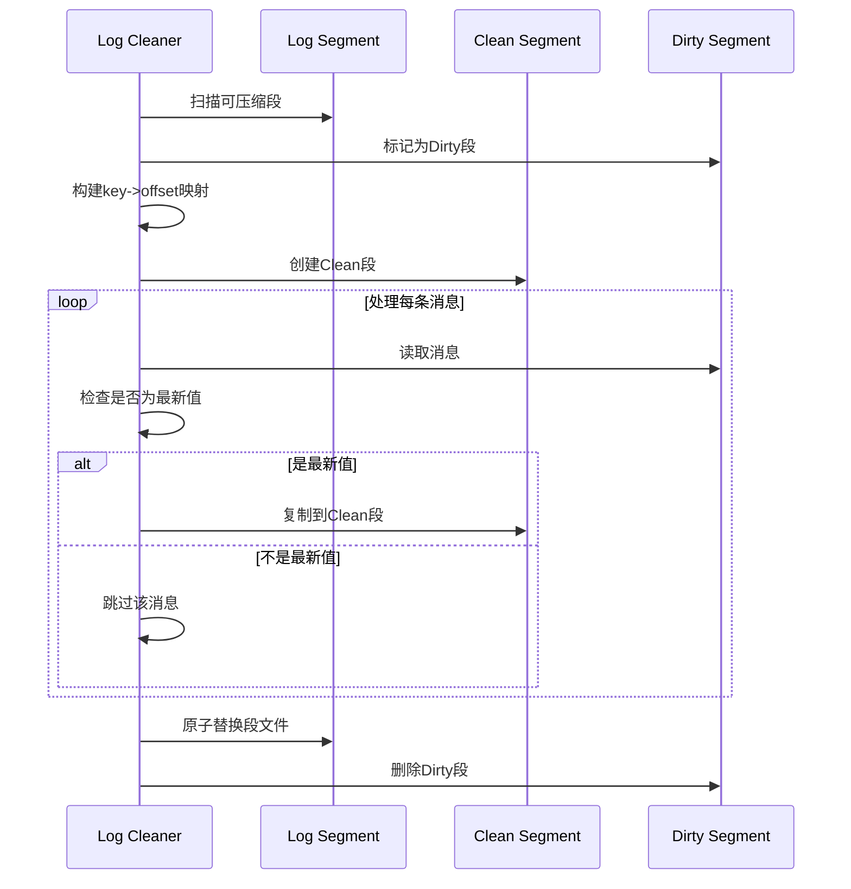

### 4. 清理线程管理

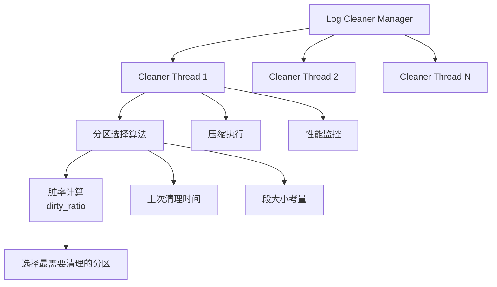

---

## 存储性能优化

### 1. 磁盘I/O优化

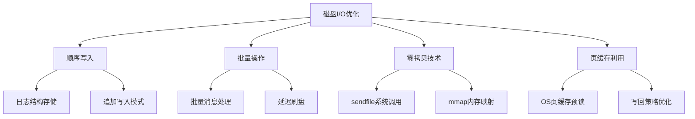

#### 零拷贝技术实现

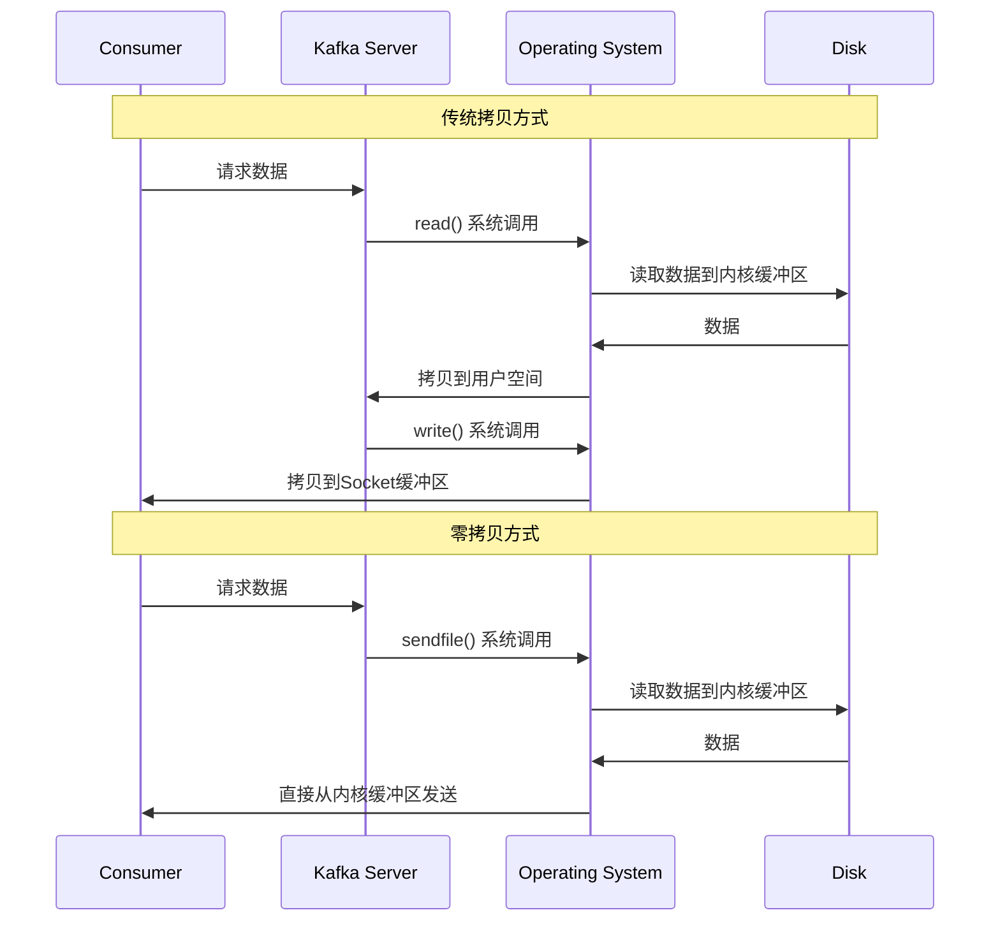

### 2. 内存管理优化

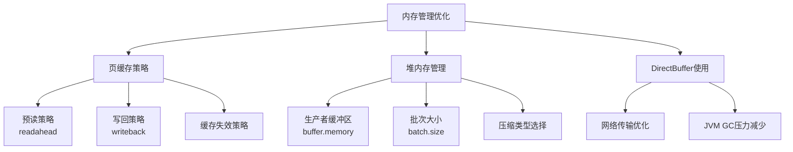

### 3. 文件系统优化

推荐的文件系统配置：

```bash
# ext4文件系统挂载选项
/dev/sdb1 /var/kafka-logs ext4 noatime,data=writeback,barrier=0,nobh 0 1

# XFS文件系统挂载选项
/dev/sdb1 /var/kafka-logs xfs noatime,largeio,inode64,swalloc 0 1
```

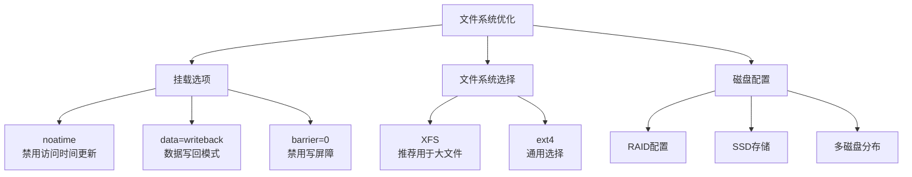

---

## 故障恢复机制

### 1. 数据一致性保证

#### Leader选举后的恢复

```mermaid
sequenceDiagram
    participant OL as Old Leader (Failed)
    participant NL as New Leader
    participant F1 as Follower 1
    participant F2 as Follower 2
    participant C as Controller

    OL-xNL: 网络分区/宕机
    C->>NL: 选举为新Leader
    NL->>F1: 发送LeaderAndIsr请求
    NL->>F2: 发送LeaderAndIsr请求
    F1->>NL: 同步日志到HW
    F2->>NL: 同步日志到HW
    NL->>NL: 截断超过HW的日志
    NL->>C: 确认Leader身份
```

### 2. 日志恢复过程

#### 启动时日志恢复

```mermaid
graph TD
    A[Broker启动] --> B[读取所有分区目录]
    B --> C[每个分区恢复过程]
    C --> D[读取leader-epoch-checkpoint]
    D --> E[恢复日志段]
    E --> F[验证索引文件]
    F --> G[重建损坏的索引]
    G --> H[更新HW和LEO]
    H --> I[完成恢复]

    J[异常情况处理] --> K[日志截断]
    J --> L[索引重建]
    J --> M[数据验证]
```

#### 索引重建流程

```mermaid
sequenceDiagram
    participant B as Broker
    participant L as Log Segment
    participant I as Index Files
    participant V as Validator

    B->>L: 启动时检查段文件
    L->>I: 验证索引文件完整性
    alt 索引文件损坏
        I->>I: 删除损坏的索引文件
        L->>I: 重新扫描日志文件
        I->>I: 重建偏移量索引
        I->>I: 重建时间索引
        I->>V: 验证重建结果
        V->>B: 恢复完成
    else 索引文件正常
        I->>B: 直接使用现有索引
    end
```

### 3. 分区恢复策略

```mermaid
graph TD
    A[分区恢复策略] --> B[Unclean Leader Election]
    A --> C[Min In-Sync Replicas]
    A --> D[Log Recovery]

    B --> E[unclean.leader.election.enable=true<br/>允许非ISR副本成为Leader]
    B --> F[可能丢失数据但保证可用性]

    C --> G[min.insync.replicas=2<br/>最少同步副本数]
    C --> H[保证数据一致性]

    D --> I[从检查点恢复]
    D --> J[日志截断到HW]
    D --> K[重新同步数据]
```

### 4. 数据恢复工具

Kafka 提供了多种工具用于数据恢复：

```mermaid
graph TD
    A[Kafka恢复工具] --> B[kafka-log-dirs.sh<br/>检查日志目录状态]
    A --> C[kafka-dump-log.sh<br/>查看日志内容]
    A --> D[kafka-preferred-replica-election.sh<br/>触发副本选举]
    A --> E[kafka-reassign-partitions.sh<br/>重新分配分区]

    B --> F[磁盘使用情况]
    B --> G[分区分布状态]

    C --> H[消息内容查看]
    C --> I[索引内容查看]

    D --> J[恢复首选副本]
    D --> K[负载均衡]

    E --> L[故障恢复]
    E --> M[扩容迁移]
```

---

## 存储配置优化

### 关键配置参数

| 配置项 | 推荐值 | 说明 |
|--------|--------|------|
| `log.segment.bytes` | 1GB | 日志段大小 |
| `log.retention.hours` | 168 (7天) | 数据保留时间 |
| `log.retention.bytes` | -1 (无限制) | 数据保留大小 |
| `log.cleanup.policy` | delete | 清理策略 |
| `num.io.threads` | 8 | I/O线程数 |
| `num.network.threads` | 3 | 网络线程数 |
| `socket.send.buffer.bytes` | 102400 | Socket发送缓冲区 |
| `socket.receive.buffer.bytes` | 102400 | Socket接收缓冲区 |
| `log.flush.interval.messages` | 10000 | 刷盘消息间隔 |
| `log.flush.interval.ms` | 1000 | 刷盘时间间隔 |

### JVM优化配置

```bash
# 推荐的JVM参数配置
export KAFKA_HEAP_OPTS="-Xmx8g -Xms8g"
export KAFKA_JVM_PERFORMANCE_OPTS="-server -XX:+UseG1GC -XX:MaxGCPauseMillis=20 -XX:InitiatingHeapOccupancyPercent=35 -XX:+ExplicitGCInvokesConcurrent -Djava.awt.headless=true"
export KAFKA_JVM_PERFORMANCE_OPTS="$KAFKA_JVM_PERFORMANCE_OPTS -XX:MetaspaceSize=96m -XX:+UseCompressedOops"
export KAFKA_JVM_PERFORMANCE_OPTS="$KAFKA_JVM_PERFORMANCE_OPTS -XX:+UnlockExperimentalVMOptions -XX:+UseCGroupMemoryLimitForHeap"
```

---

## 监控指标

### 存储相关监控指标

```mermaid
graph TD
    A[存储监控指标] --> B[日志大小指标]
    A --> C[段文件指标]
    A --> D[I/O性能指标]
    A --> E[清理指标]

    B --> F[LogSize<br/>总日志大小]
    B --> G[LogStartOffset<br/>起始偏移量]
    B --> H[LogEndOffset<br/>结束偏移量]

    C --> I[NumLogSegments<br/>段文件数量]
    C --> J[ActiveControllerCount<br/>活跃控制器数]

    D --> K[BytesInPerSec<br/>写入速率]
    D --> L[BytesOutPerSec<br/>读取速率]
    D --> M[LogFlushRateAndTimeMs<br/>刷盘性能]

    E --> N[LogCleanerRecopyRatio<br/>清理复制比例]
    E --> O[LogCleanerMaxDirtyRatio<br/>最大脏数据比例]
```

---

## 总结

Kafka 的存储机制通过以下关键技术实现高性能和可靠性：

1. **日志结构存储**: 顺序写入，批量操作，零拷贝技术
2. **多层索引机制**: 偏移量索引、时间索引、事务索引
3. **灵活的清理策略**: 支持删除和压缩两种模式
4. **完善的故障恢复**: 多种恢复机制保证数据完整性

下一篇文档将深入分析 Kafka 的高并发处理机制，包括网络模型、线程模型、批处理策略等。

---

## 相关文档

- [Kafka深入分析-01-架构概述与核心概念](./Kafka深入分析-01-架构概述与核心概念.md)
- [Kafka深入分析-03-高并发处理机制](./Kafka深入分析-03-高并发处理机制.md)
- [Kafka深入分析-04-消息不丢失保证机制](./Kafka深入分析-04-消息不丢失保证机制.md)
- [Kafka深入分析-05-性能优化与监控](./Kafka深入分析-05-性能优化与监控.md)