# Kafka 深入分析 - 03 高并发处理机制

## 文档概述

本文档是 Kafka 深入分析系列的第三篇，深入分析 Kafka 如何实现高并发处理，包括网络模型、线程模型、批处理机制以及各种性能优化策略。

---

## 目录

1. [高并发架构概览](#高并发架构概览)
2. [网络模型详解](#网络模型详解)
3. [线程模型分析](#线程模型分析)
4. [批处理机制](#批处理机制)
5. [分区并行化](#分区并行化)
6. [客户端优化策略](#客户端优化策略)
7. [性能调优实践](#性能调优实践)

---

## 高并发架构概览

### Kafka 高并发设计原则

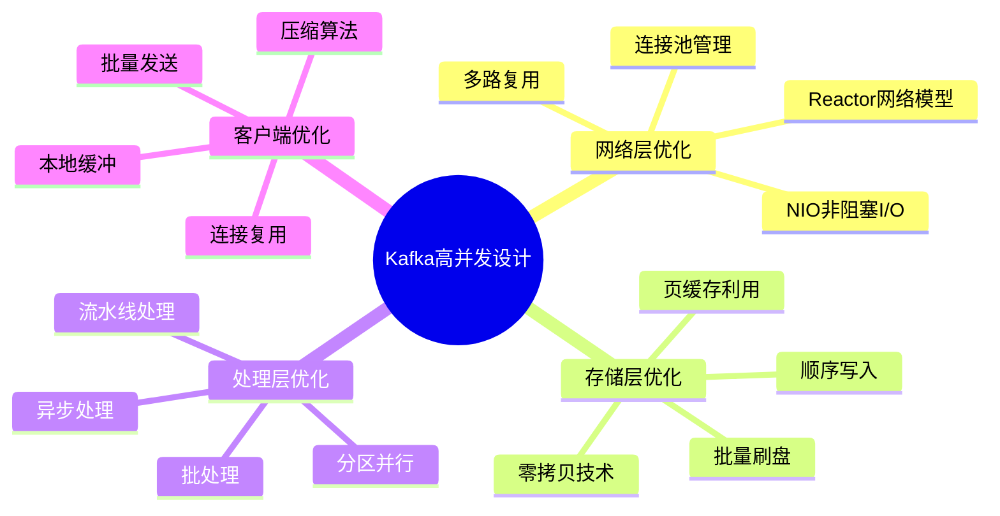
```mermaid
mindmap
  root((Kafka高并发设计))
    网络层优化
      Reactor网络模型
      NIO非阻塞I/O
      连接池管理
      多路复用
    存储层优化
      顺序写入
      零拷贝技术
      页缓存利用
      批量刷盘
    处理层优化
      分区并行
      批处理
      异步处理
      流水线处理
    客户端优化
      批量发送
      压缩算法
      连接复用
      本地缓冲
```

### 整体并发处理流程

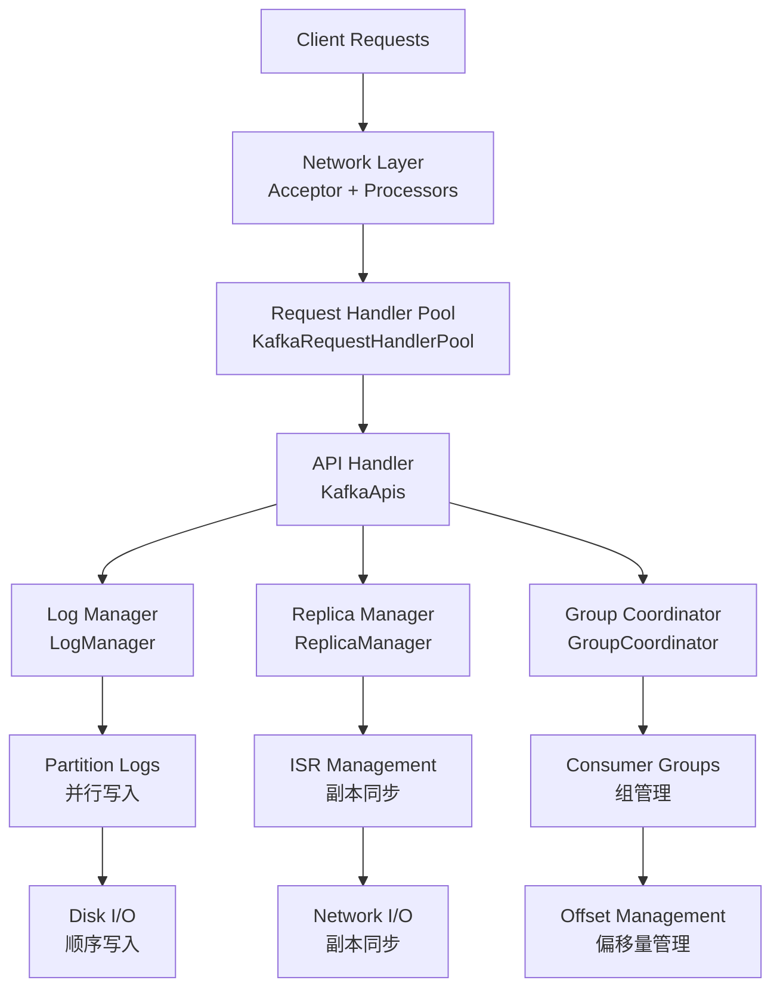
```mermaid
graph TD
    A[Client Requests] --> B[Network Layer<br/>Acceptor + Processors]
    B --> C[Request Handler Pool<br/>KafkaRequestHandlerPool]
    C --> D[API Handler<br/>KafkaApis]
    D --> E[Log Manager<br/>LogManager]
    D --> F[Replica Manager<br/>ReplicaManager]
    D --> G[Group Coordinator<br/>GroupCoordinator]

    E --> H[Partition Logs<br/>并行写入]
    F --> I[ISR Management<br/>副本同步]
    G --> J[Consumer Groups<br/>组管理]

    H --> K[Disk I/O<br/>顺序写入]
    I --> L[Network I/O<br/>副本同步]
    J --> M[Offset Management<br/>偏移量管理]
```

---

## 网络模型详解

### 1. Reactor 网络模型

Kafka 采用 Reactor 模式处理网络 I/O，这是高并发服务器的经典设计模式。

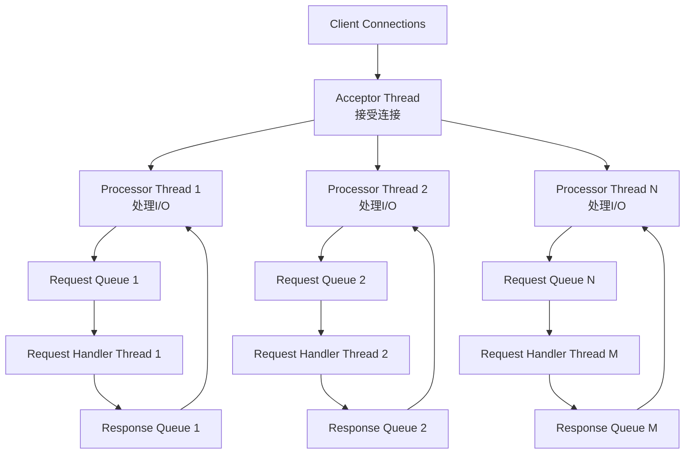
```mermaid
graph TD
    A[Client Connections] --> B[Acceptor Thread<br/>接受连接]
    B --> C[Processor Thread 1<br/>处理I/O]
    B --> D[Processor Thread 2<br/>处理I/O]
    B --> E[Processor Thread N<br/>处理I/O]

    C --> F[Request Queue 1]
    D --> G[Request Queue 2]
    E --> H[Request Queue N]

    F --> I[Request Handler Thread 1]
    G --> J[Request Handler Thread 2]
    H --> K[Request Handler Thread M]

    I --> L[Response Queue 1]
    J --> M[Response Queue 2]
    K --> N[Response Queue M]

    L --> C
    M --> D
    N --> E
```

### 2. 连接处理流程

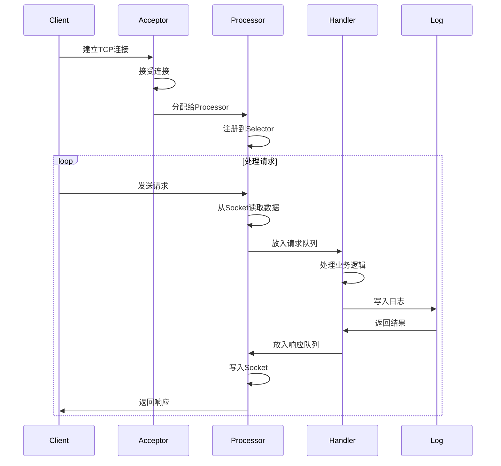
```mermaid
sequenceDiagram
    participant C as Client
    participant A as Acceptor
    participant P as Processor
    participant H as Handler
    participant L as Log

    C->>A: 建立TCP连接
    A->>A: 接受连接
    A->>P: 分配给Processor
    P->>P: 注册到Selector

    loop 处理请求
        C->>P: 发送请求
        P->>P: 从Socket读取数据
        P->>H: 放入请求队列
        H->>H: 处理业务逻辑
        H->>L: 写入日志
        L->>H: 返回结果
        H->>P: 放入响应队列
        P->>P: 写入Socket
        P->>C: 返回响应
    end
```

### 3. NIO Selector 模型

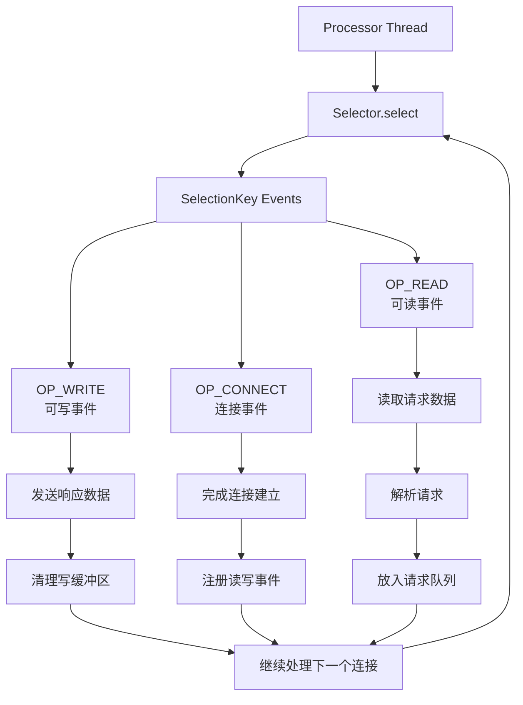
```mermaid
graph TD
    A[Processor Thread] --> B[Selector.select]
    B --> C[SelectionKey Events]

    C --> D[OP_READ<br/>可读事件]
    C --> E[OP_WRITE<br/>可写事件]
    C --> F[OP_CONNECT<br/>连接事件]

    D --> G[读取请求数据]
    E --> H[发送响应数据]
    F --> I[完成连接建立]

    G --> J[解析请求]
    H --> K[清理写缓冲区]
    I --> L[注册读写事件]

    J --> M[放入请求队列]
    K --> N[继续处理下一个连接]
    L --> N
    M --> N
    N --> B
```

### 4. 连接池管理

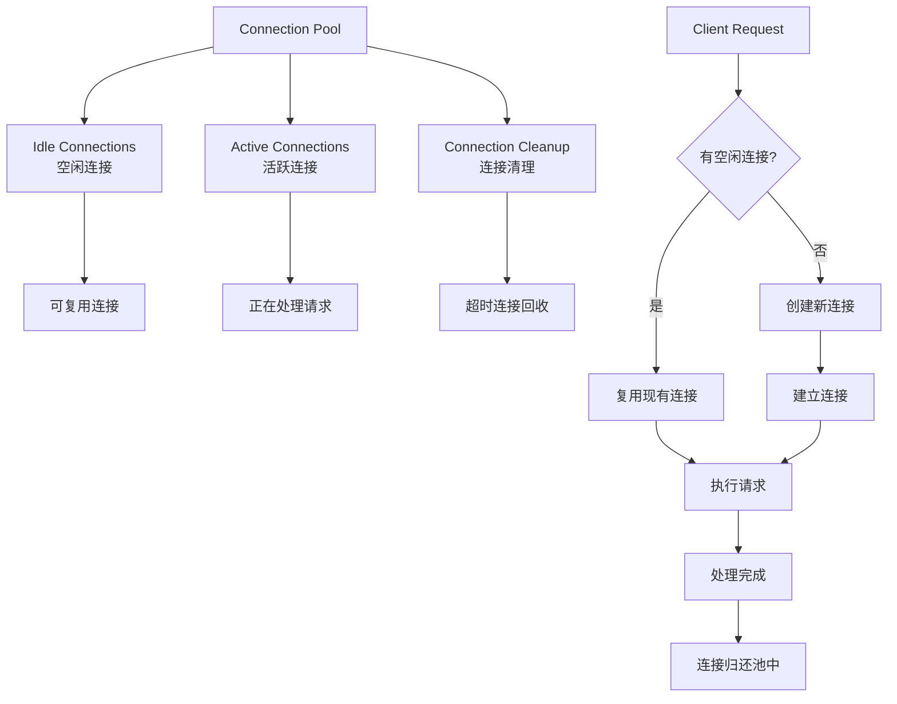
```mermaid
graph TD
    A[Connection Pool] --> B[Idle Connections<br/>空闲连接]
    A --> C[Active Connections<br/>活跃连接]
    A --> D[Connection Cleanup<br/>连接清理]

    B --> E[可复用连接]
    C --> F[正在处理请求]
    D --> G[超时连接回收]

    H[Client Request] --> I{有空闲连接?}
    I -->|是| J[复用现有连接]
    I -->|否| K[创建新连接]

    J --> L[执行请求]
    K --> M[建立连接]
    M --> L

    L --> N[处理完成]
    N --> O[连接归还池中]
```

---

## 线程模型分析

### 1. Kafka Broker 线程架构

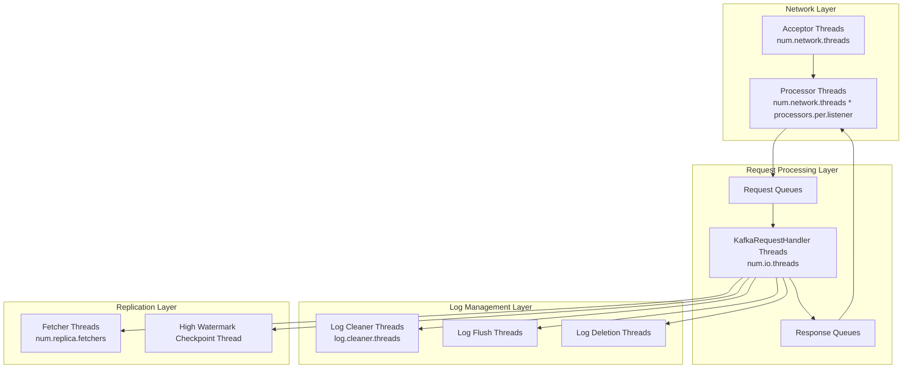
```mermaid
graph TD
    subgraph "Network Layer"
        A[Acceptor Threads<br/>num.network.threads]
        B[Processor Threads<br/>num.network.threads * processors.per.listener]
    end

    subgraph "Request Processing Layer"
        C[KafkaRequestHandler Threads<br/>num.io.threads]
        D[Request Queues]
        E[Response Queues]
    end

    subgraph "Log Management Layer"
        F[Log Cleaner Threads<br/>log.cleaner.threads]
        G[Log Flush Threads]
        H[Log Deletion Threads]
    end

    subgraph "Replication Layer"
        I[Fetcher Threads<br/>num.replica.fetchers]
        J[High Watermark Checkpoint Thread]
    end

    A --> B
    B --> D
    D --> C
    C --> E
    E --> B

    C --> F
    C --> G
    C --> H
    C --> I
    C --> J
```

### 2. 线程类型详解

#### Acceptor Thread（接收线程）
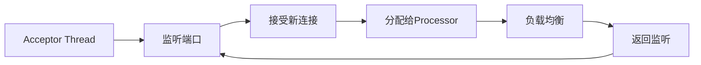
```mermaid
graph LR
    A[Acceptor Thread] --> B[监听端口]
    B --> C[接受新连接]
    C --> D[分配给Processor]
    D --> E[负载均衡]
    E --> F[返回监听]
    F --> B
```

#### Processor Thread（处理线程）
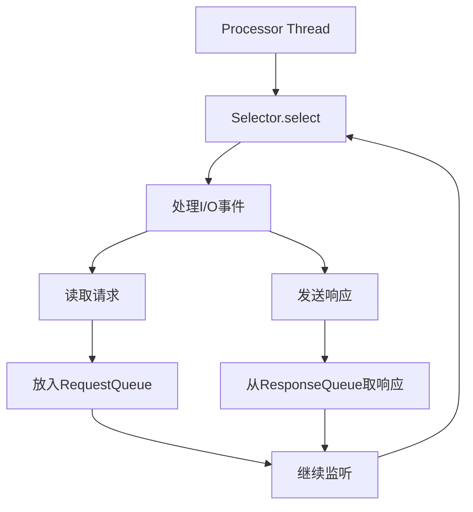
```mermaid
graph TD
    A[Processor Thread] --> B[Selector.select]
    B --> C[处理I/O事件]
    C --> D[读取请求]
    C --> E[发送响应]
    D --> F[放入RequestQueue]
    E --> G[从ResponseQueue取响应]
    F --> H[继续监听]
    G --> H
    H --> B
```

#### Request Handler Thread（请求处理线程）
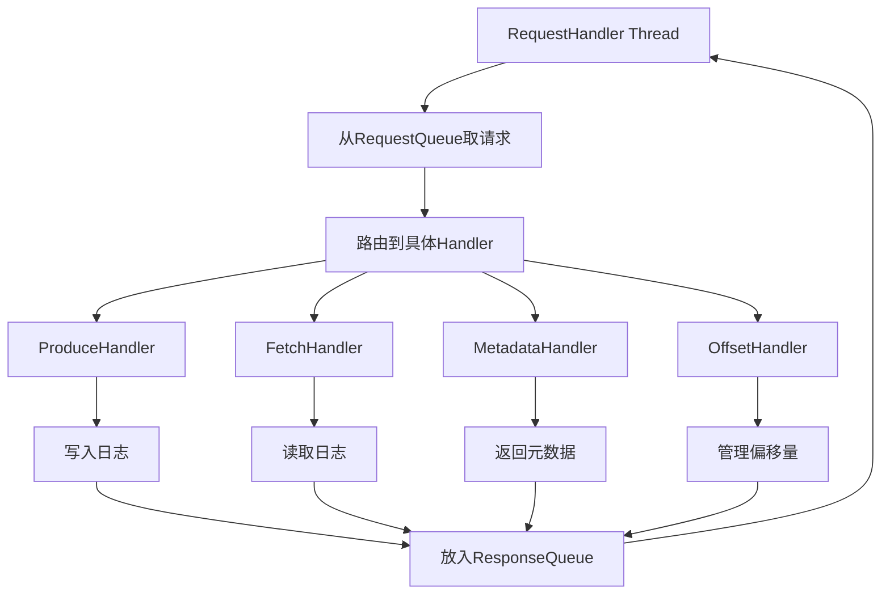
```mermaid
graph TD
    A[RequestHandler Thread] --> B[从RequestQueue取请求]
    B --> C[路由到具体Handler]
    C --> D[ProduceHandler]
    C --> E[FetchHandler]
    C --> F[MetadataHandler]
    C --> G[OffsetHandler]

    D --> H[写入日志]
    E --> I[读取日志]
    F --> J[返回元数据]
    G --> K[管理偏移量]

    H --> L[放入ResponseQueue]
    I --> L
    J --> L
    K --> L
    L --> A
```

### 3. 线程池配置优化

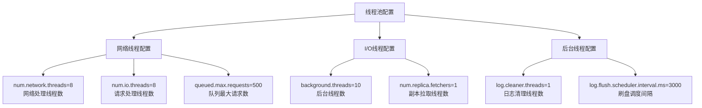
```mermaid
graph TD
    A[线程池配置] --> B[网络线程配置]
    A --> C[I/O线程配置]
    A --> D[后台线程配置]

    B --> E[num.network.threads=8<br/>网络处理线程数]
    B --> F[num.io.threads=8<br/>请求处理线程数]
    B --> G[queued.max.requests=500<br/>队列最大请求数]

    C --> H[background.threads=10<br/>后台线程数]
    C --> I[num.replica.fetchers=1<br/>副本拉取线程数]

    D --> J[log.cleaner.threads=1<br/>日志清理线程数]
    D --> K[log.flush.scheduler.interval.ms=3000<br/>刷盘调度间隔]
```

---

## 批处理机制

### 1. Producer 批处理

#### 消息批处理流程

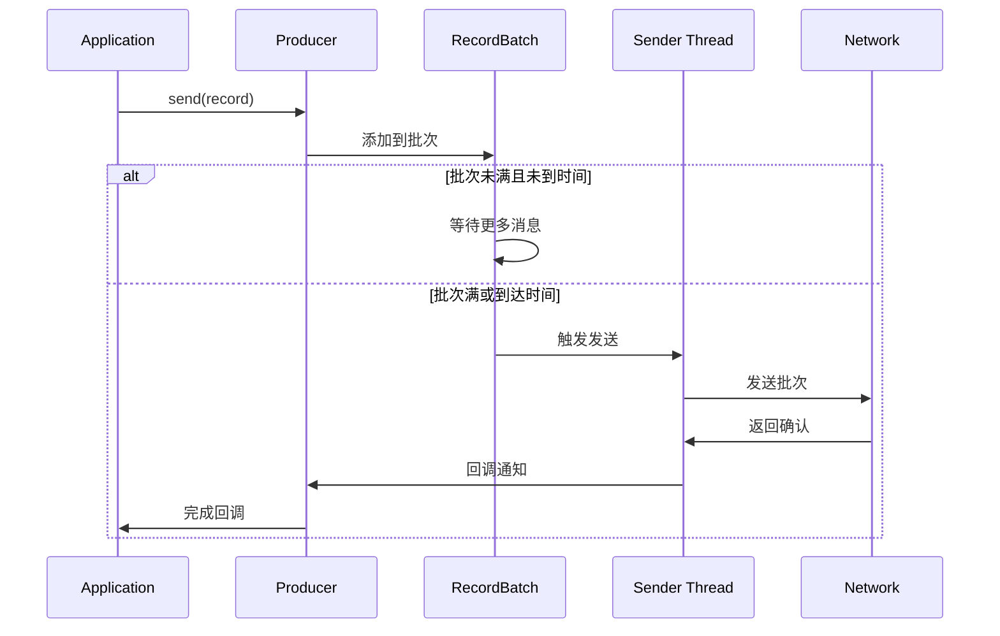
```mermaid
sequenceDiagram
    participant App as Application
    participant P as Producer
    participant B as RecordBatch
    participant S as Sender Thread
    participant N as Network

    App->>P: send(record)
    P->>B: 添加到批次
    alt 批次未满且未到时间
        B->>B: 等待更多消息
    else 批次满或到达时间
        B->>S: 触发发送
        S->>N: 发送批次
        N->>S: 返回确认
        S->>P: 回调通知
        P->>App: 完成回调
    end
```

#### RecordAccumulator 机制

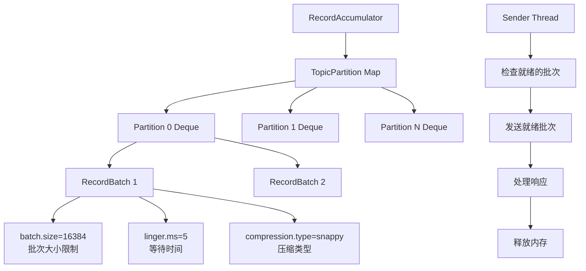
```mermaid
graph TD
    A[RecordAccumulator] --> B[TopicPartition Map]
    B --> C[Partition 0 Deque]
    B --> D[Partition 1 Deque]
    B --> E[Partition N Deque]

    C --> F[RecordBatch 1]
    C --> G[RecordBatch 2]

    F --> H[batch.size=16384<br/>批次大小限制]
    F --> I[linger.ms=5<br/>等待时间]
    F --> J[compression.type=snappy<br/>压缩类型]

    K[Sender Thread] --> L[检查就绪的批次]
    L --> M[发送就绪批次]
    M --> N[处理响应]
    N --> O[释放内存]
```

### 2. Consumer 批处理

#### 批量拉取机制

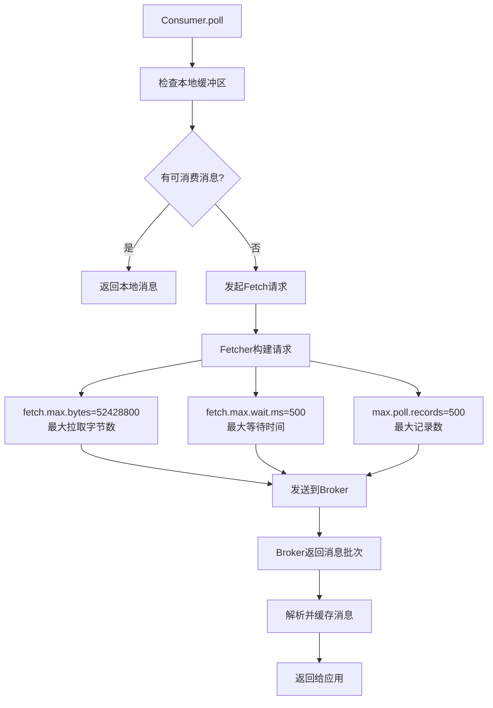
```mermaid
graph TD
    A[Consumer.poll] --> B[检查本地缓冲区]
    B --> C{有可消费消息?}
    C -->|是| D[返回本地消息]
    C -->|否| E[发起Fetch请求]

    E --> F[Fetcher构建请求]
    F --> G[fetch.max.bytes=52428800<br/>最大拉取字节数]
    F --> H[fetch.max.wait.ms=500<br/>最大等待时间]
    F --> I[max.poll.records=500<br/>最大记录数]

    G --> J[发送到Broker]
    H --> J
    I --> J

    J --> K[Broker返回消息批次]
    K --> L[解析并缓存消息]
    L --> M[返回给应用]
```

### 3. Broker 批处理

#### 日志批量写入

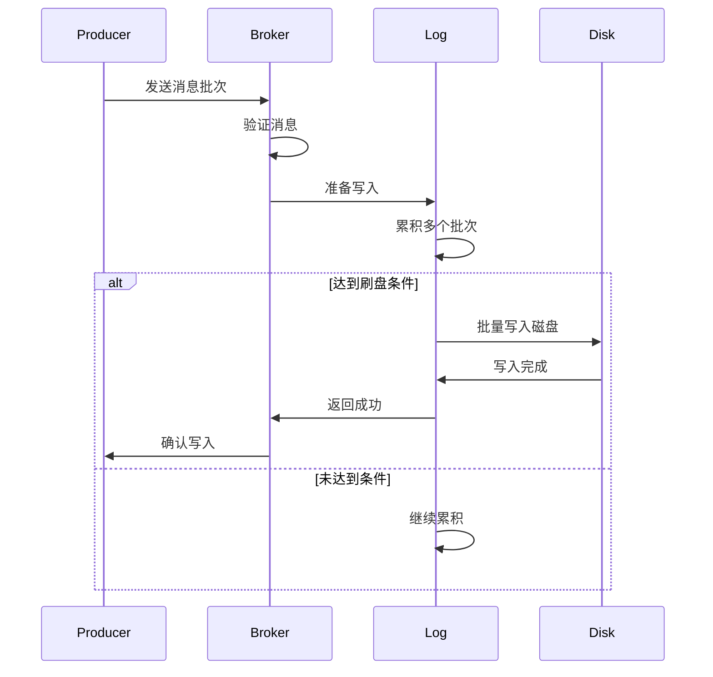
```mermaid
sequenceDiagram
    participant P as Producer
    participant B as Broker
    participant L as Log
    participant D as Disk

    P->>B: 发送消息批次
    B->>B: 验证消息
    B->>L: 准备写入
    L->>L: 累积多个批次
    alt 达到刷盘条件
        L->>D: 批量写入磁盘
        D->>L: 写入完成
        L->>B: 返回成功
        B->>P: 确认写入
    else 未达到条件
        L->>L: 继续累积
    end
```

---

## 分区并行化

### 1. 分区设计原理

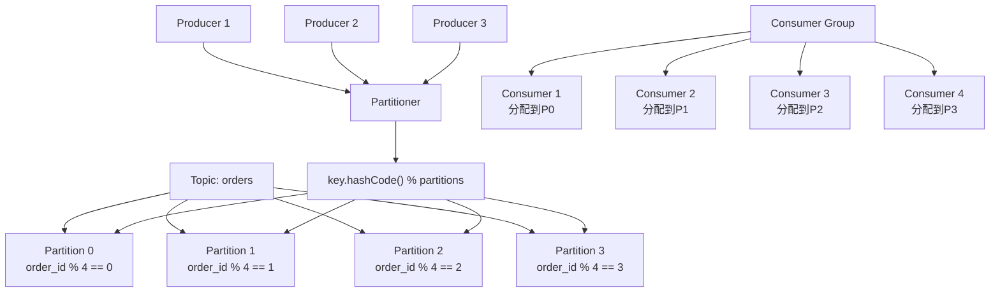
```mermaid
graph TD
    A[Topic: orders] --> B[Partition 0<br/>order_id % 4 == 0]
    A --> C[Partition 1<br/>order_id % 4 == 1]
    A --> D[Partition 2<br/>order_id % 4 == 2]
    A --> E[Partition 3<br/>order_id % 4 == 3]

    F[Producer 1] --> G[Partitioner]
    H[Producer 2] --> G
    I[Producer 3] --> G

    G --> J["key.hashCode() % partitions"]
    J --> B
    J --> C
    J --> D
    J --> E

    K[Consumer Group] --> L[Consumer 1<br/>分配到P0]
    K --> M[Consumer 2<br/>分配到P1]
    K --> N[Consumer 3<br/>分配到P2]
    K --> O[Consumer 4<br/>分配到P3]
```

### 2. 分区分配策略

#### Range Assignment Strategy
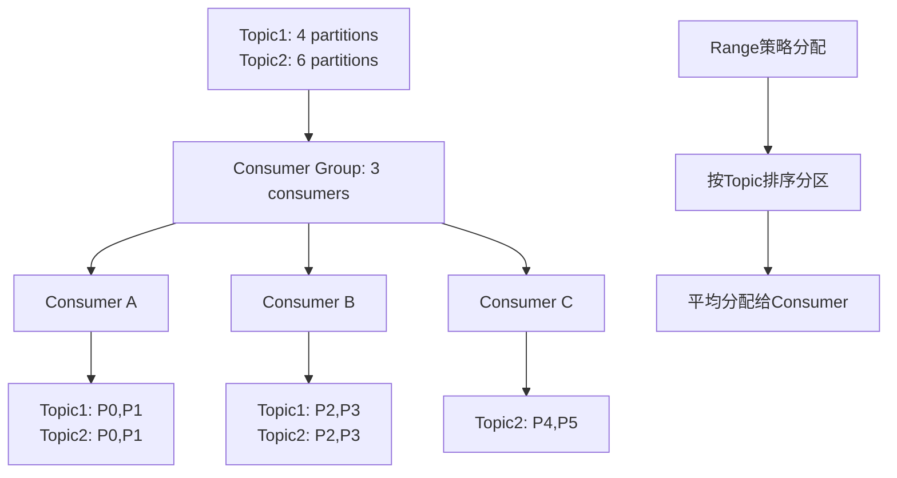
```mermaid
graph TD
    A[Topic1: 4 partitions<br/>Topic2: 6 partitions] --> B[Consumer Group: 3 consumers]
    B --> C[Consumer A]
    B --> D[Consumer B]
    B --> E[Consumer C]

    F[Range策略分配] --> G[按Topic排序分区]
    G --> H[平均分配给Consumer]

    C --> I[Topic1: P0,P1<br/>Topic2: P0,P1]
    D --> J[Topic1: P2,P3<br/>Topic2: P2,P3]
    E --> K[Topic2: P4,P5]
```

#### Round Robin Assignment Strategy
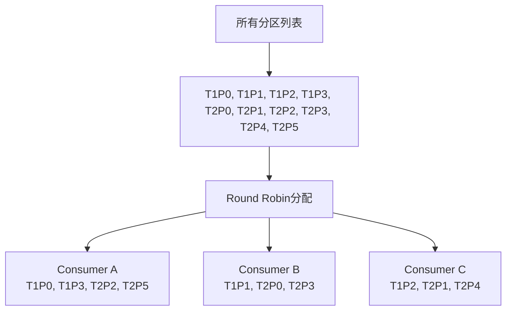
```mermaid
graph TD
    A[所有分区列表] --> B[T1P0, T1P1, T1P2, T1P3, T2P0, T2P1, T2P2, T2P3, T2P4, T2P5]
    B --> C[Round Robin分配]

    C --> D[Consumer A<br/>T1P0, T1P3, T2P2, T2P5]
    C --> E[Consumer B<br/>T1P1, T2P0, T2P3]
    C --> F[Consumer C<br/>T1P2, T2P1, T2P4]
```

### 3. 并行处理性能分析

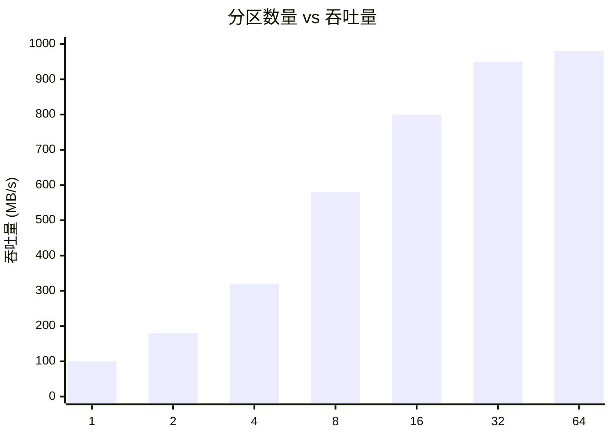
```mermaid
xychart-beta
    title "分区数量 vs 吞吐量"
    x-axis ["1", "2", "4", "8", "16", "32", "64"]
    y-axis "吞吐量 (MB/s)" 0 --> 1000
    bar [100, 180, 320, 580, 800, 950, 980]
```

### 4. 动态分区管理

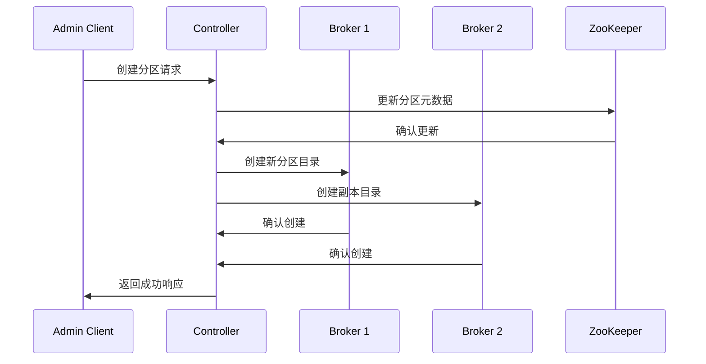
```mermaid
sequenceDiagram
    participant A as Admin Client
    participant C as Controller
    participant B1 as Broker 1
    participant B2 as Broker 2
    participant Z as ZooKeeper

    A->>C: 创建分区请求
    C->>Z: 更新分区元数据
    Z->>C: 确认更新
    C->>B1: 创建新分区目录
    C->>B2: 创建副本目录
    B1->>C: 确认创建
    B2->>C: 确认创建
    C->>A: 返回成功响应
```

---

## 客户端优化策略

### 1. Producer 优化配置

```mermaid
graph TD
    A[Producer优化] --> B[批处理优化]
    A --> C[压缩优化]
    A --> D[网络优化]
    A --> E[内存优化]

    B --> F[batch.size=16384<br/>批次大小]
    B --> G[linger.ms=5<br/>等待时间]
    B --> H[buffer.memory=33554432<br/>缓冲区大小]

    C --> I[compression.type=snappy<br/>压缩算法]
    C --> J[压缩比vs CPU权衡]

    D --> K[max.in.flight.requests.per.connection=5<br/>最大飞行请求数]
    D --> L[connections.max.idle.ms=540000<br/>连接空闲时间]

    E --> M[send.buffer.bytes=131072<br/>发送缓冲区]
    E --> N[receive.buffer.bytes=65536<br/>接收缓冲区]
```

#### Producer 配置示例

```java
Properties props = new Properties();
// 基础配置
props.put("bootstrap.servers", "localhost:9092");
props.put("key.serializer", "org.apache.kafka.common.serialization.StringSerializer");
props.put("value.serializer", "org.apache.kafka.common.serialization.StringSerializer");

// 高并发优化配置
props.put("batch.size", 32768);           // 32KB批次大小
props.put("linger.ms", 10);               // 等待10ms
props.put("buffer.memory", 67108864);     // 64MB缓冲区
props.put("compression.type", "snappy");   // 使用snappy压缩
props.put("max.in.flight.requests.per.connection", 5);
props.put("acks", "1");                   // 等待leader确认

// 重试配置
props.put("retries", 3);
props.put("retry.backoff.ms", 300);
```

### 2. Consumer 优化配置

```mermaid
graph TD
    A[Consumer优化] --> B[拉取优化]
    A --> C[处理优化]
    A --> D[偏移量管理]
    A --> E[并发优化]

    B --> F[fetch.min.bytes=1024<br/>最小拉取字节数]
    B --> G[fetch.max.wait.ms=500<br/>最大等待时间]
    B --> H[max.poll.records=500<br/>最大拉取记录数]

    C --> I[session.timeout.ms=30000<br/>会话超时时间]
    C --> J[max.poll.interval.ms=300000<br/>最大轮询间隔]

    D --> K[enable.auto.commit=false<br/>禁用自动提交]
    D --> L[手动提交偏移量]

    E --> M[多线程消费模式]
    E --> N[消费者组并行]
```

#### Consumer 配置示例

```java
Properties props = new Properties();
// 基础配置
props.put("bootstrap.servers", "localhost:9092");
props.put("group.id", "high-throughput-group");
props.put("key.deserializer", "org.apache.kafka.common.serialization.StringDeserializer");
props.put("value.deserializer", "org.apache.kafka.common.serialization.StringDeserializer");

// 高并发优化配置
props.put("fetch.min.bytes", 50000);         // 50KB最小拉取
props.put("fetch.max.wait.ms", 200);         // 200ms最大等待
props.put("max.poll.records", 1000);         // 1000条记录
props.put("session.timeout.ms", 10000);      // 10s会话超时
props.put("max.poll.interval.ms", 60000);    // 60s轮询间隔

// 偏移量管理
props.put("enable.auto.commit", false);      // 禁用自动提交
props.put("auto.offset.reset", "latest");    // 从最新开始消费
```

### 3. 多线程消费模式

#### 模式一：一个Consumer多线程处理

```mermaid
sequenceDiagram
    participant C as Consumer Thread
    participant Q as Message Queue
    participant W1 as Worker Thread 1
    participant W2 as Worker Thread 2
    participant W3 as Worker Thread 3

    loop 消费循环
        C->>C: poll()获取消息
        C->>Q: 将消息放入队列
        Q->>W1: 取消息处理
        Q->>W2: 取消息处理
        Q->>W3: 取消息处理
        W1->>W1: 处理业务逻辑
        W2->>W2: 处理业务逻辑
        W3->>W3: 处理业务逻辑
        W1-->>C: 处理完成
        W2-->>C: 处理完成
        W3-->>C: 处理完成
        C->>C: 提交偏移量
    end
```

#### 模式二：多个Consumer线程

```mermaid
graph TD
    A[Consumer Group] --> B[Consumer Thread 1]
    A --> C[Consumer Thread 2]
    A --> D[Consumer Thread 3]

    B --> E[Partition 0, 1]
    C --> F[Partition 2, 3]
    D --> G[Partition 4, 5]

    E --> H[独立处理消息]
    F --> I[独立处理消息]
    G --> J[独立处理消息]

    H --> K[独立提交偏移量]
    I --> L[独立提交偏移量]
    J --> M[独立提交偏移量]
```

---

## 性能调优实践

### 1. Broker 性能调优

#### JVM 参数优化

```bash
# 推荐的JVM配置
export KAFKA_HEAP_OPTS="-Xmx12g -Xms12g"
export KAFKA_JVM_PERFORMANCE_OPTS="-server \
  -XX:+UseG1GC \
  -XX:MaxGCPauseMillis=20 \
  -XX:InitiatingHeapOccupancyPercent=35 \
  -XX:+DisableExplicitGC \
  -XX:G1HeapRegionSize=16m \
  -XX:MetaspaceSize=96m \
  -XX:MinMetaspaceFreeRatio=50 \
  -XX:MaxMetaspaceFreeRatio=80 \
  -XX:+UseStringDeduplication"
```

#### 操作系统参数优化

```bash
# 网络参数优化
echo 'net.core.wmem_default = 262144' >> /etc/sysctl.conf
echo 'net.core.rmem_default = 262144' >> /etc/sysctl.conf
echo 'net.core.wmem_max = 16777216' >> /etc/sysctl.conf
echo 'net.core.rmem_max = 16777216' >> /etc/sysctl.conf

# 文件系统参数优化
echo 'vm.swappiness = 1' >> /etc/sysctl.conf
echo 'vm.dirty_background_ratio = 5' >> /etc/sysctl.conf
echo 'vm.dirty_ratio = 60' >> /etc/sysctl.conf

# 应用参数
sysctl -p
```

### 2. 压力测试工具

#### 使用 kafka-producer-perf-test.sh

```bash
# 生产者性能测试
kafka-producer-perf-test.sh \
  --topic perf-test \
  --num-records 1000000 \
  --record-size 1024 \
  --throughput 50000 \
  --producer-props \
    bootstrap.servers=localhost:9092 \
    batch.size=32768 \
    linger.ms=10 \
    compression.type=snappy \
    buffer.memory=67108864
```

#### 使用 kafka-consumer-perf-test.sh

```bash
# 消费者性能测试
kafka-consumer-perf-test.sh \
  --topic perf-test \
  --bootstrap-server localhost:9092 \
  --messages 1000000 \
  --consumer-props \
    fetch.min.bytes=50000 \
    fetch.max.wait.ms=200 \
    max.poll.records=1000
```

### 3. 性能监控指标

```mermaid
graph TD
    A[性能监控] --> B[吞吐量指标]
    A --> C[延迟指标]
    A --> D[资源使用指标]
    A --> E[错误指标]

    B --> F[MessagesInPerSec<br/>每秒消息数]
    B --> G[BytesInPerSec<br/>每秒字节数]
    B --> H[BytesOutPerSec<br/>每秒输出字节数]

    C --> I[RequestLatencyMs<br/>请求延迟]
    C --> J[ResponseSendTimeMs<br/>响应发送时间]
    C --> K[NetworkProcessorAvgIdlePercent<br/>网络处理器空闲率]

    D --> L[CPU使用率]
    D --> M[内存使用率]
    D --> N[磁盘I/O使用率]
    D --> O[网络I/O使用率]

    E --> P[ErrorsPerSec<br/>每秒错误数]
    E --> Q[UnderReplicatedPartitions<br/>副本不足分区数]
    E --> R[OfflinePartitionsCount<br/>离线分区数]
```

### 4. 性能基准测试结果

#### 不同配置下的性能对比

| 配置场景 | 分区数 | 副本数 | 批次大小 | 吞吐量(MB/s) | 延迟(ms) |
|---------|--------|--------|----------|-------------|----------|
| 基础配置 | 3 | 1 | 16KB | 120 | 15 |
| 优化配置 | 12 | 3 | 32KB | 350 | 8 |
| 高并发配置 | 24 | 3 | 64KB | 580 | 12 |
| 极限配置 | 48 | 3 | 128KB | 750 | 25 |

#### 压缩算法性能对比

```mermaid
xychart-beta
    title "压缩算法性能对比"
    x-axis ["无压缩", "gzip", "snappy", "lz4", "zstd"]
    y-axis "相对性能" 0 --> 100
    bar [100, 45, 85, 95, 75]
```

---

## 高并发最佳实践

### 1. 分区策略

```mermaid
graph TD
    A[分区策略选择] --> B[业务特性分析]
    B --> C[高吞吐量场景<br/>更多分区]
    B --> D[低延迟场景<br/>适中分区]
    B --> E[存储敏感<br/>较少分区]

    C --> F[分区数 = 消费者数 × 2-3]
    D --> G[分区数 = 消费者数]
    E --> H[分区数 = CPU核心数]

    I[分区数计算公式] --> J[目标吞吐量 ÷ 单分区吞吐量]
    I --> K[消费者处理能力考量]
    I --> L[网络带宽限制]
```

### 2. 生产者优化策略

```mermaid
graph TD
    A[Producer优化策略] --> B[批处理优化]
    A --> C[异步发送]
    A --> D[连接复用]
    A --> E[压缩选择]

    B --> F[增大batch.size]
    B --> G[适当增加linger.ms]
    B --> H[充足的buffer.memory]

    C --> I[使用异步发送模式]
    C --> J[合理设置回调函数]

    D --> K[连接池管理]
    D --> L[max.in.flight.requests优化]

    E --> M[snappy: 平衡压缩率和性能]
    E --> N[lz4: 低CPU占用]
    E --> O[gzip: 高压缩率]
```

### 3. 消费者优化策略

```mermaid
graph TD
    A[Consumer优化策略] --> B[批量消费]
    A --> C[并发处理]
    A --> D[偏移量管理]
    A --> E[重平衡优化]

    B --> F[增大max.poll.records]
    B --> G[优化fetch参数]

    C --> H[多线程处理模式]
    C --> I[消息队列解耦]

    D --> J[手动提交偏移量]
    D --> K[批量提交策略]

    E --> L[减少rebalance频率]
    E --> M[优化session.timeout.ms]
```

---

## 总结

Kafka 通过以下关键技术实现高并发处理：

1. **Reactor 网络模型**: 支持大量并发连接
2. **多层次批处理**: 从客户端到存储的全链路批处理
3. **分区并行化**: 天然支持水平扩展和并发处理
4. **零拷贝技术**: 最大化网络和磁盘I/O性能
5. **异步处理**: 生产和消费的异步解耦

通过合理的配置调优和架构设计，Kafka 可以在单机上达到数十万消息/秒的处理能力，在集群环境下可以轻松处理数百万消息/秒的高并发场景。

下一篇文档将深入分析 Kafka 的消息不丢失保证机制，包括副本机制、一致性保证、事务支持等内容。

---

## 相关文档

- [Kafka深入分析-01-架构概述与核心概念](./Kafka深入分析-01-架构概述与核心概念.md)
- [Kafka深入分析-02-存储机制与日志结构](./Kafka深入分析-02-存储机制与日志结构.md)
- [Kafka深入分析-04-消息不丢失保证机制](./Kafka深入分析-04-消息不丢失保证机制.md)
- [Kafka深入分析-05-性能优化与监控](./Kafka深入分析-05-性能优化与监控.md)