# Kafka 深入分析 - 04 消息不丢失保证机制

## 文档概述

本文档是 Kafka 深入分析系列的第四篇，深入分析 Kafka 如何保证消息不丢失，包括副本机制、一致性保证、事务支持、故障恢复等关键技术。

---

## 目录

1. [数据可靠性概述](#数据可靠性概述)
2. [副本机制详解](#副本机制详解)
3. [ISR机制与选举](#ISR机制与选举)
4. [生产者可靠性保证](#生产者可靠性保证)
5. [消费者可靠性保证](#消费者可靠性保证)
6. [事务机制](#事务机制)
7. [故障场景与恢复](#故障场景与恢复)
8. [最佳实践配置](#最佳实践配置)

---

## 数据可靠性概述

### Kafka 可靠性保证层次

### 可靠性保证等级

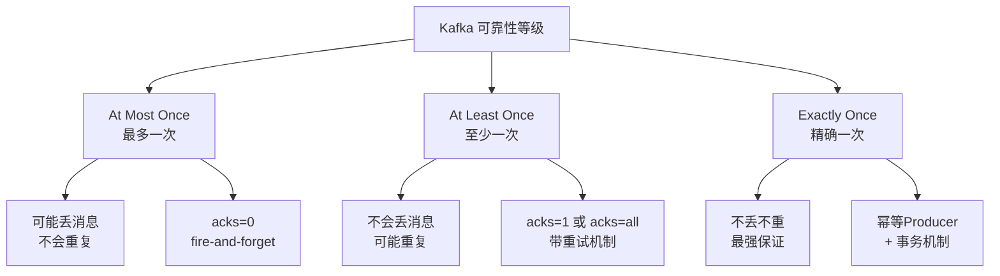
```mermaid
graph TD
    A[Kafka 可靠性等级] --> B[At Most Once<br/>最多一次]
    A --> C[At Least Once<br/>至少一次]
    A --> D[Exactly Once<br/>精确一次]

    B --> E[可能丢消息<br/>不会重复]
    B --> F[acks=0<br/>fire-and-forget]

    C --> G[不会丢消息<br/>可能重复]
    C --> H[acks=1 或 acks=all<br/>带重试机制]

    D --> I[不丢不重<br/>最强保证]
    D --> J[幂等Producer<br/>+ 事务机制]
```

---

## 副本机制详解

### 1. 副本架构

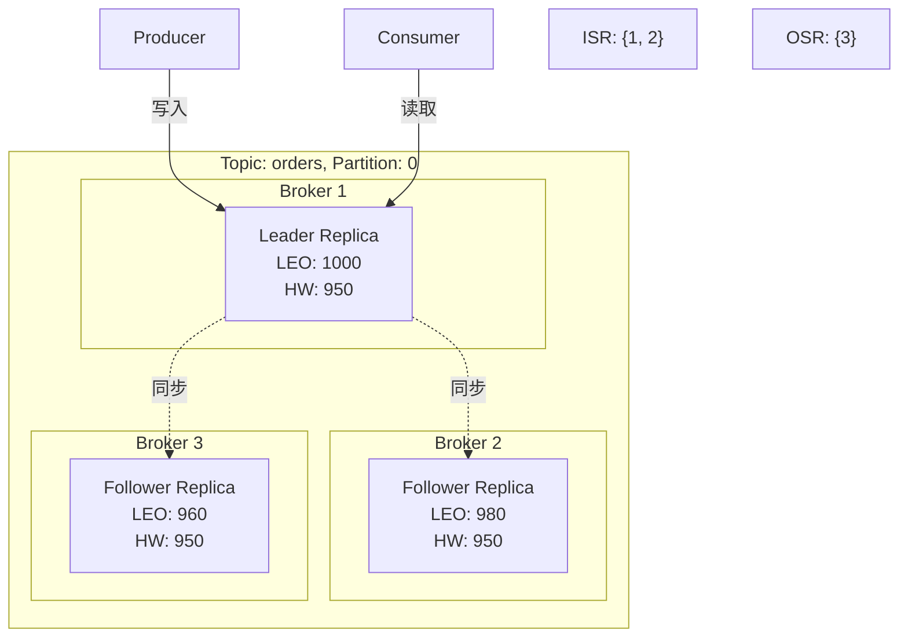
```mermaid
graph TD
    subgraph "Topic: orders, Partition: 0"
        subgraph "Broker 1"
            A[Leader Replica<br/>LEO: 1000<br/>HW: 950]
        end

        subgraph "Broker 2"
            B[Follower Replica<br/>LEO: 980<br/>HW: 950]
        end

        subgraph "Broker 3"
            C[Follower Replica<br/>LEO: 960<br/>HW: 950]
        end
    end

    D[Producer] -->|写入| A
    E[Consumer] -->|读取| A

    A -.->|同步| B
    A -.->|同步| C

    F["ISR: {1, 2}"]
    G["OSR: {3}"]
```

### 2. LEO 和 HW 机制

#### LEO (Log End Offset) 和 HW (High Watermark)

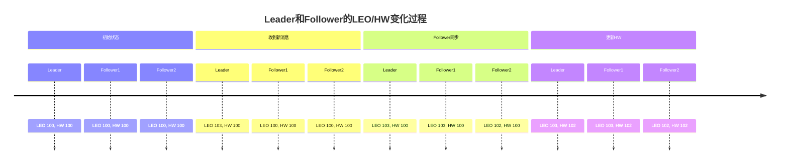
```mermaid
timeline
    title Leader和Follower的LEO/HW变化过程
    section 初始状态
        Leader   : LEO 100, HW 100
        Follower1: LEO 100, HW 100
        Follower2: LEO 100, HW 100
    section 收到新消息
        Leader   : LEO 103, HW 100
        Follower1: LEO 100, HW 100
        Follower2: LEO 100, HW 100
    section Follower同步
        Leader   : LEO 103, HW 100
        Follower1: LEO 103, HW 100
        Follower2: LEO 102, HW 100
    section 更新HW
        Leader   : LEO 103, HW 102
        Follower1: LEO 103, HW 102
        Follower2: LEO 102, HW 102
```

#### 副本同步流程

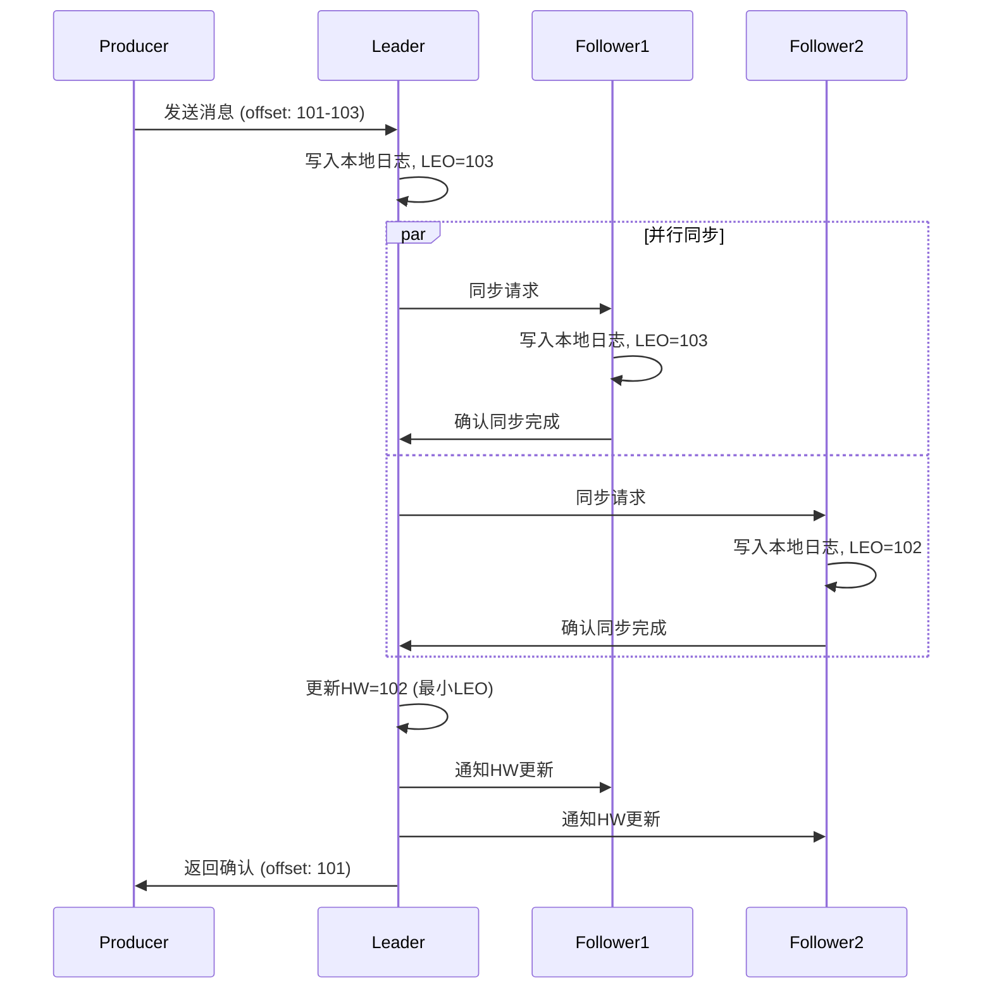
```mermaid
sequenceDiagram
    participant P as Producer
    participant L as Leader
    participant F1 as Follower1
    participant F2 as Follower2

    P->>L: 发送消息 (offset: 101-103)
    L->>L: 写入本地日志, LEO=103

    par 并行同步
        L->>F1: 同步请求
        F1->>F1: 写入本地日志, LEO=103
        F1->>L: 确认同步完成
    and
        L->>F2: 同步请求
        F2->>F2: 写入本地日志, LEO=102
        F2->>L: 确认同步完成
    end

    L->>L: 更新HW=102 (最小LEO)
    L->>F1: 通知HW更新
    L->>F2: 通知HW更新
    L->>P: 返回确认 (offset: 101)
```

### 3. 副本管理器架构

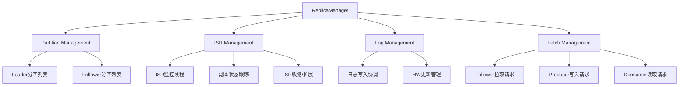
```mermaid
graph TD
    A[ReplicaManager] --> B[Partition Management]
    A --> C[ISR Management]
    A --> D[Log Management]
    A --> E[Fetch Management]

    B --> F[Leader分区列表]
    B --> G[Follower分区列表]

    C --> H[ISR监控线程]
    C --> I[副本状态跟踪]
    C --> J[ISR收缩/扩展]

    D --> K[日志写入协调]
    D --> L[HW更新管理]

    E --> M[Follower拉取请求]
    E --> N[Producer写入请求]
    E --> O[Consumer读取请求]
```

---

## ISR机制与选举

### 1. ISR (In-Sync Replicas) 机制

#### ISR 状态转换

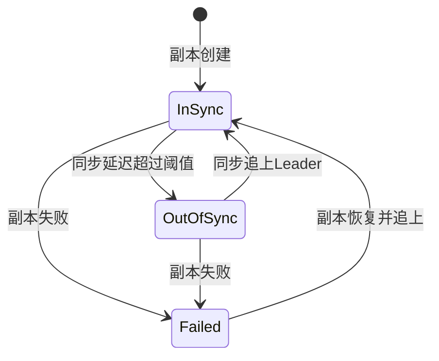
```mermaid
stateDiagram-v2
    [*] --> InSync: 副本创建
    InSync --> OutOfSync: 同步延迟超过阈值
    OutOfSync --> InSync: 同步追上Leader
    InSync --> Failed: 副本失败
    OutOfSync --> Failed: 副本失败
    Failed --> InSync: 副本恢复并追上
```

#### ISR 管理流程

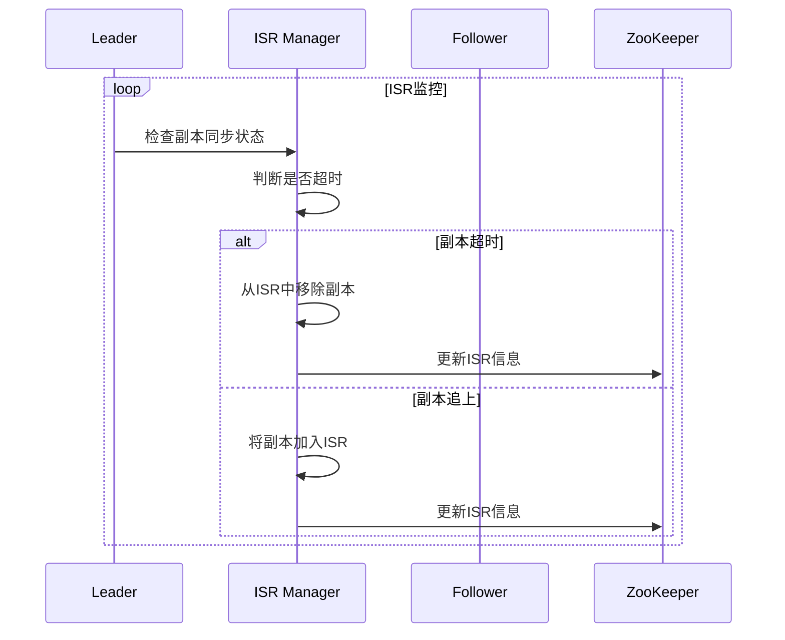
```mermaid
sequenceDiagram
    participant L as Leader
    participant ISR as ISR Manager
    participant F as Follower
    participant Z as ZooKeeper

    loop ISR监控
        L->>ISR: 检查副本同步状态
        ISR->>ISR: 判断是否超时
        alt 副本超时
            ISR->>ISR: 从ISR中移除副本
            ISR->>Z: 更新ISR信息
        else 副本追上
            ISR->>ISR: 将副本加入ISR
            ISR->>Z: 更新ISR信息
        end
    end
```

### 2. Leader选举机制

#### Controller选举

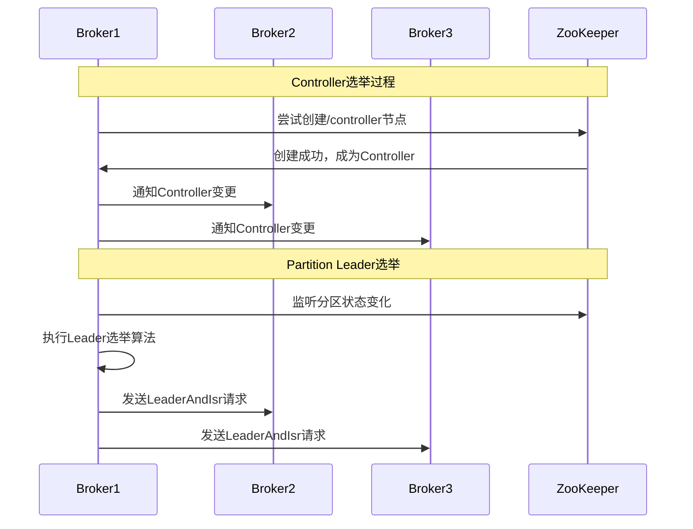
```mermaid
sequenceDiagram
    participant B1 as Broker1
    participant B2 as Broker2
    participant B3 as Broker3
    participant Z as ZooKeeper

    Note over B1,Z: Controller选举过程
    B1->>Z: 尝试创建/controller节点
    Z->>B1: 创建成功，成为Controller
    B1->>B2: 通知Controller变更
    B1->>B3: 通知Controller变更

    Note over B1,Z: Partition Leader选举
    B1->>Z: 监听分区状态变化
    B1->>B1: 执行Leader选举算法
    B1->>B2: 发送LeaderAndIsr请求
    B1->>B3: 发送LeaderAndIsr请求
```

#### Partition Leader选举算法

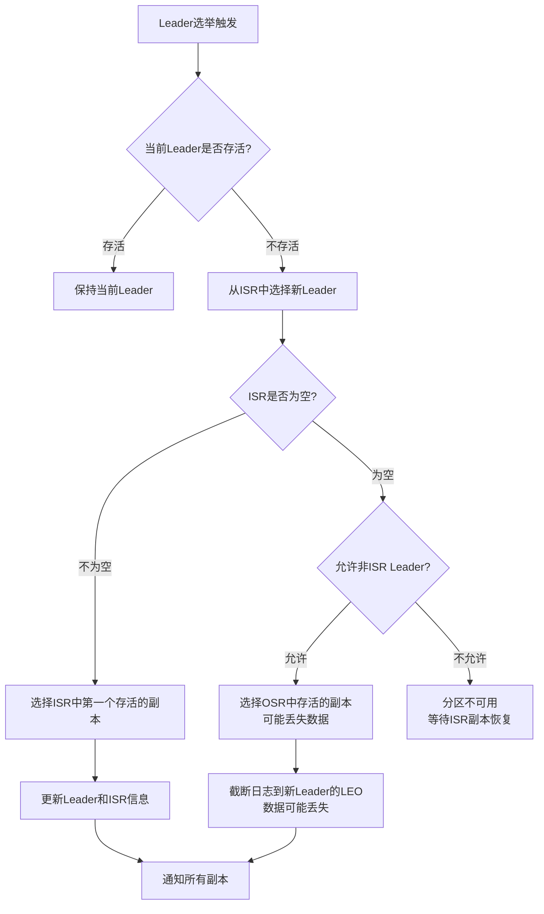
```mermaid
graph TD
    A[Leader选举触发] --> B{当前Leader是否存活?}
    B -->|存活| C[保持当前Leader]
    B -->|不存活| D[从ISR中选择新Leader]

    D --> E{ISR是否为空?}
    E -->|不为空| F[选择ISR中第一个存活的副本]
    E -->|为空| G{允许非ISR Leader?}

    G -->|允许| H[选择OSR中存活的副本<br/>可能丢失数据]
    G -->|不允许| I[分区不可用<br/>等待ISR副本恢复]

    F --> J[更新Leader和ISR信息]
    H --> K[截断日志到新Leader的LEO<br/>数据可能丢失]
    J --> L[通知所有副本]
    K --> L
```

### 3. 副本同步控制

#### replica.lag.time.max.ms 控制机制

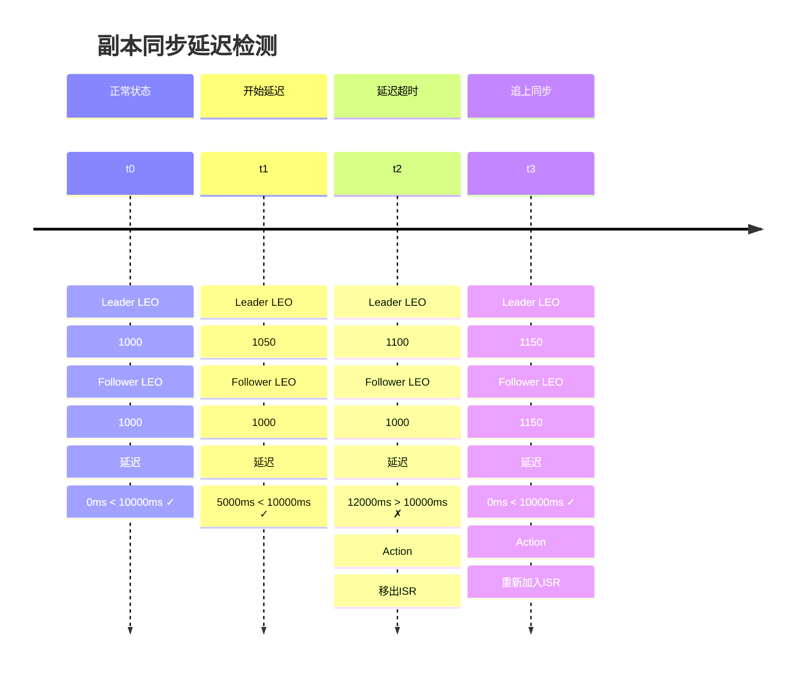
```mermaid
timeline
    title 副本同步延迟检测
    section 正常状态
        t0  : Leader LEO: 1000
            : Follower LEO: 1000
            : 延迟: 0ms < 10000ms ✓
    section 开始延迟
        t1  : Leader LEO: 1050
            : Follower LEO: 1000
            : 延迟: 5000ms < 10000ms ✓
    section 延迟超时
        t2  : Leader LEO: 1100
            : Follower LEO: 1000
            : 延迟: 12000ms > 10000ms ✗
            : Action: 移出ISR
    section 追上同步
        t3  : Leader LEO: 1150
            : Follower LEO: 1150
            : 延迟: 0ms < 10000ms ✓
            : Action: 重新加入ISR
```

---

## 生产者可靠性保证

### 1. Acks 配置详解

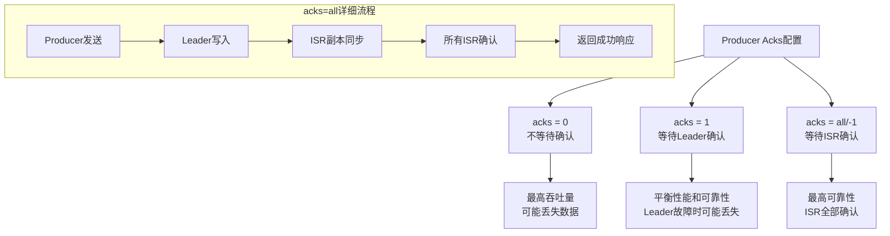
```mermaid
graph TD
    A[Producer Acks配置] --> B[acks = 0<br/>不等待确认]
    A --> C[acks = 1<br/>等待Leader确认]
    A --> D[acks = all/-1<br/>等待ISR确认]

    B --> E[最高吞吐量<br/>可能丢失数据]
    C --> F[平衡性能和可靠性<br/>Leader故障时可能丢失]
    D --> G[最高可靠性<br/>ISR全部确认]

    subgraph "acks=all详细流程"
        H[Producer发送] --> I[Leader写入]
        I --> J[ISR副本同步]
        J --> K[所有ISR确认]
        K --> L[返回成功响应]
    end
```

### 2. 重试机制

#### 重试策略配置

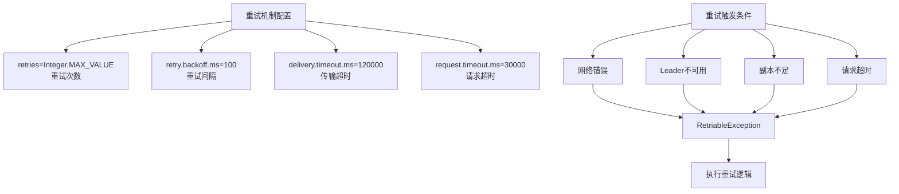
```mermaid
graph TD
    A[重试机制配置] --> B[retries=Integer.MAX_VALUE<br/>重试次数]
    A --> C[retry.backoff.ms=100<br/>重试间隔]
    A --> D[delivery.timeout.ms=120000<br/>传输超时]
    A --> E[request.timeout.ms=30000<br/>请求超时]

    F[重试触发条件] --> G[网络错误]
    F --> H[Leader不可用]
    F --> I[副本不足]
    F --> J[请求超时]

    G --> K[RetriableException]
    H --> K
    I --> K
    J --> K
    K --> L[执行重试逻辑]
```

#### 重试流程

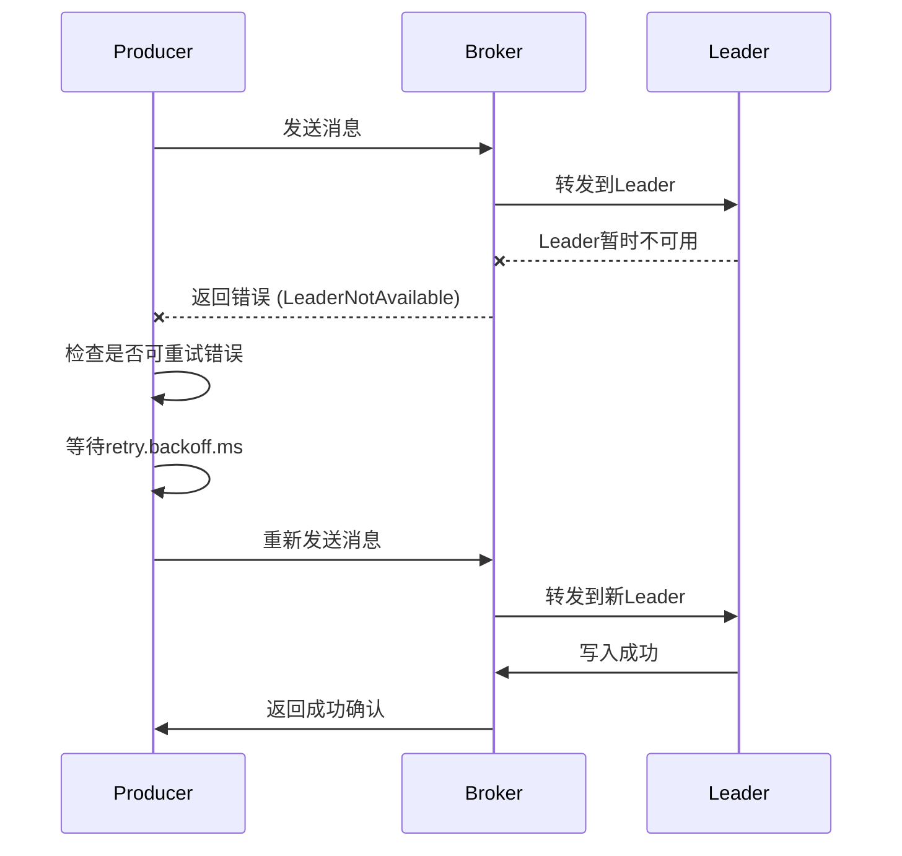
```mermaid
sequenceDiagram
    participant P as Producer
    participant B as Broker
    participant L as Leader

    P->>B: 发送消息
    B->>L: 转发到Leader
    L--xB: Leader暂时不可用
    B--xP: 返回错误 (LeaderNotAvailable)

    P->>P: 检查是否可重试错误
    P->>P: 等待retry.backoff.ms
    P->>B: 重新发送消息
    B->>L: 转发到新Leader
    L->>B: 写入成功
    B->>P: 返回成功确认
```

### 3. 幂等性保证

#### Producer 幂等性机制

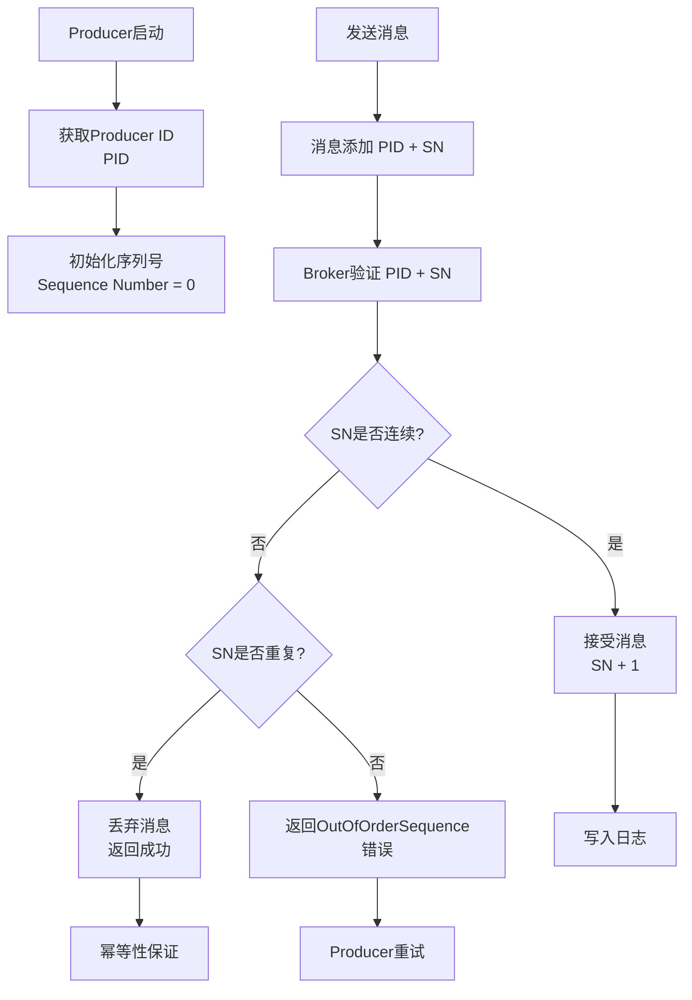
```mermaid
graph TD
    A[Producer启动] --> B[获取Producer ID<br/>PID]
    B --> C[初始化序列号<br/>Sequence Number = 0]

    D[发送消息] --> E[消息添加 PID + SN]
    E --> F[Broker验证 PID + SN]

    F --> G{SN是否连续?}
    G -->|是| H[接受消息<br/>SN + 1]
    G -->|否| I{SN是否重复?}

    I -->|是| J[丢弃消息<br/>返回成功]
    I -->|否| K[返回OutOfOrderSequence错误]

    H --> L[写入日志]
    J --> M[幂等性保证]
    K --> N[Producer重试]
```

#### 幂等性实现细节

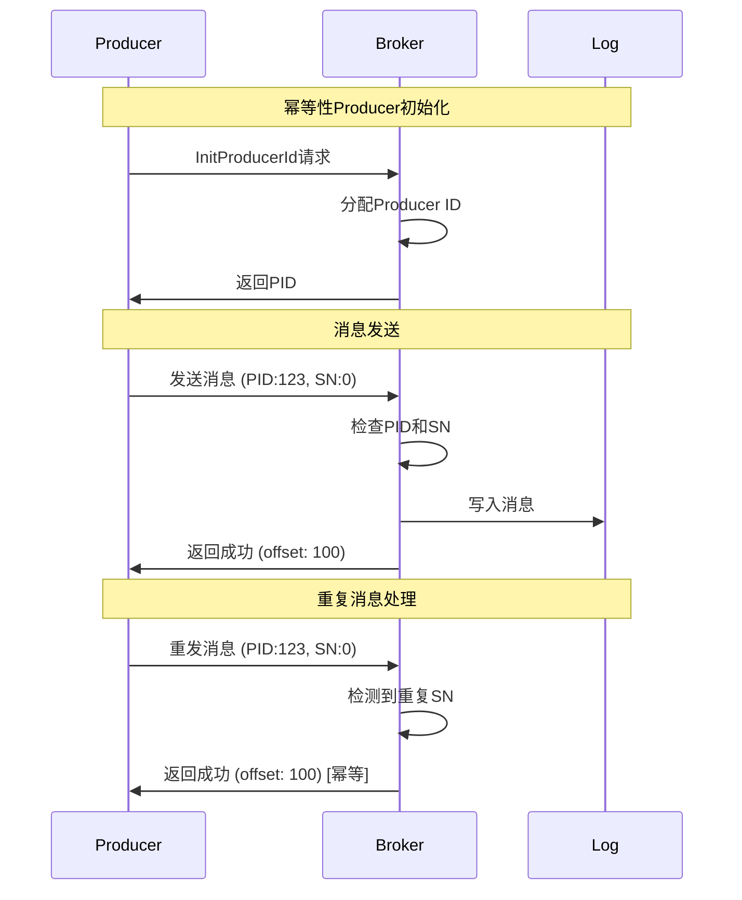
```mermaid
sequenceDiagram
    participant P as Producer
    participant B as Broker
    participant L as Log

    Note over P,L: 幂等性Producer初始化
    P->>B: InitProducerId请求
    B->>B: 分配Producer ID
    B->>P: 返回PID

    Note over P,L: 消息发送
    P->>B: 发送消息 (PID:123, SN:0)
    B->>B: 检查PID和SN
    B->>L: 写入消息
    B->>P: 返回成功 (offset: 100)

    Note over P,L: 重复消息处理
    P->>B: 重发消息 (PID:123, SN:0)
    B->>B: 检测到重复SN
    B->>P: 返回成功 (offset: 100) [幂等]
```

---

## 消费者可靠性保证

### 1. 偏移量管理

#### 自动提交 vs 手动提交

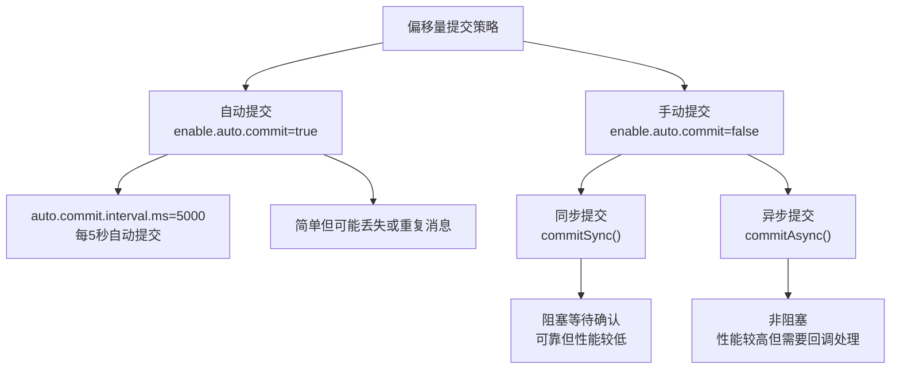
```mermaid
graph TD
    A[偏移量提交策略] --> B[自动提交<br/>enable.auto.commit=true]
    A --> C[手动提交<br/>enable.auto.commit=false]

    B --> D[auto.commit.interval.ms=5000<br/>每5秒自动提交]
    B --> E[简单但可能丢失或重复消息]

    C --> F["同步提交<br/>commitSync()"]
    C --> G["异步提交<br/>commitAsync()"]

    F --> H[阻塞等待确认<br/>可靠但性能较低]
    G --> I[非阻塞<br/>性能较高但需要回调处理]
```

#### 偏移量存储机制

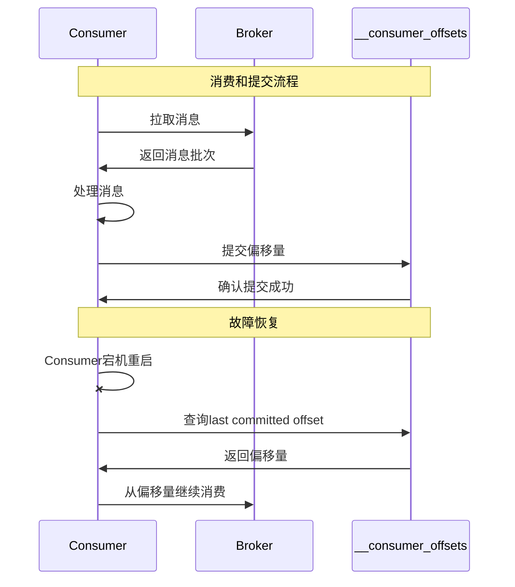
```mermaid
sequenceDiagram
    participant C as Consumer
    participant B as Broker
    participant CO as __consumer_offsets

    Note over C,CO: 消费和提交流程
    C->>B: 拉取消息
    B->>C: 返回消息批次
    C->>C: 处理消息
    C->>CO: 提交偏移量
    CO->>C: 确认提交成功

    Note over C,CO: 故障恢复
    C-xC: Consumer宕机重启
    C->>CO: 查询last committed offset
    CO->>C: 返回偏移量
    C->>B: 从偏移量继续消费
```

### 2. 重平衡机制

#### Consumer Group 重平衡流程

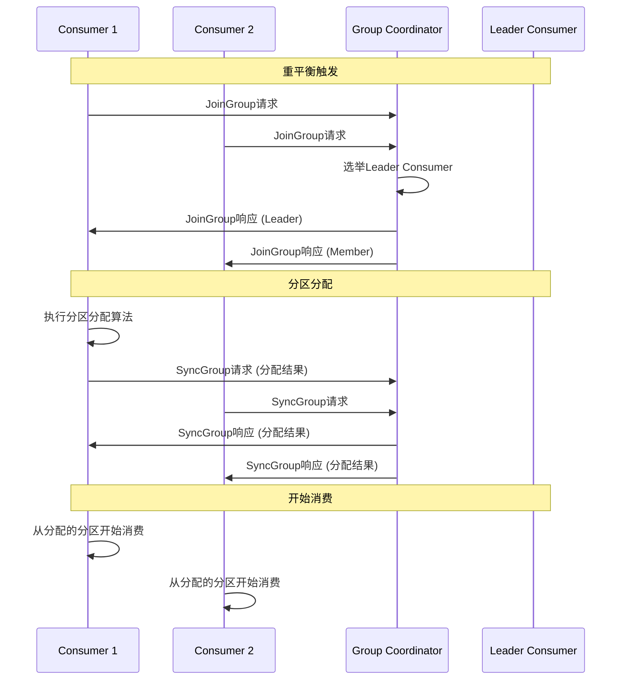
```mermaid
sequenceDiagram
    participant C1 as Consumer 1
    participant C2 as Consumer 2
    participant GC as Group Coordinator
    participant L as Leader Consumer

    Note over C1,L: 重平衡触发
    C1->>GC: JoinGroup请求
    C2->>GC: JoinGroup请求
    GC->>GC: 选举Leader Consumer
    GC->>C1: JoinGroup响应 (Leader)
    GC->>C2: JoinGroup响应 (Member)

    Note over C1,L: 分区分配
    C1->>C1: 执行分区分配算法
    C1->>GC: SyncGroup请求 (分配结果)
    C2->>GC: SyncGroup请求
    GC->>C1: SyncGroup响应 (分配结果)
    GC->>C2: SyncGroup响应 (分配结果)

    Note over C1,L: 开始消费
    C1->>C1: 从分配的分区开始消费
    C2->>C2: 从分配的分区开始消费
```

### 3. 消费语义保证

#### At Least Once 实现

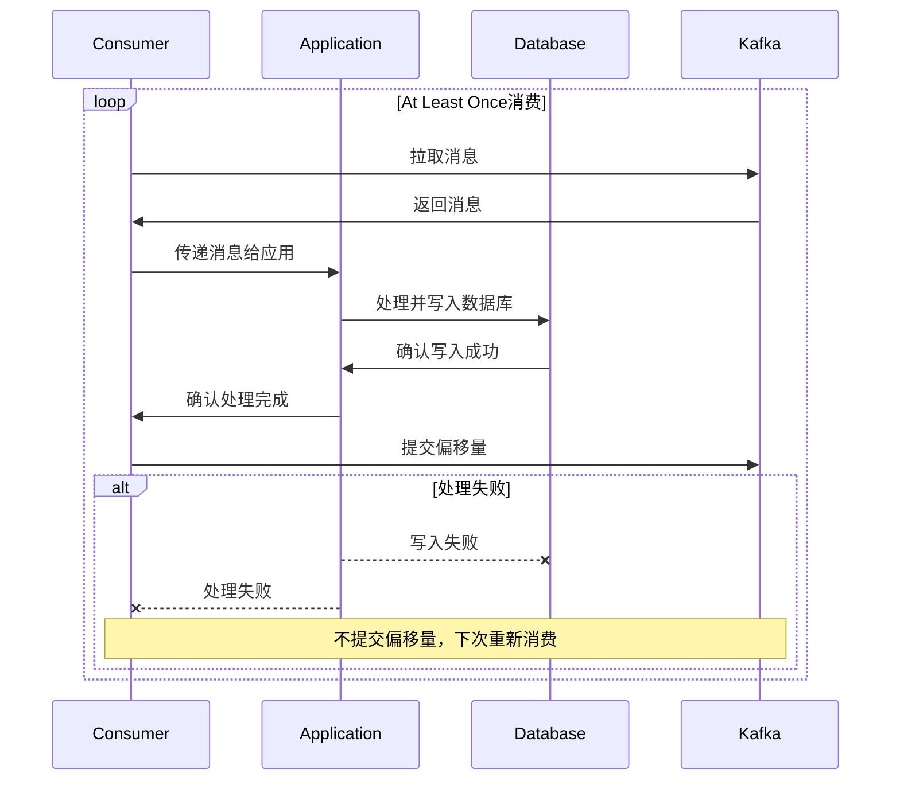
```mermaid
sequenceDiagram
    participant C as Consumer
    participant A as Application
    participant D as Database
    participant K as Kafka

    loop At Least Once消费
        C->>K: 拉取消息
        K->>C: 返回消息
        C->>A: 传递消息给应用
        A->>D: 处理并写入数据库
        D->>A: 确认写入成功
        A->>C: 确认处理完成
        C->>K: 提交偏移量
        alt 处理失败
            A--xD: 写入失败
            A--xC: 处理失败
            Note over C,K: 不提交偏移量，下次重新消费
        end
    end
```

#### Exactly Once 实现 (消费端)

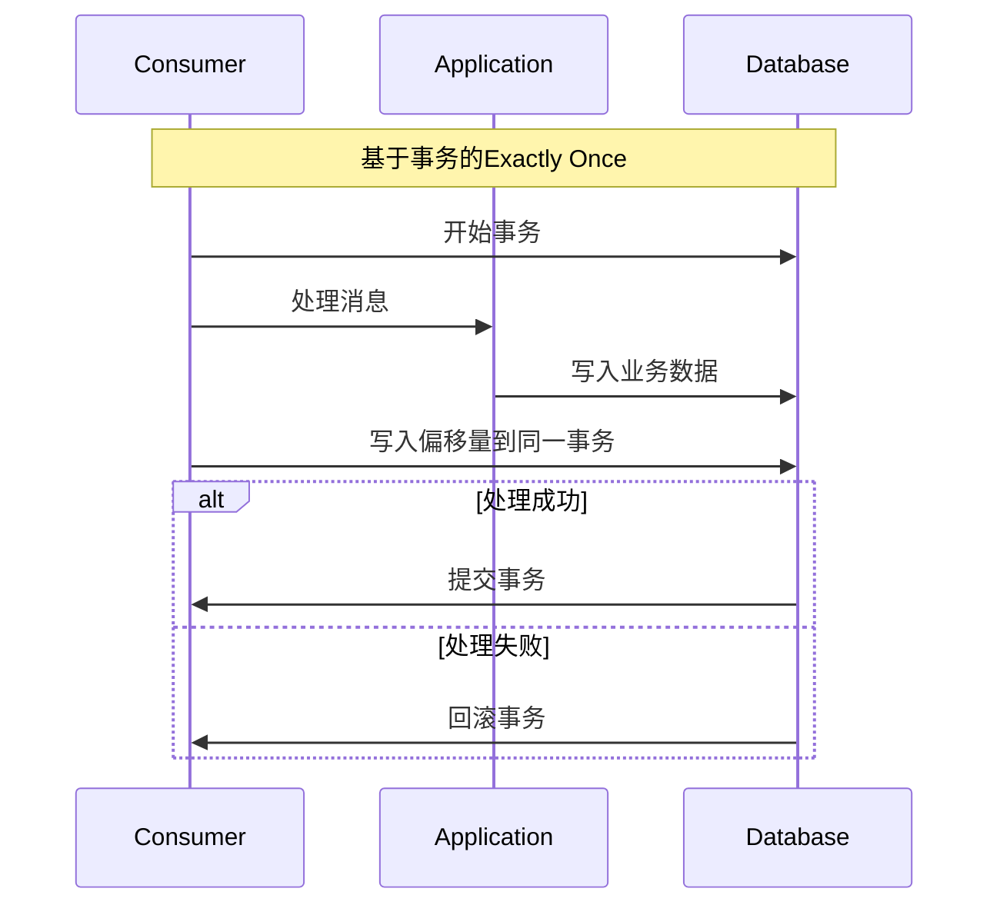
```mermaid
sequenceDiagram
    participant C as Consumer
    participant A as Application
    participant D as Database

    Note over C,D: 基于事务的Exactly Once
    C->>D: 开始事务
    C->>A: 处理消息
    A->>D: 写入业务数据
    C->>D: 写入偏移量到同一事务
    alt 处理成功
        D->>C: 提交事务
    else 处理失败
        D->>C: 回滚事务
    end
```

---

## 事务机制

### 1. Kafka 事务架构

```mermaid
graph TD
    A[Producer] --> B[Transaction Coordinator]
    B --> C[Transaction Log<br/>__transaction_state]

    A --> D[Data Partitions]
    A --> E[Control Messages<br/>COMMIT/ABORT]

    F[Consumer] --> G[Read Committed<br/>isolation.level=read_committed]
    F --> H[Read Uncommitted<br/>isolation.level=read_uncommitted]

    G --> I[只读取已提交的事务消息]
    H --> J[读取所有消息包括未提交的]
```

### 2. 事务状态管理

#### 事务状态转换

```mermaid
stateDiagram-v2
    [*] --> Empty: 初始状态
    Empty --> Ongoing: beginTransaction
    Ongoing --> PrepareCommit: 准备提交
    Ongoing --> PrepareAbort: 准备中止
    PrepareCommit --> CompleteCommit: 完成提交
    PrepareAbort --> CompleteAbort: 完成中止
    CompleteCommit --> Empty: 清理状态
    CompleteAbort --> Empty: 清理状态
```

#### 事务执行流程

```mermaid
sequenceDiagram
    participant P as Producer
    participant TC as Transaction Coordinator
    participant TL as Transaction Log
    participant B as Broker

    P->>TC: initTransactions()
    TC->>TL: 写入Producer注册信息
    TC->>P: 返回Producer ID

    P->>TC: beginTransaction()
    TC->>TL: 记录事务开始状态

    P->>B: 发送消息 (事务标记)
    P->>TC: addPartitionsToTxn()
    TC->>TL: 记录事务涉及的分区

    alt 提交事务
        P->>TC: commitTransaction()
        TC->>TL: 写入PrepareCommit状态
        TC->>B: 发送Commit Marker
        TC->>TL: 写入CompleteCommit状态
        TC->>P: 提交成功
    else 中止事务
        P->>TC: abortTransaction()
        TC->>TL: 写入PrepareAbort状态
        TC->>B: 发送Abort Marker
        TC->>TL: 写入CompleteAbort状态
        TC->>P: 中止成功
    end
```

### 3. Exactly Once Semantics (EOS)

#### EOS 实现架构

```mermaid
graph TD
    subgraph "Producer端"
        A[幂等Producer] --> B[PID + Sequence Number]
        A --> C[事务机制]
    end

    subgraph "Broker端"
        D[事务协调器] --> E[事务状态管理]
        D --> F[Control Messages]
    end

    subgraph "Consumer端"
        G[isolation.level=read_committed]
        H[事务消息过滤]
    end

    A --> D
    D --> G
    B --> I[幂等性保证]
    C --> J[原子性保证]
    E --> K[一致性保证]
    G --> L[隔离性保证]
```

---

## 故障场景与恢复

### 1. 常见故障场景

#### Broker 故障

```mermaid
graph TD
    A[Broker故障] --> B[Leader Broker故障]
    A --> C[Follower Broker故障]

    B --> D[触发Leader选举]
    D --> E[从ISR中选择新Leader]
    E --> F[更新元数据]
    F --> G[客户端重新连接]

    C --> H[移出ISR]
    H --> I[继续服务]
    I --> J[故障恢复后重新加入]
```

#### 网络分区故障

```mermaid
sequenceDiagram
    participant P as Producer
    participant L as Leader
    participant F as Follower
    participant C as Controller

    Note over P,C: 网络分区发生
    P-xL: 网络不可达
    L-xF: 副本同步中断
    F-xC: 失去连接

    C->>C: 检测到Broker下线
    C->>C: 触发Leader选举
    C->>F: 选举新Leader (如果在多数派)

    Note over P,C: 网络恢复
    P->>F: 重新连接到新Leader
    L->>C: 重新注册Broker
    C->>L: 通知角色变更 (Follower)
    L->>F: 同步数据追赶进度
```

### 2. 数据一致性问题

#### Split Brain 防护

```mermaid
graph TD
    A[Split Brain防护机制] --> B[Majority Quorum]
    A --> C[Epoch机制]
    A --> D[ZooKeeper仲裁]

    B --> E[ISR必须包含majority副本]
    B --> F[min.insync.replicas配置]

    C --> G[Leader Epoch递增]
    C --> H[防止过期Leader写入]

    D --> I[Controller选举]
    D --> J[集群状态仲裁]
```

#### 数据截断场景

```mermaid
sequenceDiagram
    participant OL as Old Leader
    participant NL as New Leader
    participant F as Follower

    Note over OL,F: Leader故障前状态
    OL->>OL: LEO: 1000, HW: 950
    NL->>NL: LEO: 950, HW: 950
    F->>F: LEO: 950, HW: 950

    Note over OL,F: Old Leader故障
    OL-xOL: 故障，消息1000-950未同步

    Note over OL,F: 选举New Leader
    NL->>NL: 成为Leader, HW保持950
    NL->>F: 同步正常继续

    Note over OL,F: Old Leader恢复
    OL->>NL: 请求成为Follower
    NL->>OL: 返回当前HW: 950
    OL->>OL: 截断到HW: 950 (丢失1000-950数据)
```

### 3. 恢复策略

#### 不同级别的恢复策略

```mermaid
graph TD
    A[恢复策略选择] --> B[可用性优先]
    A --> C[一致性优先]
    A --> D[平衡策略]

    B --> E[unclean.leader.election.enable=true]
    B --> F[min.insync.replicas=1]
    B --> G[快速恢复服务]

    C --> H[unclean.leader.election.enable=false]
    C --> I[min.insync.replicas >= 2]
    C --> J[等待足够副本]

    D --> K[根据业务场景配置]
    D --> L[监控和告警]
```

---

## 最佳实践配置

### 1. 生产环境可靠性配置

#### Producer 配置

```properties
# 基础配置
bootstrap.servers=broker1:9092,broker2:9092,broker3:9092
client.id=reliable-producer

# 可靠性配置
acks=all                              # 等待所有ISR确认
retries=2147483647                    # 最大重试次数
retry.backoff.ms=100                  # 重试间隔
delivery.timeout.ms=300000            # 传输超时时间
request.timeout.ms=30000              # 请求超时时间

# 幂等性配置
enable.idempotence=true               # 开启幂等性

# 批处理配置 (平衡性能和可靠性)
batch.size=16384                      # 16KB批次大小
linger.ms=5                          # 5ms等待时间
buffer.memory=33554432               # 32MB缓冲区大小

# 压缩配置
compression.type=snappy              # 使用snappy压缩
```

#### Broker 配置

```properties
# 副本配置
default.replication.factor=3         # 默认副本因子
min.insync.replicas=2                # 最小同步副本数
unclean.leader.election.enable=false # 禁用非ISR Leader选举

# 日志配置
log.flush.interval.messages=10000    # 每10000条消息刷盘
log.flush.interval.ms=1000          # 每1秒刷盘
log.segment.bytes=1073741824        # 1GB段文件大小
log.retention.hours=168             # 保留7天

# 网络配置
num.network.threads=8               # 网络线程数
num.io.threads=8                    # IO线程数
socket.send.buffer.bytes=102400     # Socket发送缓冲区
socket.receive.buffer.bytes=102400   # Socket接收缓冲区
socket.request.max.bytes=104857600   # 最大请求大小

# ISR配置
replica.lag.time.max.ms=10000       # 副本最大延迟时间
replica.fetch.wait.max.ms=500       # 副本拉取等待时间
```

#### Consumer 配置

```properties
# 基础配置
bootstrap.servers=broker1:9092,broker2:9092,broker3:9092
group.id=reliable-consumer-group

# 可靠性配置
enable.auto.commit=false             # 禁用自动提交
isolation.level=read_committed       # 只读取已提交事务

# 会话配置
session.timeout.ms=30000            # 会话超时时间
heartbeat.interval.ms=3000          # 心跳间隔
max.poll.interval.ms=300000         # 最大轮询间隔

# 拉取配置
fetch.min.bytes=1024                # 最小拉取字节数
fetch.max.wait.ms=500               # 最大等待时间
max.poll.records=500                # 最大拉取记录数

# 重平衡配置
partition.assignment.strategy=org.apache.kafka.clients.consumer.RangeAssignor
```

### 2. 监控指标

#### 关键可靠性监控指标

```mermaid
graph TD
    A[可靠性监控指标] --> B[副本指标]
    A --> C[ISR指标]
    A --> D[延迟指标]
    A --> E[错误指标]

    B --> F[UnderReplicatedPartitions<br/>副本不足分区数]
    B --> G[OfflinePartitionsCount<br/>离线分区数]

    C --> H[ISR扩展/收缩频率]
    C --> I[ISR大小分布]

    D --> J[ReplicaLag<br/>副本延迟]
    D --> K[RequestLatencyMs<br/>请求延迟]

    E --> L[ErrorRate<br/>错误率]
    E --> M[FailedFetchRequestsPerSec<br/>失败拉取请求]
```

### 3. 告警配置

```mermaid
graph TD
    A[告警策略] --> B[严重告警]
    A --> C[警告告警]
    A --> D[通知告警]

    B --> E[UnderReplicatedPartitions > 0<br/>立即告警]
    B --> F[OfflinePartitionsCount > 0<br/>立即告警]
    B --> G[ISR Size < min.insync.replicas<br/>立即告警]

    C --> H[ReplicaLag > 10000ms<br/>5分钟后告警]
    C --> I[RequestLatency P95 > 100ms<br/>10分钟后告警]

    D --> J[ISR频繁变化<br/>30分钟后通知]
    D --> K[磁盘使用率 > 80%<br/>24小时后通知]
```

---

## 总结

Kafka 通过多层次的机制保证消息不丢失：

1. **副本机制**: 多副本冗余存储，Leader-Follower架构
2. **ISR机制**: 同步副本集合，保证数据一致性
3. **确认机制**: acks配置，控制可靠性级别
4. **幂等性**: Producer ID + Sequence Number防止重复
5. **事务支持**: 原子性操作，支持Exactly Once语义
6. **故障恢复**: 自动选举和恢复机制

通过合理的配置和监控，可以在不同场景下达到需要的可靠性级别。

下一篇文档将深入分析 Kafka 的性能优化与监控，包括性能调优策略、监控体系建设、运维最佳实践等内容。

---

## 相关文档

- [Kafka深入分析-01-架构概述与核心概念](./Kafka深入分析-01-架构概述与核心概念.md)
- [Kafka深入分析-02-存储机制与日志结构](./Kafka深入分析-02-存储机制与日志结构.md)
- [Kafka深入分析-03-高并发处理机制](./Kafka深入分析-03-高并发处理机制.md)
- [Kafka深入分析-05-性能优化与监控](./Kafka深入分析-05-性能优化与监控.md)