# Kafka 深入分析 - 05 性能优化与监控

## 文档概述

本文档是 Kafka 深入分析系列的第五篇，深入分析 Kafka 的性能优化策略、监控体系建设、运维最佳实践以及故障排查方法。

---

## 目录

1. [性能优化概述](#性能优化概述)
2. [硬件和操作系统优化](#硬件和操作系统优化)
3. [JVM调优策略](#JVM调优策略)
4. [Kafka配置优化](#Kafka配置优化)
5. [监控体系建设](#监控体系建设)
6. [故障排查指南](#故障排查指南)
7. [容量规划](#容量规划)
8. [运维最佳实践](#运维最佳实践)

---

## 性能优化概述

### Kafka 性能优化金字塔

### 性能指标体系

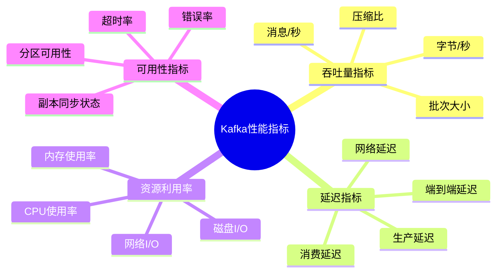

---

## 硬件和操作系统优化

### 1. 硬件选型建议

#### CPU 选择

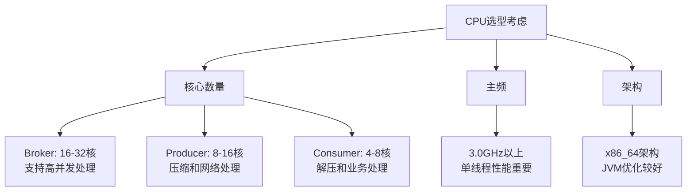

#### 内存配置

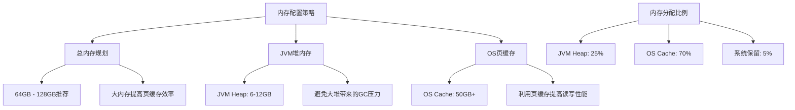

#### 存储配置

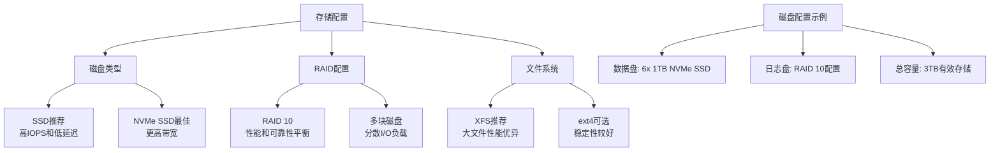

### 2. 操作系统优化

#### 内核参数优化

```bash
# /etc/sysctl.conf 关键配置

# 网络参数优化
net.core.rmem_default = 262144
net.core.rmem_max = 16777216
net.core.wmem_default = 262144
net.core.wmem_max = 16777216
net.core.netdev_max_backlog = 5000
net.core.somaxconn = 65535

# TCP参数优化
net.ipv4.tcp_window_scaling = 1
net.ipv4.tcp_rmem = 4096 65536 16777216
net.ipv4.tcp_wmem = 4096 65536 16777216
net.ipv4.tcp_max_syn_backlog = 8192
net.ipv4.tcp_slow_start_after_idle = 0

# 内存管理优化
vm.swappiness = 1
vm.dirty_background_ratio = 5
vm.dirty_ratio = 60
vm.dirty_expire_centisecs = 12000
vm.dirty_writeback_centisecs = 1500

# 文件系统优化
fs.file-max = 2097152
```

#### 文件系统挂载优化

```bash
# XFS 文件系统挂载选项
/dev/sdb1 /var/kafka-logs xfs noatime,largeio,inode64,swalloc 0 1

# ext4 文件系统挂载选项
/dev/sdb1 /var/kafka-logs ext4 noatime,data=writeback,barrier=0,nobh 0 1
```

#### ulimit 配置

```bash
# /etc/security/limits.conf
kafka soft nofile 1000000
kafka hard nofile 1000000
kafka soft nproc 32768
kafka hard nproc 32768
```

### 3. 系统监控指标

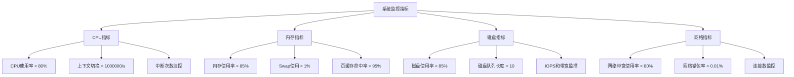

---

## JVM调优策略

### 1. 垃圾收集器选择

#### G1GC 优化配置

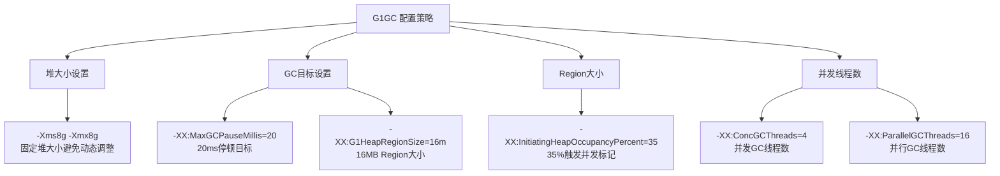

#### ZGC 配置 (大内存场景)

```bash
# ZGC适用于大内存(>32GB)和低延迟要求
-XX:+UseZGC
-XX:+UnlockExperimentalVMOptions
-Xms32g
-Xmx32g
-XX:ZCollectionInterval=5
-XX:ZUncommitDelay=300
```

### 2. JVM 参数优化

#### 完整JVM配置示例

```bash
# Kafka Broker JVM 配置
export KAFKA_HEAP_OPTS="-Xmx8G -Xms8G"

export KAFKA_JVM_PERFORMANCE_OPTS="-server \
-XX:+UseG1GC \
-XX:MaxGCPauseMillis=20 \
-XX:InitiatingHeapOccupancyPercent=35 \
-XX:+ExplicitGCInvokesConcurrent \
-XX:MaxInlineLevel=15 \
-XX:+UseCompressedOops \
-XX:+UseCompressedClassPointers \
-XX:+DoEscapeAnalysis \
-XX:+UseStringDeduplication \
-Djava.awt.headless=true"

export KAFKA_LOG4J_OPTS="-Dlog4j.configuration=file:log4j.properties \
-Dkafka.logs.dir=/var/log/kafka"

export KAFKA_JMX_OPTS="-Dcom.sun.management.jmxremote \
-Dcom.sun.management.jmxremote.authenticate=false \
-Dcom.sun.management.jmxremote.ssl=false \
-Dcom.sun.management.jmxremote.port=9999"
```

### 3. GC 日志分析

#### GC 日志配置

```bash
# GC 日志配置
-XX:+UseGCLogFileRotation
-XX:NumberOfGCLogFiles=10
-XX:GCLogFileSize=100M
-Xloggc:/var/log/kafka/gc.log
-XX:+PrintGCDetails
-XX:+PrintGCTimeStamps
-XX:+PrintGCApplicationStoppedTime
```

#### GC 性能指标

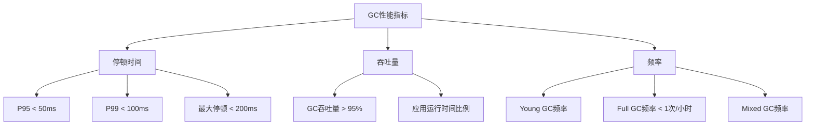

---

## Kafka配置优化

### 1. Broker 配置优化

#### 核心性能配置

```properties
# 基础配置
broker.id=1
listeners=PLAINTEXT://0.0.0.0:9092
log.dirs=/data1/kafka,/data2/kafka,/data3/kafka

# 网络和I/O配置
num.network.threads=16                    # 网络线程数，推荐为CPU核数
num.io.threads=16                        # I/O线程数，推荐为CPU核数
socket.send.buffer.bytes=102400          # 发送缓冲区 100KB
socket.receive.buffer.bytes=102400       # 接收缓冲区 100KB
socket.request.max.bytes=104857600       # 最大请求大小 100MB
num.replica.fetchers=4                   # 副本拉取线程数

# 日志配置
log.segment.bytes=1073741824             # 1GB段大小
log.retention.hours=168                  # 保留7天
log.retention.check.interval.ms=300000  # 5分钟检查一次
log.cleanup.policy=delete                # 删除策略

# 压缩配置
compression.type=producer                # 保持生产者压缩类型
log.cleaner.threads=2                   # 清理线程数
log.cleaner.dedupe.buffer.size=134217728 # 128MB去重缓冲区

# 副本配置
default.replication.factor=3             # 默认副本数
min.insync.replicas=2                   # 最小同步副本数
replica.lag.time.max.ms=10000           # 副本最大延迟时间

# 组协调器配置
group.initial.rebalance.delay.ms=3000   # 重平衡延迟
offsets.retention.minutes=10080          # 偏移量保留7天
offsets.topic.replication.factor=3      # 偏移量Topic副本数
```

### 2. Producer 性能配置

#### 高吞吐量配置

```properties
# 高吞吐量配置
bootstrap.servers=broker1:9092,broker2:9092,broker3:9092
acks=1                                   # 平衡可靠性和性能
retries=2147483647                       # 最大重试次数
batch.size=65536                         # 64KB批次大小
linger.ms=20                            # 等待20ms收集更多消息
buffer.memory=134217728                  # 128MB缓冲区
compression.type=lz4                     # 高性能压缩算法

# 网络优化
send.buffer.bytes=131072                 # 128KB发送缓冲区
receive.buffer.bytes=65536               # 64KB接收缓冲区
max.in.flight.requests.per.connection=5 # 最大飞行请求数

# 超时配置
request.timeout.ms=30000                 # 30秒请求超时
delivery.timeout.ms=120000               # 120秒传输超时
```

#### 低延迟配置

```properties
# 低延迟配置
bootstrap.servers=broker1:9092,broker2:9092,broker3:9092
acks=1                                   # 等待leader确认
batch.size=1024                          # 小批次 1KB
linger.ms=0                             # 立即发送
buffer.memory=33554432                   # 32MB缓冲区
compression.type=none                    # 不压缩减少CPU开销

# 网络优化
send.buffer.bytes=131072                 # 128KB发送缓冲区
receive.buffer.bytes=65536               # 64KB接收缓冲区
max.in.flight.requests.per.connection=1 # 保证消息顺序

# 超时配置
request.timeout.ms=10000                 # 10秒请求超时
```

### 3. Consumer 性能配置

#### 高吞吐量配置

```properties
# 高吞吐量配置
bootstrap.servers=broker1:9092,broker2:9092,broker3:9092
group.id=high-throughput-group
fetch.min.bytes=1048576                  # 1MB最小拉取
fetch.max.wait.ms=1000                   # 1秒最大等待
max.poll.records=10000                   # 10000条记录
receive.buffer.bytes=262144              # 256KB接收缓冲区

# 会话配置
session.timeout.ms=30000                # 30秒会话超时
heartbeat.interval.ms=3000              # 3秒心跳间隔
max.poll.interval.ms=300000             # 5分钟轮询间隔

# 偏移量管理
enable.auto.commit=true                 # 自动提交
auto.commit.interval.ms=1000            # 1秒提交间隔
```

---

## 监控体系建设

### 1. 监控架构

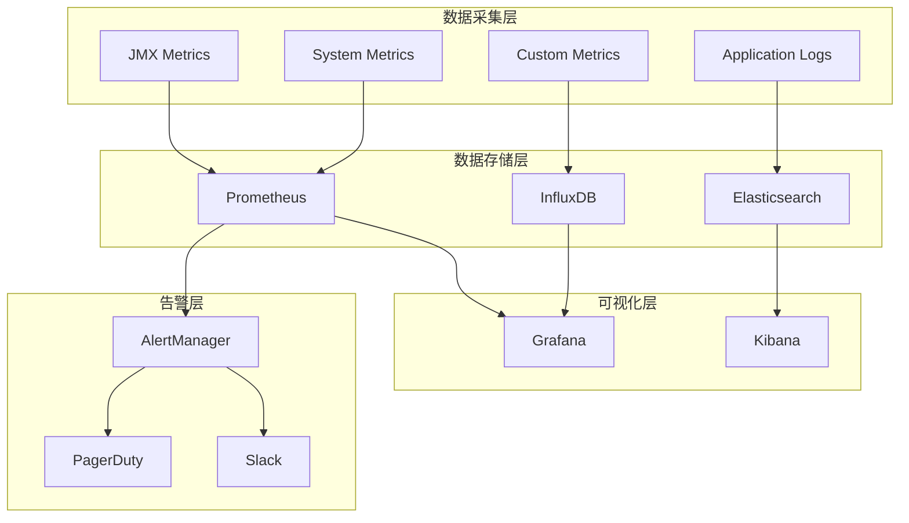

### 2. 核心监控指标

#### Broker 监控指标

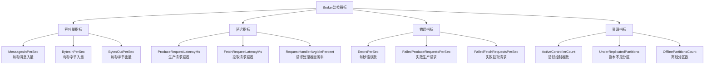

#### JVM 监控指标

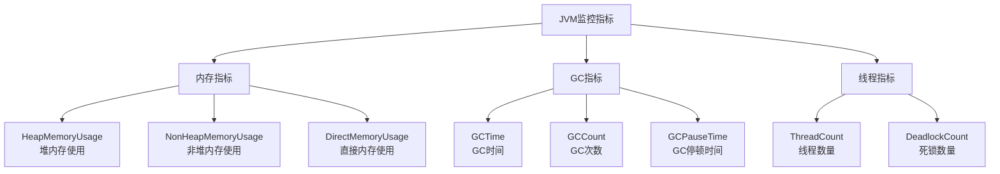

### 3. 监控配置示例

#### Prometheus 配置

```yaml
# prometheus.yml
global:
  scrape_interval: 15s

scrape_configs:
  - job_name: 'kafka-brokers'
    static_configs:
      - targets: ['broker1:9999', 'broker2:9999', 'broker3:9999']
    metrics_path: '/metrics'
    scrape_interval: 10s

  - job_name: 'kafka-jmx'
    static_configs:
      - targets: ['broker1:7071', 'broker2:7071', 'broker3:7071']

rule_files:
  - "kafka_alerts.yml"

alerting:
  alertmanagers:
    - static_configs:
        - targets:
          - alertmanager:9093
```

#### Grafana Dashboard 指标

```json
{
  "dashboard": {
    "title": "Kafka Cluster Overview",
    "panels": [
      {
        "title": "Messages In Per Second",
        "targets": [
          {
            "expr": "rate(kafka_server_brokertopicmetrics_messagesin_total[5m])",
            "legendFormat": "{{instance}} - {{topic}}"
          }
        ]
      },
      {
        "title": "Request Latency P95",
        "targets": [
          {
            "expr": "histogram_quantile(0.95, rate(kafka_network_requestmetrics_requestlatencyms_bucket[5m]))",
            "legendFormat": "{{instance}} - {{request}}"
          }
        ]
      },
      {
        "title": "Under Replicated Partitions",
        "targets": [
          {
            "expr": "kafka_server_replicamanager_underreplicatedpartitions",
            "legendFormat": "{{instance}}"
          }
        ]
      }
    ]
  }
}
```

### 4. 告警规则

```yaml
# kafka_alerts.yml
groups:
- name: kafka.rules
  rules:
  # 严重告警
  - alert: KafkaOfflinePartitions
    expr: kafka_server_replicamanager_offlinepartitionscount > 0
    for: 0m
    labels:
      severity: critical
    annotations:
      summary: "Kafka has offline partitions"
      description: "Kafka cluster has {{ $value }} offline partitions"

  - alert: KafkaUnderReplicatedPartitions
    expr: kafka_server_replicamanager_underreplicatedpartitions > 0
    for: 5m
    labels:
      severity: critical
    annotations:
      summary: "Kafka has under replicated partitions"

  # 警告告警
  - alert: KafkaHighRequestLatency
    expr: histogram_quantile(0.95, rate(kafka_network_requestmetrics_requestlatencyms_bucket[5m])) > 100
    for: 10m
    labels:
      severity: warning
    annotations:
      summary: "High request latency on Kafka"

  - alert: KafkaHighCPUUsage
    expr: rate(process_cpu_seconds_total{job="kafka"}[5m]) * 100 > 80
    for: 15m
    labels:
      severity: warning
    annotations:
      summary: "High CPU usage on Kafka broker"

  # 信息告警
  - alert: KafkaISRShrinking
    expr: increase(kafka_server_replicamanager_isrshrinks_total[1h]) > 5
    for: 30m
    labels:
      severity: info
    annotations:
      summary: "Frequent ISR shrinking detected"
```

---

## 故障排查指南

### 1. 常见故障类型

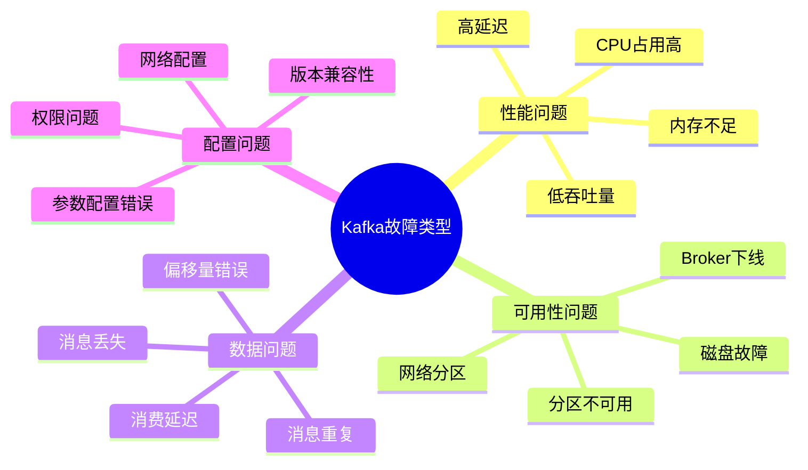

### 2. 故障诊断流程

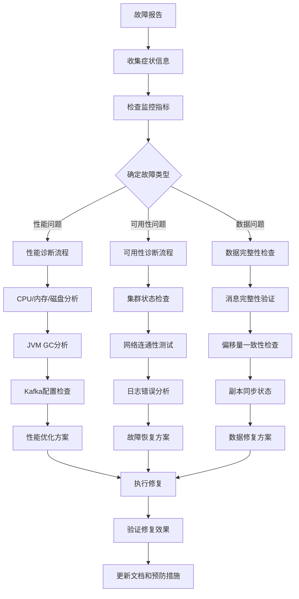

### 3. 常用排查命令

#### Kafka 管理命令

```bash
# 查看集群状态
kafka-broker-api-versions.sh --bootstrap-server localhost:9092

# 查看Topic信息
kafka-topics.sh --bootstrap-server localhost:9092 --describe --topic my-topic

# 查看消费者组状态
kafka-consumer-groups.sh --bootstrap-server localhost:9092 --describe --group my-group

# 查看日志段信息
kafka-dump-log.sh --files /var/kafka-logs/my-topic-0/00000000000000000000.log --print-data-log

# 性能测试
kafka-producer-perf-test.sh --topic perf-test --num-records 100000 --record-size 1024 --throughput 10000 --producer-props bootstrap.servers=localhost:9092

# 重置消费者偏移量
kafka-consumer-groups.sh --bootstrap-server localhost:9092 --group my-group --reset-offsets --to-earliest --topic my-topic --execute
```

#### 系统诊断命令

```bash
# 系统资源检查
top -p $(pgrep -f kafka)
iostat -x 1
netstat -i
ss -tuln | grep 9092

# JVM 诊断
jstat -gc $(pgrep -f kafka) 1s
jmap -histo $(pgrep -f kafka)
jstack $(pgrep -f kafka)

# 磁盘和文件系统检查
df -h /var/kafka-logs
lsof -p $(pgrep -f kafka) | wc -l
```

### 4. 故障场景分析

#### 高延迟问题排查

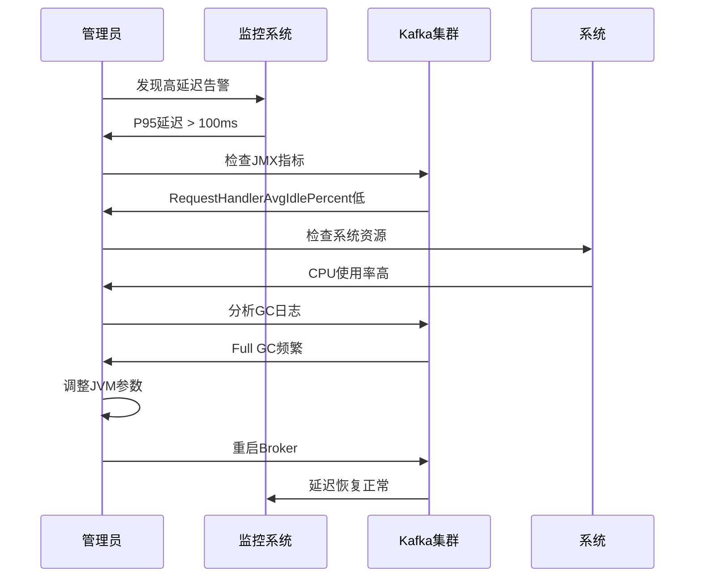

---

## 容量规划

### 1. 容量规划方法

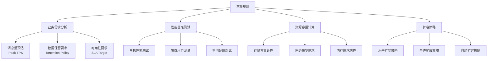

### 2. 容量计算公式

#### 存储容量计算

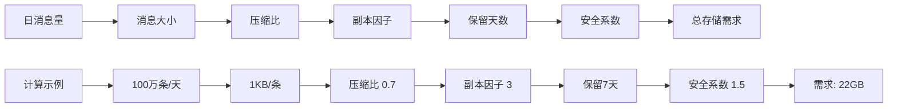

#### 网络带宽计算

```
Peak TPS * Message Size * Compression Ratio * (1 + Replication Factor) = Required Bandwidth

示例:
10,000 TPS * 1KB * 0.7 * (1 + 2) = 21 MB/s
加上Consumer流量: 21 MB/s * 2 = 42 MB/s
```

### 3. 集群规模规划

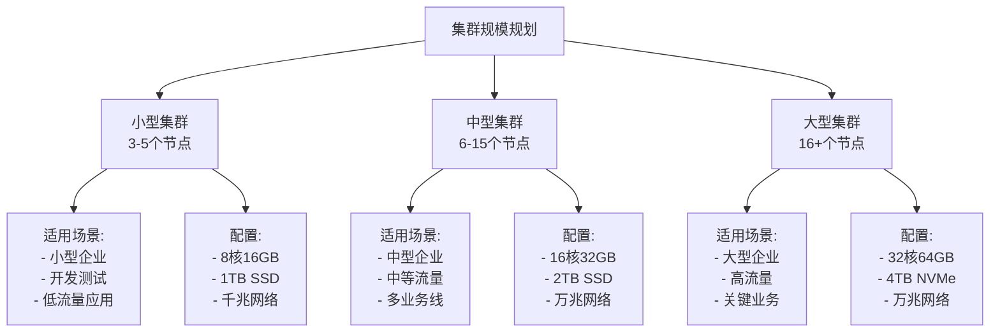

---

## 运维最佳实践

### 1. 部署最佳实践

#### 集群部署架构

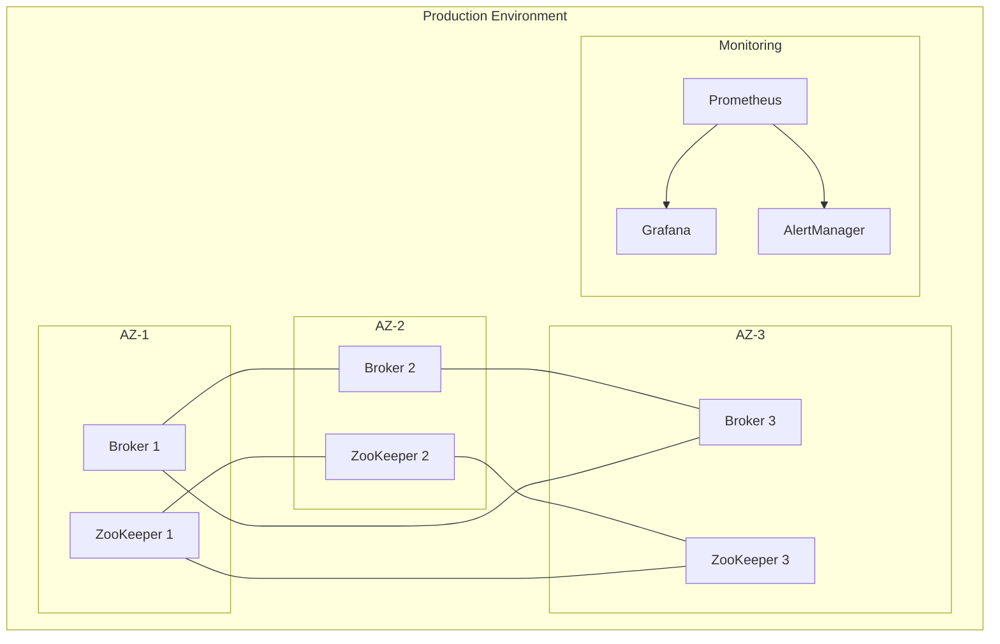

### 2. 变更管理流程

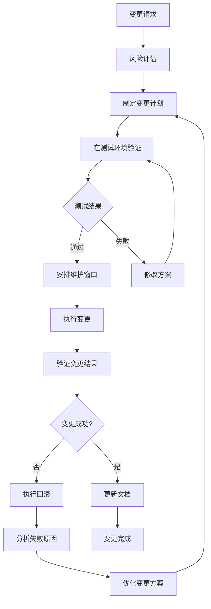

### 3. 备份和恢复策略

#### 备份策略

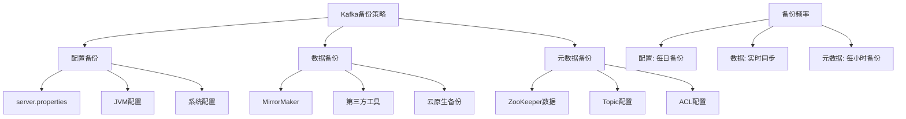

### 4. 滚动升级流程

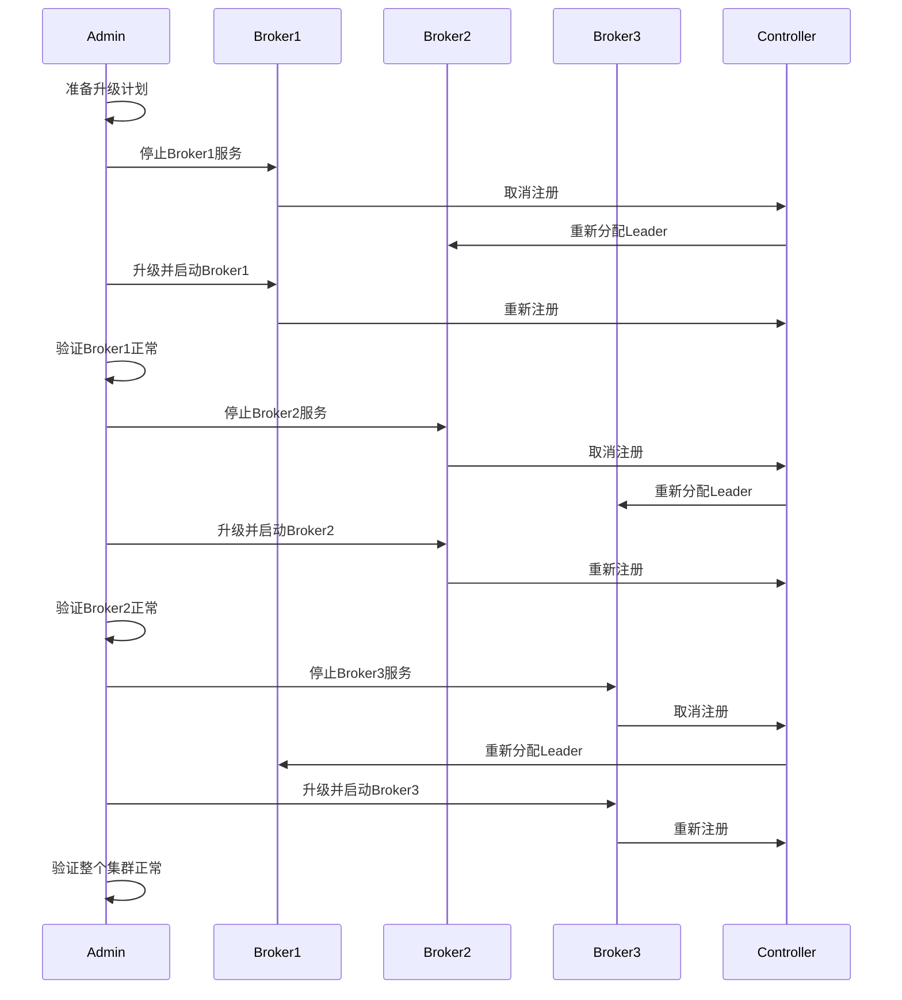

### 5. 安全配置

#### SSL/TLS 配置

```properties
# server.properties SSL配置
listeners=SSL://0.0.0.0:9093
security.inter.broker.protocol=SSL
ssl.keystore.location=/path/to/kafka.keystore.jks
ssl.keystore.password=keystore-password
ssl.key.password=key-password
ssl.truststore.location=/path/to/kafka.truststore.jks
ssl.truststore.password=truststore-password
ssl.client.auth=required
```

#### SASL 认证配置

```properties
# SASL配置
sasl.enabled.mechanisms=SCRAM-SHA-512
sasl.mechanism.inter.broker.protocol=SCRAM-SHA-512
security.inter.broker.protocol=SASL_SSL
```

---

## 总结

本文档全面分析了 Kafka 的性能优化和监控体系建设：

### 关键优化策略

1. **硬件优化**: SSD存储、充足内存、多核CPU
2. **操作系统优化**: 内核参数调优、文件系统选择
3. **JVM调优**: G1GC配置、堆大小设置
4. **Kafka配置**: 生产者、消费者、Broker参数优化

### 监控体系要点

1. **全链路监控**: JVM、系统、应用层指标
2. **告警体系**: 分级告警、自动化响应
3. **可视化**: Grafana Dashboard、实时监控

### 运维最佳实践

1. **容量规划**: 基于业务需求的科学计算
2. **变更管理**: 标准化流程、风险控制
3. **故障处理**: 快速诊断、有效恢复

通过系统性的优化和监控，可以构建高性能、高可用的 Kafka 集群，满足企业级生产环境的需求。

---

## 相关文档

- [Kafka深入分析-01-架构概述与核心概念](./Kafka深入分析-01-架构概述与核心概念.md)
- [Kafka深入分析-02-存储机制与日志结构](./Kafka深入分析-02-存储机制与日志结构.md)
- [Kafka深入分析-03-高并发处理机制](./Kafka深入分析-03-高并发处理机制.md)
- [Kafka深入分析-04-消息不丢失保证机制](./Kafka深入分析-04-消息不丢失保证机制.md)