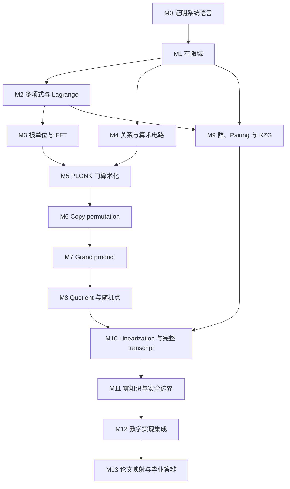
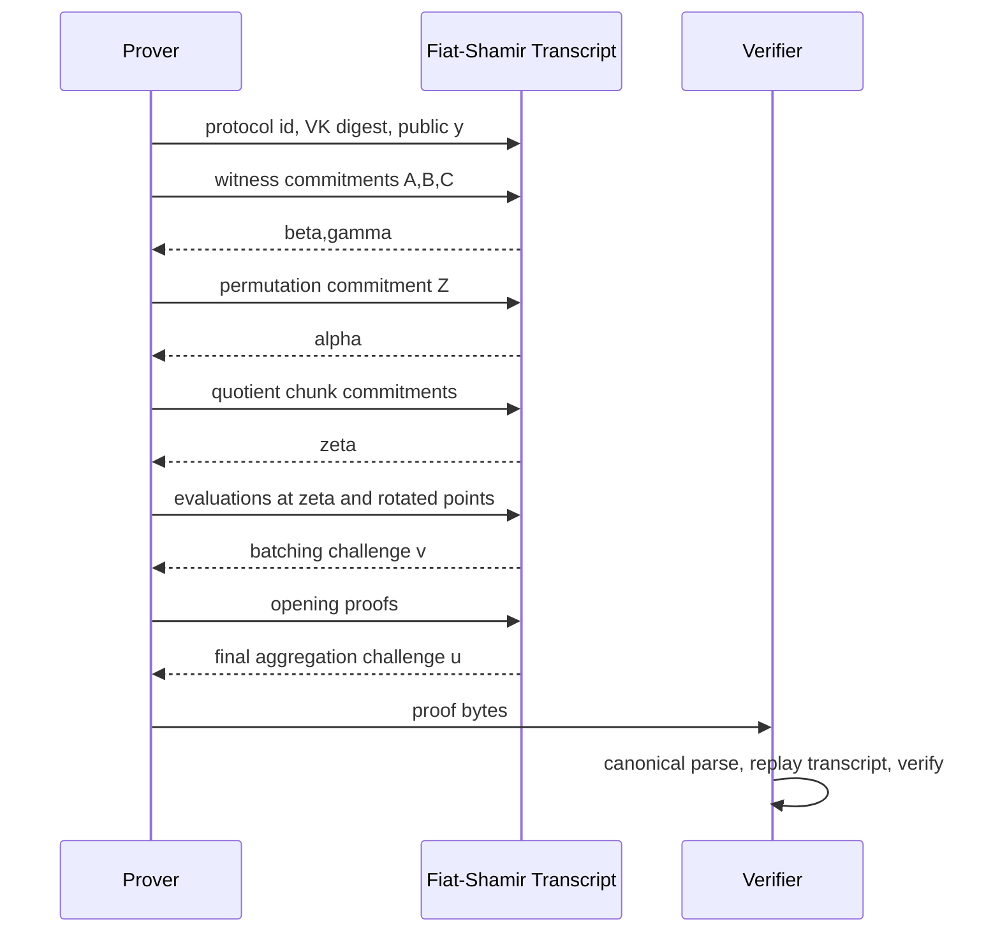
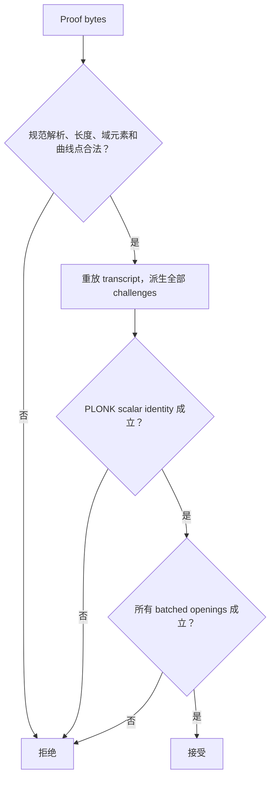

# B 线：PLONK 协议数学先行——完整学习路线

> **适合对象**：希望从公式真正理解原始 PLONK，而不是只会调用证明框架的学习者。  
> **最终产出**：一套自己的推导笔记、一份可测试的教学版 PLONK PIOP、一个真实 PCS 接口实验，以及对原始论文公式和 transcript 的逐项映射。  
> **标准周期**：18 周，每周 8–10 小时；完成核心推导约需 100–130 小时，连同安全分析、复盘和毕业项目约需 140–180 小时。  
> **主协议**：简化但内部一致的三列 PLONK，最后再对照原始论文的精确 KZG 编译、盲化与 proof layout。  
> **资料核对日期**：2026-08-06。本文是学习路线，不是生产 specification 或安全参数文件。

**配套分章讲义**：[PLONK B 线分章讲义：从 M0 到 M13](b-line-course/README.md)，按本路线把每个模块展开为直觉、推导、贯穿例子、实现骨架、反例与验收题。

**快速导航**：[学习终点](#0-学习终点与边界) · [入门诊断](#1-开始前的诊断) · [贯穿例子](#2-贯穿全程的同一个例子) · [总依赖图](#3-课程总依赖图) · [阶段课程](#5-阶段一数学与证明系统地基) · [18 周计划](#10-18-周标准计划) · [教学实现](#11-毕业项目教学版-plonk) · [安全验收](#13-安全性与反例验收) · [资料顺序](#16-资料与论文阅读顺序)

---

## 0. 学习终点与边界

### 0.1 完成 B 线后应具备的能力

完成后，你应当能在不依赖框架 API 的情况下：

1. 从关系 $R(x,w)=1$ 设计 witness 与算术电路；
2. 把电路排成 $A,B,C$ 三列和 selector 表；
3. 在根单位子群上把列插值为多项式；
4. 推导 gate identity、copy permutation 和 grand product；
5. 构造 combined numerator 与 quotient polynomial；
6. 解释随机点检查的错误概率来自哪里；
7. 推导 KZG commit/open/verify；
8. 解释 linearization、opening batching 与各 challenge 的顺序；
9. 指出零知识随机性、SRS 风险和 transcript 绑定边界；
10. 写出一个小规模教学实现，并用恶意 witness 证明它确实在检查目标关系；
11. 将自己的记号逐项映射到 PLONK 原始论文或某个固定实现；
12. 清楚区分“教学代数正确”“密码学安全”和“可用于生产”。

### 0.2 B 线暂时不追求什么

在完成核心路线前，暂缓：

- Halo 2、Kimchi 等框架 API；
- Plookup、LogUp 与大表 lookup；
- FRI、STARK、Plonky2/3；
- recursion、accumulation、Nova-style folding；
- GPU FFT/MSM 优化；
- 自己实现生产级椭圆曲线、pairing 或 hash-to-field。

这些并非不重要，而是会让初学者同时面对多套记号、不同 PCS 和大量工程细节。B 线先建立一套稳定的“基准协议”，以后再比较变体。

### 0.3 三种学习速度

| 模式 | 周期 | 每周投入 | 适用条件 | 取舍 |
|---|---:|---:|---|---|
| 标准完整线 | 18 周 | 8–10 小时 | 有基础编程经验，数学从有限域补起 | 推荐；包含推导、实现、安全和论文复现 |
| 强化压缩线 | 10–12 周 | 14–18 小时 | 已学抽象代数、椭圆曲线或密码学 | 合并基础周，但不能省略反例测试 |
| 稳态慢速线 | 24–28 周 | 5–7 小时 | 工作日时间碎片化 | 每个模块拆成“理论周 + 实验周” |

不要用阅读速度判断进度。唯一有效的进度是：能否独立证明、实现并破坏当前模块的关键不变量。

---

## 1. 开始前的诊断

### 1.1 十二道入门题

不查资料，尝试回答：

1. 在 $\mathbb F_{17}$ 中，$5^{-1}$ 是多少？
2. “模 $p$ 的整数”何时构成域？
3. degree-$d$ 非零多项式最多有多少个根？
4. 为什么 $n$ 个互异点唯一确定 degree $<n$ 多项式？
5. 什么是阶为 $n$ 的根单位？
6. arithmetic circuit 中 statement 与 witness 有何不同？
7. commitment 的 binding 与 hiding 有何区别？
8. 为什么 prover 必须先 commit，再看到 challenge？
9. 为什么一组逐行 gate equations 不能自动保证跨行 wiring？
10. 椭圆曲线的 base field 与 scalar field 有何区别？
11. pairing 的双线性意味着什么？
12. soundness 与 zero-knowledge 是否互相推出？

### 1.2 结果如何使用

| 能独立回答 | 建议起点 |
|---:|---|
| 0–3 题 | 从模块 M0 开始，数学阶段不要压缩 |
| 4–7 题 | M0 快速复习，重点完成 M1–M3 的代码实验 |
| 8–10 题 | 可压缩 M0–M2，但必须完成 FFT、permutation 与 quotient 验收 |
| 11–12 题 | 仍从共同例子开始；可把节省时间用于安全证明与 capstone |

即使全部会答，也不建议直接跳到完整 transcript。PLONK 最容易出错的地方是不同部件之间的连接，而不是单个定义。

---

## 2. 贯穿全程的同一个例子

为避免每章换一个电路，本路线始终证明同一关系：

$$
R(y;x)=1
\quad\Longleftrightarrow\quad
y=(x+3)(x+5),
$$

其中 $y$ 公开，$x$ 私有，等式默认在选定有限域 $\mathbb F$ 中成立。若应用需要整数语义或范围限制，必须另外加入 range constraints；这不属于当前基准电路。

### 2.1 三行门表

引入中间值：

$$
r=x+3,\qquad s=x+5,\qquad y=rs.
$$

使用通用门

$$
q_La+q_Rb+q_Mab+q_Oc+q_C=0.
$$

把电路排成四行；最后一行用于 padding：

| 行 $i$ | $a_i$ | $b_i$ | $c_i$ | $q_L$ | $q_R$ | $q_M$ | $q_O$ | $q_C$ | 语义 |
|---:|---|---|---|---:|---:|---:|---:|---:|---|
| 0 | $x$ | 0 | $r$ | 1 | 0 | 0 | -1 | 3 | $x+3-r=0$ |
| 1 | $x$ | 0 | $s$ | 1 | 0 | 0 | -1 | 5 | $x+5-s=0$ |
| 2 | $r$ | $s$ | $y$ | 0 | 0 | 1 | -1 | 0 | $rs-y=0$ |
| 3 | 0 | 0 | 0 | 0 | 0 | 0 | 0 | 0 | padding |

表中的 $b_0,b_1$ 和 padding cells 没有业务语义，填 0 只是教学约定；它们不必被证明等于 0。安全要求是不能把未约束 cell 当作关系的一部分。实际零知识协议还可能用这些位置或额外行做 blinding，必须遵守目标规范。

### 2.2 必须额外表达的关系

逐行门还不够。必须证明：

- $a_0=a_1$：两处使用的是同一个秘密 $x$；
- $c_0=a_2$：$r$ 被送入乘法门左输入；
- $c_1=b_2$：$s$ 被送入乘法门右输入；
- $c_2=y_{public}$：最终输出绑定公开 statement。

前三项由 copy permutation 表达；最后一项由 public-input polynomial 或 instance constraint 表达。不同协议的 public-input 符号可能不同，本路线只要求内部约定一致。

### 2.3 为什么这个例子足够好

它同时包含：

- 常数加法；
- 乘法；
- 同一变量的 fan-out；
- 两条跨行 copy；
- 一个公开输出；
- padding 和大小为 $4$ 的 FFT domain。

从 M1 开始，每个模块都要在这个例子上增加一层，而不是重新造 demo。

---

## 3. 课程总依赖图



主线中的关键分界是：

$$
\underbrace{M0\to M8}_{\text{PLONK 算术化与 PIOP}}
\quad+\quad
\underbrace{M9}_{\text{KZG PCS}}
\quad\Longrightarrow\quad
\underbrace{M10\to M13}_{\text{完整非交互 zk-SNARK 与实现}}.
$$

先完成 M8，再深入 pairing/KZG。这样即使以后换成 IPA 或 FRI，也不会把 PLONK 的算术化误认为某一种承诺方案。

---

## 4. 学习方法与统一记号

### 4.1 每个模块固定交付五件东西

1. **定义卡**：本模块所有对象的类型、domain、公开/私有属性；
2. **推导页**：不抄结论，独立完成关键等式；
3. **最小代码**：只实现本模块算法；
4. **反例**：至少构造一种能击穿不完整检查的输入；
5. **验收记录**：写清哪些性质已验证、哪些只是相信库或论文。

### 4.2 建立四本“账本”

#### 对象账本

| 对象 | 类型 | 谁知道 | 何时绑定 | degree/大小 |
|---|---|---|---|---|
| $A,B,C$ | witness polynomials | prover | $\beta,\gamma$ 前 | 记录实际上界 |
| $Q_L,\ldots,Q_C$ | fixed polynomials | public/VK | setup/key derivation | 记录实际上界 |
| $Z$ | permutation accumulator | prover | $\alpha$ 前 | 记录实际上界 |
| $t_j$ | quotient chunks | prover | $\zeta$ 前 | 每块落入 PCS 上界 |

每增加一个对象，就补齐一行。

#### Degree 账本

对每个乘法、rotation、mask 和除法记录 degree。不要用“差不多是 $O(n)$”代替精确上界。

#### Transcript 账本

记录每轮：吸收了什么、产生哪个 challenge、challenge 随机压缩哪类作弊。

#### 安全账本

记录每个结论依赖：域大小、随机点根界、PCS binding、DLOG/pairing 假设、ROM/AGM、SRS 或 ZK mask。

### 4.3 统一记号

| 记号 | 含义 |
|---|---|
| $\mathbb F$ | 电路和多项式所在有限域 |
| $n$ | 电路 domain 大小，例子中为 $4$ |
| $H=\langle\omega\rangle$ | 大小为 $n$ 的根单位子群 |
| $Z_H(X)=X^n-1$ | $H$ 的消失多项式 |
| $L_i(X)$ | 第 $i$ 行的 Lagrange basis polynomial |
| $A,B,C$ | 三条 witness wire polynomials |
| $Q_L,Q_R,Q_M,Q_O,Q_C$ | fixed selector polynomials |
| $S_{\sigma,1},S_{\sigma,2},S_{\sigma,3}$ | wiring permutation polynomials |
| $Z(X)$ | permutation grand-product polynomial |
| $t(X)$ | combined constraint quotient polynomial |
| $\beta,\gamma$ | permutation 随机压缩 challenges |
| $\alpha$ | 不同 constraint families 的合并 challenge |
| $\zeta$ | 域外随机 evaluation challenge |
| $v,u$ | opening batching / multi-point aggregation challenges |
| $[f]$ | 对多项式 $f$ 的 commitment |

不同论文可能交换 numerator/denominator、改变 $Z$ 的递推方向或复用 challenge 字母。学习时先保持本文内部一致，再做映射。

### 4.4 六个必须亲自证明的命题

1. $n$ 个互异点唯一确定 degree $<n$ 多项式；
2. $P(h)=0$ 对所有 $h\in H$ 成立，当且仅当 $Z_H\mid P$；
3. 合法 copy permutation 会让 grand product 首尾闭合；
4. 非零 degree-$d$ polynomial 在随机点取零的概率至多约为 $d/|\mathbb F|$；
5. KZG pairing equation 对正确 opening 成立；
6. $A_0+Z_Hr$ 在 $H$ 上与 $A_0$ 取值相同。

这六个命题组成整条 B 线的证明骨架。

---

## 5. 阶段一：数学与证明系统地基

### M0：证明系统共同语言（3–4 小时）

#### 学习目标

- 从应用叙述写出 $R(x,w)=1$；
- 区分 proof 与 argument；
- 区分 completeness、soundness、knowledge soundness、zero-knowledge、succinctness；
- 理解 preprocessing、SRS、proving key、verification key；
- 理解 interactive public-coin protocol 与 Fiat–Shamir 的关系。

#### 必做推导

对贯穿例子写出：

$$
x_{public}=y,\qquad w=x,
$$

并说明以下四种错误系统分别缺什么：

1. proof 中直接发送 $x$；
2. verifier 只检查 proof 长度；
3. prover 看完所有随机 challenges 才选择 witness；
4. verifier 不把 $y$ 放入 transcript。

#### 交付物

- 一页性质对照表；
- 一张 relation → circuit → PIOP → PCS → transcript 图；
- 四个错误系统的攻击说明。

#### 通过标准

能用一句话回答：“零知识证明到底隐藏什么、又证明什么？”

#### 阅读

- [总指南：PLONK 到底解决什么问题](README.md#1-plonk-到底解决什么问题)
- [技术全景](../stark/01-技术全景与学习路线.md)

### M1：有限域与子群（8–10 小时）

#### 学习目标

- 熟练进行 $\mathbb F_p$ 运算；
- 理解群、环、域的最小必要概念；
- 会求逆元、元素阶和生成子群；
- 理解 field semantics 与 integer semantics 的差别；
- 区分曲线 base field 和 scalar field。

#### 必做手算

在 $\mathbb F_{17}$ 中：

1. 用扩展 Euclidean algorithm 求 $5^{-1}=7$；
2. 证明 $4$ 的阶为 $4$；
3. 写出 $H=\{1,4,16,13\}$；
4. 验证 $X^4-1$ 在 $H$ 上全为零；
5. 找出一个不在 $H$ 中的元素，并说明它能否作为 coset shift。

#### 最小代码

实现：

```text
Fp.add / sub / mul / neg / pow / inv / div
```

测试：

- 对所有非零 $a\in\mathbb F_{17}$ 验证 $aa^{-1}=1$；
- 随机验证分配律；
- `inv(0)` 必须失败；
- 检查不同整数代表被规范化为同一 field element。

#### 反例

构造一个“整数上溢出但域约束成立”的例子，说明为什么 range check 不可省略。

#### 通过标准

看到 $a+b=c$ 时，会自动追问它是在整数、base field 还是 scalar field 中成立。

#### 阅读

- [有限域](../zk-book/zh/03-finite-fields.md)
- [抽象代数](../zk-book/zh/05-abstract-algebra.md)
- [群论](../zk-book/zh/06-group-theory.md)
- [有限域、多项式与编码基础](../stark/02-有限域多项式与编码基础.md)

### M2：多项式、插值与消失多项式（10–12 小时）

#### 学习目标

- 熟练使用 coefficient form 与 evaluation form；
- 会做多项式加、乘、除、求值；
- 独立推导 Lagrange interpolation；
- 理解 vanishing polynomial 和 boundary selector；
- 理解 degree 与根数之间的关系。

#### 必做推导

对互异点 $x_0,\ldots,x_{n-1}$，推导：

$$
L_i(X)=\prod_{j\ne i}\frac{X-x_j}{x_i-x_j},
\qquad
f(X)=\sum_i f(x_i)L_i(X).
$$

对根单位子群 $H$，推导：

$$
Z_H(X)=X^n-1,
$$

以及：

$$
L_i(X)=
\frac{Z_H(X)}{(X-\omega^i)Z_H'(\omega^i)}.
$$

#### 最小代码

实现：

```text
poly_add
poly_sub
poly_mul
poly_eval
poly_divmod
lagrange_interpolate
vanishing_polynomial
```

测试：

- 随机多项式 → 求值 → 插值 → 系数一致；
- $P=Z_HQ$ 时 `divmod(P, Z_H)` 余数为零；
- 修改 $P$ 在任意一个 domain 点的值后，余数不再为零；
- 重复插值点必须被拒绝。

#### 反例

展示在仅有 $n$ 个点时，两个高次多项式可以有相同 evaluations；解释 degree bound 为什么不可省略。

#### 通过标准

能把“每一行成立”立即翻译成“一个多项式被 $Z_H$ 整除”。

#### 阅读

- [Python 拉格朗日插值](../zk-book/zh/13-python-lagrange-interpolation.md)
- [Schwartz–Zippel 引理](../zk-book/zh/14-schwartz-zippel-lemma.md)
- [有限域、多项式与编码基础](../stark/02-有限域多项式与编码基础.md)

### M3：根单位、FFT/IFFT 与 coset（8–10 小时）

#### 学习目标

- 推导 radix-2 FFT 的偶/奇拆分；
- 理解 bit-reversal 与蝶形；
- 会从 roots of unity 构造 evaluation domain；
- 理解 IFFT 的逆根与 $n^{-1}$；
- 理解 quotient 为什么在 disjoint coset 上计算。

#### 必做推导

把

$$
f(X)=f_e(X^2)+Xf_o(X^2)
$$

代入 $\omega^k$，得到：

$$
f(\omega^k)=f_e(\omega^{2k})+
\omega^k f_o(\omega^{2k}).
$$

解释递归规模为何从 $n$ 变成两个 $n/2$，总复杂度为何为 $O(n\log n)$。

#### 最小代码

实现：

```text
primitive_root_of_unity
fft
ifft
coset_fft
coset_ifft
```

测试：

- FFT 与朴素求值对拍；
- `ifft(fft(coeffs)) == coeffs`；
- 错误根单位必须使测试失败；
- coset 上所有 $Z_H(x)$ 必须非零。

#### 反例

在没有 zero-padding 的情况下逐点乘两个 degree 接近 $n$ 的多项式，观察 interpolation 得到的是 $fg\bmod Z_H$ 而非普通乘积。

#### 通过标准

能说明 FFT 是表示转换算法，不是自动保证低次或约束正确性的密码学魔法。

#### 阅读

- [有限域、多项式与编码基础：FFT 部分](../stark/02-有限域多项式与编码基础.md)

---

## 6. 阶段二：从关系到 PLONK 算术化

### M4：算术电路、witness 与 underconstraint（6–8 小时）

#### 学习目标

- 把 relation 分解为低次域方程；
- 区分 witness generation 与 constraint checking；
- 理解 public、private、auxiliary values；
- 能系统发现 underconstraint；
- 理解 R1CS/QAP 只是比较材料，不是 PLONK 的硬前置。

#### 必做任务

对贯穿例子：

1. 写出诚实 witness $x,r,s,y$；
2. 写出三行局部门约束；
3. 列出所有跨行相等关系；
4. 删除 $a_0=a_1$，构造一份局部门都成立但不对应任何单一 $x$ 的 witness；
5. 删除 public-output constraint，构造一份对任意公开 $y$ 都能通过的 witness。

#### 最小代码

实现一个纯表格检查器：

```text
evaluate_gate_row(row)
check_all_gate_rows(table)
check_copy_constraints(table, copies)
check_public_inputs(table, public_inputs)
```

这一步还不使用多项式或承诺。

#### 通过标准

对任何电路都先问：“恶意 prover 可以自由选择哪些 cell？”而不是只运行诚实 witness。

#### 阅读

- [算术电路](../zk-book/zh/02-arithmetic-circuit.md)
- [R1CS](../zk-book/zh/11-rank-1-constraint-system.md)，只做对照

### M5：三列门与 Lagrange 算术化（8–10 小时）

#### 学习目标

- 从表格得到 $A,B,C$ 与 $Q_L,\ldots,Q_C$；
- 在 $H$ 上插值所有列；
- 推导 gate polynomial；
- 加入 public input；
- 用 divisibility 验证所有行。

#### 核心推导

插值：

$$
A(\omega^i)=a_i,\quad
B(\omega^i)=b_i,\quad
C(\omega^i)=c_i.
$$

selector 同理。定义：

$$
\begin{aligned}
G(X)={}&Q_L(X)A(X)+Q_R(X)B(X)+Q_M(X)A(X)B(X)\\
&+Q_O(X)C(X)+Q_C(X)+PI(X).
\end{aligned}
$$

证明：

$$
G(h)=0\ \forall h\in H
\quad\Longleftrightarrow\quad
Z_H(X)\mid G(X).
$$

#### Degree 账本

在无盲化、所有列 degree $<n$ 的教学模型中：

| 项 | degree 上界 |
|---|---:|
| $Q_LA,Q_RB,Q_OC$ | $2n-2$ |
| $Q_MAB$ | $3n-3$ |
| $G$ | 至多 $3n-3$ |

这不是完整生产协议的 degree 表；盲化、额外边界和 custom gate 会改变上界。

#### 最小代码

```text
interpolate_witness_columns
interpolate_selector_columns
build_gate_polynomial
check_divisible_by_vanishing
```

测试至少破坏：

- 一行乘法；
- 一个常数 selector；
- public output；
- padding selector。

#### 通过标准

能从表格逐项解释 $G(X)$ 的每一项，而不是把它当一个需要背诵的公式。

#### 阅读

- [PLONK 算术化基础](../stark/04-PLONK算术化基础.md)

---

## 7. 阶段三：Permutation、Grand Product 与 Quotient

### M6：从 copy constraints 到 permutation（8–10 小时）

#### 学习目标

- 为每个 cell 构造唯一 identity label；
- 把同一逻辑 wire 的 cells 连成 cycle；
- 构造 sigma evaluations 与 polynomials；
- 理解 randomized multiset equality；
- 解释 $\beta$ 与 $\gamma$ 的不同职责。

#### 核心推导

取两两不交的 cosets：

$$
H,\qquad k_1H,\qquad k_2H.
$$

三列 identity labels：

$$
\operatorname{id}_1(X)=X,\qquad
\operatorname{id}_2(X)=k_1X,\qquad
\operatorname{id}_3(X)=k_2X.
$$

对贯穿例子至少包含 cycles：

$$
a_0\leftrightarrow a_1,
\qquad
c_0\leftrightarrow a_2,
\qquad
c_1\leftrightarrow b_2.
$$

未参与 copy 的位置可以是 fixed point。把 permutation 的像插值为 $S_{\sigma,j}$。

#### 必做实验

1. 枚举全部 $3n$ 个 identity labels，验证互异；
2. 验证 sigma 是双射；
3. 验证每个逻辑 wire 对应一个 cycle；
4. 故意让两个 cosets 相交，展示标签冲突；
5. 故意构造非双射 sigma，说明为什么它不再是 permutation argument。

#### 通过标准

能从一张 wiring 图手工写出 sigma cycles，再由 cycles 生成三列 sigma evaluations。

#### 阅读

- [PLONK 算术化：wiring permutation](../stark/04-PLONK算术化基础.md)
- [Permutation Argument](../zk-book/zh/42-permutation-argument.md)

### M7：Grand product accumulator（8–10 小时）

#### 学习目标

- 理解大乘积相等如何局部化为 recurrence；
- 推导 numerator/denominator；
- 理解起点边界与全局闭合；
- 理解 batch inversion 只优化 honest prover，不改变协议语义。

#### 核心推导

定义 identity 侧：

$$
\begin{aligned}
N(X)={}&(A(X)+\beta X+\gamma)\\
&\cdot(B(X)+\beta k_1X+\gamma)\\
&\cdot(C(X)+\beta k_2X+\gamma),
\end{aligned}
$$

以及 permutation 侧：

$$
\begin{aligned}
D(X)={}&(A(X)+\beta S_{\sigma,1}(X)+\gamma)\\
&\cdot(B(X)+\beta S_{\sigma,2}(X)+\gamma)\\
&\cdot(C(X)+\beta S_{\sigma,3}(X)+\gamma).
\end{aligned}
$$

定义：

$$
Z(1)=1,
\qquad
Z(\omega X)D(X)=Z(X)N(X).
$$

证明 recurrence 沿整个 $H$ 相乘后，中间 $Z$ 项 telescope，剩下 identity 与 permutation 两侧总乘积相等。

#### 最小代码

```text
compress_identity_side
compress_permutation_side
batch_inverse
build_grand_product_evaluations
interpolate_grand_product
```

#### 反例矩阵

| 修改 | 预期结果 |
|---|---|
| 改坏 $c_0=a_2$ | accumulator 不能合法闭合，除随机退化事件外 |
| 移除 $Z(1)=1$ | recurrence 允许任意整体缩放 |
| 在 commit 前固定并公开 $\beta,\gamma$ | prover 可能针对挑战选择恶意 witness |
| denominator 出现零 | 必须按协议的随机性与边界规则分析，不能静默除零 |

#### 通过标准

能用“随机 multiset fingerprint + telescoping product”两句话解释 permutation argument，同时写出完整公式。

### M8：Combined quotient、degree 与随机点检查（10–12 小时）

#### 学习目标

- 用 $\alpha$ 合并不同 constraint families；
- 构造 combined numerator；
- 计算 unblinded toy model 的精确 degree 上界；
- 在 disjoint coset 上构造 quotient；
- 理解 quotient chunks 与随机点 $\zeta$。

#### 核心推导

定义 permutation constraint：

$$
P_{\mathrm{perm}}(X)
=Z(\omega X)D(X)-Z(X)N(X),
$$

和 boundary：

$$
P_{\mathrm{bdry}}(X)=L_0(X)(Z(X)-1).
$$

随机合并：

$$
P_{\mathrm{all}}(X)
=G(X)+\alpha P_{\mathrm{perm}}(X)
+\alpha^2P_{\mathrm{bdry}}(X).
$$

合法 witness 满足：

$$
t(X)=\frac{P_{\mathrm{all}}(X)}{Z_H(X)}
$$

是多项式。

#### 教学模型的 degree 账本

若 $A,B,C,Q_i,S_{\sigma,j},Z$ 都有 degree 至多 $n-1$：

| 对象 | degree 上界 |
|---|---:|
| $N,D$ | $3n-3$ |
| $Z(\omega X)D(X)$、$Z(X)N(X)$ | $4n-4$ |
| $P_{\mathrm{perm}}$ | 至多 $4n-4$ |
| $P_{\mathrm{bdry}}$ | 至多 $2n-2$ |
| $P_{\mathrm{all}}$ | 至多 $4n-4$ |
| $t=P_{\mathrm{all}}/Z_H$ | 至多 $3n-4$ |

因此这个教学模型可把 $t$ 分成三个 degree $<n$ chunks：

$$
t(X)=t_0(X)+X^nt_1(X)+X^{2n}t_2(X).
$$

原始论文修订版和工程实现加入盲化、末行、lookup 或不同 linearization 后，必须重新计算 degree，不得照抄此表。

#### 随机点检查

在 commitments 绑定后采样 $\zeta$：

$$
P_{\mathrm{all}}(\zeta)
\stackrel?=
Z_H(\zeta)
\left(t_0(\zeta)+\zeta^nt_1(\zeta)+\zeta^{2n}t_2(\zeta)\right).
$$

#### 最小代码

```text
build_constraint_numerator
evaluate_on_quotient_coset
divide_by_vanishing_on_coset
split_quotient_chunks
recombine_quotient_at_point
check_scalar_identity
```

#### 必做反例

- 改坏 gate；
- 改坏 copy；
- 改坏 public input；
- 调换 quotient chunks；
- 错用 $\zeta^j$ 而不是 $\zeta^{jn}$；
- 在 $H$ 上直接做 $P/Z_H$ 并观察除零。

#### 通过标准

能从 degree 账本推导 quotient chunks，而不是记住“PLONK 有三个 $t$ commitment”。

#### 阅读

- [PLONK 完整协议：quotient 部分](../stark/05-PLONK完整协议与KZG承诺.md)

---

## 8. 阶段四：KZG 与完整非交互协议

### M9：椭圆曲线、Pairing 与 KZG（14–18 小时）

#### 学习目标

- 理解椭圆曲线群是 PLONK 的承诺后端，不是电路计算域的同义词；
- 区分 curve base field、group order/scalar field；
- 理解 MSM 与 pairing 的功能；
- 推导 KZG setup、commit、open、verify；
- 理解 universal/updatable SRS 与 degree bound；
- 区分 binding 与 hiding。

#### 学习顺序

1. 群、生成元、离散对数；
2. 椭圆曲线群运算的接口级理解；
3. 双线性 pairing；
4. SRS 中的 powers of $\tau$；
5. KZG commitment；
6. 单点 opening；
7. 同点 batch opening；
8. SRS ceremony 与 subgroup/encoding 边界。

不需要自己实现 Miller loop，但必须能推导 pairing equation。

#### 核心推导

SRS：

$$
([1]_1,[\tau]_1,\ldots,[\tau^D]_1;[1]_2,[\tau]_2).
$$

若

$$
f(X)=\sum_{i=0}^{d}f_iX^i,
$$

则：

$$
[f]=[f(\tau)]_1=\sum_i f_i[\tau^i]_1.
$$

声称 $f(z)=y$。由因式定理：

$$
q(X)=\frac{f(X)-y}{X-z}.
$$

opening proof：

$$
\pi=[q(\tau)]_1.
$$

验证：

$$
e([f]-y[1]_1,[1]_2)
\stackrel?=
e(\pi,[\tau]_2-z[1]_2).
$$

亲自把两侧化为：

$$
e([1]_1,[1]_2)^{f(\tau)-y}
\quad\text{与}\quad
e([1]_1,[1]_2)^{q(\tau)(\tau-z)}.
$$

#### 同点 batching

在 commitments 和 claimed evaluations 都绑定后采样 $v$：

$$
F(X)=\sum_{i=0}^{m-1}v^iF_i(X),
\qquad
y=\sum_{i=0}^{m-1}v^iy_i.
$$

只需打开 $F(z)=y$。解释若 $v$ 在 claims 固定前公开，恶意 prover 如何让错误相互抵消。

#### 实验分两层

**层 1：符号/指数模拟**

在测试中把群元素抽象成“指数”，只验证 KZG 正确性恒等式。必须在 README 标注：这种模拟没有 DLOG binding，不能表示密码学安全。

**层 2：真实库**

使用成熟库提供的曲线、MSM、pairing 和 subgroup 检查。你只实现 PCS 适配层，不自己写曲线密码学。

#### 必做反例

| 错误 | 应被哪一层拒绝 |
|---|---|
| 修改 $y$ | pairing opening check |
| 修改 $z$ | pairing opening check |
| 修改 commitment | pairing opening check |
| 用 degree 超过 SRS 上界的 $f$ | commit/degree policy |
| 接受非 subgroup 点 | parser/group validation 必须拒绝 |
| 泄露 $\tau$ | 安全假设整体失效，不是普通 proof 验证错误 |

#### 通过标准

能从因式定理独立推导 pairing equation，并解释 KZG 为什么短、为什么需要结构化 SRS、为什么默认不 hiding。

#### 阅读

- [同态](../zk-book/zh/07-homomorphisms.md)
- [椭圆曲线加法](../zk-book/zh/08-elliptic-curve-addition.md)
- [有限域上的椭圆曲线](../zk-book/zh/09-elliptic-curves-finite-fields.md)
- [双线性配对](../zk-book/zh/10-bilinear-pairing.md)
- [可信设置](../zk-book/zh/17-trusted-setup.md)
- [多项式承诺与 Fiat–Shamir](../stark/03-多项式承诺与Fiat-Shamir变换.md)
- [KZG 原始长版](https://cacr.uwaterloo.ca/techreports/2010/cacr2010-10.pdf)

### M10：Linearization、Openings 与完整 Transcript（10–12 小时）

#### 学习目标

- 理解随机点处为什么仍有许多 polynomial openings；
- 理解 linearization 如何利用 commitment 线性同态；
- 区分 same-point batching 与 multi-point opening；
- 能写出完整 challenge dependency；
- 能实现 prover/verifier 对 transcript 的逐字节一致重放。

#### Linearization 的思路

在 $\zeta$，prover 声称：

$$
a=A(\zeta),\quad b=B(\zeta),\quad c=C(\zeta),
$$

以及 $Z(\omega\zeta)$、部分 sigma evaluations 和 quotient evaluations。

把这些已声明 evaluations 当作 scalars 后，原本非线性的约束可重组为一个对尚未 opening 的 committed polynomials 线性的表达：

$$
R(X)=\sum_i \lambda_i(\text{claimed evaluations},\text{challenges})F_i(X)+r_0.
$$

由于 KZG 线性同态：

$$
[R]=\sum_i\lambda_i[F_i]+r_0[1],
$$

verifier 可由已有 commitments 计算 $[R]$。Linearization 压缩的是“需要单独 opening 的多项式”，并不替代 scalar PLONK identity 或 PCS check。

#### 两类 batching 不可混淆

| 操作 | 合并什么 | 挑战必须晚于什么 |
|---|---|---|
| same-point polynomial batching | 多个 $F_i(\zeta)=y_i$ | 全部 commitments 与 claimed evaluations |
| multi-point aggregation | $\zeta,\omega\zeta$ 等不同点的 opening claims | 被合并的 opening proofs/claims，依目标协议而定 |

不能把不同点的 commitments 简单相加后统一使用同一个 $\tau-\zeta$ 因子。

#### Transcript 依赖图



该图表达依赖骨架，不规定所有 PLONK 版本都使用相同字段、challenge 名或 proof encoding。

#### Transcript 必须吸收

- protocol name 与 version；
- domain/curve/PCS 参数标识；
- verification key 或 canonical digest；
- public inputs 及其长度和顺序；
- commitments；
- claimed evaluations；
- opening proofs；
- 明确的 domain-separation labels。

#### 最小代码

```text
Transcript.absorb_bytes
Transcript.absorb_scalar
Transcript.absorb_point
Transcript.challenge_scalar
build_linearization_commitment
batch_same_point_claims
aggregate_multi_point_openings
```

prover 与 verifier 必须使用同一 canonical serialization；禁止把调试字符串作为协议编码。

#### 必做反例

1. 从 transcript 移除 public $y$；
2. 交换两个 evaluation 的顺序；
3. 在 quotient commitments 前生成 $\zeta$；
4. 重复使用另一个协议的 transcript domain；
5. parser 接受 trailing bytes；
6. prover/verifier 使用不同 point encoding。

#### 通过标准

能对 proof 中每个字段回答：“它为何在这里出现？它必须早于或晚于哪个 challenge？”

#### 阅读

- [PLONK 完整协议与 KZG](../stark/05-PLONK完整协议与KZG承诺.md)
- [PLONK 原始论文](https://eprint.iacr.org/2019/953)

### M11：零知识、Soundness 与安全边界（8–10 小时）

#### 学习目标

- 区分 arithmetization correctness、PIOP soundness、PCS binding 和 Fiat–Shamir 安全；
- 理解 witness polynomial blinding；
- 理解随机挑战只解决特定作弊空间；
- 能写出 soundness ledger，而不是口头声称“128-bit”；
- 理解教学实现为何不能用于生产。

#### Zero-knowledge mask

若 $A_0$ 在 $H$ 上编码 witness，取随机低次 $r_A$：

$$
A(X)=A_0(X)+Z_H(X)r_A(X).
$$

因为 $Z_H(h)=0$：

$$
A(h)=A_0(h)\qquad\forall h\in H.
$$

但 $A(\zeta)$ 在域外被随机化。对 $B,C,Z$ 和其他 prover polynomials 的 mask 数量与 degree 必须按精确协议计算。现代实现也可能使用 reserved/blinding rows；两种做法不能随意拼接。

#### 安全职责表

| 风险 | 防线 | 若缺失会怎样 |
|---|---|---|
| 某行 gate 错误 | $Z_H$ divisibility + 随机点检查 | 局部错误可被隐藏 |
| copy/wiring 错误 | permutation compression + grand product | prover 可给同一 wire 填不同值 |
| 不同 constraint families 抵消 | 随机 $\alpha$ | 恶意构造 cancellation |
| 看到挑战后换 polynomial | commitment binding + round order | 随机点检查失去意义 |
| 捏造 claimed evaluation | PCS opening | scalar identity 可被临时编造 |
| proof 泄露 witness | polynomial blinding / hiding layer | sound 但不 zero-knowledge |
| SRS toxic waste 泄露 | ceremony/更新治理 | KZG degree/evaluation binding 失效 |
| transcript 跨协议重放 | domain separation + VK/public binding | proof 可能被错上下文接受 |

#### Soundness 账本

至少分开记录：

1. 随机多项式恒等式检查的 degree/field-size 项；
2. permutation 随机压缩的失败事件；
3. 随机 batching 的失败事件；
4. KZG/曲线假设；
5. Fiat–Shamir 使用的 random oracle 模型；
6. 所有事件如何用 union bound 或目标定理组合。

字段约有 255 bit 不等于系统自动有 255-bit soundness；也不能只因目标是 128 bit 就跳过具体错误项。

#### 必做证明与实验

1. 证明 mask 不改变 $H$ 上 witness values；
2. 计算 mask 后的 degree，确认不超过 SRS/quotient budget；
3. 比较无 mask 和有 mask 时多个 proof 的域外 evaluations；
4. 对每个 challenge 写出“若提前公开”的攻击思路；
5. 明确你使用的 KZG 库验证了哪些 point/subgroup 条件。

#### 通过标准

能把“证明正确”“难以伪造”“知道 witness”“不泄露 witness”分别对应到不同机制和假设。

---

## 9. 阶段五：集成、论文映射与毕业

### M12：教学版 PIOP/KZG 集成（18–22 小时）

本模块不再新增数学，而是把 M1–M11 拼成一条可重复、可破坏的协议流水线。

#### 推荐实现顺序

1. **表格 verifier**：逐行检查 gate/copy/public constraints；
2. **多项式 verifier**：检查 gate 与 permutation numerators 被 $Z_H$ 整除；
3. **Oracle PIOP**：prover 提供完整 polynomials，verifier 在 transcript 随机点检查；
4. **PCS 版本**：用真实库 commitments/openings 替换完整 polynomial 传输；
5. **ZK 版本**：按明确 degree budget 加 blinding；
6. **序列化版本**：proof bytes 可 canonical round-trip，并拒绝多余数据。

每加一层都保留前一层作为 differential oracle。若 PCS 版本行为异常，可与完整多项式 verifier 对拍。

#### Prover 伪代码

```text
input: public y, private x, circuit/VK, SRS

1. build witness table A_values, B_values, C_values
2. interpolate and blind A, B, C
3. commit A, B, C
4. derive beta, gamma
5. build and blind grand-product Z; commit Z
6. derive alpha
7. build P_all and quotient t on a disjoint coset
8. split t into chunks; commit chunks
9. derive zeta
10. evaluate required polynomials at zeta and rotations
11. absorb claimed evaluations; derive batching challenges
12. create KZG opening proof(s)
13. serialize proof canonically
```

#### Verifier 伪代码

```text
input: public y, VK, proof bytes

1. canonical parse and validate all scalars/points
2. replay transcript in exactly the prover order
3. reconstruct public-input evaluation
4. recombine quotient chunks at zeta
5. check scalar PLONK identity
6. reconstruct linearization/batched commitments
7. verify KZG opening equation(s)
8. accept only if every check succeeds and no bytes remain
```

#### 通过标准

所有负面 test vectors 都必须在预期的最早层失败，并且错误不能只表现为 panic 或未定义行为。

### M13：原始论文映射与毕业答辩（8–10 小时）

#### 三遍读法

**第一遍：结构**

- 只标 relation、arithmetization、permutation、PCS compiler、rounds；
- 不纠缠符号差异；
- 画出论文自己的 dependency graph。

**第二遍：公式**

- 建立本文记号到论文记号的双向表；
- 逐项核对 grand product 方向、边界行、quotient degree；
- 标注哪些 formula 是本文简化，哪些是论文精确定义。

**第三遍：安全**

- 记录 theorem 的模型和假设；
- 区分 interactive protocol 与 Fiat–Shamir 后的 NIZK；
- 记录零知识模拟器使用的随机性；
- 对照 proof layout 检查 challenge 顺序。

#### 必交映射表

下表是毕业作业，第二列必须由学习者查阅所选论文版本后填写：

| 本文对象 | 论文对象/位置 | 是否完全相同 | 差异原因 |
|---|---|---|---|
| $A,B,C$ | 学习者填写 | 是/否 | 盲化或命名 |
| $S_{\sigma,j}$ | 学习者填写 | 是/否 | permutation 方向 |
| $Z$ | 学习者填写 | 是/否 | recurrence 下标 |
| $t_j$ | 学习者填写 | 是/否 | degree 与 chunks |
| $\beta,\gamma,\alpha,\zeta$ | 学习者填写 | 是/否 | transcript 命名 |
| opening proofs | 学习者填写 | 是/否 | multi-opening layout |

#### 毕业答辩

不看笔记，白板完成：

1. 从 $y=(x+3)(x+5)$ 画出三列电路表；
2. 写出 selectors 和 copy cycles；
3. 推导 $N,D,Z$；
4. 写出 $P_{\mathrm{all}}$ 与 $t$；
5. 给出 toy model degree 上界；
6. 推导 KZG opening equation；
7. 画出完整 transcript；
8. 指出 ZK mask；
9. 解释 verifier 的 scalar identity 与 PCS check；
10. 给出三种能通过不完整 verifier 的恶意证明策略。

完成这十项，才算 B 线毕业。

---

## 10. 18 周标准计划

| 周 | 模块 | 理论任务 | 编码/实验 | 周末验收 |
|---:|---|---|---|---|
| 1 | M0 | relation 与六种安全性质 | 写四个错误系统 | 能解释 PLONK 的六层结构 |
| 2 | M1 | 素域、逆元、子群 | `Fp` + exhaustive tests | 手算 $\mathbb F_{17}$ |
| 3 | M2 | 多项式运算、根数 | coefficient-form `Poly` | 除法与余数正确 |
| 4 | M2 | Lagrange、$Z_H$、$L_i$ | 插值 round-trip | 证明 divisibility 等价 |
| 5 | M3 | 根单位、FFT/IFFT | FFT 与朴素算法对拍 | 解释 coset 与 aliasing |
| 6 | M4 | relation → circuit | 表格 verifier + 恶意 witness | 找出所有 underconstraint |
| 7 | M5 | selectors 与 gate polynomial | 插值所有列、检查 $G/Z_H$ | 改坏任一行都失败 |
| 8 | M6 | labels、cycles、sigma | 生成 permutation columns | sigma 是双射且 labels 互异 |
| 9 | M7 | multiset compression | grand product + batch inverse | copy 改坏时闭合失败 |
| 10 | M8 | combined numerator | 构造 $P_{all}$ | degree 账本完整 |
| 11 | M8 | coset quotient、chunks、$\zeta$ | quotient 与 scalar identity | chunk 重组测试通过 |
| 12 | M9 | 群、曲线、pairing | 调用成熟曲线库 | 分清 base/scalar field |
| 13 | M9 | KZG setup/open/verify | 单点与 batched opening | 修改 claim 必须失败 |
| 14 | M10 | linearization | 派生 commitment 组合 | 能解释压缩对象 |
| 15 | M10–M11 | transcript、ZK、安全账本 | transcript differential tests | challenge 顺序与 mask degree 正确 |
| 16 | M12 | Oracle PIOP 集成 | 完整多项式 prover/verifier | 与表格 verifier 对拍 |
| 17 | M12 | PCS 集成与负面 vectors | KZG proof、canonical encoding | 全部 tampering 被拒绝 |
| 18 | M13 | 论文第三遍与答辩 | 映射表、报告、演示 | 白板十题全部完成 |

### 10.1 强化压缩线如何合并

| 强化周 | 合并内容 |
|---:|---|
| 1 | M0 + M1 |
| 2 | M2 |
| 3 | M3 + M4 |
| 4 | M5 |
| 5 | M6 + M7 |
| 6 | M8 |
| 7 | M9 |
| 8 | M10 |
| 9 | M11 + Oracle PIOP |
| 10 | PCS 集成、论文映射与答辩 |

强化线只压缩日历，不减少实验和反例数量。

### 10.2 慢速线如何拆分

每个数学模块拆成：

- A 周：定义、手算、推导；
- B 周：代码、property tests、反例、总结。

M9–M12 各保留至少两周。总周期约 26 周。

---

## 11. 毕业项目：教学版 PLONK

### 11.1 项目目标

实现一个只支持固定三列通用门的小型系统，能够证明贯穿关系：

$$
y=(x+3)(x+5).
$$

项目必须优先保证：

- 公式与代码一一对应；
- 可读、可调试、可注入错误；
- 每个 challenge 可追踪；
- degree 可追踪；
- 有独立 oracle verifier；
- 不声称生产安全。

性能不是毕业指标。

### 11.2 推荐技术选择

| 层 | 首选 | 原因 |
|---|---|---|
| M1–M8 | Python 或你最熟悉的语言 | 快速打印中间 polynomial/evaluation |
| property tests | 原生测试框架 + 随机种子固定 | 可复现 |
| M9 KZG | 成熟库的 BLS12-381 或 BN254 接口 | 不自造 curve/pairing |
| transcript | 明确 byte encoding 的哈希接口 | 检查顺序和 domain separation |
| 第二版 | Rust 可选 | 练习类型边界与性能，不应阻塞数学学习 |

若使用 BN254、BLS12-381 或其他曲线，必须明确：多项式系数位于曲线 scalar field，而不是曲线坐标 base field。

### 11.3 推荐目录

```text
plonk-math-lab/
├── README.md
├── docs/
│   ├── notation.md
│   ├── degree-ledger.md
│   ├── transcript.md
│   ├── security-boundary.md
│   └── paper-mapping.md
├── src/
│   ├── field
│   ├── polynomial
│   ├── domain_fft
│   ├── circuit_table
│   ├── arithmetization
│   ├── permutation
│   ├── grand_product
│   ├── quotient
│   ├── transcript
│   ├── pcs
│   ├── prover
│   └── verifier
├── tests/
│   ├── algebra
│   ├── honest_proofs
│   ├── malicious_witnesses
│   ├── transcript_mutations
│   ├── proof_mutations
│   └── test_vectors
└── examples/
    └── quadratic_relation
```

语言不支持目录模块时可合并文件，但概念边界应保留。

### 11.4 模块接口

#### Field

```text
zero, one
add, sub, mul, neg
pow, inv, div
canonical_encode, canonical_decode
```

#### Polynomial

```text
degree
add, sub, scale, mul
eval
divmod
interpolate
```

#### Domain

```text
root_of_unity(n)
elements()
vanishing(x)
lagrange(i, x)
fft, ifft
coset_fft, coset_ifft
```

#### Circuit

```text
synthesize(public_input, witness)
selectors()
copy_cycles()
check_table_directly()
```

#### PIOP

```text
build_gate_polynomial
build_sigma_polynomials
build_grand_product
build_constraint_numerator
build_quotient
evaluate_claims
check_scalar_identity
```

#### PCS

```text
setup(max_degree)
commit(polynomial)
open(polynomials, points, transcript)
verify(commitments, claims, proof, transcript)
```

先用 `OraclePCS` 返回完整 polynomial，后用 `KZGPCS` 替换。上层 prover/verifier 不应依赖某个 PCS 的内部数据结构。

### 11.5 五个里程碑

| 里程碑 | 接受条件 |
|---|---|
| P0 代数库 | field/poly/FFT 全部对拍，随机种子固定 |
| P1 直接约束 | 诚实 witness 通过，每个约束可单独破坏 |
| P2 Polynomial IOP | divisibility、grand product、quotient、随机点检查通过 |
| P3 PCS 接入 | commitments 与 openings 替代完整 polynomial 传输 |
| P4 ZK/序列化 | mask degree 正确，canonical parser 拒绝所有畸形 proof |

每个里程碑都打一个本地 tag 或保留不可变快照，方便回归和比较。

### 11.6 禁止的教学捷径

- 用普通整数除法代替 field division；
- 对所有测试硬编码同一组 challenges，却把结果称作 Fiat–Shamir；
- 只检查 $P_{\mathrm{all}}(\zeta)=Z_H(\zeta)t(\zeta)$，不检查 openings；
- 只检查 openings，不检查 scalar identity；
- 让 prover 和 verifier 共享未序列化的内存对象；
- 忽略 public input 或 VK digest；
- 用小素域/小曲线声称“128-bit security”；
- 自己实现曲线/配对并用于真实资金；
- 把 panic 当作安全拒绝路径；
- 没有 degree ledger 就添加 mask 或 custom constraint。

---

## 12. 完整测试矩阵

### 12.1 代数层

| 测试 | 不变量 |
|---|---|
| field inverse exhaustive test | $aa^{-1}=1$，$a\ne0$ |
| polynomial division | $P=QD+R$ 且 $\deg R<\deg D$ |
| interpolation round-trip | coefficients → values → coefficients 不变 |
| FFT 对拍 | FFT values 等于朴素 evaluations |
| IFFT round-trip | `ifft(fft(f)) = f` |
| coset separation | $Z_H(x)\ne0$ 对所有 quotient coset 点成立 |

### 12.2 电路与算术化层

| Mutation | 预期失败位置 |
|---|---|
| $r\ne x+3$ | gate row 0 / gate quotient |
| $s\ne x+5$ | gate row 1 / gate quotient |
| $y\ne rs$ | gate row 2 / gate quotient |
| $a_0\ne a_1$ | copy/permutation |
| $c_0\ne a_2$ | copy/permutation |
| $c_1\ne b_2$ | copy/permutation |
| proof public $y$ 被替换 | public-input/scalar identity 或 transcript |
| padding row selector 非零 | gate identity 或明确拒绝 |

### 12.3 Permutation 与 quotient 层

| Mutation | 预期失败位置 |
|---|---|
| sigma 不是双射 | key/circuit construction |
| identity cosets 相交 | domain/key validation |
| $Z(1)\ne1$ | boundary constraint |
| grand product 中 numerator/denominator 交换一行 | permutation quotient |
| quotient chunk 顺序交换 | scalar identity |
| 使用 $\zeta^j$ 重组 chunks | scalar identity |
| 在 $H$ 上做 quotient division | construction 应拒绝除零 |

### 12.4 PCS 与 transcript 层

| Mutation | 预期失败位置 |
|---|---|
| commitment bit flip | PCS verify |
| claimed evaluation bit flip | scalar identity 或 PCS verify |
| opening proof bit flip | PCS verify |
| public input 从 transcript 删除 | transcript differential test 必须发现 |
| commitment 顺序交换 | challenge 变化，proof 拒绝 |
| proof 增加 trailing bytes | parser 拒绝 |
| 非规范 scalar encoding | parser 拒绝 |
| 非 subgroup curve point | group validation 拒绝 |
| 跨 protocol/version 重放 | domain separation 拒绝 |

### 12.5 ZK 层

以下测试只能辅助发现问题，不能代替正式 ZK 证明：

- 同一 witness 多次 proving，commitments/proof 应因随机 blinding 改变；
- 去掉 mask 后对比域外 evaluations，确认实验可观察到确定性；
- 固定随机种子只允许出现在 test vector 模式；
- 所有随机标量来源必须可审计；
- mask degree 超界时 construction 必须拒绝。

---

## 13. 安全性与反例验收

### 13.1 逐层接受条件



任何“方便调试”的跳过选项都不得出现在最终验收路径。

### 13.2 五类攻击者

| 攻击者 | 能力 | 你要验证的防线 |
|---|---|---|
| 恶意 witness 生成者 | 任意填所有 advice cells | 约束完备、copy/public binding |
| 恶意 prover | 任意构造 commitments、claims、proof | challenge 顺序、quotient、PCS |
| 畸形输入发送者 | 任意 proof bytes/curve encodings | canonical parser、subgroup checks |
| SRS 攻击者 | 可能知道或污染 ceremony secret | contribution verification、治理边界 |
| 观察者/verifier | 收集多份 proof 和 transcript | blinding 与 ZK 模拟边界 |

### 13.3 最小安全报告模板

```text
Statement:
Witness:
Field and domain:
Arithmetization:
Constraint degree bounds:
Permutation argument:
PCS and curve:
SRS model and maximum degree:
Transcript hash/domain separation:
Zero-knowledge mechanism:
Claimed soundness model:
Parser/serialization rules:
Negative tests:
Known omissions:
Not-for-production reasons:
```

若某一项只能写“默认应该没问题”，说明还没有完成 B 线。

### 13.4 不要给教学实现标安全位

除非你完成了以下工作，否则只写“未评估安全性”：

- 精确 field/curve 参数；
- 每项统计错误概率；
- PCS 假设与安全模型；
- Fiat–Shamir 模型；
- batching 和多次 proof 的损失；
- SRS 生成与验证；
- ZK 模拟论证；
- 实现审计与侧信道分析。

“使用 256-bit curve”不是完整安全分析。

---

## 14. 一页公式主干

这部分用于复习，不应用来替代推导。

### 14.1 Domain 与插值

$$
H=\{1,\omega,\ldots,\omega^{n-1}\},
\qquad
Z_H(X)=X^n-1.
$$

$$
A(\omega^i)=a_i,\quad
B(\omega^i)=b_i,\quad
C(\omega^i)=c_i.
$$

### 14.2 Gate

$$
G=Q_LA+Q_RB+Q_MAB+Q_OC+Q_C+PI.
$$

$$
Z_H\mid G
\quad\Longleftrightarrow\quad
\text{所有 gate rows 成立}.
$$

### 14.3 Identity 与 permutation products

$$
\operatorname{id}_1=X,\quad
\operatorname{id}_2=k_1X,\quad
\operatorname{id}_3=k_2X.
$$

$$
N=\prod_{j=1}^{3}(W_j+\beta\operatorname{id}_j+\gamma),
\qquad
D=\prod_{j=1}^{3}(W_j+\beta S_{\sigma,j}+\gamma).
$$

### 14.4 Grand product

$$
Z(1)=1,
\qquad
Z(\omega X)D(X)=Z(X)N(X).
$$

### 14.5 Combined quotient

$$
P_{\mathrm{all}}
=G+\alpha\bigl(Z(\omega X)D-ZN\bigr)
+\alpha^2L_0(Z-1).
$$

$$
t=\frac{P_{\mathrm{all}}}{Z_H}.
$$

### 14.6 Random evaluation

$$
P_{\mathrm{all}}(\zeta)
\stackrel?=
Z_H(\zeta)t(\zeta).
$$

若：

$$
t=t_0+X^nt_1+X^{2n}t_2,
$$

则：

$$
t(\zeta)=t_0(\zeta)+\zeta^nt_1(\zeta)+\zeta^{2n}t_2(\zeta).
$$

### 14.7 KZG

$$
[f]=[f(\tau)]_1,
\qquad
q(X)=\frac{f(X)-y}{X-z},
\qquad
\pi=[q(\tau)]_1.
$$

$$
e([f]-y[1]_1,[1]_2)
\stackrel?=
e(\pi,[\tau]_2-z[1]_2).
$$

### 14.8 ZK mask

$$
A=A_0+Z_Hr_A,
\qquad
A(h)=A_0(h)\quad(h\in H).
$$

### 14.9 协议因果链

$$
\boxed{
\text{table}
\to \text{interpolate}
\to \text{commit witness}
\to \text{permutation}
\to \text{quotient}
\to \text{random evaluations}
\to \text{PCS openings}
\to \text{verify}
}
$$

---

## 15. 进度与能力评分

### 15.1 模块评分

每个模块按 0–3 分自评：

| 分数 | 标准 |
|---:|---|
| 0 | 只听说过名词 |
| 1 | 看资料能复述 |
| 2 | 不看资料能推导或实现 |
| 3 | 能构造反例、解释安全边界并教给别人 |

M1–M11 每项至少 2 分，M5–M10 至少 3 分，才进入毕业答辩。

### 15.2 四个阶段门

#### Gate A：代数通过

- field/poly/FFT property tests 全部通过；
- 能证明 interpolation uniqueness 和 vanishing divisibility；
- 不混淆 coefficient/evaluation form。

#### Gate B：PLONK PIOP 通过

- 能从电路表推到 quotient；
- copy mutation 被 permutation 抓住；
- degree ledger 与 chunks 一致。

#### Gate C：PCS/Transcript 通过

- 能推导 KZG；
- prover/verifier transcript 字节一致；
- scalar identity 与 PCS checks 都不可跳过。

#### Gate D：安全/毕业通过

- ZK mask 和 degree budget 一致；
- 完成全量负面测试；
- 完成论文映射表和白板答辩；
- 明确列出 not-for-production 原因。

### 15.3 停下来补课的信号

出现任一情况，不要继续堆新协议：

- 看到 $Z_H\mid P$ 仍无法解释；
- 不知道某个 polynomial 的 degree；
- 不知道 challenge 在哪条 commitment 之后产生；
- 只能用 honest witness 测试；
- 把 KZG、PLONK、Halo 2 当同一层名词；
- 认为 pairing 或 hash 本身会自动提供 zero-knowledge；
- benchmark 没有记录 field、curve、rows、columns 和安全参数。

---

## 16. 资料与论文阅读顺序

### 16.1 本仓库内主线

按下面顺序阅读，不需要一次读完整章：

1. [技术全景与学习路线](../stark/01-技术全景与学习路线.md)
2. [有限域](../zk-book/zh/03-finite-fields.md)
3. [抽象代数](../zk-book/zh/05-abstract-algebra.md)
4. [群论](../zk-book/zh/06-group-theory.md)
5. [有限域、多项式与编码基础](../stark/02-有限域多项式与编码基础.md)
6. [算术电路](../zk-book/zh/02-arithmetic-circuit.md)
7. [多项式承诺与 Fiat–Shamir](../stark/03-多项式承诺与Fiat-Shamir变换.md)
8. [PLONK 算术化基础](../stark/04-PLONK算术化基础.md)
9. [PLONK 完整协议与 KZG](../stark/05-PLONK完整协议与KZG承诺.md)
10. [系统参数与安全清单](../stark/17-系统对比参数与安全清单.md)
11. [一手资料索引](../stark/18-论文与官方资料索引.md)

### 16.2 两篇必读原始资料

#### KZG

[Kate、Zaverucha、Goldberg：Polynomial Commitments](https://cacr.uwaterloo.ca/techreports/2010/cacr2010-10.pdf)

阅读顺序：

1. PCS 接口和安全性质；
2. 单点 commitment/opening；
3. batch/multi-evaluation；
4. 最后看精确安全假设。

#### PLONK

[Gabizon、Williamson、Ciobotaru：PLONK](https://eprint.iacr.org/2019/953)

阅读顺序：

1. introduction 与贡献；
2. Lagrange basis permutation protocol；
3. arithmetic circuit encoding；
4. protocol rounds；
5. polynomial commitment compiler；
6. zero knowledge 与 knowledge soundness；
7. proof size/prover complexity 声明及其参数。

不要从第一页到最后一页一次硬读。每完成一个模块，再回论文找对应定义和公式。

### 16.3 第二圈选读

完成 B 线后再读：

- [Plookup](https://eprint.iacr.org/2020/315)：学习 permutation 思想如何扩展到 lookup；
- [Halo 2 PLONKish Arithmetization](https://zcash.github.io/halo2/concepts/arithmetization.html)：观察三列模型如何扩展为 fixed/advice/instance 与 rotations；
- [HyperPlonk](https://eprint.iacr.org/2022/1355)：观察单变量子群如何换成 MLE + sumcheck。

这三份资料分别代表 lookup、工程化 PLONKish 和多线性研究三个方向。

### 16.4 阅读笔记模板

每篇论文只用下面模板：

```text
Problem:
Relation/arithmetization:
Polynomial space/domain:
Core identity:
Commitment scheme:
Challenge order:
Degree bounds:
Soundness theorem and model:
Zero-knowledge mechanism:
Prover/verifier complexity:
Differences from my baseline PLONK:
Questions/unverified assumptions:
```

---

## 17. B 线完成后的分叉

### 17.1 转 C 线：电路工程

下一步学习：

$$
\text{fixed/advice/instance}
\to \text{rotation/region}
\to \text{custom gate}
\to \text{lookup}
\to \text{layout 与审计}.
$$

此时 Halo 2 的 API 名称会落到已经理解的 gate、copy、quotient 和 PCS 结构上。

### 17.2 转 D 线：研究与安全

下一步学习：

$$
\text{Plookup/LogUp}
\to \text{IPA/FRI}
\to \text{HyperPlonk/sumcheck}
\to \text{recursion/accumulation/folding}
\to \text{formal soundness 与审计}.
$$

每学一个新系统，先写五元组：

$$
(\text{arithmetization},\text{PIOP},\text{PCS},
\text{field/curve},\text{transcript}).
$$

### 17.3 B 线的最终完成定义

B 线完成，不是“看完 PLONK 论文”，而是同时满足：

- 能独立推导；
- 能运行教学实现；
- 能构造恶意反例；
- 能解释安全假设；
- 能对照一手资料；
- 能明确说出自己尚未证明和实现的部分。

达到这一步，再进入任何 PLONKish、lookup、PCS 或递归系统，知识才会真正可迁移。

---

返回：[PLONK 从零学习总指南](README.md)
