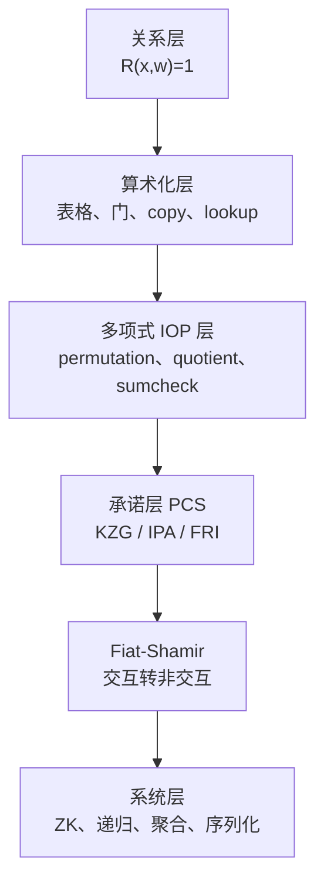
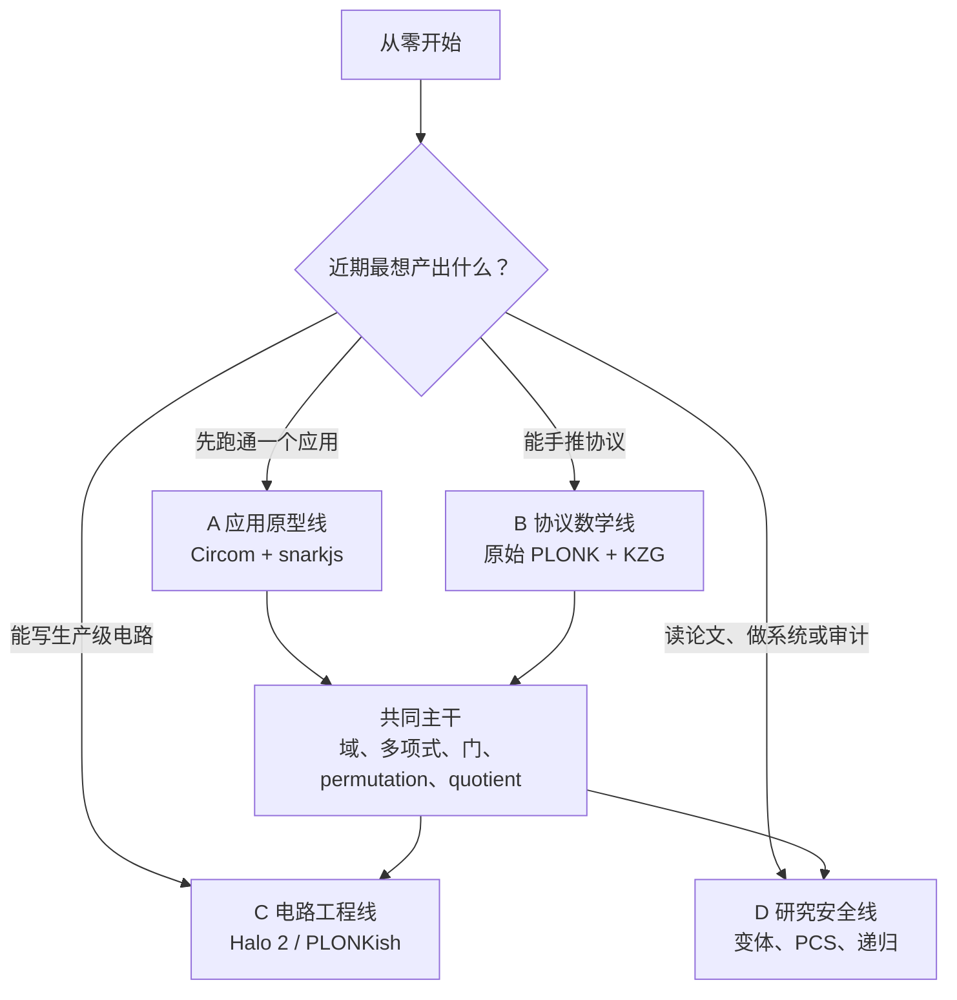
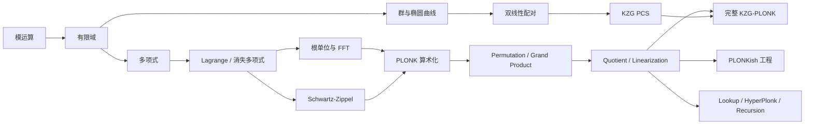
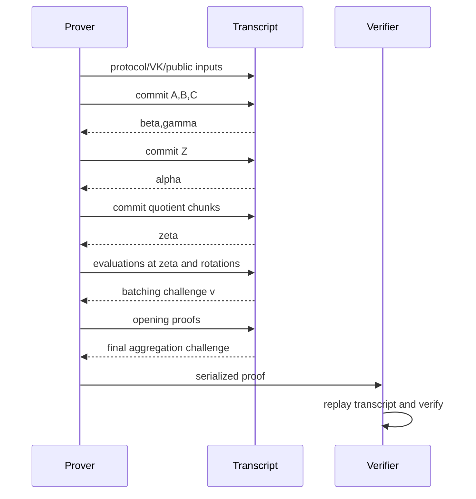

# PLONK 零知识证明：从零到协议、工程与研究的学习路线

> **目标**：为没有零知识证明背景的学习者建立一条可执行的 PLONK 学习路线，同时说明不同目标应走哪条分支、每条分支依赖哪些数学与算法，以及学到什么程度才算真正掌握。  
> **资料核对日期**：2026-08-06。软件接口和项目状态会变化；协议实现必须回到目标版本的 specification、源码与审计报告。  
> **范围**：以原始三列 KZG-PLONK 为主线，扩展到 PLONKish、Plookup、Halo 2、Kimchi、Plonky2、HyperPlonk，并区分算术化、PIOP、PCS、Fiat–Shamir、零知识与递归这些不同层次。

**快速导航**：[核心结论](#0-先给结论) · [四条路线](#2-四条学习路线目标不同最短路径不同) · [前置知识](#3-前置知识地图哪些必修哪些按分支选修) · [协议推导](#5-原始-plonk-核心算法从两行电路到一份证明) · [阶段路线](#6-从零到掌握十个阶段的共同主干) · [16 周计划](#7-一份可执行的-16-周学习计划) · [实战项目](#8-四条路线的实战项目设计) · [算法谱系](#9-现代-plonkish-谱系应该在什么时候学) · [安全审计](#13-安全与审计比proof-验证通过更重要) · [资料索引](#16-本仓库内的推荐阅读顺序)

---

## 0. 先给结论

从零学习 PLONK，最有效的顺序不是“椭圆曲线 → 配对 → 论文全文 → 某个大型框架”，而是：

$$
\boxed{
\text{有限域}
\to \text{多项式与 FFT}
\to \text{算术电路}
\to \text{PLONK 门约束}
\to \text{置换与 grand product}
\to \text{quotient identity}
\to \text{PCS 与 Fiat--Shamir}
\to \text{零知识、lookup 与工程实现}
}
$$

其中前六项是所有 PLONK 路线的共同主干。到“多项式承诺”以后才需要分叉：

- 想推导**原始 PLONK**：继续学椭圆曲线、双线性配对与 KZG；
- 想写**PLONKish 电路**：继续学 fixed/advice/instance 列、rotation、custom gate、lookup 与布局；
- 想快速做**应用原型**：可先用 Circom + snarkjs 跑通 PLONK，但要知道它隐藏了原生 PLONKish 布局；
- 想做**研究或审计**：再学安全模型、IPA/FRI、Plookup/LogUp、HyperPlonk、递归与 folding。

最重要的三个认识是：

1. **PLONK 不等于 KZG。** PLONK 首先是一套算术化与多项式协议；KZG 是原始方案常用的承诺后端。
2. **PLONKish 不等于原始 PLONK。** Halo 2、Kimchi、Plonky2 等继承了表格、selector、copy constraint、quotient 等思想，但列模型、lookup、PCS 和 proof format 都可能不同。
3. **“证明系统”不自动等于“零知识”。** 可靠性、知识可靠性、简洁性、透明性与零知识是不同性质；必须能指出 witness 隐藏机制在哪里。

若每周投入 8–10 小时，从零到能独立推导原始 PLONK、写一个小型 PLONKish 电路并阅读主流论文，通常应按 **14–18 周**设计，而不是追求几天看完。时间是学习规划估计，不是协议性能结论。

---

## 1. PLONK 到底解决什么问题

### 1.1 从关系开始，而不是从证明格式开始

零知识证明首先描述一个 NP 关系：

$$
R(x,w)=1,
$$

其中：

- $x$ 是公开 statement / public input；
- $w$ 是私有 witness；
- prover 要证明“我知道某个 $w$ 使关系成立”，但不泄露 $w$。

例如：

$$
R(v;(x,y))=1
\quad\Longleftrightarrow\quad
xy+3=v.
$$

这里 $v$ 可以公开，$x,y$ 保密。PLONK 的工作是把这类关系逐层压缩成少量多项式承诺、标量和 opening proofs，使 verifier 无需看到 witness，也无需重新执行全部计算。

### 1.2 用六层模型理解所有“PLONK 变体”



看到一个项目名称时，至少问清下面的五元组：

$$
(\text{arithmetization},\ \text{PIOP},\ \text{PCS},\
\text{field/curve},\ \text{transcript/hash}).
$$

只说“使用 PLONK”远远不够。它可能指：

- 原始三列 PLONK + KZG；
- Halo 2 风格 PLONKish + IPA；
- 宽 PLONKish + FRI；
- 布尔超立方上的 HyperPlonk + multilinear PCS。

这些系统在可信设置、证明大小、验证成本、递归方式和安全假设上都不同。

### 1.3 原始 PLONK 的关键贡献

原始论文题名中的 PLONK 是 **Permutations over Lagrange-bases for Oecumenical Noninteractive arguments of Knowledge**。学习时应抓住三件事：

1. 用 Lagrange basis 把电路表的每一列看成求值域上的低次多项式；
2. 用 permutation grand product 统一表达任意 wiring / copy constraints；
3. 配合 universal、updatable SRS，把很多电路复用同一最大次数范围内的设置材料。

“通用设置”不表示完全没有设置；它表示无需像 Groth16 那样为每个电路重新举行带 toxic waste 的专项仪式。最大 degree、曲线、承诺方案和具体实现仍是协议参数。

---

## 2. 四条学习路线：目标不同，最短路径不同

### 2.1 路线选择图



### 2.2 路线总览

| 路线 | 最适合谁 | 最小前置 | 核心算法 | 建议投入 | 能力边界 |
|---|---|---|---|---:|---|
| A. 应用原型线 | 想先生成并验证一份 proof 的开发者 | 命令行、JavaScript/TypeScript、基本代数 | witness、R1CS、Powers of Tau、setup/prove/verify | 20–40 小时 | 会使用 PLONK 后端，但不会因此自动理解原生 PLONKish 布局 |
| B. 协议数学线 | 想从公式理解原始 PLONK 的学习者 | 离散数学、基础编程 | 有限域、插值、FFT、permutation、quotient、KZG、linearization | 90–140 小时 | 能推导和做教学实现，不等于能写安全生产实现 |
| C. 电路工程线 | 想写 Halo 2/PLONKish gadget 的 Rust 开发者 | B 线共同主干、Rust | 列模型、selector、rotation、equality、lookup、layout、MockProver | 主干后 60–100 小时 | 能设计和测试电路；PCS 与 transcript 仍需单独深入 |
| D. 研究安全线 | 想读论文、实现 prover 或审计协议的人 | B 线完整内容，最好有 C 线经验 | 安全归约、Plookup/LogUp、IPA/FRI、HyperPlonk、递归、folding | 200 小时以上 | 目标是能比较安全模型、复杂度和实现边界 |

### 2.3 A 线：应用先行

这条线的目标是尽快建立“声明—witness—电路—证明—验证”的完整体验。

推荐顺序：

1. 用 Circom 写 `out <== a * b + 3`，区分 public/private signal；
2. 编译为 R1CS，生成 witness，并故意制造错误 witness；
3. 使用 snarkjs 的 PLONK 流程执行 universal Powers of Tau、setup、prove、verify；
4. 修改 public input，观察同一 proof 验证失败；
5. 查看约束数、key、proof 和 verifier 输入，而不是只看“OK”。

snarkjs 的官方流程中，PLONK 复用 universal Powers of Tau，不需要 Groth16 那种 circuit-specific phase 2 ceremony；`plonk setup` 仍会为具体 R1CS 派生 key。该区别应与“完全 transparent、无需 SRS”严格区分。

这条线适合一周内建立动机，但存在一个关键限制：**Circom 的源约束模型是 R1CS，snarkjs 再把它交给 PLONK 后端；它不是 Halo 2 式的原生 PLONKish 列、rotation、custom gate 教程。** 所以 A 线之后仍应回到共同主干。

### 2.4 B 线：协议数学先行

这条线的终点是：不看实现代码，也能从电路表推导出 gate identity、permutation accumulator、quotient、随机点检查和 KZG opening。

推荐顺序：

1. 在小素域里手算逆元、根单位、Lagrange 插值；
2. 实现朴素多项式运算，再实现 radix-2 FFT/IFFT；
3. 把一个两行电路编码成 $A,B,C,Q_L,\ldots,Q_C$；
4. 从 copy constraint 构造 permutation labels；
5. 逐行计算 grand product，并验证首尾闭合；
6. 构造约束 numerator，验证它能被 $Z_H$ 整除；
7. 学 KZG commit/open/verify，再拼完整 transcript；
8. 最后读原始论文的安全证明与精确 proof layout。

这条线最适合建立可迁移的理解。换成 IPA 或 FRI 后，前半段的电路表、permutation、quotient 仍然有用。

完整课程与阶段验收见：[B 线：PLONK 协议数学先行——完整学习路线](B线-协议数学先行完整学习路线.md)。按章节学习时直接进入：[PLONK B 线分章讲义（M0–M13）](b-line-course/README.md)。

### 2.5 C 线：PLONKish 电路工程

这条线关心“怎样把业务逻辑变成不会漏约束、成本可控的表格”，而不是复刻原始三列协议。

需要重点掌握：

- fixed、advice、instance 列的生命周期；
- selector 如何开关 gate；
- equality/copy constraint 与 permutation argument 的对应关系；
- rotation 和 region 布局为什么会影响列数、行数与可审计性；
- custom gate 的 degree budget；
- range check、bit decomposition、lookup table；
- blinding rows 与可用行数；
- 正向、反向、边界和模域歧义测试。

推荐用 Zcash 的 Halo 2 Book 建立概念，再以目标 crate 的固定版本为准。不要把某个 Halo 2 fork 的 KZG proof layout 套到 Zcash IPA 版本上。

### 2.6 D 线：研究、安全与系统实现

这条线要回答的不只是“公式是什么”，还包括：

- challenge 为什么必须在某个 commitment 之后采样；
- soundness error 如何由多个随机事件合成；
- knowledge soundness 在 AGM/ROM 等什么模型下成立；
- KZG、IPA、FRI 的 binding、setup 和量子假设有何不同；
- lookup 对表大小、查询数、multiplicity 和 degree 的成本如何变化；
- recursion、accumulation、folding 为什么不是同一个算法；
- benchmark 是否使用相同安全位、硬件、字段、哈希和 proof schema。

D 线不能跳过 B 线。只会读项目 README 或只会调用 prover API，不足以判断协议是否安全。

---

## 3. 前置知识地图：哪些必修，哪些按分支选修

### 3.1 依赖关系



### 3.2 知识清单

| 基础 | 必须掌握到什么程度 | 服务哪些算法 | 是否所有路线必修 |
|---|---|---|---|
| 模运算与扩展欧几里得 | 会求逆元、理解模 $p$ 的加减乘除 | 有限域运算、batch inversion | 是 |
| 群、环、域 | 能解释“为什么非零元素都有逆” | 域、椭圆曲线、承诺 | 是；抽象代数无需先学到很深 |
| 多项式 | 次数、根、除法、插值、求值 | 所有 polynomial identity | 是 |
| Lagrange basis | 点值表与低次多项式互换 | witness/fixed columns、边界 selector | 是 |
| 根单位与 FFT/NTT | 会推导蝶形，理解 $O(n\log n)$ | 插值、LDE、coset quotient | B/C/D 必修，A 线先理解用途 |
| 概率与 Schwartz–Zippel | 理解随机点检查的错误概率 | quotient check、随机 batching | 是 |
| 算术电路/R1CS | 理解 witness、constraint、underconstraint | 关系到表格的转换 | 是；QAP 仅用于比较，不是 PLONK 前置硬要求 |
| 哈希与承诺 | binding、hiding、domain separation | Fiat–Shamir、transcript | 是 |
| 椭圆曲线 | 标量域/基域、群运算、MSM | KZG/IPA | B 的 KZG 分支与 D 必修 |
| 双线性配对 | pairing 性质与 subgroup 安全 | KZG verify | 只对 KZG 分支必修 |
| Rust 与内存/并行 | trait、泛型、profiling | Halo 2、prover 工程 | C/D 工程分支必修 |
| 安全证明基础 | game、extractor、ROM/AGM | knowledge soundness、Fiat–Shamir | D 必修 |

### 3.3 初学阶段可以暂缓的内容

下面这些内容重要，但不应堵住第一次理解 PLONK：

- 椭圆曲线的复杂坐标优化；
- pairing 的 Miller loop 实现细节；
- 完整代数几何；
- 通用可组合安全定义；
- GPU MSM/FFT 内核；
- 所有 lookup 与 folding 论文。

先把“表格为何变成多项式、copy constraint 为何变成 grand product、所有约束为何变成 quotient”讲通，再进入这些专题。

---

## 4. PLONK 相关算法全景

| 层次 | 核心对象 | 关键算法 | 解决的问题 | 推荐掌握深度 |
|---|---|---|---|---|
| 关系层 | $R(x,w)$ | witness generation、constraint synthesis | 把业务命题变成可验证关系 | 能写正反例 |
| 算术化层 | 电路表、selector、wire | 通用门、custom gate、copy constraint | 把程序变成低次域方程 | 能手工编码小电路 |
| 多项式层 | $A,B,C,Q_i$ | Lagrange 插值、FFT/IFFT、coset FFT | 在域 $H$ 上把列编码成低次多项式 | 能实现并测试 |
| 置换层 | identity/sigma labels | multiset compression、grand product、batch inversion | 证明任意位置的值相等 | 能推导 recurrence |
| 消失论证层 | $Z_H,t(X)$ | random linear combination、quotient、degree splitting | 把“所有行成立”压成一个多项式恒等式 | 能做 degree accounting |
| 承诺层 | commitment/opening | KZG、IPA、FRI | 绑定多项式并证明随机点取值/低度 | 至少精通一种 |
| 压缩层 | evaluations/opening sets | linearization、random batching、multi-opening | 减少 opening 数和 verifier 工作 | 能解释 challenge 顺序 |
| 非交互层 | transcript | Fiat–Shamir、hash-to-field、domain separation | 用哈希生成不可预测挑战 | 能重放 transcript |
| 零知识层 | masks/blinding rows | $Z_Hr$ 掩码、随机行、hiding commitments | 隐藏 witness 与中间取值 | 能指出随机性与 degree budget |
| 扩展层 | lookup/custom gate | Plookup、Halo 2 lookup、LogUp、Caulk/Lasso | 低成本表达范围、位运算和大表关系 | 按应用选学 |
| 多线性层 | MLE/hypercube | sumcheck、HyperPlonk、multilinear PCS | 避免部分 FFT，支持高次 custom gate | D 线选修 |
| 递归层 | verifier relation | Halo、accumulation、Nova-style folding | 证明另一份证明或累积长期计算 | D 线后期 |
| 工程层 | vectors、groups、memory | radix-2 FFT、Pippenger MSM、batch inversion、parallel scan | 把渐近算法变成可用 prover | C/D 必修 |

---

## 5. 原始 PLONK 核心算法：从两行电路到一份证明

本节使用一个简化但内部一致的三列版本解释骨架。不同论文修订版和工程实现会调整符号、盲化次数、末行处理、quotient chunks 与 multi-opening；实现时必须遵守目标 specification。

### 5.1 第一步：把关系排成门表

证明：存在私有 $x,y$，使公开值 $v=xy+3$。

可排成两行：

| 行 | $a_i$ | $b_i$ | $c_i$ | 约束 |
|---:|---|---|---|---|
| 0 | $x$ | $y$ | $m$ | $xy-m=0$ |
| 1 | $m$ | 0 | $v$ | $m+3-v=0$ |

原始 PLONK 的通用门是：

$$
q_La_i+q_Rb_i+q_Ma_ib_i+q_Oc_i+q_C=0.
$$

因此：

| 行 | $q_L$ | $q_R$ | $q_M$ | $q_O$ | $q_C$ |
|---:|---:|---:|---:|---:|---:|
| 0 | 0 | 0 | 1 | -1 | 0 |
| 1 | 1 | 0 | 0 | -1 | 3 |

还需要两类约束：

- copy constraint：$c_0=a_1$，表示乘法输出真的送入下一行；
- public-input constraint：$c_1=v$，把 proof 绑定到公开 statement。

如果漏掉任意一个，逐行门都可能成立，但证明的就不是原关系。这是电路审计中最常见的 underconstraint 来源。

### 5.2 第二步：把每一列插值成多项式

选择大小为 $n$ 的乘法子群：

$$
H=\{1,\omega,\ldots,\omega^{n-1}\},
\qquad \omega^n=1.
$$

实际会把行数 padding 到合适的 $n$。对 witness 和 selector 列做插值：

$$
\begin{aligned}
A(\omega^i)&=a_i,& B(\omega^i)&=b_i,& C(\omega^i)&=c_i,\\
Q_L(\omega^i)&=q_{L,i},&\ldots&&Q_C(\omega^i)=q_{C,i}.
\end{aligned}
$$

大小为 $n$ 的点值表唯一确定一个 degree $<n$ 的多项式。Lagrange basis 负责“行 ↔ 多项式”，FFT/IFFT 负责高效转换。

域的消失多项式为：

$$
Z_H(X)=\prod_{h\in H}(X-h)=X^n-1.
$$

任何多项式 $P$ 在 $H$ 的每一点都为零，当且仅当 $Z_H\mid P$。

### 5.3 第三步：把所有门变成一个 gate identity

定义：

$$
\begin{aligned}
G(X)={}&Q_L(X)A(X)+Q_R(X)B(X)+Q_M(X)A(X)B(X)\\
&+Q_O(X)C(X)+Q_C(X)+PI(X),
\end{aligned}
$$

其中 $PI(X)$ 按协议约定编码公开输入；不同实现的符号和所在列可能不同，但 public values 及顺序都必须同时绑定到约束和 transcript。所有行的门约束成立等价于：

$$
G(h)=0\quad\forall h\in H
\quad\Longleftrightarrow\quad
Z_H(X)\mid G(X).
$$

这一步只检查每一行内部的算术，还没有检查跨行 wiring。

### 5.4 第四步：用 permutation 表达 copy constraints

给三个列中的每个 cell 唯一标签。选取使三个 coset 两两不交的 $k_1,k_2$：

$$
\operatorname{id}_1(X)=X,\qquad
\operatorname{id}_2(X)=k_1X,\qquad
\operatorname{id}_3(X)=k_2X.
$$

于是第 $i$ 行的标签为：

$$
\omega^i,\quad k_1\omega^i,\quad k_2\omega^i.
$$

属于同一个逻辑 wire 的 cells 被连成 permutation cycle。例子中的 $c_0=a_1$ 会让对应两个标签在同一 cycle。把 permutation 在三列上的像插值为：

$$
S_{\sigma,1}(X),\quad S_{\sigma,2}(X),\quad S_{\sigma,3}(X).
$$

它们是电路固定多项式，可进入 proving/verification key。

### 5.5 第五步：把全局置换变成 grand product

在 witness commitments 已绑定以后，采样随机挑战 $\beta,\gamma$。对 $X\in H$ 定义 identity 侧：

$$
\begin{aligned}
N(X)={}&(A(X)+\beta X+\gamma)\\
&\cdot(B(X)+\beta k_1X+\gamma)\\
&\cdot(C(X)+\beta k_2X+\gamma),
\end{aligned}
$$

以及 permutation 侧：

$$
\begin{aligned}
D(X)={}&(A(X)+\beta S_{\sigma,1}(X)+\gamma)\\
&\cdot(B(X)+\beta S_{\sigma,2}(X)+\gamma)\\
&\cdot(C(X)+\beta S_{\sigma,3}(X)+\gamma).
\end{aligned}
$$

若 copy constraints 成立，两边只是同一 multiset 的重排，因此总乘积相同。定义 accumulator：

$$
Z(1)=1,
\qquad
Z(\omega X)D(X)=Z(X)N(X).
$$

相应局部约束是：

$$
P_{\mathrm{perm}}(X)
=Z(\omega X)D(X)-Z(X)N(X),
$$

再加边界：

$$
L_0(X)(Z(X)-1)=0.
$$

$\beta$ 把值和 cell 标签绑定，$\gamma$ 随机平移并降低退化概率。它们必须晚于 witness commitments；否则恶意 prover 可以针对挑战选择 witness。

### 5.6 第六步：合并为 quotient polynomial

在相关 commitments 绑定后采样 $\alpha$，以不同幂随机合并约束：

$$
\begin{aligned}
P_{\mathrm{all}}(X)={}&G(X)
+\alpha P_{\mathrm{perm}}(X)\\
&+\alpha^2L_0(X)(Z(X)-1)
+\cdots,
\end{aligned}
$$

省略号可能包括末行、public input、lookup 或其他边界项。合法 witness 应满足：

$$
Z_H(X)\mid P_{\mathrm{all}}(X).
$$

于是定义 quotient：

$$
t(X)=\frac{P_{\mathrm{all}}(X)}{Z_H(X)}.
$$

工程实现不会在 $H$ 上逐点除，因为 $Z_H(h)=0$。典型做法是在与 $H$ 分离的扩展 coset 上 FFT-evaluate，各点除以非零 $Z_H(x)$，再 IFFT 得到 quotient。

若 $\deg t<kn$，把它分块：

$$
t(X)=t_0(X)+X^nt_1(X)+\cdots+X^{(k-1)n}t_{k-1}(X),
$$

每个 $t_j$ 的 degree 都小于 $n$，从而落在 SRS/PCS 的 degree 范围内。

### 5.7 第七步：随机点检查为什么有效

在 quotient commitments 绑定后采样随机 $\zeta\notin H$，检查：

$$
P_{\mathrm{all}}(\zeta)
\stackrel?=
Z_H(\zeta)t(\zeta).
$$

其中：

$$
t(\zeta)=\sum_{j=0}^{k-1}\zeta^{jn}t_j(\zeta).
$$

如果两侧不是同一个低次多项式，非零差多项式在随机 $\zeta$ 恰好为零的概率由根数上界控制。这就是 Schwartz–Zippel/单变量根计数在协议中的位置。

但 prover 不能只发送一组临时编造的标量。因此还需要 PCS 证明这些 evaluations 确实来自挑战产生前已经承诺的多项式。

### 5.8 第八步：KZG 如何绑定并打开多项式

KZG 的 universal SRS 简化写成：

$$
([1]_1,[\tau]_1,\ldots,[\tau^D]_1;[1]_2,[\tau]_2),
$$

其中 $\tau$ 必须未知。对

$$
f(X)=\sum_{i=0}^{d}f_iX^i,
$$

承诺为：

$$
C_f=[f(\tau)]_1=\sum_i f_i[\tau^i]_1.
$$

要证明 $f(z)=y$，构造：

$$
q(X)=\frac{f(X)-y}{X-z},
\qquad
\pi=[q(\tau)]_1.
$$

verifier 检查：

$$
e(C_f-y[1]_1,[1]_2)
\stackrel?=
e(\pi,[\tau]_2-z[1]_2).
$$

核心恒等式只是：

$$
f(\tau)-y=q(\tau)(\tau-z).
$$

pairing 把右侧“两个隐藏标量的乘法关系”变成可验证群等式。KZG 的基本承诺本身不是 hiding；PLONK 的零知识还要依赖 witness polynomial blinding。

### 5.9 第九步：linearization 与 opening batching

PLONK 的约束在 $\zeta$ 处包含 $A(\zeta)B(\zeta)$、$Z(\omega\zeta)$、selector、permutation 和 quotient 等许多项。如果每个多项式分别 opening，proof 会变大。

**Linearization** 的思想是：先把已声明的 evaluations 当作标量代入，使剩余表达式成为若干已承诺多项式的线性组合 $R(X)$。由于 KZG commitment 线性同态，verifier 能从已有 commitments 直接组合出 $[R]$，无需 prover 再提交一个独立多项式。

同一点的多个 openings 还可在全部 claimed evaluations 已绑定后采样 $v$：

$$
F(X)=\sum_{i=0}^{m-1}v^iF_i(X),
\qquad
y=\sum_{i=0}^{m-1}v^iy_i,
$$

只证明 $F(\zeta)=y$。对 $\omega\zeta$ 等不同 rotation point，要使用目标协议规定的 multi-opening；不能把不同点粗暴地当成同一个 $\tau-\zeta$ 因子。

### 5.10 第十步：Fiat–Shamir transcript

一个简化的依赖顺序如下：



每个 challenge 都必须晚于它要随机压缩的对象。transcript 还应绑定：

- protocol/version identifier；
- verification key 或其规范化摘要；
- public inputs 及其顺序；
- 所有 commitments、evaluations 与 opening proofs；
- 明确的 domain separation 和规范序列化。

Fiat–Shamir 不是“随便 hash 一下”；顺序或编码出错会改变安全论证。

### 5.11 第十一步：零知识从哪里来

设 $A_0$ 是由真实 witness 行插值得到的多项式。可加入在 $H$ 上为零的随机掩码：

$$
A(X)=A_0(X)+Z_H(X)r_A(X).
$$

因此：

$$
A(h)=A_0(h)\quad\forall h\in H,
$$

但域外随机点 $A(\zeta)$ 被随机化。$B,C,Z$ 和其他 prover polynomials 需要按具体协议进行相应 blinding。

现代 PLONKish 实现也常保留若干 blinding rows，并在这些行关闭相关 gate、permutation、lookup 约束。随机性数量过少会泄露，过多又会抬高 degree 或越过 SRS 范围，所以不能凭经验增删。

### 5.12 verifier 实际检查两件事

1. **标量恒等式**：若 proof 中的 evaluations 都是真的，它们是否满足 PLONK quotient identity？
2. **PCS 一致性**：这些 evaluations 是否真的来自此前 commitments 中的多项式？

只有第一层，prover 可以捏造标量；只有第二层，只能说明若干真实多项式被打开，却没有说明它们描述合法电路。两层都通过，才把“电路合法”和“承诺一致”连接起来。

---

## 6. 从零到掌握：十个阶段的共同主干

下面的阶段不是按“看了几篇文章”验收，而是按能否完成推导、代码和反例测试验收。

### 阶段 0：建立坐标系（3–5 小时）

**学习内容**

- statement、witness、relation、circuit；
- completeness、soundness、knowledge soundness、zero-knowledge、succinctness；
- trusted setup、universal setup、transparent setup；
- 算术化、PIOP、PCS、Fiat–Shamir 的分层。

**验收任务**

给任意系统写出五元组：

$$
(\text{算术化},\text{PIOP},\text{PCS},\text{field/curve},\text{transcript}).
$$

能明确解释“PLONK + KZG”和“PLONKish + FRI”为什么都可以存在。

### 阶段 1：有限域（10–15 小时）

**学习内容**

- 素域 $\mathbb F_p$、加法/乘法逆元；
- Fermat 小定理与扩展 Euclidean algorithm；
- 乘法群、子群、生成元、元素阶；
- base field 与 scalar field 的区别。

**动手任务**

在 $\mathbb F_{17}$ 中完成：

1. 求所有非零元素的逆；
2. 验证 $4$ 的阶为 $4$，得到 $H=\{1,4,16,13\}$；
3. 验证 $X^4-1$ 在 $H$ 上消失；
4. 写随机测试验证域运算封闭、结合、分配和逆元性质。

**通过标准**

不再把“模整数”与“有限域元素”混用；能说明为什么 FFT domain 的大小必须与域中根单位结构兼容。

### 阶段 2：多项式、Lagrange 与 FFT（15–25 小时）

**学习内容**

- coefficient form 与 evaluation form；
- 多项式长除法、根与次数；
- Lagrange interpolation；
- vanishing polynomial 与 Lagrange basis $L_i$；
- radix-2 FFT/IFFT、coset FFT；
- Schwartz–Zippel 与随机线性组合。

**动手任务**

1. 实现朴素插值，验证 $n$ 个点唯一确定 degree $<n$ 多项式；
2. 实现 FFT/IFFT，并与朴素 $O(n^2)$ 结果逐项比较；
3. 构造一个在 $H$ 上为零的 $P(X)$，验证 $P/Z_H$ 余数为零；
4. 随机生成非零低次多项式，统计随机点误判率与 degree/field-size 的关系。

**通过标准**

能从“一列 $n$ 个数”无缝切换到“一个 degree $<n$ 多项式”，并解释为什么 quotient 要在 disjoint coset 上计算。

### 阶段 3：算术电路与约束设计（10–15 小时）

**学习内容**

- arithmetic circuit、witness generation；
- public/private input；
- R1CS 与 PLONKish 表格的异同；
- range constraint、boolean constraint $b(b-1)=0$；
- underconstraint、overconstraint 与 field wraparound。

**动手任务**

为以下关系各写出合法与恶意 witness：

- $v=xy+3$；
- $b\in\{0,1\}$；
- 一个 8-bit 范围检查；
- 两个 64-bit 整数相加且禁止模域溢出。

**通过标准**

能证明“每个 witness cell 都被约束到目标关系”，而不是只证明诚实 witness 会通过。

### 阶段 4：承诺与随机预言机直觉（6–10 小时）

**学习内容**

- commitment 的 binding 与 hiding；
- Fiat–Shamir 与 challenge dependency；
- commit → challenge → response 的基本顺序；
- 哈希承诺、Pedersen/KZG/IPA/FRI 的功能级区别；
- domain separation 与规范序列化。

**动手任务**

1. 用哈希实现一个最小 commit/reveal 实验；
2. 故意让 prover 在看到 challenge 后再选消息，说明为何失去 soundness；
3. 画出“哪些消息必须先于哪些 challenges”的依赖图；
4. 分别举出 binding 但不 hiding、hiding 但绑定条件不足的错误设计。

**通过标准**

能解释 commitment 在协议中的“先绑定、后挑战”职责；此阶段无需先实现 pairing。

### 阶段 5：PLONK gate 与 permutation（20–30 小时）

**学习内容**

- 三列通用门与 selectors；
- identity labels、sigma permutation polynomials；
- randomized multiset equality；
- grand product recurrence 与边界；
- batch inversion。

**动手任务**

1. 把 5–10 个门的电路排成表；
2. 为所有 copy constraints 画 cycle；
3. 生成 $S_{\sigma,j}$ 的 domain evaluations；
4. 对诚实 witness 计算 $Z$，验证闭合；
5. 改坏一条 copy，重复多个随机 $\beta,\gamma$，观察闭合失败。

**通过标准**

能回答：为什么 gate constraint 无法独自保证 wiring？为什么 $\beta$ 要乘 cell label？为什么 accumulator 必须有边界？

### 阶段 6：quotient 与随机点 PIOP（15–25 小时）

**学习内容**

- 约束的随机合并；
- quotient degree accounting；
- quotient coset 与 chunks；
- $\zeta$ 及 rotated evaluations；
- 随机点 polynomial identity；
- “标量恒等式”和“evaluation 真实性”的职责分离。

**动手任务**

1. 为自己的小电路列出每一项 degree；
2. 构造 $P_{\mathrm{all}}$，验证合法 witness 时余数为零；
3. 修改一个 gate 或 copy 值，验证不再可整除；
4. 在暂不接 PCS 的教学 oracle 模型中完成随机点检查；
5. 说明为什么仍需 PCS 绑定这些 polynomials。

**通过标准**

能从电路表独立推到随机点 identity，而不是背诵一张 proof fields 列表。

### 阶段 7：KZG、linearization 与完整协议（20–30 小时）

**学习内容**

- 椭圆曲线群、MSM、双线性 pairing；
- KZG setup、commit、open、verify；
- degree bound、SRS ceremony 与 toxic waste；
- linearization、same-point batching 与 multi-opening；
- 完整 Fiat–Shamir transcript；
- witness polynomial blinding 与 blinding rows。

**动手任务**

1. 手推 $f(X)-f(z)=(X-z)q(X)$ 和 KZG pairing 检查；
2. 写出两个多项式在同一点的随机批量 opening；
3. 逐轮列出 PLONK transcript 的输入、输出和不可提前采样的 challenge；
4. 给 verifier 写“标量 identity + PCS consistency”双层伪代码；
5. 说明若 toxic waste $\tau$ 泄露，攻击者获得什么能力；
6. 检查 blinding 后所有多项式的 degree budget。

**通过标准**

能把阶段 6 的 PIOP 接到 KZG，并解释 linearization、opening batching 和 ZK 各自解决什么问题。

### 阶段 8：PLONKish、custom gate 与 lookup（15–25 小时）

**学习内容**

- 多列、fixed/advice/instance、rotation；
- custom gate 的表达力与 degree 成本；
- Plookup 的排序拼接与 grand product；
- Halo 2 lookup 的 subset/permutation 思路；
- LogUp 的对数导数/倒数和视角；
- 大表、稀疏查询时 Caulk/Lasso 类算法的动机。

**动手任务**

比较一个 8-bit range check 的三种实现：

1. 逐 bit boolean constraints；
2. 小块分解 + lookup；
3. custom gate + lookup。

记录 rows、columns、最大 constraint degree、lookup 表大小和 prover 辅助列。

**通过标准**

能说明 lookup 不是“免费数组访问”，而是一份 multiset/subset 证明；能根据表大小与查询模式选择算法家族。

### 阶段 9：选择分支项目（25–60 小时）

- A 线：端到端应用 proof + verifier；
- B 线：教学版 PLONK PIOP/KZG 实现；
- C 线：Halo 2 chip/gadget + 完整反例测试；
- D 线：复现一篇 lookup/PCS 论文的核心实验或做一个 transcript/constraint 审计。

最终项目必须同时包含：设计说明、威胁模型、正反测试、参数说明、已知局限。只展示一次成功证明不算完成。

---

## 7. 一份可执行的 16 周学习计划

以下计划按每周 8–10 小时设计。数学基础较强者可以压缩，完全没有编程经验者应延长。

| 周 | 主题 | 理论产出 | 实践产出 | 验收问题 |
|---:|---|---|---|---|
| 1 | ZK 与协议分层 | 六层模型、性质定义 | 写 3 个 relation | PLONK 与 KZG 是同一层吗？ |
| 2 | 有限域 | 域、逆元、子群 | $\mathbb F_{17}$ 运算库 | 为什么不能用普通浮点数？ |
| 3 | 多项式 | 插值、根、vanishing | 朴素多项式库 | 为什么 $Z_H\mid P$ 等价于域上全零？ |
| 4 | FFT | 根单位、蝶形、coset | FFT/IFFT 对拍 | quotient 为何不在 $H$ 上除？ |
| 5 | 电路 | witness、约束、R1CS 对比 | 两行电路与恶意 witness | 哪个 cell 没被约束？ |
| 6 | 承诺与 FS | binding/hiding、transcript | commitment 玩具实验 | challenge 为什么不能提前？ |
| 7 | PLONK 门 | selector、public input | 电路表插值 | gate 检查了 wiring 吗？ |
| 8 | permutation | labels、multiset | 构造 sigma cycles | $\beta,\gamma$ 分别做什么？ |
| 9 | grand product | recurrence、boundary | 计算 accumulator | 没有 $Z(1)=1$ 会怎样？ |
| 10 | quotient | alpha 合并、degree | coset quotient | 为什么要分 chunks？ |
| 11 | 椭圆曲线/KZG | MSM、pairing、opening | 推导 KZG verify | KZG 基本承诺隐藏 witness 吗？ |
| 12 | 完整协议 | linearization、openings | prover/verifier 伪代码 | verifier 的两层检查是什么？ |
| 13 | 零知识与安全 | masks、blinding rows | 泄漏面清单 | soundness 是否自动给出 ZK？ |
| 14 | PLONKish | rotations、custom gates | 一个宽门设计 | 高 degree 为什么不免费？ |
| 15 | lookup | Plookup/Halo 2/LogUp | range-check 对比 | 表很大但查询很少时选什么？ |
| 16 | 分支项目 | 设计与安全说明 | 可重复 demo + 反例测试 | 能否解释每个 proof 字段的职责？ |

### 每周固定节奏

建议用 `30% 阅读 + 40% 推导/编码 + 20% 反例测试 + 10% 总结`，并保留一份“公式账本”：

- 每个多项式在哪个 domain 上定义；
- degree 上界；
- commitment 在哪个 challenge 之前发送；
- 哪些值是 public、witness、prover auxiliary；
- 哪个随机事件提供哪一部分 soundness。

如果无法填完这五项，说明对该协议的理解还停留在名词层。

---

## 8. 四条路线的实战项目设计

### 8.1 A 线项目：端到端隐私资格证明

**关系示例**

证明者知道年龄 `age` 和随机盐 `salt`，使公开 commitment 正确，且 `age >= 18`；不公开年龄。

**项目步骤**

1. 明确字段编码和年龄上界；
2. 写 commitment 与 range check 电路；
3. 用 Circom 编译、生成 witness；
4. 用 snarkjs PLONK setup/prove/verify；
5. 加入错误年龄、错误盐、错误 public commitment 测试；
6. 导出 verifier，并记录 gas/时间时明确曲线、约束数和环境。

**必须写进报告的限制**

- hash 是否适合在电路中使用；
- 范围检查是否排除有限域回绕；
- Powers of Tau 来源和最大 degree；
- 该流程学习的是 PLONK backend，不是原生 PLONKish custom gate。

### 8.2 B 线项目：教学版 PLONK 骨架

建议模块：

```text
field
polynomial
fft
domain
circuit_table
permutation
grand_product
quotient
transcript
pcs
prover
verifier
tests
```

实施顺序：

1. 先不加密码学承诺，使用完整多项式作为 oracle，验证 PIOP algebra；
2. 加确定性 transcript，固定挑战以便复现；
3. 加入真实库提供的 KZG/IPA 接口；
4. 最后加入 blinding、batch opening 和非法证明测试。

不要用“小素数 + 自造椭圆曲线”声称获得安全性。小域只能验证代数逻辑，不能代表真实 binding、soundness bits 或零知识。

### 8.3 C 线项目：Halo 2 范围与哈希 gadget

至少覆盖：

- fixed/advice/instance 列；
- selector 控制的 gate；
- equality constraint；
- rotation；
- lookup range check；
- public output；
- MockProver 正反测试；
- 行数、列数、最大 degree 的统计。

测试不能只修改最终输出，还要覆盖：

- 未启用 selector 的行；
- region 边界和 rotation wraparound；
- lookup dummy row；
- 最大可表示整数与 field modulus 附近值；
- 相同 field element 的非唯一整数编码。

### 8.4 D 线项目：协议对照或安全审计

可选题目：

1. 对照原始 PLONK、Halo 2 和 Kimchi 的 permutation 约束与 proof layout；
2. 对比 Plookup、Halo 2 lookup 与 LogUp 的 prover oracles、degree 和表复杂度；
3. 对一个开源 prover 画完整 transcript dependency graph，检查 domain separation；
4. 对一个 gadget 做 underconstraint 分析，构造可通过但语义错误的 witness；
5. 对 KZG、IPA、FRI 在相同电路规模下做参数完整的 benchmark。

研究报告必须区分：

- 论文定理；
- 实现采用的具体参数；
- 自己的推断；
- benchmark 观察。

---

## 9. 现代 PLONKish 谱系：应该在什么时候学

| 系统/算法 | 相对原始 PLONK 的主要变化 | PCS/后端 | 何时学习 | 不应产生的误解 |
|---|---|---|---|---|
| 原始 PLONK | 三列通用门、permutation、quotient、linearization | KZG 风格 | 共同主干核心 | 不是所有 PLONKish proof 的固定格式 |
| Turbo/UltraPLONK | 更宽的 custom gates、lookup 等扩展 | 常见为 KZG | 学完原始 PLONK 后 | “Ultra”不是一个跨实现统一的 wire format |
| Plookup | 排序 query 与 table 的拼接，用相邻关系和 grand product 证明包含 | 可接 PLONKish PCS | 第 15 周 | lookup 不是直接读取数组 |
| Halo 2（Zcash） | fixed/advice/instance、rotation、regions/chips、lookup | IPA-style PCS | C 线首选 | 不能把其他 KZG fork 的细节当作 Zcash Halo 2 规范 |
| Kimchi | 宽 PLONKish、custom gates、lookup，面向递归系统 | bulletproof/IPA-style commitment | D 线对照阅读 | Kimchi 与 Pickles recursion 不是同一层 |
| Plonky2 | 宽 PLONKish + permutation，承诺/低度后端走 Merkle/FRI | FRI | 理解“PLONK 不等于 KZG”时 | 官方仓库已标记 deprecated，不宜作为新生产项目默认起点 |
| HyperPlonk | 从单变量子群转到布尔超立方 MLE，使用 sumcheck | multilinear PCS | D 线后期 | 不只是给原始 PLONK 换一个 PCS |
| LogUp | 用对数导数把 multiset equality 化为倒数和 | 常与 sumcheck/AIR 组合 | 大量或多列 lookup 专题 | 与 Plookup 的排序 grand product 不是同一证明形态 |
| Plonky3 | 模块化 PIOP 工具包，当前主要服务 STARK-based zkVM | 多种 hash PCS | 研究模块化 PIOP/STARK 时 | 名字含 Plonky，不代表当前主线是 PLONK 电路 |

### 推荐阅读顺序

$$
\text{原始 PLONK}
\to \text{Plookup}
\to \text{Halo 2 或 Kimchi}
\to \text{HyperPlonk / LogUp}
\to \text{递归与 folding}.
$$

不要并行阅读所有变体。先固定一个“基准协议”，否则不同论文的 $\alpha,\beta,\gamma$ 命名、grand-product 方向、rotation 和 blinding 约定会互相干扰。

---

## 10. KZG、IPA、FRI：同一 PLONKish 前端为何有不同后端

| 维度 | KZG | IPA | FRI / Merkle |
|---|---|---|---|
| 主要假设 | pairing/DLOG 类假设 | 椭圆曲线 DLOG | 哈希安全性 + RS proximity 分析 |
| setup | 结构化 universal SRS，含未知 $\tau$ | 可用无 toxic-waste 的生成元集合 | transparent 公共参数 |
| commitment/opening 大小 | 常数级群元素 | opening 通常对数级 | proof 通常更大，含查询与 Merkle paths |
| verifier 主要成本 | pairing + MSM | MSM/内积验证 | 哈希 + 域运算 + proximity queries |
| prover 主要成本 | FFT + MSM | FFT + 群运算 | LDE/FFT + 哈希 + FRI folding |
| 后量子 | 否 | 否 | 通常可基于抗量子哈希实例化；具体 FS/QROM 仍需证明 |
| 与 PLONK 的关系 | 原始 PLONK 典型编译后端 | Halo 2/Kimchi 类路线 | Plonky2 类路线 |

选择后端时，不要只比较 proof 字节数。至少同时比较：

- 相同 security target；
- 相同电路/算术化；
- prover 内存与硬件；
- verifier 环境是否有 pairing 预编译；
- setup 与升级治理；
- recursion 的 field/curve/hash 成本；
- proof 是否真的启用 zero-knowledge。

---

## 11. Lookup 算法如何选择

### 11.1 为什么需要 lookup

有限域天然擅长加法和乘法，却不天然理解：

- “这个数是 8-bit”；
- XOR、AND、字节分解；
- 某个 opcode 的输入输出是否合法；
- 非原生域运算的 limb 范围；
- 哈希/签名中的离散关系。

lookup 把关系预先列成表，证明每个 query tuple 都属于 table。真正的密码学问题是：如何证明集合/多重集合包含，而不公开 witness 且不逐项发送表。

### 11.2 算法选择表

| 场景 | 优先研究 | 原因 | 需要额外基础 |
|---|---|---|---|
| 表大小与电路 domain 同阶，通用 PLONKish | Plookup / Halo 2 lookup | 排序/置换结构直接复用 grand product | permutation、排序拼接 |
| 同一表上有多列或大量 batch queries | LogUp | multiplicity + reciprocal sum 可减少部分 prover oracles | 对数导数、sumcheck/多线性视角 |
| 表极大但查询稀疏 | Caulk/Caulk+、Baloo | 目标是避免 prover 线性物化整张表 | accumulator/commitment 专题 |
| zkVM 指令由 lookup 主导 | Lasso/Jolt | 面向结构化大表与 MLE/sumcheck | multilinear extension、sumcheck |
| 简单小范围检查 | bit decomposition 或小表 lookup | 常数与布局决定，先 benchmark | boolean/range constraints |

没有一种 lookup 在所有表大小、查询数、重复度和 PCS 下都最好。选择时至少记录：

$$
(N_{table},\ N_{query},\ width,\ multiplicity,\ degree,\ commitments,\ PCS).
$$

---

## 12. 工程成本：从公式走向 prover

### 12.1 原始 KZG-PLONK 的主要成本

对 $n$ 行电路，典型 prover 成本来自：

1. 多次 size-$n$ 或扩展 domain 的 FFT/IFFT；
2. 对 witness、accumulator、quotient chunks 的 MSM；
3. grand product 的逐行 field operations；
4. batch inversion；
5. lookup/custom gate 带来的辅助列和 extended-domain evaluations；
6. 保存多列 coefficient/evaluation form 的内存流量。

渐近上常被概括为 $O(n\log n)$，但实际瓶颈可能是 FFT、MSM 或 memory bandwidth，取决于曲线、列数、degree、并行度和硬件。

### 12.2 必须认识的实现算法

| 算法 | 用在何处 | 为什么重要 |
|---|---|---|
| radix-2 FFT/NTT | 插值、求值、quotient coset | 把 $O(n^2)$ 降为 $O(n\log n)$ |
| barycentric evaluation | 在少量域外点求值 | 避免完整重插值 |
| Montgomery batch inversion | grand product 分母、归一化 | 把 $n$ 次 inversion 变成 1 次 inversion + $O(n)$ multiplication |
| Pippenger MSM | KZG/IPA commitments 与 openings | 大规模群标量乘的核心优化 |
| parallel prefix/scan | accumulator、products | 在多核/GPU 上并行 grand product |
| coset LDE | quotient / FRI | 避开 vanishing polynomial 的零点并扩展求值域 |
| transcript serialization | challenge derivation | 直接关系到 prover/verifier 一致性和安全性 |

### 12.3 电路优化不是只减少约束数

PLONKish 系统经常在下列量之间交换成本：

- rows；
- advice/fixed columns；
- permutation-enabled columns；
- rotations；
- constraint degree；
- lookup tables 和 auxiliary columns；
- quotient chunks；
- opening sets。

例如高次 custom gate 可能减少行数，却增加 quotient degree 和扩展 domain；大量 rotations 可能增加 opening 集合；把所有列都放入 equality permutation 会抬高 permutation 成本。优化报告必须同时给出这些维度。

---

## 13. 安全与审计：比“proof 验证通过”更重要

### 13.1 电路语义检查

- public input 是否真的进入 constraint 和 transcript？
- 每个 advice/witness cell 是否被约束？
- selector 是否在恰当行启用，是否存在意外关闭？
- rotation 是否跨越 region 或 wrap 到不应访问的行？
- boolean/range constraint 是否完整，是否存在模域回绕？
- byte/limb decomposition 是否唯一，是否检查 carry 与最高 limb？
- lookup dummy/default 值是否允许绕过真实查询？
- equality 是否遗漏，或把错误 cells 连到同一个 cycle？

### 13.2 协议与 transcript 检查

- verification key、public inputs、protocol version 是否被绑定？
- 每个随机 challenge 是否晚于被压缩的全部 commitments/claims？
- domain separation、hash-to-field、重试规则是否规范？
- prover/verifier 的 batching 列表、顺序、重复项是否完全一致？
- quotient chunks 是否按正确的 $\zeta^{jn}$ 重组？
- linearization 的符号、$\alpha$ 幂和 rotations 是否一致？
- blinding 后 degree 是否仍在 SRS/PCS 限制内？
- blinding rows 上 gate/permutation/lookup 是否一致关闭？

### 13.3 KZG 与实现边界

- SRS contribution 是否验证，最大 degree 是否足够？
- 曲线点是否做 on-curve、subgroup 和规范编码检查？
- point at infinity、常数多项式、零 opening 等边界如何处理？
- pairing batch challenge 是否在所有待合并 claims 之后产生？
- proof parser 是否拒绝 trailing bytes、重复/非规范编码？
- toxic waste 泄露后的升级与撤销策略是什么？

### 13.4 测试策略

每个 gadget/协议测试至少包含：

1. 正常 witness；
2. 每一类约束单独损坏；
3. public input 替换；
4. 边界值：0、1、$p-1$、最大合法整数、首个非法整数；
5. 随机 property tests；
6. prover/verifier transcript differential test；
7. serialization round-trip 和拒绝非规范编码；
8. 若有参考实现，做跨实现 test vectors。

---

## 14. 最容易走弯的十个误区

1. **先啃 pairing 才学多项式。** pairing 只在 KZG 后端使用；PLONK 核心直觉先来自表格与多项式。
2. **把 R1CS/QAP 当成 PLONK 必经协议。** 它们有助于比较，但 PLONK 可以直接从自己的表格算术化学习。
3. **会跑 snarkjs 就等于懂 PLONK。** 它证明了会用工具链，不代表会推 permutation/quotient。
4. **门都满足就说明电路正确。** wiring/public-input constraint 漏掉仍可产生“合法”但语义错误的 proof。
5. **KZG commitment 自动隐藏多项式。** 基本 KZG 提供 binding/opening；ZK 依赖协议层 blinding。
6. **随机点检查无需 commitment。** 没有先绑定多项式，prover 可看到挑战后编造响应。
7. **lookup 是常数成本。** 它需要辅助列、排序/乘积或 sumcheck，成本取决于表与查询模式。
8. **proof size 是“PLONK 的固定字节数”。** 它随曲线、列、lookup、rotations、quotient 与 multi-opening 改变。
9. **Halo 2、Kimchi、Plonky2 proof 可互换。** 它们只是共享 PLONKish 思想，协议和序列化并不兼容。
10. **soundness 自动带来 zero-knowledge。** 一个系统可非常难伪造，却完整泄露 witness。

---

## 15. 学习验收：四个层级

### L1：会使用

- 能定义 public/private inputs；
- 能生成、验证和故意破坏 proof；
- 能解释 setup、proving key、verification key 与 proof 的用途。

### L2：会推导

- 能从电路表写出 selectors；
- 能构造 copy permutation 与 grand product；
- 能推导 quotient identity 和 KZG opening；
- 能画完整 transcript dependency graph。

### L3：会工程实现

- 能写 custom gate、lookup gadget 和布局；
- 能做 degree/rows/columns/openings 成本分析；
- 有完备的恶意 witness 与边界测试；
- 能 profile FFT、MSM、内存瓶颈。

### L4：会研究与审计

- 能区分 soundness、knowledge soundness 与 ZK 的证明模型；
- 能比较 KZG/IPA/FRI 和不同 lookup；
- 能从源码还原 transcript 和 proof schema；
- 能发现 underconstraint、challenge 顺序、degree、序列化或参数问题；
- 所有性能与安全结论都带完整参数和证据来源。

### 15.1 核心自测题

1. 为什么 $n$ 行 witness 列可以用 degree $<n$ 多项式表示？
2. 为什么 $Z_H\mid G$ 等价于所有门行成立？
3. gate constraint 为什么不能保证 $c_0=a_1$？
4. permutation argument 中 identity labels 为什么必须互异？
5. $\beta$、$\gamma$ 和 $\alpha$ 各自随机压缩什么？
6. grand product 为什么需要起点/终点边界？
7. quotient 为什么要在扩展 coset 上计算并分块？
8. verifier 为什么既要检查标量 identity，又要检查 PCS openings？
9. linearization 与 random batching 分别压缩什么？
10. witness polynomial 加 $Z_Hr$ 为什么不改变电路行值？
11. PLONKish + IPA 和 PLONKish + FRI 哪些部分相同、哪些不同？
12. 一个 lookup 如何证明 multiplicity，而不只是集合去重后的包含？

如果能不看答案完整推导前十题，并在代码中演示至少三种失败 witness，说明已经真正跨过原始 PLONK 的入门线。

---

## 16. 本仓库内的推荐阅读顺序

### 16.1 零基础数学与电路

1. [有限域](../zk-book/zh/03-finite-fields.md)
2. [抽象代数](../zk-book/zh/05-abstract-algebra.md)
3. [群论](../zk-book/zh/06-group-theory.md)
4. [算术电路](../zk-book/zh/02-arithmetic-circuit.md)
5. [Python 拉格朗日插值](../zk-book/zh/13-python-lagrange-interpolation.md)
6. [Schwartz–Zippel 引理](../zk-book/zh/14-schwartz-zippel-lemma.md)

### 16.2 KZG 所需曲线基础

1. [同态](../zk-book/zh/07-homomorphisms.md)
2. [椭圆曲线加法](../zk-book/zh/08-elliptic-curve-addition.md)
3. [有限域上的椭圆曲线](../zk-book/zh/09-elliptic-curves-finite-fields.md)
4. [双线性配对](../zk-book/zh/10-bilinear-pairing.md)
5. [可信设置](../zk-book/zh/17-trusted-setup.md)

### 16.3 PLONK 主干

1. [技术全景与学习路线](../stark/01-技术全景与学习路线.md)
2. [有限域、多项式与编码基础](../stark/02-有限域多项式与编码基础.md)
3. [多项式承诺与 Fiat–Shamir](../stark/03-多项式承诺与Fiat-Shamir变换.md)
4. [PLONK 算术化基础](../stark/04-PLONK算术化基础.md)
5. [PLONK 完整协议与 KZG](../stark/05-PLONK完整协议与KZG承诺.md)
6. [PLONKish 自定义门与查表](../stark/06-PLONKish自定义门与查表.md)
7. [系统对比、参数与安全清单](../stark/17-系统对比参数与安全清单.md)
8. [论文与官方资料索引](../stark/18-论文与官方资料索引.md)

### 16.4 补充对照

- [R1CS](../zk-book/zh/11-rank-1-constraint-system.md)
- [QAP](../zk-book/zh/15-quadratic-arithmetic-program.md)
- [R1CS 到 QAP](../zk-book/zh/16-r1cs-to-qap.md)
- [Permutation Argument](../zk-book/zh/42-permutation-argument.md)

R1CS/QAP 用于建立比较视角，不需要在开始 PLONK 前全部学完。

---

## 17. 一手资料阅读顺序

### 第一轮：只建立骨架

1. [PLONK 原始论文](https://eprint.iacr.org/2019/953)的 introduction、算术化、permutation 和协议 rounds；
2. [KZG 原始长版](https://cacr.uwaterloo.ca/techreports/2010/cacr2010-10.pdf)的 commit/open/verify；
3. [Halo 2 Book：PLONKish Arithmetization](https://zcash.github.io/halo2/concepts/arithmetization.html)，观察现代列模型。

第一轮暂时不要困在每个安全归约的细节，先能从 relation 走到 proof transcript。

### 第二轮：补齐扩展

1. [Plookup](https://eprint.iacr.org/2020/315)；
2. [Halo 2 Book：Lookup Argument](https://zcash.github.io/halo2/design/proving-system/lookup.html)；
3. [Kimchi 官方技术文档](https://o1-labs.github.io/proof-systems/)；
4. [HyperPlonk](https://eprint.iacr.org/2022/1355)；
5. [LogUp / Multivariate Lookups Based on Logarithmic Derivatives](https://eprint.iacr.org/2022/1530)。

### 第三轮：对照实现与状态

- [Zcash Halo 2 官方仓库](https://github.com/zcash/halo2)；
- [snarkjs 官方仓库](https://github.com/iden3/snarkjs)；
- [Plonky2 官方仓库与弃用说明](https://github.com/0xPolygonZero/plonky2)；
- [Plonky3 官方仓库](https://github.com/Plonky3/Plonky3)。

读实现时固定 commit/tag，记录 field、curve、PCS、transcript、feature flags 与 proof encoding。不要把 `main` 分支的观察写成永久协议事实。

---

## 18. 术语速查

| 术语 | 含义 |
|---|---|
| Witness | 使关系成立的私有或中间赋值 |
| Arithmetization | 用域上的多项式约束描述电路/关系的语言 |
| Selector | 控制某个 gate 在哪些行启用的固定列 |
| Advice column | 由 prover 提供的 witness/auxiliary 列，Halo 2 常用术语 |
| Instance column | verifier 可见的公开输入列 |
| Copy constraint | 要求两个 cells 是同一逻辑 wire 的相等约束 |
| Permutation argument | 用置换和 grand product 证明 copy constraints |
| Grand product | 把全局 multiset equality 改写成逐行乘积递推 |
| Vanishing polynomial | 在指定 domain 上全部为零的多项式，如 $Z_H=X^n-1$ |
| Quotient polynomial | 约束 numerator 除以 vanishing polynomial 的商 |
| PCS | Polynomial Commitment Scheme，承诺并打开多项式 |
| KZG | 基于结构化 SRS 和 pairing 的常数级多项式承诺 |
| IPA | 基于 inner product argument 的承诺/opening 路线 |
| FRI | 基于 Reed–Solomon proximity testing 的低度检查 |
| Linearization | 在随机点评估后，把非线性表达变成已承诺多项式的线性组合 |
| Rotation | 相对当前行访问前后行，如 $A(\omega X)$ |
| Fiat–Shamir | 用 transcript 哈希把 public-coin 交互协议变成非交互协议 |
| Blinding | 用随机多项式/随机行隐藏 witness 相关 evaluations |
| Lookup | 证明 query tuples 属于某张表的多重集合/包含论证 |
| MLE | Multilinear Extension，布尔超立方点值表的多线性扩展 |
| Sumcheck | 把超立方上的大求和逐轮归约到一个随机点 |

---

## 19. 最终建议

若只能选一条从零路线，采用下面的组合：

1. 用半天跑通一次 Circom + snarkjs PLONK，建立 proof 生命周期直觉；
2. 用 6–8 周完成有限域、多项式、FFT、电路、permutation 与 quotient；
3. 用 3–4 周推完 KZG、linearization、Fiat–Shamir 与零知识；
4. 再根据目标选择 Halo 2 工程或 lookup/HyperPlonk/递归研究；
5. 每一步都用恶意 witness 和 challenge 顺序反例检验理解。

判断是否真正掌握 PLONK 的标准，不是能背出 proof 里有几个群元素，而是能回答：

> 这份公开 statement 被编码在哪些约束中？prover 在哪个时刻被绑定到哪些多项式？每个随机挑战压缩了哪类作弊空间？零知识随机性来自哪里？最终 verifier 为什么能从少量 openings 推断整张电路表合法？

能从这五个问题出发读懂一个新系统，才算拥有可迁移的 PLONK 知识。
