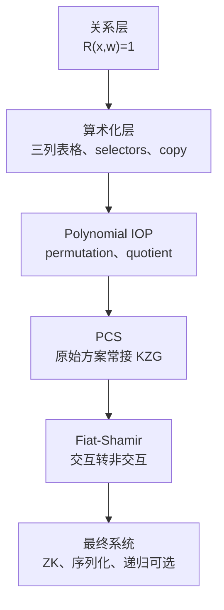
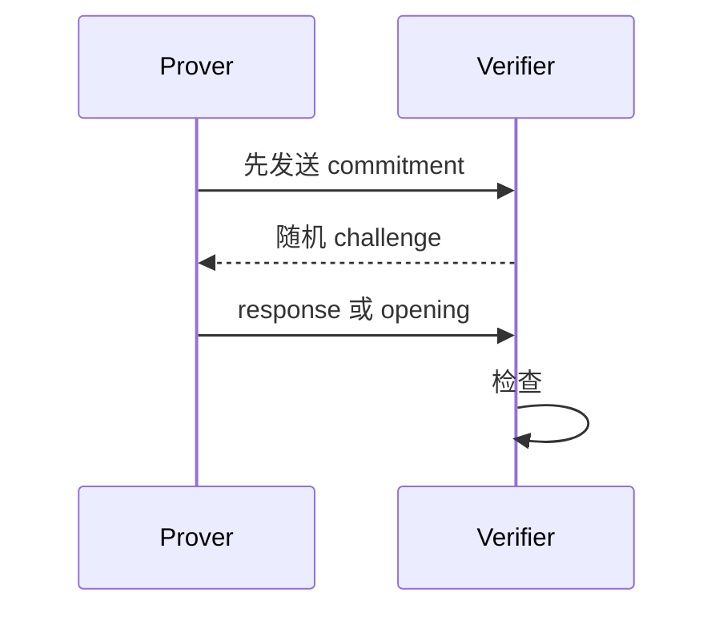

# 00. 证明系统共同语言：先明确要证明什么

> **模块**：M0  
> **建议时间**：3–4 小时  
> **前置**：无  
> **本章产出**：一张证明系统分层图、一份性质对照表、四个错误协议的攻击说明。

## 1. 从关系而不是“算法名称”开始

证明系统的输入不是一段模糊的业务描述，而是一个关系：

$$
R(x,w)=1.
$$

- $x$：statement，也叫 public input；
- $w$：witness，证明者掌握的秘密或完整计算轨迹；
- $R$：公开的判定规则。

贯穿全书的关系是：

$$
R(y;x)=1
\quad\Longleftrightarrow\quad
y=(x+3)(x+5)\ \text{in }\mathbb F.
$$

这里 $y$ 公开，$x$ 私有。证明者不是证明“我知道某个数字”，而是证明“我知道一个 $x$，它与公开 $y$ 满足指定关系”。

### 1.1 关系必须包含语义边界

上式是在有限域中成立。如果应用声称 $x,y$ 是非负 64-bit 整数，仅有域等式并不够，还必须把范围和无溢出写入 $R$。

因此第一条规则是：

> 证明系统只能证明约束实际表达的关系，不能证明开发者脑中想表达却没有写出的关系。

## 2. Prover、Verifier 与 Setup

抽象算法可以写成：

$$
\begin{aligned}
pp&\leftarrow\mathsf{Setup}(1^\lambda,\mathcal R),\\
\pi&\leftarrow\mathsf{Prove}(pp,x,w),\\
b&\leftarrow\mathsf{Verify}(pp,x,\pi).
\end{aligned}
$$

其中：

- $pp$ 是公共参数，可能包含 SRS；
- $\lambda$ 是安全参数；
- $\pi$ 是 proof/argument；
- $b\in\{0,1\}$ 是接受或拒绝。

PLONK 常有两层预处理：

1. universal SRS 覆盖最大 degree；
2. 对具体电路公开派生 proving key 与 verification key。

第二步可以是 circuit-specific，但不一定需要新的秘密仪式。

## 3. 六个不能混淆的性质

| 性质 | 问题 | 不自动保证什么 |
|---|---|---|
| Completeness | 诚实 prover 有合法 witness 时会被接受吗？ | 不保证恶意 prover 不能作弊 |
| Soundness | statement 为假时，作弊 proof 被接受的概率小吗？ | 不一定能提取 witness |
| Knowledge soundness | 接受 proof 是否意味着 prover“知道” witness？ | 不自动隐藏 witness |
| Zero-knowledge | verifier 除 statement 真伪外学不到额外信息吗？ | 不自动简洁或 sound |
| Succinctness | proof 和验证是否显著小于重算？ | prover 不一定快 |
| Transparency | setup 是否不含必须销毁的秘密？ | 不自动 ZK，也不自动 sound |

### 3.1 Proof 与 Argument

严格说：

- **proof** 的 soundness 可是信息论意义；
- **argument** 只对计算受限攻击者 sound，依赖密码学假设。

KZG-PLONK 依赖椭圆曲线离散对数/pairing 类假设，因此属于 argument system。工程语境仍常把产物称为 proof。

### 3.2 知识可靠性为何更强

普通 soundness 只说“假 statement 很难通过”。知识可靠性还要求：若某个 prover 能生成接受的 proof，应存在 extractor 从其行为中提取相应 witness。

这正是名称中 “argument of knowledge” 的含义。Extractor 通常是安全证明中的理论算法，不是部署时真的运行的组件。

## 4. PLONK 位于哪一层



“PLONK”经常被用来指整套系统，但学习时必须分层：

- 三列门和 permutation 属于算术化/PIOP；
- KZG 是 PCS；
- hash transcript 负责 Fiat–Shamir；
- blinding 负责 zero-knowledge。

所以 PLONK 不等于 KZG，也不等于某个电路 DSL。

## 5. 交互协议与 Fiat–Shamir

许多协议先描述为 public-coin 交互：



关键因果关系是：

$$
\text{commit}\to\text{challenge}\to\text{response}.
$$

如果 prover 先看到 challenge 再选 commitment，就能针对检查点造答案。

Fiat–Shamir 用哈希 transcript 模拟 verifier 的随机挑战：

$$
c=H(\text{protocol id},\text{statement},\text{messages so far}).
$$

它不是“最后把 proof hash 一次”。每一轮 challenge 都由此前的规范化 transcript 产生。

## 6. 四个错误系统

### 错误一：proof 直接发送 $x$

Verifier 可以检查 $y=(x+3)(x+5)$，soundness 可能很好，但完全没有 zero-knowledge。

### 错误二：verifier 只检查 proof 长度

Proof 很短，验证也快，但没有任何 soundness。Succinctness 不能替代正确性。

### 错误三：prover 先看到随机点再选 polynomial

它只需构造一个在该点满足恒等式的多项式，不必让约束在整个 domain 成立。Commitment 的职责正是先绑定 polynomial。

### 错误四：public $y$ 未进入 transcript

即使某份 proof 对 $y_1$ 合法，也可能被错误地重放到 $y_2$ 的上下文。Statement 必须同时进入约束和 transcript。

## 7. 本章对象账本

| 对象 | 类型 | 可见性 | 职责 |
|---|---|---|---|
| $y$ | field element | public | statement |
| $x$ | field element | private | witness |
| $R$ | predicate/relation | public | 定义合法 witness |
| $pp$ | parameters | public | 协议参数/SRS |
| $\pi$ | bytes/structured proof | public | 让 verifier 检查声明 |

## 8. 实现前的最小伪代码

先不做密码学，只写关系：

```text
relation(public_y, private_x, field):
    return public_y == (private_x + 3) * (private_x + 5)
```

然后为它生成测试：

- 合法 $x,y$ 返回 true；
- 替换 $y$ 返回 false；
- 同一整数的不同 field 表示被规范化；
- 明确测试的是 field equality，不是 integer equality。

## 9. 自测

1. Statement 与 witness 的区别是什么？
2. Soundness 和 knowledge soundness 的区别是什么？
3. 一个系统能否 sound 但不 zero-knowledge？举例。
4. 一个系统能否 zero-knowledge 但不 sound？描述错误设计。
5. 为什么 verification key 和 public input 应进入 transcript？
6. “universal setup”是否等于“transparent setup”？
7. PLONK 算术化与 KZG 分别属于哪一层？

## 10. 通过标准

不看本章，能够：

- 写出贯穿关系的 public/witness 划分；
- 解释六种性质；
- 画出五层协议栈；
- 攻击四个错误系统；
- 说明 commit 必须早于 challenge。

---

上一篇：[课程总目录](README.md) · 下一篇：[01. 有限域与子群](01-有限域与子群.md)

