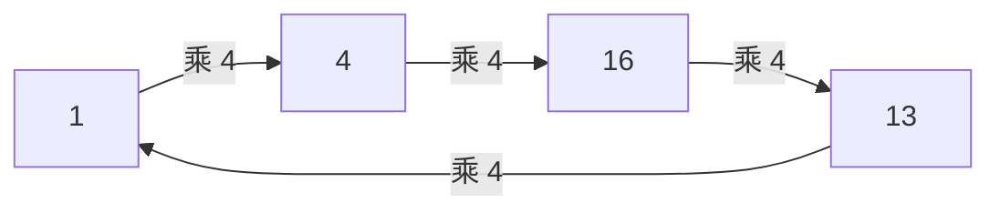

# 01. 有限域与子群：PLONK 的计算世界

> **模块**：M1  
> **建议时间**：8–10 小时  
> **前置**：[00. 证明系统共同语言](00-证明系统共同语言.md)  
> **本章产出**：一个小素域运算模块、子群/根单位检查器，以及一份“域语义不等于整数语义”的反例记录。

## 1. 为什么不用普通整数或浮点数

PLONK 的约束需要稳定的代数规则：

- 加减乘封闭；
- 非零元素都能除；
- 没有舍入误差；
- 多项式根数与次数定理成立。

浮点数有舍入和 NaN，普通整数除法不封闭。有限域提供了所需结构。

最简单的是素域：

$$
\mathbb F_p=\mathbb Z/p\mathbb Z,
$$

其中 $p$ 是素数。元素可用 $0,1,\ldots,p-1$ 的规范代表表示，所有运算最后模 $p$。

## 2. 模运算

在 $\mathbb F_{17}$：

$$
13+7=20\equiv3\pmod{17},
$$

$$
3-5=-2\equiv15\pmod{17},
$$

$$
5\cdot7=35\equiv1\pmod{17}.
$$

因此：

$$
5^{-1}=7.
$$

### 2.1 为什么模合数通常不是域

在 $\mathbb Z/15\mathbb Z$ 中：

$$
3\cdot5\equiv0\pmod{15},
$$

虽然 $3,5$ 都不为零。这叫 zero divisor。$3$ 没有乘法逆元，所以该结构不是域。

素数模数排除了非零 zero divisors。

## 3. 逆元

### 3.1 扩展 Euclidean algorithm

若 $a\ne0$ 且 $p$ 为素数，则：

$$
\gcd(a,p)=1.
$$

存在整数 $u,v$ 使：

$$
au+pv=1.
$$

模 $p$ 后得到：

$$
au\equiv1\pmod p,
$$

所以 $u$ 是 $a^{-1}$。

对 $a=5,p=17$：

$$
17=3\cdot5+2,
\qquad
5=2\cdot2+1.
$$

回代：

$$
1=5-2\cdot2
=5-2(17-3\cdot5)
=7\cdot5-2\cdot17.
$$

因此：

$$
5^{-1}\equiv7\pmod{17}.
$$

每次手算后都应代回验证：$5\cdot7=35\equiv1\pmod{17}$。

### 3.2 Fermat 小定理

对 $a\ne0$：

$$
a^{p-1}=1,
$$

所以：

$$
a^{-1}=a^{p-2}.
$$

实现中常用快速幂；批量求逆还会用后续 grand product 章节介绍的 batch inversion。

## 4. 加法群与乘法群

有限域同时包含：

- 加法群 $(\mathbb F_p,+)$；
- 非零元素构成的乘法群 $(\mathbb F_p^*,\cdot)$。

$\mathbb F_p^*$ 有 $p-1$ 个元素，并且是循环群。存在生成元 $g$，使：

$$
\mathbb F_p^*=\{g^0,g^1,\ldots,g^{p-2}\}.
$$

### 4.1 元素的阶

元素 $a$ 的阶是最小正整数 $m$，满足：

$$
a^m=1.
$$

阶一定整除群大小 $p-1$。

在 $\mathbb F_{17}$ 中取 $\omega=4$：

$$
4^1=4,
$$

$$
4^2=16=-1,
$$

$$
4^3=13,
$$

$$
4^4=1.
$$

且较小正指数没有得到 1，所以 $4$ 的阶为 4。

## 5. 根单位子群

由 $\omega=4$ 生成：

$$
H=\langle4\rangle=\{1,4,16,13\}.
$$

这就是贯穿例子的 4 行 evaluation domain。



每一行对应一个 domain point：

| 行 | Domain point |
|---:|---:|
| 0 | $1$ |
| 1 | $4$ |
| 2 | $16$ |
| 3 | $13$ |

后续 $A(\omega^i)=a_i$ 就是把第 $i$ 行映射到该点。

## 6. 消失多项式的预告

所有 $h\in H$ 都满足 $h^4=1$，因此：

$$
Z_H(X)=X^4-1
$$

在 $H$ 上全为零。

验证：

$$
Z_H(1)=0,
\quad Z_H(4)=4^4-1=0,
$$

其余两点同理。下一章会证明它是连接“所有行成立”和“多项式整除”的桥梁。

## 7. Coset

若 $g\notin H$，则：

$$
gH=\{g,4g,16g,13g\}
$$

是 $H$ 的另一个 coset。群的不同 cosets 要么相同，要么不相交。

在 $\mathbb F_{17}$ 中取 $g=3$：

$$
3H=\{3,12,14,5\}.
$$

它与 $H$ 不相交。

Coset 在 PLONK 有两个常见用途：

1. 给三列 cells 分配互异 identity labels；
2. 在 $Z_H(x)\ne0$ 的扩展 coset 上计算 quotient。

## 8. 域语义不是整数语义

在 $\mathbb F_{17}$：

$$
16+2=1.
$$

如果业务想证明普通整数加法 $16+2=18$，域约束 $c=a+b$ 得到的是 $c=1$。要恢复整数语义，必须证明输入/输出范围和 carry。

类似地，有限域没有内建的：

- 大小比较；
- 正数/负数；
- bit 长度；
- 无溢出；
- 整数除法。

这些都要用额外约束表达。

## 9. 曲线 Base Field 与 Scalar Field

学习 KZG 时会遇到椭圆曲线：

- 曲线坐标 $(x,y)$ 位于 base field $\mathbb F_q$；
- 群元素由 scalar field $\mathbb F_r$ 中的标量相乘；
- KZG polynomial 通常定义在 $\mathbb F_r$ 上。

即使 $q$ 和 $r$ 位数接近，它们通常不是同一个素数。把电路 scalar 当曲线坐标 field 元素，是严重实现错误。

## 10. 最小实现

```text
class Fp:
    modulus p
    value in [0, p-1]

    add(other): Fp
    sub(other): Fp
    mul(other): Fp
    neg(): Fp
    pow(exponent): Fp
    inv(): Fp
    div(other): Fp
```

### 10.1 必须保持的不变量

- 构造时立即 canonicalize；
- 不允许混用不同 modulus；
- `inv(0)` 返回错误，不得悄悄给 0；
- equality 比较 modulus 和 canonical value；
- serialization 只接受规范代表。

### 10.2 测试

对 $\mathbb F_{17}$ 可穷举：

```text
for a in field:
    assert a + 0 == a
    assert a * 1 == a

for nonzero a:
    assert a * inv(a) == 1

for a,b,c in random samples:
    assert a * (b + c) == a*b + a*c
```

## 11. 常见错误

1. 使用语言自带 `%` 却没有处理负数规范化；
2. 让两个不同 modulus 的元素相加；
3. 把整数除法 `/` 当域除法；
4. 忽略 `inv(0)`；
5. 假设任意 $n$ 都有 $n$ 次根单位；
6. 把“field bit length”直接叫作“soundness bits”；
7. 混淆 curve base field 和 scalar field。

## 12. 自测

1. 为什么 $\mathbb Z/15\mathbb Z$ 不是域？
2. 用扩展 Euclidean algorithm 求 $7^{-1}\bmod17$。
3. 验证 $4$ 在 $\mathbb F_{17}$ 中的阶为 4。
4. 列出 $2H$ 和 $3H$，判断是否相同。
5. 为什么不同 cosets 不相交？
6. 为什么 domain size $n$ 必须整除 $p-1$？
7. 写一个域约束成立但整数语义不成立的例子。
8. KZG polynomial 应位于曲线 base field 还是 scalar field？

## 13. 通过标准

- `Fp` 所有穷举/随机测试通过；
- 能手算 $H=\langle4\rangle$；
- 能解释 coset；
- 能识别整数回绕；
- 不再混淆 base/scalar field。

---

上一篇：[00. 证明系统共同语言](00-证明系统共同语言.md) · 下一篇：[02. 多项式、插值与消失多项式](02-多项式插值与消失多项式.md) · [课程目录](README.md)
