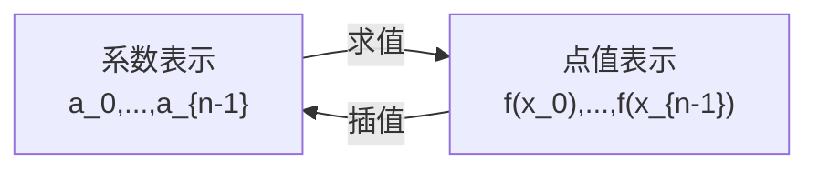

# 02. 多项式、插值与消失多项式：从一列表格到一个代数对象

> **模块**：M2  
> **建议时间**：10–12 小时  
> **前置**：[01. 有限域与子群](01-有限域与子群.md)  
> **本章产出**：多项式运算模块、Lagrange 插值器、消失多项式整除测试。

## 1. 为什么 PLONK 要把列变成多项式

电路表有 $n$ 行。如果 verifier 逐行检查，成本仍是 $O(n)$。PLONK 的压缩路线是：

1. 把每一列视为某个低次多项式在 $n$ 个点上的值；
2. 把所有行约束合成多项式恒等式；
3. 用随机点检查代替逐行检查；
4. 用 PCS 保证 prover 不能看到随机点后更换多项式。

本章完成第一步。

## 2. 多项式的系数表示

设：

$$
f(X)=a_0+a_1X+\cdots+a_dX^d.
$$

系数向量是：

$$
(a_0,a_1,\ldots,a_d).
$$

其中最高非零系数的下标是 degree：

$$
\deg f=d.
$$

零多项式的 degree 需要单独约定，代码里通常使用 `None`、`-∞` 或特定 sentinel，不能把它随意当 0。

### 2.1 基本运算的 degree

若 $f,g\ne0$：

$$
\deg(f+g)\le\max(\deg f,\deg g),
$$

$$
\deg(fg)=\deg f+\deg g.
$$

加法中最高项可能抵消，所以是“至多”；域上的乘法没有 zero divisors，所以乘积 degree 精确相加。

## 3. 点值表示

给定互异点：

$$
D=(x_0,\ldots,x_{n-1}),
$$

存储：

$$
(f(x_0),\ldots,f(x_{n-1})).
$$

若 $\deg f<n$，这 $n$ 个值唯一确定 $f$。



两种表示各有优势：

| 运算 | 系数表示 | 同一 domain 的点值表示 |
|---|---:|---:|
| 加法 | $O(n)$ | $O(n)$ |
| 逐点乘 | 不能直接代替普通乘法 | $O(n)$，但会有 degree aliasing 风险 |
| degree | 直接可见 | 不直接可见 |
| domain 内求值 | 需计算 | 已存储 |

## 4. 插值唯一性

假设 $f,g$ 的 degree 都小于 $n$，并且在 $n$ 个互异点上取值相同。令：

$$
h=f-g.
$$

$h$ 的 degree 小于 $n$，却有 $n$ 个不同根。非零 degree-$d$ polynomial 最多有 $d$ 个根，所以 $h$ 只能是零多项式，即：

$$
f=g.
$$

这就是“$n$ 行点值表唯一对应一个 degree $<n$ 多项式”的证明。

## 5. Lagrange Basis

对互异点 $x_0,\ldots,x_{n-1}$，定义：

$$
L_i(X)=\prod_{j\ne i}\frac{X-x_j}{x_i-x_j}.
$$

它满足：

$$
L_i(x_j)=
\begin{cases}
1,&i=j,\\
0,&i\ne j.
\end{cases}
$$

因此给定值 $y_i$，插值多项式为：

$$
f(X)=\sum_{i=0}^{n-1}y_iL_i(X).
$$

在 $x_k$ 处：

$$
f(x_k)=\sum_i y_iL_i(x_k)=y_k.
$$

这就是 PLONK 标题中 “Lagrange-bases” 的核心。

## 6. 消失多项式

对任意互异集合 $D$：

$$
Z_D(X)=\prod_{x\in D}(X-x).
$$

显然：

$$
Z_D(x)=0\qquad\forall x\in D.
$$

如果 $P$ 在 $D$ 上全为零，那么每个 $(X-x)$ 都整除 $P$，所以：

$$
Z_D\mid P.
$$

反方向也显然：若 $P=Z_DQ$，则 $P$ 在 $D$ 上全为零。

因此：

$$
\boxed{
P(x)=0\ \forall x\in D
\quad\Longleftrightarrow\quad
Z_D(X)\mid P(X)
}
$$

这是 PLONK quotient argument 的代数核心。

## 7. 根单位子群上的简化

若：

$$
H=\{1,\omega,\ldots,\omega^{n-1}\},
$$

则 $H$ 正是 $X^n-1$ 的全部根，所以：

$$
Z_H(X)=X^n-1.
$$

导数：

$$
Z_H'(X)=nX^{n-1}.
$$

在 $\omega^i$：

$$
Z_H'(\omega^i)=n\omega^{i(n-1)}=n\omega^{-i}.
$$

因此 Lagrange basis 有闭式：

$$
L_i(X)
=\frac{Z_H(X)}{(X-\omega^i)Z_H'(\omega^i)}
=\frac{\omega^i}{n}\frac{X^n-1}{X-\omega^i}.
$$

边界约束常用 $L_0$ 只在第 0 行取 1。

## 8. 贯穿例子的列插值

取 $\mathbb F_{17}$、$n=4$、$\omega=4$。选一个具体 witness：

$$
x=2,
\quad r=5,
\quad s=7,
\quad y=rs=35=1\pmod{17}.
$$

三列点值为：

$$
\mathbf a=(2,2,5,0),
$$

$$
\mathbf b=(0,0,7,0),
$$

$$
\mathbf c=(5,7,1,0).
$$

对应多项式：

$$
A(X)=2L_0(X)+2L_1(X)+5L_2(X),
$$

$$
B(X)=7L_2(X),
$$

$$
C(X)=5L_0(X)+7L_1(X)+L_2(X).
$$

无需立即展开系数。Lagrange form 已直接表达每行值；FFT 章节再高效转换。

## 9. Polynomial Division

对 $P,D$ 且 $D\ne0$，存在唯一 $Q,R$：

$$
P=QD+R,
\qquad
\deg R<\deg D.
$$

检查“$Z_H$ 是否整除 $P$”就是检查：

$$
P\bmod Z_H=0.
$$

教学实现应返回 quotient 和 remainder，而不是假定可整除。

## 10. Degree Aliasing

点值表示中的逐点乘法得到：

$$
(f(x_i)g(x_i))_i.
$$

用 $n$ 个点插值得到的是唯一 degree $<n$ 且与 $fg$ 在 $D$ 上相同的多项式，即：

$$
fg\bmod Z_D.
$$

只有当：

$$
\deg f+\deg g<n
$$

时，它才等于普通乘积 $fg$。这就是 FFT 卷积为什么需要 zero-padding，也是 PLONK 为什么要精确追踪 degree 并扩大 quotient domain。

## 11. Schwartz–Zippel 的单变量版本

若 $P\ne Q$ 且：

$$
\deg(P-Q)\le d,
$$

那么从有限集合 $S\subseteq\mathbb F$ 均匀采样 $\zeta$：

$$
\Pr[P(\zeta)=Q(\zeta)]
\le\frac d{|S|}.
$$

因为非零差多项式最多有 $d$ 个根。

随机点检查只在 prover 已经被 commitment 绑定到 $P,Q$ 后有意义；否则 prover 可以看到 $\zeta$ 后再选多项式。

## 12. 最小实现

```text
Polynomial(coefficients):
    normalize_trailing_zeros
    degree
    add, sub, scale, mul
    eval(x)
    divmod(divisor)

lagrange_interpolate(points, values)
vanishing_polynomial(points)
```

### 12.1 不变量

- 系数都在同一 field；
- trailing zeros 规范化；
- 除数不能为零；
- 插值点必须互异；
- 结果 degree 小于点数；
- `P == Q*D + R` 必须可验证。

## 13. 必做实验

1. 随机生成 degree $<4$ 的 $f$；
2. 在 $H$ 上求值；
3. 用 Lagrange 插值恢复；
4. 比较全部系数；
5. 构造随机 $Q$，令 $P=Z_HQ$；
6. 验证 `divmod(P, Z_H)` 余数为零；
7. 给 $P$ 加 1，验证余数不为零；
8. 构造 degree $\ge4$ 的不同多项式，在 $H$ 上产生相同 values，观察 aliasing。

## 14. 常见错误

- 把点值向量本身叫 polynomial，却不记录 domain；
- 忽略 degree bound；
- 插值点重复；
- 零多项式 degree 处理不一致；
- 认为逐点乘总等于普通 polynomial multiplication；
- 用整数除法实现 field coefficient division；
- 随机点检查前没有 commitment。

## 15. 自测

1. 证明插值唯一性。
2. 证明 $P|_H=0\Longleftrightarrow Z_H\mid P$。
3. 推导根单位 domain 上的 $L_i$ 闭式。
4. 为什么 $L_0$ 能表达“只约束第一行”？
5. 给出两个不同高次多项式，它们在 $H$ 上 values 相同。
6. 为什么 random evaluation 需要 degree bound？
7. 为什么 random evaluation 需要先 commit？

## 16. 通过标准

- 多项式运算与插值 property tests 全部通过；
- 能从列 values 写出 Lagrange form；
- 能解释 divisibility；
- 能演示 degree aliasing；
- 建立第一版 degree 账本。

---

上一篇：[01. 有限域与子群](01-有限域与子群.md) · 下一篇：[03. 根单位、FFT 与 Coset](03-根单位FFT与Coset.md) · [课程目录](README.md)

