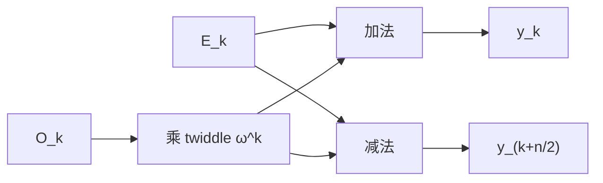

# 03. 根单位、FFT 与 Coset：高效切换多项式表示

> **模块**：M3  
> **建议时间**：8–10 小时  
> **前置**：[02. 多项式、插值与消失多项式](02-多项式插值与消失多项式.md)  
> **本章产出**：radix-2 FFT/IFFT、coset FFT，以及与朴素算法的对拍测试。

## 1. FFT 在 PLONK 中做什么

PLONK 在两种表示之间频繁切换：

- 电路表天然是 evaluations；
- KZG commitment 常从 coefficients 做 MSM；
- polynomial multiplication 常在更大 evaluation domain 上逐点完成；
- quotient 需要在避开 $Z_H$ 零点的 coset 上计算。

朴素 evaluation/interpolation 是 $O(n^2)$。FFT 利用根单位结构降到：

$$
O(n\log n).
$$

FFT 只是快速表示转换，不负责 soundness、commitment 或 zero-knowledge。

## 2. 有限域 DFT

令 $\omega$ 是阶为 $n$ 的根单位。对系数：

$$
f(X)=\sum_{j=0}^{n-1}a_jX^j,
$$

在 $H$ 上的 values 是：

$$
y_k=f(\omega^k)
=\sum_{j=0}^{n-1}a_j\omega^{jk}.
$$

这就是有限域版本的离散 Fourier 变换。没有复数和近似误差，所有计算都在 $\mathbb F$ 中精确进行。

## 3. 偶奇拆分

把系数按偶数/奇数下标拆开：

$$
f(X)=f_e(X^2)+Xf_o(X^2),
$$

其中：

$$
f_e(Y)=a_0+a_2Y+a_4Y^2+\cdots,
$$

$$
f_o(Y)=a_1+a_3Y+a_5Y^2+\cdots.
$$

在 $X=\omega^k$：

$$
f(\omega^k)
=f_e(\omega^{2k})
+\omega^kf_o(\omega^{2k}).
$$

因为 $\omega^2$ 的阶是 $n/2$，两个子问题规模都变为 $n/2$。

又因为：

$$
\omega^{k+n/2}=-\omega^k,
$$

可同时得到：

$$
f(\omega^{k+n/2})
=f_e(\omega^{2k})
-\omega^kf_o(\omega^{2k}).
$$

### 3.1 Butterfly

若子问题结果是 $E_k,O_k$，则：

$$
y_k=E_k+\omega^kO_k,
$$

$$
y_{k+n/2}=E_k-\omega^kO_k.
$$



## 4. 复杂度

递推：

$$
T(n)=2T(n/2)+O(n).
$$

每层总共 $O(n)$ 个域运算，共 $\log_2n$ 层，所以：

$$
T(n)=O(n\log n).
$$

这解释了为什么 PLONK 通常把 domain padding 到 2 的幂：radix-2 FFT 最自然。

## 5. IFFT

逆变换使用逆根 $\omega^{-1}$，最后乘 $n^{-1}$：

$$
a_j
=n^{-1}\sum_{k=0}^{n-1}y_k\omega^{-jk}.
$$

因此实现可复用 FFT：

```text
ifft(values, omega):
    result = fft(values, inverse(omega))
    return [x * inverse(n) for x in result]
```

具体输入/输出顺序取决于实现是 decimation-in-time 还是 decimation-in-frequency，以及 bit-reversal 放在何处。Prover 和 verifier 必须共享同一 domain ordering。

## 6. $\mathbb F_{17}$ 的四点 FFT

取：

$$
n=4,\qquad\omega=4,
$$

则：

$$
H=(1,4,16,13).
$$

对：

$$
f(X)=a_0+a_1X+a_2X^2+a_3X^3,
$$

values 为：

$$
\begin{aligned}
y_0&=a_0+a_1+a_2+a_3,\\
y_1&=a_0+4a_1+16a_2+13a_3,\\
y_2&=a_0+16a_1+a_2+16a_3,\\
y_3&=a_0+13a_1+16a_2+4a_3.
\end{aligned}
$$

先用朴素求值计算，再与 FFT 输出逐项比较。

## 7. Zero-padding 与乘法

若：

$$
\deg f<d_f,
\qquad
\deg g<d_g,
$$

则：

$$
\deg(fg)<d_f+d_g-1.
$$

为了通过点值逐点乘恢复普通 $fg$，evaluation domain 大小 $N$ 必须大于乘积 degree。

流程：

1. coefficients 补零到 $N$；
2. size-$N$ FFT；
3. values 逐点乘；
4. size-$N$ IFFT。

若 $N$ 太小，得到的是 $fg\bmod(X^N-1)$，即 circular convolution/degree aliasing。

## 8. Coset FFT

取 shift $g\notin H$，coset：

$$
gH=\{g,g\omega,\ldots,g\omega^{n-1}\}.
$$

在 coset 求值：

$$
f(g\omega^k)
=\sum_j a_jg^j\omega^{jk}.
$$

所以只需先把系数缩放：

$$
a_j'=a_jg^j,
$$

再对 $a_j'$ 做普通 FFT。

Coset IFFT 则在 IFFT 后乘 $g^{-j}$。

## 9. Quotient 为什么需要 Coset

在电路 domain $H$ 上：

$$
Z_H(h)=0.
$$

不能逐点计算：

$$
t(h)=\frac{P_{\mathrm{all}}(h)}{Z_H(h)}.
$$

即使 numerator 也为零，$0/0$ 仍未定义。

在 disjoint coset $gH$ 上：

$$
Z_H(g\omega^k)=(g\omega^k)^n-1=g^n-1.
$$

因为 $g\notin H$，通常 $g^n\ne1$，所以 denominator 非零。Prover 可：

1. 把所有相关 polynomials evaluate 到扩展 coset；
2. 逐点构造 numerator；
3. 逐点除以 $Z_H$；
4. IFFT 恢复 quotient coefficients。

注意实际 quotient degree 可能需要比 $n$ 大 2、4 或更多倍的 domain，不能只使用同样大小的 $gH$。扩展因子由 degree 账本决定。

## 10. Root of Unity 的存在条件

在素域 $\mathbb F_p$ 中，乘法群大小为 $p-1$。阶为 $n$ 的元素存在，当且仅当：

$$
n\mid(p-1).
$$

若需要很大的 radix-2 FFT，必须选择 $p-1$ 含足够大的 $2^k$ 因子。这叫 field 的 2-adicity。

不是任意 field 都适合任意 FFT 规模。

## 11. 最小实现

```text
fft(coeffs, omega):
    require len(coeffs) is power of two
    require omega has exact order len(coeffs)
    recursively split even and odd coefficients
    combine with butterflies

ifft(values, omega):
    result = fft(values, inverse(omega))
    scale by inverse(len(values))

coset_fft(coeffs, omega, shift):
    scaled[j] = coeffs[j] * shift^j
    return fft(scaled, omega)
```

### 11.1 验证根的阶

不仅检查：

$$
\omega^n=1,
$$

还应检查对 $n$ 的素因子 $q$：

$$
\omega^{n/q}\ne1.
$$

否则传入的是较小阶元素，domain 会重复。

## 12. 必做测试

- FFT 与朴素 evaluation 对拍；
- IFFT round-trip；
- 随机 polynomial 多种规模；
- 错误 root 被拒绝；
- 非 2 次幂长度被拒绝或走明确的其他算法；
- coset FFT 与直接在 $gH$ 求值对拍；
- quotient coset 上 $Z_H$ 全部非零；
- 无 zero-padding 的乘法展示 aliasing；
- 足够 padding 后恢复正确乘积。

## 13. 工程上的三个顺序问题

1. Domain elements 是 $(1,\omega,\ldots)$ 还是 bit-reversed？
2. FFT 输出是否自然序，还是 bit-reversed？
3. Coset shift 和 rotation $\omega X$ 的约定是什么？

数学上等价的顺序，在序列化、copy permutation 和 prover/verifier 对拍中必须完全一致。

## 14. 自测

1. 推导偶奇拆分和 butterfly。
2. 为什么 $\omega^2$ 的阶是 $n/2$？
3. IFFT 为什么使用 $\omega^{-1}$ 和 $n^{-1}$？
4. 为什么 domain size 常取 2 的幂？
5. 什么是 degree aliasing？
6. Coset FFT 如何转换为普通 FFT？
7. 为什么 quotient 不能在 $H$ 上逐点除？
8. Quotient 扩展 domain 大小由什么决定？

## 15. 通过标准

- FFT/IFFT 与朴素算法对拍；
- 能画 butterfly；
- 能演示 aliasing；
- 能实现 coset FFT；
- 能由 degree 上界决定 padding/扩展规模，而不是猜测。

---

上一篇：[02. 多项式、插值与消失多项式](02-多项式插值与消失多项式.md) · 下一篇：[04. 关系、算术电路与约束安全](04-关系算术电路与约束安全.md) · [课程目录](README.md)

