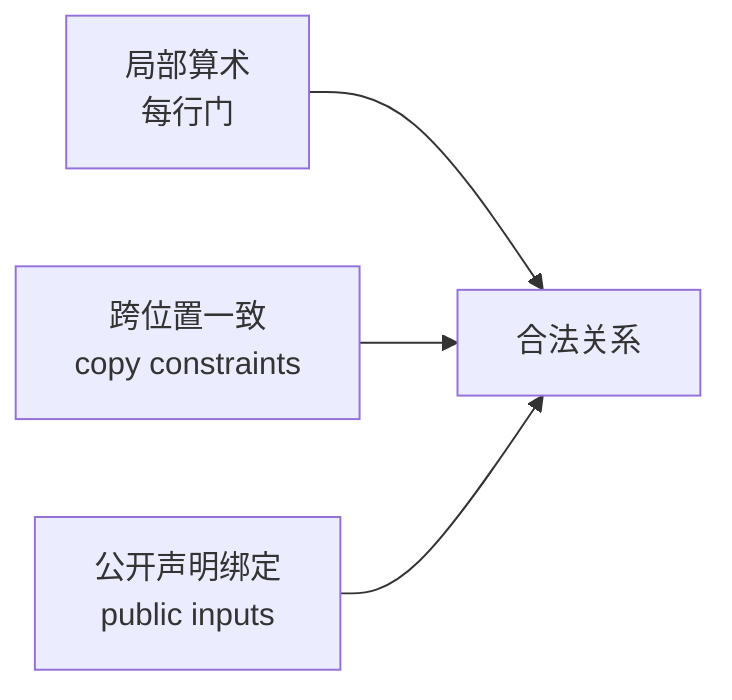

# 04. 关系、算术电路与约束安全：先防止证明错误命题

> **模块**：M4  
> **建议时间**：6–8 小时  
> **前置**：[01. 有限域与子群](01-有限域与子群.md)，建议先完成 [03. FFT 与 Coset](03-根单位FFT与Coset.md)  
> **本章产出**：贯穿关系的直接表格 verifier，以及一组能击穿不完整约束的恶意 witnesses。

## 1. 算术化之前先固定关系

目标关系：

$$
R(y;x)=1
\quad\Longleftrightarrow\quad
y=(x+3)(x+5)\ \text{in }\mathbb F.
$$

定义：

$$
r=x+3,
\qquad
s=x+5,
\qquad
y=rs.
$$

关系可以分解成三个低次方程：

$$
x+3-r=0,
$$

$$
x+5-s=0,
$$

$$
rs-y=0.
$$

中间变量 $r,s$ 是 auxiliary witness。它们不是 public，却必须被完整约束。

## 2. Witness Generation 不等于 Constraint Checking

Witness generator 会从 $x$ 算出：

```text
r = x + 3
s = x + 5
y = r * s
```

但 prover 可以修改 witness generator，甚至完全不用它。Verifier 只能依赖 constraints。

因此：

> “代码正确地计算了 witness”不能证明“电路约束迫使所有 witness 都正确”。

审计必须把 prover 当成可任意填写所有 witness cells 的攻击者。

## 3. 直接电路表

先不使用 polynomial。把三步计算排成表：

| 行 | $a$ | $b$ | $c$ | 局部约束 |
|---:|---|---|---|---|
| 0 | $x$ | 0 | $r$ | $a+3-c=0$ |
| 1 | $x$ | 0 | $s$ | $a+5-c=0$ |
| 2 | $r$ | $s$ | $y$ | $ab-c=0$ |
| 3 | 0 | 0 | 0 | padding/no-op |

还需要：

$$
a_0=a_1,
$$

$$
c_0=a_2,
$$

$$
c_1=b_2,
$$

$$
c_2=y_{public}.
$$

前三项是 copy constraints，最后一项绑定 statement。

### 3.1 未使用 cells

$b_0,b_1$ 和 padding cells 没有业务语义。填 0 是布局约定，而不是关系的一部分。

未约束 cell 本身不一定是漏洞；把未约束 cell 当作已证明的业务数据才是漏洞。

## 4. 局部门为什么不够

删除 $a_0=a_1$。恶意 prover 可选两个不同值：

$$
x_0\ne x_1,
$$

并令：

$$
r=x_0+3,
\qquad
s=x_1+5,
\qquad
y=rs.
$$

三行局部门全部成立，但不存在一个单一 $x$ 同时解释 $r,s$。

删除 $c_0=a_2$，则第一行输出 $r$ 与第三行左输入可以不同。删除 public binding，proof 可以对任意外部 $y$ 重放。

这说明约束系统至少有三类条件：



三类缺一不可。

## 5. Underconstraint 与 Overconstraint

### 5.1 Underconstraint

存在语义错误 witness 却能通过约束。

常见原因：

- 漏 copy/equality；
- 漏 public input；
- selector 没启用；
- bit decomposition 没约束重组；
- inverse gadget 没处理零；
- range/carry 缺失；
- 某个 auxiliary value 只被计算、未被约束。

### 5.2 Overconstraint

合法业务输入却无法产生满足 witness。

常见原因：

- selector 多开一行；
- padding/blinding 行仍启用业务 gate；
- 错误范围上界；
- rotation 跨越 region；
- 把无语义 dummy cell 固定成不兼容值。

系统既要拒绝所有非法 witness，也要接受所有合法 witness。

## 6. 有限域语义陷阱

### 6.1 Boolean

要证明 $b\in\{0,1\}$，加入：

$$
b(b-1)=0.
$$

在域中没有 zero divisors，因此只有 $b=0$ 或 $b=1$。

### 6.2 Division

若 witness 声称：

$$
z=x^{-1},
$$

约束 $xz=1$ 会自动排除 $x=0$。但若业务希望“零输入返回零”，必须加入 selector/zero flag，不能直接求逆。

### 6.3 比较和范围

约束：

$$
c=a+b
$$

只证明域等式。若需要 8-bit 加法，必须证明：

$$
0\le a,b,c<2^8
$$

以及 carry 关系。域本身没有 `<`。

### 6.4 非唯一整数编码

若允许超过 modulus 的整数，$0$ 与 $p$ 映射到同一个 field element。任何整数编码都必须限定 canonical range。

## 7. Direct Verifier

在进入 polynomial 前，先写一个最可信的 $O(n)$ 检查器：

```text
verify_table(public_y, table):
    assert table[0].a + 3 - table[0].c == 0
    assert table[1].a + 5 - table[1].c == 0
    assert table[2].a * table[2].b - table[2].c == 0

    assert table[0].a == table[1].a
    assert table[0].c == table[2].a
    assert table[1].c == table[2].b
    assert table[2].c == public_y
```

这个 direct verifier 是后续 polynomial/KZG 版本的 differential oracle。

如果最终 verifier 接受，而 direct verifier 对同一 decoded witness 拒绝，说明算术化或协议集成有 bug。

## 8. 约束设计流程

### 第一步：写 relation

明确 public、private、auxiliary、field/integer semantics。

### 第二步：写 honest witness generator

只负责产生一个候选 witness。

### 第三步：写约束

假设每个 witness value 都由攻击者控制。

### 第四步：列自由度

对每个 cell 问：

- 它参与哪个 gate？
- 它参与哪个 copy？
- 它是否绑定 public input？
- 若修改它，relation 是否改变？

### 第五步：构造反例

逐条删除约束并构造仍能通过的错误 witness。

### 第六步：再做 polynomial encoding

不要在关系本身尚未验证时开始优化 FFT/PCS。

## 9. 测试矩阵

| Mutation | 应失败的约束 |
|---|---|
| $r\ne x+3$ | row 0 |
| $s\ne x+5$ | row 1 |
| $y\ne rs$ | row 2 |
| $a_0\ne a_1$ | copy $x$ |
| $c_0\ne a_2$ | copy $r$ |
| $c_1\ne b_2$ | copy $s$ |
| $c_2\ne y_{public}$ | public binding |
| 修改无语义 $b_0$ | 不应影响 relation |

最后一项是重要的反向测试：不要错误地过度约束无语义 cell。

## 10. R1CS 与 PLONKish 的位置

R1CS 使用：

$$
\langle\mathbf a_i,\mathbf w\rangle
\cdot
\langle\mathbf b_i,\mathbf w\rangle
=
\langle\mathbf c_i,\mathbf w\rangle.
$$

PLONK 使用表格、selectors 与 permutation。两者都把 relation 变成低次域方程，但 wiring 表达方式不同。

理解 R1CS 有助于比较，不是学习 PLONK 的硬前置。

## 11. 自测

1. Witness generator 为什么不是安全边界？
2. 局部门全部成立为何仍可能是假 relation？
3. 为删除 $a_0=a_1$ 构造具体 $\mathbb F_{17}$ 反例。
4. 未约束 cell 何时不是漏洞？
5. Underconstraint 与 overconstraint 的区别是什么？
6. 如何证明 field element 是 boolean？
7. 为什么域加法不等于无溢出的整数加法？
8. Public input 必须在哪两处绑定？

## 12. 通过标准

- direct verifier 完成；
- 每条业务约束都有独立 mutation test；
- 能构造至少三种恶意 witness；
- 能解释 dummy cells；
- relation 文档明确 field/integer semantics。

---

上一篇：[03. 根单位、FFT 与 Coset](03-根单位FFT与Coset.md) · 下一篇：[05. PLONK 三列门与 Lagrange 算术化](05-PLONK三列门与Lagrange算术化.md) · [课程目录](README.md)

