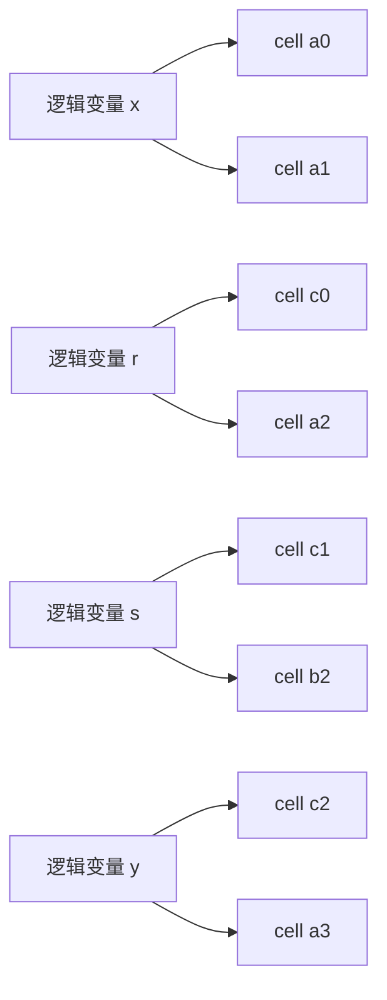

# 06. Copy Constraints 与置换论证：把 wiring 变成一个全局排列

> **模块**：M6  
> **建议时间**：8–10 小时  
> **前置**：[05. PLONK 三列门与 Lagrange 算术化](05-PLONK三列门与Lagrange算术化.md)  
> **本章产出**：从 wiring cycles 生成三列 permutation evaluations，并验证 labels 唯一、sigma 为双射。

## 1. 局部门留下的漏洞

M5 只证明每行公式成立。攻击者仍可给同一逻辑变量的不同出现位置填写不同值：



Copy constraint 的目标就是证明每一组出自同一逻辑 wire 的 cells 取值相同。

朴素方案是逐个打开并比较，成本随 wiring 数量增长。PLONK 的做法是把全部 cells 编成一个 permutation，再证明“值与标签配对后的两个 multiset 相等”。

## 2. 给每个 Cell 唯一身份

对三列、$n$ 行，共有 $3n$ 个位置。取三个两两不相交的 cosets：

$$
H,\qquad k_1H,\qquad k_2H.
$$

定义 identity polynomials：

$$
\operatorname{id}_1(X)=X,
\qquad
\operatorname{id}_2(X)=k_1X,
\qquad
\operatorname{id}_3(X)=k_2X.
$$

于是第 $i$ 行三个 cells 的标签是：

$$
\ell(a_i)=\omega^i,
\quad
\ell(b_i)=k_1\omega^i,
\quad
\ell(c_i)=k_2\omega^i.
$$

要求三个 cosets 不相交，正是为了保证每个 cell label 唯一。

## 3. $\mathbb F_{17}$ 的完整标签表

沿用：

$$
H=(1,4,16,13).
$$

可选：

$$
k_1=2,\qquad k_2=3.
$$

则：

$$
2H=(2,8,15,9),
\qquad
3H=(3,12,14,5).
$$

三者互不相交。标签表为：

| 行 | $a_i$ label | $b_i$ label | $c_i$ label |
|---:|---:|---:|---:|
| 0 | 1 | 2 | 3 |
| 1 | 4 | 8 | 12 |
| 2 | 16 | 15 | 14 |
| 3 | 13 | 9 | 5 |

实现时先枚举全部 labels，并断言集合大小恰好为 $3n$。

## 4. 从 Copy Groups 到 Cycles

贯穿布局有四个非平凡 copy groups：

$$
(a_0,a_1),
\quad
(c_0,a_2),
\quad
(c_1,b_2),
\quad
(c_2,a_3).
$$

把每组连成 cycle。例如规定“当前位置映到下一位置”：

$$
a_0\mapsto a_1\mapsto a_0.
$$

因此：

$$
\sigma(\ell(a_0))=\ell(a_1)=4,
\qquad
\sigma(\ell(a_1))=\ell(a_0)=1.
$$

其余三个 cycles：

$$
3\leftrightarrow16,
\qquad
12\leftrightarrow15,
\qquad
14\leftrightarrow13.
$$

不参与 copy 的 cell 是 fixed point：

$$
\sigma(\ell)=\ell.
$$

Cycle 方向可以反转，只要 prover、VK 与 verifier 使用同一 permutation。

## 5. 三列 Sigma Evaluations

对每个 source cell，记录它的 destination label：

$$
S_{\sigma,1}(\omega^i)=\sigma(\ell(a_i)),
$$

$$
S_{\sigma,2}(\omega^i)=\sigma(\ell(b_i)),
$$

$$
S_{\sigma,3}(\omega^i)=\sigma(\ell(c_i)).
$$

本例得到：

| 行 | $S_{\sigma,1}$ | $S_{\sigma,2}$ | $S_{\sigma,3}$ |
|---:|---:|---:|---:|
| 0 | 4 | 2 | 16 |
| 1 | 1 | 8 | 15 |
| 2 | 3 | 12 | 13 |
| 3 | 14 | 9 | 5 |

逐项核对：

- $a_2$ 的 source label 是 16，目标是 $c_0$，所以 $S_{\sigma,1}(\omega^2)=3$；
- $b_2$ 的 source label 是 15，目标是 $c_1$，所以 $S_{\sigma,2}(\omega^2)=12$；
- $c_3$ 没参与 copy，source/target label 都是 5。

最后对每列插值，得到 degree $<n$ 的 $S_{\sigma,j}(X)$。它们属于 fixed circuit/VK，不是 prover message。

## 6. 为什么 Permutation 能表达相等

想象每个 cell 贡献一对：

$$
(w,\ell).
$$

Identity side 是全部：

$$
(w_{cell},\ell_{cell}).
$$

Permutation side 则把标签替换为目标标签：

$$
(w_{cell},\sigma(\ell_{cell})).
$$

若一个 cycle 上所有 witness values 相同，那么沿 cycle 旋转标签不会改变 pair multiset。

以 $a_0\leftrightarrow a_1$ 为例。若两处值都为 $x$：

$$
\{(x,1),(x,4)\}
=
\{(x,4),(x,1)\}.
$$

若值分别为 $x_0\ne x_1$，则通常：

$$
\{(x_0,1),(x_1,4)\}
\ne
\{(x_0,4),(x_1,1)\}.
$$

“通常”需要下一节的随机压缩变成概率性代数检查。

## 7. 用 $\beta,\gamma$ 压缩 Pair

把 value 与 label 压成一个 field element：

$$
\operatorname{enc}_{\beta,\gamma}(w,\ell)
=w+\beta\ell+\gamma.
$$

然后比较两个 multiset 的随机乘积 fingerprint：

$$
\prod_{cells}(w+\beta\ell+\gamma)
\stackrel?=
\prod_{cells}(w+\beta\sigma(\ell)+\gamma).
$$

### 7.1 $\beta$ 的职责

$\beta$ 把 position label 混入 value。若没有 $\beta$，两侧只剩相同的 witness values，任何 wiring 都会通过。

### 7.2 $\gamma$ 的职责

$\gamma$ 提供随机平移，帮助随机化乘积因子和退化/零因子事件。它不是“让 copy 值相等”的独立约束；安全性来自整个随机 multiset identity。

### 7.3 Challenge 顺序

$A,B,C$ commitments 必须先固定，然后 transcript 才产生 $\beta,\gamma$。否则 prover 可针对已知挑战搜索碰撞 witness。

## 8. 为什么必须是双射

若 sigma 重复某个目标、遗漏另一个目标，它就不是 permutation。此时即使某些随机乘积偶然相等，也不再表达“同一组 labels 被重新排序”。

必须验证：

1. source labels 唯一；
2. 每个 source 恰有一个 target；
3. target labels 也恰好覆盖全集；
4. 每个 copy group 形成一个 cycle；
5. fixed points 映到自身。

这些是 circuit compiler/VK 构造时的确定性检查，不能寄希望于随机 challenge 发现错误 VK。

## 9. 构造算法

```text
build_identity_labels(domain, k1, k2):
    labels_a = domain
    labels_b = [k1 * h for h in domain]
    labels_c = [k2 * h for h in domain]
    assert all 3n labels are distinct

build_sigma(copy_groups, all_cells):
    sigma[cell] = cell by default
    for group in copy_groups:
        for each consecutive source, target in cyclic(group):
            sigma[source] = target
    assert sigma is a bijection

build_sigma_evaluations(sigma, labels):
    for each column and row:
        output destination cell's identity label
```

建议 copy group 的输入使用稳定 cell identifier，如 `(column_index,row_index)`，不要用显示名称推导身份。

## 10. 正确性 Oracle

在 grand product 之前先做直接检查：

```text
check_copy_groups(witness, copy_groups):
    for group in copy_groups:
        assert all witness values in group are equal
```

再检查随机乘积：

```text
left  = product(value[cell] + beta * label[cell] + gamma)
right = product(value[cell] + beta * label[sigma[cell]] + gamma)
```

对随机 $\beta,\gamma$，direct copy checker 与 fingerprint 应大量对拍。小域实验会观察到非零碰撞概率，这正好说明协议需要大域和严格 soundness 账本。

## 11. 常见错误

| 错误 | 后果 |
|---|---|
| $k_1H$ 与 $H$ 相交 | 两个 cells 共用 identity label |
| sigma 存在重复 target | 不再是 permutation |
| 把 target cell 的 value 一起移动 | 检查的命题被改变 |
| 只比较 witness values 的乘积 | 完全没有检查 wiring |
| $\beta,\gamma$ 在 commitments 前固定 | prover 可适配挑战 |
| prover 自行提交 sigma 而 VK 不绑定 | prover 可把错误 wiring 改成 fixed points |
| 行/列序约定不一致 | sigma 指向错误 cell |

## 12. 必做实验

1. 枚举本例 12 个 labels，验证互异；
2. 从四个 copy groups 自动生成 sigma 表；
3. 验证 sigma source/target 集合相同；
4. honest witness 的 direct copy check 与 fingerprint 均通过；
5. 修改 $a_1$，direct check 失败，随机 fingerprint 通常失败；
6. 让 $k_1=1$，验证 label uniqueness 立即失败；
7. 删除一个 sigma target，验证 bijection checker 立即失败；
8. 在小域枚举挑战，统计 fingerprint 碰撞，理解“概率 soundness”。

## 13. 自测

1. 为什么 label 必须包含列信息？
2. 三个 cosets 为什么必须两两不交？
3. 如何从 copy group 写出 cycle？
4. $S_{\sigma,j}(\omega^i)$ 存的是 value 还是 label？
5. 没有 $\beta$ 会发生什么？
6. Sigma 为什么必须是双射？
7. 为什么未 copy 的 cells 应是 fixed points？
8. 为什么挑战必须在 witness commitments 之后产生？

## 14. 通过标准

- 能从 wiring 图手写 labels、cycles 与 sigma table；
- 代码验证 $3n$ 个 labels 互异；
- sigma 构造器验证双射；
- direct copy oracle 与随机 fingerprint 对拍；
- 能说明 $\beta$、$\gamma$ 各自的作用与局限。

---

上一篇：[05. PLONK 三列门与 Lagrange 算术化](05-PLONK三列门与Lagrange算术化.md) · 下一篇：[07. Grand Product 累加器](07-Grand-Product累加器.md) · [课程目录](README.md)
