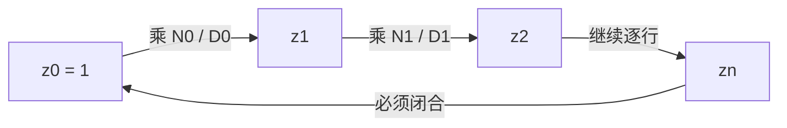

# 07. Grand Product 累加器：把一个全局乘积变成逐行递推

> **模块**：M7  
> **建议时间**：8–10 小时  
> **前置**：[06. Copy Constraints 与置换论证](06-Copy约束与置换论证.md)  
> **本章产出**：构造 grand-product evaluations、多项式 $Z(X)$，并解释 recurrence、边界与闭合缺一不可。

## 1. 从全局等式开始

M6 得到一个全局检查：

$$
\prod_{i=0}^{n-1}N_i
\stackrel?=
\prod_{i=0}^{n-1}D_i.
$$

其中 identity side 的每一行都包含三列因子：

$$
\begin{aligned}
N_i={}&(a_i+\beta\omega^i+\gamma)\\
&\cdot(b_i+\beta k_1\omega^i+\gamma)\\
&\cdot(c_i+\beta k_2\omega^i+\gamma),
\end{aligned}
$$

permutation side：

$$
\begin{aligned}
D_i={}&(a_i+\beta S_{\sigma,1}(\omega^i)+\gamma)\\
&\cdot(b_i+\beta S_{\sigma,2}(\omega^i)+\gamma)\\
&\cdot(c_i+\beta S_{\sigma,3}(\omega^i)+\gamma).
\end{aligned}
$$

Verifier 不想接收全部 factors 再做 $O(n)$ 检查。Grand product 用一个累加器把全局等式局部化。

## 2. Prefix-Product 直觉

定义：

$$
z_0=1,
$$

$$
z_{i+1}=z_i\frac{N_i}{D_i}.
$$

展开：

$$
z_i=\prod_{j=0}^{i-1}\frac{N_j}{D_j}.
$$

走完全部 $n$ 行：

$$
z_n=\frac{\prod_iN_i}{\prod_iD_i}.
$$

因此全局乘积相等恰好意味着：

$$
z_n=1=z_0.
$$



## 3. 插值为 Grand-Product Polynomial

令：

$$
Z(\omega^i)=z_i,
\qquad i=0,\ldots,n-1.
$$

插值得到 degree $<n$ 的 $Z(X)$。再把每行 factors 插值/表达为：

$$
\begin{aligned}
N(X)={}&(A(X)+\beta X+\gamma)\\
&\cdot(B(X)+\beta k_1X+\gamma)\\
&\cdot(C(X)+\beta k_2X+\gamma),
\end{aligned}
$$

$$
\begin{aligned}
D(X)={}&(A(X)+\beta S_{\sigma,1}(X)+\gamma)\\
&\cdot(B(X)+\beta S_{\sigma,2}(X)+\gamma)\\
&\cdot(C(X)+\beta S_{\sigma,3}(X)+\gamma).
\end{aligned}
$$

Prefix recurrence 变成：

$$
Z(\omega X)D(X)=Z(X)N(X)
\qquad\forall X\in H.
$$

这里 $Z(\omega X)$ 表示 polynomial composition 后求值，不是把 coefficient 数组循环移位。

## 4. Telescope 证明

在 $X=\omega^i$ 处：

$$
Z(\omega^{i+1})D(\omega^i)
=Z(\omega^i)N(\omega^i).
$$

对 $i=0,ldots,n-1$ 全部相乘：

$$
\left(\prod_i Z(\omega^{i+1})\right)
\left(\prod_iD_i\right)
=
\left(\prod_i Z(\omega^i)\right)
\left(\prod_iN_i\right).
$$

因为 $\omega^n=1$，左右的 $Z$ evaluations 是同一个 multiset，可消去，得到：

$$
\prod_iD_i=\prod_iN_i.
$$

这就是 telescoping/cyclic cancellation。

## 5. 为什么还需要边界条件

Recurrence 是齐次的。若 $Z$ 满足，那么任意常数 $\lambda$ 下的 $\lambda Z$ 也满足。因此加入：

$$
Z(1)=1.
$$

用第一行 Lagrange polynomial $L_0$ 写成在 $H$ 上的约束：

$$
L_0(X)(Z(X)-1)=0
\qquad\forall X\in H.
$$

边界条件固定 accumulator 的规范化；cyclic recurrence 负责闭合。二者作用不同：

- 没有 $Z(1)=1$：存在整体缩放自由度；
- 不检查最后一行到第一行的闭合：任意 ratios 都能生成 prefix values；
- 只检查 $Z(1)=1$：完全没检查 copy。

生产 PLONK 版本可能只在特定行启用 recurrence，并另有末行/blinding-row 条件。必须按目标规范重推，不能把本章 toy recurrence 原样移植。

## 6. 分母为零怎么办

诚实 prover 计算：

$$
z_{i+1}=z_iN_iD_i^{-1}.
$$

若某个 $D_i=0$，逆元不存在。大域上的随机 $\beta,\gamma$ 让这成为低概率退化事件，但实现不能静默把 $0^{-1}$ 当成 0。

协议必须明确一种策略：

- 证明生成失败并由上层重试；或
- 使用规范定义的 challenge-retry/domain-separation 机制。

Fiat–Shamir 中“自行换一个 challenge”会改变 transcript，不能作为未写入规范的隐藏行为。

## 7. Batch Inversion

逐个求 $D_i^{-1}$ 较贵。Batch inversion 用一次 field inversion 加 $O(n)$ 次乘法求出所有非零逆元：

1. 计算 prefix products；
2. 对总乘积求一次逆；
3. 反向恢复每个逆元。

伪代码：

```text
batch_inverse(values):
    reject if any value is zero, unless protocol specifies otherwise
    prefix[0] = 1
    for i in 0..n-1:
        prefix[i+1] = prefix[i] * values[i]
    acc = inverse(prefix[n])
    for i in reverse(0..n-1):
        inverse[i] = acc * prefix[i]
        acc = acc * values[i]
    return inverse
```

Batch inversion 只优化 honest prover，不改变被证明的数学命题。

## 8. 构造步骤

```text
build_grand_product(A_values, B_values, C_values,
                    sigma_values, domain, beta, gamma):
    for each row i:
        N[i] = product of three identity-labelled factors
        D[i] = product of three sigma-labelled factors

    D_inv = batch_inverse(D)
    Z_values[0] = 1
    for i in 0..n-2:
        Z_values[i+1] = Z_values[i] * N[i] * D_inv[i]

    assert Z_values[0] * D[n-1]
           == Z_values[n-1] * N[n-1]
    Z_poly = interpolate(Z_values)
    return Z_poly
```

最后一个 assert 是 wrap-around recurrence；不能因为数组没有 $z_n$ 就遗漏。

## 9. Degree 账本

在 unblinded toy model 中：

| 对象 | Degree 上界 |
|---|---:|
| $A,B,C,S_{\sigma,j},Z$ | $n-1$ |
| $N,D$ | $3n-3$ |
| $Z(\omega X)D$、$ZN$ | $4n-4$ |
| permutation numerator | $4n-4$ |

$Z(\omega X)$ 与 $Z(X)$ degree 相同，因为把 $X$ 替换成 $\omega X$ 只会缩放 coefficients。

## 10. 反例分析

### 10.1 改坏一个 Copy Value

例如保持各行 gate 成立，却让 $a_0\ne a_1$。Identity-labelled pairs 与 permuted-labelled pairs 不再是同一 multiset。除随机 fingerprint 碰撞外，最终 accumulator 无法闭合。

### 10.2 删除起点边界

若某个非零 $Z$ 满足 recurrence，$7Z$ 也满足。协议失去唯一规范化，可能破坏后续 linearization/零知识分析。

### 10.3 只构造 Prefix、不查 Wrap-Around

任意 $N_i,D_i$ 都能从 $z_0=1$ 递推到 $z_{n-1}$，所以前 $n-1$ 条 recurrence 永远可满足。真正检查全局乘积的是最后的闭合。

### 10.4 在 Commit 前给出挑战

Prover 可搜索让错误 multiset 的随机乘积碰撞的 witness。挑战顺序是 soundness 的一部分。

## 11. 必做测试

1. honest witness 的 $Z(1)=1$；
2. 所有 $n$ 行 recurrence 成立，包括 wrap-around；
3. 直接全局乘积与闭合条件对拍；
4. 修改 $a_1$，通常导致闭合失败；
5. 修改一个 sigma target，fixed VK validation 先失败；
6. 删除 boundary，展示 $\lambda Z$ 都满足 recurrence；
7. 删除 wrap-around，展示错误 copy 也能生成 prefix；
8. batch inverse 与逐个 inverse 对拍；
9. denominator 为零时显式返回错误；
10. $Z(\omega X)$ 的 coefficient evaluation 与旋转 evaluation array 对拍。

## 12. 自测

1. $N$ 与 $D$ 各对应哪一侧 labels？
2. 从 $z_{i+1}=z_iN_i/D_i$ 推导 polynomial recurrence。
3. Telescope 时哪些项被消去？
4. 为什么必须检查 wrap-around？
5. $Z(1)=1$ 排除了什么自由度？
6. Batch inversion 改变 soundness 吗？
7. 分母为零为何不能静默处理？
8. $Z(\omega X)$ 为什么不增加 degree？

## 13. 通过标准

- 能手写 $N,D$；
- 能从 prefix product 推导 recurrence；
- 能证明 telescoping；
- 代码检查起点与 wrap-around；
- 能用 mutation 展示 copy 错误导致闭合失败；
- 分母零和 batch inversion 有明确、可测试的行为。

---

上一篇：[06. Copy Constraints 与置换论证](06-Copy约束与置换论证.md) · 下一篇：[08. Combined Quotient 与随机点检查](08-Quotient与随机点检查.md) · [课程目录](README.md)
