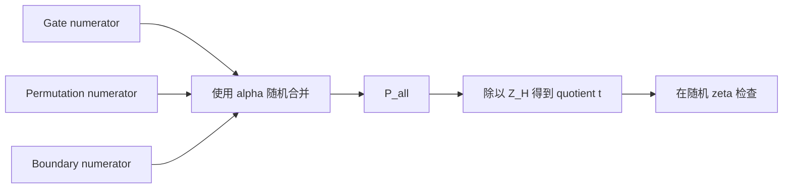

# 08. Combined Quotient 与随机点检查：把所有约束压到一个域外点

> **模块**：M8  
> **建议时间**：10–12 小时  
> **前置**：[07. Grand Product 累加器](07-Grand-Product累加器.md)  
> **本章产出**：构造 combined numerator、quotient chunks 与随机点 scalar identity，并建立完整 degree 账本。

## 1. 现在有三类约束

前几章得到：

1. Gate constraints；
2. Permutation recurrence；
3. Grand-product boundary。

它们都应该在 $H$ 上为 0。目标是将它们随机合并成一个 numerator：



## 2. 三个 Numerators

Gate numerator 沿用 M5：

$$
\begin{aligned}
G(X)={}&Q_LA+Q_RB+Q_MAB+Q_OC+Q_C+PI.
\end{aligned}
$$

为简洁起见，右侧所有 polynomial 都在同一个 $X$ 上求值。

Permutation recurrence numerator：

$$
P_{\mathrm{perm}}(X)
=Z(\omega X)D(X)-Z(X)N(X).
$$

Boundary numerator：

$$
P_{\mathrm{bdry}}(X)
=L_0(X)(Z(X)-1).
$$

合法 witness 要求三者分别在 $H$ 上为 0。

## 3. 为什么用随机 $\alpha$ 合并

在 witness commitments 和 $Z$ commitment 固定后，由 transcript 采样 $\alpha$：

$$
P_{\mathrm{all}}(X)
=G(X)+\alpha P_{\mathrm{perm}}(X)
+\alpha^2P_{\mathrm{bdry}}(X).
$$

若简单确定性相加，攻击者可能让一类约束的错误与另一类约束的错误抵消。随机 $\alpha$ 使 prover 在 commitments 固定时无法预先控制这种 cancellation，除非遇到关于 $\alpha$ 的低概率 polynomial root。

随机合并不是说只需让总和为 0 就“逻辑上等价”于三者分别为 0；它提供的是概率 soundness。

## 4. Quotient Polynomial

若 $P_{\mathrm{all}}$ 在 $H$ 上为 0，则：

$$
Z_H(X)\mid P_{\mathrm{all}}(X).
$$

定义：

$$
t(X)=\frac{P_{\mathrm{all}}(X)}{Z_H(X)}.
$$

于是全局 polynomial identity 为：

$$
P_{\mathrm{all}}(X)=Z_H(X)t(X).
$$

这不是 rational-function 近似。对合法 witness，余数必须严格为零，$t$ 必须是 polynomial。

## 5. 精确 Degree 账本

在本课程的 **无盲化三列 toy model** 中，所有基础列 degree 至多 $n-1$：

| 对象 | Degree 上界 | 原因 |
|---|---:|---|
| $G$ | $3n-3$ | 最高项 $Q_MAB$ |
| $N,D$ | $3n-3$ | 三个 degree $n-1$ 因子相乘 |
| $Z(\omega X)D,ZN$ | $4n-4$ | 再乘 degree $n-1$ 的 $Z$ |
| $P_{\mathrm{perm}}$ | $4n-4$ | 两项相减不增 degree |
| $L_0(Z-1)$ | $2n-2$ | 两个 degree 至多 $n-1$ 的多项式 |
| $P_{\mathrm{all}}$ | $4n-4$ | 取最大值 |
| $t=P_{\mathrm{all}}/Z_H$ | $3n-4$ | 整除后减去 $n$ |

“至多”不保证最高 coefficient 非零；但 domain/SRS 分配必须按最坏情况。

原始 PLONK、带 blinding rows 的版本、custom gates、lookup 或不同 boundary 约定会改变这个表。进入具体实现时必须重新推导。

## 6. 为什么要拆 Quotient Chunks

若 PCS/VK 希望每个 committed polynomial degree 小于 $n$，但 $t$ 的 degree 可到 $3n-4$，可按 $X^n$ 分块：

$$
t(X)=t_0(X)+X^nt_1(X)+X^{2n}t_2(X),
$$

其中：

$$
\deg t_j<n.
$$

Coefficient 切分非常直接：

```text
t0 = coefficients t[0 .. n-1]
t1 = coefficients t[n .. 2n-1]
t2 = coefficients t[2n .. 3n-1]
```

在一点 $\zeta$ 处重组：

$$
t(\zeta)
=t_0(\zeta)+\zeta^nt_1(\zeta)+\zeta^{2n}t_2(\zeta).
$$

常见 bug 是错写为 $t_0+\zeta t_1+\zeta^2t_2$。

## 7. 在 Coset 上高效构造

不能在 $H$ 上逐点做：

$$
t(h)=\frac{P_{\mathrm{all}}(h)}{Z_H(h)},
$$

因为 $Z_H(h)=0$。

选择与 $H$ 分离、规模足够容纳 numerator degree 的扩展 coset $gH_m$：

1. 对 witness/fixed polynomials 做 coset FFT；
2. 在 $gH_m$ 上逐点构造 $G,N,D,P_{\mathrm{all}}$；
3. 逐点除以非零的 $Z_H(x)$；
4. coset IFFT 得到 $t$ coefficients；
5. 拆 chunks。

要求：

$$
Z_H(x)\ne0\quad\forall x\in gH_m.
$$

并且 $m$ 大于 numerator 的 degree，避免 evaluation aliasing。

### 7.1 小域实验的限制

$\mathbb F_{17}$ 很适合演示 $n=4$ 的插值和 copy labels，但乘法群只有 16 个非零元素。对于接近 $4n$ 的 quotient 扩展域，未必还能找到满足所有条件的 disjoint coset。

因此本章可：

- 在 $\mathbb F_{17}$ 用 coefficient long division 验证正确性；
- 在更大的 FFT-friendly field 做 coset quotient 实验。

不要为了让 demo 跑通而跳过 coset separation 检查。

## 8. 随机点 $\zeta$ 检查

Prover 先提交 quotient chunk commitments，再由 transcript 采样 $\zeta$。Verifier 检查：

$$
\begin{aligned}
P_{\mathrm{all}}(\zeta)
\stackrel?={}&Z_H(\zeta)\bigl(
t_0(\zeta)
+\zeta^nt_1(\zeta)
+\zeta^{2n}t_2(\zeta)
\bigr).
\end{aligned}
$$

若两边代表不同的、degree 有界的 polynomials，它们在随机 $\zeta$ 上相等的概率由差 polynomial 的 degree 与 field size 控制。这是 Schwartz–Zippel/根数界在协议中的位置。

通常还要确保或按规范处理 $Z_H(\zeta)=0$ 等退化点。

## 9. Scalar Identity 还不够

假设 prover 直接声称：

$$
A(\zeta)=a,
\quad
t_0(\zeta)=u_0,
\quad\ldots
$$

若没有 polynomial commitment opening，它可以临时选择这些 scalars，让等式成立，而不对应此前固定的 polynomials。

完整安全链是：

1. Commitments 先绑定 polynomials；
2. Transcript 再采样随机点；
3. Scalar PLONK identity 检查这些 claimed evaluations 之间的关系；
4. PCS opening 检查 claimed evaluations 确实来自 committed polynomials。

M9–M10 将补上第 4 步。

## 10. Prover/Verifier 骨架

```text
prover:
    alpha = transcript.challenge()
    P_all = G + alpha * P_perm + alpha^2 * P_boundary
    t = exact_divide(P_all, ZH)       # oracle/reference path
    t0, t1, t2 = split_chunks(t, n)
    commit(t0, t1, t2)
    zeta = transcript.challenge()
    emit required evaluations

verifier_oracle:
    recombine t(zeta)
    evaluate P_all(zeta) from oracle polynomials
    assert P_all(zeta) == ZH(zeta) * t(zeta)
```

Coset implementation应与 `exact_divide` reference path 对拍。

## 11. Mutation Matrix

| Mutation | 最早应失败处 |
|---|---|
| $r\ne x+3$ | gate component / quotient remainder |
| $a_0\ne a_1$ | permutation component / quotient remainder |
| public $y$ 被替换 | gate/public-input component |
| $Z(1)\ne1$ | boundary component |
| 调换 $t_1,t_2$ | random-point scalar identity |
| 用 $\zeta^j$ 重组 chunks | scalar identity |
| 在 $H$ 上做 quotient division | construction 显式拒绝除零 |
| quotient domain 太小 | 与 coefficient reference 对拍失败 |
| 在 $t_j$ commitments 前采样 $\zeta$ | transcript-order audit 失败 |

## 12. 必做实验

1. 分别检查 $G,P_{perm},P_{bdry}$ 在 $H$ 上为 0；
2. 合法 witness 的 $P_{all}$ 可被 $Z_H$ 精确整除；
3. 三类 constraint 各自 mutation 后 remainder 非零；
4. coefficient quotient 与 coset quotient 对拍；
5. quotient chunks coefficient round-trip；
6. 对随机 $\zeta$，chunk 重组值等于直接 $t(\zeta)$；
7. 错用 $\zeta,\zeta^2$ 时测试失败；
8. domain 太小的 aliasing 用例被捕获；
9. 重复随机点测试错误 identity，观察小域碰撞；
10. 记录每个 polynomial 的实际 degree 与上界。

## 13. 自测

1. $\alpha$ 防止哪类 cancellation？
2. 为什么 $P_{all}/Z_H$ 必须是 polynomial？
3. 从 degree 账本推导为何需要三个 chunks。
4. 为什么 chunk 权重是 $\zeta^{jn}$？
5. Coset 必须满足哪两个条件？
6. 为什么 $\mathbb F_{17}$ 不适合完整 quotient coset demo？
7. 随机点检查依赖什么 degree 假设？
8. Scalar identity 为什么不能替代 PCS opening？

## 14. 通过标准

- 能独立写出三个 numerators 与 $P_{all}$；
- degree 账本每行都可推导；
- coefficient/coset 两条 quotient 路径对拍；
- chunks 可正确拆分、重组；
- 所有 gate/copy/public/boundary mutations 都失败；
- 能清楚区分“随机点等式”与“evaluation 确实来自 commitment”。

---

上一篇：[07. Grand Product 累加器](07-Grand-Product累加器.md) · 下一篇：[09. 椭圆曲线、Pairing 与 KZG](09-椭圆曲线Pairing与KZG.md) · [课程目录](README.md)
