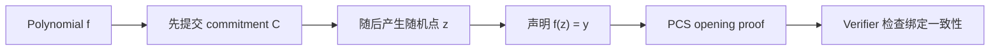

# 09. 椭圆曲线、Pairing 与 KZG：让多项式先承诺、后求值

> **模块**：M9  
> **建议时间**：14–18 小时  
> **前置**：[01. 有限域与子群](01-有限域与子群.md)、[02. 多项式、插值与消失多项式](02-多项式插值与消失多项式.md)、[08. Combined Quotient 与随机点检查](08-Quotient与随机点检查.md)  
> **本章产出**：从因式定理推导 KZG commit/open/verify，并实现符号版 PCS 接口与真实曲线库适配计划。

## 1. PCS 在 PLONK 中填补的缺口

M8 的 verifier 收到很多 claimed evaluations，例如：

$$
A(\zeta)=a,
\qquad
Z(\omega\zeta)=z_\omega,
\qquad
t_0(\zeta)=u_0.
$$

只检查这些 scalars 满足 PLONK identity 不够。Prover 可能临时编造数值，而不对应此前固定的 polynomials。

Polynomial Commitment Scheme（PCS）提供三件事：

1. `commit(f)`：先绑定一个 degree 有界的 polynomial；
2. `open(f,z)`：证明该 polynomial 在 $z$ 的值是 $y$；
3. `verify(C,z,y,proof)`：由 commitment 检查 evaluation claim。



PLONK 是算术化/多项式协议；KZG 是一种可替换的承诺后端。二者不是同一个算法。

## 2. 先分清三个 Field/Group

设 pairing-friendly curve 定义在 base field $\mathbb F_q$ 上。我们使用阶为素数 $r$ 的子群：

$$
\mathbb G_1,\mathbb G_2,\mathbb G_T,
\qquad |\mathbb G_i|=r.
$$

群的 scalars 属于：

$$
\mathbb F_r.
$$

通常 PLONK polynomial/witness arithmetic 也选在 $\mathbb F_r$ 上，以便 polynomial coefficients 直接作为 curve-group scalars。

| 名称 | 用途 |
|---|---|
| Curve base field $\mathbb F_q$ | 表示 curve point coordinates |
| Scalar field $\mathbb F_r$ | 表示 group scalars、PLONK witness 和 polynomial coefficients |
| $\mathbb G_1,\mathbb G_2$ | commitments、SRS 与 opening proof 所在群 |
| $\mathbb G_T$ | pairing 输出群 |

把 $q$ 与 $r$ 混用会造成序列化、FFT root、MSM scalar 和安全检查错误。

## 3. 群与椭圆曲线只需先掌握接口

本路线不要求从零实现 curve addition 或 Miller loop，但要理解这些接口：

```text
point_add(P, Q)
scalar_mul(s, P)
msm(scalars, points)
pairing(P_in_G1, Q_in_G2)
subgroup_check(P)
canonical_encode/decode(P)
```

使用加法记号：

$$
[a]_1=aG_1,
\qquad
[b]_2=bG_2.
$$

知道 $[a]_1$ 不应能高效恢复 $a$，这是离散对数困难性的直觉。

## 4. 双线性 Pairing

Pairing 是映射：

$$
e:\mathbb G_1\times\mathbb G_2\to\mathbb G_T,
$$

满足双线性：

$$
e([a]_1,[b]_2)=e(G_1,G_2)^{ab}.
$$

也可写成：

$$
e([a+a']_1,[b]_2)
=e([a]_1,[b]_2)e([a']_1,[b]_2).
$$

还需要 non-degeneracy 和可高效计算。KZG 利用 pairing 在“不知道 $\tau$”的情况下检查指数中的乘法关系。

## 5. Structured Reference String

设最大支持 degree 为 $D$，秘密为 $\tau\in\mathbb F_r$。SRS 至少包含：

$$
\left(
[1]_1,[\tau]_1,[\tau^2]_1,\ldots,[\tau^D]_1;
[1]_2,[\tau]_2
\right).
$$

$\tau$ 被称为 toxic waste：若有人知道它，KZG 的 binding/evaluation soundness 可能失效。

几个容易混淆的词：

- **Structured**：SRS 元素之间具有 powers-of-$\tau$ 结构；
- **Universal**：一个最大 degree 的 SRS 可被多个 circuits 使用；
- **Updatable**：ceremony 允许参与者继续贡献随机性；
- **Transparent**：不需要秘密设置。

KZG 是 structured setup 方案，不是 transparent PCS。Universal/updatable 是具体构造与 ceremony 提供的性质，不应从“KZG”一词自动推出。

## 6. Commitment

设：

$$
f(X)=\sum_{i=0}^{d}f_iX^i,
\qquad d\le D.
$$

定义：

$$
C_f=[f(\tau)]_1
=\sum_{i=0}^{d}f_i[\tau^i]_1.
$$

右侧是一次 MSM。Prover 不知道 $\tau$，但 SRS 已提供所需 group elements。

KZG commitment 具有加法同态：

$$
C_{f+g}=C_f+C_g,
$$

$$
C_{af}=aC_f.
$$

这个线性性质将在 M10 用于 linearization 和 batching。

## 7. 单点 Opening 的完整推导

Prover 声称：

$$
f(z)=y.
$$

由因式定理，$f(X)-y$ 被 $X-z$ 整除：

$$
q(X)=\frac{f(X)-y}{X-z}.
$$

Opening proof 是 quotient commitment：

$$
\pi=[q(\tau)]_1.
$$

Verifier 检查：

$$
e(C_f-y[1]_1,[1]_2)
\stackrel?=
e(\pi,[\tau]_2-z[1]_2).
$$

### 7.1 为什么等式成立

左侧指数代表：

$$
f(\tau)-y.
$$

右侧指数代表：

$$
q(\tau)(\tau-z).
$$

而 polynomial identity：

$$
f(X)-y=q(X)(X-z)
$$

在 $X=\tau$ 处正好说明两者相等。

Verifier 从未知道 $\tau$；pairing 让它用 SRS group elements 检查指数关系。

## 8. 一个符号例子

设：

$$
f(X)=3+2X+X^2,
\qquad z=4.
$$

则：

$$
y=f(4)=27,
$$

$$
f(X)-27=X^2+2X-24=(X-4)(X+6),
$$

所以：

$$
q(X)=X+6.
$$

Commitment 与 proof 的“隐藏指数”分别是：

$$
f(\tau)=3+2\tau+\tau^2,
\qquad
q(\tau)=\tau+6.
$$

验证等式退化为：

$$
f(\tau)-27=(\tau+6)(\tau-4).
$$

真实实现中所有整数都按 scalar field 取模。

## 9. 同一点的随机批量 Opening

若需要验证：

$$
F_i(z)=y_i,
\qquad i=0,\ldots,m-1,
$$

在全部 commitments 与 claimed evaluations 固定后采样 $v$：

$$
F(X)=\sum_{i=0}^{m-1}v^iF_i(X),
$$

$$
y=\sum_{i=0}^{m-1}v^iy_i,
$$

$$
C_F=\sum_{i=0}^{m-1}v^iC_{F_i}.
$$

只需证明：

$$
F(z)=y.
$$

如果 $v$ 在 claims 固定前已知，攻击者可能安排多个错误 evaluation 彼此抵消。

这只解决 **同一点** batching。$z$ 与 $\omega z$ 的 opening 分母不同，不能直接假装它们都使用 $X-z$。

## 10. Binding 与 Hiding 不同

基础 KZG commitment 是 deterministic：相同 $f$ 得到相同 $C_f$。它主要提供 binding，并不自动 hiding。

PLONK 的 zero knowledge 依赖协议级 polynomial blinding，例如：

$$
A(X)=A_0(X)+Z_H(X)r_A(X).
$$

也存在带独立 hiding generator/randomness 的 PCS 变体。必须按所选协议说明 hiding 来自哪里，不能笼统说“KZG 自带零知识”。

## 11. Degree Bound 是安全边界

SRS 只支持到 $D$：

$$
\deg f\le D.
$$

实现应在 commit API 或上层类型中显式携带 degree policy。若输入 polynomial 超界：

- 不能静默截断 coefficients；
- 不能读取不存在的 SRS powers；
- 不能只看当前最高非零项而忽略协议承诺的 degree bound 语义。

PLONK 的 witness、grand product、quotient chunks、linearization 都必须落入 SRS 支持范围。

## 12. 真实实现必须验证的输入

Verifier 解析 proof/VK/SRS 时至少检查：

- point encoding canonical；
- point 在 curve 上；
- point 在目标 prime-order subgroup；
- identity point 是否按协议允许；
- scalar encoding canonical 且小于 $r$；
- 字节长度正确、无 trailing bytes；
- SRS/VK 与 curve、domain、degree 参数一致。

成熟 curve library 可能自动完成其中一部分，但 PCS 适配层必须知道究竟保证了什么。

## 13. 两阶段实验

### 13.1 Symbolic Exponent Mock

把 $[a]_1$ 临时表示成 scalar $a$，把 pairing equality 化成指数 equality，用来测试公式和 API：

```text
commit(f, tau) = evaluate(f, tau)
open(f, z, tau) = evaluate((f - f(z)) / (X-z), tau)
verify(C, z, y, pi, tau):
    return C - y == pi * (tau - z)
```

这个 mock 公开了 $\tau$，没有离散对数安全，也不能模拟 adversarial binding。它只能是 algebraic unit test。

### 13.2 真实 Curve Library

使用成熟库提供：

- scalar field；
- $G_1/G_2$ points；
- MSM；
- pairing/multi-pairing；
- canonical decoding 与 subgroup checks。

自己实现 PCS glue code，不自己实现 curve/pairing 密码学。

## 14. 必做测试

1. 随机低次 $f,z$ 的 KZG opening 通过；
2. 修改 $y$、$z$、$C_f$、$\pi$ 分别失败；
3. constant polynomial 与 zero polynomial；
4. $z=0$、$z$ 在/不在 $H$；
5. quotient $(f-y)/(X-z)$ 余数为 0；
6. commitment 线性同态测试；
7. same-point batching 与逐个 opening 对拍；
8. 超 degree polynomial 被拒绝；
9. 非 canonical scalar/point 被拒绝；
10. 非 subgroup point 被拒绝；
11. symbolic mock 与真实库只比较正确性，不比较“安全性”；
12. 修改 SRS/VK 标识后 transcript/参数绑定失败。

## 15. 自测

1. Curve base field 与 scalar field 各做什么？
2. Pairing 的双线性如何检查指数乘法关系？
3. 从因式定理推导 KZG pairing equation。
4. 为什么 prover 不知道 $\tau$ 仍能 commit？
5. Same-point batching 的 $v$ 必须晚于什么？
6. KZG 为什么不是 transparent？
7. 基础 KZG 为什么不自动 hiding？
8. SRS degree bound 为什么不能只当性能参数？

## 16. 通过标准

- 能不看资料推导 commit/open/verify；
- 能区分 $q,r$ 与三个 pairing groups；
- symbolic mock 的正负测试齐全；
- 真实库适配层有 point/scalar validation 清单；
- 能解释短 proof 的代价：structured SRS 与 pairing 假设；
- 能说明 binding 与 zero knowledge 分别来自哪里。

## 17. 原始资料

- [KZG 原始长版：Constant-Size Commitments to Polynomials and Their Applications](https://cacr.uwaterloo.ca/techreports/2010/cacr2010-10.pdf)
- [PLONK 原始论文](https://eprint.iacr.org/2019/953)

---

上一篇：[08. Combined Quotient 与随机点检查](08-Quotient与随机点检查.md) · 下一篇：[10. Linearization、批量 Opening 与 Transcript](10-Linearization批量Opening与Transcript.md) · [课程目录](README.md)
