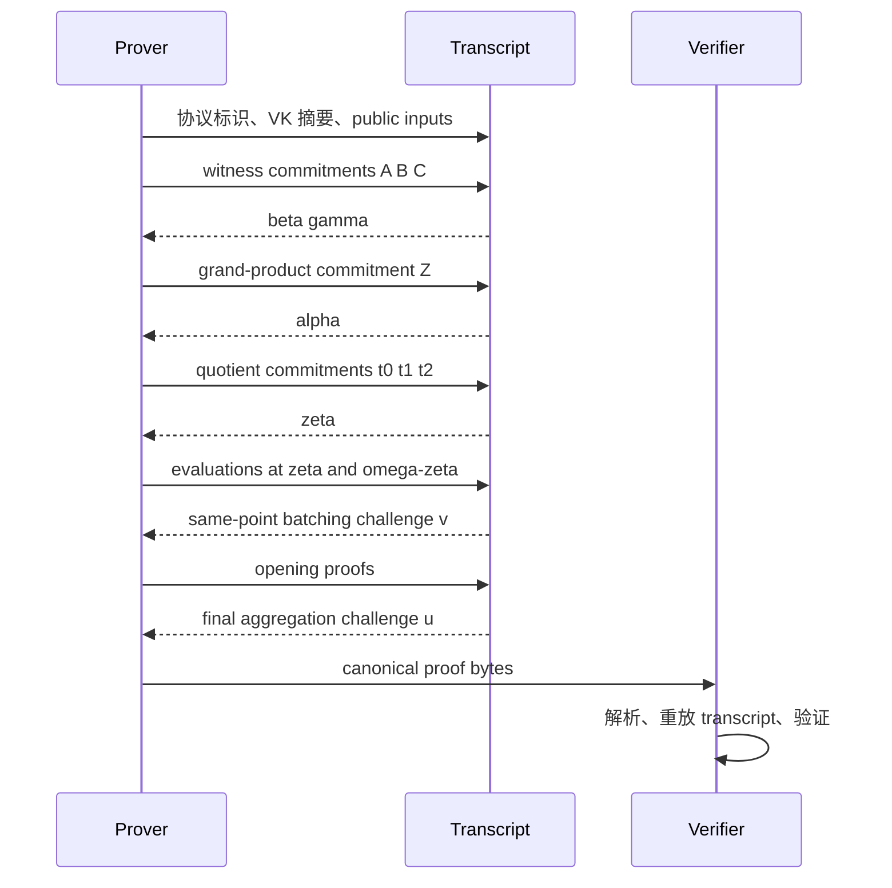

# 10. Linearization、批量 Opening 与 Transcript：拼出完整非交互协议

> **模块**：M10  
> **建议时间**：10–12 小时  
> **前置**：[08. Combined Quotient 与随机点检查](08-Quotient与随机点检查.md)、[09. 椭圆曲线、Pairing 与 KZG](09-椭圆曲线Pairing与KZG.md)  
> **本章产出**：为本课程 toy PLONK 写出 linearization 骨架、opening 批量策略与逐字节一致的 Fiat–Shamir transcript。

## 1. 为什么还有很多 Openings

在随机点 $\zeta$ 检查 PLONK identity，通常需要：

$$
a=A(\zeta),\quad b=B(\zeta),\quad c=C(\zeta),
$$

$$
s_1=S_{\sigma,1}(\zeta),
\quad
s_2=S_{\sigma,2}(\zeta),
$$

$$
z_\omega=Z(\omega\zeta),
$$

以及 quotient chunks、可能的 $Z(\zeta)$、selectors 或其他 fixed polynomial evaluations。

逐个做 KZG opening 会增加 proof 和 pairing 成本。PLONK 利用三层压缩：

1. Linearization；
2. Same-point polynomial batching；
3. Multi-point opening aggregation。

三者合并的对象和安全挑战不同，不能互换概念。

## 2. Linearization 的核心思想

在 $\zeta$ 处，$a,b,c,s_1,s_2,z_\omega$ 都已成为 claimed scalars。把它们代入原先的 nonlinear identity 后，许多表达式会对剩余 committed polynomials 变成线性。

抽象地写：

$$
R(X)=\sum_i\lambda_iF_i(X)+r_0,
$$

其中 $\lambda_i$ 由 challenges 和 claimed evaluations 计算。KZG 的 commitment 线性同态允许 verifier 直接构造：

$$
[R]=\sum_i\lambda_i[F_i]+r_0[1].
$$

Verifier 不需要 prover 再单独提交 $R$ commitment。

## 3. 本课程 Toy Protocol 的 Linearization

先定义：

$$
N_\zeta
=(a+\beta\zeta+\gamma)
(b+\beta k_1\zeta+\gamma)
(c+\beta k_2\zeta+\gamma).
$$

回忆本课程方向约定：

$$
P_{perm}(X)=Z(\omega X)D(X)-Z(X)N(X).
$$

固定 $a,b,c,s_1,s_2,z_\omega$ 后，可构造如下示意 linearization polynomial：

$$
\begin{aligned}
R(X)={}&aQ_L(X)+bQ_R(X)+abQ_M(X)+cQ_O(X)+Q_C(X)\\
&+\alpha z_\omega
(a+\beta s_1+\gamma)
(b+\beta s_2+\gamma)
(c+\beta S_{\sigma,3}(X)+\gamma)\\
&-\alpha N_\zeta Z(X)\\
&+\alpha^2L_0(\zeta)(Z(X)-1)\\
&-Z_H(\zeta)\left(
t_0(X)+\zeta^nt_1(X)+\zeta^{2n}t_2(X)
\right).
\end{aligned}
$$

在 $X=\zeta$ 处，完整 scalar identity 可写为：

$$
R(\zeta)+PI(\zeta)=0.
$$

这个公式服务于本课程的 recurrence 方向和 degree 模型。原始论文或某个库可能：

- 交换 $N,D$ 方向；
- 使用不同的 sigma 列作为“未求值的线性项”；
- 把 boundary、public input 或 quotient 项移到另一侧；
- 加入 blinding/末行/lookup/custom-gate 项。

所以应按目标协议重新推导，不能只复制公式外形。

## 4. Verifier 如何构造 $[R]$

Verifier 已有：

- VK 中的 $[Q_L],\ldots,[Q_C],[S_{\sigma,3}]$；
- proof 中的 $[Z],[t_0],[t_1],[t_2]$；
- transcript challenges；
- claimed evaluations。

它计算与上一节相同的 scalar coefficients，再用 group linear combination 得到：

$$
[R]
=a[Q_L]+b[Q_R]+ab[Q_M]+\cdots.
$$

常数 $-\alpha^2L_0(\zeta)$ 对应生成元倍点。整个过程不需要知道任何 polynomial coefficients。

Linearization 的作用是减少需要分别 opening 的 committed polynomials；它不替代：

- scalar PLONK identity；
- evaluation batching；
- KZG pairing check。

## 5. Same-Point Batching

设在 $\zeta$ 要打开：

$$
R(\zeta),A(\zeta),B(\zeta),C(\zeta),
S_{\sigma,1}(\zeta),S_{\sigma,2}(\zeta),\ldots
$$

在 commitments 与所有 claimed evaluations 都吸收后采样 $v$，构造：

$$
F_\zeta(X)=R(X)+vA(X)+v^2B(X)+v^3C(X)+\cdots,
$$

以及：

$$
y_\zeta=R(\zeta)+va+v^2b+v^3c+\cdots.
$$

然后只证明：

$$
F_\zeta(\zeta)=y_\zeta.
$$

列表顺序必须由协议固定。Prover 与 verifier 若一个按 `[R,A,B,C]`、另一个按 `[A,B,C,R]`，就会派生不同 batched commitment/value。

## 6. 不同点的 Opening 不能直接相加

$Z(\omega\zeta)=z_\omega$ 的 witness quotient 使用：

$$
X-\omega\zeta.
$$

而 $F_\zeta(\zeta)=y_\zeta$ 使用：

$$
X-\zeta.
$$

它们对应不同 KZG verifier factors：

$$
[\tau]_2-\zeta[1]_2
$$

与：

$$
[\tau]_2-\omega\zeta[1]_2.
$$

因此不能只把 commitments 相加，再统一当作在 $\zeta$ opening。

可选策略包括：

- 保留两个 KZG opening proofs，再用随机挑战合并 pairing equations；
- 使用所选 PCS/协议规定的 multi-point opening 技术。

具体算法必须跟随目标 PLONK/PCS 规范。本章只要求清楚区分“同点合并 polynomial”和“异点合并 opening equations”。

## 7. Fiat–Shamir Transcript

交互协议中 verifier 每轮发送随机 challenges。Fiat–Shamir 把已发生的 transcript 哈希成 challenges，使 proof 非交互。

一条适合本课程 toy protocol 的依赖骨架是：



该图是依赖骨架，不承诺所有 PLONK 变体具有相同字段、challenge 名称或 proof layout。

## 8. 每个 Challenge 防什么

| Challenge | 必须晚于 | 主要职责 |
|---|---|---|
| $\beta,\gamma$ | $A,B,C$ commitments | 随机压缩 value-label permutation |
| $\alpha$ | $Z$ commitment | 随机合并约束 families |
| $\zeta$ | quotient commitments | 随机检查 polynomial identity |
| $v$ | claimed evaluations | 随机合并同点 openings |
| $u$ | 被聚合的 opening proofs/claims，依协议定义 | 聚合不同 opening equations |

“晚于”意味着对应字节已 canonical absorb，而不只是 prover 内存中已经计算。

## 9. Transcript 必须绑定的上下文

至少吸收：

- protocol name 与 version；
- curve、field、PCS、SRS 参数标识；
- domain size、root/circuit 参数的 canonical 表达；
- verification key 或其 canonical digest；
- public-input 数量、顺序与 values；
- 每轮 commitments；
- claimed evaluations 及其标签；
- opening proofs；
- 清晰的 domain-separation labels。

如果 public $y$ 未进入 transcript，同一 proof 可能在错误 statement context 中被重放或导致 prover/verifier challenge 语义不一致。

## 10. Canonical Serialization

“哈希同一个数学对象”必须落实为“哈希完全相同的 bytes”。协议要固定：

- integer/scalar endian；
- scalar 是否定长；
- point compressed encoding；
- infinity 的编码与允许规则；
- list length 与顺序；
- enum/version tags；
- 是否允许 non-canonical field representatives；
- 是否拒绝 trailing bytes。

不要吸收调试字符串，例如 `format(point)`；库升级可能改变输出。

推荐接口：

```text
transcript.absorb_label("plonk/witness-commitment/A")
transcript.absorb_point(A_commitment)
beta = transcript.challenge_scalar("plonk/permutation/beta")
```

Label 自身也必须使用无歧义长度编码或固定常量。

## 11. Verifier 的三道检查

Verifier 不能只做 pairing。至少分三层：

### 11.1 结构与编码

Canonical parse、范围、curve/subgroup、长度、无 trailing bytes。

### 11.2 Scalar PLONK Identity

重建 $PI(\zeta),Z_H(\zeta),L_0(\zeta),N_\zeta$ 和 quotient chunk 重组，检查：

$$
R(\zeta)+PI(\zeta)=0.
$$

### 11.3 PCS Opening

检查 $R,A,B,C,S_{\sigma,j},Z,t_j$ 等 claimed evaluations 确实来自相应 commitments。

Scalar identity 防“这些数彼此不满足 PLONK”；PCS 防“这些数不是 committed polynomials 的值”。两者缺一不可。

## 12. 实现顺序

```text
1. 定义 Proof 数据结构，但先不用 bytes
2. 写 prover transcript trace
3. 写 verifier transcript replay
4. 对每个 absorb/challenge 记录 label 与 digest
5. 实现 toy linearization coefficients
6. 构造 R commitment
7. 实现 same-point batching
8. 接入两个独立 point openings
9. 最后实现 canonical codec
10. 删除/禁用生产路径中的 debug trace
```

开发期可让双方输出：

```text
step 07: absorb quotient.t1 = <32/48 bytes>
step 08: challenge zeta = <canonical scalar>
```

首次分叉位置通常就是顺序或编码 bug 所在。

## 13. 必做负面测试

1. 从 transcript 删除 public $y$；
2. 交换 $a,b$ evaluations 的顺序；
3. 在 quotient commitments 前采样 $\zeta$；
4. 修改 protocol version/domain label；
5. 修改 VK digest；
6. 改变 public-input 长度但保持拼接 bytes 相似；
7. parser 接受 trailing byte；
8. point 使用不同 encoding；
9. 修改 $z_\omega$；
10. same-point batching 列表少一项；
11. 错把 $\omega\zeta$ opening 当成 $\zeta$ opening；
12. 修改 opening proof 后 final aggregation 必须失败。

## 14. 自测

1. Linearization 压缩的是什么？
2. 为什么 verifier 可自行构造 $[R]$？
3. 本章公式为何对 $S_{\sigma,3}(X)$ 仍是线性的？
4. Same-point batching 与 multi-point aggregation 有何区别？
5. $\zeta$ 为什么必须晚于 quotient commitments？
6. Claimed evaluations 为什么必须早于 $v$？
7. Transcript 为何要绑定 VK 和 public-input 长度？
8. Scalar identity 与 PCS check 分别排除什么攻击？

## 15. 通过标准

- 能从 M8 identity 重组出一个线性 $R(X)$；
- verifier 仅用 commitments/scalars 构造 $[R]$；
- 同点与异点 batching 实现/接口分离；
- prover/verifier transcript trace 逐字节一致；
- 所有顺序、编码和上下文 mutation 均被拒绝；
- 对 proof 每个字段都能回答“必须早于/晚于哪个 challenge”。

## 16. 原始资料

- [PLONK 原始论文](https://eprint.iacr.org/2019/953)
- [KZG 原始长版](https://cacr.uwaterloo.ca/techreports/2010/cacr2010-10.pdf)

---

上一篇：[09. 椭圆曲线、Pairing 与 KZG](09-椭圆曲线Pairing与KZG.md) · 下一篇：[11. 零知识、Soundness 与安全边界](11-零知识Soundness与安全边界.md) · [课程目录](README.md)
