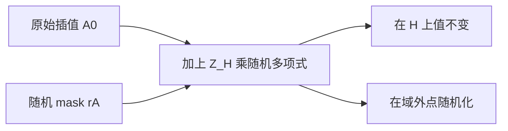
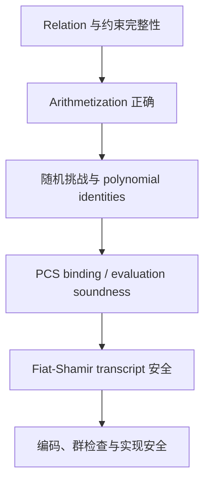

# 11. 零知识、Soundness 与安全边界：每一种保证究竟由谁负责

> **模块**：M11  
> **建议时间**：8–10 小时  
> **前置**：[10. Linearization、批量 Opening 与 Transcript](10-Linearization批量Opening与Transcript.md)  
> **本章产出**：完成 zero-knowledge mask 的 degree 分析、soundness ledger，以及协议/实现安全审计清单。

## 1. 四个词不能混用

### 1.1 Completeness

诚实 prover 对真实 statement 和合法 witness 能让 verifier 接受。

### 1.2 Soundness

错误 statement 被接受的概率很低。对计算受限攻击者的系统通常称 computational soundness。

### 1.3 Knowledge Soundness

不仅 statement 难以伪造，还存在某种 extractor，能从成功 prover 中提取 witness。它需要精确的安全模型和 theorem，不能由“所有约束都检查了”自动推出。

### 1.4 Zero Knowledge

Proof 除 statement 为真之外，不泄露 witness 信息；正式定义通常要求存在 simulator，使模拟 proof 与真实 proof 的分布不可区分或统计接近。

一个系统可以 sound 但泄露 witness，也可以隐藏数据但证明了错误/不完整的 relation。

## 2. 为什么直接插值会泄露

若：

$$
A_0(\omega^i)=a_i,
$$

且 commitment/openings 每次都由同一个 deterministic $A_0$ 产生，域外 evaluations 和 commitments 可能形成可关联信息；低熵 witness 还可能被猜测测试。

基础 KZG 是 deterministic binding commitment，不自动 hiding。Zero knowledge 必须由协议额外加入随机性。

## 3. Vanishing-Polynomial Mask

取随机低次 polynomial $r_A(X)$：

$$
A(X)=A_0(X)+Z_H(X)r_A(X).
$$

因为对任意 $h\in H$：

$$
Z_H(h)=0,
$$

所以：

$$
A(h)=A_0(h).
$$

也就是说，mask 保留所有电路行上的 witness values，却改变域外行为：

$$
A(\zeta)=A_0(\zeta)+Z_H(\zeta)r_A(\zeta).
$$

若 $\zeta\notin H$，后项通常非零且含随机性。

## 4. Mask 不是随便加的

若：

$$
\deg A_0<n,
\qquad
\deg r_A\le d,
$$

则：

$$
\deg A\le n+d.
$$

这会继续抬高：

- $Q_MAB$；
- permutation factors $N,D$；
- combined numerator；
- quotient degree/chunk 数；
- KZG SRS degree requirement。

因此必须先定目标协议的 mask degree，再从头重做 degree ledger。不能在 M8 的 unblinded degree 表上“最后随手加随机项”。

此外，$B,C,Z$、quotient 或 opening witness 是否需要以及如何 blinding，取决于精确协议与 simulator 证明。

## 5. Blinding Rows 是另一种工程布局

一些 PLONKish 实现预留若干 rows：

- 业务 selectors 在这些行关闭；
- witness cells 填随机值；
- permutation recurrence 在末行有特定启用/关闭规则；
- rotations 不能跨越不允许的 region 边界。

这与直接使用 $Z_Hr(X)$ mask 在思想上相关，但具体 polynomial distribution、degree 和 boundary 不一定相同。

原则是：

> 选定一个有完整规范与安全分析的 blinding 方案，严格实现；不要拼接多个方案的局部做法。

## 6. Soundness 是多层组合

任一层失效，上层结论都可能失去意义。

### 6.1 Relation/Constraint 层

回答“被证明的命题是否就是业务想要的命题”。防 underconstraint、漏 public binding、field/integer 语义错配。

### 6.2 PIOP 层

随机 $\beta,\gamma,\alpha,\zeta,v$ 分别压缩不同作弊空间。每个随机挑战只能承担其定理规定的职责。

### 6.3 PCS 层

确保 evaluations 来自先前 commitments 和 degree 有界 polynomials。

### 6.4 Fiat–Shamir 层

确保 challenges 与完整上下文绑定，且 prover 不能先看挑战再更换此前 messages。

### 6.5 实现层

Canonical parsing、subgroup checks、无 panic/未定义行为、可信参数选择与侧信道边界。

## 7. 安全职责表

| 风险 | 主要防线 | 缺失时的后果 |
|---|---|---|
| 某行 gate 错误 | $Z_H$ divisibility + 随机点检查 | 局部错误可能通过 |
| 同一 wire 填不同值 | permutation compression + grand product | wiring 失效 |
| 约束 families 相互抵消 | commitment 后的随机 $\alpha$ | 组合 identity 可被适配 |
| 看见 $\zeta$ 后再选 quotient | quotient commitments 在前 | 随机点检查失去意义 |
| 捏造 evaluation scalars | PCS openings | scalar identity 可临时拼出 |
| proof 可关联/泄露 witness | 协议级 polynomial blinding | sound 但不 zero-knowledge |
| SRS toxic waste 泄露 | ceremony/更新治理及正确假设 | KZG binding 可能失效 |
| 跨协议/跨 VK 重放 | domain separation + VK/public binding | 错上下文接受 |
| 非 subgroup point | canonical parser + subgroup check | pairing/群安全假设失效 |
| 非 canonical scalar | 严格 field decoding | transcript malleability/多编码 |

## 8. 建立 Soundness Ledger

不要直接写“约 128-bit 安全”。先逐项记录：

| 事件 | 需要记录的量 |
|---|---|
| Polynomial identity 在随机 $\zeta$ 碰撞 | 差 polynomial degree、challenge space |
| Permutation fingerprint 碰撞 | 压缩 polynomial degree、$\beta,\gamma$ 采样方式 |
| Constraint batching 抵消 | 关于 $\alpha$ 的 degree |
| Opening batching 抵消 | 关于 $v,u$ 的 degree |
| PCS 伪造 | 所选 KZG theorem、curve/group 假设、degree bound |
| Fiat–Shamir | hash/challenge mapping、random-oracle 模型、round order |
| 多个错误事件组合 | union bound 或目标论文的组合 theorem |

如果各统计失败事件上界为 $\varepsilon_i$，一个保守组合是：

$$
\Pr[\text{accept false statement}]
\le
\sum_i\varepsilon_i
+\operatorname{Adv}_{PCS}
+\operatorname{Adv}_{FS/curve}.
$$

这只是 ledger 形式；具体项必须由目标协议定理填写。

Field 大约 255 bit 不代表整体 soundness 自动是 255 bit，更不代表 curve 安全级别也是 255 bit。

## 9. Challenge Sampling 的边界

实现需要固定：

- hash-to-field 方法；
- 是否使用 rejection sampling；
- 禁止/退化 challenge 集如何处理；
- retry 是否重新吸收 counter/domain label；
- prover/verifier 是否完全一致。

静默做 `% r` 可能引入偏差；遇到 $\zeta\in H$ 或 denominator 为零后随意“再哈希一次”会创建未分析协议。

最安全的工程做法是采用目标规范与成熟库的 challenge mapping，并为所有特殊路径写 test vectors。

## 10. SRS 与 Verification Key 信任

KZG SRS 安全不仅是数学问题，还包括：

- ceremony transcript 是否可验证；
- 至少一位贡献者是否诚实销毁秘密；
- SRS 是否匹配 curve 与最大 degree；
- circuit-specific VK 是否由正确 fixed polynomials 导出；
- VK digest 是否进入 Fiat–Shamir transcript；
- 更新/下载参数的来源与完整性。

恶意 VK 可直接描述错误 selectors 或 sigma。Proof verifier 正确验证恶意 VK，并不等于验证了用户预期的 circuit。

## 11. 实现安全不在代数定理之外消失

生产实现还要处理：

- variable-time MSM/field operations 是否接触 secrets；
- 随机数发生器质量与 nonce 重用；
- 内存中的 witness 与 blinding randomness 清理；
- malformed proof 导致的 panic、内存/CPU DoS；
- 并发下 transcript/state 混用；
- proof size 与 batch size 上限；
- dependency/curve library 的安全维护。

这些问题不能由 Schwartz–Zippel 或 pairing equation 自动解决。

## 12. Zero-Knowledge 实验

### 12.1 保持 Domain Values

随机生成 $r_A$，验证：

$$
A(h)=A_0(h)\quad\forall h\in H.
$$

### 12.2 改变域外行为

对同一 witness 重复生成多个 mask，检查 commitments 和 $A(\zeta)$ 通常不同。

这只是 sanity check，不是零知识证明；“看起来不同”不等于满足 simulator definition。

### 12.3 Degree 审计

记录实际 degree，并验证所有 masked polynomials、constraint numerators、quotient chunks 都未超过目标 SRS/协议预算。

### 12.4 负面检查

固定/重用 mask randomness，展示 proof 可关联；删除某一 polynomial 的必要 mask，比较 transcript distributions，并回到目标论文确认正式要求。

## 13. 综合负面测试

1. 同一 witness 两次 proof 使用独立 randomness；
2. mask 后 $H$ 上 witness values 不变；
3. mask 后 degree 未超界；
4. 删除 public-input transcript binding；
5. 提前产生每个 challenge；
6. 修改 VK digest；
7. 非 subgroup point；
8. non-canonical scalar；
9. trailing bytes；
10. denominator 为零路径；
11. $\zeta\in H$ 的退化路径；
12. 超大声明长度/批量大小被限流；
13. 同一个 transcript object 被错误复用；
14. symbolic KZG mock 被明确禁止用于 production feature flag。

## 14. 教学实现的明确边界

本课程 toy protocol 用于理解与验证公式，不应部署到生产。它没有自动获得：

- 经过同行评审的完整安全证明；
- 正确的生产 blinding-row layout；
- ceremony/SRS 治理；
- constant-time 与 side-channel 审计；
- parser fuzzing 和跨实现 test vectors；
- 目标曲线、hash-to-field、batch verification 的完整规范符合性。

真正部署应采用审计过、维护中的库和明确版本的协议规范。

## 15. 自测

1. Completeness、soundness、knowledge soundness、zero knowledge 分别是什么？
2. 为什么 $Z_Hr_A$ 不改变 witness rows？
3. Mask 为什么会改变 quotient degree？
4. 基础 KZG commitment 为什么不自动 hiding？
5. Random challenge 各自只负责哪类作弊空间？
6. 为什么大 field 不等于同 bit 数的整体 soundness？
7. 恶意 VK 为什么可能证明错误 circuit？
8. 哪些实现问题不在代数安全定理覆盖范围内？

## 16. 通过标准

- 能证明 mask 的 domain-preservation；
- 能重新计算 mask 后 degree ledger；
- 每个 challenge 都有明确职责与顺序；
- soundness ledger 分开记录统计项、PCS、FS 与 curve 假设；
- transcript/parser/SRS/VK 均有负面测试；
- 文档明确标注 toy protocol 非生产用途。

## 17. 原始资料

- [PLONK 原始论文](https://eprint.iacr.org/2019/953)
- [KZG 原始长版](https://cacr.uwaterloo.ca/techreports/2010/cacr2010-10.pdf)

---

上一篇：[10. Linearization、批量 Opening 与 Transcript](10-Linearization批量Opening与Transcript.md) · 下一篇：[12. 教学版 PLONK 集成](12-教学版PLONK集成.md) · [课程目录](README.md)
