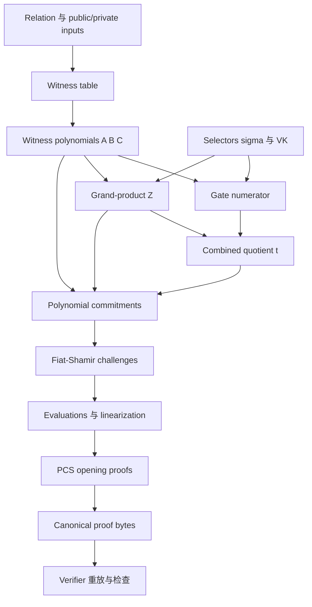

# 12. 教学版 PLONK 集成：把每个公式拼成可测试的 Prover/Verifier

> **模块**：M12  
> **建议时间**：18–22 小时  
> **前置**：[11. 零知识、Soundness 与安全边界](11-零知识Soundness与安全边界.md)  
> **本章产出**：一条从 relation 到 proof verification 的教学流水线、模块接口、差分 oracle 和系统级负面测试集。

## 1. 集成目标与非目标

目标是把 M1–M11 连接成一个能够：

- 生成贯穿例子的合法 witness；
- 构造 gate/permutation/quotient polynomials；
- 重放 Fiat–Shamir transcript；
- 用 Oracle PCS 和 KZG PCS 两种后端验证；
- 对每一种 mutation 在预期层拒绝；
- 输出可复现的中间 trace。

非目标是自研生产 zk-SNARK。教学实现不承担 curve、ceremony、side-channel、审计和正式安全证明。

## 2. 先固定两个 Protocol Profiles

为了避免把“公式正确”与“已经零知识”混在一起，建议明确区分：

### 2.1 `oracle-unblinded-v1`

- 使用本课程 M5–M10 的无盲化 toy formulas；
- OraclePCS 暴露完整 polynomial；
- 目标是验证 arithmetization、degree 和 transcript 顺序；
- 明确不是 succinct、binding 或 zero-knowledge。

### 2.2 `zk-kzg-v1`

- 只有在选定一份精确 blinding/round/proof-layout 规范后才启用；
- 使用真实 KZG library 与真实 SRS；
- 所有 mask degree、quotient chunks 和 openings 必须重新推导；
- 即使功能完成，仍标注为 teaching/experimental。

Profile ID 必须进入 transcript。不能让 verifier 用 v1 公式解析另一种 proof layout。

## 3. 推荐项目结构

```text
plonk-study/
├── field/
│   ├── scalar_field
│   └── batch_inverse
├── polynomial/
│   ├── coefficient_form
│   ├── evaluation_form
│   ├── interpolation
│   ├── fft
│   └── coset_fft
├── circuit/
│   ├── relation
│   ├── witness_builder
│   ├── layout
│   ├── selectors
│   └── copy_groups
├── arithmetization/
│   ├── gate
│   ├── permutation
│   ├── grand_product
│   └── quotient
├── pcs/
│   ├── interface
│   ├── oracle_pcs
│   └── kzg_adapter
├── protocol/
│   ├── manifest
│   ├── transcript
│   ├── linearization
│   ├── prover
│   ├── verifier
│   └── codec
├── oracle/
│   ├── direct_table_verifier
│   └── full_polynomial_verifier
├── tests/
│   ├── unit
│   ├── differential
│   ├── mutations
│   └── fixtures
└── README.md
```

分层的价值不是目录美观，而是让每一层都能单独对拍和替换。

## 4. 核心数据模型

### 4.1 Domain

```text
Domain:
    size n
    generator omega
    elements [1, omega, ..., omega^(n-1)]
    vanishing polynomial ZH
    quotient extension domain/coset
```

构造时验证 $\omega$ 的精确阶、domain size、coset separation。

### 4.2 Polynomial

不要用同一个裸数组同时表示 coefficient 和 evaluation：

```text
CoeffPoly(coefficients)
EvalPoly(domain_id, values)
```

所有转换显式调用 `fft/ifft/coset_fft`，避免把 evaluation-wise multiplication 误当 coefficient-wise multiplication。

### 4.3 Circuit/VK

```text
CircuitDescription:
    selector evaluations
    copy groups
    public-input layout

VerificationKey:
    protocol profile id
    domain metadata
    fixed polynomial commitments
    sigma commitments
    PCS/SRS identifier
    canonical digest
```

### 4.4 Proof

Proof 应按 rounds 组织，而不是一个无标签 scalars 数组：

```text
Proof:
    witness_commitments
    grand_product_commitment
    quotient_commitments
    claimed_evaluations
    opening_proofs
```

Challenge 不必序列化；verifier 应从 transcript 重算。

## 5. 总体数据流



注意实际协议是多轮交错，不是先构造完全部 commitments 再一次性取 challenges；图只展示对象依赖。

## 6. Setup/Preprocessing

对固定 circuit：

```text
preprocess(circuit, domain, pcs_params):
    1. validate layout and public-input positions
    2. build selector evaluation columns
    3. interpolate selector polynomials
    4. build unique identity labels
    5. construct sigma cycles and verify bijection
    6. interpolate sigma polynomials
    7. commit fixed polynomials if PCS profile needs it
    8. build proving key and verification key
    9. compute canonical VK digest
```

Preprocessing 必须同时运行 fixed-data validator：

- 所有 selector 长度为 $n$；
- labels 共 $3n$ 个且互异；
- sigma 是双射；
- public-input rows 数量/顺序固定；
- fixed polynomial degrees 在 SRS 上界内。

## 7. Prover：逐轮算法

以下是 toy protocol 的依赖顺序，具体 blinding 由 profile 决定：

```text
prove(profile, PK, public_y, private_x, randomness):
    1. 生成 witness table，并用 direct verifier 自检
    2. 插值得到 A, B, C；按 profile 做合法 blinding
    3. commit A, B, C
    4. transcript 吸收 profile、VK digest、public_y、A/B/C commitments
    5. derive beta, gamma
    6. 构造 grand-product Z，检查起点和 wrap-around；commit Z
    7. transcript 吸收 Z；derive alpha
    8. 构造 G、P_perm、P_boundary、P_all
    9. 在 disjoint coset 构造 t，并与 coefficient oracle 对拍
   10. 按 degree ledger 拆 t chunks；commit chunks
   11. transcript 吸收 chunks；derive zeta
   12. 计算协议要求的 zeta/omega-zeta evaluations
   13. transcript 吸收带标签的 claimed evaluations；derive v
   14. 构造 linearization/batched opening polynomials
   15. 生成 PCS opening proof(s)，吸收后 derive u（若 profile 使用）
   16. canonical serialize proof
```

开发模式下每一步运行 assertions；发布型教学 demo 可关闭昂贵 oracle 对拍，但测试套件必须保留。

## 8. Verifier：逐轮算法

```text
verify(profile, VK, public_y, proof_bytes):
    1. canonical parse；验证长度、scalars、curve/subgroup、无 trailing bytes
    2. 检查 profile/VK/domain/PCS 参数一致
    3. 初始化 transcript，吸收 profile、VK digest、public_y
    4. 吸收 A/B/C commitments；derive beta, gamma
    5. 吸收 Z commitment；derive alpha
    6. 吸收 quotient commitments；derive zeta
    7. 拒绝/按规范处理退化 challenge
    8. 吸收 evaluations；derive v
    9. 重建 PI(zeta)、ZH(zeta)、L0(zeta)、N_zeta
   10. 重组 quotient chunks
   11. 重建 linearization commitment 与 scalar identity
   12. 重建 same-point batched commitments/values
   13. 吸收 opening proofs；derive u（若使用）
   14. 验证全部 PCS opening equation(s)
   15. 仅当所有检查成功时接受
```

Verifier 不接收 prover 传来的 challenges、$Z_H(\zeta)$ 或 linearization coefficients；这些值必须自行重建。

## 9. PCS 抽象接口

```text
PolynomialCommitmentScheme:
    commit(poly, degree_bound) -> Commitment
    open(poly, point, transcript_context) -> EvaluationProof
    verify(commitment, point, value, proof, transcript_context) -> bool
    combine_commitments(weighted_commitments) -> Commitment
```

### 9.1 OraclePCS

OraclePCS 可以在 commitment 中保存 polynomial ID，并让 verifier 从测试 registry 读取完整 coefficients。它用于验证上层 protocol logic，但不提供密码学 binding/succinctness。

### 9.2 KZGPCS

KZGPCS 只暴露 group commitments/openings，内部使用真实 curve library。上层 prover/verifier 不应依赖 $\tau$、SRS 数组布局或 pairing API 细节。

用同一组 protocol tests 跑两种后端；若只有 KZG 后端失败，问题大多位于 batching、commitment combination、curve encoding 或 SRS 参数。

## 10. 三个 Differential Oracles

### 10.1 Direct Table Oracle

逐行检查 gate、copy、public input。用于确认 relation/layout。

### 10.2 Full Polynomial Oracle

接收完整 polynomials，检查：

$$
G|_H=0,
$$

$$
P_{perm}|_H=0,
$$

$$
P_{bdry}|_H=0,
$$

$$
P_{all}=Z_Ht.
$$

用于确认 arithmetization/quotient。

### 10.3 PCS Verifier

只看 commitments、claims 和 proofs。用于确认承诺编译层。

若三者结论不同，按最早分叉层定位；不要直接在 pairing 代码里猜测 gate bug。

## 11. 系统级不变量

| 不变量 | 检查位置 |
|---|---|
| Domain generator 精确阶为 $n$ | setup |
| Quotient coset 与 $H$ 分离 | setup/prover |
| Selector/sigma 固定且绑定 VK | preprocessing/transcript |
| $A,B,C$ 早于 $\beta,\gamma$ | transcript |
| $Z$ 早于 $\alpha$ | transcript |
| Quotient chunks 早于 $\zeta$ | transcript |
| Claimed evaluations 早于 $v$ | transcript |
| 每个 polynomial 满足 degree bound | construct/commit |
| $Z(1)=1$ 且 recurrence 闭合 | grand product |
| Proof codec canonical、无剩余字节 | verifier |
| Scalar identity 和 PCS 均通过 | verifier |

## 12. Mutation Test Matrix

### 12.1 Relation/Gate

| Mutation | 预期最早失败层 |
|---|---|
| $r\ne x+3$ | direct gate / gate numerator |
| $s\ne x+5$ | direct gate / gate numerator |
| $y\ne rs$ | direct gate / gate numerator |
| public $y$ 修改 | public row / transcript/scalar identity |

### 12.2 Wiring/Permutation

| Mutation | 预期最早失败层 |
|---|---|
| $a_0\ne a_1$ | direct copy / grand-product closure |
| sigma target 重复 | preprocessing bijection check |
| $k_1H$ 与 $H$ 相交 | label uniqueness check |
| 删除 wrap-around recurrence | dedicated negative fixture 应展示漏洞 |

### 12.3 Quotient/Transcript

| Mutation | 预期最早失败层 |
|---|---|
| 调换 $t_1,t_2$ | scalar identity |
| 用 $\zeta^j$ 而非 $\zeta^{jn}$ | scalar identity |
| 提前采样 $\zeta$ | transcript trace audit |
| evaluations 调序 | transcript/batched opening |
| 更换 VK digest | transcript challenges / verification |

### 12.4 PCS/Codec

| Mutation | 预期最早失败层 |
|---|---|
| 修改 claimed evaluation | KZG opening |
| 修改 commitment | KZG opening |
| 非 subgroup point | parser/group validation |
| non-canonical scalar | parser |
| trailing bytes | codec |
| polynomial 超 SRS degree | commit policy |

## 13. 可复现 Trace

为每个阶段输出可选 trace：

```text
domain.digest
selector.digest
sigma.digest
witness.column.digest
challenge.beta
challenge.gamma
grand_product.first_last
challenge.alpha
quotient.actual_degree
quotient.chunk_digests
challenge.zeta
scalar_identity.left_right
opening.batch_digest
```

不要在默认日志打印 private witness、mask randomness、$\tau$ 或完整敏感 polynomials。测试 trace 与生产日志要分开设计。

## 14. 分阶段验收

### P0：Field/Polynomial

- field laws、inverse-zero、interpolation、FFT/IFFT、coset tests 全过。

### P1：Circuit

- direct verifier 与 mutation matrix 全过。

### P2：Arithmetization

- gate/permutation/boundary divisibility 与 degree ledger 全过。

### P3：Oracle PIOP

- transcript 随机点 identity 与完整 polynomial oracle 对拍。

### P4：Symbolic KZG

- 因式定理、same-point batching、两个 evaluation points 的公式对拍。

### P5：Real KZG Adapter

- 真实 group/parser/SRS 正负 tests 全过。

### P6：Specified Blinding Profile

- exact protocol 的 mask、degree、proof distribution tests 和文档完成。

### P7：Canonical Proof

- golden vectors、round-trip、拒绝 malleable/trailing encodings。

每一阶段通过后再进入下一阶段。这样 integration bug 能被限制在最近新增的一层。

## 15. 性能优化顺序

先正确、再 profile。常见优化顺序：

1. 朴素 evaluation → FFT；
2. 逐个 inverse → batch inversion；
3. 多个 scalar multiplication → MSM；
4. 多个 pairing equations → library multi-pairing；
5. 重复 fixed polynomial 计算 → preprocessing/cache；
6. 并行 FFT/MSM。

每次优化都必须与 reference path 做 differential tests；不能用性能实现替换掉唯一正确性 oracle。

## 16. 自测

1. 为什么要分 `oracle-unblinded` 与 `zk-kzg` profiles？
2. CoeffPoly 与 EvalPoly 为什么不应共用裸数组类型？
3. 哪些 fixed data 必须绑定 VK？
4. Prover 哪几轮必须 commit 后再取 challenge？
5. 三个 differential oracles 各定位哪一层 bug？
6. Verifier 哪些值必须自行重建，不能信任 proof？
7. 为什么 negative tests 要断言“最早失败层”？
8. 性能优化为何必须保留 reference path？

## 17. 通过标准

- Oracle profile 从 witness 到验证完整跑通；
- KZG adapter 通过同一套上层 protocol tests；
- prover/verifier transcript trace 完全一致；
- mutation matrix 全部在预期层失败；
- proof bytes canonical round-trip 且拒绝 trailing data；
- README 明确 protocol profile、degree 假设、SRS 与非生产边界。

---

上一篇：[11. 零知识、Soundness 与安全边界](11-零知识Soundness与安全边界.md) · 下一篇：[13. 原始论文映射与毕业项目](13-原始论文映射与毕业项目.md) · [课程目录](README.md)
