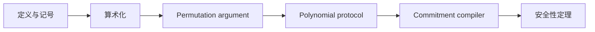

# 13. 原始论文映射与毕业项目：从“会跟公式”到“能独立审协议”

> **模块**：M13  
> **建议时间**：8–10 小时阅读映射，另加 2–4 周毕业项目  
> **前置**：[12. 教学版 PLONK 集成](12-教学版PLONK集成.md)  
> **本章产出**：论文双向符号表、协议差异报告、可复现毕业实现与白板答辩记录。

## 1. 为什么最后才精读原始论文

现在你已经亲手建立：

$$
\text{relation}
\to
\text{table}
\to
\text{polynomials}
\to
\text{permutation}
\to
\text{quotient}
\to
\text{PCS}
\to
\text{NIZK}.
$$

此时读论文，公式不再是一串孤立符号。你能问：

- 这项属于哪一层？
- 它约束哪个作弊自由度？
- 它何时被 commitment 绑定？
- Degree 为什么是这个值？
- 它与本课程 toy model 有何差异？

目标不是背论文，而是能把任意 PLONK 变体拆回这些职责。

## 2. 三遍读法

### 第一遍：只看结构

暂时跳过推导细节，只标记：

- relation/arithmetization；
- wiring permutation；
- polynomial protocol rounds；
- PCS compiler；
- zero-knowledge randomization；
- completeness/soundness theorem 的输入输出。

画出论文自己的依赖图：



第一遍结束时，只需能用一页纸说清论文结构。

### 第二遍：逐项核对公式

对每个等式回答：

1. Polynomial 在什么 domain 上定义？
2. Degree 上界是什么？
3. 等式要求在 $H$ 全部成立，还是只在随机点检查？
4. 哪些对象在 challenge 前已 commitment？
5. Recurrence 的 numerator/denominator 方向是什么？
6. Boundary 位于哪一行？
7. Quotient 如何拆 chunks？
8. 哪些 evaluations 被 linearize，哪些被 opening？

任何一步答不出，就回到对应 M5–M10 章节重新推导。

### 第三遍：只看安全证明

记录：

- interactive protocol 的安全模型；
- Fiat–Shamir 转换后使用的模型；
- PCS 的 binding/knowledge 假设；
- zero-knowledge simulator 用了哪些随机性；
- challenge failure events 如何组合；
- SRS 与 degree bound 如何进入 theorem；
- 哪些结论只对 honest setup/VK 成立。

第三遍不要用“应该差不多”补空白；无法确认就明确标为待验证。

## 3. 双向符号映射表

选定一个明确版本的论文 PDF，并填写页码/公式号。不要只写 section 名，因为修订版可能变化。

| 本课程对象 | 论文对象与位置 | 完全相同？ | 差异/备注 |
|---|---|---|---|
| $A,B,C$ | 学习者填写 | 是/否 | witness blinding、命名 |
| $Q_L,Q_R,Q_M,Q_O,Q_C$ | 学习者填写 | 是/否 | selector 约定 |
| $PI$ | 学习者填写 | 是/否 | public-input 行与符号方向 |
| $\operatorname{id}_j$ | 学习者填写 | 是/否 | coset constants |
| $S_{\sigma,j}$ | 学习者填写 | 是/否 | permutation 方向 |
| $\beta,\gamma$ | 学习者填写 | 是/否 | value-label 压缩 |
| $Z$ | 学习者填写 | 是/否 | recurrence 与边界 |
| $\alpha$ | 学习者填写 | 是/否 | constraint aggregation powers |
| $t,t_j$ | 学习者填写 | 是/否 | degree/chunk 数 |
| $\zeta$ | 学习者填写 | 是/否 | evaluation point 命名 |
| Linearization $R$ | 学习者填写 | 是/否 | 被保留的 sigma/evaluation 项 |
| Batching challenges | 学习者填写 | 是/否 | 同点/异点 aggregation |
| Opening proofs | 学习者填写 | 是/否 | proof layout 与 pairing equation |

必须支持双向查询：看到课程符号能找论文，看到论文符号也能说出协议职责。

## 4. Toy Model 与原协议差异审计

本课程公式刻意简化。至少核对以下差异：

| 主题 | 本课程 toy model | 阅读原协议时要查什么 |
|---|---|---|
| Domain | 四行贯穿例子 | 实际 domain、usable/blinding rows |
| Gate | 基础三列门 | public input、selector 和 custom terms |
| Permutation | 全 $H$ cyclic recurrence | 启用范围、末行、边界约定 |
| Blinding | M11 只讲原理 | 精确 mask 次数、degree、分布 |
| Quotient | unblinded degree $\le3n-4$ | 实际 degree bound 与 chunk 数 |
| Linearization | 本课程方向的示意 $R$ | 论文精确重组和 evaluations |
| PCS | 基础 KZG + batching 思路 | 论文/实现的 exact multi-opening |
| Transcript | 依赖骨架 | 每个 bytes 字段、label、challenge 顺序 |
| Security | 分层 ledger | 定理模型、假设、具体失败界 |

只有完成这张差异表，才算“从教学模型迁移到原协议”。

## 5. 公式核对的机械方法

对每个论文 identity 做四次检查：

### 5.1 Row Expansion

令 $X=\omega^i$，展开后是否恢复预期行约束？

### 5.2 Degree Expansion

逐项写 degree，不凭论文结论猜测 quotient chunks。

### 5.3 Challenge Freeze

在每个 challenge 产生点，列出此前已 commitment 的对象。尝试描述若提前公开会怎样作弊。

### 5.4 Mutation

为每一项删除/改符号，构造一个应被测试捕获的 fixture。

这种方法比反复阅读更容易发现 numerator/denominator、rotation、sign 和 chunk power 错误。

## 6. 毕业项目规格

实现关系：

$$
R(y;x)=1
\Longleftrightarrow
y=(x+3)(x+5).
$$

### 6.1 必交代码

- finite field 与 polynomial reference 实现；
- FFT/IFFT/coset FFT；
- circuit layout、selectors、copy groups；
- direct table verifier；
- gate/permutation/grand-product/quotient；
- Oracle PCS 完整协议；
- symbolic KZG tests；
- 真实 KZG library adapter；
- transcript 与 canonical codec；
- mutation/fuzz/golden tests。

### 6.2 必交文档

- protocol manifest；
- 完整 degree ledger；
- challenge dependency graph；
- 课程 ↔ 论文双向符号表；
- soundness/security-assumption ledger；
- SRS/VK/curve/codec 边界；
- toy/production 差异声明；
- benchmark 方法与结果。

### 6.3 必交 Test Vectors

至少包括：

- 一个合法 proof；
- gate、copy、public、boundary 各一个错误 proof；
- quotient chunk 顺序错误；
- transcript 顺序/上下文错误；
- evaluation、commitment、opening proof 各一个 mutation；
- non-canonical scalar/point；
- trailing bytes；
- degree 超界；
- denominator/退化 challenge 的规范路径。

## 7. Reproducibility Manifest

项目根目录记录：

```text
protocol profile/version
paper title/revision/hash
curve and scalar field
PCS and SRS identifier
domain size and root convention
coset convention
public-input layout
permutation direction
challenge transcript order
canonical encoding version
dependency versions
test-vector digest
```

别人应能在不询问作者的情况下重现同一 challenges、commitments 与 verifier 结论。

## 8. 白板答辩题

不看笔记完成以下题目：

1. 从 relation 画四行三列表；
2. 写出全部 selector rows；
3. 解释 public input 为什么需要专门绑定；
4. 写出四个 copy cycles；
5. 构造 identity labels 和三列 sigma；
6. 写出 $N(X),D(X)$；
7. 从 prefix product 推导 recurrence；
8. 证明 telescope 和边界作用；
9. 写出 $P_{all}$；
10. 从 degree 账本推导 quotient chunks；
11. 解释为何在 coset 上做 quotient；
12. 解释随机 $\zeta$ 检查为何仍需 PCS；
13. 从因式定理推导 KZG pairing equation；
14. 区分 linearization、同点 batching、异点 aggregation；
15. 按顺序写出全部 transcript challenges；
16. 证明 $Z_Hr$ mask 保持 $H$ 上 values；
17. 区分 soundness、knowledge soundness、zero knowledge；
18. 给出三个 toy 实现不能生产部署的理由。

## 9. 评分量表

| 维度 | 0 分 | 1 分 | 2 分 | 3 分 | 4 分 |
|---|---|---|---|---|---|
| Relation/约束 | 无法区分 witness/constraint | 能跑 honest case | 有负面测试 | 可审 underconstraint | 能迁移新关系 |
| 多项式/FFT | 只会调用库 | 会插值 | 能解释 vanishing/divisibility | 可推 degree/coset | 有完整 differential tests |
| Permutation | 背公式 | 会生成 sigma | 能解释 labels/cycles | 可推 grand product | 可审边界与退化事件 |
| Quotient | 只记 chunks | 会构造 | 能重组随机点 | 独立推 degree | 可迁移 custom constraints |
| KZG | 会调用 API | 会写公式 | 能推 pairing equation | 可实现 batching | 能审 SRS/encoding 假设 |
| Transcript | 无固定顺序 | prover 能生成 | verifier 能重放 | 有 mutation tests | 可审跨协议绑定 |
| Zero knowledge/安全 | 只说“隐藏” | 知道 mask | 能做 degree 审计 | 有 soundness ledger | 能对应正式 theorem |
| 工程质量 | 单文件 demo | 有模块 | 有 unit tests | 有 oracles/golden vectors | 可复现、可审计 |

建议毕业门槛：

- 每一维至少 2 分；
- Permutation、Quotient、KZG、Transcript 至少 3 分；
- 所有必交 mutation tests 通过；
- 能完整完成白板题，不依赖背诵某个实现 API。

## 10. 失败时如何回退

| 卡点 | 回退章节 |
|---|---|
| 看不懂 domain/roots | [01](01-有限域与子群.md)、[03](03-根单位FFT与Coset.md) |
| 不懂整除与随机点 | [02](02-多项式插值与消失多项式.md)、[08](08-Quotient与随机点检查.md) |
| 不懂 wiring | [04](04-关系算术电路与约束安全.md)、[06](06-Copy约束与置换论证.md) |
| Grand product 总是差一行 | [07](07-Grand-Product累加器.md) |
| Pairing equation 靠背 | [09](09-椭圆曲线Pairing与KZG.md) |
| Prover/verifier challenge 不同 | [10](10-Linearization批量Opening与Transcript.md) |
| 不会判断“是否零知识” | [11](11-零知识Soundness与安全边界.md) |
| 系统集成无法定位 | [12](12-教学版PLONK集成.md) |

## 11. 下一条学习分支

完成核心 PLONK 后，再选一个方向，不要同时展开全部：

### 11.1 Lookup Arguments

研究“证明 witness values 属于预先承诺表”，先读 Plookup，再比较不同 lookup grand-product/sorting 结构。

### 11.2 Custom Gates 与 PLONKish IR

研究 rotations、regions、selector compression、degree 与 layout 优化；始终保留 underconstraint audit。

### 11.3 替代 PCS

把 KZG 换成 IPA 或 FRI 系方案，比较：

- setup；
- proof size；
- verifier cost；
- batching/multi-opening；
- recursion 友好性。

你会发现 arithmetization 与大部分 polynomial identities 仍可保留，这正是先学 M0–M8 的价值。

### 11.4 Recursion/Aggregation

先掌握“在电路内验证 field/group/transcript 操作”的成本，再学习 cycles of curves、accumulation 或 folding。不要把 recursion 当作一个额外 API 调用。

## 12. 最终自检

你应能完整解释下面这句话中的每个箭头：

$$
\boxed{
\text{witness}
\to
\text{rows}
\to
\text{polynomials}
\to
\text{permutation}
\to
\text{quotient}
\to
\text{commitments}
\to
\text{random openings}
\to
\text{proof}
}
$$

并且对每个箭头回答：

- 输入/输出对象是什么？
- 正确性不变量是什么？
- 随机性在哪里进入？
- 哪个负面测试能击穿错误实现？
- 哪条安全假设支撑结论？

做到这一点，就已经从“了解 PLONK 名词”进入“能够独立阅读、实现和审计协议”的阶段。

## 13. 原始资料

- [PLONK：Permutations over Lagrange-bases for Oecumenical Noninteractive arguments of Knowledge](https://eprint.iacr.org/2019/953)
- [KZG：Constant-Size Commitments to Polynomials and Their Applications](https://cacr.uwaterloo.ca/techreports/2010/cacr2010-10.pdf)
- [Plookup：A simplified polynomial protocol for lookup tables](https://eprint.iacr.org/2020/315)

---

上一篇：[12. 教学版 PLONK 集成](12-教学版PLONK集成.md) · [课程目录](README.md) · [B 线完整学习计划](../B线-协议数学先行完整学习路线.md)
