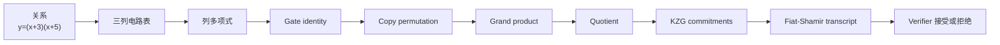
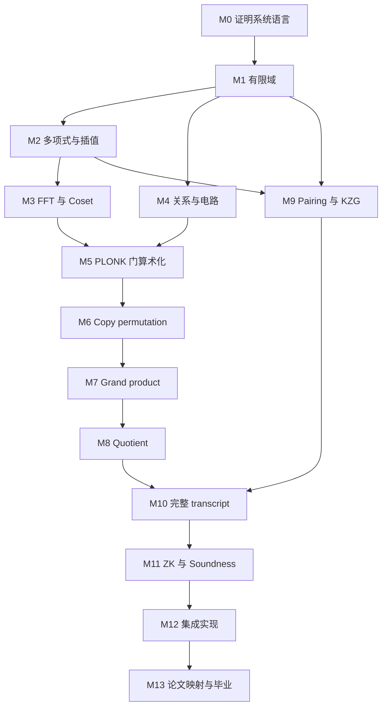

# PLONK B 线分章讲义：协议数学先行

> 这套讲义把 [B 线完整学习路线](../B线-协议数学先行完整学习路线.md) 展开为 14 个循序渐进的章节。目标不是背协议字段，而是从有限域开始，亲自推到 permutation、quotient、KZG、完整 transcript 与零知识边界。

## 1. 贯穿全书的问题

证明者知道私有 $x\in\mathbb F$，希望证明公开 $y$ 满足：

$$
y=(x+3)(x+5).
$$

全书始终使用同一例子：

$$
r=x+3,\qquad s=x+5,\qquad y=rs.
$$

它会依次经历：



所有等式默认在有限域中成立。若需要整数范围语义，必须另外加入 range constraints；本基准电路只研究 PLONK 核心协议。

## 2. 章节目录

| 模块 | 章节 | 核心问题 | 阶段产出 |
|---:|---|---|---|
| M0 | [00. 证明系统共同语言](00-证明系统共同语言.md) | statement、witness、soundness、ZK 分别是什么？ | 性质与分层地图 |
| M1 | [01. 有限域与子群](01-有限域与子群.md) | 为什么证明系统在有限域而不是普通整数上计算？ | 小素域运算库 |
| M2 | [02. 多项式、插值与消失多项式](02-多项式插值与消失多项式.md) | 一列表格为何等价于一个低次多项式？ | Polynomial 与插值模块 |
| M3 | [03. 根单位、FFT 与 Coset](03-根单位FFT与Coset.md) | 如何高效地在系数和点值表示之间转换？ | FFT/IFFT 对拍 |
| M4 | [04. 关系、算术电路与约束安全](04-关系算术电路与约束安全.md) | 如何避免“诚实 witness 能过、恶意 witness 也能过”？ | 直接表格 verifier |
| M5 | [05. PLONK 三列门与 Lagrange 算术化](05-PLONK三列门与Lagrange算术化.md) | 如何把所有门压成一个 divisibility claim？ | Gate polynomial |
| M6 | [06. Copy 约束与置换论证](06-Copy约束与置换论证.md) | 如何统一证明任意位置是同一逻辑 wire？ | Sigma permutation |
| M7 | [07. Grand Product 累加器](07-Grand-Product累加器.md) | 如何把全局大乘积变成逐行局部约束？ | Accumulator polynomial |
| M8 | [08. Quotient 与随机点检查](08-Quotient与随机点检查.md) | 如何把所有行和所有约束压成一个随机点恒等式？ | Quotient 与 chunks |
| M9 | [09. 椭圆曲线、Pairing 与 KZG](09-椭圆曲线Pairing与KZG.md) | 如何绑定多项式并证明某点取值？ | KZG adapter |
| M10 | [10. Linearization、批量 Opening 与 Transcript](10-Linearization批量Opening与Transcript.md) | 如何减少 openings，并保证 challenge 顺序安全？ | 完整 transcript 图 |
| M11 | [11. 零知识、Soundness 与安全边界](11-零知识Soundness与安全边界.md) | 哪些机制防作弊，哪些机制隐藏 witness？ | 安全账本 |
| M12 | [12. 教学版 PLONK 集成](12-教学版PLONK集成.md) | 如何把全部零件拼成可测试 prover/verifier？ | Capstone 实现 |
| M13 | [13. 原始论文映射与毕业项目](13-原始论文映射与毕业项目.md) | 如何从教学公式迁移到论文/实现规范？ | 论文映射与答辩 |

## 3. 依赖关系



不要跳过 M6–M8。只学 KZG 会知道怎样打开多项式，却不知道这些多项式为什么证明电路正确；只学 gate equations 又无法证明 wiring 和 commitment consistency。

## 4. 每章使用方法

每章固定包含：

1. **本章目标**：学完可观察的能力；
2. **直觉**：先解释问题为何存在；
3. **形式化推导**：给出对象、domain 与 degree；
4. **贯穿例子**：继续处理 $y=(x+3)(x+5)$；
5. **实现提示**：最小函数与不变量；
6. **反例与陷阱**：删除哪项检查会怎样作弊；
7. **练习与验收**：必须独立完成的题；
8. **章节导航**：连接前后依赖。

建议节奏：

$$
30\%\ \text{阅读}
+30\%\ \text{手推}
+30\%\ \text{编码/反例}
+10\%\ \text{复盘}.
$$

## 5. 四本学习账本

### 5.1 对象账本

记录每个对象：

| 字段 | 问题 |
|---|---|
| 类型 | field element、vector、polynomial 还是 group element？ |
| Domain | 定义在 $H$、coset、整个 $\mathbb F$ 还是曲线群？ |
| 可见性 | public、witness、prover auxiliary 还是 verifier challenge？ |
| 绑定时刻 | 在哪个 challenge 之前 commit？ |
| 大小/degree | 精确上界是多少？ |

### 5.2 Degree 账本

每出现一次多项式乘法、mask、rotation 或除法，都更新 degree。没有 degree 账本，不得决定 quotient domain、chunk 数或 SRS 大小。

### 5.3 Transcript 账本

逐轮记录：

```text
round:
absorbed messages:
derived challenge:
what was already bound:
which cheating space this challenge compresses:
```

### 5.4 安全账本

分开记录：

- 代数恒等式；
- 统计错误概率；
- PCS binding/knowledge 假设；
- Fiat–Shamir 的 random-oracle 模型；
- 零知识 blinding；
- SRS 与实现边界。

## 6. 统一记号

| 记号 | 含义 |
|---|---|
| $\mathbb F$ | 电路与多项式所在有限域 |
| $n$ | domain 大小；基准例子的四行布局取 $n=4$ |
| $H=\langle\omega\rangle$ | 大小为 $n$ 的乘法子群 |
| $Z_H=X^n-1$ | $H$ 的消失多项式 |
| $L_i$ | 第 $i$ 行的 Lagrange basis polynomial |
| $A,B,C$ | 三条 witness polynomials |
| $Q_L,Q_R,Q_M,Q_O,Q_C$ | fixed selector polynomials |
| $S_{\sigma,1},S_{\sigma,2},S_{\sigma,3}$ | wiring permutation polynomials |
| $Z$ | permutation grand-product polynomial |
| $t$ | combined quotient polynomial |
| $\beta,\gamma$ | permutation compression challenges |
| $\alpha$ | constraint-family batching challenge |
| $\zeta$ | 随机 evaluation point |
| $[f]$ | polynomial commitment |

## 7. 完成标准

整套讲义完成后，应能不看资料完成：

1. 从关系画出三列电路表；
2. 写 selectors、public-input constraint 与 copy cycles；
3. 推导 $G,N,D,Z,P_{\mathrm{all}},t$；
4. 给出教学模型的 degree 上界和 quotient chunks；
5. 推导 KZG opening equation；
6. 画完整 transcript dependency；
7. 分开解释 scalar identity 与 PCS consistency；
8. 指出零知识 mask 与 degree budget；
9. 运行完整负面测试矩阵；
10. 将自己的公式映射到一份固定版本的 PLONK 论文或实现。

## 8. 一手资料

- [KZG：Polynomial Commitments](https://cacr.uwaterloo.ca/techreports/2010/cacr2010-10.pdf)
- [PLONK 原始论文](https://eprint.iacr.org/2019/953)
- [Plookup](https://eprint.iacr.org/2020/315)，完成主线后选读
- [Halo 2 PLONKish Arithmetization](https://zcash.github.io/halo2/concepts/arithmetization.html)，完成主线后对照

---

开始学习：[第 00 章：证明系统共同语言](00-证明系统共同语言.md)
