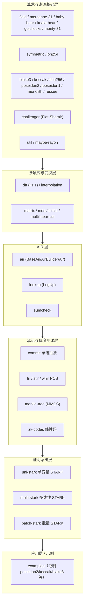
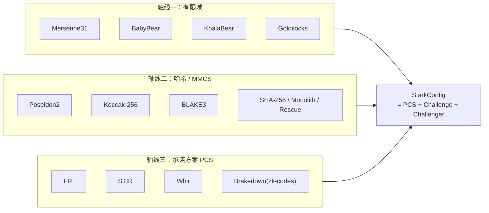

# 第二章 · 整体架构与 crate 地图

> 本章目标：把 Plonky3 仓库拆给你看——它是一个 Cargo workspace，由 ~30 个 `p3-*` crate 组成。读完你能画出一张"分层地图"，知道每个零件住哪、依赖谁、被谁依赖。

---

## 2.1 一句话总览

Plonky3 是一个 **Cargo workspace**：根 `Cargo.toml` 把几十个独立的 crate 组合在一起，每个 crate 前缀 `p3-`，对应**一个清晰的概念**。这种"每个概念一个 crate"的设计有两个直接好处：

1. **按需取用**：你只想用它的 `Mersenne31` 域实现？只依赖 `p3-mersenne-31` 即可，不必拖进整个证明系统。
2. **替换自由**：因为概念之间通过 **Rust trait** 解耦，你可以用 `p3-baby-bear` 换掉 `p3-mersenne-31`，或用 `p3-blake3` 换掉 `p3-poseidon2`，上层协议代码几乎不动。

---

## 2.2 分层视图

整个工具包可以粗略分成 **6 层**，自下而上是"地基 → 原语 → 协议 → 应用"：



- **第 1 层（地基）**：有限域算术、对称密码、哈希函数族、Fiat–Shamir challenger、工具/并行。这是所有上层的"原子"。
- **第 2 层（变换）**：把"数"组织成"多项式"所需的 FFT、插值、矩阵运算。
- **第 3 层（约束）**：AIR 抽象、sumcheck、lookup——把"计算正确性"翻译成"多项式恒等式"。
- **第 4 层（承诺）**：承诺多项式、证明它低次的核心机制（FRI/STIR/Whir + Merkle）。
- **第 5 层（证明系统）**：把上面全部拼装成一个完整的 STARK prover/verifier。
- **第 6 层（应用）**：示例与上层 zkVM 接入。

---

## 2.3 三条"可插拔轴线"

理解 Plonky3 的模块化，抓住三条**正交的、可自由组合的轴线**就够了。几乎所有的 crate 选择，都在这三条轴上做选型：



最终这三条轴的选择，被收敛进一个薄薄的配置壳：`StarkConfig<Pcs, Challenge, Challenger>`（见第七章）。换域、换哈希、换 PCS，本质就是换这三个类型参数。

---

## 2.4 crate 一览表（按层分组）

> 下表对应 `main` 分支。crate 名前的 `p3-` 前缀在源码里是 `p3_xxx`（下划线），文档里常写作 `p3-xxx`。

### 第 1 层 · 算术与密码基础

| crate | 作用 |
|---|---|
| `p3-field` | 域 trait 总纲：`Field`/`PrimeField`/`Algebra`/`ExtensionField`/`PackedField` 等 |
| `p3-mersenne-31` | Mersenne31 域（`2³¹−1`）+ circle FFT + 复扩域 |
| `p3-baby-bear` | BabyBear 域（`2³¹−2²⁷+1`），2-adicity=27 |
| `p3-koala-bear` | KoalaBear 域（`2³¹−2²⁴+1`），2-adicity=24 |
| `p3-goldilocks` | Goldilocks 域（`2⁶⁴−2³²+1`），2-adicity=32 |
| `p3-monty-31` | 31-bit 域的 Montgomery 表示后端 |
| `p3-symmetric` | 对称密码原语（海绵、截断置换等） |
| `p3-bn254` | BN254 椭圆曲线运算（用于把 STARK 证据再"包装"成 KZG/SNARK） |
| `p3-challenger` | Fiat–Shamir transcript 抽象（`FieldChallenger` 等 4 个 trait） |
| `p3-blake3` / `p3-keccak` / `p3-sha256` | 对应哈希函数 |
| `p3-poseidon1` / `p3-poseidon2` / `p3-monolith` / `p3-rescue` | STARK 友好的代数哈希函数 |
| `p3-util` / `p3-maybe-rayon` | 通用工具 / Rayon 并行抽象 |

### 第 2 层 · 多项式与变换

| crate | 作用 |
|---|---|
| `p3-dft` | FFT 全家桶：radix-2 DIT、并行版、Bowers、small-batch、naive |
| `p3-interpolation` | 重心插值（barycentric）等 |
| `p3-matrix` | 行主序矩阵等容器 |
| `p3-mds` | MDS 矩阵（哈希函数扩散层用） |
| `p3-circle` | circle 群运算（circle STARK 基础） |
| `p3-multilinear-util` | 多线性多项式工具 |

### 第 3 层 · AIR

| crate | 作用 |
|---|---|
| `p3-air` | `BaseAir`/`AirBuilder`/`Air`/`FilteredAirBuilder` |
| `p3-lookup` | LogUp 查找论证 + `LookupBus` |
| `p3-sumcheck` | sumcheck 协议（prover 驱动 + 数据 + verifier 校验） |

### 第 4 层 · 承诺与低度测试

| crate | 作用 |
|---|---|
| `p3-commit` | 承诺抽象：`Pcs`(单变量)/`MultilinearPcs`(多线性)/`Mmcs`(Merkle) |
| `p3-fri` | FRI 低度测试 + `TwoAdicFriPcs`（含 DEEP-FRI） |
| `p3-stir` | STIR PCS |
| `p3-whir` | Whir PCS（多线性，原生 ZK） |
| `p3-merkle-tree` | `MerkleTreeMmcs`（所有 FRI/STIR/Whir 的承诺后端） |
| `p3-zk-codes` | 线性时可编码码（Brakedown/Basefold 系） |

### 第 5 层 · 证明系统

| crate | 作用 |
|---|---|
| `p3-uni-stark` | 单变量 STARK prover/verifier（FRI 路线） |
| `p3-multi-stark` | 多线性 SuperSpartan 风格 STARK（Whir 友好） |
| `p3-batch-stark` | 多实例共享一次承诺 + 一次 FRI 打开 |

### 第 6 层 · 应用

| crate | 作用 |
|---|---|
| `examples` | 示例：`prove_prime_field_31` 等，证明大量哈希置换 |
| `*-air`（`keccak-air`/`blake3-air`/`poseidon2-air`/...） | 各哈希函数的 AIR 实现 |

---

## 2.5 一个典型组合长什么样

以 examples 里"证明大量 Poseidon2 置换"为例，它的类型组装大致是（来自 `examples/src/types.rs`，简化）：

```rust
pub(crate) type Poseidon2StarkConfig<F, EF, DFT, Perm16, Perm24> = StarkConfig<
    TwoAdicFriPcs<
        F, DFT,
        Poseidon2MerkleMmcs<F, Perm16, Perm24>,            // 承诺后端：Poseidon2 Merkle
        ExtensionMmcs<F, EF, Poseidon2MerkleMmcs<F, Perm16, Perm24>>,
    >,                                                     // 轴线二：哈希
    EF,                                                    // 扩域（Challenge）
    DuplexChallenger<F, Perm24, 24, 16>,                   // Challenger：Poseidon2 duplex
>;
```

读法：选 `F`（如 `BabyBear`）作基域 → 用 `TwoAdicFriPcs`（轴线三：FRI）→ 承诺后端用 `Poseidon2MerkleMmcs`（轴线二）→ Challenger 用 Poseidon2 duplex → 全部塞进 `StarkConfig`。**三条轴在类型层一望而知。**

---

## 2.6 如何运行一个示例

Plonky3 的示例需要开启 CPU 的 SIMD 指令集（否则性能会差一个数量级）：

```bash
RUSTFLAGS="-Ctarget-cpu=native" cargo run --example prove_prime_field_31 --release
```

- `RUSTFLAGS="-Ctarget-cpu=native"`：开启 AVX2 / AVX-512 / NEON（详见第九章）；
- `--release`：必须开优化，否则 debug 模式慢到不可用；
- `prove_prime_field_31`：用 Mersenne31 证明大量哈希置换。

---

## 2.7 阅读源码的建议顺序

1. `p3-field` → `p3-mersenne-31`：先建立"域"的直觉（第三章）。
2. `p3-dft` → `p3-interpolation`：把数变成多项式（第四章）。
3. `p3-air`：看懂 `Air::eval` 这一个方法（第五章）。
4. `p3-commit` → `p3-fri`：承诺与低度测试（第六章）。
5. `p3-uni-stark`：把它们串成完整证明（第七章）。

这套顺序，也正是本文档的章节顺序。下一章我们从地基——**有限域**——开始。
