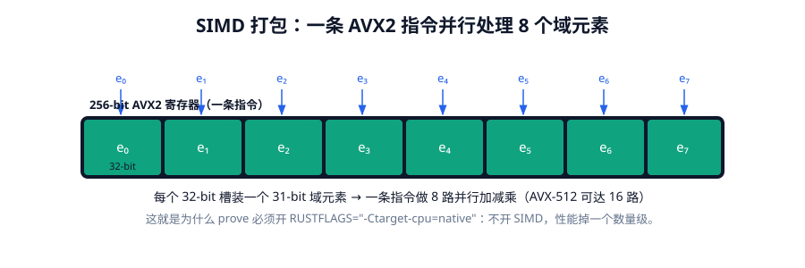
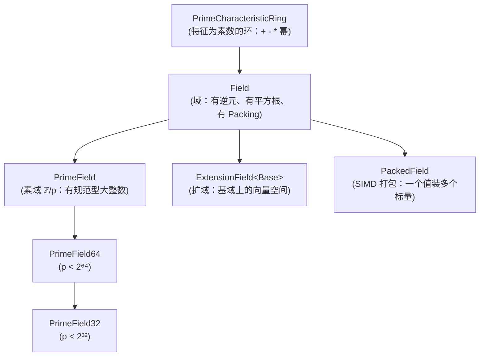
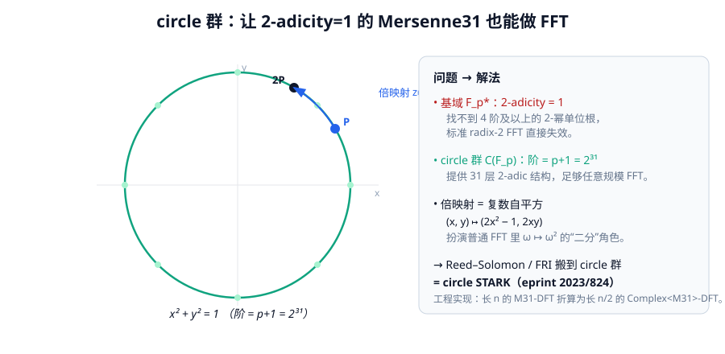
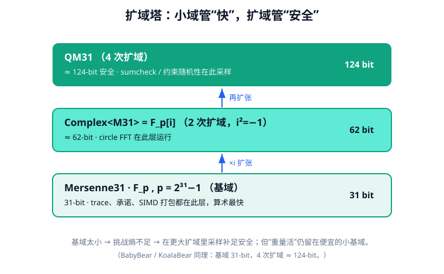
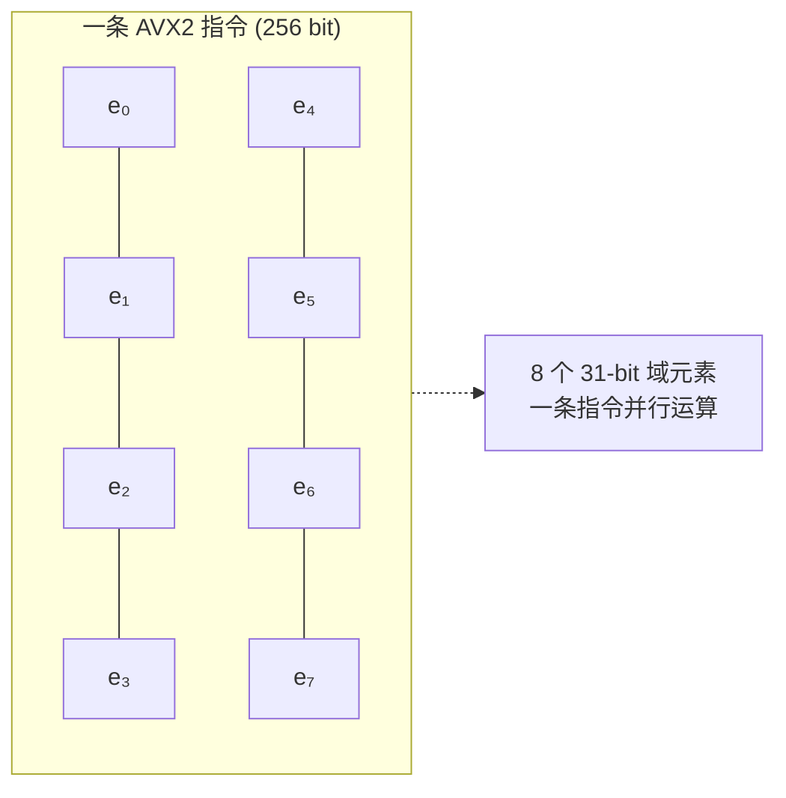

# 第三章 · 有限域：Plonky3 的地基

> 本章目标：讲清楚为什么 STARK 要用"小素数域"，Plonky3 提供了哪几个域、各自的关键参数（素数、2-adicity、扩域），以及 Mersenne31 为何要用 circle STARK 这一反直觉设计。



---

## 3.1 为什么用有限域

现实计算机里是 0/1 与补码整数；密码学证明里则是**有限域** $\mathbb{F}_p$（$p$ 为素数）：元素的加、减、乘、除（除零外）都在模 $p$ 下进行，且永远封闭、可逆。

把"计算"编码成有限域上的多项式方程后，"计算正确" ⟺ "某些多项式在域上恒为零"，这正是 STARK 能用代数手段验证计算的根本。

**为什么 STARK 偏爱"小"域？** 一个朴素但关键的原因：

- 证明器和验证器做的几乎全是**域算术**；
- 域元素越小（如 31-bit 而非 256-bit），单次加减乘越快、内存占用越低、SIMD 寄存器里能塞下的元素越多（一条 AVX2 指令同时处理多个 31-bit 元素）；
- 安全性不足的部分，用**扩域（extension field）**补齐（例如基域只有 31-bit，但用 4 次扩域达到 ~124-bit 安全）。

> 直觉：**小域管"快"，扩域管"安全"。** 这是 Plonky3 域设计的总纲。

---

## 3.2 域 trait 的层级

Plonky3 在 `p3-field` 里定义了一套层层递进的 trait（`field/src/field.rs`）。这里只看主干，建立"概念地图"：



简化后的核心签名（节选）：

```rust
/// 域：每个非零元素都有乘法逆。
pub trait Field:
    Algebra<Self> + RawDataSerializable + Packable + Copy
    + Div<Self, Output = Self> + Eq + Hash + Send + Sync + Display
    + Serialize + DeserializeOwned
{
    /// 该域乘法群的生成元。
    const GENERATOR: Self;
    type Packing: PackedField<Scalar = Self>;

    fn try_inverse(&self) -> Option<Self>;
    fn try_sqrt(&self) -> Option<Self> { /* 默认 Tonelli–Shanks */ }
    fn order() -> BigUint;
    fn bits() -> usize { Self::order().bits() as usize }
}

/// 同构于 ℤ/p 的素域。
pub trait PrimeField: Field + Ord + QuotientMap<...> {
    fn as_canonical_biguint(&self) -> BigUint;
}
/// p < 2⁶⁴，能用 u64 表示规范型。
pub trait PrimeField64: PrimeField {
    const ORDER_U64: u64;
    fn as_canonical_u64(&self) -> u64;
}
/// p < 2³²，能用 u32 表示规范型。
pub trait PrimeField32: PrimeField64 {
    const ORDER_U32: u32;
    fn as_canonical_u32(&self) -> u32;
}

/// 扩域：既是域，又是基域上的向量空间。
pub trait ExtensionField<Base: Field>:
    Field + Algebra<Base> + BasedVectorSpace<Base>
{
    type ExtensionPacking: PackedFieldExtension<Base, Self>;
    fn is_in_basefield(&self) -> bool;
    fn as_base(&self) -> Option<Base>;
}
```

要点：

- `Field` 是"会四则运算+开方+能序列化"的抽象；
- `PrimeField32/64` 给出"素数多大、规范型怎么用机器整数表示"——31-bit 域都实现 `PrimeField32`；
- `ExtensionField` 描述"扩域"——后面 LogUp、sumcheck、约束随机性都需要在更大的扩域里采样，以达到足够安全；
- `PackedField` 是 SIMD 的钥匙：一个"打包值"里装多个标量，一条指令并行处理（见 3.6）。

---

## 3.3 四个主角域（参数已据源码核对）

Plonky3 内置了四个主力域。下表每个数字都逐字核对自 `main` 分支源码常量：

| 域 | 素数 $p$ | 位宽 | 2-adicity | 扩域 | 源码常量 |
|---|---|---|---|---|---|
| **Mersenne31** | $2^{31}-1 = 2{,}147{,}483{,}647$ | 31 | **1**（乘法群）；**31**（circle 群） | 二次 `Complex<M31>=F_p[i]`，可到 `QM31`（4 次） | `const P: u32 = (1<<31)-1;` |
| **BabyBear** | $2^{31}-2^{27}+1 = 2{,}013{,}265{,}921$ | 31 | **27** | 4 次（`BinomiallyExtendable<4>`，≈124-bit） | `const PRIME: u32 = 0x78000001;` |
| **KoalaBear** | $2^{31}-2^{24}+1 = 2{,}130{,}706{,}433$ | 31 | **24** | 4 次（`BinomiallyExtendable<4>`） | `const PRIME: u32 = 0x7f000001;` |
| **Goldilocks** | $2^{64}-2^{32}+1 = 18{,}446{,}744{,}069{,}414{,}584{,}321$ | 64 | **32** | 2 次（≈128-bit） | `pub(crate) const P: u64 = 0xFFFF_FFFF_0000_0001;` |

> ⚠️ **常见误写订正**：网上常把 BabyBear 写成 $31\cdot 2^{27}+1$、KoalaBear 写成 $31\cdot 2^{26}+1$，**都不对**。源码确认：
> - BabyBear $=2^{31}-2^{27}+1=15\cdot2^{27}+1$（因为 $2^{31}-2^{27}=2^{27}(2^4-1)=15\cdot2^{27}$）；
> - KoalaBear $=2^{31}-2^{24}+1=127\cdot2^{24}+1$。

### 3.3.1 2-adicity 是什么、为什么关键

**2-adicity** = 域乘法群 $\mathbb{F}_p^*$（阶 $p-1$）里，能找到多大的 **2-幂子群**。也就是 $p-1$ 能被 $2^k$ 整除的最大的那个 $k$。

它之所以关键，是因为 **FFT/NTT 需要长度 $2^k$ 的"单位根子群"**（一组 $\omega, \omega^2, \dots, \omega^{2^k-1}$ 满足 $\omega^{2^k}=1$）来做蝶形变换。2-adicity 越大，能做的 FFT 越大。

- Goldilocks：$p-1=2^{32}\cdot(2^{32}-1)$，2-adicity=32 → 能做超大 FFT；
- BabyBear：$p-1=2^{27}\cdot(\dots)$，2-adicity=27 → 足够大；
- KoalaBear：2-adicity=24 → 也够用；
- **Mersenne31：$p-1=2\cdot(2^{30}-1)$，2-adicity 只有 1** → 标准 FFT 在基域**直接失效**！

Mersenne31 的 2-adicity=1 是个"麻烦"，但它算术极快（见下）。怎么两全？这就是 **circle STARK** 要解决的问题（3.4 节）。

### 3.3.2 为什么 BabyBear/KoalaBear 这么"精挑细选"

它们不是随便选的 31-bit 素数：

- **BabyBear**：源码注释称它是"31-bit 素数里 2-adicity 最高的（27）"——在 31-bit 约束下让 FFT 能做到尽可能大。
- **KoalaBear**：源码注释称它在"还要求立方映射 $x\mapsto x^3$ 是自同构"的前提下，2-adicity 最高。这个性质（$3\nmid(p-1)$）对某些算术优化有用。

### 3.3.3 Goldilocks 的妙处

$p=2^{64}-2^{32}+1$，它的 Montgomery 乘法能巧妙利用 64-bit 溢出做"免约化"快速乘，且 2-adicity=32 非常大。它是 Plonky2 时代的主力域，在 Plonky3 里仍保留，常用于对 64-bit 域友好的场景。

---

## 3.4 Mersenne31 与 circle STARK：绕过 2-adicity=1

这一节是本章最精彩也最反直觉的部分。

### 3.4.1 麻烦的根源

Mersenne31 的 $p=2^{31}-1$，于是 $p-1=2\,(2^{30}-1)$，而 $2^{30}-1$ 是奇数。所以 $\mathbb{F}_p^*$ 里 2-adicity **只有 1**——只能找到 2 阶单位根 $-1$，找不到 4 阶及以上的 2-幂单位根。标准 radix-2 FFT 需要长度 $2^k$ 的乘法子群，于是在 **M31 基域上彻底做不了**。

可是 M31 的模约化能写成 `x = (x >> 31) + (x & p)`（Mersenne 数的特殊性质），算术**极快**，放弃它太可惜。

### 3.4.2 circle 群救场

定义 M31 上的"单位圆"：

$$C(\mathbb{F}_p) = \{(x,y)\in\mathbb{F}_p^2 \mid x^2+y^2=1\}$$

因为 $p\equiv 3\pmod 4$，$-1$ **不是**二次剩余，$X^2+1$ 不可约，于是 $\mathbb{F}_p[i]=\mathbb{F}_p[X]/(X^2+1)$ 是 2 次扩域。把圆上的点 $(x,y)$ 双射到 $z=x+iy\in\mathbb{F}_p[i]$，则圆上的点在"复数乘法"下封闭。

**关键**：圆群 $C(\mathbb{F}_p)$ 的阶是 **$p+1=2^{31}$——一个 2 的纯幂！** 源码：

```rust
// mersenne-31/src/complex.rs
pub const CIRCLE_TWO_ADICITY: usize = 31;
```

于是 circle 群提供了 **31 层**的 2-adic 结构，足够支撑任意规模的"FFT"。



### 3.4.3 circle-FFT 的机制

普通 FFT 的"二分递归"靠 $\omega\mapsto\omega^2$；circle 群上的对应物是"**加倍映射**"（复数自平方 $z\mapsto z^2$ 的坐标写法）：

$$(x,y)\mapsto (2x^2-1,\;2xy)$$

Plonky3 把 Reed–Solomon 编码、FRI 等整套搬到 circle 群上，这就是 **circle STARK**（论文 *Reed–Solomon Codes over the Circle Group*，eprint 2023/824）。

### 3.4.4 Plonky3 的工程实现：半长复 DFT

`mersenne-31/src/dft.rs` 用一个聪明的折算，把"长度 $n$ 的 M31-DFT"转成"长度 $n/2$ 的 `Complex<M31>`-DFT"：

1. **预处理**：把 $n$ 个 M31 实值两两配成 $n/2$ 个 `Complex<M31>`（偶数行作实部、奇数行作虚部）；
2. **变换**：在 `Complex<M31>`（其乘法群阶 $p^2-1=(p-1)(p+1)$，2-adicity=32）上跑**标准** `TwoAdicSubgroupDft`；
3. **后处理**：利用"第 $(n-k)$ 个元素的共轭等于第 $k$ 个元素"等对称性，去除冗余、保证卷积定理成立。

对外暴露 `Mersenne31Dft`，底层用 `Mersenne31ComplexRadix2Dit`。于是 M31 既能享受 31-bit 极速算术，又能做 FFT——两全其美。

> 注意：circle FFT 的代码住在 **`mersenne-31` crate 内**（因为它依赖 M31 特有的 circle 群），而通用 FFT 算法住在 `p3-dft`（见第四章）。

---

## 3.5 扩域：小域管快，扩域管安全



基域太小（31-bit），在其中采样的随机挑战"熵"不够，证明安全性不足。解决办法是**在更大的扩域里采样**：

- **二项式扩域**：`BinomiallyExtendable<const D>` 提供形如 $\mathbb{F}_p[X]/(X^D-W)$ 的扩域，附带常量 `W`、`DTH_ROOT`、`EXT_GENERATOR`。BabyBear/KoalaBear 用 $D=4$，得到 ~124-bit；
- **复扩域**：M31 用 `Complex<M31>`（2 次），再可到 `QM31`（四元数，4 次）；
- **Frobenius**：`HasFrobenius<F>` 提供 Frobenius 自同构工具，扩域运算优化用得上。

第七章你会看到：STARK 的"挑战点" $\alpha,\zeta$ 都来自扩域（类型 `Challenge = EF`），而 trace 与承诺仍留在便宜的小基域里。这是"小域 + 扩域"分工的体现。

---

## 3.6 SIMD 打包：为什么 31-bit 域能"飞"

这是 Plonky3 性能的关键来源之一。

`PackedField` 抽象（`field/src/packed/packed_traits.rs`）允许"**一个打包值里装多个标量**"：

```rust
pub trait PackedField:
    Algebra<Self::Scalar> + PackedValue<Value = Self::Scalar>
    + Div<Self, Output = Self> + Div<Self::Scalar, Output = Self>
{
    type Scalar: Field;
    fn packed_powers(base: Self::Scalar) -> Powers<Self>;
    // ...
}
```

具体实现按 CPU 特性条件编译（`packed/mod.rs`）：

- **x86_64**：`x86_64_avx`（AVX2 用 256-bit 寄存器、AVX-512 用 512-bit）；
- **aarch64**：`aarch64_neon`（128-bit NEON）；
- 否则：`no_packing`（标量回退）。

直觉：一条 256-bit 的 AVX2 指令能同时处理 **8 个 31-bit 域元素**（每个占 32-bit 槽）。于是域算术的吞吐量接近"免费"地翻 8 倍。这就是 `prove_*` 示例为何强调要 `RUSTFLAGS="-Ctarget-cpu=native"`——不开 SIMD，性能直接掉一个量级。



> 选择 31-bit 域而非常见的 64-bit 域，本质就是在和 SIMD 对齐：一个 32-bit 槽正好放一个 31-bit 元素，不浪费寄存器位，又能最大化每条指令的并行度。

---

## 3.7 小结与选型建议

| 你关心… | 推荐域 |
|---|---|
| 极致证明速度、能用 circle STARK | **Mersenne31** |
| 高 2-adicity、经典 FRI、生态成熟 | **BabyBear** |
| 需要立方映射自同构的算术优化 | **KoalaBear** |
| 64-bit 域、超大 FFT、Plonky2 兼容 | **Goldilocks** |

记住总纲：**小域负责让 prover 跑得飞快，扩域负责让 verifier 相信得足够安全，circle 群负责在 2-adicity=1 的 M31 上仍能做 FFT。**

下一章，我们看这些域元素如何被组织成"多项式"，以及 Reed–Solomon 编码与 FFT 如何在承诺前把多项式"拉长"。
