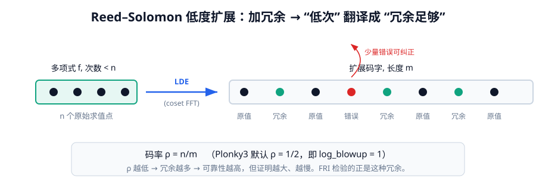
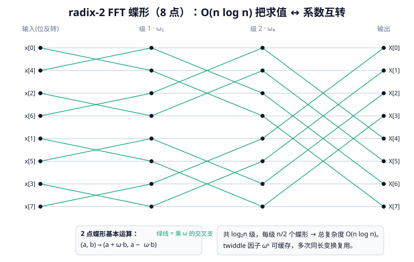

# 第四章 · 多项式、编码与 FFT

> 本章目标：把"一列域元素"变成"一个多项式"，并理解为什么承诺之前要先做 Reed–Solomon 低度扩展（LDE）。FFT 是这一切的发动机。



---

## 4.1 一列数 = 一个多项式

回忆第三章：AIR 把计算编码成一张**执行轨迹表**，每一列是某个寄存器随时间变化的取值序列。

关键转换：**一列 $n$ 个域元素，可以唯一确定一个次数 $<n$ 的多项式**。只要选一个大小为 $n$ 的"求值域" $H=\{h_0,\dots,h_{n-1}\}$，把列里的第 $i$ 个值当作多项式在 $h_i$ 处的取值，用**插值**就能还原出这个多项式 $f(X)$。

于是同一个多项式有**两种等价表示**：

- **系数表示**：$f(X)=c_0+c_1X+\dots+c_{n-1}X^{n-1}$；
- **求值表示**：$(f(h_0), f(h_1), \dots, f(h_{n-1}))$。

STARK 几乎全程在"求值表示"上工作（因为承诺、采样、打开都更自然），而 FFT 就是两种表示之间 $O(n\log n)$ 往返的机器。

---

## 4.2 为什么要"低度扩展"（LDE）

承诺一个多项式，不能只承诺它的 $n$ 个原始求值——那样验证者抽查任何一个点，都得让证明者另外提供，没有"自我约束力"。

STARK 的做法：把多项式在一个**更大的域**上求值，得到一个**更长的求值序列**。例如把次数 $<n$ 的多项式在大小 $2n$（或更多）的域上求值，得到 $2n$ 个点。这就是 **Reed–Solomon 编码**，也叫 **低度扩展（LDE）**。



这样做有两大好处：

1. **冗余 = 抗噪**：扩展后的码字里，少量取值出错（或被恶意篡改）仍能用插值纠正回来。这正是 FRI"低度测试"能容忍噪声、给出**概率性**保证的基础（第六章）。
2. **承诺更结实**：把这个长码字塞进 Merkle 树承诺后，证明者要"撒谎"就必须改动大量叶子，抽查很容易抓到。

> 直觉：**LDE 把"次数足够低"这个性质，翻译成了"码字里的冗余足够多"**。FRI 的全部工作，就是在检验这种冗余是否真的存在。

---

## 4.3 Reed–Solomon 码与"码率"

Reed–Solomon 码用两个参数描述：

- 消息长度 $n$（原始求值数，即多项式次数上界）；
- 码字长度 $m$（LDE 后的长度）。

**码率（rate）** $\rho = n/m$。例如 $\rho=1/2$ 表示码字是消息的 2 倍长。码率越低（冗余越多），可靠性越高，但证明越大、越慢。

Plonky3 的 FRI 参数 `log_blowup` 就是 $\log_2(1/\rho)$（见第六章）。常用 $\rho=1/2$（`log_blowup=1`）。

Reed–Solomon 的具体编码由 `p3-zk-codes/src/reed_solomon.rs` 与 `p3-dft` 的 LDE 接口实现（见 4.5）。

---

## 4.4 FFT 抽象：`TwoAdicSubgroupDft`

Plonky3 在 `p3-dft/src/traits.rs` 定义了变换的统一接口：

```rust
/// 在"2-幂子群"上做离散傅里叶变换的统一抽象。
pub trait TwoAdicSubgroupDft<F: TwoAdicField>: Clone + Default {
    type Evaluations: BitReversibleMatrix<F> + 'static;

    /// 正向 DFT（一批多列矩阵一起做）。
    fn dft_batch(&self, mat: RowMajorMatrix<F>) -> Self::Evaluations;
    /// 陪集 DFT（在 coset 上做，常用于把求值域平移）。
    fn coset_dft_batch(&self, mat: RowMajorMatrix<F>, shift: F) -> Self::Evaluations;
    /// 逆 DFT。
    fn idft_batch(&self, mat: RowMajorMatrix<F>) -> RowMajorMatrix<F>;
    /// 低度扩展（LDE）：增加 added_bits 个比特的长度。
    fn coset_lde_batch(
        &self, mat: RowMajorMatrix<F>, added_bits: usize, shift: F,
    ) -> Self::Evaluations;
}
```

注意几点：

- 它要求域是 **`TwoAdicField`**——即有足够大的 2-幂子群（2-adicity 足够）。这正是第三章里 Mersenne31 基域"卡住"的地方；
- 全是 `*_batch`：一次处理**多列矩阵**，因为 trace 本来就是多列的，批处理更利于 SIMD/缓存；
- `coset_lde_batch` 直接给出"LDE 后的求值"——承诺阶段（第七章）就是调它。

> Mersenne31 的基域不是 `TwoAdicField`（2-adicity=1），所以它**不能直接用 `p3-dft` 的通用算法**，而要用第三章 3.4 节讲的 circle FFT（`Mersenne31Dft`，住在 `mersenne-31` crate 里）。

---

## 4.5 FFT 算法全家桶

`p3-dft` 提供了多种 `TwoAdicSubgroupDft` 实现，按场景选用：

| 实现 | 模块 | 一句话 |
|---|---|---|
| `Radix2Dit` | `radix_2_dit.rs` | 经典 **radix-2 DIT**（按时间抽取）：先 bit-反转，再逐层 in-place 蝶形；**缓存 twiddle 因子**，多次同长变换可复用 |
| `Radix2DitParallel` | `radix_2_dit_parallel.rs` | 上者的**多线程并行**版，分块并行执行各蝶形层 |
| `Radix2Bowers` | `radix_2_bowers.rs` | **Bowers G 网络**（four-step）：twiddle 访问模式比朴素 DIT 更友好，适合大尺寸 |
| `Radix2DFTSmallBatch` | `radix_2_small_batch.rs` | 针对**小批量/小尺寸**优化的变体 |
| `naive` | `naive.rs` | $O(n^2)$ 朴素 DFT，仅供测试对照 |
| `Mersenne31Dft` | `mersenne-31/src/dft.rs` | **circle FFT 包装**：把长 $n$ 的 M31-DFT 折算成长 $n/2$ 的 `Complex<M31>`-DFT |

辅助模块：`butterflies.rs`（蝶形原语，含 `TwiddleFreeButterfly`）、`util.rs`（bit-反转、twiddle 生成）、`naive.rs`。

### 蝶形（butterfly）直觉

FFT 的核心是**蝶形运算**：把一对值 $(a, b)$ 按某个"旋转因子" $\omega$ 组合成 $(a+\omega b,\; a-\omega b)$，递归地把规模 $n$ 的问题拆成两个规模 $n/2$ 的子问题。

```mermaid
flowchart LR
    a0["a"] -->|"+ω·b"| u["a + ωb"]
    a0 -->|"−ω·b"| minus[""]
    b0["b"] --> u
    b0 -->|""| v["a − ωb"]
    style u fill:#10a37f,color:#fff
    style v fill:#1d4ed8,color:#fff
```

每一层把所有元素两两配对做蝶形，共 $\log_2 n$ 层，于是总复杂度 $O(n\log n)$。`Radix2Dit` 把 twiddle 因子（$\omega$ 的各次幂）缓存起来跨次复用，省掉重复计算。

---

## 4.6 插值：从求值还原多项式

承诺之后，验证者会要求在某些**随机点**打开多项式。这些随机点通常**不在**原始求值域 $H$ 上，所以需要 **插值**（给定一组点-值对，求多项式在任意新点的取值）。

Plonky3 的 `p3-interpolation` crate 提供**重心插值（barycentric interpolation）**——给定 $n$ 个点 $(x_i, y_i)$，多项式在任意 $z$ 处的值为：

$$f(z) = \frac{\sum_i \dfrac{w_i\, y_i}{z - x_i}}{\sum_i \dfrac{w_i}{z - x_i}}, \quad w_i = \frac{1}{\prod_{j\ne i}(x_i-x_j)}$$

重心法的好处：**权重 $w_i$ 只依赖插值点 $\{x_i\}$，可预计算**；之后在任意多个新点 $z$ 上求值都很快。这在 FRI 的查询阶段（第六章）和商多项式求值（第七章）里都被大量使用。

> FRI 里的"折叠"也用到插值：用重心 Lagrange 插值在折叠挑战 $\beta$ 处求值（`fold_row`，见第六章）。

---

## 4.7 把变换串进证明流水线

至此可以画出"一列数 → 多项式 → 承诺"的完整数据流：

```mermaid
flowchart LR
    col["一列 trace 取值<br/>(n 个域元素)"] -->|视为 f 在 H 上的求值| f["多项式 f(X), deg<n"]
    f -->|coset_lde_batch<br/>(p3-dft)| lde["LDE 码字<br/>(m=ρ⁻¹·n 个点)"]
    lde -->|每行进 Merkle 叶子| commit["承诺 commit<br/>(p3-merkle-tree)"]
    commit --> fri["FRI 低度测试<br/>(p3-fri)"]
    fri --> proof["打开证明"]
```

- `coset_lde_batch`：把 $n$ 个求值扩展成 $m$ 个（LDE）；
- Merkle 树对这 $m$ 个点逐行承诺；
- FRI 检验这 $m$ 个点确实来自一个低次多项式。

第七章会把这段接进完整的 STARK 流水线。但在那之前，我们还需要两块拼图：**AIR**（第五章，怎么生成那张表和约束）和 **PCS/FRI**（第六章，怎么承诺并证明低次）。

---

## 4.8 小结

- 一列域元素 ↔ 一个低次多项式，两种表示靠 FFT 互转；
- 承诺前要做 **LDE（Reed–Solomon）**，给多项式加冗余，把"低次"翻译成"冗余"；
- `p3-dft` 是 FFT 发动机，按尺寸/并行度选 radix-2 / Bowers / 并行版；
- Mersenne31 因 2-adicity=1，走 circle FFT（`Mersenne31Dft`）；
- 插值用重心法，权重可预计算，服务于 FRI 折叠与商多项式求值。

下一章进入 STARK 的"大脑"——AIR 抽象。
