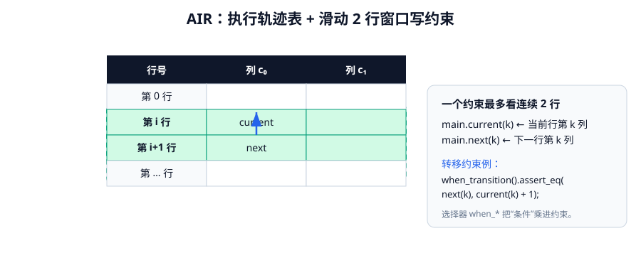
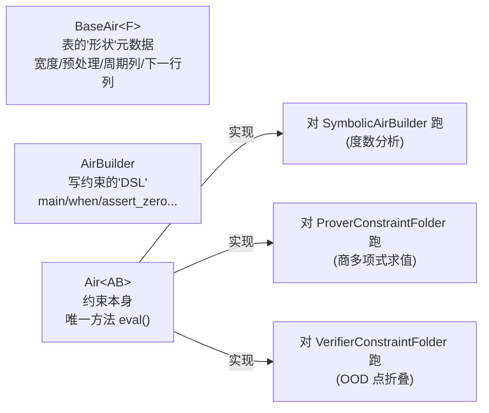
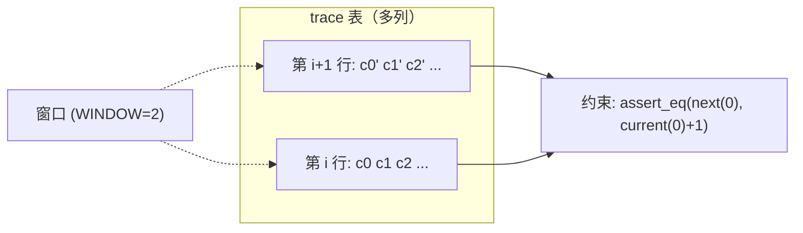

# 第五章 · AIR：代数中间表示

> 本章目标：理解 Plonky3 怎么把"一次计算"变成"一组多项式约束"。核心是三个 trait——`BaseAir`、`AirBuilder`、`Air`——以及那个"一个 `eval` 写三处用"的精妙设计。



---

## 5.1 AIR 的直觉：表格 + 约束

回忆第一章：把计算想象成一张**执行轨迹表（trace）**——每行一个时间步，每列一个"寄存器"。"计算正确"等价于"这张表满足一组代数约束"。

**AIR（Algebraic Intermediate Representation，代数中间表示）** 就是"这组约束"的形式化写法。典型约束有两类：

- **转移约束（transition）**：相邻行之间的关系，描述状态如何演化。例如 Fibonacci：$a_{i+2}=a_{i+1}+a_i$。
- **边界约束（boundary）**：某些固定行（首行/末行）必须是某些公开值。

把每一列都看成多项式后，"表格满足约束" ⟺ "某些多项式方程在大量行上恒为零"。这是 AIR 能进入 STARK 的入口。

---

## 5.2 三个 trait 的分工

Plonky3 把 AIR 拆成三个 trait（`p3-air`），职责清晰：



- `BaseAir<F>`：描述这张表"长什么样"（多少列、有没有预处理列、周期列、哪些列要看下一行）。
- `AirBuilder`：一套"写约束的小语言"（访问当前/下一行的值、加约束、按条件加约束）。
- `Air<AB>`：实际的约束内容，**只有一个方法 `eval`**。

---

## 5.3 `BaseAir<F>`：表的形状

```rust
/// AIR 的底层结构（元数据）。
pub trait BaseAir<F>: Sync {
    /// 这张表有几列（寄存器）。
    fn width(&self) -> usize;

    /// 可选的预处理 trace（证明者与验证者都能公开重算的列）。
    fn preprocessed_trace(&self) -> Option<RowMajorMatrix<F>> { None }
    fn preprocessed_width(&self) -> usize { 0 }

    /// 周期列的数量。
    fn num_periodic_columns(&self) -> usize { 0 }
    /// 周期列数据（按周期重复，不进承诺，双方从公开参数重算）。
    fn periodic_columns(&self) -> Cow<'_, [Vec<F>]> where F: Clone { Cow::Borrowed(&[]) }
    fn periodic_values(&self, row_index: usize) -> Vec<F> where F: Clone { /* 按行取周期值 */ }

    /// 哪些主 trace 列会被约束访问"下一行"。
    /// 默认返回所有列（表示这些列都要在 zeta 与 zeta_next 处打开）。
    fn main_next_row_columns(&self) -> Vec<usize> { (0..self.width()).collect() }
    fn preprocessed_next_row_columns(&self) -> Vec<usize> { (0..self.preprocessed_width()).collect() }

    /// 约束数量 / 最大约束次数的提示（可选）。
    fn num_constraints(&self) -> Option<usize> { None }
    fn max_constraint_degree(&self) -> Option<usize> { None }
    fn num_public_values(&self) -> usize { 0 }
}
```

要点：

- **周期列（periodic columns）**：取值按固定周期重复、不进 trace 承诺的辅助列，常用来表达"每 $k$ 步发生一次"的逻辑（如轮常量），双方各自重算，省下承诺开销。
- **预处理列（preprocessed）**：公开的、可重算的列（如某些固定的查找表），证明前一次性确定。
- **`main_next_row_columns`**：性能优化钩子——如果一个 AIR 的某些列的约束只看当前行、不看下一行，这里声明出来，就能**省掉**这些列在 `zeta_next` 处的打开（更小的证明）。

---

## 5.4 `AirBuilder`：写约束的 DSL

```rust
pub trait AirBuilder: Sized {
    type F: PrimeCharacteristicRing + Sync;
    /// 表达式类型：既能装具体值，也能装符号表达式。
    type Expr: Algebra<Self::F> + Algebra<Self::Var>;
    /// 变量类型：trace 里的一个格子（当前/下一行的某列）。
    type Var: Into<Self::Expr> + Copy + Send + Sync + Add<...> + Sub<...> + Mul<...>;
    type PreprocessedWindow: WindowAccess<Self::Var> + Clone;
    type MainWindow: WindowAccess<Self::Var> + Clone;
    type PublicVar: Into<Self::Expr> + Copy;
    type PeriodicVar: Into<Self::Expr> + Copy;

    /// 一个约束最多看连续几行（窗口宽度）。默认 2（当前+下一行）。
    const WINDOW: usize = 2;

    fn main(&self) -> Self::MainWindow;
    fn preprocessed(&self) -> &Self::PreprocessedWindow;

    // —— 选择器（selector）——
    fn is_first_row(&self) -> Self::Expr;
    fn is_last_row(&self) -> Self::Expr;
    fn is_transition(&self) -> Self::Expr;          // 非最后一行
    fn when<I: Into<Self::Expr>>(&mut self, condition: I) -> FilteredAirBuilder<'_, Self>;
    fn when_first_row(&mut self)  -> FilteredAirBuilder<'_, Self>;
    fn when_last_row(&mut self)   -> FilteredAirBuilder<'_, Self>;
    fn when_transition(&mut self) -> FilteredAirBuilder<'_, Self>;

    // —— 加约束 ——
    fn assert_zero<I: Into<Self::Expr>>(&mut self, x: I);
    fn assert_one<I: Into<Self::Expr>>(&mut self, x: I);
    fn assert_eq<I1, I2>(&mut self, x: I1, y: I2);   // = assert_zero(x - y)
    fn assert_bool<I: Into<Self::Expr>>(&mut self, x: I);

    fn public_values(&self) -> &[Self::PublicVar];
    fn periodic_values(&self) -> &[Self::PeriodicVar];
}
```

怎么用？典型约束长这样：

```rust
let main = builder.main();
let curr = main.current(0).unwrap();      // 当前行第 0 列
let next = main.next(0).unwrap();         // 下一行第 0 列
builder.when_transition().assert_eq(next, curr + F::ONE);  // 转移：next = curr + 1
builder.when_first_row().assert_eq(curr, F::ZERO);         // 边界：首行 = 0
```

### `FilteredAirBuilder`：选择器的实现

`when_*` 返回一个 `FilteredAirBuilder`，它把"条件"包了起来：之后对它调 `assert_zero(x)`，实际等价于 `assert_zero(condition * x)`。于是"仅在某些行生效"的约束被优雅地翻译成"乘上一个指示多项式"：

```rust
// 简化语义
impl FilteredAirBuilder {
    fn assert_zero(&mut self, x) { self.inner.assert_zero(self.condition * x); }
}
```

`is_first_row`、`is_last_row`、`is_transition` 本质就是一些取值 0/1 的指示多项式（在边界行为 1、其余为 0）。这是 STARK 把"条件逻辑"统一成"多项式乘法"的标准技巧。

---

## 5.5 `Air<AB>`：约束本体

```rust
/// 一个 AIR 定义：包含计算约束的求值函数。
/// 它既能作用在真实 trace 上（算出每个约束的值），
/// 也能"符号化"作用（每个约束产出一个符号表达式）。
pub trait Air<AB: AirBuilder>: BaseAir<AB::F> {
    /// 用提供的 builder 求值所有 AIR 约束。
    fn eval(&self, builder: &mut AB);
}
```

**整个 AIR 协议，开发者只需实现这一个 `eval` 方法。** 这是 Plonky3 最省心的地方。

---

## 5.6 核心魔法：一个 `eval`，三处复用

这是 Plonky3 AIR 设计的精髓。同一个 `eval`，会被框架用**三种不同的 builder** 各跑一次：

| 跑 `eval` 用的 builder | `Var/Expr` 是什么 | 目的 |
|---|---|---|
| `SymbolicAirBuilder` | **符号表达式** | 数有多少约束、推出**商多项式的次数**（决定 LDE/商域大小） |
| `ProverConstraintFolder` | **批量求值**（`PackedVal`） | 在**整个商域**上把所有约束算出来，组合成商多项式 |
| `VerifierConstraintFolder` | **单个 OOD 点的取值** | 在随机点 $\zeta$ 处折叠约束，校验多项式恒等式 |

之所以能这样，是因为 `AirBuilder` 把 `Var`/`Expr` 做成了**关联类型**：符号表达式、批量真值、单点取值，都满足同一套 `Algebra`（加减乘）接口。于是同一份约束代码，在三种"解释器"下自动给出三种用途的输出。

> 这是一种典型的**表达式多态 / tagless final** 风格：约束的"语法"只写一遍，"语义"由 builder 注入。它让"证明系统"和"具体电路"彻底解耦。

---

## 5.7 一个具体例子：`RowLogicAir`

Plonky3 的 `examples/` 已不再保留经典的 Fibonacci 示例；教学用的"转移+边界"范型，看 `air/src/check_constraints.rs` 里的 `RowLogicAir`（它和 Fibonacci AIR 的写法**完全一致**，只是约束含义不同）。它实现两条规则：

- **转移**：每一列在相邻行间 `+1`；
- **边界**：最后一行等于给定的公开值。

```rust
impl<F: Field, const W: usize> Air<DebugConstraintBuilder<'_, F>> for RowLogicAir<W> {
    fn eval(&self, builder: &mut DebugConstraintBuilder<'_, F>) {
        let main = builder.main();

        // 转移约束：每一列 next == current + 1
        for col in 0..W {
            let current = main.current(col).unwrap();
            let next = main.next(col).unwrap();
            builder.when_transition().assert_eq(next, current + F::ONE);
        }

        // 边界约束：最后一行匹配公开值
        let public_values = builder.public_values;
        let mut when_last = builder.when(builder.is_last_row);
        for (i, &pv) in public_values.iter().enumerate().take(W) {
            when_last.assert_eq(main.current(i).unwrap(), pv);
        }
    }
}
```

换成一个真正的 Fibonacci AIR，只是把 `next == current + 1` 换成 `a_next == b_curr`（下一行的 a = 当前的 b）、`b_next == a_curr + b_curr` 之类，**结构完全相同**。生产级 AIR（如 `keccak-air`、`blake3-air`、`poseidon2-air`）也是这样，只是约束更多、更复杂。

### 约束的"窗口"概念

`WINDOW=2` 表示一个约束最多看**连续 2 行**（当前行 + 下一行）。这也是 `main.current(i)` 和 `main.next(i)` 的来源——一个大小为 2 的行窗口。



---

## 5.8 扩展 trait：扩域与置换

真实电路常需要更"高级"的约束手段，Plonky3 提供了扩展 builder：

- **`ExtensionBuilder`**：在**扩域**上加约束（`assert_zero_ext`/`assert_eq_ext`）。查找参数、随机化往往需要在扩域里表达。
- **`PermutationAirBuilder`**：支持**置换/查找**（`permutation()`、`permutation_values()`），是 LogUp 查找论证的接口（第八章）。

这三个 trait（`AirBuilder` ⊃ `ExtensionBuilder` ⊃ `PermutationAirBuilder`）层层加能力，对应越来越复杂的协议特性。

---

## 5.9 小结

- AIR = "trace 表 + 代数约束"；开发者只实现 `Air::eval` 一个方法。
- `BaseAir` 描述形状，`AirBuilder` 是约束 DSL，`Air` 是约束本体；
- 选择器（`when_*`）把"条件约束"统一成"乘指示多项式"；
- **同一份 `eval`，分别对符号/证明器/验证器 builder 跑三遍**，分别用于度数分析、商多项式求值、OOD 点校验——这是 Plonky3 解耦的核心魔法。

到这里，"怎么把计算变成多项式约束"已经清楚。下一章解决另一个根本问题：**怎么承诺这些多项式，并让别人相信它们确实低次？** 这就是 PCS 与 FRI。
