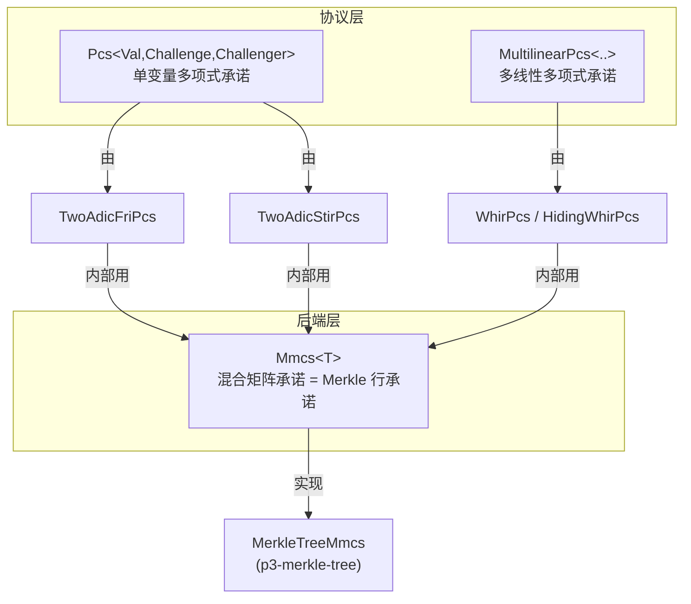
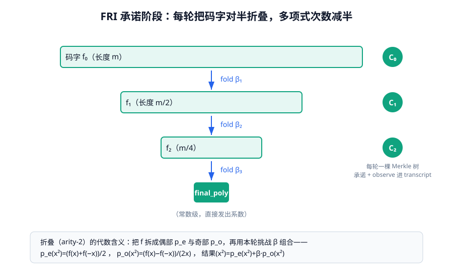
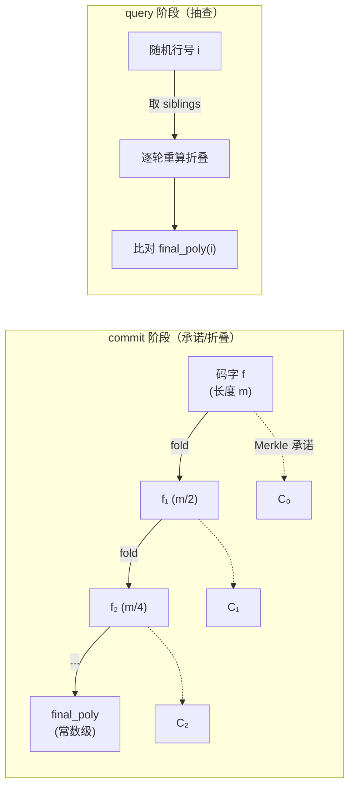
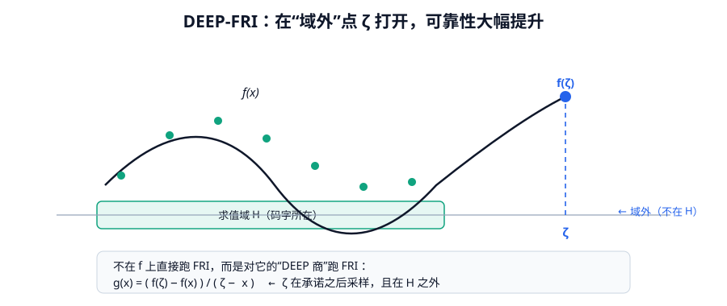

# 第六章 · 多项式承诺与 FRI

> 本章目标：讲清楚 Plonky3 怎么"承诺一个多项式、并让别人相信它确实低次"。核心是承诺抽象三层 trait（`Pcs`/`MultilinearPcs`/`Mmcs`）、FRI 的 commit/query 两阶段、DEEP-FRI 增强与 `FriParameters`，以及 STIR/Whir/Brakedown 的取舍。


---

## 6.1 什么是多项式承诺（PCS）

一个**多项式承诺方案（Polynomial Commitment Scheme, PCS）** 让你能：

1. **承诺（commit）** 一个多项式 $f$：只公布一个短"承诺值" $C$，不暴露 $f$；
2. **打开（open）** 任意点 $z$：给出 $f(z)$ 的值，并附一个短证明，证明"这个值确实对应我当初承诺的那个 $f$"；
3. **约束一致性**：你无法对不同的人给出自相矛盾的取值。

在 STARK 里，PCS 还承担一个特殊职责：**证明 $f$ 的次数足够低**（low-degree test）。因为 STARK 的可靠性建立在"某些多项式确实是低次"之上。

> Plonky3 的 PCS 全部是**透明（无 trusted setup）、后量子安全、基于哈希**的——这是 STARK 路线的标志。

---

## 6.2 承诺抽象：三层 trait

`p3-commit` 定义了三条 trait，所有具体承诺方案都落在其中之一：



### 6.2.1 `Pcs`：单变量承诺

这是 FRI、STIR 满足的 trait（`commit/src/pcs/univariate.rs`）。节选：

```rust
pub trait Pcs<Val: Field, Challenge: ExtensionField<Val>, Challenger> {
    type Domain: PolynomialSpace;
    type Commitment: Clone + Serialize + DeserializeOwned;
    type ProverData;
    type Proof: Clone + Serialize + DeserializeOwned;
    type Error: Debug;

    /// 设为 true 即激活随机化，获得零知识。
    const ZK: bool;

    fn natural_domain_for_degree(&self, degree: usize) -> Self::Domain;
    fn log_max_lde_height(&self) -> usize;

    /// 承诺一批多项式（以它们在某域上的求值给出）。
    fn commit(&self, evaluations: impl IntoIterator<Item = (Self::Domain, RowMajorMatrix<Val>)>)
        -> (Self::Commitment, Self::ProverData);

    /// 承诺商多项式（按 num_chunks 分块）。
    fn commit_quotient(&self, quotient_domain, quotient_evaluations, num_chunks) { /* ... */ }

    /// 打开：在若干点上证明这些多项式的取值，返回取值 + 打开证明。
    fn open(&self, commitment_data_with_opening_points: Vec<(&Self::ProverData, Vec<Vec<Challenge>>)>,
            challenger: &mut Challenger) -> (OpenedValues<Challenge>, Self::Proof);

    /// 验证打开证明。
    fn verify(&self, commitments_with_opening_points: Vec<(Self::Commitment, Vec<(Self::Domain, Vec<(Challenge, Vec<Challenge>)>)>)>,
              proof: &Self::Proof, challenger: &mut Challenger) -> Result<(), Self::Error>;
}
```

注意 `const ZK: bool`：基础 FRI PCS 设 `false`；要零知识时用专门的 **hiding 包装**（`p3-fri/hiding_pcs.rs`）。

### 6.2.2 `MultilinearPcs`：多线性承诺

这是 **Whir** 满足的 trait（`commit/src/pcs/multilinear.rs`）：承诺布尔超立方 $\{0,1\}^m$ 上的多线性多项式。多线性 STARK（`p3-multi-stark`）和 Whir 用它（见第七章）。

### 6.2.3 `Mmcs`：Merkle 行承诺的抽象

FRI/STIR/Whir 的每一轮都要"承诺一个码字并打开某些行"。`Mmcs`（Mixed Matrix Commitment Scheme，`commit/src/mmcs.rs`）把这个能力抽象出来，由 `MerkleTreeMmcs` 实现。

它有一个为 FRI 量身定制的精巧语义：**不同高度的码字可以共用一棵树**，开第 `index` 行时，按

$$j = \text{index} \gg (\log_2\text{max\_height} - \log_2\text{height}_i)$$

把"全局行号"映射到"该码字的有效行号"。这正是 FRI 多轮折叠（每轮高度减半）需要的——一轮一个高度，却共用一套打开逻辑。

---

## 6.3 FRI：核心低度测试

FRI（Fast Reed–Solomon IOP of Proximity）是 Plonky3 默认的 PCS 后端。它不直接检验"$f$ 是低次"，而是检验"$f$ 的 LDE 码字**接近**一个低次多项式的码字"——所以叫"IOP of Proximity"（近邻性）。



FRI 分两大阶段：**commit（承诺/折叠）** 与 **query（查询/抽查）**。

### 6.3.1 commit 阶段：反复折叠

入口 `prove_fri`（`fri/src/prover.rs`）。证明者拿到若干多项式（在 LDE 域上的求值，**位反转序**排列），然后循环：

1. **承诺本轮码字**：`mmcs.commit_matrix(leaves)` 建 Merkle 树，`challenger.observe(commit)`。
2. **PoW 延迟**：`challenger.grind(commit_proof_of_work_bits)`——找一个 PoW 见证（提升可靠性，见 6.5）。
3. **采样折叠挑战**：`beta = challenger.sample_algebra_element()`。
4. **折叠**：`folding.fold_matrix(beta, log_arity, leaves)`，把码字"对半折叠"。
5. 当码字缩短到 `blowup * final_poly_len` 时停止，取最后一段做 `idft` 得到**最终多项式** `final_poly` 的系数，`observe` 进 transcript。

**折叠的代数含义**（arity-2，最常见）：把 $f$ 拆成偶部 $p_e$ 和奇部 $p_o$：

$$p_e(x^2)=\frac{f(x)+f(-x)}{2},\quad p_o(x^2)=\frac{f(x)-f(-x)}{2x},\quad \text{result}(x^2)=p_e(x^2)+\beta\,p_o(x^2)$$

每折叠一次，多项式的**次数减半**。反复折叠 $\log$ 轮后，就得到了一个**常数级**的低次多项式 `final_poly`。

> 高 arity（如 4、8）折叠：把一次 arity-$2^k$ 折叠拆成 $k$ 次连续 arity-2 折叠，挑战用 $\beta, \beta^2, \beta^4, \dots$。每轮的 arity 由 `compute_log_arity_for_round` **动态**选择（保证每一轮都恰好对应一个输入高度，并最终落到 `log_final_poly_len`）。

### 6.3.2 query 阶段：随机抽查

commit 结束后，验证者（由 Fiat–Shamir 模拟）采样若干查询点：

- `challenger.observe(log_arity)`（每轮）→ PoW 见证 → 采样 `num_queries` 个行号；
- 对每个查询点，证明者给出**每一轮**该位置及其"兄弟值"（siblings），以及一个**共享的去重 Merkle 多重证明**（`MultiProof`）。

验证者用这些兄弟值，**逐轮重新折叠**，最终与自己算出的 `final_poly` 在该点取值比对——一致则通过。



### 6.3.3 证明结构

```rust
// fri/src/proof.rs（节选）
pub struct FriProof<F, M, Witness, InputProof> {
    pub commit_phase_commits: Vec<M::Commitment>,          // 每轮一个 Merkle 承诺
    pub commit_pow_witnesses: Vec<Witness>,                 // 每轮 PoW 见证
    pub input_openings: InputProof,                         // 输入承诺在各查询点的多重打开
    pub commit_phase_openings: Vec<CommitPhaseMultiStep<F, M>>, // 各轮 siblings + 共享证明
    pub final_poly: Vec<F>,                                 // 最终多项式系数
    pub query_pow_witness: Witness,                         // 查询阶段 PoW 见证
}
```

关键优化：**多重证明（multiproof）**——把所有查询的 Merkle 鉴权路径去重合并，共享祖先只发一次。这让 query 阶段的证明体积大幅缩小。

---

## 6.4 DEEP-FRI：在"域外"采样

朴素 FRI 的可靠性有限。**DEEP-FRI**（*Sampling Outside the Box Improves Soundness*，Ben-Sasson, Goldberg, Kopparty, Saraf，eprint 2019/336）用一个简单却深刻的技巧大幅提升可靠性。



想法：不要直接对 $f$ 跑 FRI，而是对它的一个"商"跑 FRI。在承诺**之后**采样一个随机点 $\zeta$（"域外"点，即不在求值域内），构造：

$$g(X) = \frac{f(\zeta) - f(X)}{\zeta - X}$$

只要 $f$ 在 $\zeta$ 处的取值 $f(\zeta)$ 是诚实的，那么 $g(X)$ 也是低次的（次数比 $f$ 还低 1）。把 FRI 跑在 $g$ 上，等价于既检验了"$f$ 低次"、又检验了"$f(\zeta)$ 取值正确"。

**Plonky3 的实现位置**：DEEP 商不是某个叫 `deep_*` 的函数，而是**结构化地**写在 `TwoAdicFriPcs::open` 里（`fri/src/two_adic_pcs.rs`）：

- 对每个要打开的多项式 $f$ 和点 $\zeta$，证明者构造商 $(f(\zeta)-f(x))/(\zeta-x)$；
- 同高度的多项式用 $\alpha$ 的幂次**批量合并**成"reduced openings"；
- 把这些 reduced openings 喂给 `prove_fri`。

验证者侧在 `verify_fri` → `open_inputs` 里用 $1/(\zeta-x)$（批量求逆）重建同样的商，保证两边一致。

> 直觉：**DEEP 把"打开取值"和"低度测试"合并成一道工序**，并用"采样在承诺之后、域外"这个时序，把可靠性从朴素 FRI 的 $\rho^q$ 量级提升到接近最优。

---

## 6.5 参数与可靠性

FRI 的全部参数在 `FriParameters<M>`（`fri/src/config.rs`）：

```rust
pub struct FriParameters<M> {
    pub log_blowup: usize,            // log(1/码率)：如 1 → ρ=1/2
    pub log_final_poly_len: usize,    // 最终多项式长度的 log
    pub max_log_arity: usize,         // 折叠 arity 上限（log2）；1 = 二元折叠
    pub num_queries: usize,           // 查询次数
    pub commit_proof_of_work_bits: usize,  // 每轮 commit 前 PoW 比特
    pub query_proof_of_work_bits: usize,   // 查询前 PoW 比特
    pub mmcs: M,                      // Merkle 后端
}

impl<M> FriParameters<M> {
    /// ethSTARK 猜想下的可靠性比特数。
    pub const fn conjectured_soundness_bits(&self) -> usize {
        self.log_blowup * self.num_queries + self.query_proof_of_work_bits
    }
}
```

可靠性（猜想起，基于 ethSTARK eprint 2021/582）：

$$\text{soundness bits} \approx \log_2(1/\rho) \times \text{num\_queries} + \text{pow\_bits}$$

也就是**码率越低、查询越多、PoW 越强 → 越可靠**，但证明越大、越慢。典型目标 100+ 比特安全。

> 源码里还提供几个预设：`new_testing`（`log_blowup=2, num_queries=2`，仅测试用）、`new_benchmark`（`log_blowup=1, num_queries=100, query_pow=16`，benchmark 用）。生产请用认真推导的参数，不要用 testing 预设。

---

## 6.6 STIR、Whir、Brakedown：FRI 之外的选项

Plonky3 不止 FRI。`p3-stir`、`p3-whir`、`p3-zk-codes` 提供了不同取舍的 PCS。它们的本质区别在于**"怎么检验 Reed–Solomon 近邻性"**。

### STIR（`p3-stir`）

STIR（eprint 2024/390）通过**每轮移动求值域以提升有效码率**（"shift to improve rate"）+ 少量域外采样 + 一个"shake/answer 多项式"论证，把达到同等可靠性所需的查询数**显著降低**，从而**缩小证明**。`stir/src/lib.rs` 的文档注释明确记录了本实现相对论文的几处偏离（如 prover-assisted Ans 检查、固定 `s` 调度等），实现时务必对照。

### Whir（`p3-whir`）

Whir（eprint 2024/1586）是**多线性** PCS，用"sumcheck 启发"的折叠，达到**超快验证**（$O(\log n)$）和很小的证明。它是 `p3-multi-stark` 的目标后端。Whir 还提供**原生**零知识变体 `HidingWhirPcs`（`pcs::zk`，用 blinded masks）——这是三者里唯一自带原生 ZK 的；FRI/STIR 的 ZK 都靠外层 `hiding_pcs` 包装。

参数里 `DEFAULT_MAX_POW = 16`；强制每轮码率 $\le 1/2$。

### Brakedown / 线性码（`p3-zk-codes`）

FRI/STIR/Whir 都承诺 **Reed–Solomon 码字**（需 FFT、需 2-adicity）。`p3-zk-codes` 提供**线性时间可编码**的码（Brakedown/Basefold 系，用张量/扩展子积构造）：

- 编码 $O(n)$（不用 FFT）；
- **域无关**（任何域，甚至二元域）；
- 代价是证明更大。

### 横向对比

| 特性 | FRI | STIR | Whir | Brakedown(zk-codes) |
|---|---|---|---|---|
| 码字 | Reed–Solomon | Reed–Solomon | Reed–Solomon | 线性时间码 |
| 多项式类型 | 单变量 | 单变量 | 多线性 (+单变量) | 多线性 |
| Prover | 准线性 $O(n\log n)$ | 准线性 | 准线性、field-aware | **线性 $O(n)$** |
| Verifier | polylog | polylog | **$O(\log n)$，超快** | polylog |
| 同等可靠性下查询数 | 基线 | 少于 FRI | 极少 | 证明较大 |
| 是否需 2-adicity | 是 | 是 | 是（首折后基域） | 否（域无关） |
| 透明/后量子 | 是 | 是 | 是 | 是 |
| 原生 ZK | 否（靠包装） | 否（靠包装） | **是**（`HidingWhirPcs`） | 否（靠包装） |
| Plonky3 结构 | `TwoAdicFriPcs` | `TwoAdicStirPcs` | `WhirPcs` | 经 `zk-codes` + 包装 |

> 选型直觉：要"最快验证 + 最小证明"且能上多线性栈 → **Whir**；要"最透明的经典 STARK、生态最稳"→ **FRI**；要"域无关/线性时 prover、不在意证明大"→ **Brakedown**。

---

## 6.7 小结

- 承诺抽象三层：`Pcs`（单变量）/ `MultilinearPcs`（多线性）/ `Mmcs`（Merkle 后端）；FRI/STIR/Whir 都构建在 `Mmcs` 之上。
- FRI = commit（反复折叠降次）+ query（随机抽查重算）两阶段；折叠使次数每轮减半。
- **DEEP-FRI** 把"打开取值"和"低度测试"合二为一，在域外点 $\zeta$ 上构造商 $(f(\zeta)-f(x))/(\zeta-x)$，可靠性大幅提升。
- 可靠性 $\approx \log(1/\rho)\times q + \text{pow}$；`FriParameters` 是所有旋钮。
- STIR/Whir/Brakedown 在"近邻性检验"上做不同取舍：Whir 验证最快且原生 ZK，Brakedown 域无关且线性 prover。

下一章，我们把 AIR（第五章）和 PCS/FRI（本章）组装成一条完整的 STARK 证明流水线。
