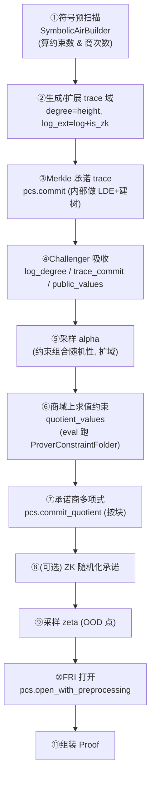
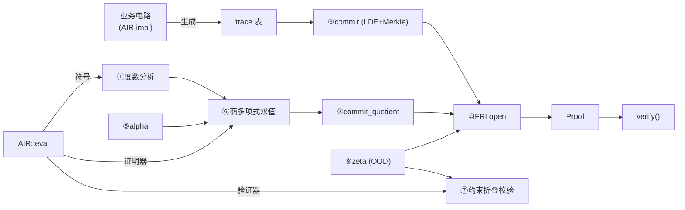

# 第七章 · STARK 证明全流程

> 本章目标：把前六章拼起来——从一张 trace 表，到一条可独立验证的证据。本章是整份文档的"整合章"，按 `p3-uni-stark` 的真实函数顺序走完整条证明流水线，并对比 `multi-stark` 与 `batch-stark`。

---

## 7.1 配置：把三条轴钉在一起

回忆第二章的三条可插拔轴（域 × 哈希 × PCS）。它们被一个薄壳钉成一个完整配置：

```rust
// uni-stark/src/config.rs
pub trait StarkGenericConfig: Clone {
    type Pcs: Pcs<Self::Challenge, Self::Challenger>;
    type Challenge: ExtensionField<Val<Self>>;
    type Challenger: FieldChallenger<Val<Self>>
        + CanObserve<<Self::Pcs as Pcs<...>>::Commitment>
        + CanSample<Self::Challenge>;

    fn pcs(&self) -> &Self::Pcs;
    fn initialise_challenger(&self) -> Self::Challenger;
    fn is_zk(&self) -> usize { Self::Pcs::ZK as usize }
}

#[derive(Clone, Debug)]
pub struct StarkConfig<Pcs, Challenge, Challenger> {
    pcs: Pcs,
    challenger: Challenger,
    _phantom: PhantomData<Challenge>,
}
```

`StarkConfig` 只是个载体——真正的旋钮（FRI 参数、查询数、PoW）都**在 PCS 内部**（第六章的 `FriParameters`）。类型别名让代码好读：

```rust
pub type Val<SC>   = <<SC>::Pcs as Pcs<...>>::Domain as PolynomialSpace>::Val;  // 基域
pub type PcsError<SC> = <...>::Error;
```

---

## 7.2 入口与证据结构

证明器入口（`uni-stark/src/prover.rs`）：

```rust
pub fn prove<SC, A>(
    config: &SC,
    air: &A,
    trace: RowMajorMatrix<Val<SC>>,
    public_values: &[Val<SC>],
) -> Proof<SC>
where
    SC: StarkGenericConfig,
    A: Air<SymbolicAirBuilder<Val<SC>>>
     + for<'a> Air<ProverConstraintFolder<'a, SC>>;

pub fn verify<SC, A>(
    config: &SC, air: &A, proof: &Proof<SC>, public_values: &[Val<SC>],
) -> Result<(), VerificationError<PcsError<SC>>>
where
    SC: StarkGenericConfig,
    A: Air<SymbolicAirBuilder<Val<SC>>>
     + for<'a> Air<VerifierConstraintFolder<'a, SC>>;
```

注意 `A`（AIR）必须同时满足 `Air<SymbolicAirBuilder>` 和 `Air<ProverConstraintFolder>`/`Air<VerifierConstraintFolder>`——这正是第五章讲的"一个 `eval`，多处复用"在类型层面的体现。

证据结构：

```rust
pub struct Proof<SC> {
    pub commitments: Commitments<SC>,        // trace、商多项式、(ZK) 随机化的承诺
    pub opened_values: OpenedValues<SC>,     // 在 zeta / zeta_next 处打开的取值
    pub opening_proof: PcsProof<SC>,         // FRI 打开证明
    pub degree_bits: usize,                  // trace 高度的 log
}
```

---

## 7.3 证明流水线（11 步）

下面按 `prove_with_preprocessed` 的真实步骤走。这是理解整个 STARK 最重要的一节。



**① 符号预扫描（度数分析）。** 把 `eval` 对 `SymbolicAirBuilder` 跑一遍，数出有多少约束、推出**商多项式需要的次数**，得到 `log_num_quotient_chunks`（`crate::symbolic::get_log_num_quotient_chunks`）。这决定了商域要多大。

**② 生成 trace 域。** `degree = trace.height()`；`log_degree = log2(degree)`；若开 ZK，`log_ext_degree = log_degree + is_zk`（ZK 填充）。trace 承诺域是大小 `degree`（或 `degree<<is_zk`）的自然二-adic 域。

**③ Merkle 承诺 trace。**
```rust
let (trace_commit, trace_data) = pcs.commit([(ext_trace_domain, trace)]);
```
`commit` 内部会做 LDE（第四章）并建 Merkle 树（第六章 `Mmcs`）。

**④ Fiat–Shamir 吸收公开数据。**
```rust
challenger.observe(Val::<SC>::from_u8(log_ext_degree as u8));
challenger.observe(Val::<SC>::from_u8(log_degree as u8));
challenger.observe(trace_commit.clone());
challenger.observe_slice(public_values);
```

**⑤ 采样约束组合随机性 `alpha`。**
```rust
let alpha: SC::Challenge = challenger.sample_algebra_element();
```
$\alpha$ 用来把**多个约束**线性组合成一个多项式（用 $\alpha^0, \alpha^1, \dots$）。

**⑥ 在商域上求值约束。**
```rust
let quotient_domain = ext_trace_domain.create_disjoint_domain(
    1 << (log_ext_degree + log_num_quotient_chunks));
let quotient_values = quotient_values(
    pcs, air, public_values, layout, trace_domain, quotient_domain,
    &trace_on_quotient_domain, preprocessed_on_quotient_domain.as_ref(), alpha);
```
内部对商域上**每个点**跑 `eval`（用 `ProverConstraintFolder`），收集所有约束，用 $\alpha$ 的幂组合，再逐点除以 trace 域的**消逝多项式** $Z_H$，得到商多项式 $C(x)/Z_H(x)$ 的求值。

> 消逝多项式 $Z_H(x)=\prod_{h\in H}(x-h)$ 在 $H$ 上为 0。如果所有约束真的在 $H$ 上恒为零，那么 $C(x)$ 在 $H$ 上为零，于是 $C/Z_H$ 是个多项式（能除尽）。这就是"约束满足"⟺"商是多项式"。

**⑦ 承诺商多项式（分块）。** 商多项式在扩域上，被拆成 `SC::Challenge::DIMENSION` 个基域块，每块单独承诺：
```rust
let (quotient_commit, quotient_data) =
    pcs.commit_quotient(quotient_domain, quotient_flat, num_quotient_chunks);
challenger.observe(quotient_commit.clone());
```

**⑧（可选）ZK 随机化承诺。** 若 `SC::Pcs::ZK` 为真，额外承诺一个随机化多项式（掩盖 trace）：
```rust
let (opt_r_commit, opt_r_data) = if SC::Pcs::ZK {
    let (r_commit, r_data) = pcs.get_opt_randomization_poly_commitment(...).expect(...);
    (Some(r_commit), Some(r_data))
} else { (None, None) };
```

**⑨ 采样 OOD 点 `zeta`。**
```rust
let zeta: SC::Challenge = challenger.sample_algebra_element();
```
`zeta` 是"域外"随机点（验证器会拒绝落在 trace 域内的 `zeta`）。它正是 DEEP-FRI 的采样点（第六章）。

**⑩ FRI 打开。** 为 trace@{`zeta`,`zeta_next`}、商块@`zeta`、（若 ZK）随机化@`zeta` 构造打开轮次，调：
```rust
pcs.open_with_preprocessing(rounds, &mut challenger, preprocessed_data_ref.is_some())
```
这里 FRI 做 commit + query（第六章），产出 `opening_proof: PcsProof<SC>`。

**⑪ 组装 `Proof<SC>`。** 返回 `{ commitments, opened_values, opening_proof, degree_bits }`。

---

## 7.4 两个 Folder：约束怎么被"吃掉"

证明器用 `ProverConstraintFolder`，验证器用 `VerifierConstraintFolder`（`uni-stark/src/folder.rs`）。它们的 `assert_zero` 行为不同：

```rust
// 证明器：只是把约束收集起来（组合成商多项式发生在 quotient_values 里）
impl ProverConstraintFolder<'_, SC> {
    fn assert_zero<I: Into<Self::Expr>>(&mut self, x: I) {
        self.base_constraints.push(x.into());
        self.constraint_index += 1;
    }
}

// 验证器：用 Horner 法把约束累加（乘 alpha 再加新约束）
impl VerifierConstraintFolder<'_, SC> {
    fn assert_zero<I: Into<Self::Expr>>(&mut self, x: I) {
        self.accumulator *= self.alpha;
        self.accumulator += x.into();
    }
}
```

验证器最终检查：

$$C(\zeta) \cdot Z_H(\zeta)^{-1} \stackrel{?}{=} q(\zeta)$$

即"约束组合在 $\zeta$ 处的值，除以消逝多项式，等于商多项式在 $\zeta$ 处的值"。这就是多项式恒等式的单点校验。

---

## 7.5 验证器的检查清单

`verify_with_preprocessed`（`uni-stark/src/verifier.rs`）按顺序做：

1. **度数/形状校验**：`degree_bits` 合法、≥ `is_zk`、不超过 PCS 的 `log_max_lde_height`；预处理列宽与验证密钥一致。
2. **商域重建**：重算 `log_num_quotient_chunks`、商域及各块子域。
3. **证据形状校验**：`trace_local` 长度 = AIR 宽度；`trace_next` 是否存在与 `main_next_row_columns` 一致；商块数与维度正确；公开值数量正确。
4. **Fiat–Shamir 回放**：按相同顺序 `observe` 公开数据与承诺，重采样 `alpha`、`zeta`。
5. **OOD 点合法性**：`init_trace_domain.vanishing_poly_at_point(zeta)` 非零（否则 `OodPointInDomain` 拒绝）。
6. **PCS 打开验证**：对 trace@{zeta,zeta_next}、商块@zeta、（ZK）随机化@zeta 做 FRI 批量验证：
   ```rust
   pcs.verify(coms_to_verify, opening_proof, &mut challenger)
       .map_err(VerificationError::InvalidOpeningArgument)?;
   ```
7. **约束折叠校验**：从块重组商 `recompose_quotient_from_chunks(...)`，跑 `eval`（`VerifierConstraintFolder`），检查 $C(\zeta)/Z_H(\zeta) = q(\zeta)$，否则 `OodEvaluationMismatch`。

---

## 7.6 `multi-stark`：多线性 SuperSpartan 路线

`p3-multi-stark` 是另一种 STARK——**多线性** SuperSpartan 风格（参考 *Customizable Constraint Systems* 与 Borgeaud 的 AIR 优化）。与 `uni-stark` 的区别：

- trace 被看作**多线性扩展**（布尔超立方上的多线性多项式），而非单变量多项式；
- 约束满足被归约成 **sumcheck / zerocheck**（对布尔超立方求和），而不是"除以单变量消逝多项式"；
- PCS 是 `MultilinearPcs`（如 **Whir**，见第六章），而非单变量 FRI。

```rust
pub trait MultiStarkConfig {
    type Val: Field;
    type Challenge: ExtensionField<Self::Val>;
    type Challenger;
    type Pcs: MultilinearPcs<Self::Challenge, Self::Challenger, Val = Self::Val>;
    fn pcs(&self) -> &Self::Pcs;
    fn min_num_variables(&self) -> usize;
    // ...
}
```

API 与 uni-stark 对称：`setup`（出 `ProvingKey`/`VerifyingKey`）、`prove`、`verify`，带 `ProverInstance`/`VerifierInstance`。

> 一句话：`uni-stark` = 单变量 FRI-STARK；`multi-stark` = 多线性 sumcheck/Whir-STARK。后者验证更快、更现代，但实现更复杂。

---

## 7.7 `batch-stark`：多实例摊销

`p3-batch-stark` 建**在 `uni-stark` 之上**，不改 PCS 风味。它把**多个 AIR 实例**（高度可不同）塞进**一次承诺 + 一次 FRI 打开**：

```rust
pub use p3_uni_stark::StarkGenericConfig as SGC;   // 直接复用 uni-stark 配置
// prove_batch(...)  -> BatchProof + StarkInstance
// verify_batch(...) -> 接收所有 AIR + 各自公开值
```

- 摊销的是**昂贵的共享部分**：一棵 Merkle 承诺、一次 FRI 打开；
- 每个实例的公开值与 AIR 规格仍分开（`CommonData`/`ProverData`/`VerifierData`/`BatchTranscript`）；
- 还支持**跨实例查找**（一个实例里的表查另一个实例的表）。

> 一句话：`batch-stark` = 摊销层，把多个 uni-stark 实例塞到同一棵 FRI 后面；`multi-stark` = 另一种 PIOP（多线性）。

---

## 7.8 端到端数据流总览



---

## 7.9 小结

- `StarkConfig` 把"PCS + 扩域 + Challenger"钉成一体；旋钮在 PCS 内。
- uni-stark 证明 11 步：符号预扫描 → trace 域 → Merkle 承诺 → 吸收 → 采样 $\alpha$ → 商域求值 → 承诺商 → （ZK）→ 采样 $\zeta$ → FRI 打开 → 组装。
- 核心恒等式：约束满足 ⟺ $C/Z_H$ 是多项式 ⟺ $C(\zeta)/Z_H(\zeta)=q(\zeta)$。
- `multi-stark` 走多线性 sumcheck/Whir；`batch-stark` 在 uni-stark 上做多实例摊销。

下一章我们补齐流水线里用到的三个"辅助协议"——sumcheck、LogUp 查找、以及把它们粘成非交互的 Fiat–Shamir Challenger。
