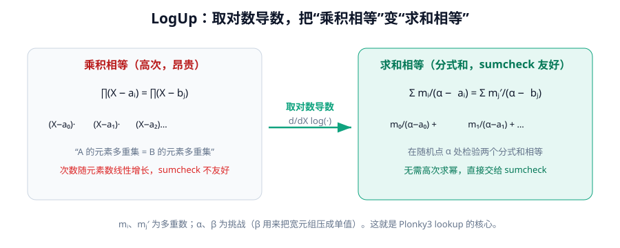
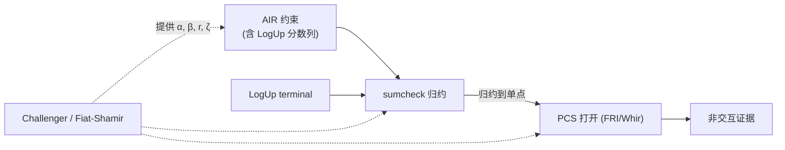

# 第八章 · Sumcheck、Lookup 与 Fiat–Shamir

> 本章目标：补齐 STARK 流水线用到的三个关键辅助件——把交互"压"成非交互的 Challenger、归约求和的 sumcheck、以及把"表里查表"变成代数约束的 LogUp 查找。

---

## 8.1 Challenger：把交互压成非交互

STARK 本质是**交互式 public-coin 协议**：验证者每轮抛硬币（发随机挑战）。现实中没人愿意交互，于是用 **Fiat–Shamir 变换**把每轮的挑战换成"到此为止全部 transcript 的哈希"。

Plonky3 没有"一个 Challenger trait"，而是把它拆成 **4 个细粒度 trait**（`p3-challenger/src/lib.rs`），把 transcript 当作"状态机 + 海绵"：

```rust
/// 能"吸收"任意项（承诺、公开值、点）。
pub trait CanObserve<T> {
    fn observe(&mut self, value: T);
    fn observe_slice(&mut self, values: &[T]) where T: Clone { /* 逐个 observe */ }
}

/// 能"挤出"一个元素作为挑战。
pub trait CanSample<T> {
    fn sample(&mut self) -> T;
    fn sample_array<const N: usize>(&mut self) -> [T; N] { /* ... */ }
    fn sample_vec(&mut self, n: usize) -> Vec<T> { /* ... */ }
}

/// 能挤出"指定比特数"的挑战（用于 PoW grinding、紧致比特采样）。
pub trait CanSampleBits<T> {
    fn sample_bits(&mut self, bits: usize) -> T;
}

/// 域层升级：让基域与扩域元素都能按系数压入/挤出。
pub trait FieldChallenger<F: Field>:
    CanObserve<F> + CanSample<F> + CanSampleBits<usize> + Sync
{
    fn observe_algebra_element<A: BasedVectorSpace<F>>(&mut self, alg_elem: A);
    fn observe_algebra_slice<A: BasedVectorSpace<F> + Clone>(&mut self, alg_elems: &[A]);
    fn sample_algebra_element<A: BasedVectorSpace<F>>(&mut self) -> A;
}
```

具体实现（如 `DuplexChallenger`、基于 Keccak/Poseidon 的 challenger）按这些 trait 构造。第七章里所有的 `observe(...)` / `sample_algebra_element()` 都来自这套抽象。

### 它怎么"粘住"整张证明

STARK 证明是一连串"**commit → challenge → reduce**"步骤，全由**同一个** Challenger 串起来：

1. 证明者提交 trace/商多项式承诺 → `observe`；
2. 从 transcript `sample` 出 $\alpha$、$\beta$、随机点 $r$、coset shift 等；
3. sumcheck 内部每轮 `observe_and_sample`：吸收 $[h(0), h(\infty)]$ 挤出下一轮挑战 $r_i$；
4. 末轮 `sample_bits(pow_bits)` 做 PoW grinding（防"狂搜有利证据"）；
5. 最终打开点再 `observe`，交给 PCS 打开。

因为每步挑战都**确定性导自"到此为止的全部 transcript"**，验证者只需按相同顺序 `observe` 公开信息与承诺、`sample` 出相同挑战，就能**不交互地复算整个证明流**。任何被篡改的中间消息都会改变后续所有挑战，使某个约束以压倒概率不通过。

> Fiat–Shamir 的安全前提是"挑战像随机预言机"。Plonky3 用强哈希/海绵（Keccak、Poseidon2 等）来逼近这个假设。实现时的坑：**transcript 顺序必须证明器与验证器严格一致**，否则要么不安全、要么验证永远失败。

---

## 8.2 Sumcheck：把"巨大求和"逐轮归约

**Sumcheck** 是多线性 STARK（`multi-stark`）和很多现代 PCS（Whir）的心脏。问题形式：

$$\text{证明者声称 } \sum_{x\in\{0,1\}^m} g(x) = S$$

直接验证要遍历 $2^m$ 个点（指数级）。Sumcheck 用 $m$ 轮把它归约成"在**一个**随机点处求值"：

- **第 $i$ 轮**：证明者发一个关于第 $i$ 个变量的低次一元多项式 $h_i(X_i)$；
- 验证者检查 $h_i(0) + h_i(1) = $ 上一轮声称的和；
- 验证者发随机挑战 $r_i$，把"声称的和"更新为 $h_i(r_i)$；
- $m$ 轮后，归约到 $g(r_1,\dots,r_m)$ 的取值，再用 PCS 打开验证。

Plonky3 的 `p3-sumcheck` 不是单一 trait，而是 **prover 驱动 + 数据 + verifier 校验**三层（`sumcheck/src/`）：

```rust
/// 每轮存 [h(0), h(∞)]，其中 h(1) = claimed_sum - h(0) 推出。
pub struct SumcheckData<F, EF> {
    pub polynomial_evaluations: Vec<[EF; 2]>,
    pub pow_witnesses: Vec<F>,          // 每轮 PoW 见证
}

impl<F, EF> SumcheckData<F, EF> {
    /// 把多项式系数吸收进 transcript，返回本轮挑战。
    pub fn observe_and_sample(&mut self, challenger, c0: EF, c_inf: EF, pow_bits: usize) -> EF;
    /// 验证各轮，最终返回折叠点 Point<EF>。
    pub fn verify_rounds(&self, challenger, claimed_sum: &mut EF, expected_rounds: usize, pow_bits: usize)
        -> Result<Point<EF>, SumcheckError>;
}
```

证明器侧（`strategy.rs`）`SumcheckProver` 驱动：

```rust
pub struct SumcheckProver<F, EF> { /* ProductPolynomial + 声称的和 */ }

impl<F, EF> SumcheckProver<F, EF> {
    pub fn claimed_sum(&self) -> EF;
    pub fn num_variables(&self) -> usize;
    /// 运行若干轮 sumcheck，可选并入一个新约束；返回本轮采样到的挑战点。
    pub fn compute_sumcheck_polynomials(
        &mut self, sumcheck_data: &mut SumcheckData<F, EF>,
        challenger: &mut Challenger, folding_factor: usize,
        pow_bits: usize, constraint: Option<Constraint<F, EF>>,
    ) -> Point<EF>;
}
```

Plonky3 sumcheck 的两个特征：

- **`pow_bits` grinding**：每轮额外做 PoW 延迟，提升可靠性、缩小某些攻击面；
- **`VariableOrder`（前缀/后缀绑定）**：控制按什么顺序绑定变量，适配不同 AIR 结构。

---

## 8.3 Lookup / LogUp：把"查表"变成代数约束



很多计算本质是"查表"（如：这个 4-bit 值是某个合法 S-box 输出吗？）。如果用 AIR 直接约束"值 ∈ 表"，约束会极度复杂。**Lookup argument** 让你能声明"$A$ 中所有元素都属于表 $T$"，而无需把每个元素逐一展开。

Plonky3 的 `p3-lookup` 实现的是 **LogUp**（基于对数导数的查找论证，Haböck，eprint 2022/1530）。核心思想极其优雅。

### 8.3.1 从乘积到求和：对数导数

"集合 $A$ 的元素多重集等于集合 $B$"，最朴素的代数表达是**乘积相等**：

$$\prod_i (X - a_i) = \prod_j (X - b_j)$$

但乘积证明很贵（高次）。LogUp 的洞见：**取对数导数** $\frac{d}{dX}\log$，把乘积变求和：

$$\sum_i \frac{m_i}{\alpha - a_i} = \sum_j \frac{m'_j}{\alpha - b_j}$$

其中 $m_i, m'_j$ 是多重数。于是"乘积相等"⟺"在某随机点 $\alpha$ 处两个分式和相等"——而这正是 **sumcheck 友好**的形式！消除了昂贵的求幂。

### 8.3.2 `LookupProtocol` trait

`lookup/src/protocol.rs`：

```rust
pub trait LookupProtocol {
    /// 每个 lookup 需要的随机挑战数（LogUp 用 2 个：α, β）。
    fn num_challenges(&self) -> usize;

    /// 把某个 lookup 的"分数列"钉到每行的 LogUp 值上。
    fn eval_fraction<AB: PermutationAirBuilder>(&self, builder: &mut AB, lookup: &Lookup<AB::F>);

    /// 约束共享累加器，并绑定 AIR 提交的 terminal。
    fn eval_accumulator<AB: PermutationAirBuilder>(
        &self, builder: &mut AB, lookups: &[Lookup<AB::F>], terminal: AB::ExprEF);

    /// 生成置换 trace 与 AIR 的唯一 terminal。
    fn generate_permutation<SC: StarkGenericConfig>(
        &self, main, preprocessed, public_values, lookups, challenges,
    ) -> (RowMajorMatrix<SC::Challenge>, Option<LookupTerminal<SC::Challenge>>);

    /// 验证 terminal 求和为零。
    fn verify_terminal_sum<EF: Field>(&self, terminals: &[Option<LookupTerminal<EF>>])
        -> Result<(), LookupError>;
}
```

`LogUpGadget`（`lookup/src/logup.rs`）的关键方法：

- `combine_elements`：用挑战 $\beta$ 把宽 $k$ 的元组压成单值 $\sum_j \text{elem}_j\,\beta^{k-1-j}$；
- `compute_combined_sum_terms`：算 $\sum_i m_i/(\alpha-\text{combined}_i)$ 的分子分母，用前缀/后缀积**批量求逆**。

### 8.3.3 三类约束

1. **Fraction pin**（每行）：$U_c(r)\cdot f_c[r] - V_c(r) = 0$；
2. **Accumulator**（累加）：$acc[0]=0$、$acc[i+1]=acc[i]+\sum_c f_c[i]$、$terminal=acc[n-1]+\sum_c f_c[n-1]$；
3. **Terminal 求和校验**：所有 lookup 的 terminal 之和为零（`verify_terminal_sum`）。

### 8.3.4 `LookupBus`：多 AIR 协同

`lookup/src/bus.rs` 提供 `LookupBus` 与 `PermutationCheckBus`，把**多个 AIR、多个 lookup** 通过一条"总线"挂接、共享 terminal。这让 zkVM 里"CPU AIR 查 RAM AIR 的表"这种跨实例查找成为可能——也是 `batch-stark` 跨实例查找的基础。

---

## 8.4 三者如何协同



- **Challenger** 串起一切，提供所有随机性，并把协议压成非交互；
- **sumcheck** 在多线性栈里把"巨大求和/约束满足"归约到单点；
- **LogUp** 把"查表"翻译成 sumcheck 友好的分式和，还能跨 AIR 总线协同。

---

## 8.5 小结

- **Challenger** 是 4 个细粒度 trait（`CanObserve`/`CanSample`/`CanSampleBits`/`FieldChallenger`），是 Fiat–Shamir 的工程化身。
- **Sumcheck** 用 $m$ 轮把 $2^m$ 求和归约到单点求值；Plonky3 版带 `pow_bits` grinding 与变量顺序控制。
- **LogUp** 用对数导数把"乘积相等"变"分式和相等"，查表变得 sumcheck 友好；`LookupBus` 支持跨 AIR 查找。
- 三者 + PCS 共同构成一条完整的、非交互的、可插拔的证明流水线。

至此理论部分基本完整。下一章我们换个视角，看 Plonky3 在**工程**上是怎么把这套理论跑得飞快的——SIMD、并行、哈希生态。
