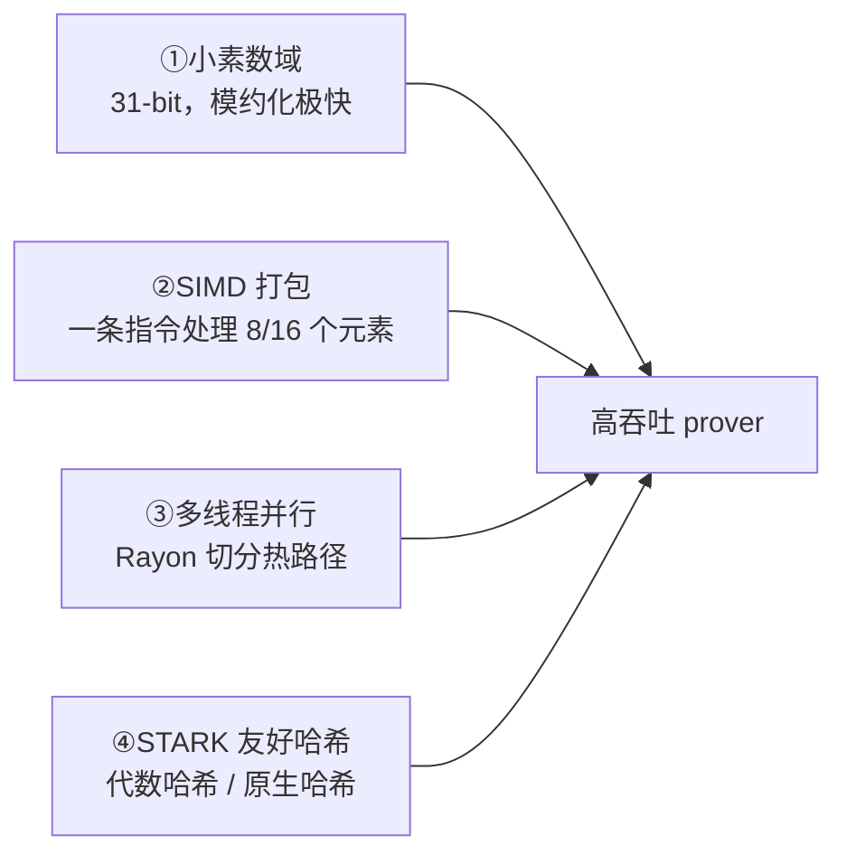

# 第九章 · 工程实现与性能

> 本章目标：从"理论上能跑"到"跑得飞快"。Plonky3 的性能并非来自某一招，而是 SIMD 打包 + 多线程并行 + 精选哈希 + 小域算术的系统叠加。本章也给出"怎么把它跑起来"的实操指引。

---

## 9.1 性能的四大支柱



### 9.1.1 小素数域算术

第三章已讲：31-bit 域的模加减乘能用机器整数高效完成，且 Mersenne31 的约化是近乎免费的位运算（`x = (x >> 31) + (x & p)`）。这是 prover 全程域运算的底座。

### 9.1.2 SIMD 打包（`PackedField`）

第三章 3.6 节讲过：`PackedField` 让"一个打包值装多个标量"。一条 256-bit AVX2 指令同时处理 **8 个** 31-bit 元素；AVX-512（512-bit）则 **16 个**；ARM NEON（128-bit）4 个。`field/src/packed/mod.rs` 按 CPU 特性条件编译后端：

```rust
// 概念性：实际按 cfg_feature 分模块
#[cfg(feature = "x86_64_avx")] mod x86_64_avx;   // AVX2 / AVX-512
#[cfg(feature = "aarch64_neon")] mod aarch64_neon;
#[cfg(not(...))] mod no_packing;                  // 标量回退
```

关键认知：**不开 SIMD，性能直接掉一个数量级**。所以示例命令强调 `RUSTFLAGS="-Ctarget-cpu=native"`。

### 9.1.3 多线程并行（Rayon）

证明里几个最耗时的步骤（LDE、Merkle 建树、商多项式求值、FRI 折叠）天然可并行。Plonky3 用 `p3-maybe-rayon` 封装 Rayon，在 `parallel` feature 开启时分片并行，否则单线程回退。比如 `Radix2DitParallel`（第四章）就是把各蝶形层分块并行执行。

### 9.1.4 STARK 友好的哈希

STARK 几乎不用椭圆曲线，而用**哈希**做承诺（Merkle 树）和 Fiat–Shamir。哈希选择影响巨大：

- **代数哈希**（Poseidon2、Rescue、Monolith）：在**同一个域**上运算，与 trace 算术融合，无域转换开销，prover 快；但 gate/约束数较多；
- **原生哈希**（Keccak-256、SHA-256、BLAKE3）：与现实哈希标准对齐（递归/rollup 里常需"真实"Keccak），但做 AIR 时约束量大。

Plonky3 提供完整生态（见 9.3）。

---

## 9.2 `target-cpu=native` 为什么是必须的

不开时，编译器不会发出 AVX2/AVX-512/NEON 指令，`PackedField` 退化成标量回退（`no_packing`），8 倍并行红利消失。所以：

```bash
# 生产 / 基准：必须
RUSTFLAGS="-Ctarget-cpu=native" cargo run --example prove_prime_field_31 --release

# 仅功能验证（不在乎速度）可省略，但会慢得多
cargo run --example prove_prime_field_31 --release
```

`--release` 同样必须：debug 模式不做优化，慢到无法用于真实规模。

---

## 9.3 哈希函数生态一览

Plonky3 的哈希 crate 分两类，每类都带一个 `*-air` 配套（即该哈希的 AIR 实现，可直接当电路证明）：

| crate | 类型 | 说明 |
|---|---|---|
| `p3-poseidon2` / `p3-poseidon2-air` | 代数 | Poseidon2，当前主流 STARK 友好哈希，prover 快 |
| `p3-poseidon1` / `p3-poseidon1-air` | 代数 | Poseidon v1（旧版） |
| `p3-rescue` | 代数 | Rescue / Rescue-Prime |
| `p3-monolith` / `p3-monolith-air` | 代数 | Monolith，针对硬件/证明优化 |
| `p3-blake3` / `p3-blake3-air` | 原生 | BLAKE3，带 small-leaf 优化 |
| `p3-keccak` / `p3-keccak-air` | 原生 | Keccak-256（以太坊 SHA-3） |
| `p3-sha256` / `p3-sha256-air` | 原生 | SHA-256 |

`p3-symmetric` 提供共用原语（海绵 `PaddingFreeSponge`、截断置换 `TruncatedPermutation` 等），`p3-merkle-tree` 在其上构建 `MerkleTreeMmcs`。

选型直觉：

- **纯性能、自闭合系统** → Poseidon2（与域同构，零跨域开销）；
- **需要与现实哈希对齐**（如递归证明里验证以太坊 Keccak）→ Keccak-256；
- **兼顾** → BLAKE3（快、且 small-leaf 优化减小 Merkle 叶子）。

---

## 9.4 把它跑起来：examples 实操

仓库的 `examples` crate 提供了端到端可运行的证明。最常被引用的是 `prove_prime_field_31`：用 Mersenne31 证明大量哈希置换（Poseidon2 / Keccak / BLAKE3 等）。

```bash
git clone https://github.com/Plonky3/Plonky3
cd Plonky3
RUSTFLAGS="-Ctarget-cpu=native" cargo run --example prove_prime_field_31 --release
```

参数化的 benchmark 还允许通过命令行选择**域 × 哈希 × DFT × PCS**，方便横向对比：

```bash
# 概念性：具体 flag 以仓库 examples/README 为准
RUSTFLAGS="-Ctarget-cpu=native" cargo run --release --example <bench> -- \
    --field baby_bear --hash poseidon2 --pcs fri --dft radix2
```

### 9.4.1 自己写一个 AIR 并证明的最小骨架

1. 定义结构体，实现 `BaseAir<F>`（至少 `width`）；
2. 实现 `Air<AB>`（写 `eval`，用 `builder.main()`、`when_transition()`、`assert_eq` 等，见第五章）；
3. 构造 trace 矩阵 `RowMajorMatrix`；
4. 组装 `StarkConfig`（选域/哈希/PCS，见第二章 2.5）；
5. 调 `prove(...)` 得 `Proof`，再调 `verify(...)` 校验。

```rust
// 伪代码骨架
let config = StarkConfig::new(pcs, challenger);          // PCS+Challenger 组装
let proof = prove(&config, &my_air, trace, &public_values);
verify(&config, &my_air, &proof, &public_values).unwrap();
```

---

## 9.5 性能调优清单

实际接入时，按这个清单逐项确认：

| 项 | 检查 |
|---|---|
| 编译 | `RUSTFLAGS="-Ctarget-cpu=native"` + `--release` |
| SIMD | 确认运行机有 AVX2/AVX-512/NEON；否则降级明显 |
| 并行 | 开 `parallel` feature；热路径用 Rayon |
| 域 | 默认 Mersenne31/BabyBear；不要用 64-bit 域除非必要 |
| 哈希 | 内部承诺用 Poseidon2；递归/对外用 Keccak/Blake3 |
| FRI 参数 | `log_blowup`、`num_queries` 按目标安全比特推导，别用 testing 预设 |
| trace 宽度 | 列数直接影响承诺/求值开销；合并可合并的列 |
| 下一行列 | 用 `main_next_row_columns` 只声明真正需要下一行的列，省打开 |

---

## 9.6 小结

- Plonky3 的快 = 小域 + SIMD + 并行 + 友好哈希 的系统叠加；
- `target-cpu=native` + `--release` 是性能的**硬前提**；
- 哈希在"代数（Poseidon2，快）"与"原生（Keccak/Blake3，标准对齐）"间权衡；
- 自定义 AIR 只需实现 `BaseAir` + `Air::eval`，其余由框架装配。

最后一章，我们把 Plonky3 放进更大的生态里横向对比，并给出选型建议、安全注意事项与参考资料。
