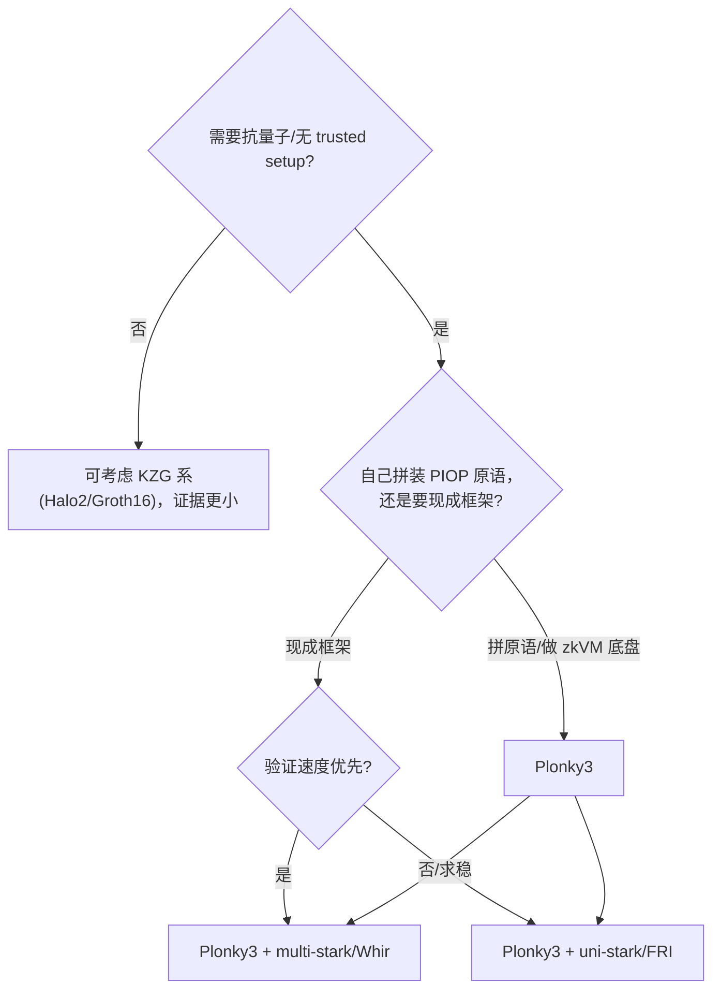

# 第十章 · 深入对比与实践

> 本章目标：把 Plonky3 放进更大的证明系统生态里横向定位，讲清安全注意事项、参数权衡与选型建议，并汇总全部参考资料，作为这份指南的收尾。

---

## 10.1 Plonky3 vs 其他证明系统

| 维度 | **Plonky3** | Plonky2 | Halo2 | Groth16 |
|---|---|---|---|---|
| 路线 | STARK 工具包（PIOP 原语） | STARK 证明系统 | PLONKish + 多项式承诺 | 配对-based SNARK |
| 承诺 | 哈希/FRI/STIR/Whir（透明） | 哈希/FRI | KZG（需 trusted setup）或 IPA | KZG（trusted setup） |
| 抗量子 | ✅ | ✅ | ❌（KZG）/✅（IPA） | ❌ |
| 可信设置 | ❌ 无 | ❌ 无 | KZG 需要 / IPA 不需要 | 需要（每电路） |
| 域 | 小域（M31/BabyBear/...）+ 扩域 | Goldilocks | BN254 标量域（大域） | BN254 等 |
| 模块化 | 极高（trait 解耦，可换域/哈希/PCS） | 中（一体化） | 中（电路 + arithmetization） | 低（固定协议） |
| 证据大小 | 中（STARK 量级，几万~几十万字节） | 中 | 小（KZG，常数级） | 极小（~200B） |
| 验证速度 | 快（polylog~log） | 快 | 快（KZG 常数） | 极快（常数） |
| 适合 | zkVM 底盘、高性能 STARK 后端 | Plonky2 时代 zkVM | 以太坊 zkEVM、递归 | 极致小证据场景 |

要点：

- **Plonky3 vs Plonky2**：不是升级，是重构。更小域（31-bit vs 64-bit）、更清晰 trait、更现代 PCS（STIR/Whir）、circle STARK 支持。Plonky3 更像一个"零件库"，Plonky2 更像一个"成品框架"。
- **Plonky3 vs Halo2/Groth16**：路线根本不同。Plonky3 走透明、后量子的哈希路线，证据大一些但无需 trusted setup、抗量子；Halo2/Groth16 走椭圆曲线路线，证据小但需设置、不抗量子。常被组合使用：**用 STARK（Plonky3）证明大计算，再用 Groth16 把 STARK 证据"包装"成极小的 SNARK 证据上链**（递归/SNARK wrapping）。Plonky3 的 `p3-bn254` crate 就是为这种"包装"准备的。

---

## 10.2 安全性：审计与已知坑

Plonky3 经过 **Least Authority** 的安全审计（报告见 `audits/` 目录）。使用时务必注意以下几点：

### 10.2.1 验证器可能 panic

README 明确警告：**"验证器在某些畸形证据上可能 panic"**。如果你的系统要验证**不受信任方**提交的证据，**必须**把 `verify` 包在 `catch_unwind` 里：

```rust
use std::panic::catch_unwind;
let result = catch_unwind(|| verify(&config, &air, &untrusted_proof, &pv));
match result {
    Ok(Ok(())) => { /* 验证通过 */ }
    Ok(Err(e)) => { /* 验证失败（正常拒绝） */ }
    Err(_)     => { /* panic：当作验证失败处理，切勿让进程崩溃 */ }
}
```

不这样做，恶意证据可能用 panic 发起**拒绝服务**。

### 10.2.2 参数必须认真推导

`FriParameters::new_testing` 是**仅供测试**的弱参数（`num_queries=2`）。生产必须按目标安全比特数（如 100+）认真推导 `log_blowup` × `num_queries` + PoW，并考虑：

- **猜想 vs 证明的可靠性界**（ethSTARK 猜想 vs Proximity Gaps 的证明界，后者更保守）；
- **域大小**：基域太小时，挑战熵不足，需更大扩域或更多查询；
- **Fiat–Shamir 哈希强度**：必须用足够强的哈希（Keccak/Poseidon2 等），并保证 transcript 顺序严格一致。

### 10.2.3 开发状态

Plonky3 仍在演进，部分特性标记为 planned/experimental（如某些 adapter、tensor PCS）。升级版本时务必读 `CHANGELOG.md`，trait 签名可能调整。

---

## 10.3 参数权衡速查

面对一个新场景，几个旋钮的取舍：

| 想要 | 调哪个 | 代价 |
|---|---|---|
| 更可靠（更多安全比特） | ↑ `num_queries`、↑ `pow_bits`、↓ 码率（↑ `log_blowup`） | 证据更大、证明更慢 |
| 更小证据 | ↓ 码率换更高每查询比特，或换 STIR/Whir（更少查询达同等安全） | prover 复杂度上升 |
| 更快 prover | 用更小域（M31/BabyBear）、开 SIMD/并行、用 Poseidon2 | 哈希可能不与现实对齐 |
| 更快 verifier | 用 Whir（$O(\log n)$） | 多线性栈更复杂 |
| 真正零知识 | 开 ZK PCS（`hiding_pcs` 或 `HidingWhirPcs`） | 证明略大、prover 略慢 |
| 域无关/线性 prover | 用 Brakedown（`zk-codes`） | 证据明显变大 |

---

## 10.4 选型决策树



---

## 10.5 常见误区清单

1. ❌ "Plonky3 是一个 zkVM" → ✅ 它是 PIOP **原语工具包**，zkVM 建在它之上。
2. ❌ "BabyBear = 31·2²⁷+1" → ✅ = $2^{31}-2^{27}+1$。
3. ❌ "Mersenne31 用不了 FFT" → ✅ 基域标准 FFT 不行，但 **circle FFT** 可以（circle 群 2-adicity=31）。
4. ❌ "STARK 用椭圆曲线" → ✅ STARK 用**哈希 + 小域多项式**，不用椭圆曲线（除非做 SNARK 包装）。
5. ❌ "验证器永远安全" → ✅ 对**不受信任**证据，`verify` 要包 `catch_unwind`。
6. ❌ "FRI 参数随便填" → ✅ 必须按安全比特数认真推导，testing 预设仅供测试。

---

## 10.6 参考资料

### 10.6.1 Plonky3 源码（`main` 分支）

- 仓库：https://github.com/Plonky3/Plonky3
- 域：`field/`、`mersenne-31/`、`baby-bear/`、`koala-bear/`、`goldilocks/`、`monty-31/`
- 变换：`dft/`、`interpolation/`
- AIR：`air/src/air.rs`、`air/src/builder.rs`、`air/src/check_constraints.rs`
- 承诺：`commit/src/{mmcs.rs, pcs/univariate.rs, pcs/multilinear.rs}`、`fri/src/{config.rs, proof.rs, prover.rs, verifier.rs, two_adic_pcs.rs}`、`stir/`、`whir/`、`merkle-tree/`、`zk-codes/`
- 证明系统：`uni-stark/src/{config.rs, prover.rs, verifier.rs, folder.rs}`、`multi-stark/`、`batch-stark/`
- 辅助：`sumcheck/`、`lookup/`、`challenger/`
- 审计：`audits/`

### 10.6.2 论文（按主题）

- **FRI / 低度测试** — Ben-Sasson et al., *Fast RS-IOPP*, ICALP 2018（§2.1.1 的 `H_in==H_fold` 校验）。
- **DEEP-FRI** — Ben-Sasson, Goldberg, Kopparty, Saraf, *Sampling Outside the Box Improves Soundness*, eprint **2019/336**。
- **FRI 查询复杂度** — Arnon, Chiesa, Levinson, Spooner, *On the Query Complexity of FRI*。
- **ethSTARK**（猜想可靠性界） — eprint **2021/582**。
- **Proximity Gaps for Reed–Solomon Codes** — Ben-Sasson et al., eprint **2020/654**。
- **STIR** — Arnon, Chiesa, Leventis, Spooner, CRYPTO 2024, eprint **2024/390**。
- **Whir** — Arnon, Chiesa, Fenzi, Yogev, EUROCRYPT 2025, eprint **2024/1586**。
- **LogUp** — Haböck, *Lookup Arguments based on Logarithmic Derivatives*, eprint **2022/1530**。
- **Circle STARK** — *Reed–Solomon Codes over the Circle Group*, eprint **2023/824**。
- **Brakedown** — Golovnev, Lee, Setty, Thaler, Wahby, eprint **2021/1043**。
- **Basefold** — eprint **2023/1705**。
- **FRI 总结（非正式）** — Haböck, eprint **2022/1216**。

### 10.6.3 延伸阅读（博客/讲义）

- Lita 文档 · Proving System: Plonky3
- CertiK · *Breaking Down Proof Construction in Plonky3 (Fibonacci)*
- Berkeley ZKP Course · *FRI-based Polynomial Commitments and Fiat-Shamir*
- ZK Security · *Circle STARKs Part I: Mersenne*
- ChainSafe R&D · *Yet another circle STARK tutorial*
- Vitalik · *Binius & small-field proofs* 系列

---

## 10.7 结语

Plonky3 的价值不在于"它是某个最快的证明系统"，而在于**它把当代 STARK 的几乎全部关键技巧，以工程上最干净的方式解耦成可组合的零件**：

- 用**小域 + 扩域**兼顾速度与安全；
- 用 **circle STARK** 让 Mersenne31 也能做 FFT；
- 用 **AIR + 多态 eval** 把电路与协议解耦；
- 用 **PCS/FRI/DEEP** 把"承诺"和"低度"统一起来；
- 用 **sumcheck/LogUp/Challenger** 把交互压成非交互、把查找变成代数；
- 用 **SIMD + 并行 + 友好哈希** 把理论性能兑现成实测性能。

读到这里，你已经掌握了从地基（域）到塔尖（完整 STARK 流水线）的全链路。下一步建议：**clone 仓库，按第九章的步骤把 `prove_prime_field_31` 跑起来，再挑一个 `*-air` crate 读懂它的 `eval`**——把这份概念地图，对照真实代码走一遍，是最扎实的巩固。

> 祝你在零知识证明的世界里，少走弯路。
