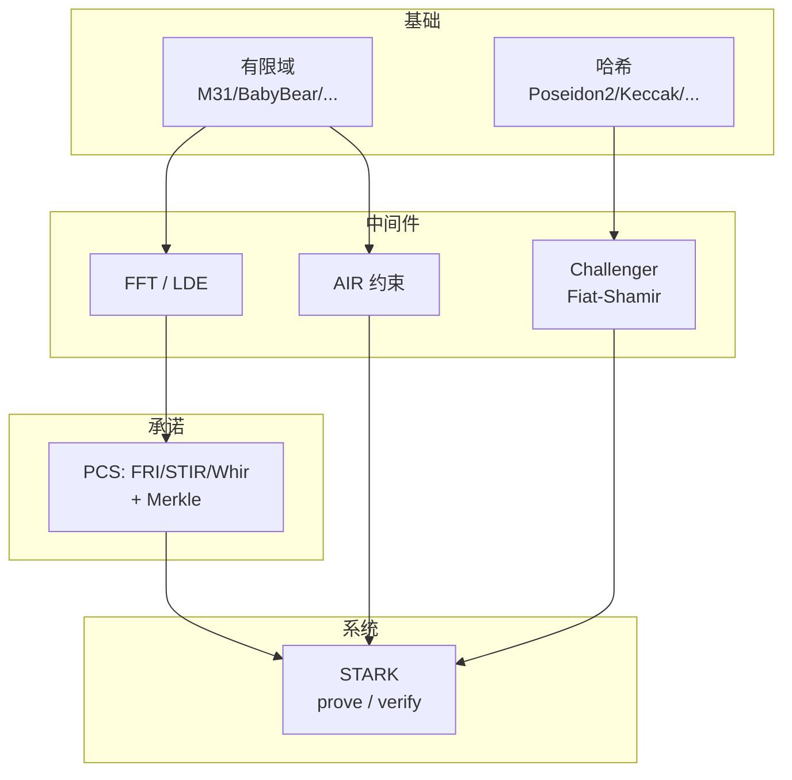

# Plonky3 深入讲解（中文指南）

> 一份从**地基到塔尖**的 Plonky3 中文技术指南。覆盖零知识证明背景、整体架构、有限域、多项式与 FFT、AIR、多项式承诺与 FRI、STARK 完整证明流水线、sumcheck/lookup/Fiat–Shamir，直到工程性能与横向选型。图文并茂，所有代码块引用 Plonky3 `main` 分支真实 trait/函数。

---

## 这是什么

[Plonky3](https://github.com/Plonky3/Plonky3) 是 Polygon Zero 团队的 Rust 工具包，提供实现**多项式 IOP（PIOP）** 的全套原语——主要服务于 STARK 类证明系统。它不是一个 zkVM，而是一组**可插拔的零件**（域 × 哈希 × 承诺方案三条正交轴线）。

本指南的目标：**用最少的密码学前置知识，带你读懂 Plonky3 的每一层**，并理解现代 STARK 工程的全貌。

---

## 目录与阅读路径

| # | 章节 | 你将学到 | 难度 |
|---|---|---|---|
| 1 | [引子：什么是 Plonky3](01-引子-什么是Plonky3.md) | ZK/STARK/SNARK、PIOP、Plonky3 定位 | ⭐ |
| 2 | [整体架构与 crate 地图](02-整体架构与crate地图.md) | workspace 分层、~30 个 crate、三条可插拔轴 | ⭐⭐ |
| 3 | [有限域](03-有限域.md) | 四个域的素数/2-adicity/扩域、circle STARK、SIMD 打包 | ⭐⭐⭐ |
| 4 | [多项式、编码与 FFT](04-多项式编码与FFT.md) | LDE/Reed–Solomon、FFT 全家桶、重心插值 | ⭐⭐⭐ |
| 5 | [AIR 代数中间表示](05-AIR代数中间表示.md) | `BaseAir`/`AirBuilder`/`Air`、一个 `eval` 三处复用 | ⭐⭐⭐ |
| 6 | [多项式承诺与 FRI](06-多项式承诺与FRI.md) | PCS 三层 trait、FRI 两阶段、DEEP-FRI、STIR/Whir/Brakedown | ⭐⭐⭐⭐ |
| 7 | [STARK 证明全流程](07-STARK证明全流程.md) | 11 步证明流水线、验证清单、multi/batch-stark | ⭐⭐⭐⭐ |
| 8 | [Sumcheck、Lookup 与 Fiat–Shamir](08-Sumcheck-Lookup与Fiat-Shamir.md) | Challenger 4 trait、sumcheck、LogUp 查找 | ⭐⭐⭐⭐ |
| 9 | [工程实现与性能](09-工程实现与性能.md) | SIMD、Rayon、哈希生态、跑通 examples | ⭐⭐ |
| 10 | [深入对比与实践](10-深入对比与实践.md) | vs Plonky2/Halo2/Groth16、安全坑、选型、参考资料 | ⭐⭐ |

### 三条推荐路径

- 🚀 **快速建立直觉**（半天）：1 → 2 → 5 → 7 → 10
- 🔬 **深入密码学**（重点）：3 → 4 → 6 → 8
- 🛠 **工程接入**（实战）：2 → 5 → 7 → 9 → 10

---

## 一张图看懂全貌

---

## 关键概念速查

| 概念 | 一句话 | 详见 |
|---|---|---|
| **PIOP** | 用多项式+承诺+随机挑战构造的证明协议 | 第 1 章 |
| **小域 + 扩域** | 小域管快、扩域管安全 | 第 3 章 |
| **2-adicity** | 域里 2-幂子群大小，决定 FFT 规模 | 第 3 章 |
| **circle STARK** | 让 2-adicity=1 的 M31 也能做 FFT | 第 3 章 |
| **LDE / Reed–Solomon** | 把多项式求值拉长，加冗余 | 第 4 章 |
| **AIR** | trace 表 + 代数约束；只写 `eval` | 第 5 章 |
| **PCS** | 承诺多项式并证明低次 | 第 6 章 |
| **FRI** | 反复折叠降次 + 随机抽查 | 第 6 章 |
| **DEEP-FRI** | 域外采样，可靠性大增 | 第 6 章 |
| **商多项式** | $C/Z_H$ 是多项式 ⟺ 约束满足 | 第 7 章 |
| **sumcheck** | 把 $2^m$ 求和逐轮归约到单点 | 第 8 章 |
| **LogUp** | 对数导数把"查表"变 sumcheck 友好 | 第 8 章 |

---

## 关于本文档

- **素材来源**：Plonky3 `main` 分支源码逐字核对 + 论文佐证（DEEP-FRI/STIR/Whir/LogUp/circle STARK 等）。
- **配图**：以**精确手绘 SVG 机制图**（FRI 折叠树、FFT 蝶形、circle 群与倍映射、扩域塔、SIMD 打包、Reed–Solomon 码率、Merkle 多重打开、DEEP 商几何、LogUp 对数导数、AIR 滑动窗口）+ **Mermaid 流程图**为主；封面等少量概念图用 **AtlasCloud openai/gpt-image-2** 生成。所有图存于 [`images/`](images/)。
- **准确性订正**：已修正网络常见误写（如 BabyBear/KoalaBear 素数、DEEP-FRI 作者归属等）。
- **配套**：建议 clone [Plonky3](https://github.com/Plonky3/Plonky3) 仓库，对照各章引用的源码路径阅读，效果最佳。

> 开始吧：从 [第一章 · 引子](01-引子-什么是Plonky3.md) 进入。
