# Redis深入分析 - 第1部分：核心架构与数据结构

## 目录
- [1. Redis简介](#1-redis简介)
- [2. 核心架构设计](#2-核心架构设计)
- [3. 底层数据结构](#3-底层数据结构)
- [4. 对象系统](#4-对象系统)

---

## 1. Redis简介

### 1.1 什么是Redis？

Redis（Remote Dictionary Server）是一个开源的内存数据结构存储系统，可以用作：
- **数据库**：持久化的键值存储
- **缓存**：高速数据访问层
- **消息队列**：发布/订阅、流处理
- **实时分析引擎**：计数器、排行榜、地理位置服务

### 1.2 核心特性

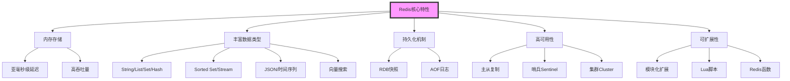

### 1.3 应用场景

| 场景 | 使用方式 | Redis数据类型 |
|------|----------|---------------|
| 会话存储 | 用户登录状态、购物车 | String, Hash |
| 缓存层 | 数据库查询结果缓存 | String, Hash |
| 排行榜 | 游戏分数、热门文章 | Sorted Set |
| 计数器 | 点赞数、浏览量 | String (INCR) |
| 实时分析 | 在线用户统计 | HyperLogLog, Bitmap |
| 消息队列 | 任务队列、事件流 | List, Stream |
| 分布式锁 | 资源互斥访问 | String (SET NX EX) |
| 地理位置 | 附近的人、配送范围 | Geo |
| 实时推荐 | 协同过滤、相似度计算 | Set, Sorted Set |

---

## 2. 核心架构设计

### 2.1 整体架构

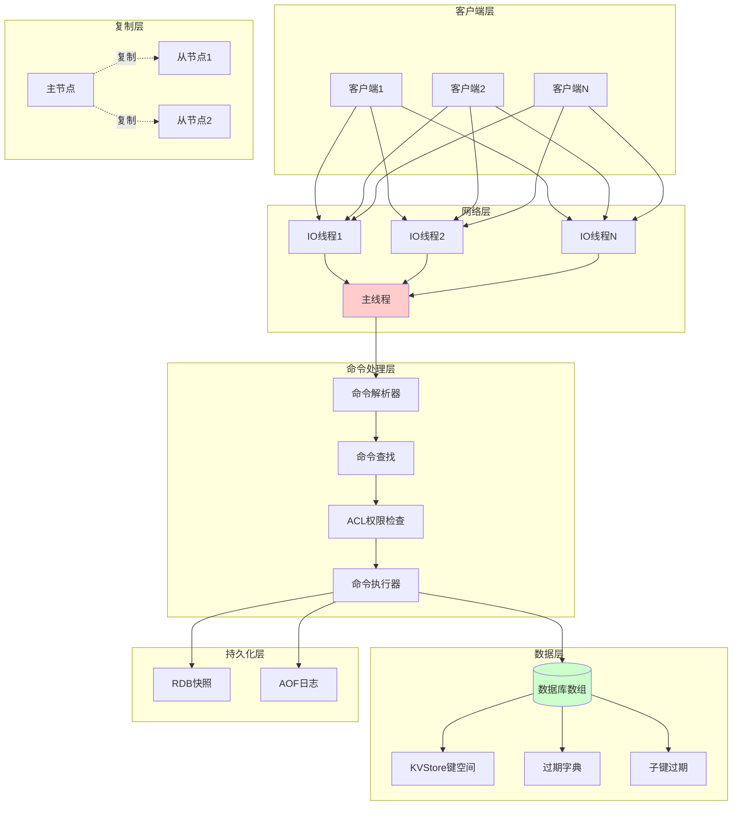

### 2.2 事件驱动模型

Redis采用单线程事件驱动模型处理命令，通过多路复用实现高并发。

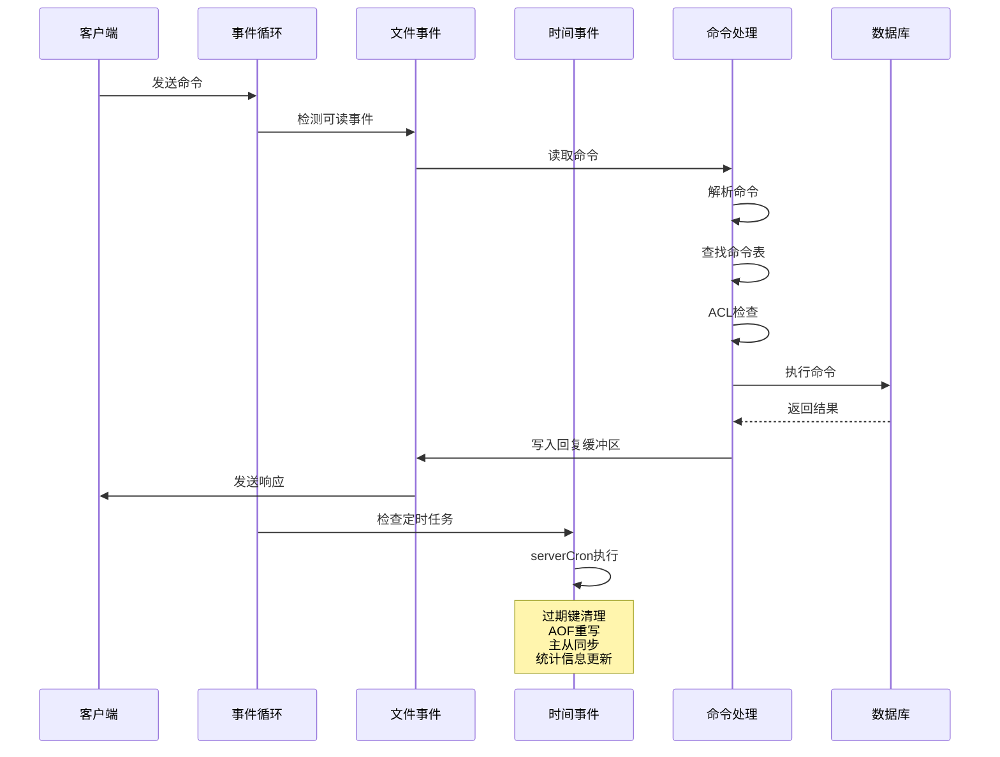

### 2.3 内存布局

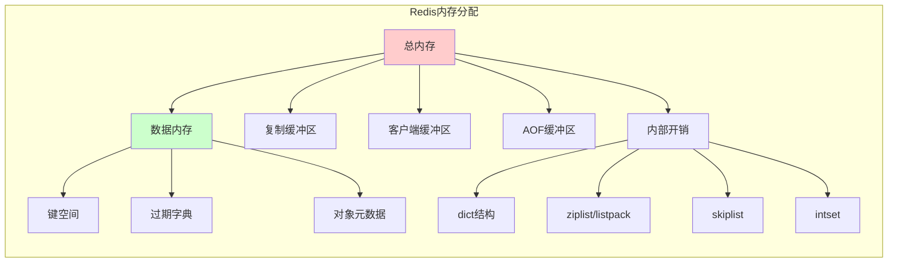

---

## 3. 底层数据结构

### 3.1 简单动态字符串 (SDS)

Redis自己实现的字符串结构，解决C字符串的问题。

```c
// SDS结构定义（简化版）
struct sdshdr {
    uint32_t len;        // 已使用长度
    uint32_t alloc;      // 分配的总长度
    unsigned char flags; // 标志位
    char buf[];          // 实际存储字符串的柔性数组
};
```

**SDS的优势：**

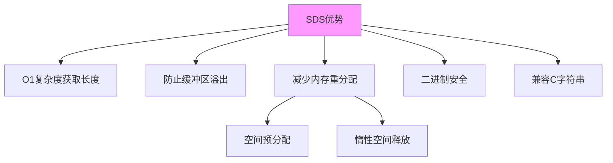

### 3.2 字典 (Dict)

Redis的核心数据结构，用于实现数据库键空间、哈希对象等。

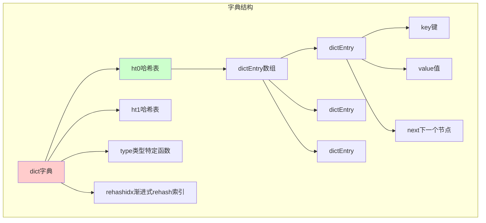

**渐进式Rehash过程：**

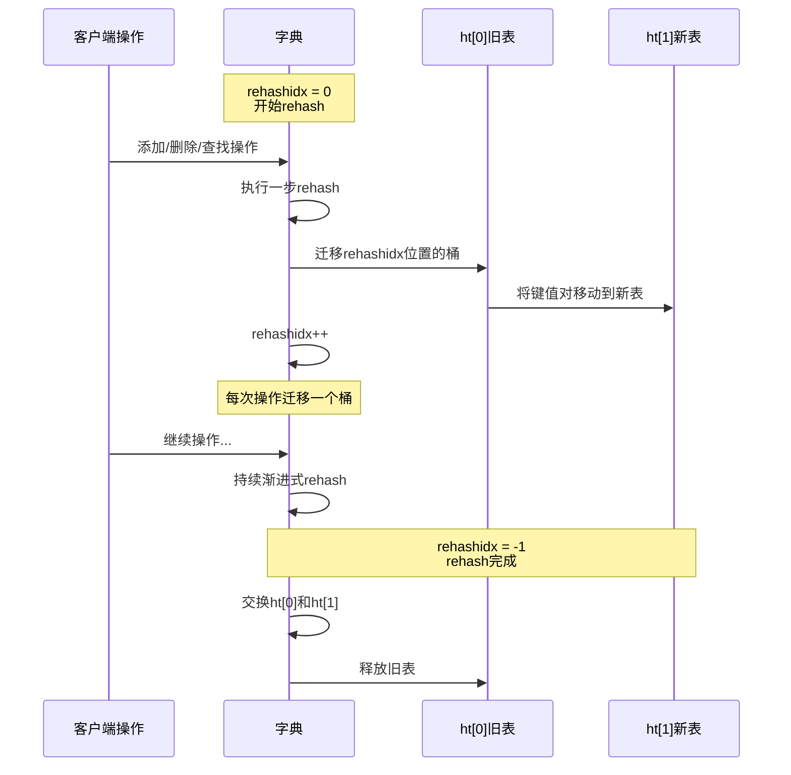

### 3.3 跳跃表 (Skip List)

有序集合的底层实现之一，支持平均O(log N)的查找性能。

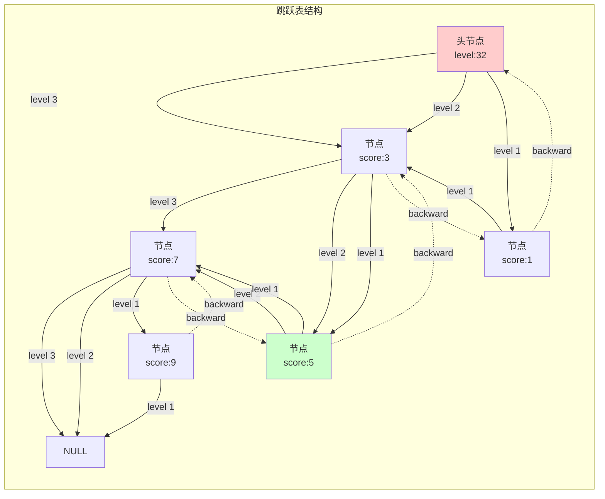

**跳跃表查找过程（查找score=5）：**

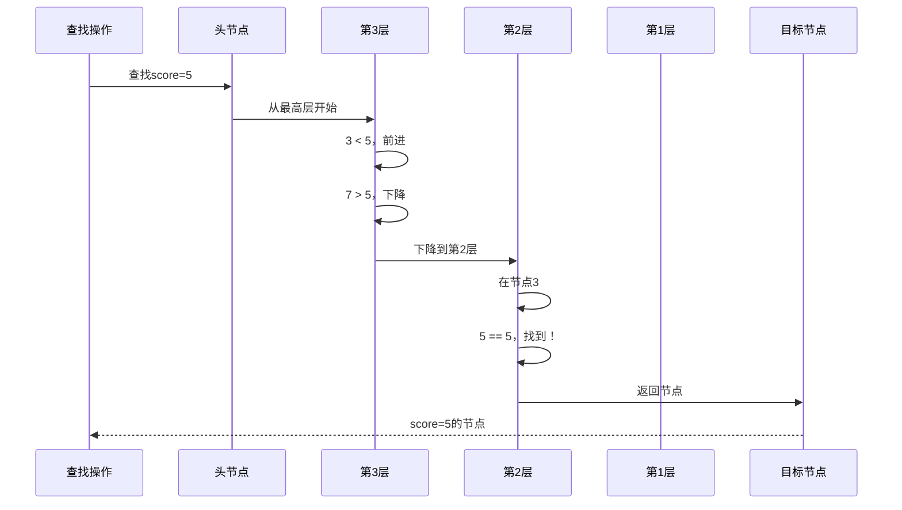

### 3.4 整数集合 (IntSet)

集合的底层实现之一，只包含整数值的集合会使用这个结构。

```c
typedef struct intset {
    uint32_t encoding;  // 编码方式：int16/int32/int64
    uint32_t length;    // 元素数量
    int8_t contents[];  // 实际存储数组（类型由encoding决定）
} intset;
```

**整数集合升级过程：**

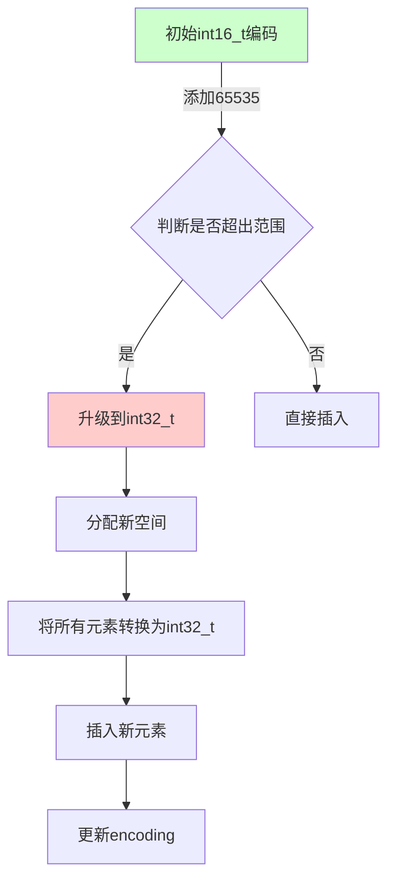

### 3.5 压缩列表 (Listpack)

Listpack是ziplist的改进版本，用于编码小的列表、哈希、有序集合。

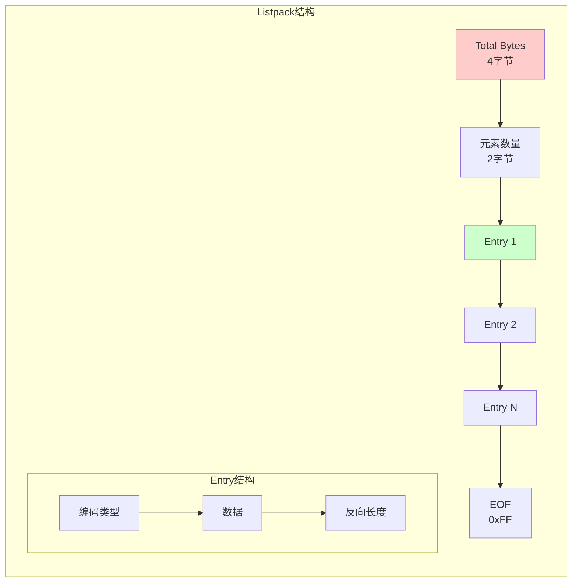

---

## 4. 对象系统

### 4.1 RedisObject结构

Redis使用对象来表示数据库中的键和值。

```c
typedef struct redisObject {
    unsigned type:4;        // 类型（string/list/set/zset/hash）
    unsigned encoding:4;    // 编码方式
    unsigned lru:24;        // LRU时间或LFU数据
    int refcount;           // 引用计数
    void *ptr;              // 指向实际数据的指针
} robj;
```

### 4.2 类型与编码

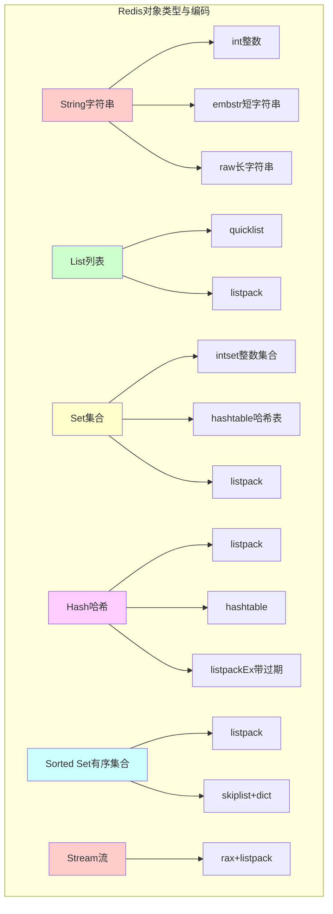

### 4.3 编码转换策略

Redis会根据数据大小和元素数量自动进行编码转换以优化内存使用。

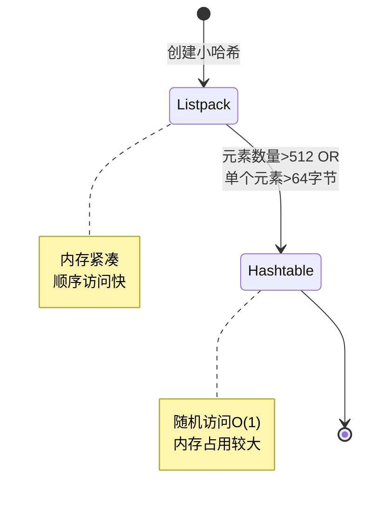

### 4.4 KVObj（键值对象）

Redis 8.0引入的优化，将键和值嵌入同一个对象中。

```c
// kvobj结构示例（概念性）
typedef struct redisObject kvobj;

// kvobj内存布局示例：
// +----------------+--------------+------------------+------------------+
// | redisObject    | 过期时间     | key字符串        | value指针        |
// | 16字节         | 8字节(可选)  | sds             | 8字节            |
// +----------------+--------------+------------------+------------------+
```

**kvobj的优势：**

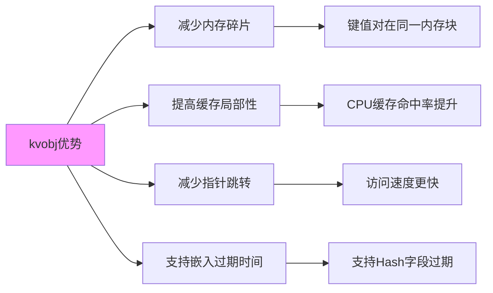

---

## 小结

第1部分介绍了Redis的核心架构和底层数据结构：

1. **整体架构**：单线程事件驱动模型 + IO多线程
2. **数据结构**：SDS、Dict、SkipList、IntSet、Listpack
3. **对象系统**：统一的对象封装和编码转换机制
4. **优化策略**：根据数据特征自动选择最优编码

下一部分将深入探讨**数据类型实现和命令处理流程**。
