# Redis深入分析 - 第2部分：数据类型与命令处理

## 目录
- [5. Redis数据类型详解](#5-redis数据类型详解)
- [6. 命令处理流程](#6-命令处理流程)
- [7. 持久化机制](#7-持久化机制)
- [8. 过期与淘汰策略](#8-过期与淘汰策略)

---

## 5. Redis数据类型详解

### 5.1 String（字符串）

String是Redis最基础的数据类型，可以存储字符串、整数或浮点数。

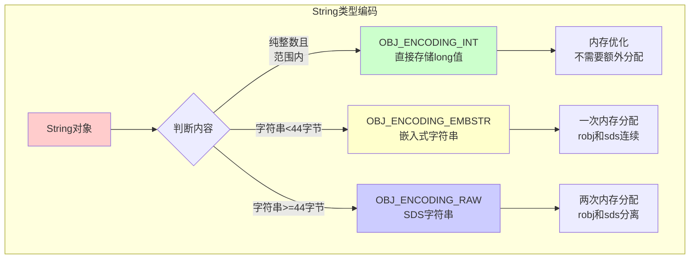
```mermaid
graph TB
    subgraph "String类型编码"
        String[String对象] --> Check{判断内容}

        Check -->|纯整数且<br/>范围内| Int[OBJ_ENCODING_INT<br/>直接存储long值]
        Check -->|字符串<44字节| Embstr[OBJ_ENCODING_EMBSTR<br/>嵌入式字符串]
        Check -->|字符串>=44字节| Raw[OBJ_ENCODING_RAW<br/>SDS字符串]

        Int --> IntOpt[内存优化<br/>不需要额外分配]
        Embstr --> EmbOpt[一次内存分配<br/>robj和sds连续]
        Raw --> RawOpt[两次内存分配<br/>robj和sds分离]
    end

    style String fill:#ffcccc
    style Int fill:#ccffcc
    style Embstr fill:#ffffcc
    style Raw fill:#ccccff
```

**String常用命令示例：**

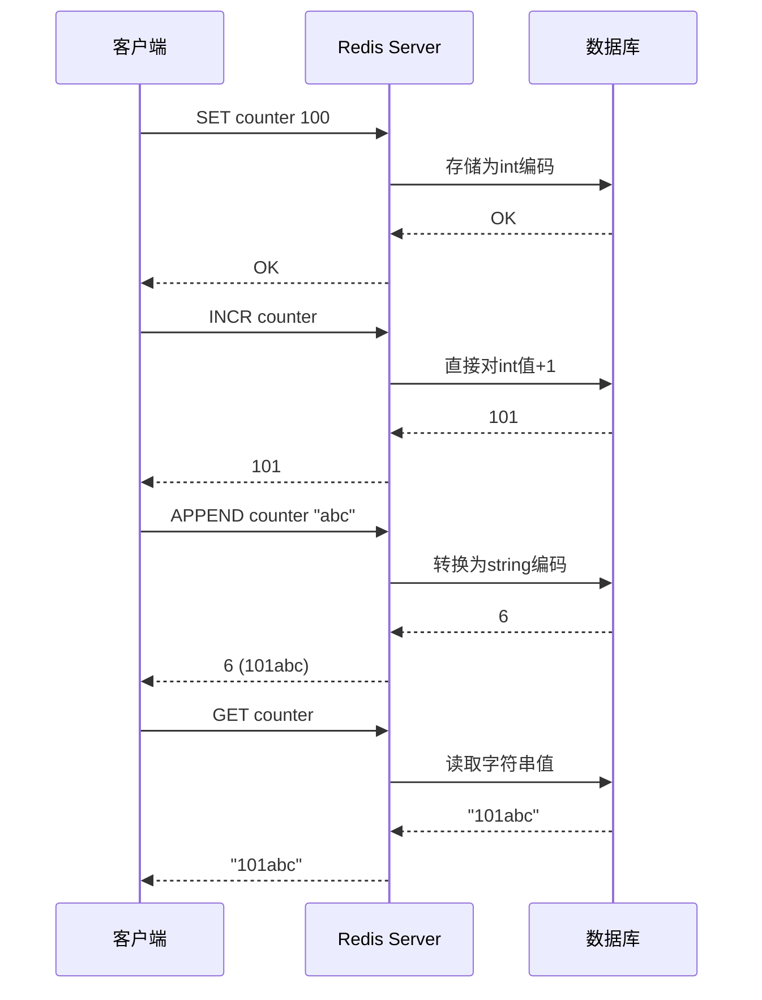
```mermaid
sequenceDiagram
    participant C as 客户端
    participant R as Redis Server
    participant DB as 数据库

    C->>R: SET counter 100
    R->>DB: 存储为int编码
    DB-->>R: OK
    R-->>C: OK

    C->>R: INCR counter
    R->>DB: 直接对int值+1
    DB-->>R: 101
    R-->>C: 101

    C->>R: APPEND counter "abc"
    R->>DB: 转换为string编码
    DB-->>R: 6
    R-->>C: 6 (101abc)

    C->>R: GET counter
    R->>DB: 读取字符串值
    DB-->>R: "101abc"
    R-->>C: "101abc"
```

**String应用场景：**

| 场景 | 命令 | 示例 |
|------|------|------|
| 缓存 | GET/SET | `SET user:1000 '{"name":"张三"}'` |
| 计数器 | INCR/DECR | `INCR page:view:count` |
| 分布式锁 | SET NX EX | `SET lock:resource 1 NX EX 30` |
| 限流器 | INCR + EXPIRE | `INCR api:rate:limit:user:1000` |
| 位图 | SETBIT/GETBIT | `SETBIT user:sign:2024:1 100 1` |
| Session存储 | GET/SET | `SET session:abc123 '...' EX 3600` |

### 5.2 List（列表）

List是简单的字符串列表，按照插入顺序排序。

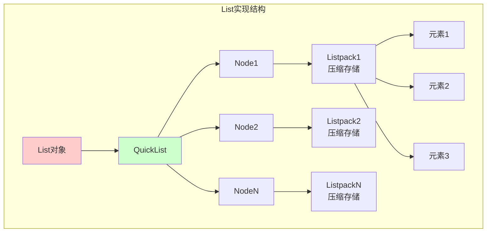
```mermaid
graph TB
    subgraph "List实现结构"
        ListObj[List对象] --> QL[QuickList]
        QL --> Node1[Node1]
        QL --> Node2[Node2]
        QL --> Node3[NodeN]

        Node1 --> LP1[Listpack1<br/>压缩存储]
        Node2 --> LP2[Listpack2<br/>压缩存储]
        Node3 --> LP3[ListpackN<br/>压缩存储]

        LP1 --> E1[元素1]
        LP1 --> E2[元素2]
        LP1 --> E3[元素3]
    end

    style ListObj fill:#ffcccc
    style QL fill:#ccffcc
```

**QuickList特性：**
- 双向链表的节点，每个节点是一个listpack
- 平衡了内存占用和访问性能
- 支持配置每个节点的大小和压缩级别

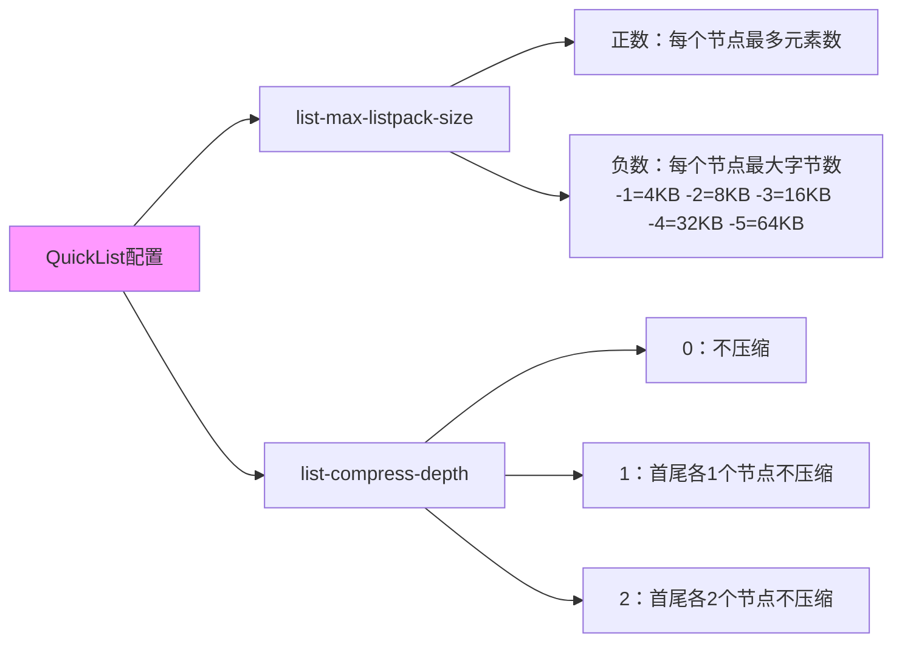
```mermaid
graph LR
    A[QuickList配置] --> B[list-max-listpack-size]
    A --> C[list-compress-depth]

    B --> B1[正数：每个节点最多元素数]
    B --> B2[负数：每个节点最大字节数<br/>-1=4KB -2=8KB -3=16KB -4=32KB -5=64KB]

    C --> C1[0：不压缩]
    C --> C2[1：首尾各1个节点不压缩]
    C --> C3[2：首尾各2个节点不压缩]

    style A fill:#f9f
```

**List操作流程：**

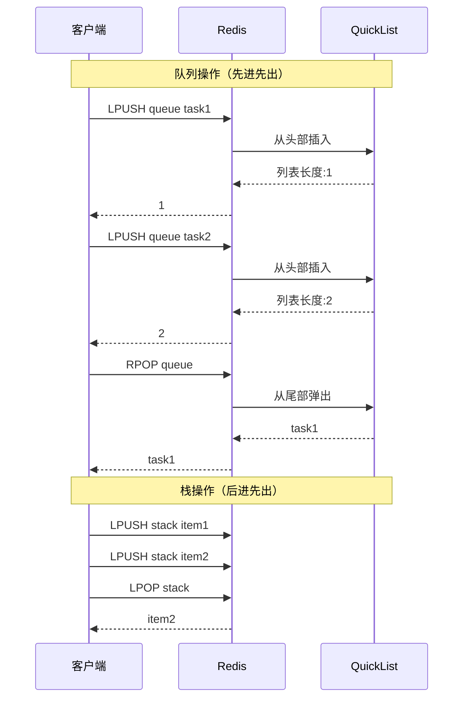
```mermaid
sequenceDiagram
    participant C as 客户端
    participant R as Redis
    participant L as QuickList

    Note over C,L: 队列操作（先进先出）

    C->>R: LPUSH queue task1
    R->>L: 从头部插入
    L-->>R: 列表长度:1
    R-->>C: 1

    C->>R: LPUSH queue task2
    R->>L: 从头部插入
    L-->>R: 列表长度:2
    R-->>C: 2

    C->>R: RPOP queue
    R->>L: 从尾部弹出
    L-->>R: task1
    R-->>C: task1

    Note over C,L: 栈操作（后进先出）

    C->>R: LPUSH stack item1
    C->>R: LPUSH stack item2
    C->>R: LPOP stack
    R-->>C: item2
```

**List应用场景：**

| 场景 | 实现方式 | 命令示例 |
|------|----------|----------|
| 消息队列 | LPUSH + BRPOP | `LPUSH queue:task '...'`<br/>`BRPOP queue:task 0` |
| 时间线/Feed流 | LPUSH + LRANGE | `LPUSH timeline:user:1000 post_id`<br/>`LRANGE timeline:user:1000 0 9` |
| 最新N条记录 | LPUSH + LTRIM | `LPUSH logs:error "..."`<br/>`LTRIM logs:error 0 999` |
| 栈 | LPUSH + LPOP | 后进先出操作 |

### 5.3 Hash（哈希）

Hash是一个string类型的field和value的映射表，特别适合存储对象。

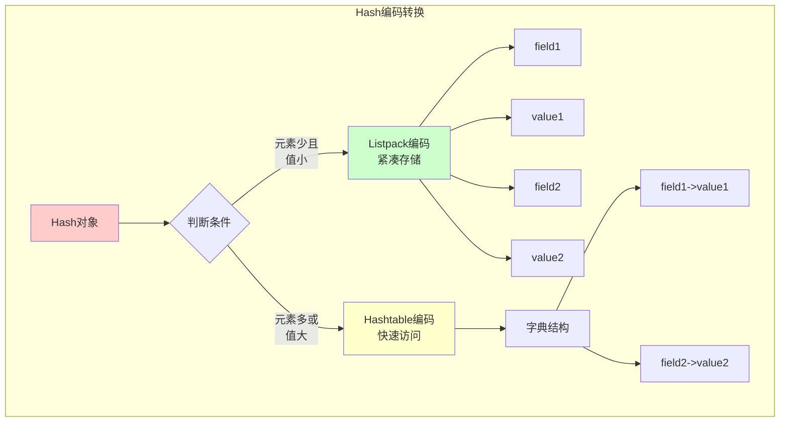
```mermaid
graph TB
    subgraph "Hash编码转换"
        HashObj[Hash对象] --> Check{判断条件}

        Check -->|元素少且<br/>值小| LP[Listpack编码<br/>紧凑存储]
        Check -->|元素多或<br/>值大| HT[Hashtable编码<br/>快速访问]

        LP --> LP1[field1]
        LP --> LP2[value1]
        LP --> LP3[field2]
        LP --> LP4[value2]

        HT --> Dict[字典结构]
        Dict --> Entry1[field1->value1]
        Dict --> Entry2[field2->value2]
    end

    style HashObj fill:#ffcccc
    style LP fill:#ccffcc
    style HT fill:#ffffcc
```

**Hash字段过期（HFE）新特性：**

Redis 7.4+支持Hash字段级别的过期时间。

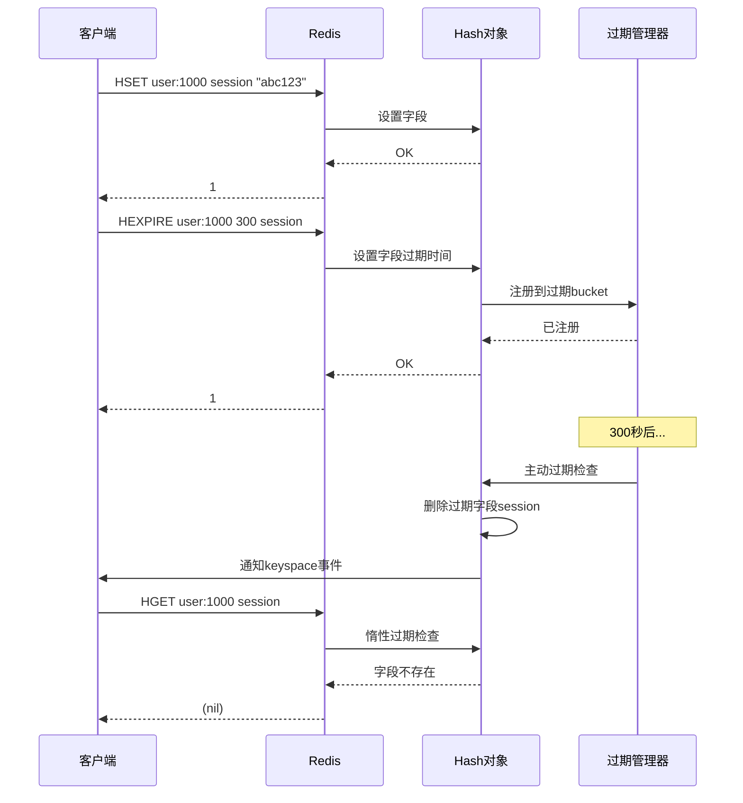
```mermaid
sequenceDiagram
    participant C as 客户端
    participant R as Redis
    participant H as Hash对象
    participant E as 过期管理器

    C->>R: HSET user:1000 session "abc123"
    R->>H: 设置字段
    H-->>R: OK
    R-->>C: 1

    C->>R: HEXPIRE user:1000 300 session
    R->>H: 设置字段过期时间
    H->>E: 注册到过期bucket
    E-->>H: 已注册
    H-->>R: OK
    R-->>C: 1

    Note over E: 300秒后...

    E->>H: 主动过期检查
    H->>H: 删除过期字段session
    H->>C: 通知keyspace事件

    C->>R: HGET user:1000 session
    R->>H: 惰性过期检查
    H-->>R: 字段不存在
    R-->>C: (nil)
```

**Hash应用场景：**

| 场景 | 优势 | 命令示例 |
|------|------|----------|
| 存储对象 | 结构化，易修改单个字段 | `HSET user:1000 name "张三" age 25` |
| 购物车 | 商品ID作为field | `HINCRBY cart:user:1000 product:123 1` |
| Session存储 | 字段级别操作 | `HSET session:abc token "..." HEXPIRE session:abc 3600 token` |
| 统计数据 | 多维度计数 | `HINCRBY stats:page:view today 1` |
| 配置管理 | 分组存储配置项 | `HSET config:app db.host "localhost"` |

### 5.4 Set（集合）

Set是String类型的无序集合，不允许重复元素。

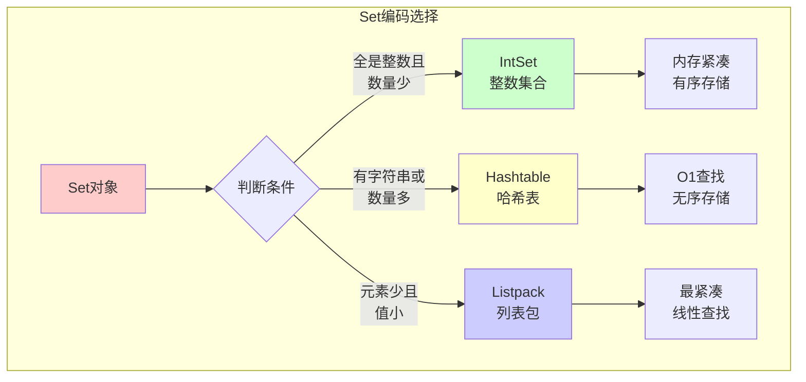
```mermaid
graph TB
    subgraph "Set编码选择"
        SetObj[Set对象] --> Check{判断条件}

        Check -->|全是整数且<br/>数量少| IS[IntSet<br/>整数集合]
        Check -->|有字符串或<br/>数量多| HT[Hashtable<br/>哈希表]
        Check -->|元素少且<br/>值小| LP[Listpack<br/>列表包]

        IS --> Compact[内存紧凑<br/>有序存储]
        HT --> Fast[O1查找<br/>无序存储]
        LP --> Small[最紧凑<br/>线性查找]
    end

    style SetObj fill:#ffcccc
    style IS fill:#ccffcc
    style HT fill:#ffffcc
    style LP fill:#ccccff
```

**Set集合运算：**

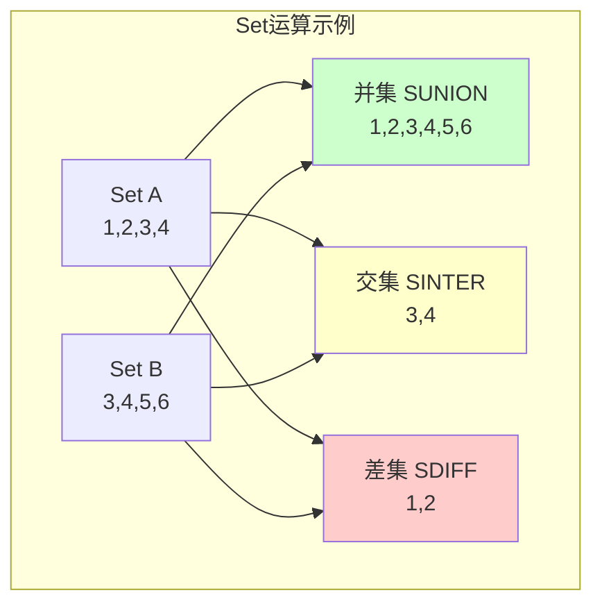
```mermaid
graph TB
    subgraph "Set运算示例"
        SetA[Set A<br/>1,2,3,4]
        SetB[Set B<br/>3,4,5,6]

        SetA --> Union[并集 SUNION<br/>1,2,3,4,5,6]
        SetB --> Union

        SetA --> Inter[交集 SINTER<br/>3,4]
        SetB --> Inter

        SetA --> Diff[差集 SDIFF<br/>1,2]
        SetB --> Diff
    end

    style Union fill:#ccffcc
    style Inter fill:#ffffcc
    style Diff fill:#ffcccc
```

**Set应用场景：**

| 场景 | 实现方式 | 命令示例 |
|------|----------|----------|
| 标签系统 | 用户ID对应标签集合 | `SADD user:1000:tags "编程" "音乐"` |
| 共同好友 | 集合交集 | `SINTER friends:user:1000 friends:user:2000` |
| 黑名单 | 快速判断存在性 | `SISMEMBER blacklist:ip "192.168.1.1"` |
| 去重计数 | 自动去重特性 | `SADD unique:visitors:20240101 user_id` |
| 抽奖系统 | 随机弹出元素 | `SPOP lottery:users` |

### 5.5 Sorted Set（有序集合）

Sorted Set在Set基础上为每个元素关联一个分数（score），用于排序。

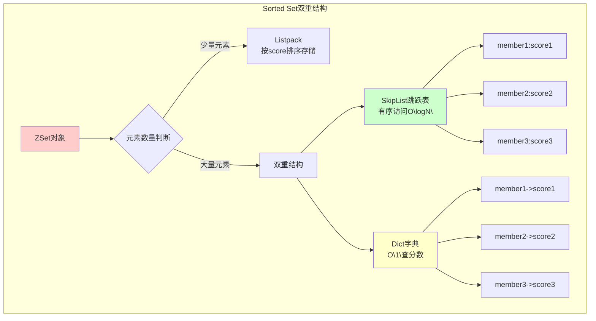
```mermaid
graph TB
    subgraph "Sorted Set双重结构"
        ZSetObj[ZSet对象] --> Check{元素数量判断}

        Check -->|少量元素| LP[Listpack<br/>按score排序存储]
        Check -->|大量元素| Dual[双重结构]

        Dual --> SL[SkipList跳跃表<br/>有序访问O\logN\]
        Dual --> Dict[Dict字典<br/>O\1\查分数]

        SL --> Node1[member1:score1]
        SL --> Node2[member2:score2]
        SL --> Node3[member3:score3]

        Dict --> KV1[member1->score1]
        Dict --> KV2[member2->score2]
        Dict --> KV3[member3->score3]
    end

    style ZSetObj fill:#ffcccc
    style SL fill:#ccffcc
    style Dict fill:#ffffcc
```

**Sorted Set范围查询：**

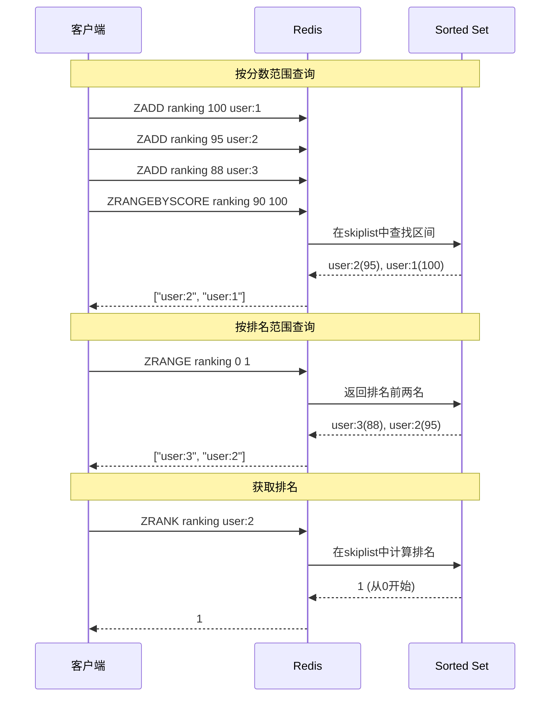
```mermaid
sequenceDiagram
    participant C as 客户端
    participant R as Redis
    participant Z as Sorted Set

    Note over C,Z: 按分数范围查询

    C->>R: ZADD ranking 100 user:1
    C->>R: ZADD ranking 95 user:2
    C->>R: ZADD ranking 88 user:3

    C->>R: ZRANGEBYSCORE ranking 90 100
    R->>Z: 在skiplist中查找区间
    Z-->>R: user:2(95), user:1(100)
    R-->>C: ["user:2", "user:1"]

    Note over C,Z: 按排名范围查询

    C->>R: ZRANGE ranking 0 1
    R->>Z: 返回排名前两名
    Z-->>R: user:3(88), user:2(95)
    R-->>C: ["user:3", "user:2"]

    Note over C,Z: 获取排名

    C->>R: ZRANK ranking user:2
    R->>Z: 在skiplist中计算排名
    Z-->>R: 1 (从0开始)
    R-->>C: 1
```

**Sorted Set应用场景：**

| 场景 | 实现方式 | 命令示例 |
|------|----------|----------|
| 排行榜 | score存分数 | `ZADD leaderboard:game 9999 player:1`<br/>`ZREVRANGE leaderboard:game 0 9` |
| 延时队列 | score存时间戳 | `ZADD delay:queue timestamp task_id`<br/>`ZRANGEBYSCORE delay:queue 0 now` |
| 自动补全 | score存权重 | `ZADD autocomplete:prefix weight "关键词"` |
| 热门文章 | score存热度 | `ZINCRBY hot:articles 1 article:123` |
| 优先级队列 | score存优先级 | `ZADD priority:tasks priority task_id` |

### 5.6 Stream（流）

Stream是Redis 5.0引入的日志型数据结构，支持消息持久化和消费组。

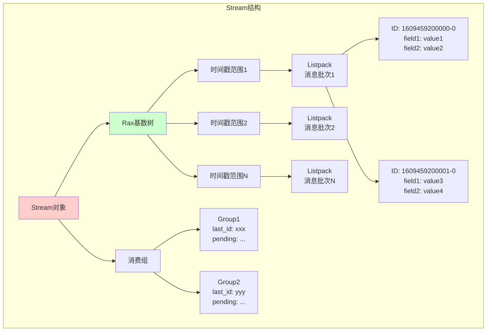
```mermaid
graph TB
    subgraph "Stream结构"
        StreamObj[Stream对象] --> Rax[Rax基数树]
        Rax --> Node1[时间戳范围1]
        Rax --> Node2[时间戳范围2]
        Rax --> Node3[时间戳范围N]

        Node1 --> LP1[Listpack<br/>消息批次1]
        Node2 --> LP2[Listpack<br/>消息批次2]
        Node3 --> LP3[Listpack<br/>消息批次N]

        LP1 --> Msg1[ID: 1609459200000-0<br/>field1: value1<br/>field2: value2]
        LP1 --> Msg2[ID: 1609459200001-0<br/>field1: value3<br/>field2: value4]

        StreamObj --> Groups[消费组]
        Groups --> G1[Group1<br/>last_id: xxx<br/>pending: ...]
        Groups --> G2[Group2<br/>last_id: yyy<br/>pending: ...]
    end

    style StreamObj fill:#ffcccc
    style Rax fill:#ccffcc
```

**Stream消费模式：**

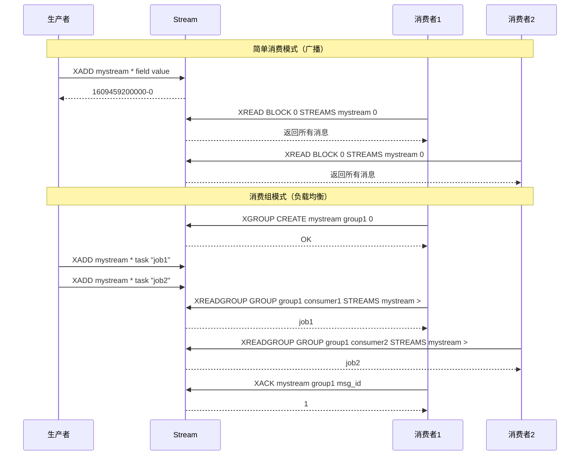
```mermaid
sequenceDiagram
    participant P as 生产者
    participant S as Stream
    participant C1 as 消费者1
    participant C2 as 消费者2

    Note over P,C2: 简单消费模式（广播）

    P->>S: XADD mystream * field value
    S-->>P: 1609459200000-0

    C1->>S: XREAD BLOCK 0 STREAMS mystream 0
    S-->>C1: 返回所有消息

    C2->>S: XREAD BLOCK 0 STREAMS mystream 0
    S-->>C2: 返回所有消息

    Note over P,C2: 消费组模式（负载均衡）

    C1->>S: XGROUP CREATE mystream group1 0
    S-->>C1: OK

    P->>S: XADD mystream * task "job1"
    P->>S: XADD mystream * task "job2"

    C1->>S: XREADGROUP GROUP group1 consumer1 STREAMS mystream >
    S-->>C1: job1

    C2->>S: XREADGROUP GROUP group1 consumer2 STREAMS mystream >
    S-->>C2: job2

    C1->>S: XACK mystream group1 msg_id
    S-->>C1: 1
```

**Stream应用场景：**

| 场景 | 特性 | 命令示例 |
|------|------|----------|
| 事件溯源 | 消息持久化，可回溯 | `XADD events * type "order_created" data "..."` |
| 实时日志 | 高性能追加写入 | `XADD logs:app * level "error" msg "..."` |
| 消息队列 | 消费组负载均衡 | `XREADGROUP GROUP workers c1 STREAMS tasks >` |
| 活动流 | 时间序列查询 | `XRANGE activity 1609459200000 1609545600000` |
| 聊天室 | 消息持久化+订阅 | `XADD chat:room1 * user "张三" msg "你好"` |

---

## 6. 命令处理流程

### 6.1 完整命令处理流程

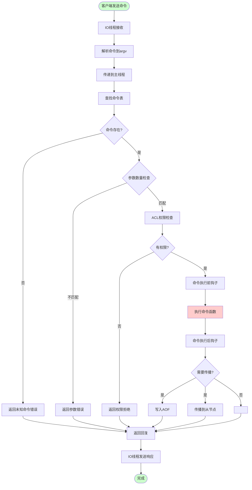
```mermaid
flowchart TB
    Start([客户端发送命令]) --> IO1[IO线程接收]
    IO1 --> Parse[解析命令到argv]
    Parse --> Main[传递到主线程]
    Main --> Lookup[查找命令表]

    Lookup --> Found{命令存在?}
    Found -->|否| Error1[返回未知命令错误]
    Found -->|是| Arity{参数数量检查}

    Arity -->|不匹配| Error2[返回参数错误]
    Arity -->|匹配| ACL[ACL权限检查]

    ACL --> Denied{有权限?}
    Denied -->|否| Error3[返回权限拒绝]
    Denied -->|是| PreExec[命令执行前钩子]

    PreExec --> Exec[执行命令函数]
    Exec --> PostExec[命令执行后钩子]

    PostExec --> Propagate{需要传播?}
    Propagate -->|是| AOF[写入AOF]
    Propagate -->|是| Repl[传播到从节点]
    Propagate -->|否| Skip1[ ]

    AOF --> Reply
    Repl --> Reply
    Skip1 --> Reply[返回回复]
    Error1 --> Reply
    Error2 --> Reply
    Error3 --> Reply

    Reply --> IO2[IO线程发送响应]
    IO2 --> End([完成])

    style Start fill:#ccffcc
    style Exec fill:#ffcccc
    style End fill:#ccffcc
```

### 6.2 多线程I/O模型

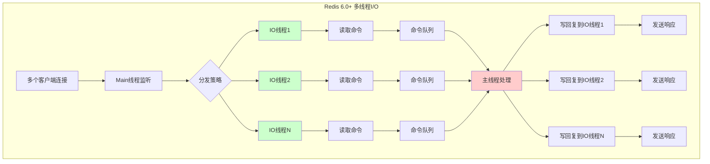
```mermaid
graph TB
    subgraph "Redis 6.0+ 多线程I/O"
        Clients[多个客户端连接] --> ML[Main线程监听]

        ML --> Dist{分发策略}

        Dist --> IOT1[IO线程1]
        Dist --> IOT2[IO线程2]
        Dist --> IOT3[IO线程N]

        IOT1 --> Read1[读取命令]
        IOT2 --> Read2[读取命令]
        IOT3 --> Read3[读取命令]

        Read1 --> Queue1[命令队列]
        Read2 --> Queue2[命令队列]
        Read3 --> Queue3[命令队列]

        Queue1 --> MainT[主线程处理]
        Queue2 --> MainT
        Queue3 --> MainT

        MainT --> Write1[写回复到IO线程1]
        MainT --> Write2[写回复到IO线程2]
        MainT --> Write3[写回复到IO线程N]

        Write1 --> Send1[发送响应]
        Write2 --> Send2[发送响应]
        Write3 --> Send3[发送响应]
    end

    style MainT fill:#ffcccc
    style IOT1 fill:#ccffcc
    style IOT2 fill:#ccffcc
    style IOT3 fill:#ccffcc
```

**IO线程工作流程：**

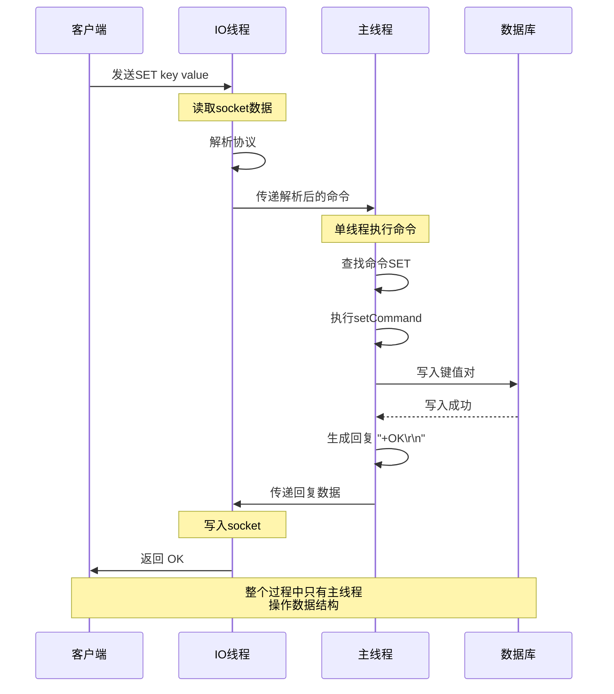
```mermaid
sequenceDiagram
    participant C as 客户端
    participant IO as IO线程
    participant M as 主线程
    participant DB as 数据库

    C->>IO: 发送SET key value
    Note over IO: 读取socket数据
    IO->>IO: 解析协议
    IO->>M: 传递解析后的命令

    Note over M: 单线程执行命令
    M->>M: 查找命令SET
    M->>M: 执行setCommand
    M->>DB: 写入键值对
    DB-->>M: 写入成功

    M->>M: 生成回复 "+OK\r\n"
    M->>IO: 传递回复数据

    Note over IO: 写入socket
    IO->>C: 返回 OK

    Note over C,DB: 整个过程中只有主线程<br/>操作数据结构
```

### 6.3 命令传播机制

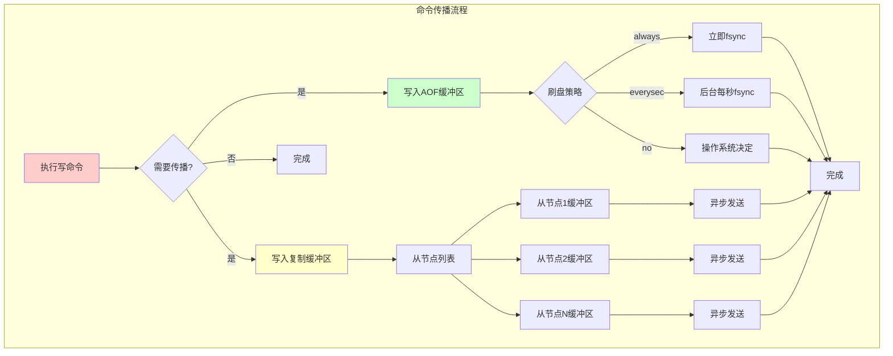
```mermaid
graph TB
    subgraph "命令传播流程"
        Cmd[执行写命令] --> Check{需要传播?}

        Check -->|是| AOFWrite[写入AOF缓冲区]
        Check -->|是| ReplBuf[写入复制缓冲区]
        Check -->|否| Done1[完成]

        AOFWrite --> AOFFlush{刷盘策略}
        AOFFlush -->|always| Fsync[立即fsync]
        AOFFlush -->|everysec| BGFsync[后台每秒fsync]
        AOFFlush -->|no| NoFsync[操作系统决定]

        ReplBuf --> Slaves[从节点列表]
        Slaves --> S1[从节点1缓冲区]
        Slaves --> S2[从节点2缓冲区]
        Slaves --> S3[从节点N缓冲区]

        S1 --> Send1[异步发送]
        S2 --> Send2[异步发送]
        S3 --> Send3[异步发送]

        Fsync --> Done2[完成]
        BGFsync --> Done2
        NoFsync --> Done2
        Send1 --> Done2
        Send2 --> Done2
        Send3 --> Done2
    end

    style Cmd fill:#ffcccc
    style AOFWrite fill:#ccffcc
    style ReplBuf fill:#ffffcc
```

---

## 7. 持久化机制

### 7.1 RDB（快照）持久化

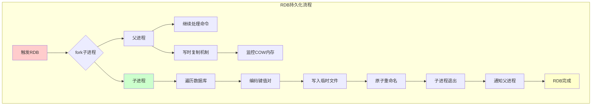
```mermaid
graph TB
    subgraph "RDB持久化流程"
        Trigger[触发RDB] --> Fork{fork子进程}

        Fork --> Parent[父进程]
        Fork --> Child[子进程]

        Parent --> Continue[继续处理命令]
        Parent --> COW[写时复制机制]

        Child --> Iterate[遍历数据库]
        Iterate --> Encode[编码键值对]
        Encode --> Write[写入临时文件]
        Write --> Rename[原子重命名]
        Rename --> Exit[子进程退出]

        COW --> Monitor[监控COW内存]
        Exit --> Notify[通知父进程]
        Notify --> Done[RDB完成]
    end

    style Trigger fill:#ffcccc
    style Child fill:#ccffcc
    style Done fill:#ffffcc
```

**RDB文件格式：**

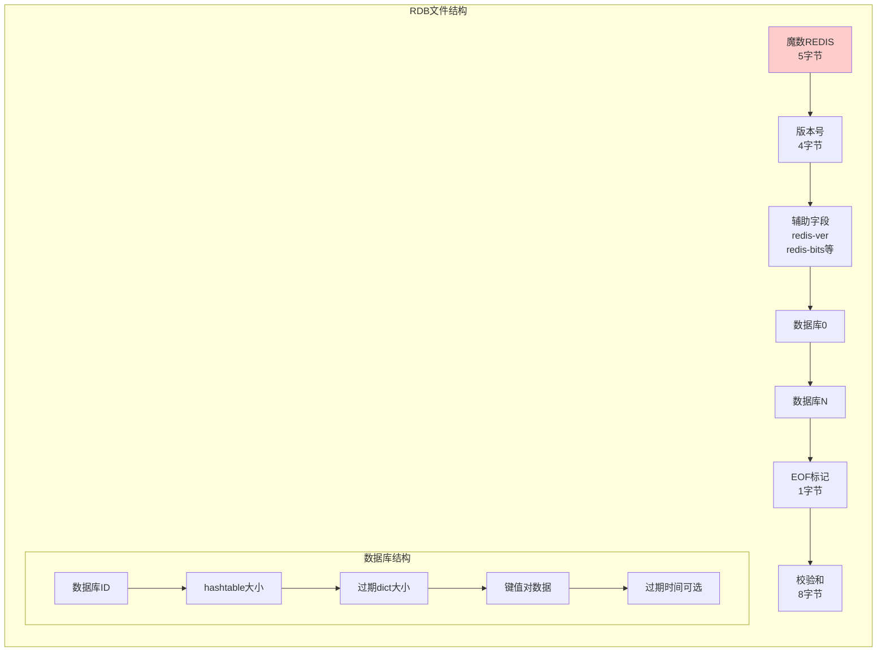
```mermaid
graph LR
    subgraph "RDB文件结构"
        Magic[魔数REDIS<br/>5字节] --> Version[版本号<br/>4字节]
        Version --> AUX[辅助字段<br/>redis-ver<br/>redis-bits等]
        AUX --> DB0[数据库0]
        DB0 --> DBN[数据库N]
        DBN --> EOF[EOF标记<br/>1字节]
        EOF --> Checksum[校验和<br/>8字节]

        subgraph "数据库结构"
            DBID[数据库ID] --> ResizeDB[hashtable大小]
            ResizeDB --> ExpireSize[过期dict大小]
            ExpireSize --> KV[键值对数据]
            KV --> Expire[过期时间可选]
        end
    end

    style Magic fill:#ffcccc
```

**RDB触发时机：**

1. **手动触发**
   - `SAVE`：阻塞主进程
   - `BGSAVE`：后台异步保存

2. **自动触发**
   - 配置条件满足：`save 900 1`（900秒内至少1次修改）
   - 主从复制：全量同步时
   - `SHUTDOWN`：关闭前自动保存

3. **优缺点对比**

| 特性 | 优点 | 缺点 |
|------|------|------|
| 性能 | 恢复速度快 | 保存时fork开销大 |
| 数据完整性 | 文件紧凑 | 可能丢失最后一次快照后的数据 |
| 适用场景 | 全量备份，冷数据 | 实时性要求高的场景 |

### 7.2 AOF（追加日志）持久化

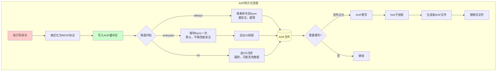
```mermaid
graph TB
    subgraph "AOF持久化流程"
        Cmd[执行写命令] --> Format[格式化为RESP协议]
        Format --> AOFBuf[写入AOF缓冲区]

        AOFBuf --> Flush{刷盘时机}

        Flush -->|always| ImmFlush[每条命令后fsync<br/>最安全，最慢]
        Flush -->|everysec| SecFlush[每秒fsync一次<br/>默认，平衡性能安全]
        Flush -->|no| NoFlush[由OS决定<br/>最快，可能丢失数据]

        ImmFlush --> Disk[(AOF文件)]
        SecFlush --> BIO[后台IO线程]
        BIO --> Disk
        NoFlush --> Disk

        Disk --> Rewrite{需要重写?}
        Rewrite -->|文件过大| AOFRewrite[AOF重写]
        Rewrite -->|否| Continue[继续]

        AOFRewrite --> Fork2[fork子进程]
        Fork2 --> NewAOF[生成新AOF文件]
        NewAOF --> Replace[替换旧文件]
    end

    style Cmd fill:#ffcccc
    style AOFBuf fill:#ccffcc
    style Disk fill:#ffffcc
```

**AOF重写机制：**

```mermaid
sequenceDiagram
    participant M as 主进程
    participant C as 重写子进程
    participant Old as 旧AOF
    participant New as 新AOF
    participant Diff as 重写缓冲区

    M->>M: 触发重写（手动/自动）
    M->>C: fork()子进程
    Note over C: 子进程看到的是<br/>fork时刻的内存快照

    par 主进程继续工作
        M->>Old: 追加新命令
        M->>Diff: 同时记录到重写缓冲区
    and 子进程重写
        C->>C: 遍历所有key
        C->>C: 生成最简命令序列
        C->>New: 写入新AOF文件
    end

    C->>M: 通知重写完成
    M->>New: 将重写缓冲区追加到新AOF
    M->>M: 原子重命名新文件
    M->>Old: 删除旧AOF文件

    Note over M,Old: 重写期间不会阻塞<br/>服务，但会增加内存使用
```

**AOF文件格式示例：**

```
*3\r\n              # 数组，3个元素
$3\r\n              # 批量字符串，3个字节
SET\r\n             # 命令名
$3\r\n              # 批量字符串，3个字节
key\r\n             # 键名
$5\r\n              # 批量字符串，5个字节
value\r\n           # 键值
```

### 7.3 混合持久化

Redis 4.0+支持RDB+AOF混合持久化。

```mermaid
graph TB
    subgraph "混合持久化"
        Start[开启混合持久化<br/>aof-use-rdb-preamble yes]

        Start --> Rewrite[AOF重写触发]
        Rewrite --> RDBPart[前半部分：RDB格式<br/>完整的数据快照]
        Rewrite --> AOFPart[后半部分：AOF格式<br/>重写期间的增量]

        RDBPart --> Fast[加载快速]
        AOFPart --> Safe[数据完整]

        Fast --> Best[最佳实践]
        Safe --> Best
    end

    style Start fill:#ffcccc
    style Best fill:#ccffcc
```

**持久化策略对比：**

| 策略 | 数据安全性 | 性能 | 文件大小 | 恢复速度 | 推荐场景 |
|------|-----------|------|---------|---------|---------|
| RDB | 低（秒级丢失） | 高 | 小 | 快 | 冷数据备份 |
| AOF(everysec) | 中（秒级丢失） | 中 | 大 | 慢 | 通用场景 |
| AOF(always) | 高（几乎不丢失） | 低 | 大 | 慢 | 金融数据 |
| 混合 | 高 | 高 | 中 | 快 | 生产推荐 |

---

## 8. 过期与淘汰策略

### 8.1 过期键删除策略

Redis使用**惰性删除**和**定期删除**两种策略。

```mermaid
graph TB
    subgraph "过期键处理"
        Access[访问键] --> CheckLazy{惰性检查}
        CheckLazy -->|已过期| DelLazy[删除过期键]
        CheckLazy -->|未过期| Return[返回键值]

        Cron[定期任务serverCron] --> Active[主动过期]
        Active --> Sample[随机采样N个键]
        Sample --> CheckActive{检查是否过期}
        CheckActive -->|是| DelActive[删除过期键]
        CheckActive -->|否| Skip[跳过]

        DelActive --> Ratio{过期比例>25%?}
        Ratio -->|是| Sample
        Ratio -->|否| Done[本轮结束]

        DelLazy --> Notify1[发送过期事件]
        DelActive --> Notify2[发送过期事件]
    end

    style Access fill:#ffcccc
    style Cron fill:#ccffcc
```

**过期扫描流程：**

```mermaid
flowchart TB
    Start([定期任务触发]) --> SelectDB[遍历数据库]

    SelectDB --> HasExpire{有过期键?}
    HasExpire -->|否| NextDB[下一个DB]
    HasExpire -->|是| Sample[随机采样20个过期键]

    Sample --> Check[检查是否过期]
    Check --> Delete[删除过期键]
    Delete --> Count[统计删除数量]

    Count --> Percent{删除比例>25%?}
    Percent -->|是| TimeLimit{超时?}
    Percent -->|否| NextDB

    TimeLimit -->|是| Pause[暂停，下次继续]
    TimeLimit -->|否| Sample

    NextDB --> AllDone{所有DB完成?}
    AllDone -->|否| SelectDB
    AllDone -->|是| End([完成])

    style Start fill:#ccffcc
    style Delete fill:#ffcccc
    style End fill:#ccffcc
```

### 8.2 内存淘汰策略

当内存使用达到`maxmemory`时，Redis会根据配置的策略淘汰数据。

```mermaid
graph TB
    subgraph "8种淘汰策略"
        Policy[maxmemory-policy]

        Policy --> NoEvict[noeviction<br/>不淘汰，返回错误]

        Policy --> Volatile[仅对设置过期时间的键]
        Volatile --> VLRU[volatile-lru<br/>LRU算法]
        Volatile --> VLFU[volatile-lfu<br/>LFU算法]
        Volatile --> VTTL[volatile-ttl<br/>TTL最小]
        Volatile --> VRandom[volatile-random<br/>随机]

        Policy --> AllKeys[所有键]
        AllKeys --> ALRU[allkeys-lru<br/>LRU算法]
        AllKeys --> ALFU[allkeys-lfu<br/>LFU算法]
        AllKeys --> ARandom[allkeys-random<br/>随机]
    end

    style Policy fill:#ffcccc
    style ALRU fill:#ccffcc
```

**LRU vs LFU：**

```mermaid
graph LR
    subgraph "LRU（Least Recently Used）"
        L1[最近最少使用] --> L2[24位时间戳]
        L2 --> L3[优先淘汰最久未访问]
        L3 --> L4[适合：时间局部性强]
    end

    subgraph "LFU（Least Frequently Used）"
        F1[最不经常使用] --> F2[8位计数器+16位衰减时间]
        F2 --> F3[优先淘汰访问次数少]
        F3 --> F4[适合：热点数据明确]
    end

    style L1 fill:#ccffcc
    style F1 fill:#ffffcc
```

**淘汰执行流程：**

```mermaid
sequenceDiagram
    participant C as 客户端命令
    participant M as 内存检查
    participant E as 淘汰器
    participant DB as 数据库

    C->>M: 执行写命令
    M->>M: 检查内存使用
    M->>M: used_memory > maxmemory?

    alt 超过限制
        M->>E: 启动淘汰流程
        E->>E: 随机采样N个键
        E->>E: 根据策略评分
        E->>E: 选择得分最低的键
        E->>DB: 删除键
        E->>M: 释放内存
        M->>M: 重复直到内存达标
        M->>C: 执行原命令
    else 未超限
        M->>C: 直接执行命令
    end

    C->>C: 返回结果
```

**淘汰策略选择建议：**

| 场景 | 推荐策略 | 原因 |
|------|----------|------|
| 缓存系统 | `allkeys-lru` | 全部数据都可淘汰，优先淘汰冷数据 |
| 明确热点 | `allkeys-lfu` | 高频访问的热点数据不会被淘汰 |
| 带TTL的缓存 | `volatile-lru` | 只淘汰临时数据，保留永久数据 |
| 会话存储 | `volatile-ttl` | 优先淘汰即将过期的会话 |
| 不允许淘汰 | `noeviction` | 数据库模式，写操作会返回错误 |

---

## 小结

第2部分深入介绍了：

1. **五大数据类型**：String、List、Hash、Set、Sorted Set、Stream的实现细节
2. **命令处理**：从接收到响应的完整流程，多线程I/O模型
3. **持久化**：RDB快照、AOF日志、混合持久化的原理和对比
4. **过期淘汰**：过期键删除和内存淘汰的策略与实现

下一部分将探讨**主从复制、哨兵、集群等分布式特性**。
