# Redis深入分析 - 第3部分：分布式特性（上）

## 目录
- [9. 主从复制](#9-主从复制)
- [10. 哨兵模式](#10-哨兵模式)

---

## 9. 主从复制

### 9.1 主从复制架构

Redis的主从复制允许从服务器（replica/slave）复制主服务器（master）的数据。

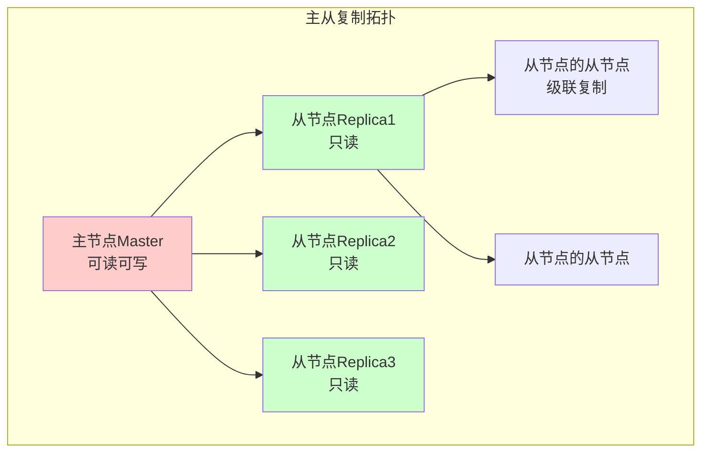
```mermaid
graph TB
    subgraph "主从复制拓扑"
        Master[主节点Master<br/>可读可写] --> Replica1[从节点Replica1<br/>只读]
        Master --> Replica2[从节点Replica2<br/>只读]
        Master --> Replica3[从节点Replica3<br/>只读]

        Replica1 --> SubReplica1[从节点的从节点<br/>级联复制]
        Replica1 --> SubReplica2[从节点的从节点]
    end

    style Master fill:#ffcccc
    style Replica1 fill:#ccffcc
    style Replica2 fill:#ccffcc
    style Replica3 fill:#ccffcc
```

**主从复制的作用：**

1. **数据冗余**：热备份数据
2. **故障恢复**：主节点故障时可切换
3. **负载均衡**：读写分离，从节点分担读请求
4. **高可用基石**：哨兵和集群的基础

### 9.2 复制流程

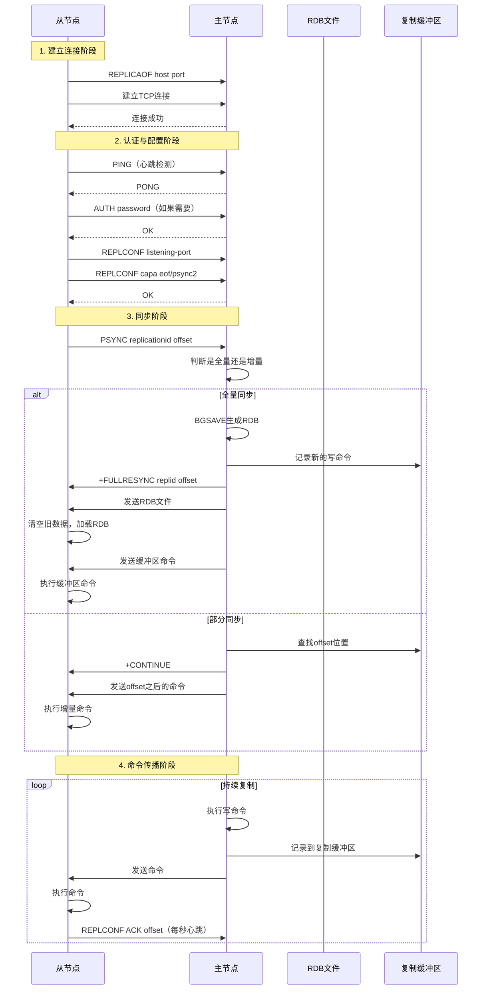
```mermaid
sequenceDiagram
    participant S as 从节点
    participant M as 主节点
    participant RDB as RDB文件
    participant Backlog as 复制缓冲区

    Note over S: 1. 建立连接阶段
    S->>M: REPLICAOF host port
    S->>M: 建立TCP连接
    M-->>S: 连接成功

    Note over S,M: 2. 认证与配置阶段
    S->>M: PING（心跳检测）
    M-->>S: PONG

    S->>M: AUTH password（如果需要）
    M-->>S: OK

    S->>M: REPLCONF listening-port
    S->>M: REPLCONF capa eof/psync2
    M-->>S: OK

    Note over S,M: 3. 同步阶段
    S->>M: PSYNC replicationid offset
    M->>M: 判断是全量还是增量

    alt 全量同步
        M->>M: BGSAVE生成RDB
        M->>Backlog: 记录新的写命令
        M->>S: +FULLRESYNC replid offset
        M->>S: 发送RDB文件
        S->>S: 清空旧数据，加载RDB
        M->>S: 发送缓冲区命令
        S->>S: 执行缓冲区命令
    else 部分同步
        M->>Backlog: 查找offset位置
        M->>S: +CONTINUE
        M->>S: 发送offset之后的命令
        S->>S: 执行增量命令
    end

    Note over S,M: 4. 命令传播阶段
    loop 持续复制
        M->>M: 执行写命令
        M->>Backlog: 记录到复制缓冲区
        M->>S: 发送命令
        S->>S: 执行命令
        S->>M: REPLCONF ACK offset（每秒心跳）
    end
```

### 9.3 全量同步详解

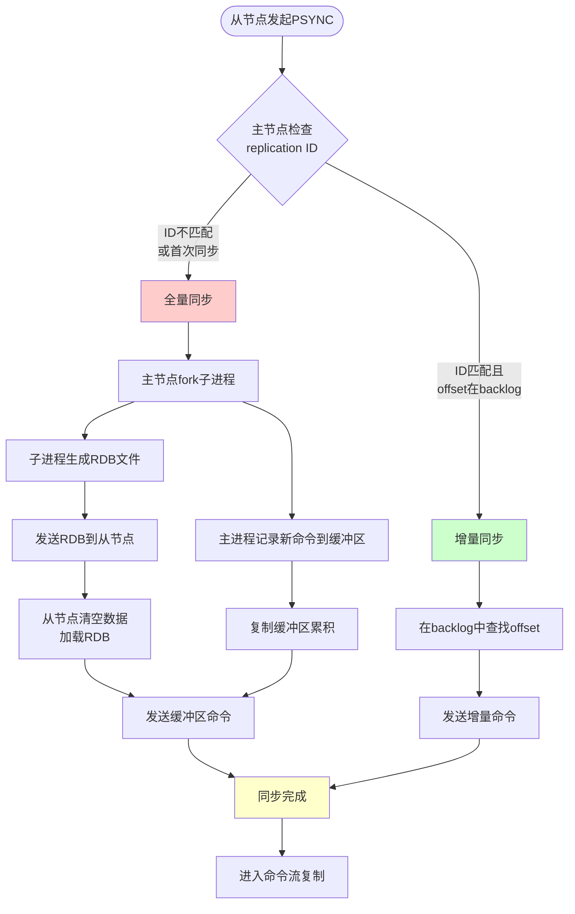
```mermaid
flowchart TB
    Start([从节点发起PSYNC]) --> CheckID{主节点检查<br/>replication ID}

    CheckID -->|ID不匹配<br/>或首次同步| Full[全量同步]
    CheckID -->|ID匹配且<br/>offset在backlog| Partial[增量同步]

    Full --> Fork[主节点fork子进程]
    Fork --> GenRDB[子进程生成RDB文件]
    Fork --> RecordNew[主进程记录新命令到缓冲区]

    GenRDB --> SendRDB[发送RDB到从节点]
    RecordNew --> Buffer[复制缓冲区累积]

    SendRDB --> LoadRDB[从节点清空数据<br/>加载RDB]
    LoadRDB --> CatchUp[发送缓冲区命令]
    Buffer --> CatchUp

    CatchUp --> Complete[同步完成]

    Partial --> FindOffset[在backlog中查找offset]
    FindOffset --> SendIncr[发送增量命令]
    SendIncr --> Complete

    Complete --> Stream[进入命令流复制]

    style Full fill:#ffcccc
    style Partial fill:#ccffcc
    style Complete fill:#ffffcc
```

### 9.4 PSYNC2 优化

Redis 4.0引入PSYNC2，解决了多个场景下的断线重连问题。

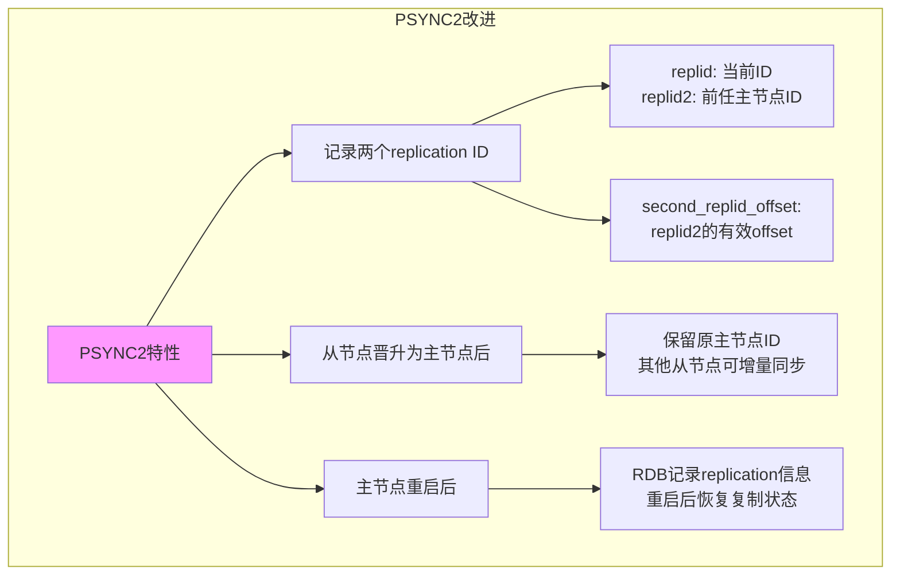
```mermaid
graph TB
    subgraph "PSYNC2改进"
        A[PSYNC2特性] --> B[记录两个replication ID]
        A --> C[从节点晋升为主节点后]
        A --> D[主节点重启后]

        B --> B1[replid: 当前ID<br/>replid2: 前任主节点ID]
        B --> B2[second_replid_offset:<br/>replid2的有效offset]

        C --> C1[保留原主节点ID<br/>其他从节点可增量同步]
        D --> D1[RDB记录replication信息<br/>重启后恢复复制状态]
    end

    style A fill:#f9f
```

**场景示例：主节点故障切换**

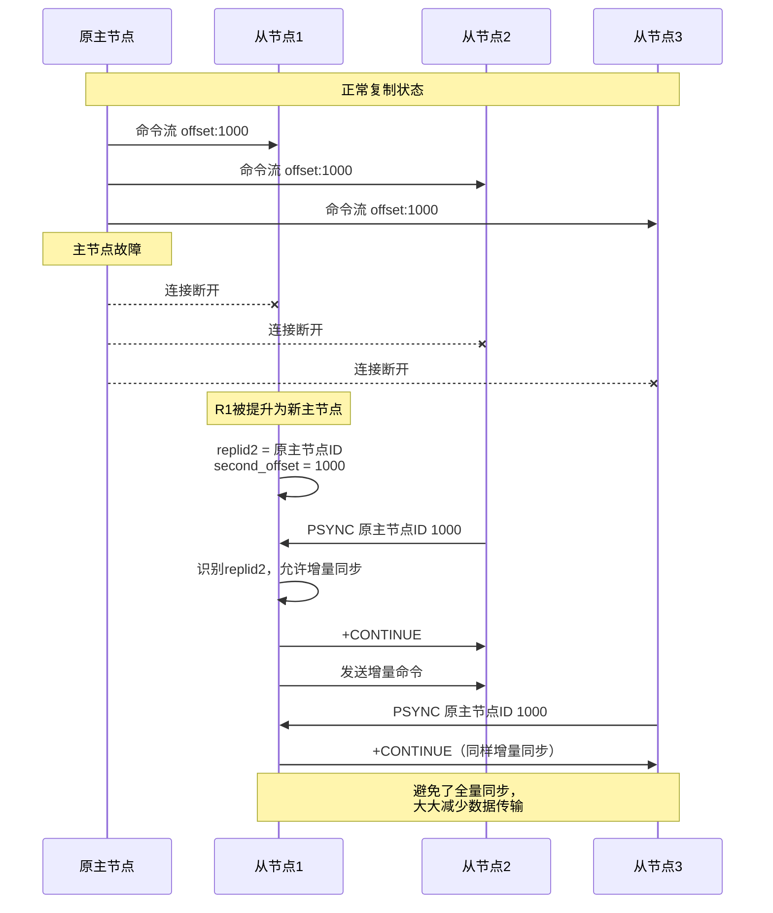
```mermaid
sequenceDiagram
    participant M as 原主节点
    participant R1 as 从节点1
    participant R2 as 从节点2
    participant R3 as 从节点3

    Note over M,R3: 正常复制状态
    M->>R1: 命令流 offset:1000
    M->>R2: 命令流 offset:1000
    M->>R3: 命令流 offset:1000

    Note over M: 主节点故障
    M--xR1: 连接断开
    M--xR2: 连接断开
    M--xR3: 连接断开

    Note over R1: R1被提升为新主节点
    R1->>R1: replid2 = 原主节点ID<br/>second_offset = 1000

    R2->>R1: PSYNC 原主节点ID 1000
    R1->>R1: 识别replid2，允许增量同步
    R1->>R2: +CONTINUE
    R1->>R2: 发送增量命令

    R3->>R1: PSYNC 原主节点ID 1000
    R1->>R3: +CONTINUE（同样增量同步）

    Note over R1,R3: 避免了全量同步，<br/>大大减少数据传输
```

### 9.5 复制缓冲区（Replication Buffer）

Redis使用多级缓冲区管理复制数据。

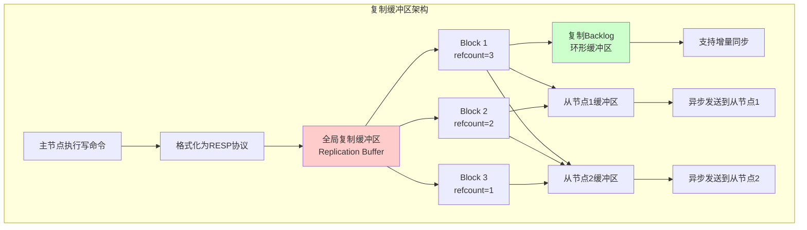
```mermaid
graph TB
    subgraph "复制缓冲区架构"
        CMD[主节点执行写命令] --> Format[格式化为RESP协议]

        Format --> ReplBuffer[全局复制缓冲区<br/>Replication Buffer]

        ReplBuffer --> Block1[Block 1<br/>refcount=3]
        ReplBuffer --> Block2[Block 2<br/>refcount=2]
        ReplBuffer --> Block3[Block 3<br/>refcount=1]

        Block1 --> Backlog[复制Backlog<br/>环形缓冲区]
        Block1 --> Rep1[从节点1缓冲区]
        Block1 --> Rep2[从节点2缓冲区]

        Block2 --> Rep1
        Block2 --> Rep2

        Block3 --> Rep2

        Backlog --> PSYNC[支持增量同步]
        Rep1 --> Send1[异步发送到从节点1]
        Rep2 --> Send2[异步发送到从节点2]
    end

    style ReplBuffer fill:#ffcccc
    style Backlog fill:#ccffcc
```

**缓冲区说明：**

1. **全局复制缓冲区**
   - 所有从节点共享的块链表
   - 每个块引用计数管理
   - 当所有引用消失时释放

2. **Replication Backlog**
   - 环形缓冲区，记录最近的复制流
   - 大小可配置：`repl-backlog-size`
   - 用于支持PSYNC增量同步

3. **每个从节点的输出缓冲区**
   - 指向全局缓冲区的块引用
   - 记录当前发送位置
   - 根据从节点速度独立推进

### 9.6 无盘复制（Diskless Replication）

传统RDB复制需要写磁盘，无盘复制直接通过网络发送。

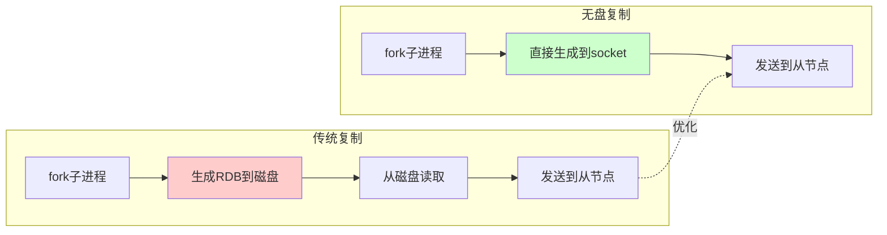
```mermaid
graph LR
    subgraph "传统复制"
        T1[fork子进程] --> T2[生成RDB到磁盘]
        T2 --> T3[从磁盘读取]
        T3 --> T4[发送到从节点]
    end

    subgraph "无盘复制"
        D1[fork子进程] --> D2[直接生成到socket]
        D2 --> D3[发送到从节点]
    end

    T4 -.优化.-> D3

    style T2 fill:#ffcccc
    style D2 fill:#ccffcc
```

**配置参数：**

```conf
# 启用无盘复制
repl-diskless-sync yes

# 无盘复制延迟（等待多个从节点一起同步）
repl-diskless-sync-delay 5

# 最大等待从节点数
repl-diskless-sync-max-replicas 0  # 0表示不限制
```

**优缺点对比：**

| 特性 | 传统复制 | 无盘复制 |
|------|---------|---------|
| 磁盘IO | 需要写磁盘 | 不需要 |
| 内存使用 | 较小 | fork时COW内存 |
| 网络传输 | 读磁盘慢 | 直接生成，快 |
| 多从节点 | 可重用RDB | 每个需单独传输 |
| 适用场景 | 磁盘快，多从节点 | 磁盘慢，SSD，少从节点 |

### 9.7 RDB通道复制（RDB Channel Replication）

Redis 8.0引入的新特性，全量同步期间主从可以并行传输RDB和命令流。

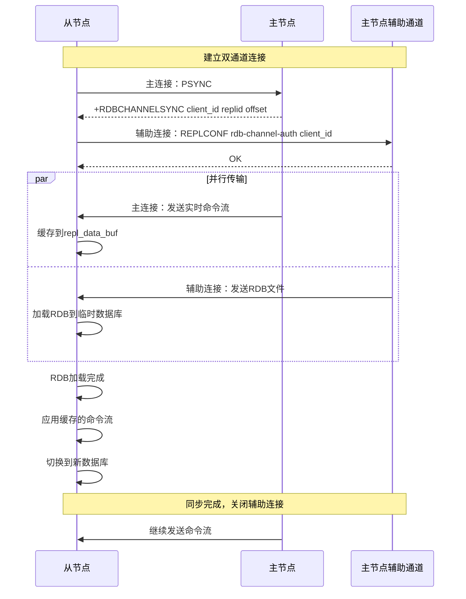
```mermaid
sequenceDiagram
    participant R as 从节点
    participant M主 as 主节点
    participant M辅 as 主节点辅助通道

    Note over R,M辅: 建立双通道连接

    R->>M主: 主连接：PSYNC
    M主-->>R: +RDBCHANNELSYNC client_id replid offset

    R->>M辅: 辅助连接：REPLCONF rdb-channel-auth client_id
    M辅-->>R: OK

    par 并行传输
        M主->>R: 主连接：发送实时命令流
        R->>R: 缓存到repl_data_buf
    and
        M辅->>R: 辅助连接：发送RDB文件
        R->>R: 加载RDB到临时数据库
    end

    R->>R: RDB加载完成
    R->>R: 应用缓存的命令流
    R->>R: 切换到新数据库

    Note over R,M辅: 同步完成，关闭辅助连接

    M主->>R: 继续发送命令流
```

**RDB通道复制优势：**

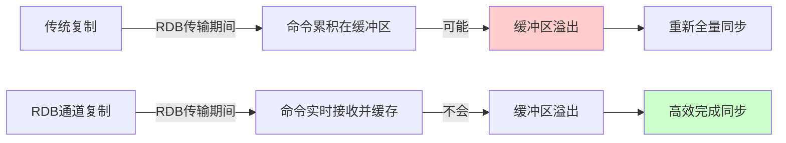
```mermaid
graph LR
    A[传统复制] -->|RDB传输期间| B[命令累积在缓冲区]
    B -->|可能| C[缓冲区溢出]
    C --> D[重新全量同步]

    E[RDB通道复制] -->|RDB传输期间| F[命令实时接收并缓存]
    F -->|不会| G[缓冲区溢出]
    G --> H[高效完成同步]

    style C fill:#ffcccc
    style H fill:#ccffcc
```

### 9.8 主从复制配置

**主节点配置：**

```conf
# 绑定IP
bind 0.0.0.0

# 允许从节点连接的密码
requirepass master_password

# 复制缓冲区大小
repl-backlog-size 1mb

# 从节点断线后多久释放backlog
repl-backlog-ttl 3600

# 最小从节点数量（写入保证）
min-replicas-to-write 1

# 从节点最大延迟时间（秒）
min-replicas-max-lag 10
```

**从节点配置：**

```conf
# 指定主节点
replicaof master_ip master_port

# 主节点密码
masterauth master_password

# 从节点是否只读
replica-read-only yes

# 从节点优先级（数值越小优先级越高）
replica-priority 100

# 是否在同步过程中提供旧数据
replica-serve-stale-data yes
```

### 9.9 主从复制监控

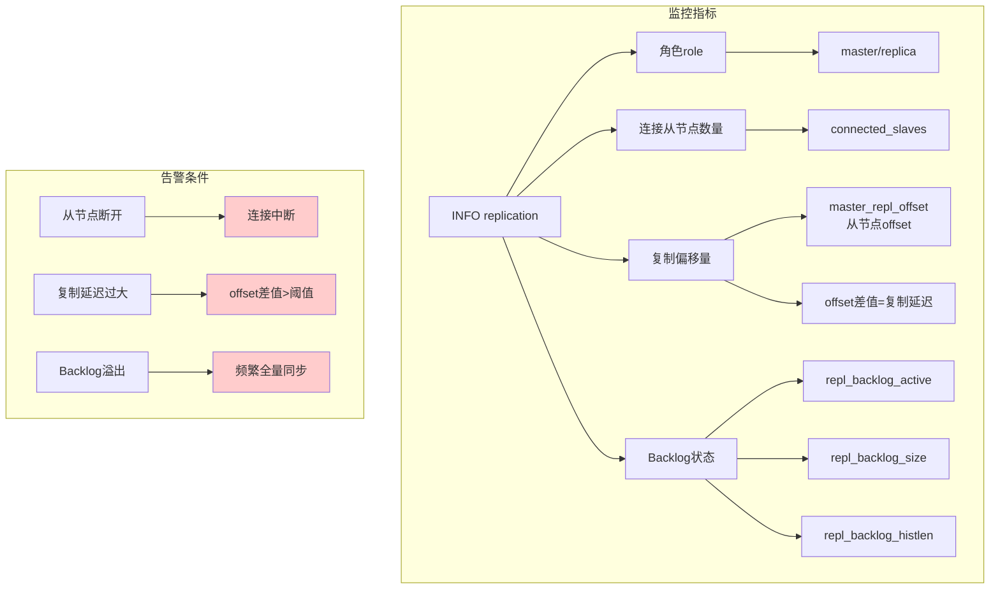
```mermaid
graph TB
    subgraph "监控指标"
        A[INFO replication] --> B[角色role]
        A --> C[连接从节点数量]
        A --> D[复制偏移量]
        A --> E[Backlog状态]

        B --> B1[master/replica]

        C --> C1[connected_slaves]

        D --> D1[master_repl_offset<br/>从节点offset]
        D --> D2[offset差值=复制延迟]

        E --> E1[repl_backlog_active]
        E --> E2[repl_backlog_size]
        E --> E3[repl_backlog_histlen]
    end

    subgraph "告警条件"
        F[从节点断开] --> Alert1[连接中断]
        G[复制延迟过大] --> Alert2[offset差值>阈值]
        H[Backlog溢出] --> Alert3[频繁全量同步]
    end

    style Alert1 fill:#ffcccc
    style Alert2 fill:#ffcccc
    style Alert3 fill:#ffcccc
```

---

## 10. 哨兵模式

### 10.1 哨兵架构

Redis Sentinel是Redis的高可用解决方案，提供自动故障转移能力。

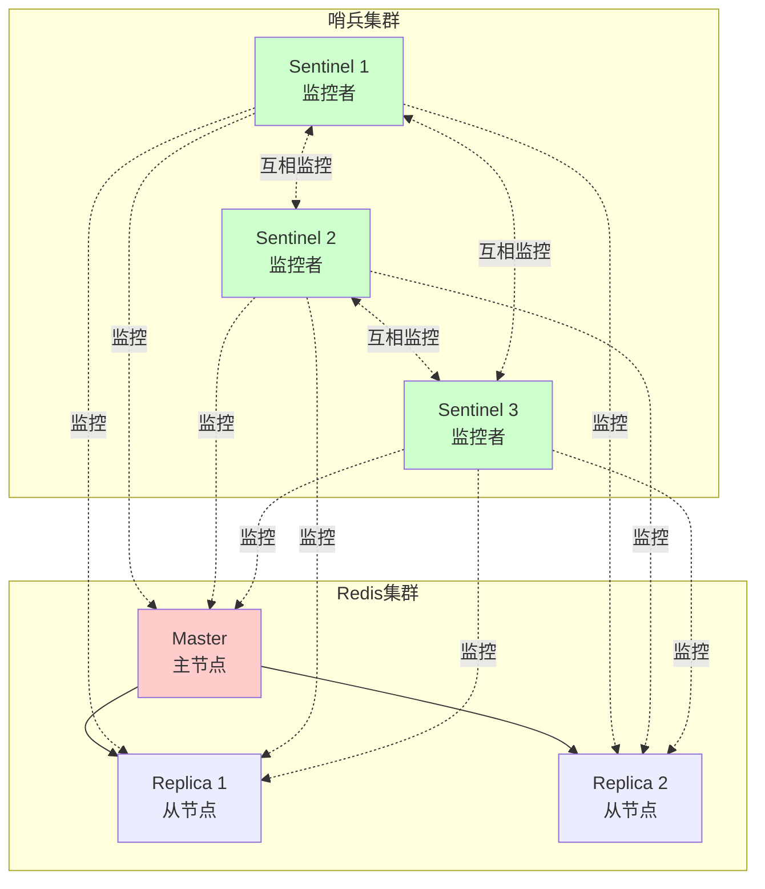
```mermaid
graph TB
    subgraph "哨兵集群"
        S1[Sentinel 1<br/>监控者]
        S2[Sentinel 2<br/>监控者]
        S3[Sentinel 3<br/>监控者]
    end

    subgraph "Redis集群"
        Master[Master<br/>主节点]
        Replica1[Replica 1<br/>从节点]
        Replica2[Replica 2<br/>从节点]

        Master --> Replica1
        Master --> Replica2
    end

    S1 -.监控.-> Master
    S1 -.监控.-> Replica1
    S1 -.监控.-> Replica2

    S2 -.监控.-> Master
    S2 -.监控.-> Replica1
    S2 -.监控.-> Replica2

    S3 -.监控.-> Master
    S3 -.监控.-> Replica1
    S3 -.监控.-> Replica2

    S1 <-.互相监控.-> S2
    S2 <-.互相监控.-> S3
    S3 <-.互相监控.-> S1

    style Master fill:#ffcccc
    style S1 fill:#ccffcc
    style S2 fill:#ccffcc
    style S3 fill:#ccffcc
```

**哨兵的功能：**

1. **监控（Monitoring）**：持续监控主从节点是否正常工作
2. **通知（Notification）**：通过API通知系统管理员或其他程序
3. **自动故障转移（Automatic Failover）**：主节点故障时自动提升从节点
4. **配置提供者（Configuration Provider）**：客户端通过哨兵获取当前主节点地址

### 10.2 哨兵工作原理

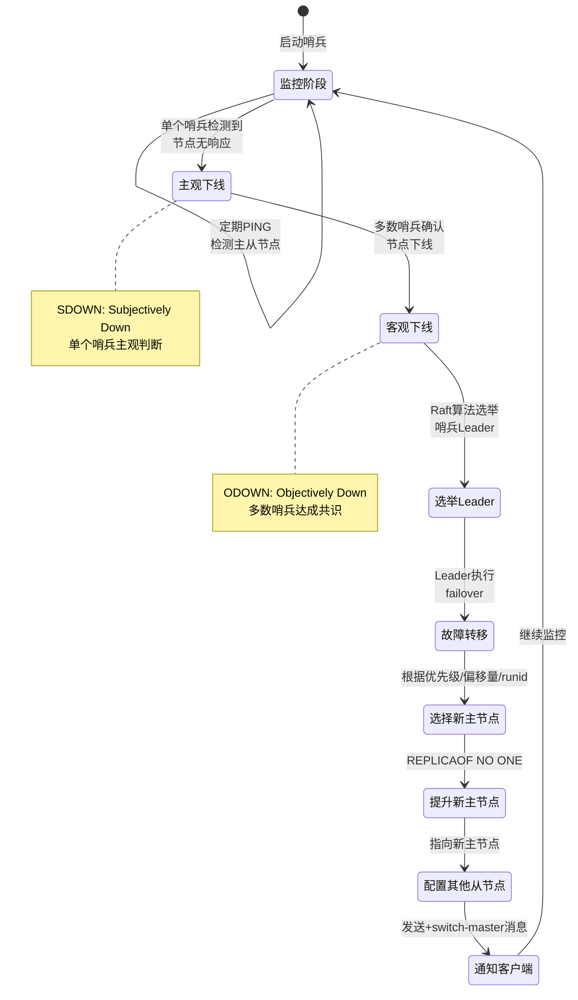
```mermaid
stateDiagram-v2
    [*] --> 监控阶段: 启动哨兵

    监控阶段 --> 监控阶段: 定期PING<br/>检测主从节点

    监控阶段 --> 主观下线: 单个哨兵检测到<br/>节点无响应

    主观下线 --> 客观下线: 多数哨兵确认<br/>节点下线

    客观下线 --> 选举Leader: Raft算法选举<br/>哨兵Leader

    选举Leader --> 故障转移: Leader执行<br/>failover

    故障转移 --> 选择新主节点: 根据优先级/偏移量/runid
    选择新主节点 --> 提升新主节点: REPLICAOF NO ONE
    提升新主节点 --> 配置其他从节点: 指向新主节点
    配置其他从节点 --> 通知客户端: 发送+switch-master消息

    通知客户端 --> 监控阶段: 继续监控

    note right of 主观下线
        SDOWN: Subjectively Down
        单个哨兵主观判断
    end note

    note right of 客观下线
        ODOWN: Objectively Down
        多数哨兵达成共识
    end note
```

### 10.3 主观下线与客观下线

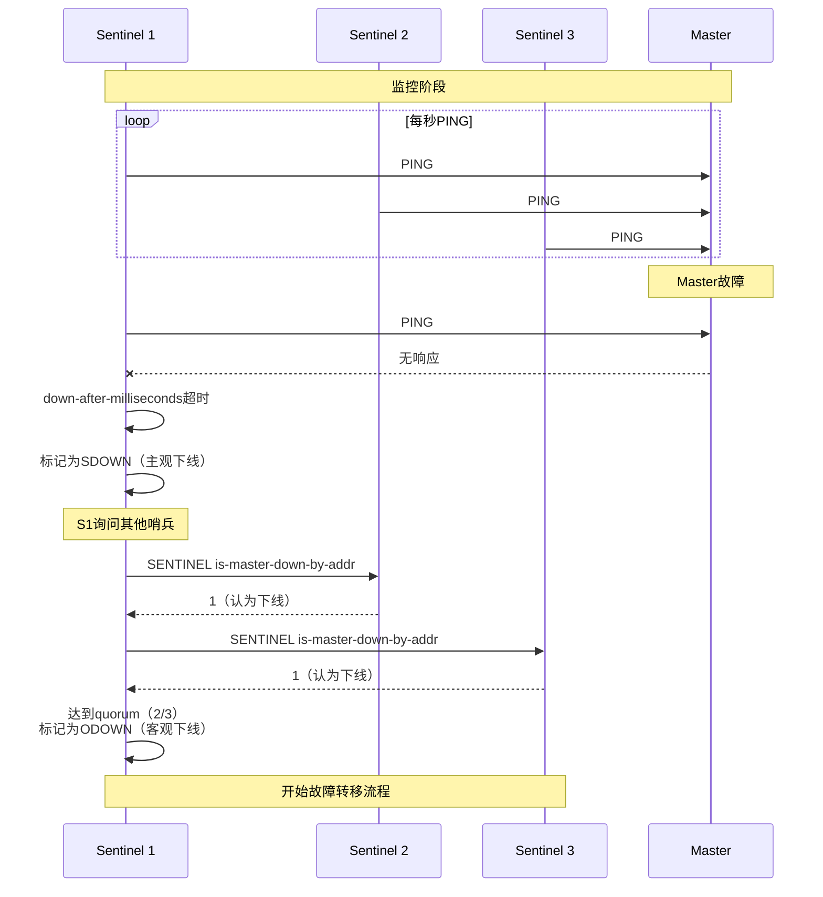
```mermaid
sequenceDiagram
    participant S1 as Sentinel 1
    participant S2 as Sentinel 2
    participant S3 as Sentinel 3
    participant M as Master

    Note over S1,M: 监控阶段

    loop 每秒PING
        S1->>M: PING
        S2->>M: PING
        S3->>M: PING
    end

    Note over M: Master故障

    S1->>M: PING
    M--xS1: 无响应
    S1->>S1: down-after-milliseconds超时
    S1->>S1: 标记为SDOWN（主观下线）

    Note over S1: S1询问其他哨兵

    S1->>S2: SENTINEL is-master-down-by-addr
    S2-->>S1: 1（认为下线）

    S1->>S3: SENTINEL is-master-down-by-addr
    S3-->>S1: 1（认为下线）

    S1->>S1: 达到quorum（2/3）<br/>标记为ODOWN（客观下线）

    Note over S1,S3: 开始故障转移流程
```

**配置参数：**

```conf
# 多久无响应判定为主观下线
sentinel down-after-milliseconds mymaster 5000

# 需要多少个哨兵同意才判定为客观下线
sentinel quorum mymaster 2

# 故障转移超时时间
sentinel failover-timeout mymaster 180000

# 并行同步的从节点数量
sentinel parallel-syncs mymaster 1
```

### 10.4 Leader选举

哨兵使用Raft共识算法选举Leader执行故障转移。

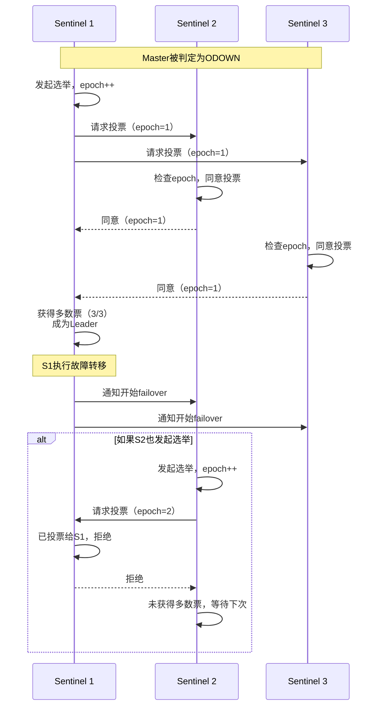
```mermaid
sequenceDiagram
    participant S1 as Sentinel 1
    participant S2 as Sentinel 2
    participant S3 as Sentinel 3

    Note over S1,S3: Master被判定为ODOWN

    S1->>S1: 发起选举，epoch++
    S1->>S2: 请求投票（epoch=1）
    S1->>S3: 请求投票（epoch=1）

    S2->>S2: 检查epoch，同意投票
    S2-->>S1: 同意（epoch=1）

    S3->>S3: 检查epoch，同意投票
    S3-->>S1: 同意（epoch=1）

    S1->>S1: 获得多数票（3/3）<br/>成为Leader

    Note over S1: S1执行故障转移

    S1->>S2: 通知开始failover
    S1->>S3: 通知开始failover

    alt 如果S2也发起选举
        S2->>S2: 发起选举，epoch++
        S2->>S1: 请求投票（epoch=2）
        S1->>S1: 已投票给S1，拒绝
        S1-->>S2: 拒绝
        S2->>S2: 未获得多数票，等待下次
    end
```

### 10.5 故障转移流程

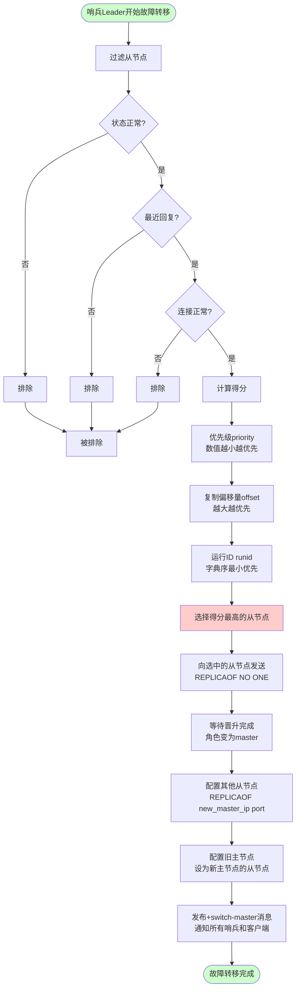
```mermaid
flowchart TB
    Start([哨兵Leader开始故障转移]) --> Filter[过滤从节点]

    Filter --> F1{状态正常?}
    F1 -->|否| Exclude1[排除]
    F1 -->|是| F2{最近回复?}

    F2 -->|否| Exclude2[排除]
    F2 -->|是| F3{连接正常?}

    F3 -->|否| Exclude3[排除]
    F3 -->|是| Score[计算得分]

    Exclude1 --> End1[被排除]
    Exclude2 --> End1
    Exclude3 --> End1

    Score --> S1[优先级priority<br/>数值越小越优先]
    S1 --> S2[复制偏移量offset<br/>越大越优先]
    S2 --> S3[运行ID runid<br/>字典序最小优先]

    S3 --> Select[选择得分最高的从节点]

    Select --> Promote[向选中的从节点发送<br/>REPLICAOF NO ONE]
    Promote --> Wait[等待晋升完成<br/>角色变为master]

    Wait --> Config[配置其他从节点<br/>REPLICAOF new_master_ip port]
    Config --> OldMaster[配置旧主节点<br/>设为新主节点的从节点]

    OldMaster --> Notify[发布+switch-master消息<br/>通知所有哨兵和客户端]

    Notify --> Complete([故障转移完成])

    style Start fill:#ccffcc
    style Select fill:#ffcccc
    style Complete fill:#ccffcc
```

### 10.6 从节点选择算法

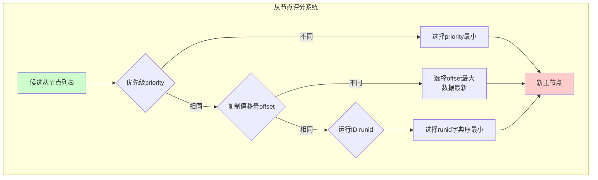
```mermaid
graph TB
    subgraph "从节点评分系统"
        Slaves[候选从节点列表] --> Check1{优先级priority}

        Check1 -->|不同| Winner1[选择priority最小]
        Check1 -->|相同| Check2{复制偏移量offset}

        Check2 -->|不同| Winner2[选择offset最大<br/>数据最新]
        Check2 -->|相同| Check3{运行ID runid}

        Check3 --> Winner3[选择runid字典序最小]

        Winner1 --> Result[新主节点]
        Winner2 --> Result
        Winner3 --> Result
    end

    style Slaves fill:#ccffcc
    style Result fill:#ffcccc
```

**示例场景：**

假设有3个从节点：

| 从节点 | priority | offset | runid |
|--------|----------|--------|-------|
| Replica1 | 100 | 8500 | aaa |
| Replica2 | 90 | 8400 | bbb |
| Replica3 | 90 | 8400 | aab |

选择过程：
1. Replica2和Replica3的priority（90）最小，Replica1被排除
2. Replica2和Replica3的offset相同（8400）
3. 比较runid，Replica3的"aab" < "bbb"
4. **选择Replica3作为新主节点**

### 10.7 哨兵配置文件

```conf
# sentinel.conf

# 哨兵端口
port 26379

# 守护进程模式
daemonize yes

# PID文件
pidfile /var/run/redis-sentinel.pid

# 日志文件
logfile /var/log/redis-sentinel.log

# 监控的主节点
# sentinel monitor <master-name> <ip> <port> <quorum>
sentinel monitor mymaster 127.0.0.1 6379 2

# 主节点密码
sentinel auth-pass mymaster your_password

# 判定下线时间（毫秒）
sentinel down-after-milliseconds mymaster 5000

# 故障转移超时
sentinel failover-timeout mymaster 180000

# 同时同步的从节点数
sentinel parallel-syncs mymaster 1

# 通知脚本（可选）
sentinel notification-script mymaster /path/to/notify.sh

# 故障转移脚本（可选）
sentinel client-reconfig-script mymaster /path/to/reconfig.sh
```

### 10.8 客户端连接哨兵

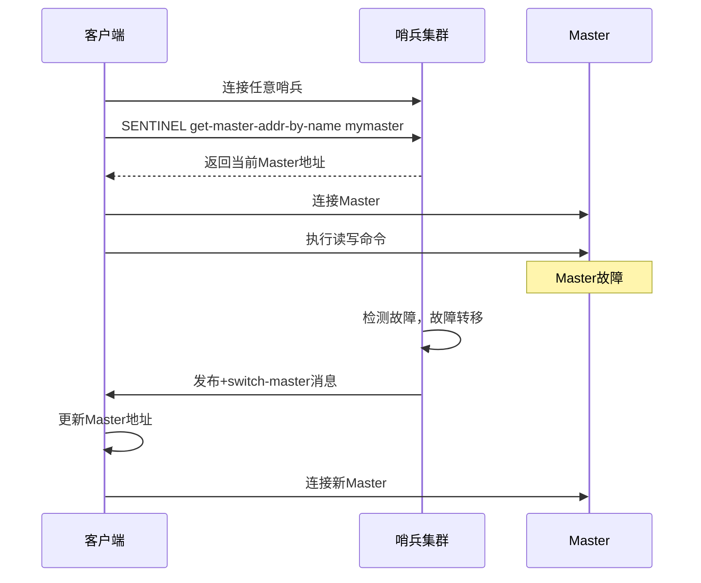
```mermaid
sequenceDiagram
    participant C as 客户端
    participant S as 哨兵集群
    participant M as Master

    C->>S: 连接任意哨兵
    C->>S: SENTINEL get-master-addr-by-name mymaster
    S-->>C: 返回当前Master地址

    C->>M: 连接Master
    C->>M: 执行读写命令

    Note over M: Master故障

    S->>S: 检测故障，故障转移
    S->>C: 发布+switch-master消息

    C->>C: 更新Master地址
    C->>M: 连接新Master
```

**客户端代码示例（Python）：**

```python
from redis.sentinel import Sentinel

# 哨兵地址列表
sentinel = Sentinel([
    ('sentinel1', 26379),
    ('sentinel2', 26379),
    ('sentinel3', 26379)
], socket_timeout=0.1)

# 获取主节点连接（自动故障转移）
master = sentinel.master_for('mymaster', socket_timeout=0.1)
master.set('key', 'value')

# 获取从节点连接（读写分离）
slave = sentinel.slave_for('mymaster', socket_timeout=0.1)
value = slave.get('key')
```

### 10.9 哨兵的通信机制

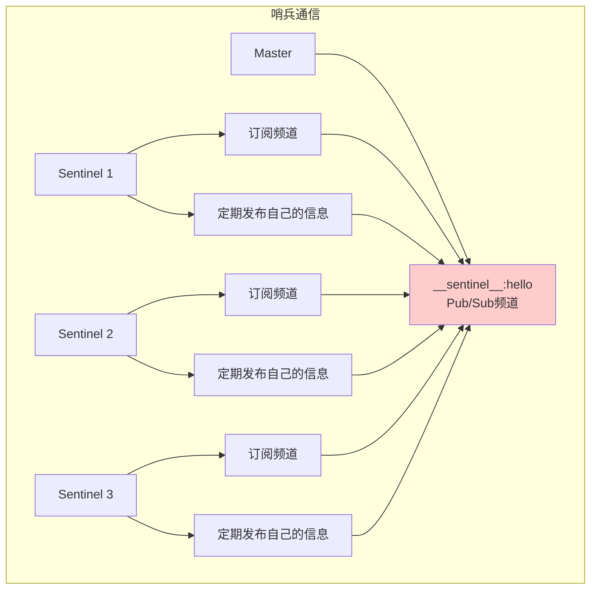
```mermaid
graph TB
    subgraph "哨兵通信"
        S1[Sentinel 1]
        S2[Sentinel 2]
        S3[Sentinel 3]

        M[Master]

        M --> PubSub[__sentinel__:hello<br/>Pub/Sub频道]

        S1 --> Subscribe1[订阅频道]
        S2 --> Subscribe2[订阅频道]
        S3 --> Subscribe3[订阅频道]

        Subscribe1 --> PubSub
        Subscribe2 --> PubSub
        Subscribe3 --> PubSub

        S1 --> Publish1[定期发布自己的信息]
        S2 --> Publish2[定期发布自己的信息]
        S3 --> Publish3[定期发布自己的信息]

        Publish1 --> PubSub
        Publish2 --> PubSub
        Publish3 --> PubSub
    end

    style PubSub fill:#ffcccc
```

**哨兵通过主节点的Pub/Sub发现彼此：**

1. 每个哨兵每2秒向`__sentinel__:hello`频道发布消息，包含：
   - 哨兵IP、端口
   - 监控的主节点信息
   - 配置纪元（epoch）

2. 每个哨兵订阅该频道，接收其他哨兵的消息

3. 通过这种方式，哨兵自动发现彼此，无需手动配置

### 10.10 哨兵监控命令

```bash
# 获取监控的主节点信息
SENTINEL masters

# 获取特定主节点的信息
SENTINEL master mymaster

# 获取从节点列表
SENTINEL replicas mymaster
# 或旧版本
SENTINEL slaves mymaster

# 获取监控同一主节点的哨兵列表
SENTINEL sentinels mymaster

# 获取主节点地址
SENTINEL get-master-addr-by-name mymaster

# 手动触发故障转移
SENTINEL failover mymaster

# 检查指定主节点状态
SENTINEL ckquorum mymaster

# 重置主节点（清除故障状态）
SENTINEL reset mymaster

# 移除监控的主节点
SENTINEL remove mymaster
```

---

## 小结

第3部分（上）介绍了Redis的分布式复制特性：

1. **主从复制**
   - 复制流程：连接、认证、同步、命令传播
   - PSYNC2优化：支持故障切换后增量同步
   - 无盘复制和RDB通道复制：优化数据传输
   - 复制缓冲区管理：共享内存块设计

2. **哨兵模式**
   - 监控、通知、故障转移、配置提供
   - 主观下线和客观下线判定
   - Raft算法Leader选举
   - 从节点选择算法和故障转移流程
   - 哨兵通信和客户端集成

下一部分将继续介绍**Redis Cluster集群模式和分布式应用实践**。
