# Redis深入分析 - 第4部分：分布式特性（下）

## 目录
- [11. Redis Cluster集群](#11-redis-cluster集群)
- [12. 分布式应用实践](#12-分布式应用实践)

---

## 11. Redis Cluster集群

### 11.1 Cluster架构设计

Redis Cluster是Redis的分布式实现，提供数据分片和高可用性。

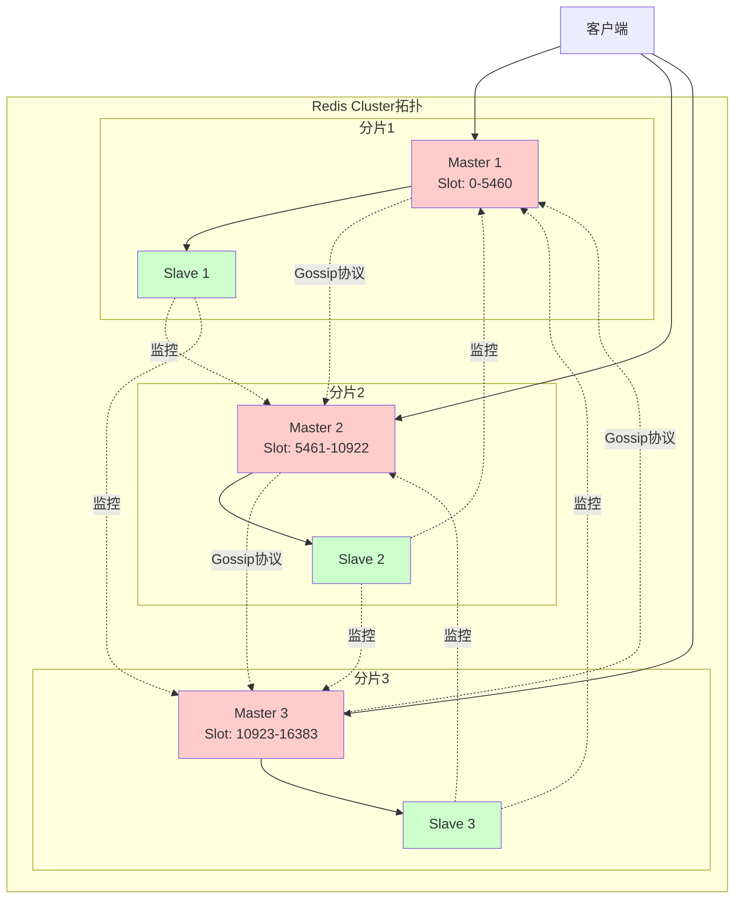
```mermaid
graph TB
    subgraph "Redis Cluster拓扑"
        subgraph "分片1"
            M1[Master 1<br/>Slot: 0-5460]
            S1[Slave 1]
            M1 --> S1
        end

        subgraph "分片2"
            M2[Master 2<br/>Slot: 5461-10922]
            S2[Slave 2]
            M2 --> S2
        end

        subgraph "分片3"
            M3[Master 3<br/>Slot: 10923-16383]
            S3[Slave 3]
            M3 --> S3
        end

        M1 -.Gossip协议.-> M2
        M2 -.Gossip协议.-> M3
        M3 -.Gossip协议.-> M1

        S1 -.监控.-> M2
        S1 -.监控.-> M3
        S2 -.监控.-> M1
        S2 -.监控.-> M3
        S3 -.监控.-> M1
        S3 -.监控.-> M2
    end

    Client[客户端] --> M1
    Client --> M2
    Client --> M3

    style M1 fill:#ffcccc
    style M2 fill:#ffcccc
    style M3 fill:#ffcccc
    style S1 fill:#ccffcc
    style S2 fill:#ccffcc
    style S3 fill:#ccffcc
```

**Cluster核心特性：**

1. **数据分片**：16384个哈希槽分布在多个节点
2. **高可用**：每个主节点可以有多个从节点
3. **自动故障转移**：主节点故障时自动提升从节点
4. **线性扩展**：添加节点即可扩展容量
5. **去中心化**：所有节点地位平等，无单点故障

### 11.2 哈希槽分配

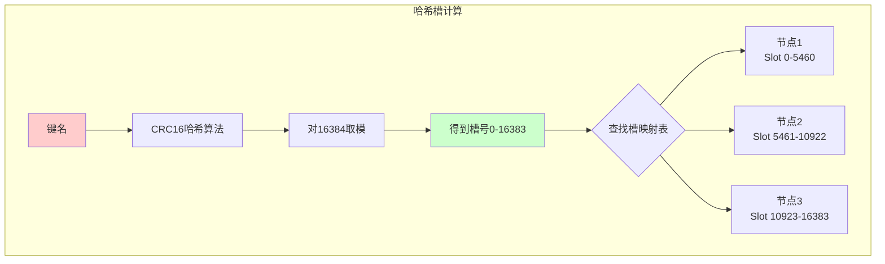
```mermaid
graph TB
    subgraph "哈希槽计算"
        Key[键名] --> CRC16[CRC16哈希算法]
        CRC16 --> Mod[对16384取模]
        Mod --> Slot[得到槽号0-16383]

        Slot --> Route{查找槽映射表}
        Route --> Node1[节点1<br/>Slot 0-5460]
        Route --> Node2[节点2<br/>Slot 5461-10922]
        Route --> Node3[节点3<br/>Slot 10923-16383]
    end

    style Key fill:#ffcccc
    style Slot fill:#ccffcc
```

**哈希标签（Hash Tag）：**

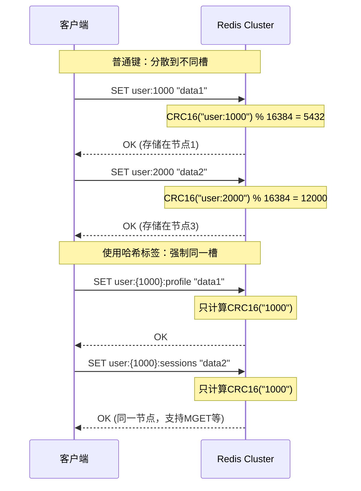
```mermaid
sequenceDiagram
    participant C as 客户端
    participant Cluster as Redis Cluster

    Note over C,Cluster: 普通键：分散到不同槽

    C->>Cluster: SET user:1000 "data1"
    Note over Cluster: CRC16("user:1000") % 16384 = 5432
    Cluster-->>C: OK (存储在节点1)

    C->>Cluster: SET user:2000 "data2"
    Note over Cluster: CRC16("user:2000") % 16384 = 12000
    Cluster-->>C: OK (存储在节点3)

    Note over C,Cluster: 使用哈希标签：强制同一槽

    C->>Cluster: SET user:{1000}:profile "data1"
    Note over Cluster: 只计算CRC16("1000")
    Cluster-->>C: OK

    C->>Cluster: SET user:{1000}:sessions "data2"
    Note over Cluster: 只计算CRC16("1000")
    Cluster-->>C: OK (同一节点，支持MGET等)
```

### 11.3 集群通信机制

**Gossip协议：**

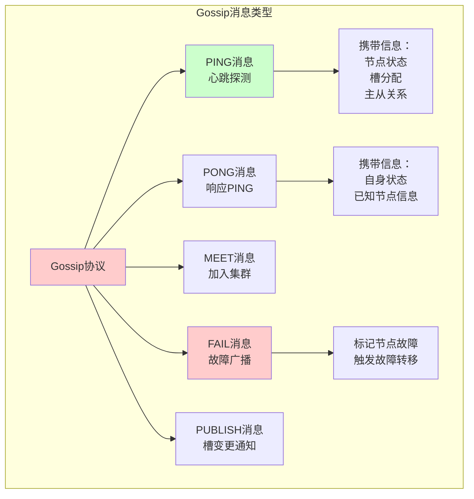
```mermaid
graph TB
    subgraph "Gossip消息类型"
        Gossip[Gossip协议]

        Gossip --> PING[PING消息<br/>心跳探测]
        Gossip --> PONG[PONG消息<br/>响应PING]
        Gossip --> MEET[MEET消息<br/>加入集群]
        Gossip --> FAIL[FAIL消息<br/>故障广播]
        Gossip --> PUBLISH[PUBLISH消息<br/>槽变更通知]

        PING --> PingData[携带信息：<br/>节点状态<br/>槽分配<br/>主从关系]
        PONG --> PongData[携带信息：<br/>自身状态<br/>已知节点信息]
        FAIL --> FailData[标记节点故障<br/>触发故障转移]
    end

    style Gossip fill:#ffcccc
    style PING fill:#ccffcc
    style FAIL fill:#ffcccc
```

**节点握手流程：**

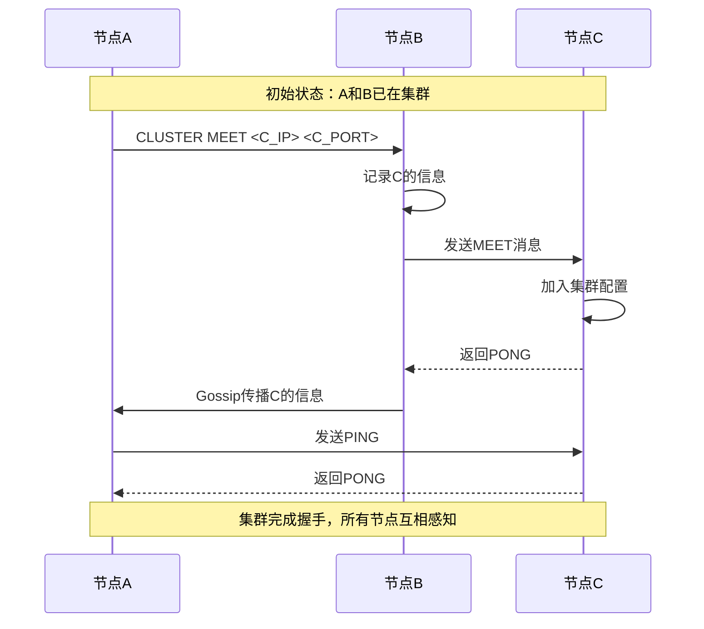
```mermaid
sequenceDiagram
    participant A as 节点A
    participant B as 节点B
    participant C as 节点C

    Note over A,C: 初始状态：A和B已在集群

    A->>B: CLUSTER MEET <C_IP> <C_PORT>
    B->>B: 记录C的信息

    B->>C: 发送MEET消息
    C->>C: 加入集群配置
    C-->>B: 返回PONG

    B->>A: Gossip传播C的信息
    A->>C: 发送PING
    C-->>A: 返回PONG

    Note over A,C: 集群完成握手，所有节点互相感知
```

### 11.4 客户端路由

**MOVED重定向：**

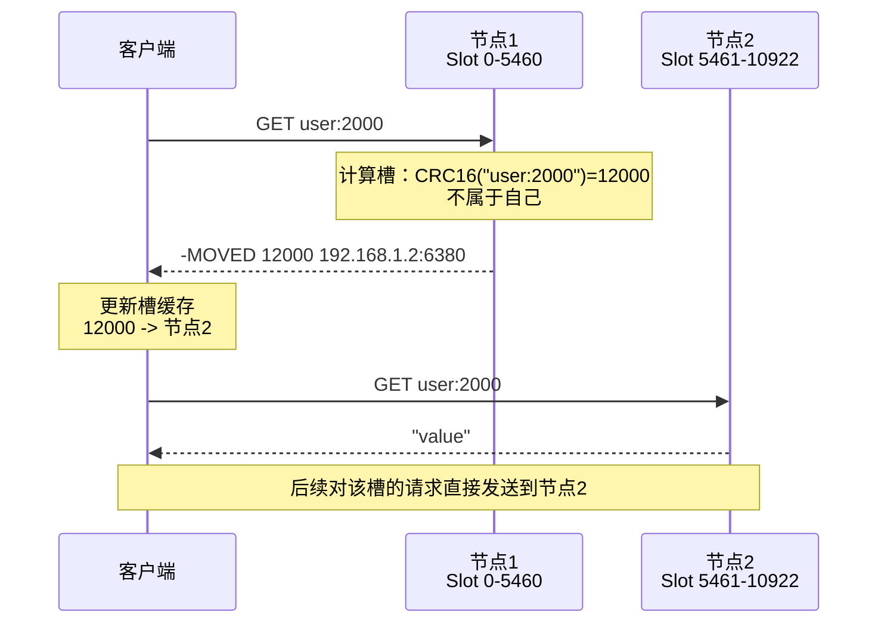
```mermaid
sequenceDiagram
    participant C as 客户端
    participant N1 as 节点1<br/>Slot 0-5460
    participant N2 as 节点2<br/>Slot 5461-10922

    C->>N1: GET user:2000
    Note over N1: 计算槽：CRC16("user:2000")=12000<br/>不属于自己

    N1-->>C: -MOVED 12000 192.168.1.2:6380
    Note over C: 更新槽缓存<br/>12000 -> 节点2

    C->>N2: GET user:2000
    N2-->>C: "value"

    Note over C,N2: 后续对该槽的请求直接发送到节点2
```

**ASK重定向（迁移中）：**

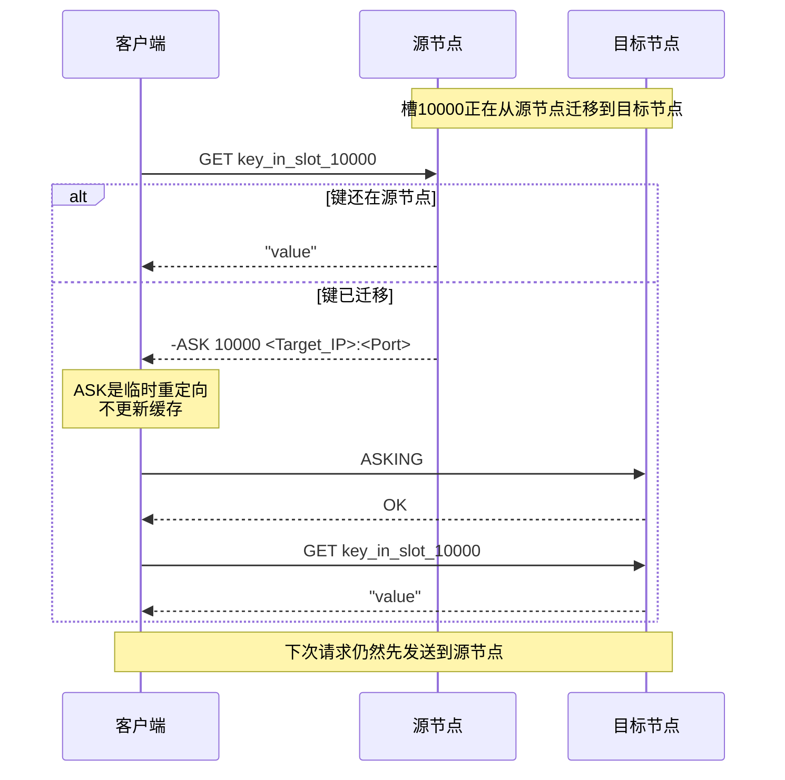
```mermaid
sequenceDiagram
    participant C as 客户端
    participant Source as 源节点
    participant Target as 目标节点

    Note over Source,Target: 槽10000正在从源节点迁移到目标节点

    C->>Source: GET key_in_slot_10000

    alt 键还在源节点
        Source-->>C: "value"
    else 键已迁移
        Source-->>C: -ASK 10000 <Target_IP>:<Port>
        Note over C: ASK是临时重定向<br/>不更新缓存

        C->>Target: ASKING
        Target-->>C: OK

        C->>Target: GET key_in_slot_10000
        Target-->>C: "value"
    end

    Note over C,Target: 下次请求仍然先发送到源节点
```

### 11.5 集群扩容与缩容

**添加节点流程：**

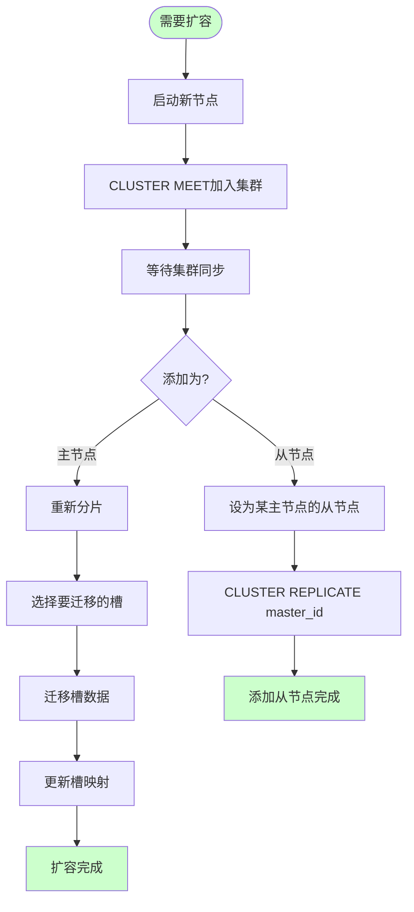
```mermaid
flowchart TB
    Start([需要扩容]) --> NewNode[启动新节点]
    NewNode --> Meet[CLUSTER MEET加入集群]
    Meet --> Wait[等待集群同步]

    Wait --> Check{添加为?}
    Check -->|主节点| Reshard[重新分片]
    Check -->|从节点| Replicate[设为某主节点的从节点]

    Reshard --> SelectSlots[选择要迁移的槽]
    SelectSlots --> Migrate[迁移槽数据]
    Migrate --> UpdateMap[更新槽映射]
    UpdateMap --> Done1[扩容完成]

    Replicate --> SetMaster[CLUSTER REPLICATE master_id]
    SetMaster --> Done2[添加从节点完成]

    style Start fill:#ccffcc
    style Done1 fill:#ccffcc
    style Done2 fill:#ccffcc
```

**槽迁移详细流程：**

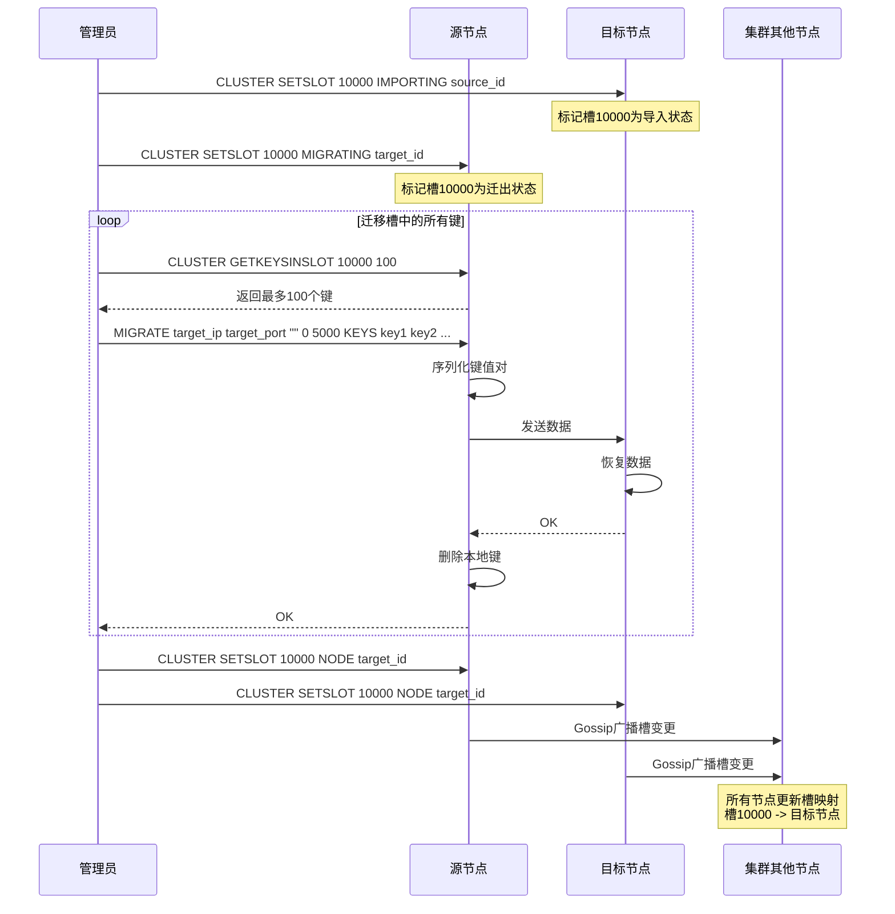
```mermaid
sequenceDiagram
    participant Admin as 管理员
    participant Source as 源节点
    participant Target as 目标节点
    participant Cluster as 集群其他节点

    Admin->>Target: CLUSTER SETSLOT 10000 IMPORTING source_id
    Note over Target: 标记槽10000为导入状态

    Admin->>Source: CLUSTER SETSLOT 10000 MIGRATING target_id
    Note over Source: 标记槽10000为迁出状态

    loop 迁移槽中的所有键
        Admin->>Source: CLUSTER GETKEYSINSLOT 10000 100
        Source-->>Admin: 返回最多100个键

        Admin->>Source: MIGRATE target_ip target_port "" 0 5000 KEYS key1 key2 ...
        Source->>Source: 序列化键值对
        Source->>Target: 发送数据
        Target->>Target: 恢复数据
        Target-->>Source: OK
        Source->>Source: 删除本地键
        Source-->>Admin: OK
    end

    Admin->>Source: CLUSTER SETSLOT 10000 NODE target_id
    Admin->>Target: CLUSTER SETSLOT 10000 NODE target_id

    Source->>Cluster: Gossip广播槽变更
    Target->>Cluster: Gossip广播槽变更

    Note over Cluster: 所有节点更新槽映射<br/>槽10000 -> 目标节点
```

### 11.6 故障检测与转移

**故障检测流程：**

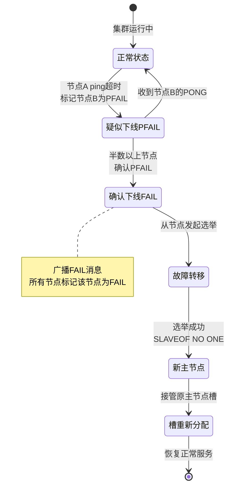
```mermaid
stateDiagram-v2
    [*] --> 正常状态: 集群运行中

    正常状态 --> 疑似下线PFAIL: 节点A ping超时<br/>标记节点B为PFAIL

    疑似下线PFAIL --> 确认下线FAIL: 半数以上节点<br/>确认PFAIL

    疑似下线PFAIL --> 正常状态: 收到节点B的PONG

    确认下线FAIL --> 故障转移: 从节点发起选举

    故障转移 --> 新主节点: 选举成功<br/>SLAVEOF NO ONE

    新主节点 --> 槽重新分配: 接管原主节点槽

    槽重新分配 --> [*]: 恢复正常服务

    note right of 确认下线FAIL
        广播FAIL消息
        所有节点标记该节点为FAIL
    end note
```

**从节点选举：**

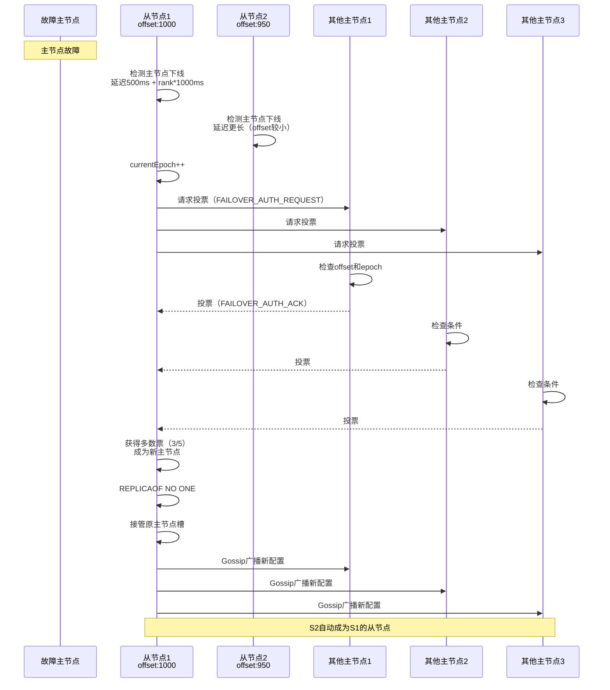
```mermaid
sequenceDiagram
    participant M as 故障主节点
    participant S1 as 从节点1<br/>offset:1000
    participant S2 as 从节点2<br/>offset:950
    participant N1 as 其他主节点1
    participant N2 as 其他主节点2
    participant N3 as 其他主节点3

    Note over M: 主节点故障

    S1->>S1: 检测主节点下线<br/>延迟500ms + rank*1000ms
    S2->>S2: 检测主节点下线<br/>延迟更长（offset较小）

    S1->>S1: currentEpoch++
    S1->>N1: 请求投票（FAILOVER_AUTH_REQUEST）
    S1->>N2: 请求投票
    S1->>N3: 请求投票

    N1->>N1: 检查offset和epoch
    N1-->>S1: 投票（FAILOVER_AUTH_ACK）

    N2->>N2: 检查条件
    N2-->>S1: 投票

    N3->>N3: 检查条件
    N3-->>S1: 投票

    S1->>S1: 获得多数票（3/5）<br/>成为新主节点

    S1->>S1: REPLICAOF NO ONE
    S1->>S1: 接管原主节点槽

    S1->>N1: Gossip广播新配置
    S1->>N2: Gossip广播新配置
    S1->>N3: Gossip广播新配置

    Note over S1,N3: S2自动成为S1的从节点
```

### 11.7 集群配置与命令

**创建集群：**

```bash
# 启动6个节点（3主3从）
redis-server --port 7000 --cluster-enabled yes --cluster-config-file nodes-7000.conf
redis-server --port 7001 --cluster-enabled yes --cluster-config-file nodes-7001.conf
redis-server --port 7002 --cluster-enabled yes --cluster-config-file nodes-7002.conf
redis-server --port 7003 --cluster-enabled yes --cluster-config-file nodes-7003.conf
redis-server --port 7004 --cluster-enabled yes --cluster-config-file nodes-7004.conf
redis-server --port 7005 --cluster-enabled yes --cluster-config-file nodes-7005.conf

# 创建集群（自动分配槽和主从关系）
redis-cli --cluster create \
  127.0.0.1:7000 127.0.0.1:7001 127.0.0.1:7002 \
  127.0.0.1:7003 127.0.0.1:7004 127.0.0.1:7005 \
  --cluster-replicas 1
```

**集群配置参数：**

```conf
# 启用集群模式
cluster-enabled yes

# 集群配置文件（自动生成和维护）
cluster-config-file nodes-6379.conf

# 节点超时时间（毫秒）
cluster-node-timeout 15000

# 从节点迁移屏障（保留的最少从节点数）
cluster-migration-barrier 1

# 部分槽不可用时是否继续服务
cluster-require-full-coverage yes

# 从节点有效性因子（slave-validity-factor）
cluster-replica-validity-factor 10

# 允许从节点在主节点故障时读取
cluster-replica-no-failover no
```

**集群管理命令：**

```bash
# 查看集群信息
CLUSTER INFO

# 查看集群节点
CLUSTER NODES

# 查看槽分配
CLUSTER SLOTS

# 添加节点到集群
CLUSTER MEET <ip> <port>

# 设置从节点
CLUSTER REPLICATE <master_node_id>

# 手动故障转移
CLUSTER FAILOVER [FORCE|TAKEOVER]

# 重新分片（使用redis-cli工具）
redis-cli --cluster reshard <host>:<port>

# 检查集群状态
redis-cli --cluster check <host>:<port>

# 修复集群
redis-cli --cluster fix <host>:<port>

# 槽操作
CLUSTER SETSLOT <slot> IMPORTING <node_id>
CLUSTER SETSLOT <slot> MIGRATING <node_id>
CLUSTER SETSLOT <slot> NODE <node_id>

# 获取槽中的键
CLUSTER GETKEYSINSLOT <slot> <count>

# 计算键所属槽
CLUSTER KEYSLOT <key>
```

### 11.8 客户端集成

**Python客户端示例（redis-py-cluster）：**

```python
from rediscluster import RedisCluster

# 连接集群（只需提供一个节点，客户端会自动发现其他节点）
startup_nodes = [
    {"host": "127.0.0.1", "port": 7000},
    {"host": "127.0.0.1", "port": 7001},
]

rc = RedisCluster(
    startup_nodes=startup_nodes,
    decode_responses=True,
    skip_full_coverage_check=False
)

# 自动路由到正确的节点
rc.set("user:1000", "张三")
value = rc.get("user:1000")

# 使用哈希标签确保多个键在同一节点
rc.set("user:{1000}:profile", "profile_data")
rc.set("user:{1000}:sessions", "session_data")

# 支持管道（同一槽的键）
pipe = rc.pipeline()
pipe.set("user:{1000}:login_count", 0)
pipe.incr("user:{1000}:login_count")
pipe.get("user:{1000}:login_count")
results = pipe.execute()
```

**Java客户端示例（Jedis）：**

```java
import redis.clients.jedis.JedisCluster;
import redis.clients.jedis.HostAndPort;

// 创建集群连接
Set<HostAndPort> nodes = new HashSet<>();
nodes.add(new HostAndPort("127.0.0.1", 7000));
nodes.add(new HostAndPort("127.0.0.1", 7001));
nodes.add(new HostAndPort("127.0.0.1", 7002));

JedisCluster jedisCluster = new JedisCluster(nodes);

// 自动路由
jedisCluster.set("user:1000", "张三");
String value = jedisCluster.get("user:1000");

// 使用哈希标签
jedisCluster.set("user:{1000}:profile", "data");
jedisCluster.set("user:{1000}:sessions", "data");

// 批量操作（使用哈希标签）
jedisCluster.mset(
    "order:{2024}:1001", "order1",
    "order:{2024}:1002", "order2"
);

jedisCluster.close();
```

---

## 12. 分布式应用实践

### 12.1 分布式锁

**基于单实例的简单锁：**

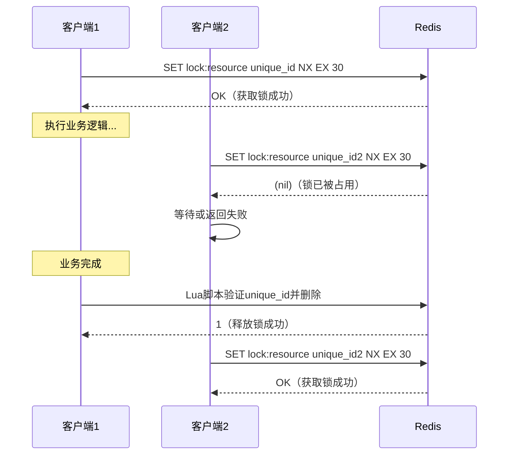
```mermaid
sequenceDiagram
    participant C1 as 客户端1
    participant C2 as 客户端2
    participant R as Redis

    C1->>R: SET lock:resource unique_id NX EX 30
    R-->>C1: OK（获取锁成功）

    Note over C1: 执行业务逻辑...

    C2->>R: SET lock:resource unique_id2 NX EX 30
    R-->>C2: (nil)（锁已被占用）

    C2->>C2: 等待或返回失败

    Note over C1: 业务完成

    C1->>R: Lua脚本验证unique_id并删除
    R-->>C1: 1（释放锁成功）

    C2->>R: SET lock:resource unique_id2 NX EX 30
    R-->>C2: OK（获取锁成功）
```

**锁实现代码（Python）：**

```python
import redis
import uuid
import time

class RedisLock:
    def __init__(self, redis_client, lock_name, expire_time=30):
        self.redis = redis_client
        self.lock_name = f"lock:{lock_name}"
        self.expire_time = expire_time
        self.identifier = str(uuid.uuid4())

    def acquire(self, timeout=10):
        """获取锁"""
        end_time = time.time() + timeout
        while time.time() < end_time:
            # SET NX EX 原子操作
            if self.redis.set(self.lock_name, self.identifier,
                             nx=True, ex=self.expire_time):
                return True
            time.sleep(0.001)  # 1ms
        return False

    def release(self):
        """释放锁（使用Lua脚本保证原子性）"""
        lua_script = """
        if redis.call("get", KEYS[1]) == ARGV[1] then
            return redis.call("del", KEYS[1])
        else
            return 0
        end
        """
        return self.redis.eval(lua_script, 1, self.lock_name, self.identifier)

# 使用示例
r = redis.Redis(host='localhost', port=6379)
lock = RedisLock(r, "order:create:user:1000")

if lock.acquire(timeout=5):
    try:
        # 执行业务逻辑
        print("获取锁成功，执行订单创建...")
        time.sleep(2)
    finally:
        lock.release()
        print("释放锁")
else:
    print("获取锁失败")
```

**Redlock算法（分布式锁）：**

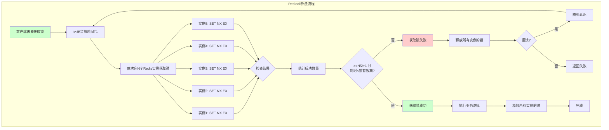
```mermaid
graph TB
    subgraph "Redlock算法流程"
        Start[客户端需要获取锁] --> GetTime[记录当前时间T1]
        GetTime --> TryLock[依次向N个Redis实例获取锁]

        TryLock --> R1[实例1: SET NX EX]
        TryLock --> R2[实例2: SET NX EX]
        TryLock --> R3[实例3: SET NX EX]
        TryLock --> R4[实例4: SET NX EX]
        TryLock --> R5[实例5: SET NX EX]

        R1 & R2 & R3 & R4 & R5 --> Check{检查结果}

        Check --> Count[统计成功数量]
        Count --> Verify{>=N/2+1 且<br/>耗时<锁有效期?}

        Verify -->|是| Success[获取锁成功]
        Verify -->|否| Fail[获取锁失败]

        Fail --> Release[释放所有实例的锁]
        Release --> Retry{重试?}
        Retry -->|是| Wait[随机延迟]
        Wait --> GetTime
        Retry -->|否| End1[返回失败]

        Success --> Business[执行业务逻辑]
        Business --> ReleaseAll[释放所有实例的锁]
        ReleaseAll --> End2[完成]
    end

    style Start fill:#ccffcc
    style Success fill:#ccffcc
    style Fail fill:#ffcccc
```

**Redlock实现要点：**

1. **至少5个独立的Redis实例**（不是主从复制）
2. **顺序获取锁**，超时时间应远小于锁的过期时间
3. **获取锁成功条件**：
   - 在大多数实例（≥N/2+1）上获取成功
   - 获取锁的总耗时小于锁的有效时间
4. **锁的有效时间 = 初始有效时间 - 获取锁耗时 - 时钟漂移**
5. **释放锁**：向所有实例发送释放命令（即使获取失败）

### 12.2 分布式Session管理

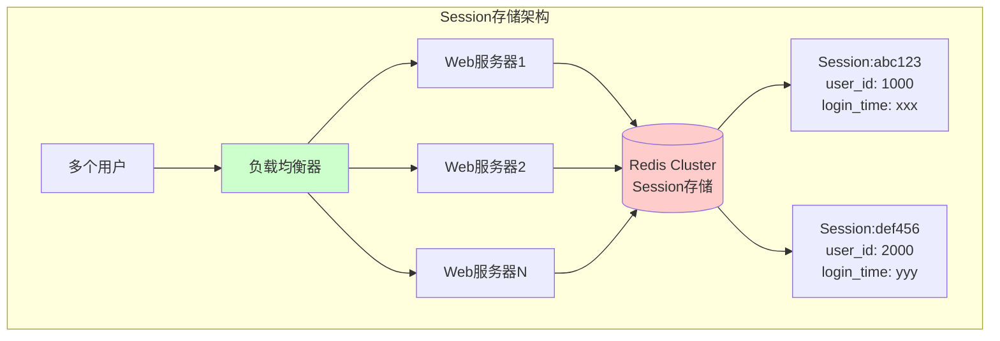
```mermaid
graph TB
    subgraph "Session存储架构"
        Users[多个用户]

        Users --> LB[负载均衡器]

        LB --> Web1[Web服务器1]
        LB --> Web2[Web服务器2]
        LB --> Web3[Web服务器N]

        Web1 & Web2 & Web3 --> Redis[(Redis Cluster<br/>Session存储)]

        Redis --> Session1[Session:abc123<br/>user_id: 1000<br/>login_time: xxx]
        Redis --> Session2[Session:def456<br/>user_id: 2000<br/>login_time: yyy]
    end

    style Redis fill:#ffcccc
    style LB fill:#ccffcc
```

**Session管理实现：**

```python
import redis
import json
import hashlib
from datetime import datetime, timedelta

class SessionManager:
    def __init__(self, redis_client, expire_seconds=3600):
        self.redis = redis_client
        self.expire_seconds = expire_seconds

    def create_session(self, user_id, user_data):
        """创建Session"""
        session_id = self._generate_session_id(user_id)
        session_key = f"session:{session_id}"

        session_data = {
            "user_id": user_id,
            "created_at": datetime.now().isoformat(),
            "user_data": user_data
        }

        # 使用Hash存储Session数据
        self.redis.hset(session_key, mapping=session_data)
        self.redis.expire(session_key, self.expire_seconds)

        return session_id

    def get_session(self, session_id):
        """获取Session"""
        session_key = f"session:{session_id}"
        session_data = self.redis.hgetall(session_key)

        if session_data:
            # 延长过期时间（滑动过期）
            self.redis.expire(session_key, self.expire_seconds)
            return {k.decode(): v.decode() for k, v in session_data.items()}
        return None

    def update_session(self, session_id, data):
        """更新Session"""
        session_key = f"session:{session_id}"
        if self.redis.exists(session_key):
            self.redis.hset(session_key, mapping=data)
            self.redis.expire(session_key, self.expire_seconds)
            return True
        return False

    def delete_session(self, session_id):
        """删除Session（登出）"""
        session_key = f"session:{session_id}"
        return self.redis.delete(session_key) > 0

    def _generate_session_id(self, user_id):
        """生成SessionID"""
        import secrets
        random_part = secrets.token_hex(16)
        timestamp = str(datetime.now().timestamp())
        raw = f"{user_id}:{timestamp}:{random_part}"
        return hashlib.sha256(raw.encode()).hexdigest()

# Flask集成示例
from flask import Flask, session, request
from flask_session import Session

app = Flask(__name__)
app.config['SESSION_TYPE'] = 'redis'
app.config['SESSION_REDIS'] = redis.Redis(host='localhost', port=6379)
app.config['SESSION_PERMANENT'] = False
app.config['PERMANENT_SESSION_LIFETIME'] = timedelta(hours=1)

Session(app)

@app.route('/login', methods=['POST'])
def login():
    user_id = request.json.get('user_id')
    session['user_id'] = user_id
    session['login_time'] = datetime.now().isoformat()
    return {'status': 'success', 'session_id': session.sid}

@app.route('/profile')
def profile():
    user_id = session.get('user_id')
    if not user_id:
        return {'error': 'Not logged in'}, 401
    return {'user_id': user_id, 'login_time': session.get('login_time')}

@app.route('/logout', methods=['POST'])
def logout():
    session.clear()
    return {'status': 'logged out'}
```

### 12.3 缓存策略模式

**Cache-Aside（旁路缓存）：**

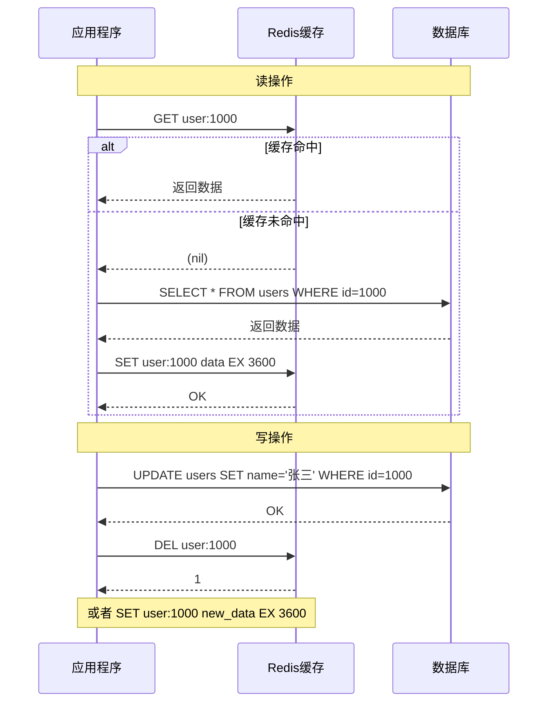
```mermaid
sequenceDiagram
    participant App as 应用程序
    participant Cache as Redis缓存
    participant DB as 数据库

    Note over App,DB: 读操作

    App->>Cache: GET user:1000
    alt 缓存命中
        Cache-->>App: 返回数据
    else 缓存未命中
        Cache-->>App: (nil)
        App->>DB: SELECT * FROM users WHERE id=1000
        DB-->>App: 返回数据
        App->>Cache: SET user:1000 data EX 3600
        Cache-->>App: OK
    end

    Note over App,DB: 写操作

    App->>DB: UPDATE users SET name='张三' WHERE id=1000
    DB-->>App: OK
    App->>Cache: DEL user:1000
    Cache-->>App: 1
    Note over App,Cache: 或者 SET user:1000 new_data EX 3600
```

**Read-Through / Write-Through：**

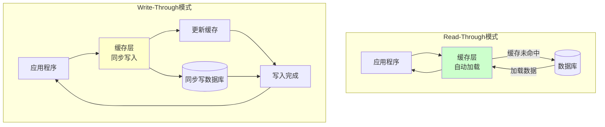
```mermaid
graph TB
    subgraph "Read-Through模式"
        App1[应用程序] --> CacheLayer1[缓存层<br/>自动加载]
        CacheLayer1 -->|缓存未命中| DB1[(数据库)]
        DB1 -->|加载数据| CacheLayer1
        CacheLayer1 --> App1
    end

    subgraph "Write-Through模式"
        App2[应用程序] --> CacheLayer2[缓存层<br/>同步写入]
        CacheLayer2 --> Cache2[更新缓存]
        CacheLayer2 --> DB2[(同步写数据库)]
        Cache2 & DB2 --> Done[写入完成]
        Done --> App2
    end

    style CacheLayer1 fill:#ccffcc
    style CacheLayer2 fill:#ffffcc
```

**Write-Behind（异步回写）：**

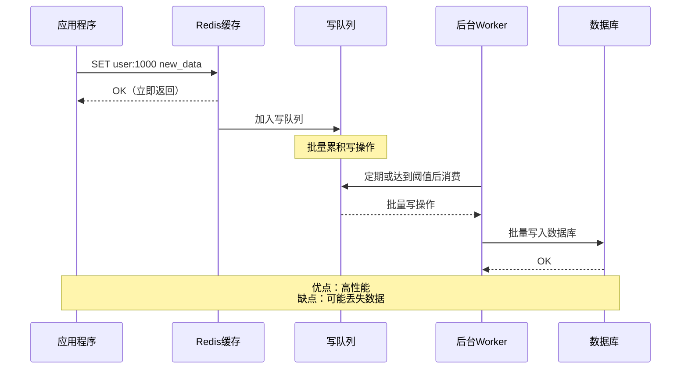
```mermaid
sequenceDiagram
    participant App as 应用程序
    participant Cache as Redis缓存
    participant Queue as 写队列
    participant Worker as 后台Worker
    participant DB as 数据库

    App->>Cache: SET user:1000 new_data
    Cache-->>App: OK（立即返回）

    Cache->>Queue: 加入写队列
    Note over Queue: 批量累积写操作

    Worker->>Queue: 定期或达到阈值后消费
    Queue-->>Worker: 批量写操作

    Worker->>DB: 批量写入数据库
    DB-->>Worker: OK

    Note over App,DB: 优点：高性能<br/>缺点：可能丢失数据
```

**缓存实现示例：**

```python
import redis
import json
import hashlib
from functools import wraps
from typing import Optional, Callable, Any

class CacheManager:
    def __init__(self, redis_client: redis.Redis, default_ttl: int = 3600):
        self.redis = redis_client
        self.default_ttl = default_ttl

    def cache_aside(self, key_prefix: str, ttl: Optional[int] = None):
        """Cache-Aside装饰器"""
        def decorator(func: Callable) -> Callable:
            @wraps(func)
            def wrapper(*args, **kwargs) -> Any:
                # 生成缓存键
                cache_key = self._make_key(key_prefix, args, kwargs)

                # 尝试从缓存读取
                cached = self.redis.get(cache_key)
                if cached:
                    return json.loads(cached)

                # 缓存未命中，执行函数
                result = func(*args, **kwargs)

                # 写入缓存
                expire = ttl or self.default_ttl
                self.redis.setex(cache_key, expire, json.dumps(result))

                return result
            return wrapper
        return decorator

    def invalidate(self, key_prefix: str, *args, **kwargs):
        """使缓存失效"""
        cache_key = self._make_key(key_prefix, args, kwargs)
        self.redis.delete(cache_key)

    def _make_key(self, prefix: str, args: tuple, kwargs: dict) -> str:
        """生成缓存键"""
        key_data = f"{prefix}:{args}:{sorted(kwargs.items())}"
        return f"cache:{hashlib.md5(key_data.encode()).hexdigest()}"

# 使用示例
r = redis.Redis(host='localhost', port=6379, decode_responses=True)
cache = CacheManager(r)

@cache.cache_aside('user_profile', ttl=1800)
def get_user_profile(user_id: int):
    """模拟从数据库获取用户信息"""
    print(f"从数据库查询用户{user_id}")
    # 实际应该是数据库查询
    return {
        'user_id': user_id,
        'name': '张三',
        'email': 'zhangsan@example.com'
    }

def update_user_profile(user_id: int, data: dict):
    """更新用户信息"""
    # 更新数据库
    print(f"更新数据库：用户{user_id}")

    # 使缓存失效
    cache.invalidate('user_profile', user_id)

# 测试
profile = get_user_profile(1000)  # 第一次：查询数据库
profile = get_user_profile(1000)  # 第二次：从缓存读取

update_user_profile(1000, {'name': '李四'})
profile = get_user_profile(1000)  # 缓存失效，重新查询数据库
```

### 12.4 限流器实现

**固定窗口限流：**

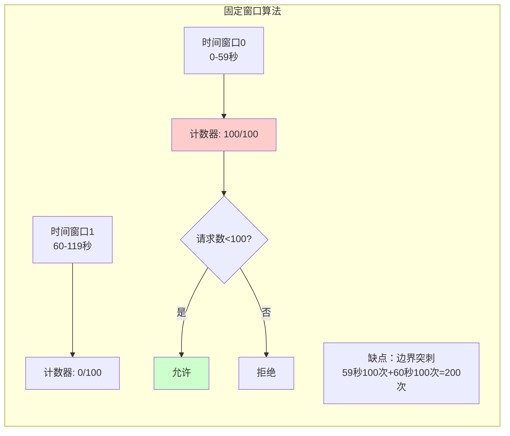
```mermaid
graph LR
    subgraph "固定窗口算法"
        T0[时间窗口0<br/>0-59秒] --> C0[计数器: 100/100]
        T1[时间窗口1<br/>60-119秒] --> C1[计数器: 0/100]

        C0 --> Check0{请求数<100?}
        Check0 -->|是| Allow0[允许]
        Check0 -->|否| Deny0[拒绝]

        Note0[缺点：边界突刺<br/>59秒100次+60秒100次=200次]
    end

    style C0 fill:#ffcccc
    style Allow0 fill:#ccffcc
```

**滑动窗口限流：**

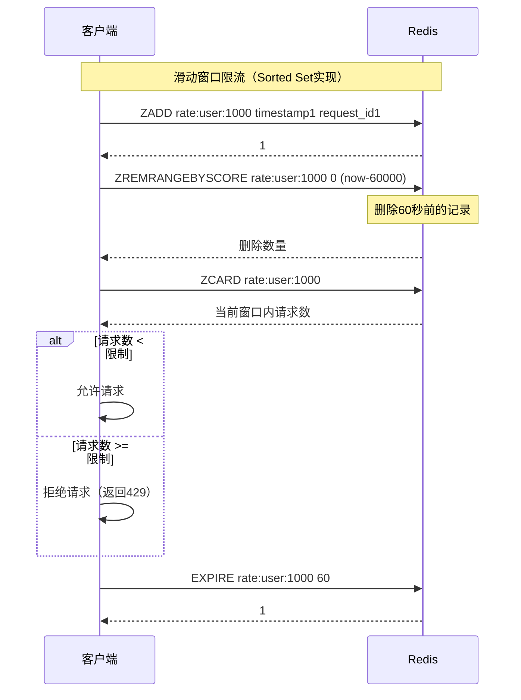
```mermaid
sequenceDiagram
    participant C as 客户端
    participant R as Redis

    Note over C,R: 滑动窗口限流（Sorted Set实现）

    C->>R: ZADD rate:user:1000 timestamp1 request_id1
    R-->>C: 1

    C->>R: ZREMRANGEBYSCORE rate:user:1000 0 (now-60000)
    Note over R: 删除60秒前的记录

    R-->>C: 删除数量

    C->>R: ZCARD rate:user:1000
    R-->>C: 当前窗口内请求数

    alt 请求数 < 限制
        C->>C: 允许请求
    else 请求数 >= 限制
        C->>C: 拒绝请求（返回429）
    end

    C->>R: EXPIRE rate:user:1000 60
    R-->>C: 1
```

**令牌桶限流：**

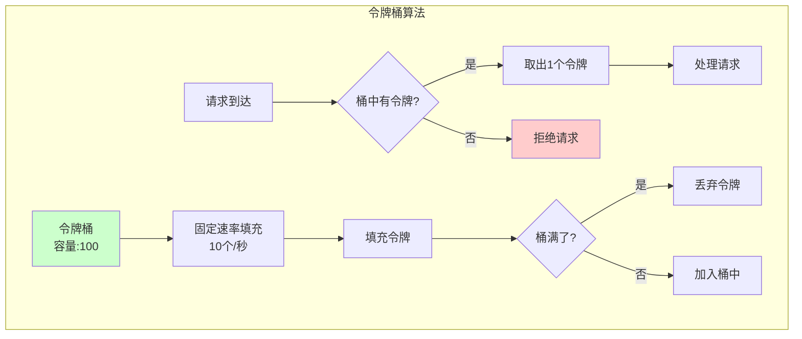
```mermaid
graph TB
    subgraph "令牌桶算法"
        Bucket[令牌桶<br/>容量:100] --> Rate[固定速率填充<br/>10个/秒]

        Request[请求到达] --> Check{桶中有令牌?}
        Check -->|是| Take[取出1个令牌]
        Check -->|否| Reject[拒绝请求]

        Take --> Process[处理请求]

        Rate --> Fill[填充令牌]
        Fill --> Full{桶满了?}
        Full -->|是| Discard[丢弃令牌]
        Full -->|否| Add[加入桶中]
    end

    style Bucket fill:#ccffcc
    style Reject fill:#ffcccc
```

**限流器实现代码：**

```python
import redis
import time
from typing import Optional

class RateLimiter:
    def __init__(self, redis_client: redis.Redis):
        self.redis = redis_client

    def fixed_window(self, key: str, limit: int, window: int = 60) -> bool:
        """
        固定窗口限流
        :param key: 限流键（如 user_id 或 ip）
        :param limit: 窗口内最大请求数
        :param window: 窗口大小（秒）
        """
        rate_key = f"rate:fixed:{key}"
        current = int(time.time())
        window_start = current - (current % window)

        pipe = self.redis.pipeline()
        pipe.incr(f"{rate_key}:{window_start}")
        pipe.expire(f"{rate_key}:{window_start}", window * 2)
        results = pipe.execute()

        count = results[0]
        return count <= limit

    def sliding_window(self, key: str, limit: int, window: int = 60) -> bool:
        """
        滑动窗口限流（基于Sorted Set）
        :param key: 限流键
        :param limit: 窗口内最大请求数
        :param window: 窗口大小（秒）
        """
        rate_key = f"rate:sliding:{key}"
        now = time.time()
        window_start = now - window

        pipe = self.redis.pipeline()
        # 删除窗口外的记录
        pipe.zremrangebyscore(rate_key, 0, window_start)
        # 添加当前请求
        pipe.zadd(rate_key, {str(now): now})
        # 统计窗口内请求数
        pipe.zcard(rate_key)
        # 设置过期时间
        pipe.expire(rate_key, window)

        results = pipe.execute()
        count = results[2]

        return count <= limit

    def token_bucket(self, key: str, rate: int, capacity: int) -> bool:
        """
        令牌桶限流（基于Lua脚本）
        :param key: 限流键
        :param rate: 每秒生成的令牌数
        :param capacity: 桶容量
        """
        lua_script = """
        local key = KEYS[1]
        local rate = tonumber(ARGV[1])
        local capacity = tonumber(ARGV[2])
        local now = tonumber(ARGV[3])
        local requested = tonumber(ARGV[4])

        local fill_time = capacity / rate
        local ttl = math.floor(fill_time * 2)

        local last_tokens = tonumber(redis.call("hget", key, "tokens"))
        if last_tokens == nil then
            last_tokens = capacity
        end

        local last_refreshed = tonumber(redis.call("hget", key, "refreshed"))
        if last_refreshed == nil then
            last_refreshed = 0
        end

        local delta = math.max(0, now - last_refreshed)
        local filled_tokens = math.min(capacity, last_tokens + (delta * rate))
        local allowed = filled_tokens >= requested
        local new_tokens = filled_tokens
        if allowed then
            new_tokens = filled_tokens - requested
        end

        redis.call("hset", key, "tokens", new_tokens)
        redis.call("hset", key, "refreshed", now)
        redis.call("expire", key, ttl)

        return allowed
        """

        rate_key = f"rate:token:{key}"
        now = time.time()

        result = self.redis.eval(
            lua_script,
            1,
            rate_key,
            rate,
            capacity,
            now,
            1  # 每次请求消耗1个令牌
        )

        return bool(result)

# 使用示例
r = redis.Redis(host='localhost', port=6379)
limiter = RateLimiter(r)

def handle_request(user_id: int):
    """处理用户请求"""
    # 滑动窗口：60秒内最多100次请求
    if not limiter.sliding_window(f"user:{user_id}", limit=100, window=60):
        return {"error": "Too Many Requests", "status": 429}

    # 令牌桶：每秒10个令牌，桶容量50
    if not limiter.token_bucket(f"user:{user_id}:burst", rate=10, capacity=50):
        return {"error": "Rate limit exceeded", "status": 429}

    # 处理正常请求
    return {"status": "success", "data": "..."}

# 测试
for i in range(150):
    result = handle_request(1000)
    if result.get('status') == 429:
        print(f"第{i+1}次请求被限流")
        break
```

### 12.5 排行榜系统

```mermaid
graph TB
    subgraph "排行榜架构"
        Users[用户操作] --> Action{操作类型}

        Action -->|增加分数| ZINCRBY[ZINCRBY leaderboard score user_id]
        Action -->|查询排名| ZRANK[ZREVRANK leaderboard user_id]
        Action -->|查询分数| ZSCORE[ZSCORE leaderboard user_id]
        Action -->|获取榜单| ZREVRANGE[ZREVRANGE leaderboard 0 99]

        ZINCRBY --> ZSet[(Sorted Set<br/>leaderboard)]
        ZRANK --> ZSet
        ZSCORE --> ZSet
        ZREVRANGE --> ZSet

        ZSet --> Display[展示排行榜]
    end

    style ZSet fill:#ffcccc
    style Display fill:#ccffcc
```

**排行榜实现：**

```python
import redis
from typing import List, Dict, Optional
from datetime import datetime

class Leaderboard:
    def __init__(self, redis_client: redis.Redis, name: str):
        self.redis = redis_client
        self.key = f"leaderboard:{name}"

    def add_score(self, user_id: str, score: float):
        """增加用户分数"""
        self.redis.zincrby(self.key, score, user_id)

    def set_score(self, user_id: str, score: float):
        """设置用户分数"""
        self.redis.zadd(self.key, {user_id: score})

    def get_score(self, user_id: str) -> Optional[float]:
        """获取用户分数"""
        score = self.redis.zscore(self.key, user_id)
        return float(score) if score is not None else None

    def get_rank(self, user_id: str) -> Optional[int]:
        """获取用户排名（从0开始）"""
        rank = self.redis.zrevrank(self.key, user_id)
        return rank if rank is not None else None

    def get_top(self, count: int = 10, with_scores: bool = True) -> List:
        """获取排行榜前N名"""
        return self.redis.zrevrange(
            self.key,
            0,
            count - 1,
            withscores=with_scores
        )

    def get_around(self, user_id: str, count: int = 10) -> List:
        """获取用户周围的排名"""
        rank = self.get_rank(user_id)
        if rank is None:
            return []

        start = max(0, rank - count // 2)
        end = rank + count // 2

        return self.redis.zrevrange(
            self.key,
            start,
            end,
            withscores=True
        )

    def get_range_by_score(self, min_score: float, max_score: float) -> List:
        """按分数范围获取"""
        return self.redis.zrangebyscore(
            self.key,
            min_score,
            max_score,
            withscores=True
        )

    def remove_user(self, user_id: str):
        """移除用户"""
        self.redis.zrem(self.key, user_id)

    def total_users(self) -> int:
        """总用户数"""
        return self.redis.zcard(self.key)

# 时间分片排行榜（日榜、周榜、月榜）
class TimeBasedLeaderboard:
    def __init__(self, redis_client: redis.Redis, base_name: str):
        self.redis = redis_client
        self.base_name = base_name

    def _get_key(self, time_type: str) -> str:
        """生成时间分片的键"""
        now = datetime.now()
        if time_type == 'daily':
            suffix = now.strftime('%Y%m%d')
        elif time_type == 'weekly':
            suffix = now.strftime('%Y-W%W')
        elif time_type == 'monthly':
            suffix = now.strftime('%Y%m')
        else:
            suffix = 'all'
        return f"leaderboard:{self.base_name}:{time_type}:{suffix}"

    def add_score(self, user_id: str, score: float):
        """同时更新日榜、周榜、月榜、总榜"""
        pipe = self.redis.pipeline()
        for time_type in ['daily', 'weekly', 'monthly', 'all']:
            key = self._get_key(time_type)
            pipe.zincrby(key, score, user_id)

            # 设置过期时间
            if time_type == 'daily':
                pipe.expire(key, 86400 * 7)  # 保留7天
            elif time_type == 'weekly':
                pipe.expire(key, 86400 * 30)  # 保留30天
            elif time_type == 'monthly':
                pipe.expire(key, 86400 * 365)  # 保留1年

        pipe.execute()

    def get_top(self, time_type: str, count: int = 10):
        """获取指定时间维度的榜单"""
        key = self._get_key(time_type)
        return self.redis.zrevrange(key, 0, count - 1, withscores=True)

# 使用示例
r = redis.Redis(host='localhost', port=6379, decode_responses=True)

# 游戏排行榜
game_leaderboard = Leaderboard(r, 'game:pvp')

# 添加分数
game_leaderboard.add_score('player:1000', 50)
game_leaderboard.add_score('player:2000', 100)
game_leaderboard.add_score('player:3000', 75)

# 获取前10名
top10 = game_leaderboard.get_top(10)
for idx, (user, score) in enumerate(top10, 1):
    print(f"第{idx}名: {user} - {score}分")

# 获取某用户排名
rank = game_leaderboard.get_rank('player:1000')
print(f"player:1000 排名: {rank + 1}")

# 时间分片排行榜
activity_leaderboard = TimeBasedLeaderboard(r, 'activity')

# 用户完成任务
activity_leaderboard.add_score('user:1000', 10)

# 获取今日排行榜
daily_top = activity_leaderboard.get_top('daily', 10)
print("今日排行榜:", daily_top)

# 获取本周排行榜
weekly_top = activity_leaderboard.get_top('weekly', 10)
print("本周排行榜:", weekly_top)
```

### 12.6 性能优化最佳实践

```mermaid
graph TB
    subgraph "Redis性能优化策略"
        Opt[性能优化] --> Network[网络优化]
        Opt --> Memory[内存优化]
        Opt --> Command[命令优化]
        Opt --> Arch[架构优化]

        Network --> N1[使用连接池]
        Network --> N2[Pipeline批量操作]
        Network --> N3[本地缓存]

        Memory --> M1[选择合适编码]
        Memory --> M2[设置过期时间]
        Memory --> M3[内存淘汰策略]
        Memory --> M4[数据压缩]

        Command --> C1[避免KEYS命令]
        Command --> C2[使用SCAN代替KEYS]
        Command --> C3[Lua脚本减少往返]
        Command --> C4[避免大key]

        Arch --> A1[读写分离]
        Arch --> A2[数据分片]
        Arch --> A3[冷热数据分离]
        Arch --> A4[多级缓存]
    end

    style Opt fill:#ffcccc
```

**Pipeline批量操作示例：**

```python
import redis
import time

r = redis.Redis(host='localhost', port=6379)

# 不使用Pipeline（慢）
start = time.time()
for i in range(1000):
    r.set(f"key:{i}", f"value:{i}")
print(f"无Pipeline: {time.time() - start:.2f}秒")

# 使用Pipeline（快）
start = time.time()
pipe = r.pipeline()
for i in range(1000):
    pipe.set(f"key:{i}", f"value:{i}")
pipe.execute()
print(f"使用Pipeline: {time.time() - start:.2f}秒")
```

**避免大key的策略：**

```mermaid
graph TB
    subgraph "大key问题"
        BigKey[大key问题] --> P1[阻塞命令执行]
        BigKey --> P2[网络拥塞]
        BigKey --> P3[内存分配延迟]
        BigKey --> P4[过期删除阻塞]
    end

    subgraph "解决方案"
        Solution --> S1[拆分大key<br/>hash拆分为多个小hash]
        Solution --> S2[压缩数据<br/>序列化+压缩]
        Solution --> S3[异步删除<br/>UNLINK代替DEL]
        Solution --> S4[监控告警<br/>定期扫描大key]

        S1 --> Example1[user:1000:profile -> <br/>user:1000:profile:1<br/>user:1000:profile:2]
    end

    style BigKey fill:#ffcccc
    style Solution fill:#ccffcc
```

---

## 小结

第4部分详细介绍了Redis的集群和分布式应用实践：

1. **Redis Cluster**
   - 16384个哈希槽的分片机制
   - Gossip协议的去中心化通信
   - MOVED/ASK重定向和客户端路由
   - 集群扩容缩容和槽迁移流程
   - 自动故障检测和从节点选举

2. **分布式应用实践**
   - 分布式锁：单实例锁和Redlock算法
   - Session管理：集中式Session存储
   - 缓存策略：Cache-Aside、Read/Write-Through、Write-Behind
   - 限流器：固定窗口、滑动窗口、令牌桶算法
   - 排行榜：基于Sorted Set的实时排名系统
   - 性能优化：Pipeline、连接池、大key处理

**全系列总结：**

本系列文档共4部分，全面深入地分析了Redis：

- **第1部分**：核心架构、事件驱动模型、底层数据结构（SDS、Dict、SkipList等）
- **第2部分**：五大数据类型实现、命令处理流程、持久化机制、过期淘汰
- **第3部分**：主从复制、PSYNC2、无盘复制、哨兵模式、故障转移
- **第4部分**：Redis Cluster、分布式锁、缓存策略、限流、排行榜

通过这套文档，你已经掌握了Redis从底层原理到分布式应用的完整知识体系。
