# Rust Future 库深度分析文档

## 目录

1. [概述](#概述)
2. [架构设计](#架构设计)
3. [核心组件详解](#核心组件详解)
4. [设计思路与决策](#设计思路与决策)
5. [工作流程](#工作流程)
6. [高级特性](#高级特性)
7. [最佳实践](#最佳实践)

---

## 概述

Rust 的 Future 库是异步编程的核心基础设施，位于 `core::future` 模块中。它提供了零成本抽象的异步计算原语，使得 Rust 能够在不依赖运行时垃圾回收或重量级线程的情况下实现高效的异步编程。

### 模块结构

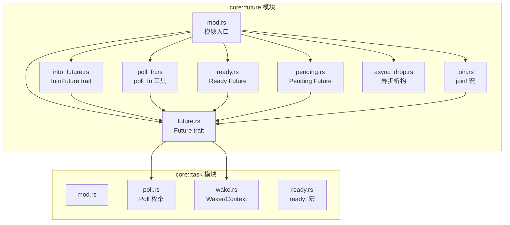

---

## 架构设计

### 核心类型关系

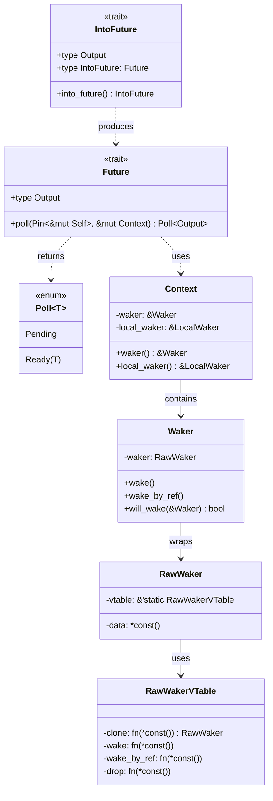

### 设计原则

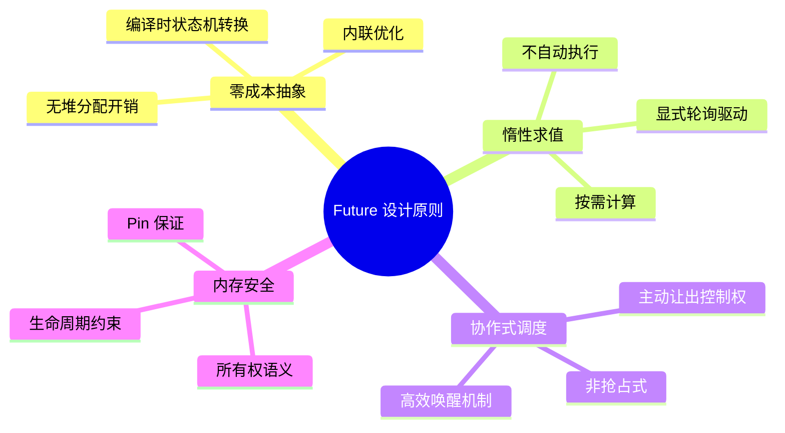

---

## 核心组件详解

### 1. Future Trait

**文件**: `future.rs`

Future trait 是异步计算的核心抽象，表示一个可能尚未完成的计算。

```rust
pub trait Future {
    type Output;
    fn poll(self: Pin<&mut Self>, cx: &mut Context<'_>) -> Poll<Self::Output>;
}
```

#### 设计要点

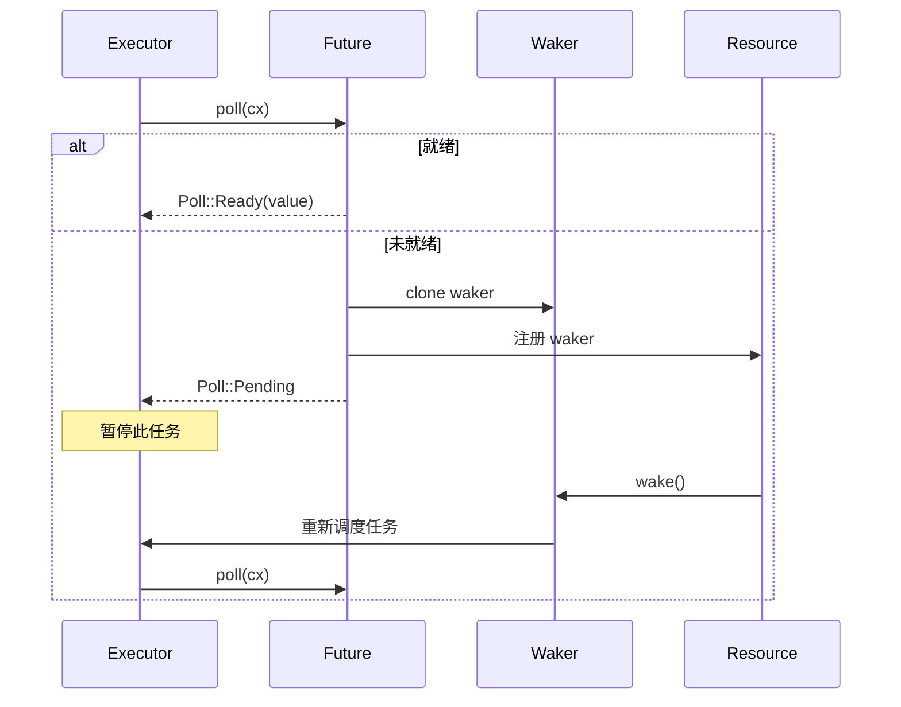

#### 为什么使用 `Pin<&mut Self>`？

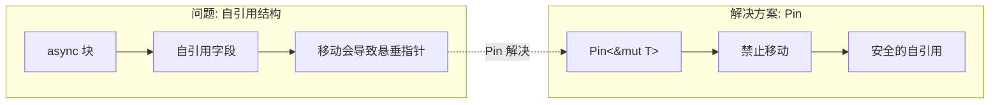

**原因分析**:

1. **自引用问题**: `async` 块编译为状态机时，可能产生自引用结构
2. **内存安全**: 移动自引用结构会导致内部指针失效
3. **Pin 语义**: `Pin<&mut Self>` 保证 Future 在轮询期间不会被移动

### 2. Poll 枚举

**文件**: `task/poll.rs`

```rust
pub enum Poll<T> {
    Ready(T),  // 计算完成，包含结果
    Pending,   // 计算未完成，已注册唤醒
}
```

#### Poll 状态转换

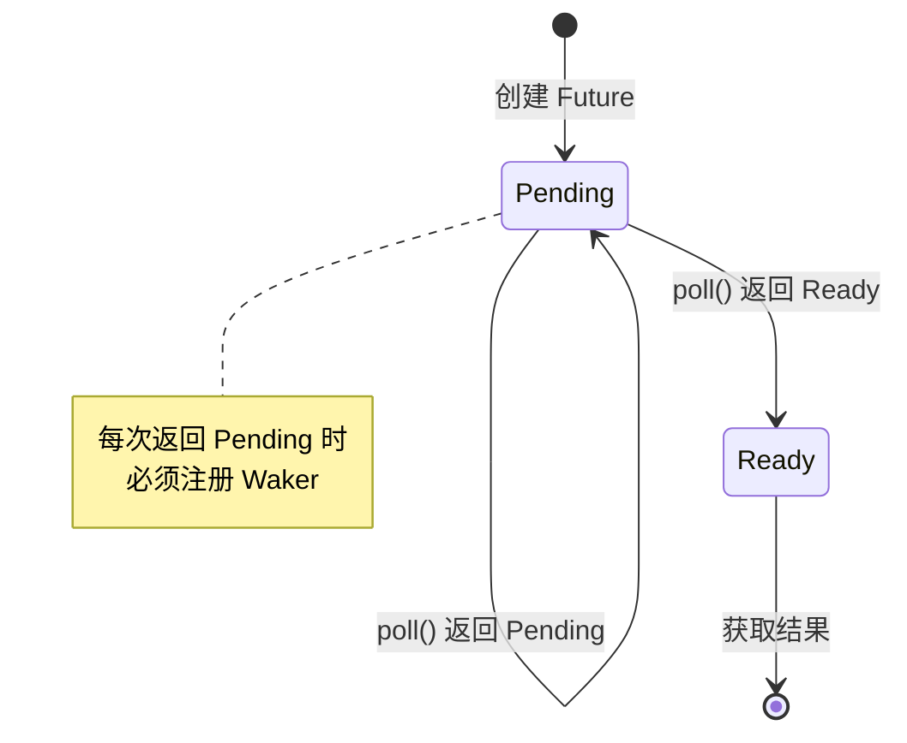

#### Poll 的函数式操作

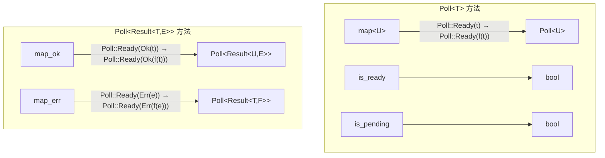

### 3. Waker 唤醒机制

**文件**: `task/wake.rs`

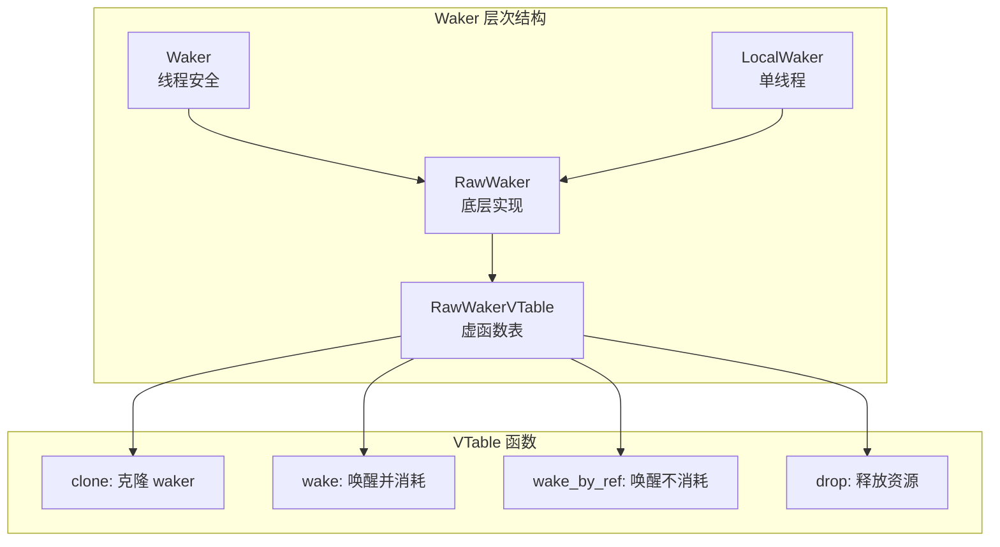

#### 为什么需要 VTable 设计？

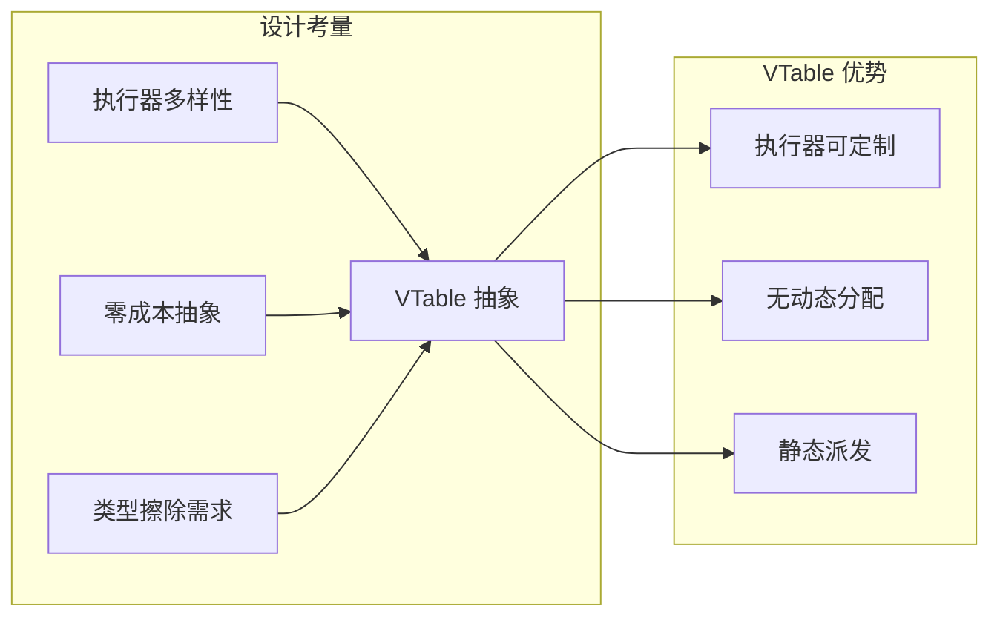

**原因**:

1. **执行器无关**: 不同的异步运行时（tokio, async-std, smol）可以提供不同的 Waker 实现
2. **零分配**: 通过裸指针和函数指针，避免 trait object 的堆分配
3. **灵活性**: 允许执行器存储任意数据（如任务句柄、引用计数等）

### 4. Context 上下文

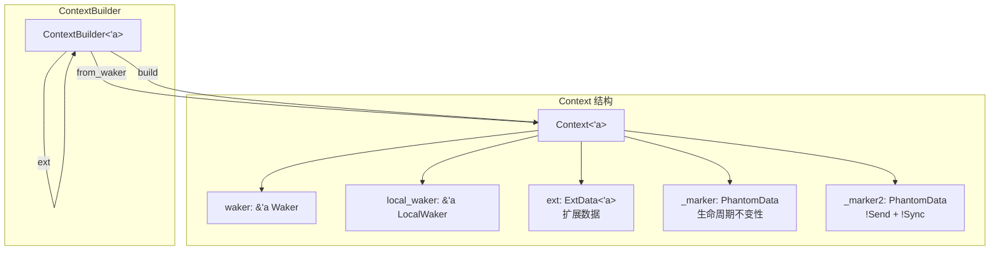

#### 为什么 Context 不是 Send/Sync？

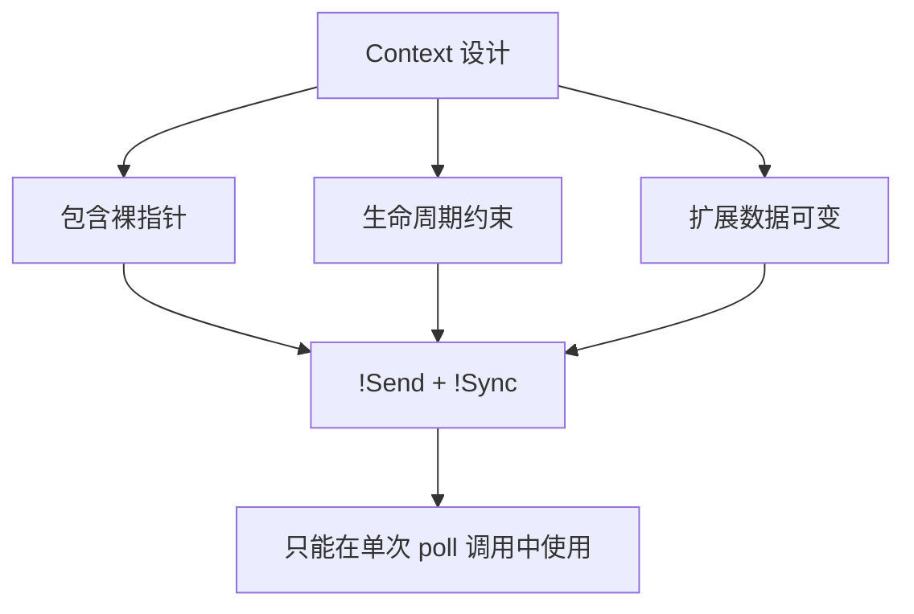

### 5. IntoFuture Trait

**文件**: `into_future.rs`

```rust
pub trait IntoFuture {
    type Output;
    type IntoFuture: Future<Output = Self::Output>;
    fn into_future(self) -> Self::IntoFuture;
}
```

#### `.await` 脱糖过程

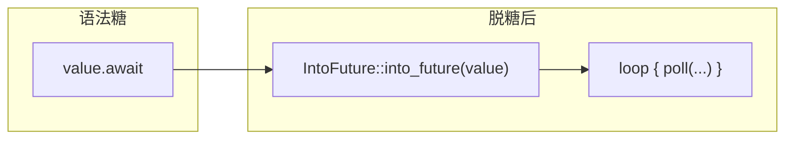

#### 异步构建器模式

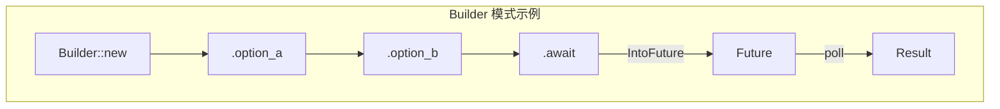

**为什么需要 IntoFuture？**

1. **Builder 模式支持**: 允许链式配置后再 `.await`
2. **类型转换**: 任何类型都可以转换为 Future
3. **向后兼容**: 所有 Future 自动实现 IntoFuture

### 6. Ready 和 Pending

**文件**: `ready.rs`, `pending.rs`

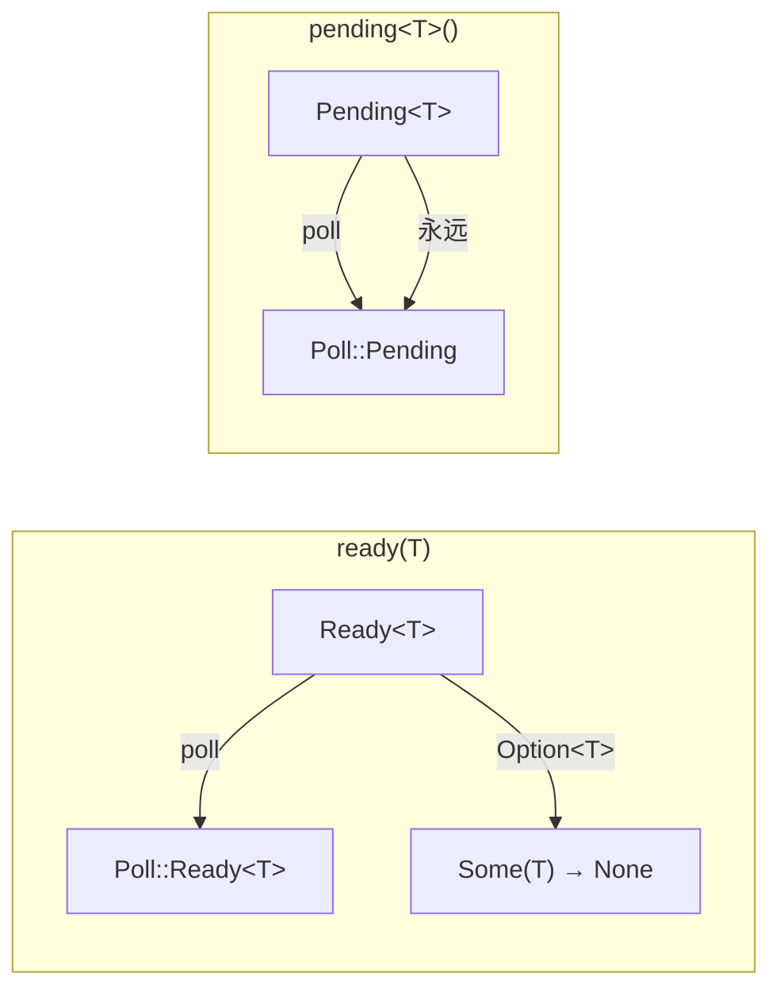

#### Ready 内部结构

```rust
pub struct Ready<T>(Option<T>);
```

**为什么使用 `Option<T>`？**

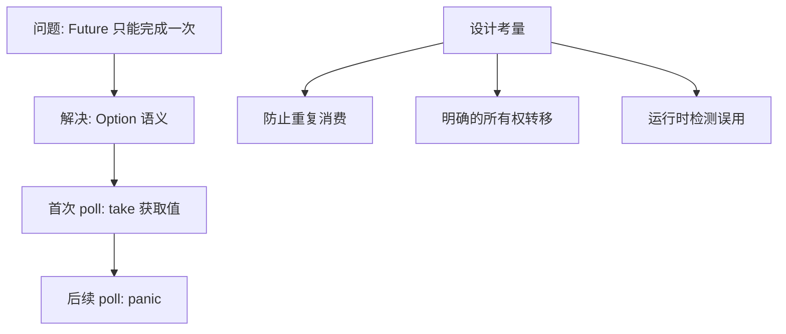

### 7. poll_fn 工具函数

**文件**: `poll_fn.rs`

```rust
pub fn poll_fn<T, F>(f: F) -> PollFn<F>
where
    F: FnMut(&mut Context<'_>) -> Poll<T>
```

#### 用途示意

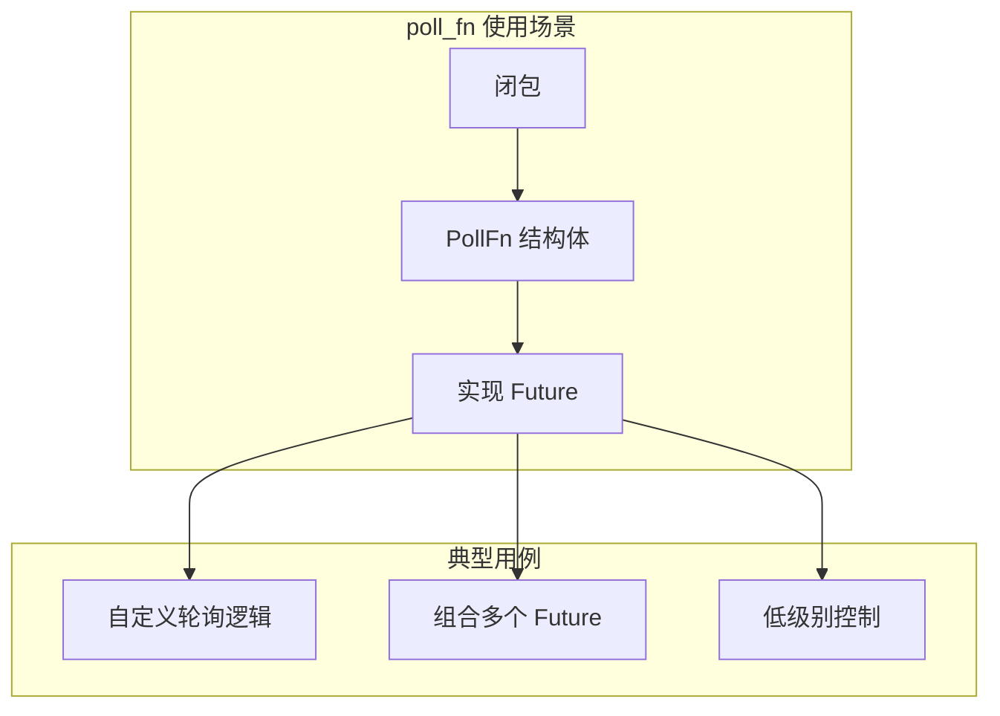

**关键设计：Pin 投影安全性**

```rust
fn poll(self: Pin<&mut Self>, cx: &mut Context<'_>) -> Poll<T> {
    // SAFETY: 我们不会移出 pinned 字段
    (unsafe { &mut self.get_unchecked_mut().f })(cx)
}
```

### 8. join! 宏

**文件**: `join.rs`

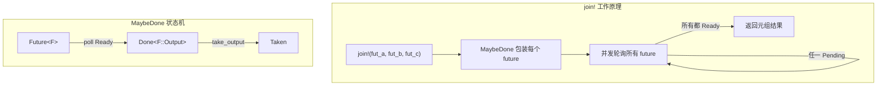

#### MaybeDone 设计

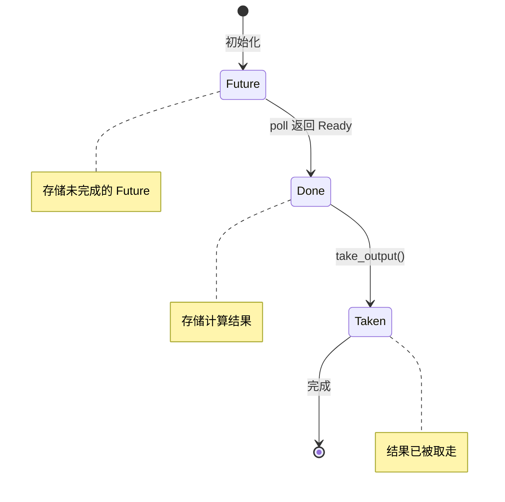

**为什么需要 MaybeDone？**

1. **存储中间结果**: 某些 Future 先完成，需要保存结果
2. **避免重复轮询**: 已完成的 Future 不再轮询
3. **统一 Output 类型**: 所有包装后的 Future 返回 `()`

### 9. AsyncDrop Trait

**文件**: `async_drop.rs`

```rust
pub trait AsyncDrop {
    async fn drop(self: Pin<&mut Self>);
}
```

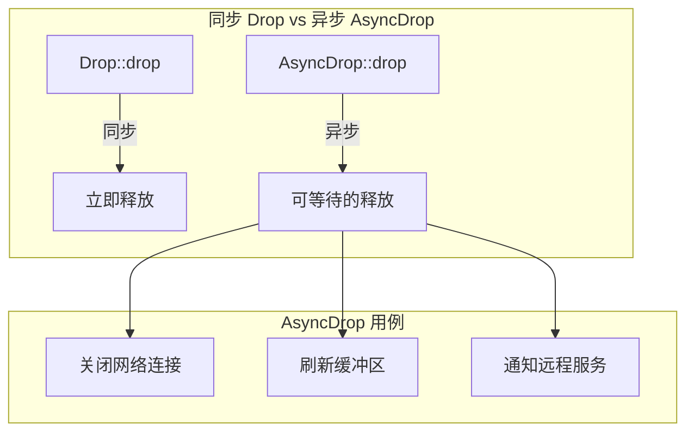

---

## 设计思路与决策

### 1. 为什么选择 Pull-based 模型？

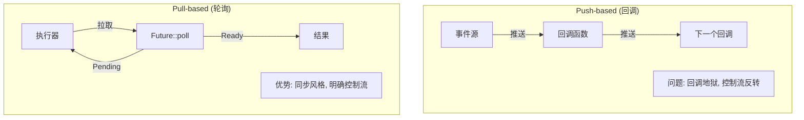

**决策原因**:

| 特性 | Push-based | Pull-based (Rust) |
|------|-----------|-------------------|
| 内存分配 | 每个回调需要闭包 | 状态机，栈分配 |
| 取消支持 | 复杂 | 天然支持（drop） |
| 背压 | 需要额外机制 | 自然具备 |
| 代码风格 | 回调嵌套 | 线性、同步风格 |

### 2. 零成本抽象如何实现？

```mermaid
graph TB
    subgraph "编译时转换"
        ASYNC["async fn foo() { ... }"]
        ASYNC --> |编译器| SM["状态机结构体"]
        SM --> |实现| FUT["impl Future"]
    end

    subgraph "无运行时开销"
        NO_BOX[无堆分配]
        NO_VTABLE[无虚函数调用*]
        INLINE[内联优化]
    end

    FUT --> NO_BOX
    FUT --> NO_VTABLE
    FUT --> INLINE

    NOTE["*除了 Waker 的 vtable"]
```

**状态机示例**:

```rust
// 源代码
async fn example() {
    let x = async_op1().await;
    let y = async_op2(x).await;
    y
}

// 编译后（概念性）
enum ExampleFuture {
    State0 { /* 初始状态 */ },
    State1 { op1_future: Op1Future },
    State2 { x: i32, op2_future: Op2Future },
    Complete,
}
```

### 3. Waker 的生命周期管理

```mermaid
sequenceDiagram
    participant E as Executor
    participant F as Future
    participant W as Waker
    participant IO as I/O 子系统

    E->>F: poll(cx) [cx 包含 Waker]
    F->>W: waker.clone()
    F->>IO: 注册 waker 到事件源
    F-->>E: Poll::Pending

    Note over E: Executor 继续其他任务

    IO->>W: 事件就绪，wake()
    W->>E: 重新调度 Future
    E->>F: poll(cx) [新的 cx]

    Note over F: 使用最新的 Waker
```

**关键设计点**:

1. **只使用最新 Waker**: 每次 poll 传入的 Waker 可能不同
2. **Waker 需要 Clone**: Future 需要保存 Waker 的副本
3. **线程安全**: Waker 必须是 Send + Sync

### 4. ResumeTy 的必要性

```mermaid
graph TB
    subgraph "问题"
        A[Coroutine 不能实现<br/>for&lt;'a,'b&gt; Coroutine&lt;&Context&lt;'b&gt;&gt;]
        B[裸指针和 NonNull 不是 Send/Sync]
    end

    subgraph "解决方案: ResumeTy"
        C[ResumeTy&lpar;NonNull&lt;Context&lt;'static&gt;&gt;&rpar;]
        D[手动实现 Send + Sync]
        E[简化 HIR 降低]
    end

    A --> C
    B --> D
    C --> E
```

---

## 工作流程

### 完整的异步执行流程

```mermaid
sequenceDiagram
    participant User as 用户代码
    participant Runtime as 异步运行时
    participant Reactor as I/O 反应器
    participant OS as 操作系统

    User->>Runtime: spawn(async_task)
    Runtime->>Runtime: 创建任务，分配 Waker

    loop 事件循环
        Runtime->>User: poll(cx)

        alt I/O 未就绪
            User->>Reactor: 注册 Waker
            User-->>Runtime: Poll::Pending
            Runtime->>Reactor: 等待事件
            Reactor->>OS: epoll/kqueue/IOCP
            OS-->>Reactor: 事件就绪
            Reactor->>Runtime: wake()
        else I/O 就绪
            User-->>Runtime: Poll::Ready(result)
            Runtime->>User: 任务完成
        end
    end
```

### Future 组合流程

```mermaid
flowchart TB
    subgraph "async/await 组合"
        A["async fn outer()"]
        A --> B["let x = inner1().await"]
        B --> C["let y = inner2(x).await"]
        C --> D["return f(x, y)"]
    end

    subgraph "编译后的轮询"
        P1["poll outer"]
        P1 --> |"State::Inner1"| P2["poll inner1"]
        P2 --> |Ready| P3["转换到 State::Inner2"]
        P3 --> |"poll inner2"| P4
        P4 --> |Ready| P5["计算结果，返回 Ready"]
    end
```

---

## 高级特性

### 1. ready! 宏

```rust
pub macro ready($e:expr) {
    match $e {
        Poll::Ready(t) => t,
        Poll::Pending => return Poll::Pending,
    }
}
```

```mermaid
flowchart LR
    A["ready!(future.poll(cx))"] --> B{Poll 结果}
    B --> |Ready| C[继续执行]
    B --> |Pending| D[提前返回 Pending]
```

### 2. LocalWaker vs Waker

```mermaid
graph TB
    subgraph "Waker"
        W1[Send + Sync]
        W2[可跨线程传递]
        W3[原子引用计数]
    end

    subgraph "LocalWaker"
        L1[!Send + !Sync]
        L2[单线程使用]
        L3[非原子操作]
        L4[更高性能]
    end

    W1 -.->|性能代价| L1
```

### 3. 类型状态模式在 MaybeDone 中的应用

```mermaid
stateDiagram-v2
    direction LR

    [*] --> Future: MaybeDone::Future(f)
    Future --> Done: poll 返回 Ready
    Done --> Taken: take_output()

    state Future {
        [*] --> Polling
        Polling --> Polling: Pending
        Polling --> [*]: Ready
    }
```

---

## 最佳实践

### 1. 正确处理 Waker

```mermaid
flowchart TB
    A[在 poll 中] --> B{是否返回 Pending?}
    B --> |是| C[必须保存 Waker]
    B --> |否| D[不需要保存]

    C --> E[在资源就绪时调用 wake]

    F[注意] --> G[只使用最新的 Waker]
    F --> H[wake 调用后 executor 会重新 poll]
```

### 2. Pin 的正确使用

```mermaid
graph TB
    subgraph "安全的 Pin 操作"
        S1["Pin::new() - Unpin 类型"]
        S2["pin! 宏 - 栈上固定"]
        S3["Box::pin() - 堆上固定"]
    end

    subgraph "不安全操作"
        U1["Pin::new_unchecked()"]
        U2["Pin::get_unchecked_mut()"]
        U3[需要保证结构性 Pin]
    end
```

### 3. Future 取消

```mermaid
sequenceDiagram
    participant E as Executor
    participant F as Future
    participant R as 资源

    E->>F: poll(cx)
    F->>R: 注册操作
    F-->>E: Poll::Pending

    Note over E: 决定取消

    E->>F: drop(future)
    F->>R: 清理资源 (Drop trait)

    Note over F: Future 被安全取消
```

---

## 总结

Rust 的 Future 库通过精心设计实现了以下目标：

```mermaid
mindmap
  root((Future 库))
    核心价值
      零成本抽象
      内存安全
      高性能
    关键机制
      Poll 轮询模型
      Waker 唤醒机制
      Pin 内存固定
    设计哲学
      显式优于隐式
      编译时优于运行时
      组合优于继承
```

这套设计使得 Rust 能够在系统编程领域提供既安全又高效的异步编程体验，同时保持了与不同运行时的兼容性。
