# 内存管理模块

> `core::mem`, `core::ptr`, `core::alloc` 深度解析

## 概述

Rust 的内存管理系统由三个核心模块组成，形成从底层指针操作到高级内存分配的完整层级：

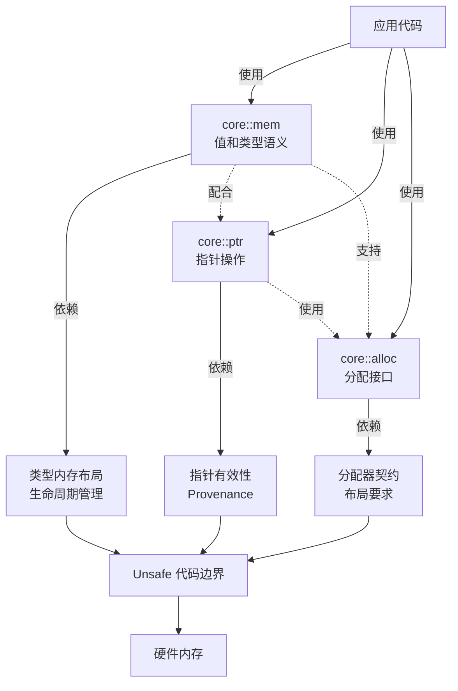

---

## core::mem 模块

### 功能概述

`core::mem` 模块提供处理类型布局、初始化和销毁的基础功能。

### 核心类型

#### MaybeUninit<T> - 未初始化值容器

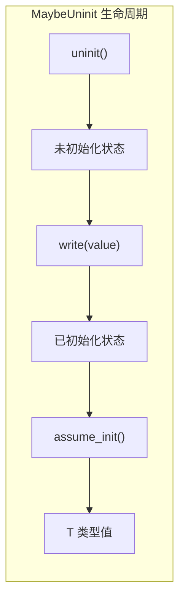

**核心用途**：安全地处理未初始化内存

| 方法 | 功能 | 安全性 |
|------|------|--------|
| `uninit()` | 创建未初始化容器 | Safe |
| `zeroed()` | 创建零值容器 | Safe |
| `write(val)` | 写入值 | Safe |
| `assume_init()` | 声明已初始化 | Unsafe |
| `assume_init_ref()` | 获取引用 | Unsafe |

**使用场景**：
- 延迟初始化
- 数组初始化
- Out-pointer 模式
- FFI 边界

#### ManuallyDrop<T> - 抑制自动销毁

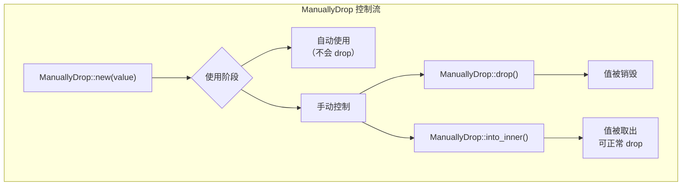

**核心用途**：阻止编译器自动调用析构函数

| 方法 | 功能 | 安全性 |
|------|------|--------|
| `new(value)` | 创建包装 | Safe |
| `into_inner()` | 提取值 | Safe |
| `take()` | 取出值 | Unsafe |
| `drop()` | 手动销毁 | Unsafe |

**注意事项**：
- 零成本抽象，与 T 有完全相同的内存布局
- 不要与包含 `Box` 的类型一起使用（可能导致 UB）

#### Discriminant<T> - 枚举判别值

用于枚举变体的快速比较，透明包装实现 `PartialEq`、`Eq`、`Hash`。

### 关键函数

#### 大小和对齐查询

```rust
// 编译时确定
size_of::<T>() -> usize
align_of::<T>() -> usize

// 运行时查询（支持 DST）
size_of_val(&T) -> usize
align_of_val(&T) -> usize
```

#### 值操作

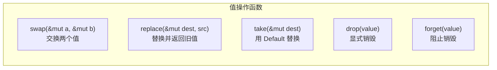

| 函数 | 功能 | 安全性 |
|------|------|--------|
| `swap(x, y)` | 交换两个值 | Safe |
| `replace(dest, src)` | 替换并返回旧值 | Safe |
| `take(dest)` | 用 Default 替换 | Safe |
| `drop(value)` | 显式销毁 | Safe |
| `forget(value)` | 阻止销毁 | Safe |
| `needs_drop::<T>()` | 检查是否需要 drop | Safe |

#### Transmute 操作

```rust
// 危险：按位重新解释类型
transmute::<T, U>(value: T) -> U      // Unsafe
transmute_copy::<T, U>(&src) -> U     // Unsafe
```

**警告**：`transmute` 是最危险的操作之一，仅在必要时使用。

#### offset_of! 宏

```rust
// 获取字段偏移量
offset_of!(Type, field) -> usize
```

---

## core::ptr 模块

### 功能概述

`core::ptr` 处理原始指针的低级操作，提供安全的指针构造和指针语义（Provenance）的正式定义。

### Provenance（来源性）概念

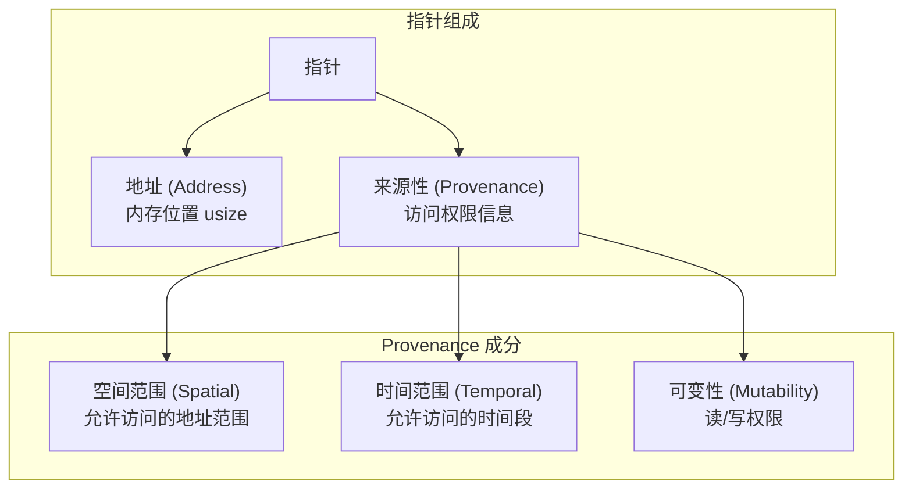

#### Strict Provenance vs Exposed Provenance

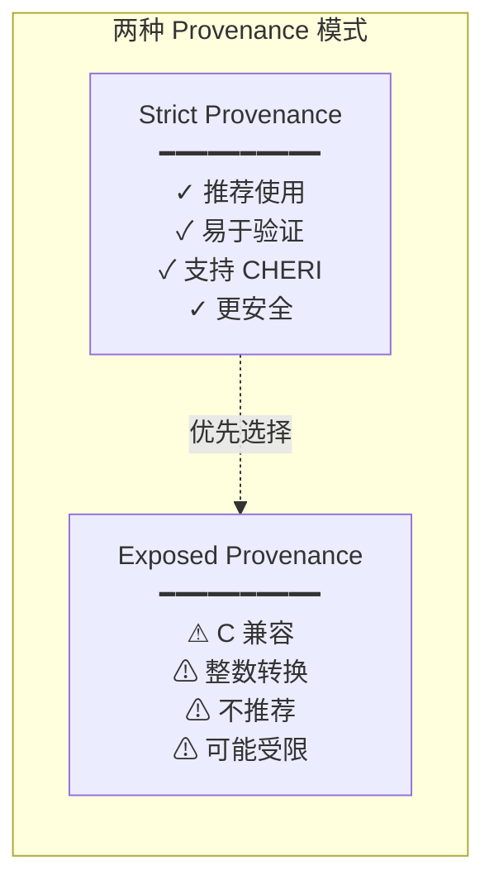

### 核心类型

#### NonNull<T> - 非空指针

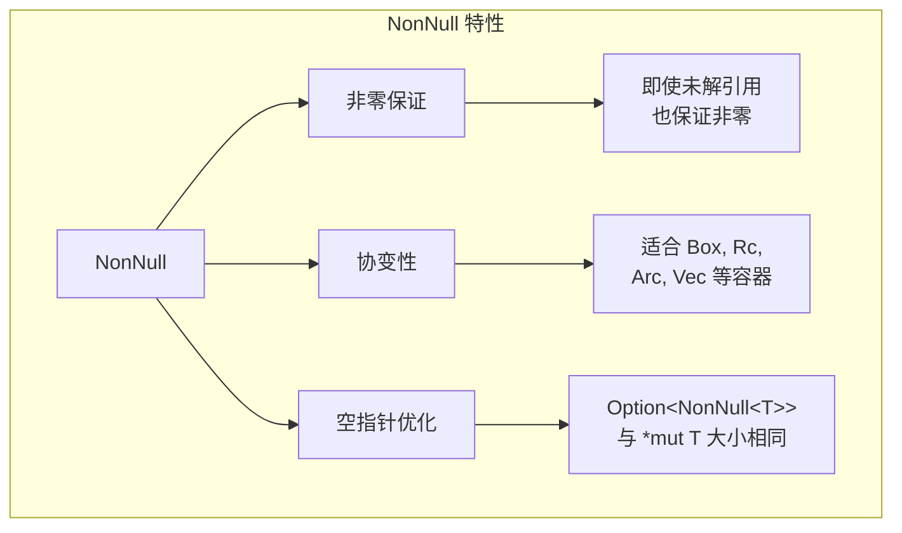

**关键方法**：

| 方法 | 功能 | 安全性 |
|------|------|--------|
| `new(ptr)` | 创建（返回 Option） | Safe |
| `new_unchecked(ptr)` | 创建（不检查） | Unsafe |
| `dangling()` | 创建悬空指针 | Safe |
| `as_ptr()` | 转换为 *mut T | Safe |
| `as_ref()` | 转换为 &T | Unsafe |
| `as_mut()` | 转换为 &mut T | Unsafe |

### 关键函数

#### 指针创建

```rust
null::<T>() -> *const T
null_mut::<T>() -> *mut T
dangling::<T>() -> *const T

// Strict Provenance
without_provenance::<T>(addr) -> *const T

// Exposed Provenance（不推荐）
with_exposed_provenance::<T>(addr) -> *const T
```

#### 内存读写

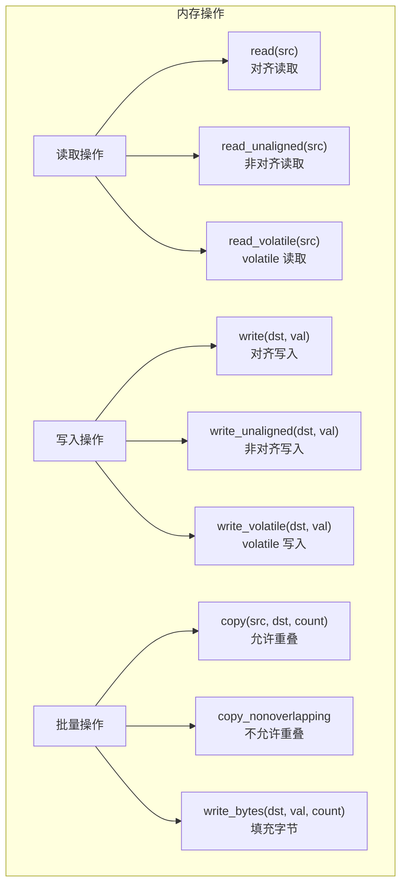

#### addr_of! 宏

```rust
// 避免创建中间引用
addr_of!(place) -> *const T
addr_of_mut!(place) -> *mut T
```

---

## core::alloc 模块

### 功能概述

定义内存分配、释放、重新调整的接口，建立分配器与分配内存的契约。

### Layout - 内存布局描述

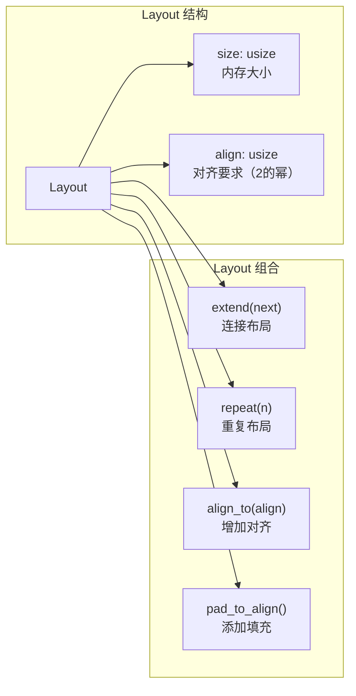

**关键方法**：

| 方法 | 功能 | 返回值 |
|------|------|--------|
| `new::<T>()` | 从类型创建 | Layout |
| `for_value(&T)` | 从值创建 | Layout |
| `from_size_align(size, align)` | 手动创建 | Result<Layout, LayoutError> |
| `size()` | 获取大小 | usize |
| `align()` | 获取对齐 | usize |
| `extend(next)` | 连接布局 | Result<(Layout, usize), LayoutError> |
| `repeat(n)` | 重复布局 | Result<(Layout, usize), LayoutError> |

### Allocator Traits

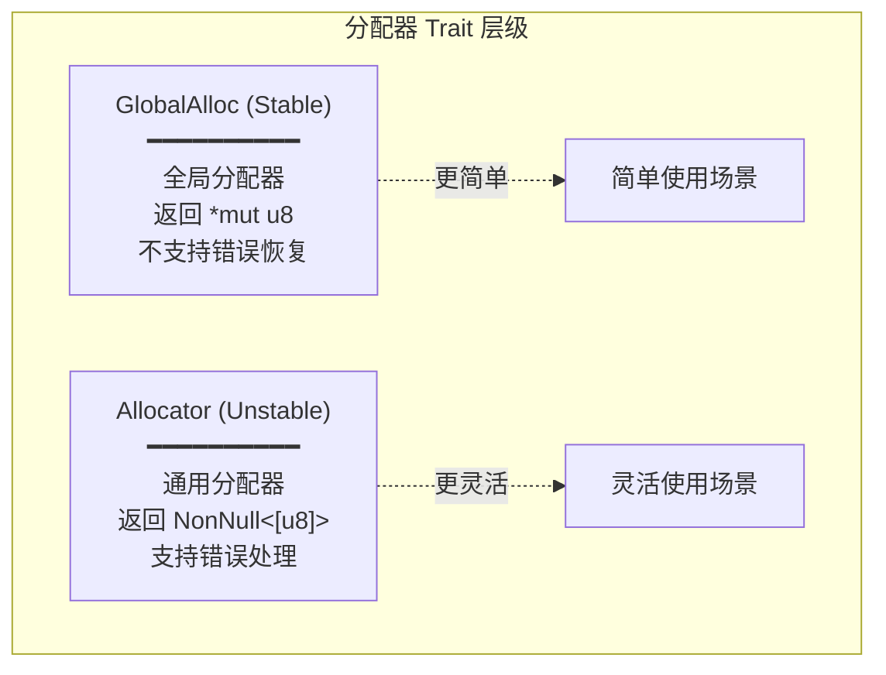

#### GlobalAlloc Trait

```rust
pub unsafe trait GlobalAlloc {
    // 必须实现
    unsafe fn alloc(&self, layout: Layout) -> *mut u8;
    unsafe fn dealloc(&self, ptr: *mut u8, layout: Layout);

    // 有默认实现
    unsafe fn alloc_zeroed(&self, layout: Layout) -> *mut u8;
    unsafe fn realloc(&self, ptr: *mut u8, layout: Layout,
                      new_size: usize) -> *mut u8;
}
```

#### Allocator Trait (Unstable)

```rust
pub unsafe trait Allocator {
    // 必须实现
    fn allocate(&self, layout: Layout) -> Result<NonNull<[u8]>, AllocError>;
    unsafe fn deallocate(&self, ptr: NonNull<u8>, layout: Layout);

    // 有默认实现
    fn allocate_zeroed(&self, layout: Layout) -> Result<NonNull<[u8]>, AllocError>;
    unsafe fn grow(&self, ptr: NonNull<u8>, old: Layout, new: Layout)
        -> Result<NonNull<[u8]>, AllocError>;
    unsafe fn shrink(&self, ptr: NonNull<u8>, old: Layout, new: Layout)
        -> Result<NonNull<[u8]>, AllocError>;
}
```

---

## 完整内存操作流程

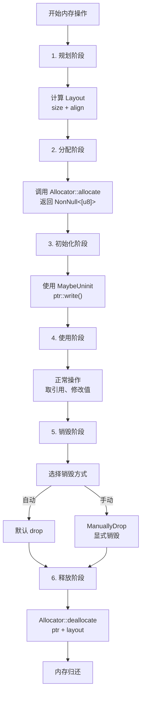

---

## Unsafe 边界划分

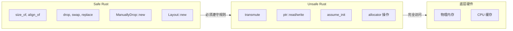

---

## 设计原则总结

### 1. 零成本抽象
- `ManuallyDrop` 和 `MaybeUninit` 无运行时开销
- `NonNull` 与原始指针大小相同

### 2. 安全与 Unsafe 结合
- 提供 Safe API 包裹不安全操作
- 编译时验证大小和对齐信息

### 3. Provenance 形式化
- 明确定义指针的访问权限
- Strict vs Exposed 两种方案

### 4. 分配器设计
- `GlobalAlloc`：简单、全局、不支持错误恢复
- `Allocator`：灵活、本地、支持错误处理
