# 类型系统模块

> `core::marker`, `core::any`, `core::convert`, `core::clone`, `core::cmp`, `core::default` 深度解析

## 概述

Rust 的类型系统模块提供了语言核心的类型抽象和标记 trait，是 Rust 类型安全的基石。

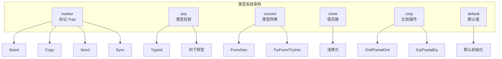

---

## core::marker 模块

### 概述

`marker` 模块定义了编译器用来标记类型属性的特殊 trait，它们通常没有方法，仅用于约束泛型。

### 核心标记 Trait

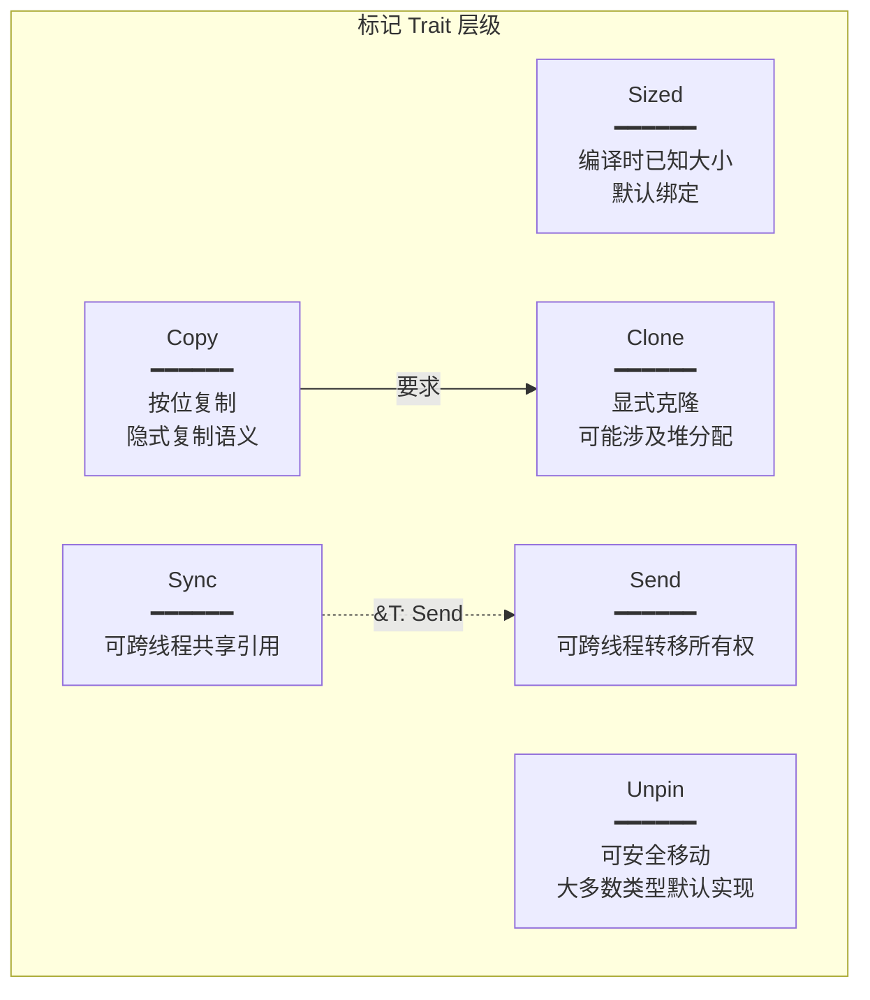

#### Sized Trait

```rust
pub trait Sized {
    // 无方法，编译器自动实现
}
```

**特性**：
- 编译时已知类型大小
- 所有类型参数默认绑定 `Sized`
- 使用 `?Sized` 放宽约束以支持 DST

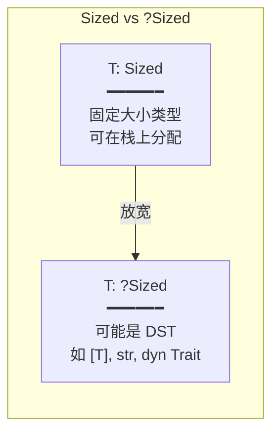

#### Copy Trait

```rust
pub trait Copy: Clone {
    // 无方法，标记 trait
}
```

**特性**：
- 按位复制，不转移所有权
- 必须实现 `Clone`
- 编译器在赋值/传参时隐式复制

**可 Copy 的类型**：
- 所有基本数值类型
- `bool`, `char`
- 元组（元素都是 Copy）
- 数组（元素是 Copy）
- 共享引用 `&T`

**不可 Copy 的类型**：
- `String`, `Vec<T>`
- `Box<T>`
- 可变引用 `&mut T`

#### Send 和 Sync Trait

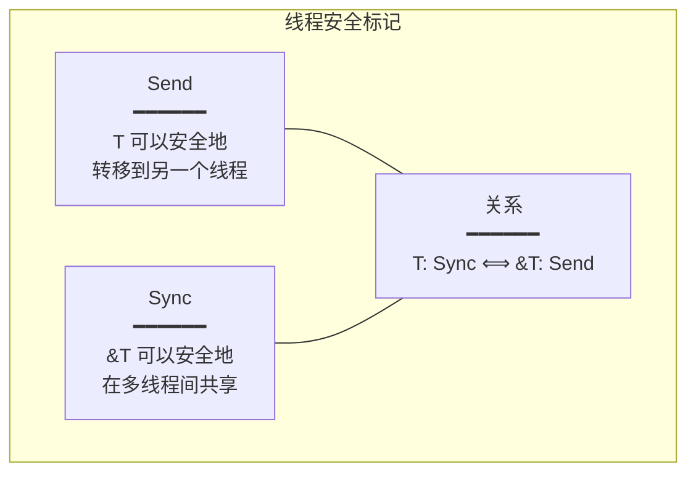

**实现规则**：
- 大多数类型自动实现 `Send` 和 `Sync`
- `Rc<T>` 不是 `Send`（引用计数非原子）
- `RefCell<T>` 不是 `Sync`（借用检查非线程安全）
- 原始指针不是 `Send` 也不是 `Sync`

#### PhantomData<T>

```rust
pub struct PhantomData<T: ?Sized>;
```

**用途**：
- 标记类型参数的"所有权"
- 用于裸指针包装器
- 影响协变性/逆变性

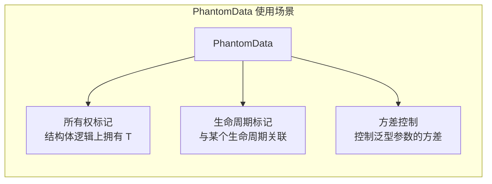

---

## core::any 模块

### 概述

`any` 模块提供运行时类型反射能力，允许在运行时检查和转换类型。

### TypeId

```rust
pub struct TypeId {
    // 内部实现细节
}

impl TypeId {
    pub fn of<T: 'static + ?Sized>() -> TypeId;
}
```

**特性**：
- 每个类型有唯一的 `TypeId`
- 仅适用于 `'static` 类型
- 支持 `PartialEq`、`Eq`、`Hash`

### Any Trait

```rust
pub trait Any: 'static {
    fn type_id(&self) -> TypeId;
}
```

**向下转型方法**：

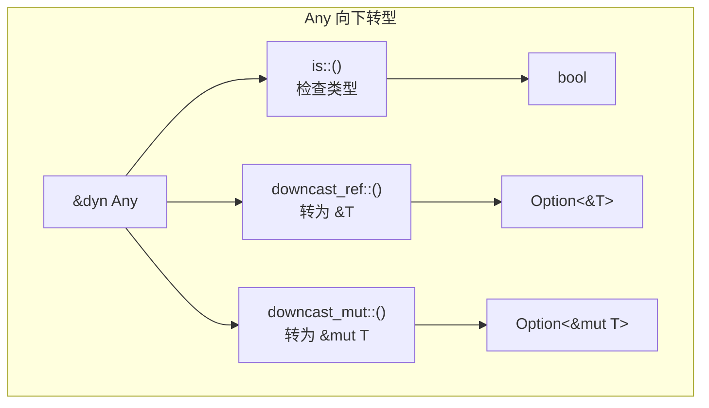

---

## core::convert 模块

### 概述

`convert` 模块提供类型之间的转换 trait。

### From 和 Into

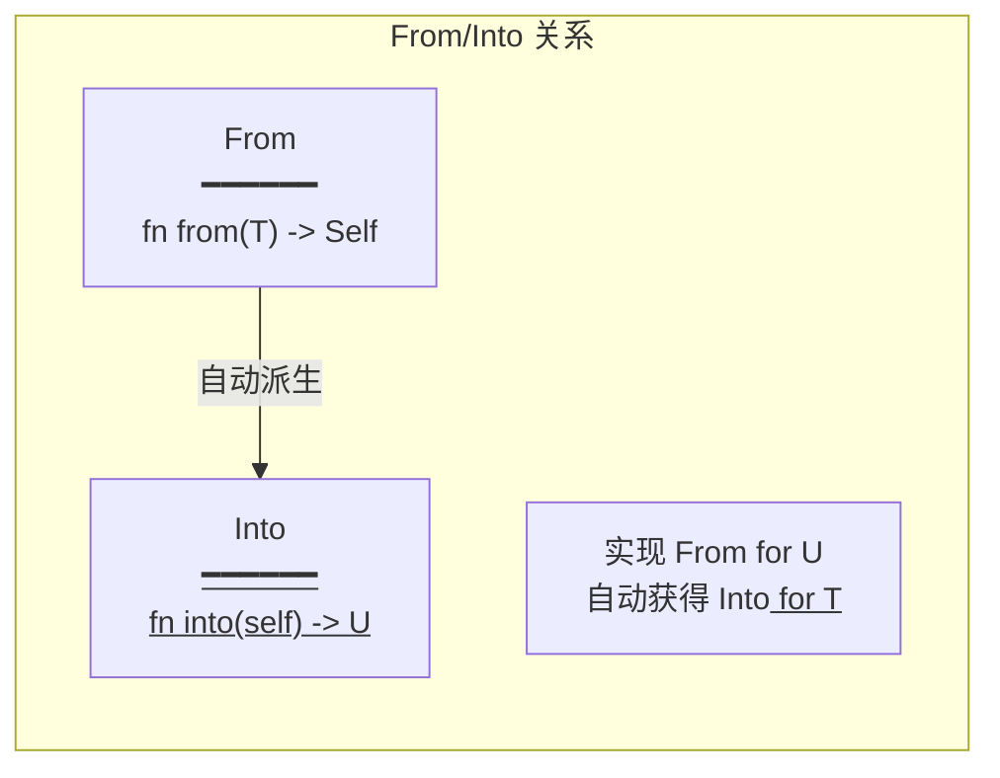

```rust
pub trait From<T>: Sized {
    fn from(value: T) -> Self;
}

pub trait Into<T>: Sized {
    fn into(self) -> T;
}
```

**最佳实践**：
- 优先实现 `From`
- 使用 `Into` 作为泛型约束

### TryFrom 和 TryInto

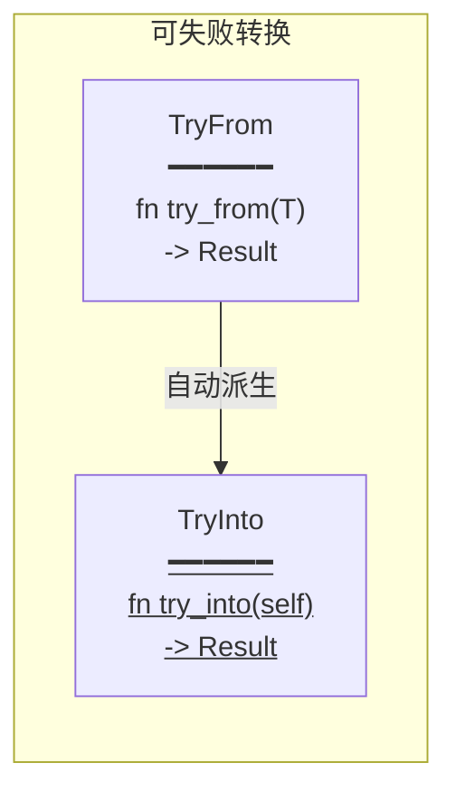

```rust
pub trait TryFrom<T>: Sized {
    type Error;
    fn try_from(value: T) -> Result<Self, Self::Error>;
}
```

### AsRef 和 AsMut

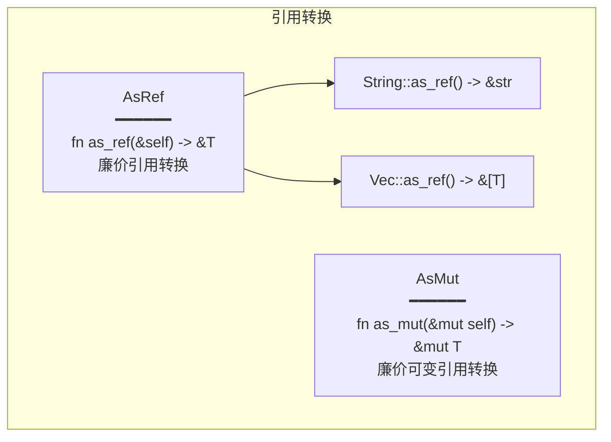

### 转换 Trait 选择指南

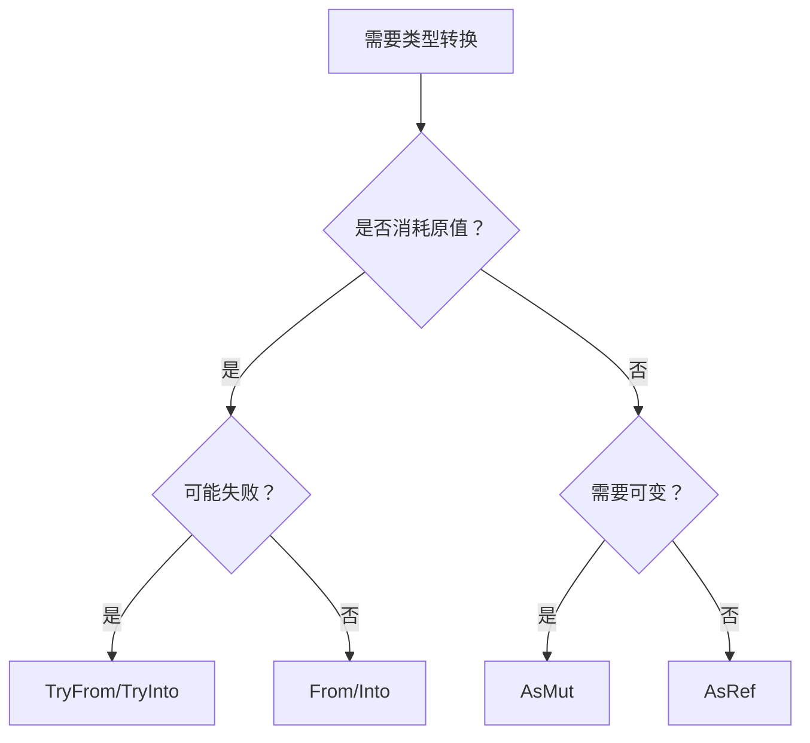

---

## core::clone 模块

### Clone Trait

```rust
pub trait Clone: Sized {
    fn clone(&self) -> Self;

    fn clone_from(&mut self, source: &Self) {
        *self = source.clone();
    }
}
```

**Clone vs Copy**：

| 特性 | Copy | Clone |
|------|------|-------|
| 实现方式 | 按位复制 | 可自定义 |
| 调用方式 | 隐式 | 显式 `.clone()` |
| 性能 | 恒定 O(1) | 可能 O(n) |
| 堆分配 | 不允许 | 可能涉及 |
| derive | `#[derive(Copy)]` | `#[derive(Clone)]` |

---

## core::cmp 模块

### 比较 Trait 层级

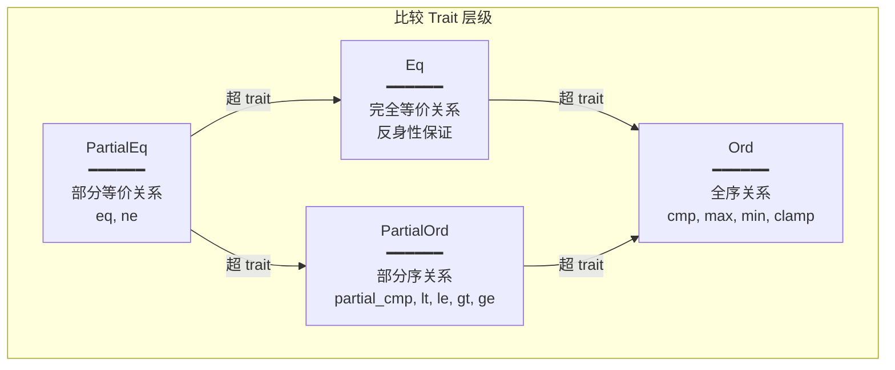

### PartialEq vs Eq

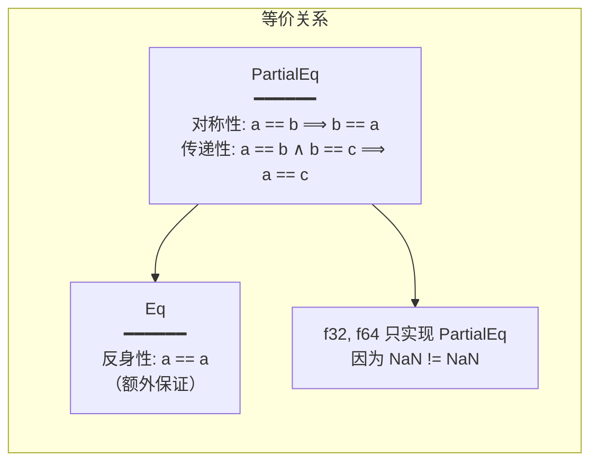

### PartialOrd vs Ord

```rust
pub trait PartialOrd<Rhs = Self>: PartialEq<Rhs> {
    fn partial_cmp(&self, other: &Rhs) -> Option<Ordering>;
}

pub trait Ord: Eq + PartialOrd<Self> {
    fn cmp(&self, other: &Self) -> Ordering;
}
```

**Ordering 枚举**：

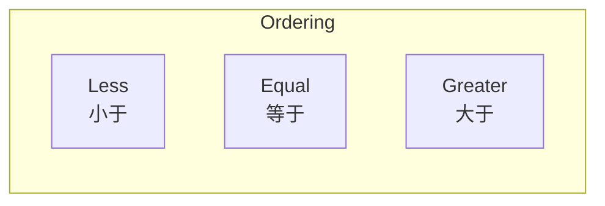

---

## core::default 模块

### Default Trait

```rust
pub trait Default: Sized {
    fn default() -> Self;
}
```

**常见默认值**：

| 类型 | 默认值 |
|------|--------|
| 数值类型 | `0` |
| `bool` | `false` |
| `char` | `'\0'` |
| `String` | `""` |
| `Vec<T>` | `vec![]` |
| `Option<T>` | `None` |

**使用场景**：

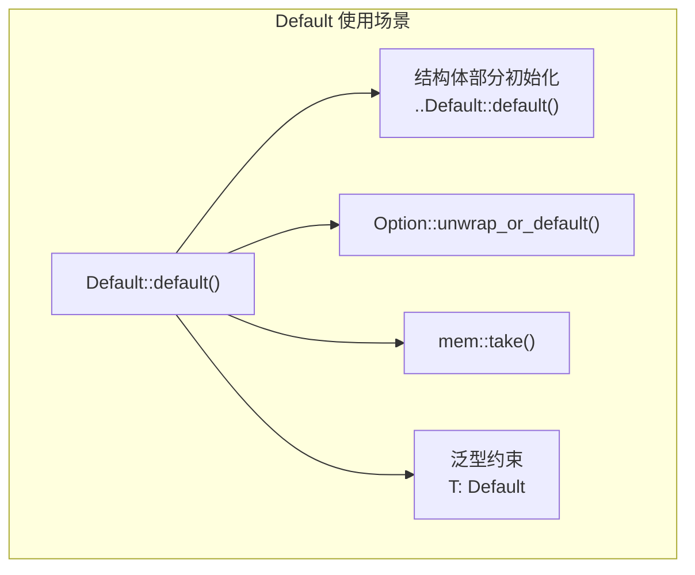

---

## Trait 实现关系总览

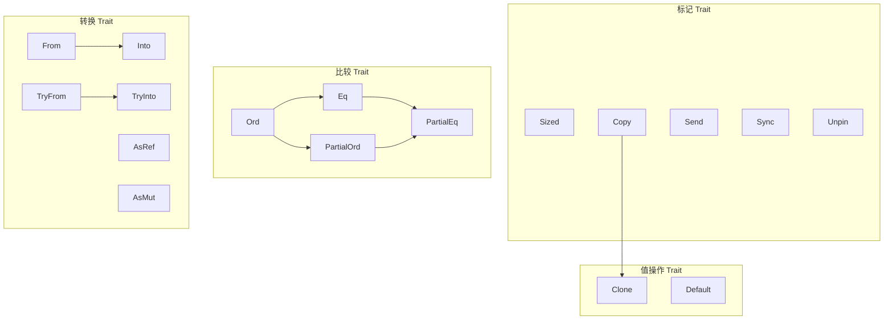

---

## 设计原则

### 1. 标记 Trait 的力量
- 编译时类型检查
- 零运行时开销
- 防止数据竞争（Send/Sync）

### 2. 转换的人体工程学
- 实现 `From` 自动获得 `Into`
- `?` 运算符配合 `TryFrom`
- 链式转换

### 3. 比较的灵活性
- 支持部分序（浮点数）
- 支持跨类型比较
- derive 宏简化实现

### 4. 默认值的便利性
- 结构体更新语法
- Option 的安全解包
- 泛型代码的灵活性
