# 迭代器模块

> `core::iter` 深度解析

## 概述

迭代器是 Rust 中最强大的抽象之一，提供了惰性求值、链式操作和零成本抽象的数据处理能力。

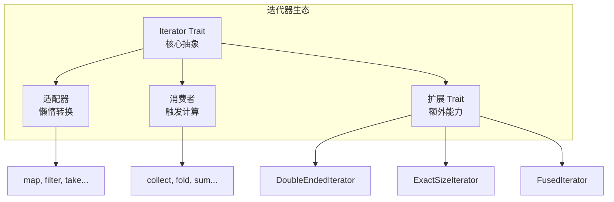

---

## Iterator Trait 核心

### 基本定义

```rust
pub trait Iterator {
    type Item;

    // 唯一必须实现的方法
    fn next(&mut self) -> Option<Self::Item>;

    // 提供 75+ 个默认方法...
}
```

### 方法分类总览

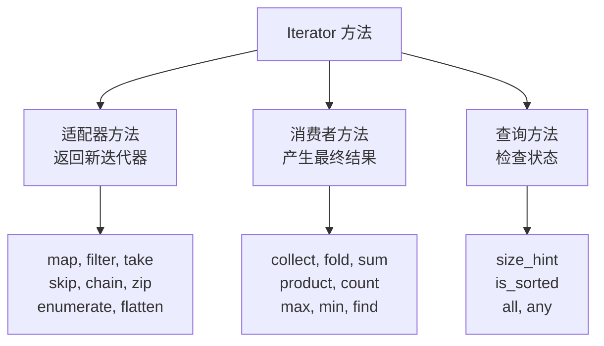

---

## 适配器（Adapters）

适配器是**惰性的** - 它们不立即执行，而是返回一个新的迭代器。

### 完整适配器列表

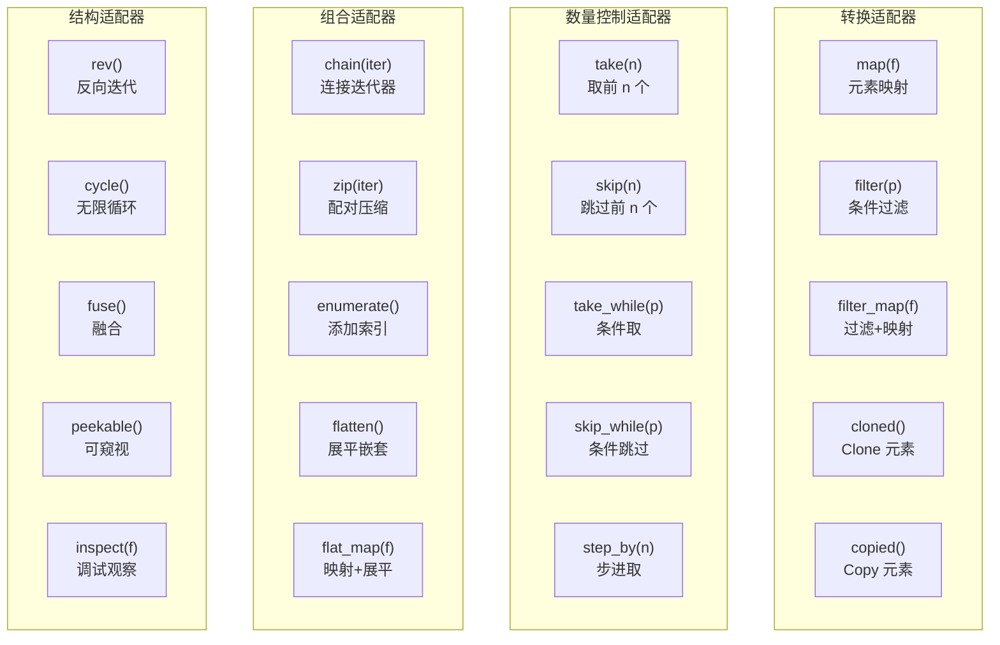

### 常用适配器详解

#### map - 元素映射

```rust
fn map<B, F>(self, f: F) -> Map<Self, F>
where F: FnMut(Self::Item) -> B;
```

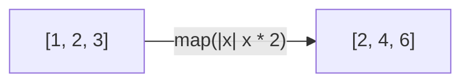

#### filter - 条件过滤

```rust
fn filter<P>(self, predicate: P) -> Filter<Self, P>
where P: FnMut(&Self::Item) -> bool;
```

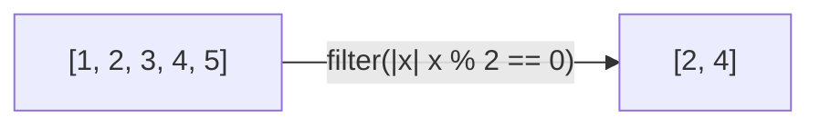

#### chain - 连接迭代器

```rust
fn chain<U>(self, other: U) -> Chain<Self, U::IntoIter>
where U: IntoIterator<Item = Self::Item>;
```

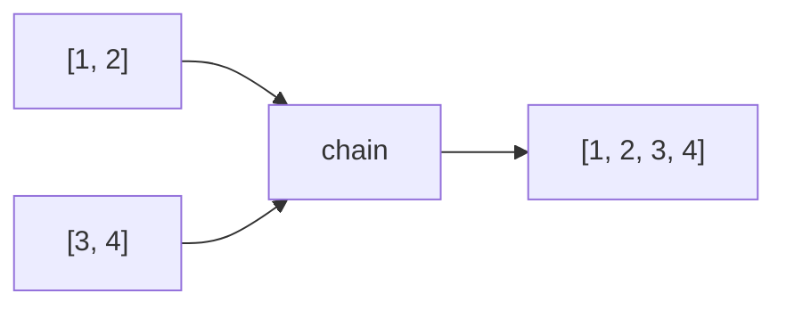

#### zip - 配对压缩

```rust
fn zip<U>(self, other: U) -> Zip<Self, U::IntoIter>
where U: IntoIterator;
```

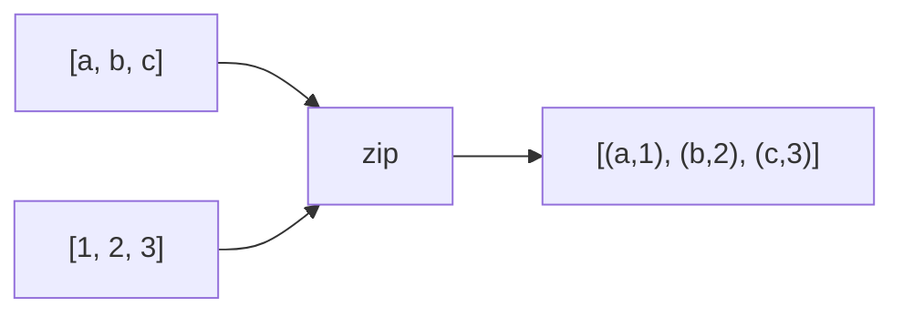

#### enumerate - 添加索引

```rust
fn enumerate(self) -> Enumerate<Self>;
```

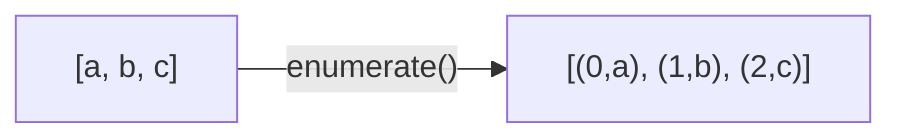

#### flatten - 展平嵌套

```rust
fn flatten(self) -> Flatten<Self>
where Self::Item: IntoIterator;
```

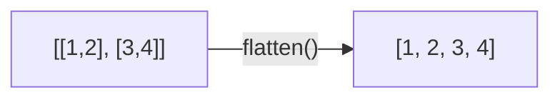

---

## 消费者（Consumers）

消费者是**贪婪的** - 它们立即消耗迭代器并产生结果。

### 消费者分类

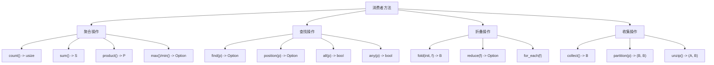

### 常用消费者详解

#### collect - 收集到集合

```rust
fn collect<B: FromIterator<Self::Item>>(self) -> B;
```

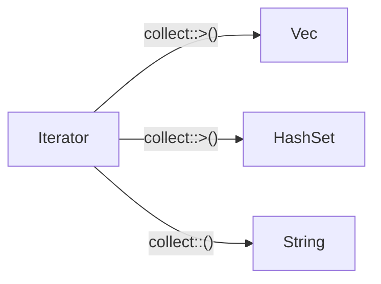

#### fold - 折叠操作

```rust
fn fold<B, F>(self, init: B, f: F) -> B
where F: FnMut(B, Self::Item) -> B;
```

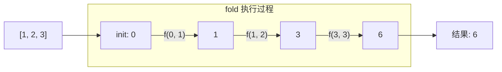

#### find - 查找元素

```rust
fn find<P>(&mut self, predicate: P) -> Option<Self::Item>
where P: FnMut(&Self::Item) -> bool;
```

#### partition - 分区

```rust
fn partition<B, F>(self, f: F) -> (B, B)
where B: Default + Extend<Self::Item>, F: FnMut(&Self::Item) -> bool;
```

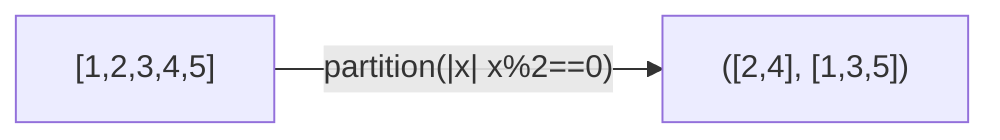

---

## 扩展 Trait

### Trait 层级结构

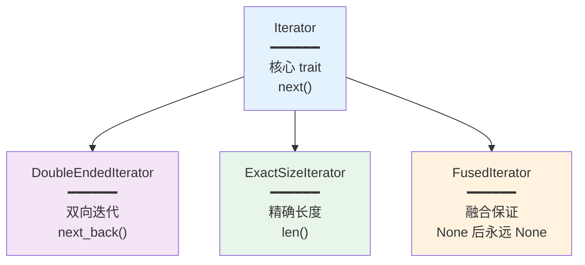

### DoubleEndedIterator

```rust
pub trait DoubleEndedIterator: Iterator {
    fn next_back(&mut self) -> Option<Self::Item>;

    // 提供的方法
    fn nth_back(&mut self, n: usize) -> Option<Self::Item>;
    fn rfold<B, F>(self, init: B, f: F) -> B;
    fn rfind<P>(&mut self, predicate: P) -> Option<Self::Item>;
}
```

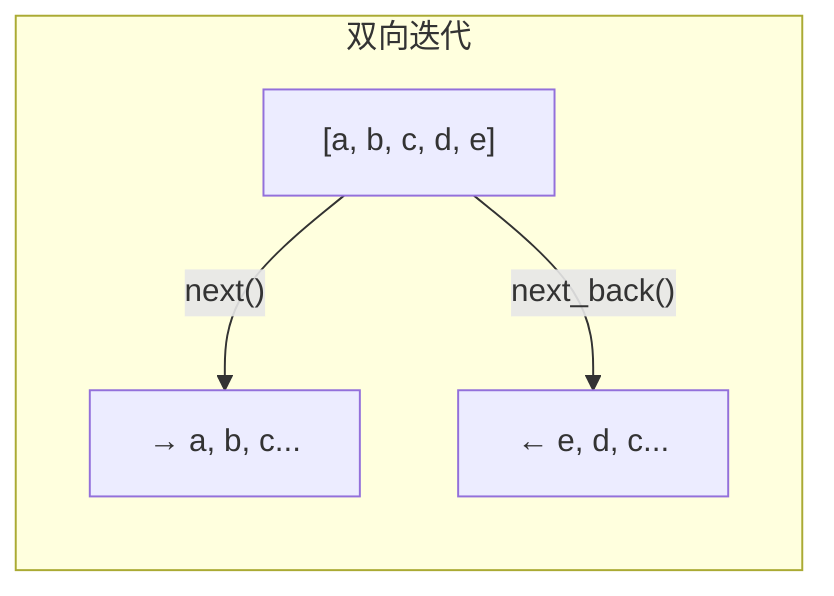

### ExactSizeIterator

```rust
pub trait ExactSizeIterator: Iterator {
    fn len(&self) -> usize;
    fn is_empty(&self) -> bool;
}
```

**实现者**：
- `Range<T>`
- `slice::Iter`
- `vec::IntoIter`
- `Option::IntoIter`

### FusedIterator

```rust
pub trait FusedIterator: Iterator { }
```

**保证**：一旦返回 `None`，后续调用 `next()` 永远返回 `None`。

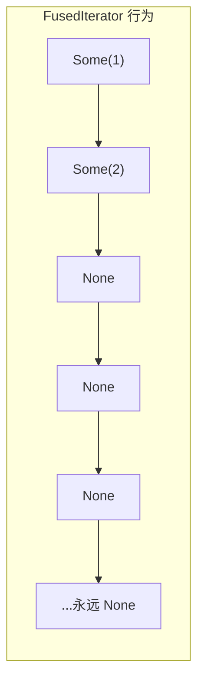

---

## 适配器链示例

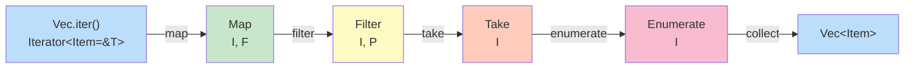

**代码示例**：

```rust
let result: Vec<(usize, i32)> = vec![1, 2, 3, 4, 5, 6, 7, 8, 9, 10]
    .into_iter()
    .map(|x| x * 2)           // 映射
    .filter(|x| x % 3 == 0)   // 过滤
    .take(3)                  // 取前3个
    .enumerate()              // 添加索引
    .collect();               // 收集

// result = [(0, 6), (1, 12), (2, 18)]
```

---

## IntoIterator Trait

```rust
pub trait IntoIterator {
    type Item;
    type IntoIter: Iterator<Item = Self::Item>;

    fn into_iter(self) -> Self::IntoIter;
}
```

### 三种迭代方式

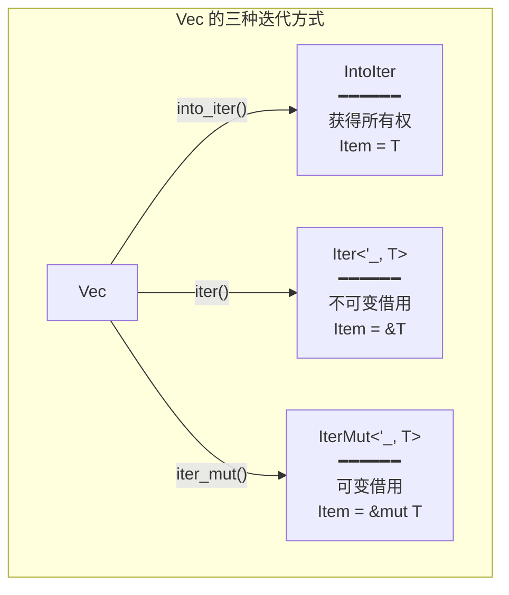

### for 循环糖语法

```rust
// 这个 for 循环...
for x in collection {
    // ...
}

// 被展开为...
let mut iter = IntoIterator::into_iter(collection);
loop {
    match iter.next() {
        Some(x) => { /* ... */ }
        None => break,
    }
}
```

---

## 创建迭代器

### 常用创建方法

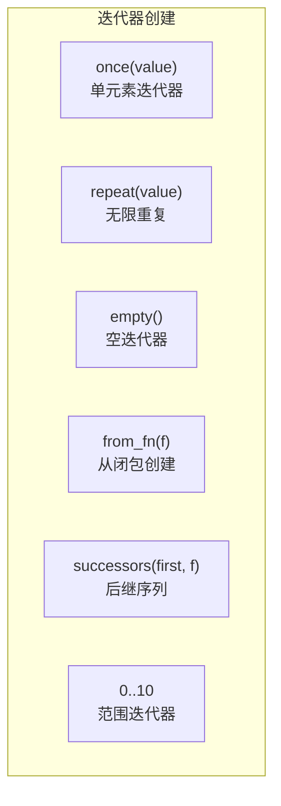

```rust
use std::iter;

// 单元素
iter::once(42);           // [42]

// 无限重复
iter::repeat(1);          // [1, 1, 1, ...]

// 从闭包创建
iter::from_fn(|| Some(1)); // [1, 1, 1, ...]

// 后继序列
iter::successors(Some(1), |n| Some(n * 2));  // [1, 2, 4, 8, ...]

// 范围
(0..10);                  // [0, 1, 2, ..., 9]
(0..=10);                 // [0, 1, 2, ..., 10]
```

---

## 性能特性

### 零成本抽象

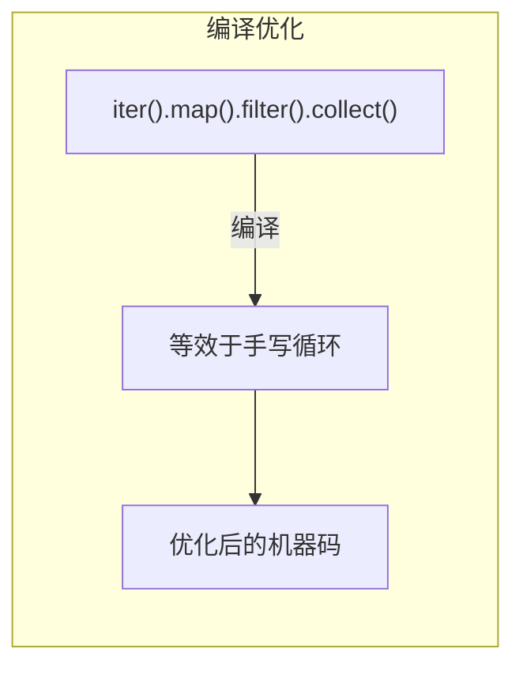

**关键优化**：
- **内联**：小闭包被内联到调用点
- **融合**：多个适配器合并为单次遍历
- **消除**：未使用的中间值被消除

### 惰性求值

```mermaid
graph TD
    subgraph "惰性 vs 贪婪"
        LAZY["适配器（惰性）<br/>━━━━━━<br/>不立即执行<br/>返回新迭代器<br/>可组合"]

        EAGER["消费者（贪婪）<br/>━━━━━━<br/>立即执行<br/>产生最终结果<br/>终止链"]
    end

    LAZY -->|"触发"| EAGER
```

---

## 最佳实践

### 1. 优先使用迭代器

```rust
// 推荐 ✓
let sum: i32 = numbers.iter().sum();

// 不推荐 ✗
let mut sum = 0;
for n in &numbers {
    sum += n;
}
```

### 2. 善用 collect 的类型推断

```rust
// 显式类型
let v: Vec<_> = iter.collect();

// turbofish 语法
let v = iter.collect::<Vec<_>>();

// 让上下文推断
fn process(v: Vec<i32>) { }
process(iter.collect());
```

### 3. 避免不必要的克隆

```rust
// 推荐 ✓
strings.iter().map(|s| s.len())

// 不推荐 ✗
strings.iter().cloned().map(|s| s.len())
```

### 4. 使用合适的适配器

```rust
// 推荐 ✓
iter.filter_map(|x| x.parse().ok())

// 不推荐 ✗
iter.map(|x| x.parse().ok()).filter(|x| x.is_some()).map(|x| x.unwrap())
```

---

## 方法速查表

| 方法 | 类型 | 功能 |
|------|------|------|
| `map(f)` | 适配器 | 映射每个元素 |
| `filter(p)` | 适配器 | 过滤元素 |
| `filter_map(f)` | 适配器 | 过滤+映射 |
| `take(n)` | 适配器 | 取前 n 个 |
| `skip(n)` | 适配器 | 跳过前 n 个 |
| `chain(iter)` | 适配器 | 连接迭代器 |
| `zip(iter)` | 适配器 | 配对压缩 |
| `enumerate()` | 适配器 | 添加索引 |
| `flatten()` | 适配器 | 展平嵌套 |
| `rev()` | 适配器 | 反向 |
| `collect()` | 消费者 | 收集到集合 |
| `fold(init, f)` | 消费者 | 折叠 |
| `sum()` | 消费者 | 求和 |
| `count()` | 消费者 | 计数 |
| `find(p)` | 消费者 | 查找 |
| `any(p)` | 消费者 | 存在判断 |
| `all(p)` | 消费者 | 全部判断 |
