# 并发与异步模块

> `core::sync`, `core::cell`, `core::future`, `core::task`, `core::pin` 深度解析

## 概述

Rust 的并发模型建立在所有权系统之上，通过类型系统在编译时防止数据竞争。

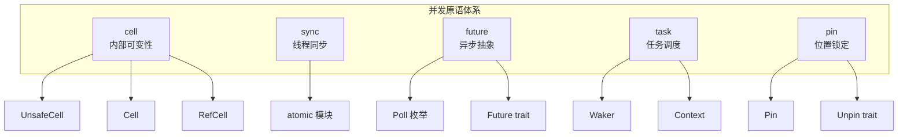

---

## core::cell 模块 - 内部可变性

### 概念

内部可变性允许在只有不可变引用时修改数据，是 Rust 中"共享 XOR 可变"规则的受控绕过。

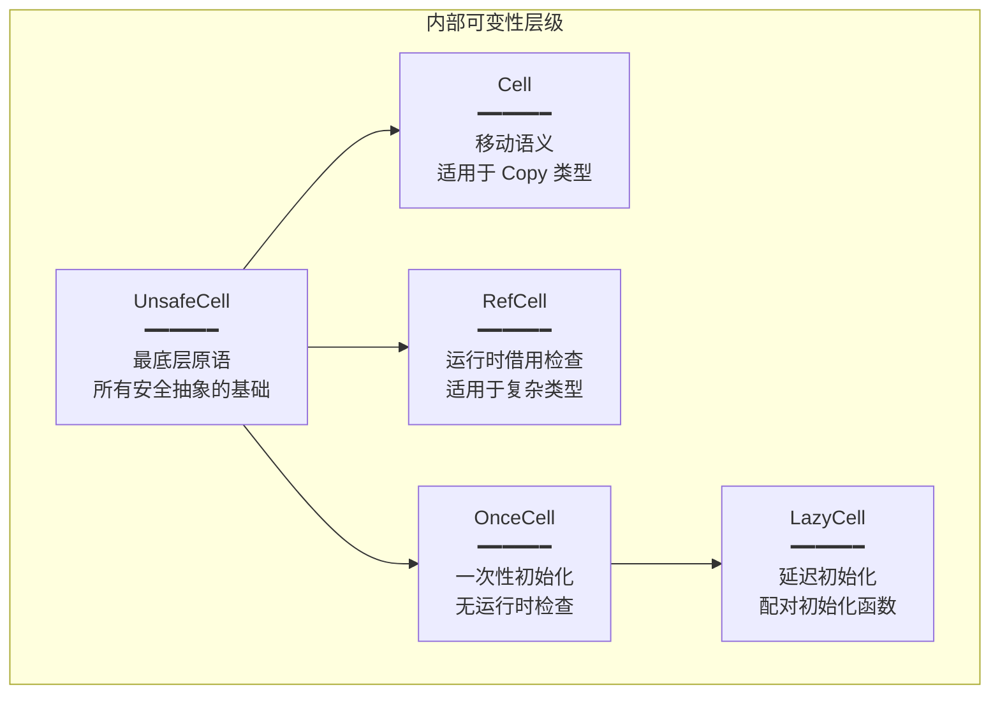

### Cell<T> - 移动语义的内部可变性

```rust
pub struct Cell<T: ?Sized> {
    value: UnsafeCell<T>,
}
```

**特性**：
- 通过**移动**而非借用修改值
- 永远无法获得 `&mut T`
- 对 `Copy` 类型提供 `get()` 方法
- 不是 `Sync`（仅用于单线程）
- 零运行时开销

**核心方法**：

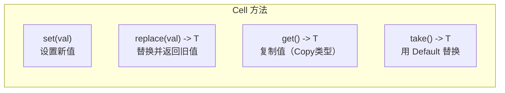

| 方法 | 功能 | 要求 |
|------|------|------|
| `set(val)` | 设置值，丢弃旧值 | - |
| `replace(val)` | 替换并返回旧值 | - |
| `get()` | 复制并返回值 | `T: Copy` |
| `take()` | 用 Default 替换 | `T: Default` |
| `into_inner()` | 消耗 Cell 返回值 | - |

### RefCell<T> - 动态借用检查

```rust
pub struct RefCell<T: ?Sized> {
    borrow: Cell<BorrowFlag>,
    value: UnsafeCell<T>,
}
```

**特性**：
- 将**编译时借用检查转移到运行时**
- 维护借用计数
- 违反借用规则时 panic
- 运行时开销：借用计数器

**核心方法**：

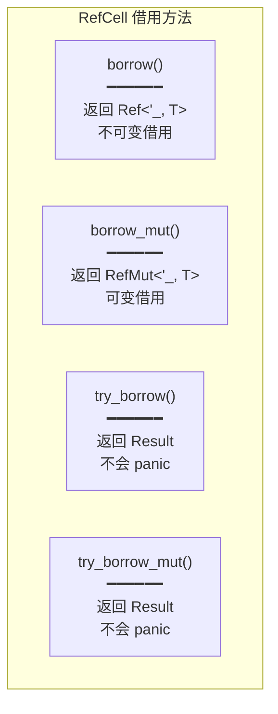

**借用规则（运行时检查）**：

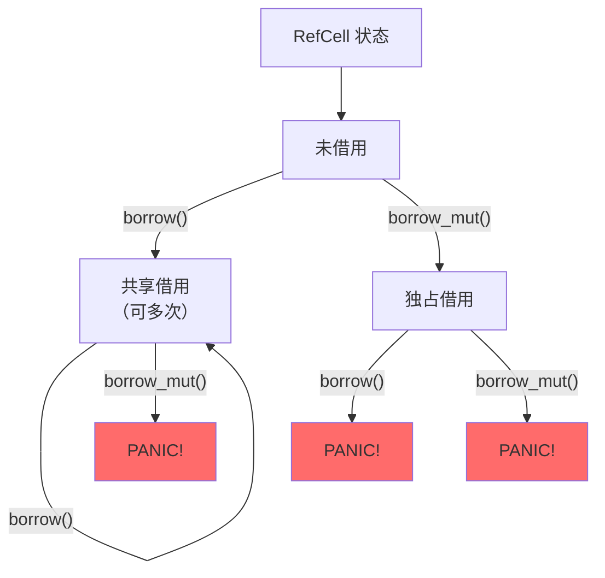

### Cell vs RefCell 对比

| 特性 | Cell<T> | RefCell<T> |
|------|---------|------------|
| 值访问 | 移动/复制 | 借用 |
| 运行时检查 | 无 | 有（借用计数） |
| 性能 | 极快 | 稍慢 |
| Copy 要求 | 需要（get） | 不需要 |
| panic 可能 | 无 | 借用冲突时 |
| 适用场景 | 简单类型 | 复杂类型 |

### OnceCell<T> 和 LazyCell<T>

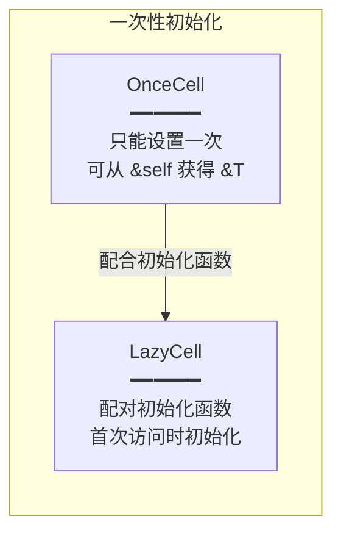

---

## core::sync::atomic 模块 - 原子操作

### 内存顺序

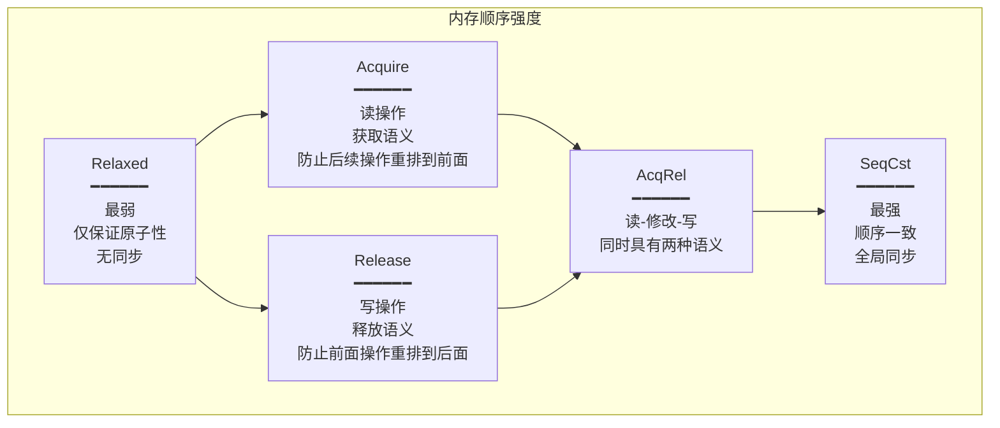

**选择指南**：

| 场景 | 推荐顺序 |
|------|----------|
| 简单计数器 | `Relaxed` |
| 锁的获取 | `Acquire` |
| 锁的释放 | `Release` |
| 自旋锁 | `AcqRel` |
| 需要完全同步 | `SeqCst` |

### Acquire-Release 配对

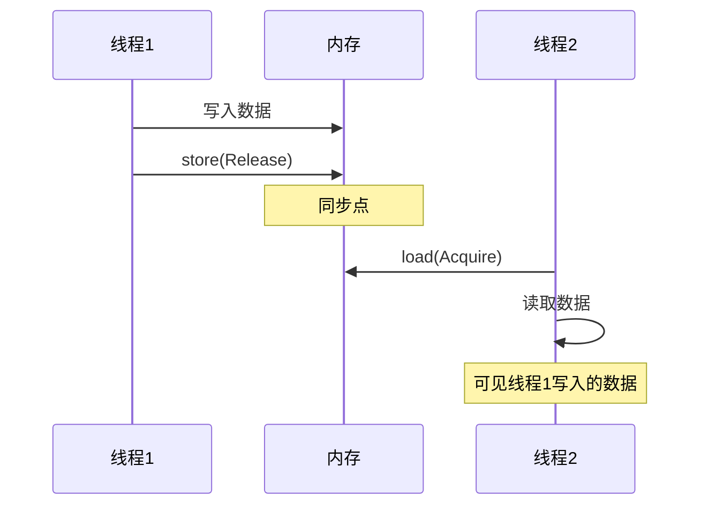

---

## core::future 模块 - 异步抽象

### Future Trait

```rust
pub trait Future {
    type Output;

    fn poll(self: Pin<&mut Self>, cx: &mut Context<'_>) -> Poll<Self::Output>;
}
```

### Poll 枚举

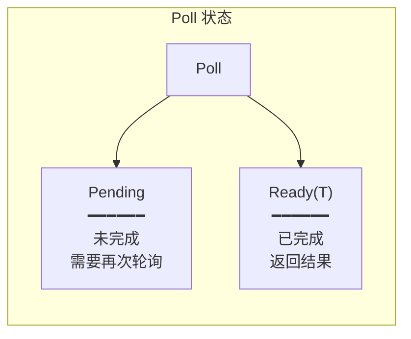

### 异步执行流程

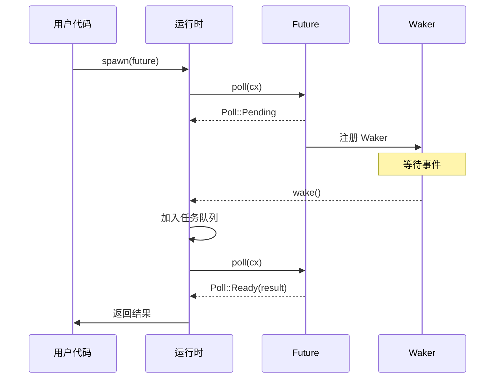

### Future 状态机 

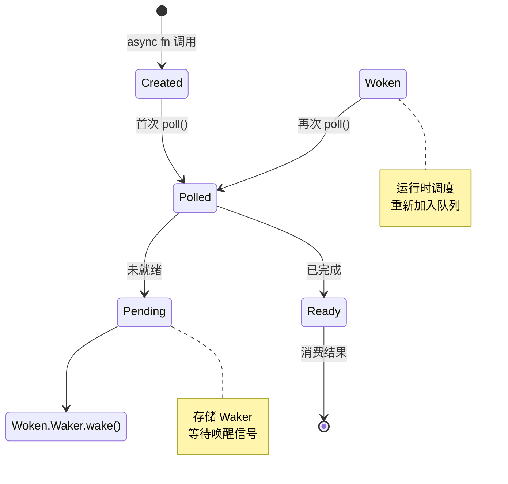

---

## core::task 模块 - 任务调度

### Waker 和 Context

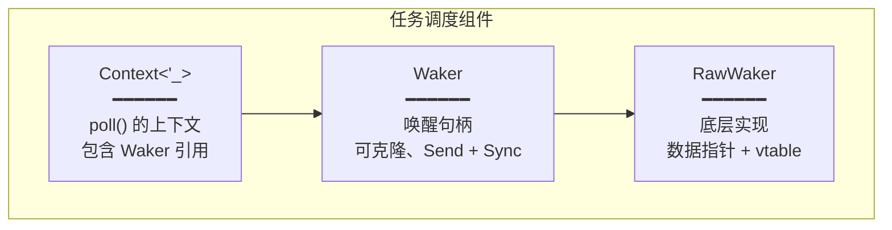

### Waker 机制

```rust
impl Waker {
    // 唤醒关联的任务
    pub fn wake(self);

    // 唤醒但不消耗 Waker
    pub fn wake_by_ref(&self);

    // 创建空操作 Waker
    pub fn noop() -> &'static Waker;
}
```

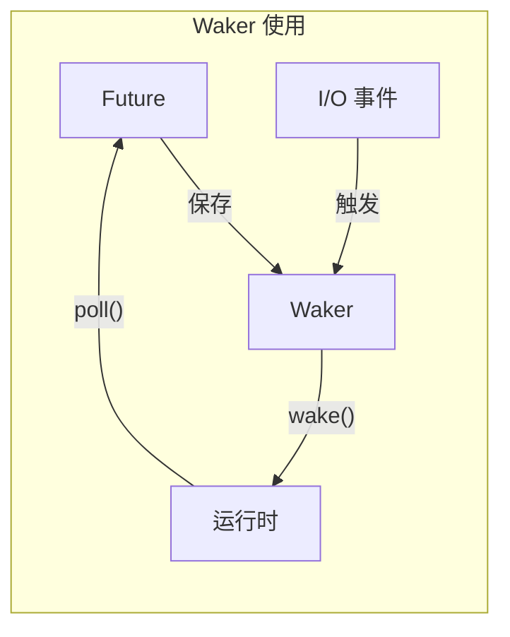

---

## core::pin 模块 - 位置锁定

### Pin 的作用


### Pin<P> 类型

```rust
pub struct Pin<Ptr> {
    pointer: Ptr,
}
```

**Pin 包装的是指针，不是值**：
- `Pin<&mut T>` - 固定的可变引用
- `Pin<Box<T>>` - 固定的堆分配值
- `Pin<Rc<T>>` - 固定的引用计数值

### Unpin Trait

```rust
pub auto trait Unpin { }
```

**语义**：
- 大多数类型自动实现 `Unpin`
- 实现 `Unpin` 的类型可以安全移动
- `Pin<&mut T>` 对 `T: Unpin` 等同于 `&mut T`

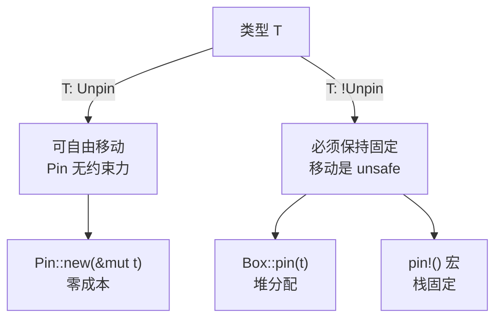

### Pinning 三种方式

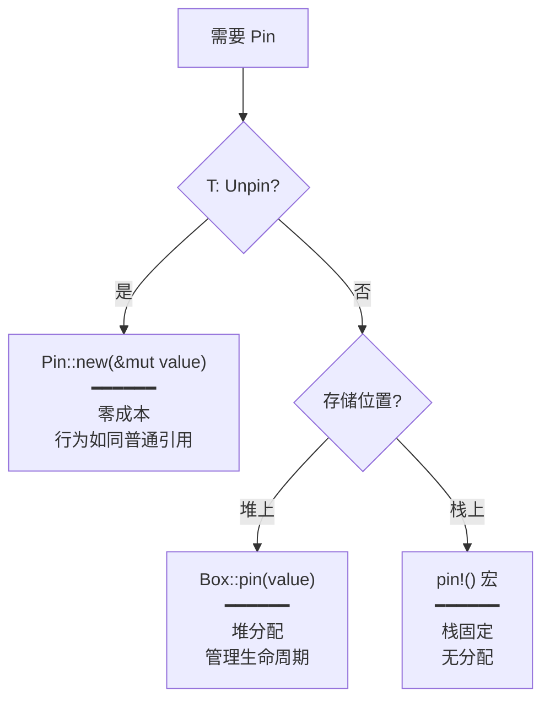

---

## 并发原语关系图

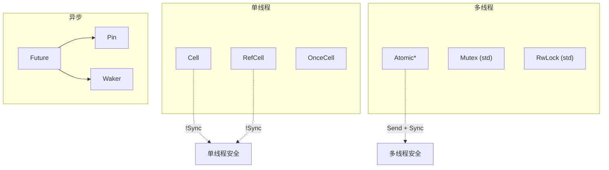

---

## 设计原则

### 1. 编译时优先

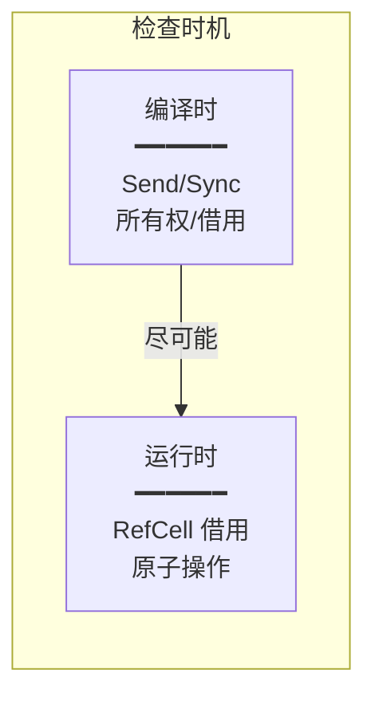

### 2. 显式控制

- 内存顺序必须显式指定
- Pin 要求显式声明意图
- 不隐藏潜在的性能陷阱

### 3. 零成本抽象

- Cell 无运行时开销
- Pin 与基础指针大小相同
- 原子操作直接映射到 CPU 指令

### 4. 安全边界清晰


---

## 选择指南

### 内部可变性选择

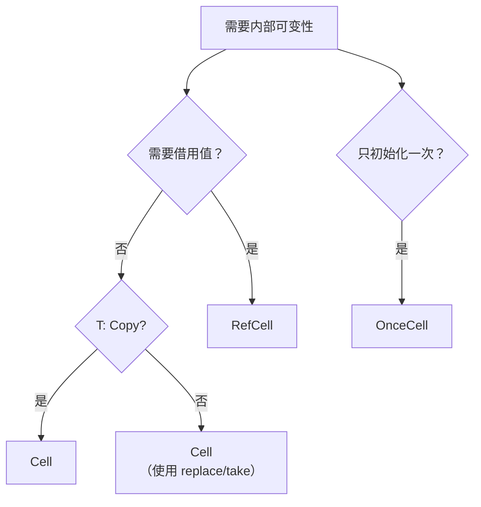

### 线程同步选择

```mermaid
graph TD
    START["需要线程同步"]

    START --> Q1{"只是计数器？"}
    Q1 -->|是| ATOMIC["Atomic*<br/>（Relaxed 足够）"]

    Q1 -->|否| Q2{"需要复杂操作？"}
    Q2 -->|是| MUTEX["Mutex (std)"]
    Q2 -->|否| ATOMIC2["Atomic*<br/>（合适的内存顺序）"]
```
