# 基础类型模块

> `core::option`, `core::result`, `core::num` 深度解析

## 概述

Option、Result 和数值类型是 Rust 最基础的类型，它们体现了 Rust 的核心理念：用类型系统消除常见错误。

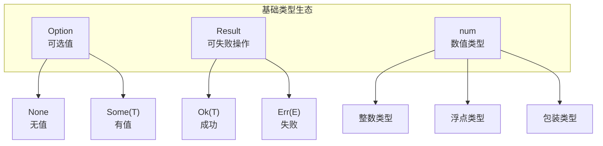

---

## core::option 模块

### Option 定义

```rust
pub enum Option<T> {
    None,
    Some(T),
}
```

**设计理念**：用类型系统替代空指针，强制处理"无值"情况。

### 方法分类

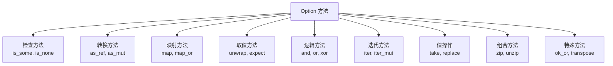

### 检查方法

| 方法 | 签名 | 功能 |
|------|------|------|
| `is_some()` | `&self -> bool` | 检查是否为 Some |
| `is_none()` | `&self -> bool` | 检查是否为 None |
| `is_some_and(f)` | `self, F -> bool` | Some 且满足条件 |
| `is_none_or(f)` | `self, F -> bool` | None 或满足条件 |

### 转换方法

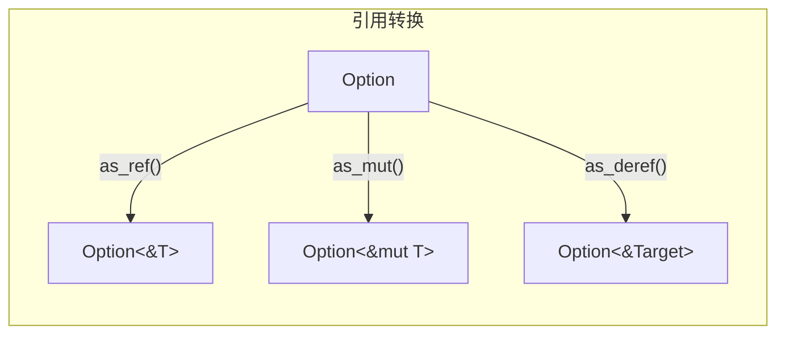

### 映射方法

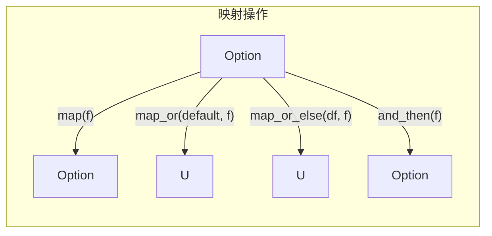

| 方法 | 功能 | None 时 |
|------|------|---------|
| `map(f)` | 映射 Some 值 | 保持 None |
| `map_or(default, f)` | 映射或返回默认 | 返回 default |
| `map_or_else(df, f)` | 映射或计算默认 | 调用 df() |
| `and_then(f)` | 链式操作（flatmap） | 保持 None |

### 取值方法

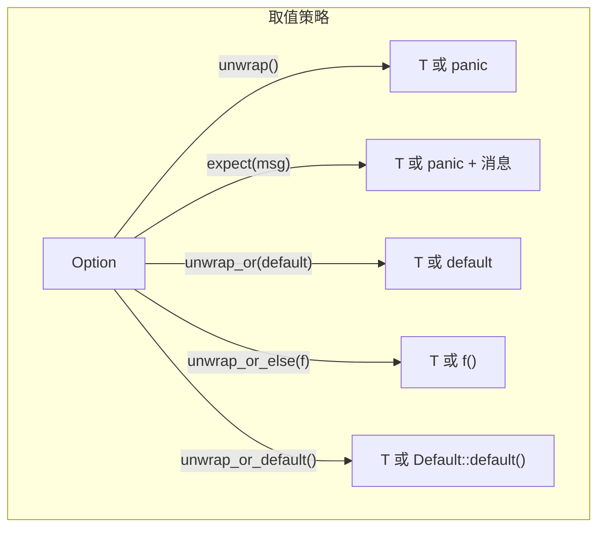

**选择指南**：

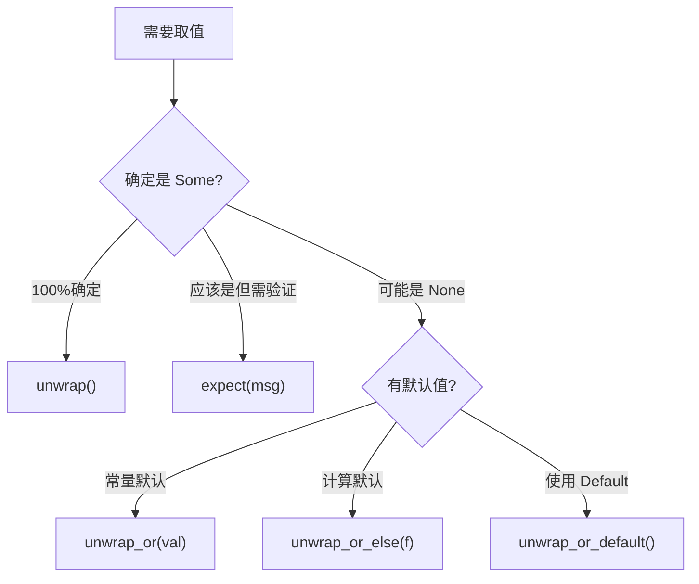

### 逻辑方法

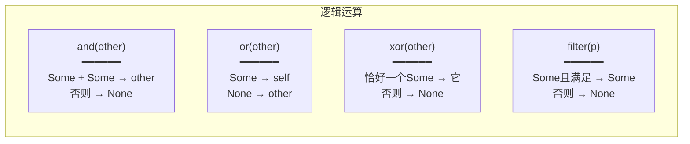

### 值操作方法

| 方法 | 功能 |
|------|------|
| `take()` | 取出值，留下 None |
| `replace(val)` | 替换值，返回旧值 |
| `insert(val)` | 插入值，返回可变引用 |
| `get_or_insert(val)` | 获取或插入，返回引用 |
| `get_or_insert_with(f)` | 获取或计算插入 |

### 特殊转换

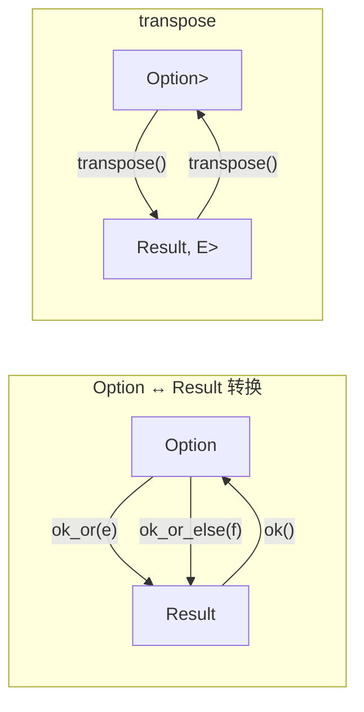

---

## core::result 模块

### Result 定义

```rust
pub enum Result<T, E> {
    Ok(T),
    Err(E),
}
```

**设计理念**：用类型系统强制错误处理，消除未检查的异常。

### 方法分类

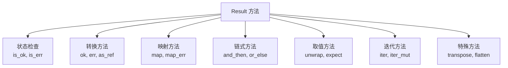

### 状态检查

| 方法 | 签名 | 功能 |
|------|------|------|
| `is_ok()` | `&self -> bool` | 检查是否为 Ok |
| `is_err()` | `&self -> bool` | 检查是否为 Err |
| `is_ok_and(f)` | `self, F -> bool` | Ok 且满足条件 |
| `is_err_and(f)` | `self, F -> bool` | Err 且满足条件 |

### 映射方法

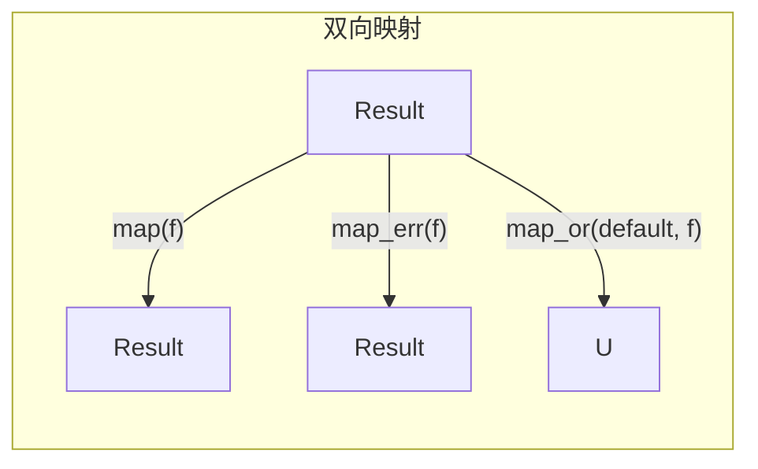

### 链式方法

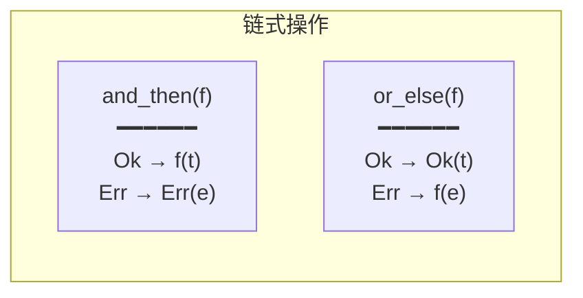

### ? 运算符

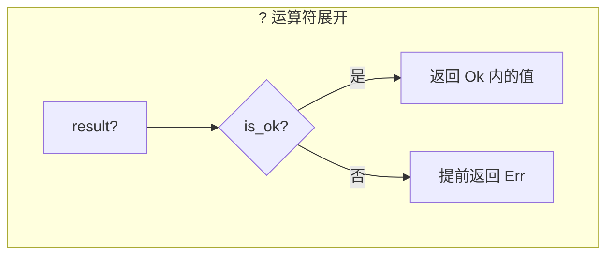

**等价展开**：

```rust
// 这个表达式...
let value = result?;

// 等价于...
let value = match result {
    Ok(v) => v,
    Err(e) => return Err(e.into()),
};
```

### 错误处理模式

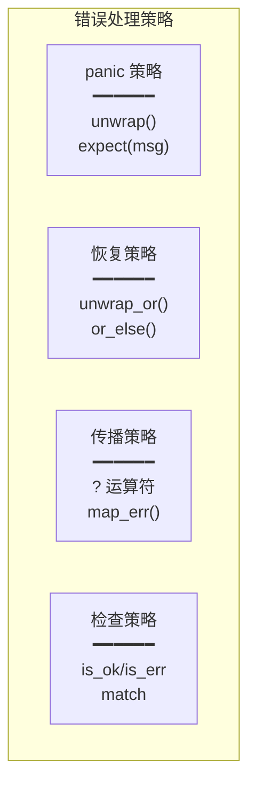

---

## Option 和 Result 转换关系

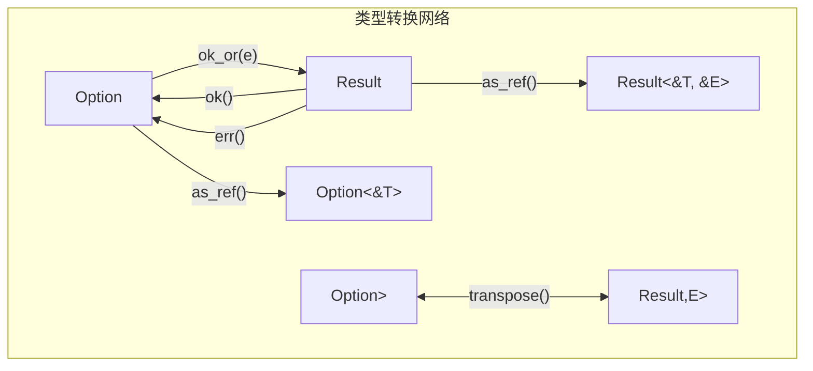

---

## core::num 模块

### 数值类型概览

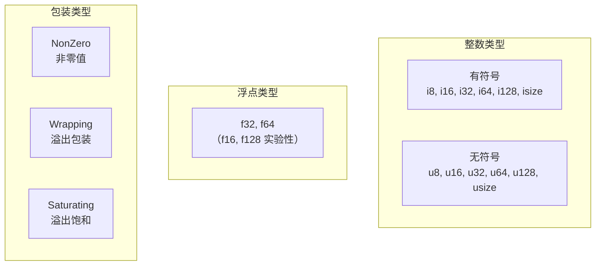

### NonZero 类型

```rust
// NonZero 保证值永不为零
pub struct NonZero<T>(/* 私有 */);

// 类型别名
type NonZeroU8 = NonZero<u8>;
type NonZeroI32 = NonZero<i32>;
// ...
```

**空指针优化**：

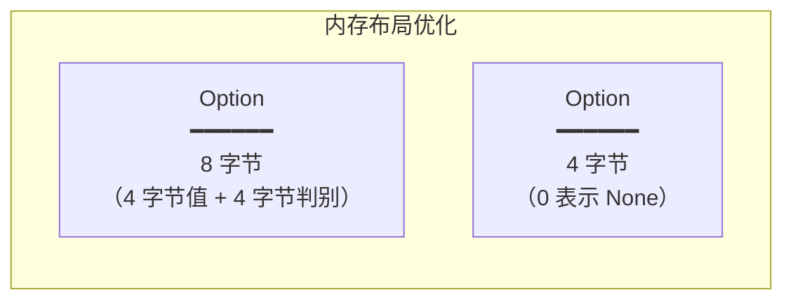

### Wrapping 和 Saturating

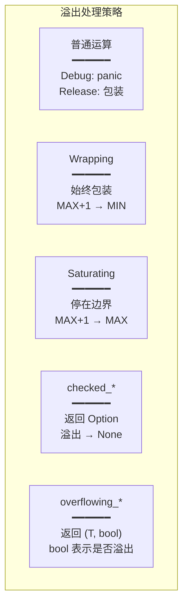

**示例**：

```rust
let max = u8::MAX;  // 255

// 不同策略的行为
Wrapping(max) + Wrapping(1);     // Wrapping(0)
Saturating(max) + Saturating(1); // Saturating(255)
max.checked_add(1);              // None
max.overflowing_add(1);          // (0, true)
```

### 数值 Trait

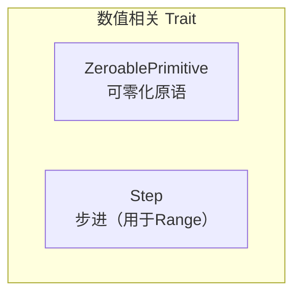

### 解析错误类型

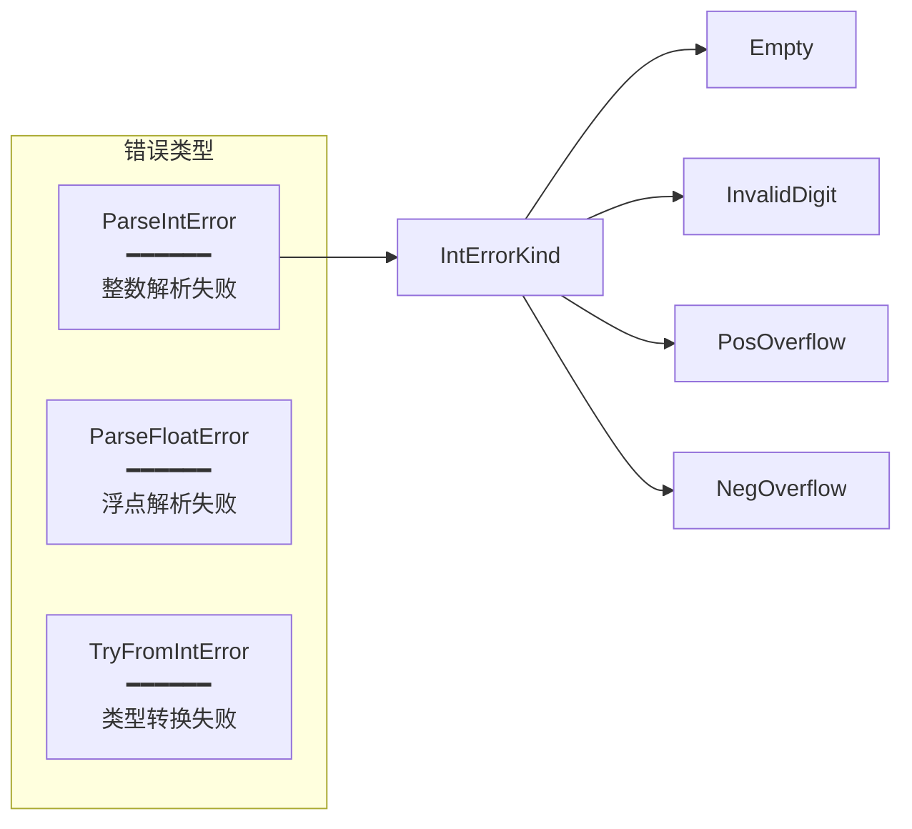

### 浮点数分类

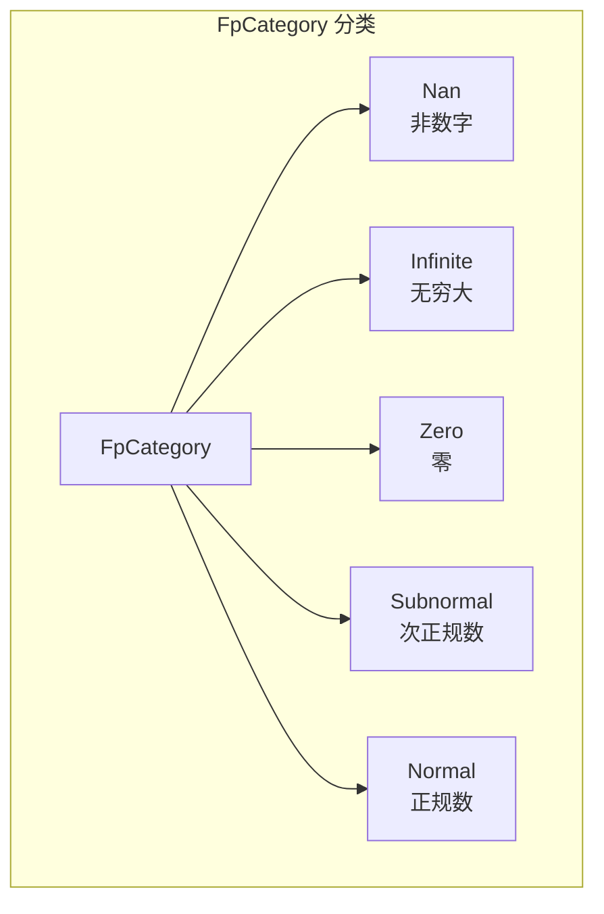

---

## 方法链示例

### Option 链

```mermaid
graph LR
    A["Option<String>"]
    A -->|"as_ref()"| B["Option<&String>"]
    B -->|"map(|s| s.len())"| C["Option<usize>"]
    C -->|"filter(|&n| n > 5)"| D["Option<usize>"]
    D -->|"unwrap_or(0)"| E["usize"]
```

### Result 链

```mermaid
graph LR
    A["Result<String, IoError>"]
    A -->|"map(|s| s.trim())"| B["Result<&str, IoError>"]
    B -->|"and_then(|s| s.parse())"| C["Result<i32, ParseError>"]
    C -->|"map_err(|e| MyError::from(e))"| D["Result<i32, MyError>"]
```

---

## 最佳实践

### 1. 避免不必要的 unwrap

```rust
// 不推荐 ✗
let value = option.unwrap();

// 推荐 ✓
let value = option.unwrap_or_default();
// 或
if let Some(value) = option {
    // ...
}
```

### 2. 善用 ? 运算符

```rust
// 不推荐 ✗
fn process() -> Result<i32, Error> {
    let a = step1()?;
    let b = match step2(a) {
        Ok(v) => v,
        Err(e) => return Err(e),
    };
    Ok(b)
}

// 推荐 ✓
fn process() -> Result<i32, Error> {
    let a = step1()?;
    let b = step2(a)?;
    Ok(b)
}
```

### 3. 使用 map 而非 match

```rust
// 不推荐 ✗
let result = match option {
    Some(x) => Some(x * 2),
    None => None,
};

// 推荐 ✓
let result = option.map(|x| x * 2);
```

### 4. 使用 filter_map 简化

```rust
// 不推荐 ✗
iter.map(|x| x.parse().ok())
    .filter(|x| x.is_some())
    .map(|x| x.unwrap())

// 推荐 ✓
iter.filter_map(|x| x.parse().ok())
```

---

## 速查表

### Option 方法

| 方法 | 返回类型 | 功能 |
|------|----------|------|
| `is_some()` | `bool` | 是否有值 |
| `is_none()` | `bool` | 是否无值 |
| `map(f)` | `Option<U>` | 映射值 |
| `and_then(f)` | `Option<U>` | 链式操作 |
| `unwrap()` | `T` | 取值或 panic |
| `unwrap_or(v)` | `T` | 取值或默认 |
| `ok_or(e)` | `Result<T,E>` | 转为 Result |
| `take()` | `Option<T>` | 取出值 |
| `filter(p)` | `Option<T>` | 条件过滤 |

### Result 方法

| 方法 | 返回类型 | 功能 |
|------|----------|------|
| `is_ok()` | `bool` | 是否成功 |
| `is_err()` | `bool` | 是否失败 |
| `map(f)` | `Result<U,E>` | 映射 Ok 值 |
| `map_err(f)` | `Result<T,F>` | 映射 Err 值 |
| `and_then(f)` | `Result<U,E>` | 链式操作 |
| `or_else(f)` | `Result<T,F>` | 错误恢复 |
| `unwrap()` | `T` | 取值或 panic |
| `ok()` | `Option<T>` | 转为 Option |
