# 运算符与格式化模块

> `core::ops`, `core::fmt` 深度解析

## 概述

运算符重载和格式化是 Rust 中最常用的 trait 系统应用，它们让自定义类型能够无缝融入语言。

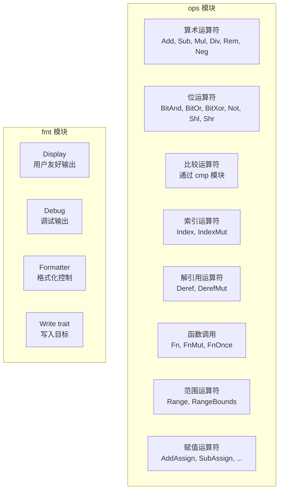

---

## core::ops 模块

### 算术运算符 Trait

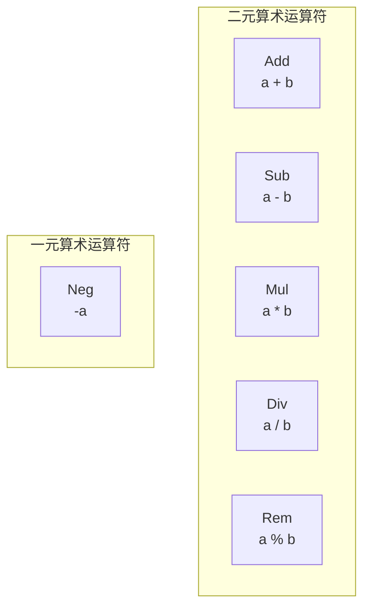

#### Add Trait

```rust
pub trait Add<Rhs = Self> {
    type Output;
    fn add(self, rhs: Rhs) -> Self::Output;
}
```

**使用示例**：

```rust
impl Add for Point {
    type Output = Point;

    fn add(self, other: Point) -> Point {
        Point {
            x: self.x + other.x,
            y: self.y + other.y,
        }
    }
}
```

#### 所有算术 Trait

| Trait | 运算符 | 方法 |
|-------|--------|------|
| `Add<Rhs>` | `+` | `add(self, rhs)` |
| `Sub<Rhs>` | `-` | `sub(self, rhs)` |
| `Mul<Rhs>` | `*` | `mul(self, rhs)` |
| `Div<Rhs>` | `/` | `div(self, rhs)` |
| `Rem<Rhs>` | `%` | `rem(self, rhs)` |
| `Neg` | `-` (一元) | `neg(self)` |

### 位运算符 Trait

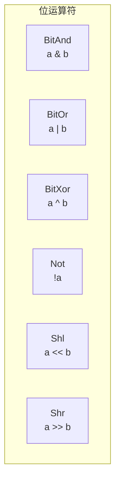

| Trait | 运算符 | 方法 |
|-------|--------|------|
| `BitAnd<Rhs>` | `&` | `bitand(self, rhs)` |
| `BitOr<Rhs>` | `\|` | `bitor(self, rhs)` |
| `BitXor<Rhs>` | `^` | `bitxor(self, rhs)` |
| `Not` | `!` | `not(self)` |
| `Shl<Rhs>` | `<<` | `shl(self, rhs)` |
| `Shr<Rhs>` | `>>` | `shr(self, rhs)` |

### 复合赋值运算符

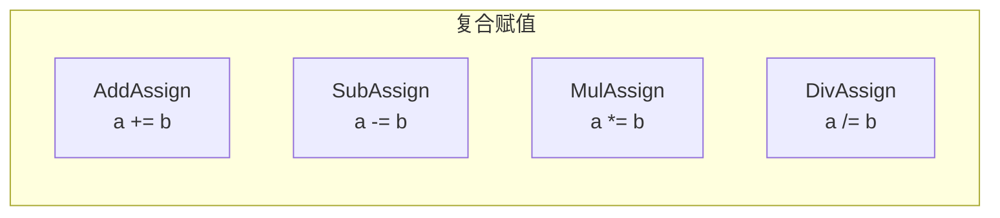

```rust
pub trait AddAssign<Rhs = Self> {
    fn add_assign(&mut self, rhs: Rhs);
}
```

**注意**：复合赋值运算符接收 `&mut self`，不返回值。

### 索引运算符

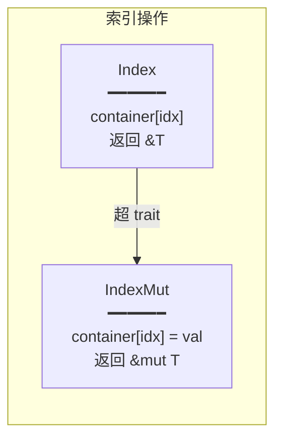

```rust
pub trait Index<Idx: ?Sized> {
    type Output: ?Sized;
    fn index(&self, index: Idx) -> &Self::Output;
}

pub trait IndexMut<Idx: ?Sized>: Index<Idx> {
    fn index_mut(&mut self, index: Idx) -> &mut Self::Output;
}
```

**语法糖**：
- `container[index]` 等价于 `*container.index(index)`
- `container[index] = value` 使用 `IndexMut`

### 解引用运算符

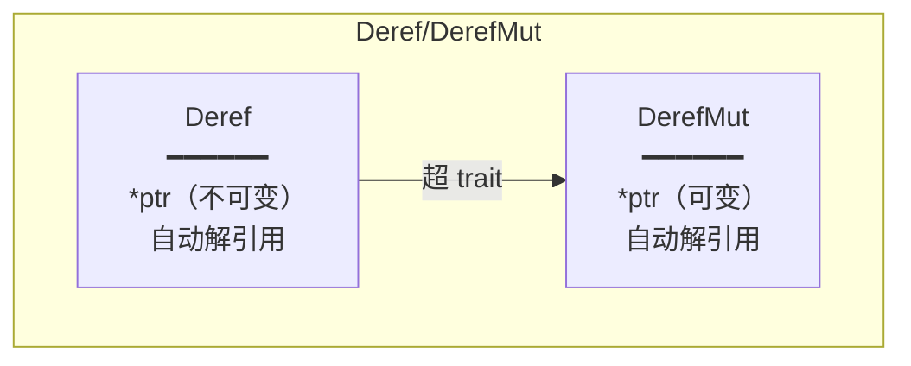

```rust
pub trait Deref {
    type Target: ?Sized;
    fn deref(&self) -> &Self::Target;
}

pub trait DerefMut: Deref {
    fn deref_mut(&mut self) -> &mut Self::Target;
}
```

#### Deref 强制转换

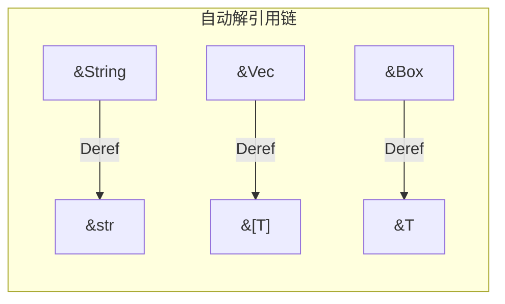

**规则**：
- `&T` 自动强制转换为 `&U`，当 `T: Deref<Target=U>`
- `&mut T` 自动强制转换为 `&mut U`，当 `T: DerefMut<Target=U>`
- `&mut T` 自动强制转换为 `&U`，当 `T: Deref<Target=U>`

### 闭包 Trait

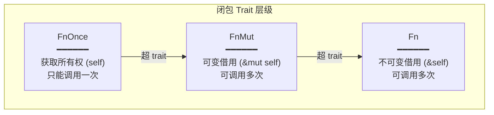

```rust
pub trait FnOnce<Args: Tuple> {
    type Output;
    fn call_once(self, args: Args) -> Self::Output;
}

pub trait FnMut<Args: Tuple>: FnOnce<Args> {
    fn call_mut(&mut self, args: Args) -> Self::Output;
}

pub trait Fn<Args: Tuple>: FnMut<Args> {
    fn call(&self, args: Args) -> Self::Output;
}
```

#### 闭包捕获规则

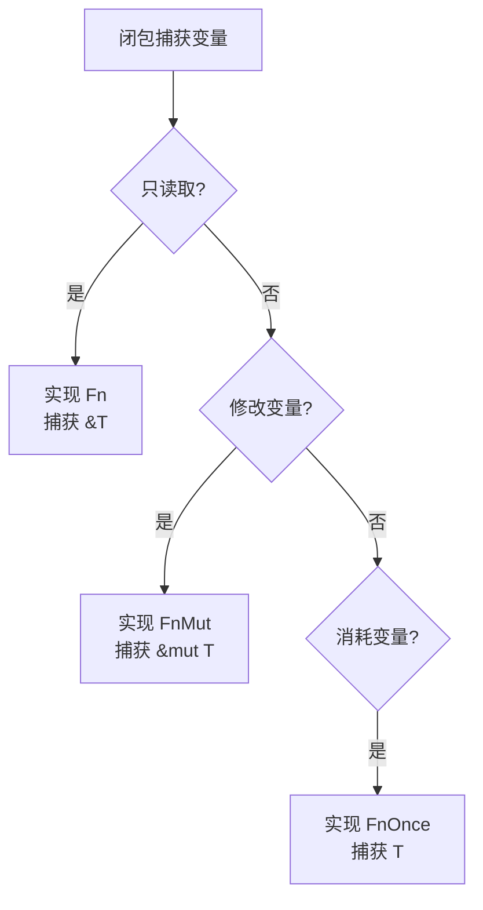

#### move 闭包

```rust
let s = String::from("hello");

// 普通闭包：借用 s
let f1 = || println!("{}", s);

// move 闭包：获取 s 的所有权
let f2 = move || println!("{}", s);
// s 不再可用
```

### 范围运算符

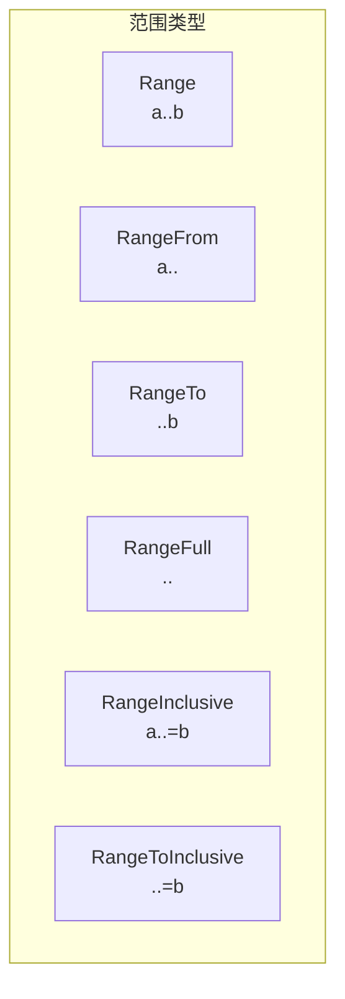

| 语法 | 类型 | 范围 |
|------|------|------|
| `a..b` | `Range` | [a, b) |
| `a..` | `RangeFrom` | [a, ∞) |
| `..b` | `RangeTo` | [0, b) |
| `..` | `RangeFull` | 全部 |
| `a..=b` | `RangeInclusive` | [a, b] |
| `..=b` | `RangeToInclusive` | [0, b] |

---

## core::fmt 模块

### 格式化 Trait 概览

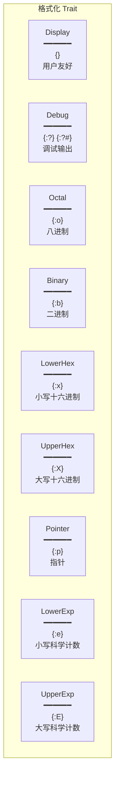

### Display Trait

```rust
pub trait Display {
    fn fmt(&self, f: &mut Formatter<'_>) -> Result;
}
```

**特性**：
- 格式字符串：`{}`
- 用于用户可读输出
- 不能 derive，必须手动实现
- 实现 `Display` 自动获得 `ToString`

**实现示例**：

```rust
impl Display for Point {
    fn fmt(&self, f: &mut Formatter<'_>) -> fmt::Result {
        write!(f, "({}, {})", self.x, self.y)
    }
}
```

### Debug Trait

```rust
pub trait Debug {
    fn fmt(&self, f: &mut Formatter<'_>) -> Result;
}
```

**特性**：
- 格式字符串：`{:?}` 或 `{:#?}`（美化）
- 可以使用 `#[derive(Debug)]`
- 用于调试和开发

**手动实现示例**：

```rust
impl Debug for Point {
    fn fmt(&self, f: &mut Formatter<'_>) -> fmt::Result {
        f.debug_struct("Point")
            .field("x", &self.x)
            .field("y", &self.y)
            .finish()
    }
}
```

### Formatter 辅助方法

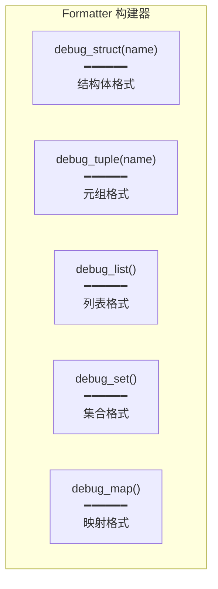

**输出示例**：

```rust
// debug_struct
Point { x: 1, y: 2 }

// debug_tuple
Point(1, 2)

// debug_list
[1, 2, 3]

// debug_set
{1, 2, 3}

// debug_map
{"a": 1, "b": 2}
```

### 格式化参数

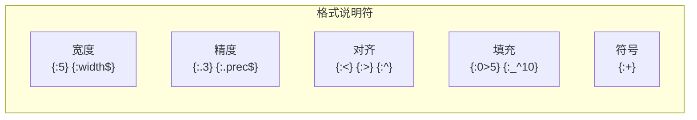

**格式字符串语法**：

```
{[参数]:[填充][对齐][符号][#][0][宽度][.精度][类型]}
```

| 组件 | 说明 | 示例 |
|------|------|------|
| 参数 | 位置或名称 | `{0}`, `{name}` |
| 填充 | 填充字符 | `{:0>5}` → `00042` |
| 对齐 | `<` `>` `^` | `{:<5}` → `42   ` |
| 符号 | `+` | `{:+}` → `+42` |
| `#` | 替代形式 | `{:#x}` → `0x2a` |
| `0` | 零填充 | `{:05}` → `00042` |
| 宽度 | 最小宽度 | `{:5}` |
| 精度 | 小数位数 | `{:.2}` |
| 类型 | 格式类型 | `x`, `b`, `o`, `e` |

### Write Trait

```rust
pub trait Write {
    fn write_str(&mut self, s: &str) -> Result;

    fn write_char(&mut self, c: char) -> Result { ... }
    fn write_fmt(&mut self, args: Arguments<'_>) -> Result { ... }
}
```

**用途**：格式化输出的目标 trait。

---

## 运算符实现最佳实践

### 1. 保持一致性

```rust
impl Add for Complex {
    type Output = Complex;
    fn add(self, rhs: Complex) -> Complex { /* ... */ }
}

// 同时实现引用版本
impl Add<&Complex> for Complex { /* ... */ }
impl Add<Complex> for &Complex { /* ... */ }
impl Add<&Complex> for &Complex { /* ... */ }
```

### 2. 使用正确的返回类型

```rust
// 返回新值（推荐）
impl Add for Vector {
    type Output = Vector;  // 返回拥有所有权的值
    fn add(self, rhs: Vector) -> Vector { /* ... */ }
}
```

### 3. Deref 不要滥用

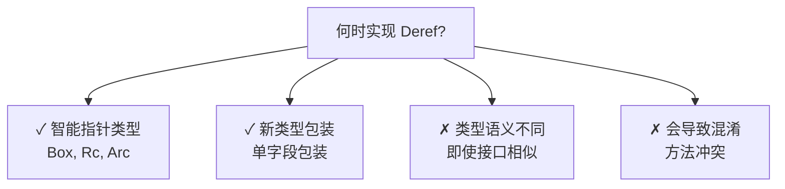

### 4. 闭包参数选择

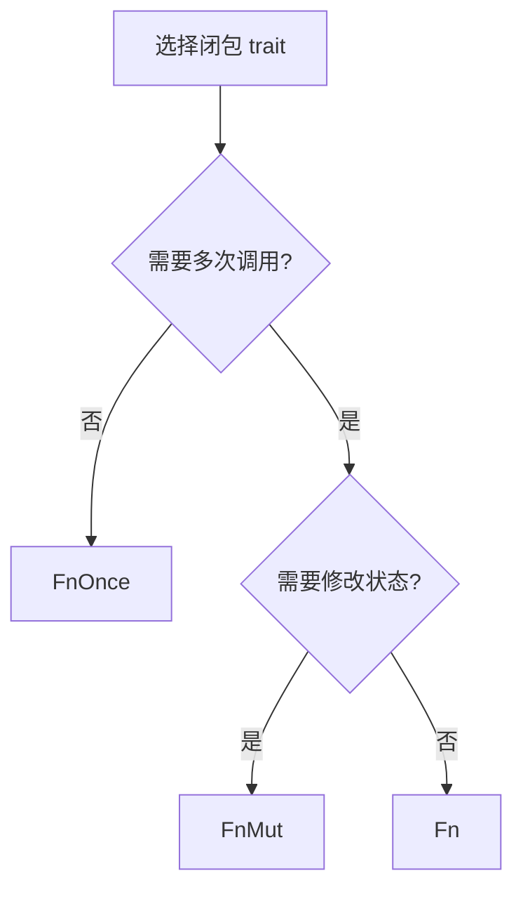

---

## 速查表

### 运算符 Trait

| 运算符 | Trait | 方法 |
|--------|-------|------|
| `+` | `Add` | `add` |
| `-` | `Sub` | `sub` |
| `*` | `Mul` | `mul` |
| `/` | `Div` | `div` |
| `%` | `Rem` | `rem` |
| `-` (一元) | `Neg` | `neg` |
| `!` | `Not` | `not` |
| `&` | `BitAnd` | `bitand` |
| `\|` | `BitOr` | `bitor` |
| `^` | `BitXor` | `bitxor` |
| `<<` | `Shl` | `shl` |
| `>>` | `Shr` | `shr` |
| `[]` | `Index` | `index` |
| `[]=` | `IndexMut` | `index_mut` |
| `*` | `Deref` | `deref` |
| `*=` | `DerefMut` | `deref_mut` |
| `()` | `Fn/FnMut/FnOnce` | `call*` |

### 格式化说明符

| 说明符 | Trait | 示例 |
|--------|-------|------|
| `{}` | `Display` | `42` |
| `{:?}` | `Debug` | `Point { x: 1 }` |
| `{:#?}` | `Debug` (美化) | 多行格式 |
| `{:o}` | `Octal` | `52` |
| `{:b}` | `Binary` | `101010` |
| `{:x}` | `LowerHex` | `2a` |
| `{:X}` | `UpperHex` | `2A` |
| `{:p}` | `Pointer` | `0x7fff...` |
| `{:e}` | `LowerExp` | `4.2e1` |
| `{:E}` | `UpperExp` | `4.2E1` |
