# 其他核心模块

> `core::slice`, `core::str`, `core::hash`, `core::io` 深度解析

## 概述

这些模块提供了 Rust 中最常用的数据处理能力：切片操作、字符串处理、哈希计算和基础 I/O。

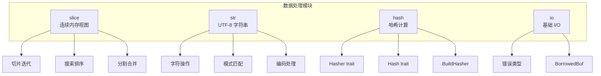

---

## core::slice 模块

### 切片概述

切片 `[T]` 是一种动态大小类型（DST），表示连续内存中的元素序列。

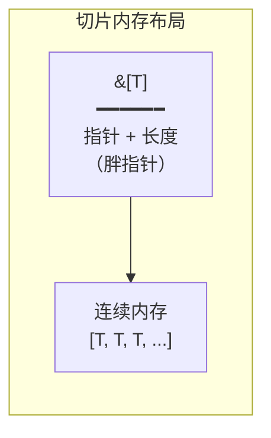

### 切片方法分类

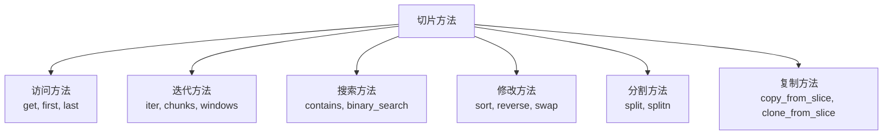

### 访问方法

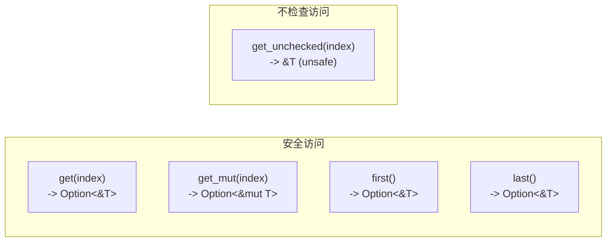

| 方法 | 返回类型 | 越界行为 |
|------|----------|----------|
| `slice[i]` | `T` / `&T` | panic |
| `get(i)` | `Option<&T>` | None |
| `get_unchecked(i)` | `&T` | UB (unsafe) |
| `first()` | `Option<&T>` | None |
| `last()` | `Option<&T>` | None |

### 迭代方法

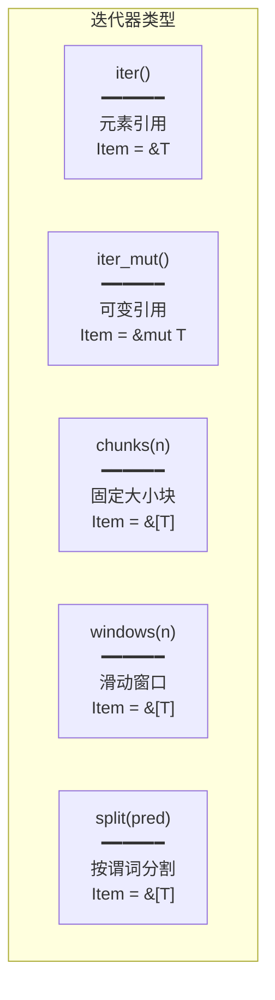

#### chunks vs windows

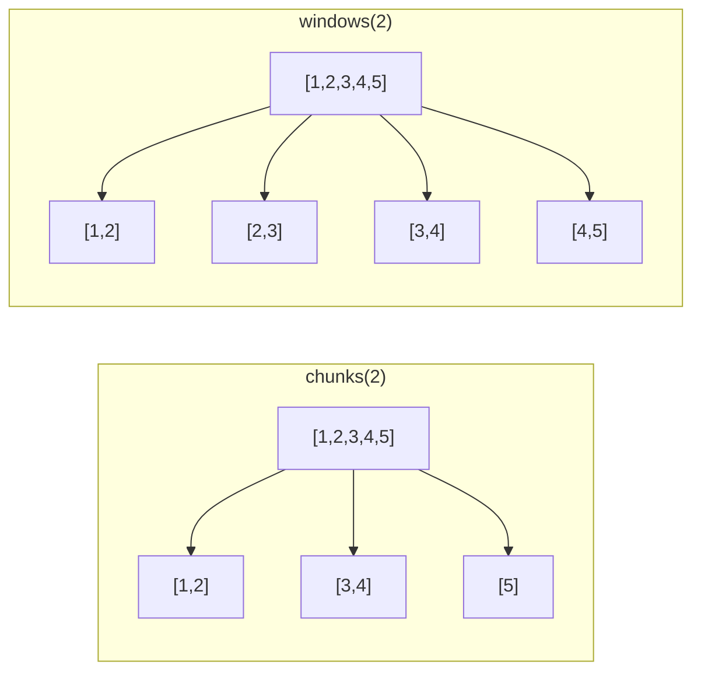

### 搜索和排序

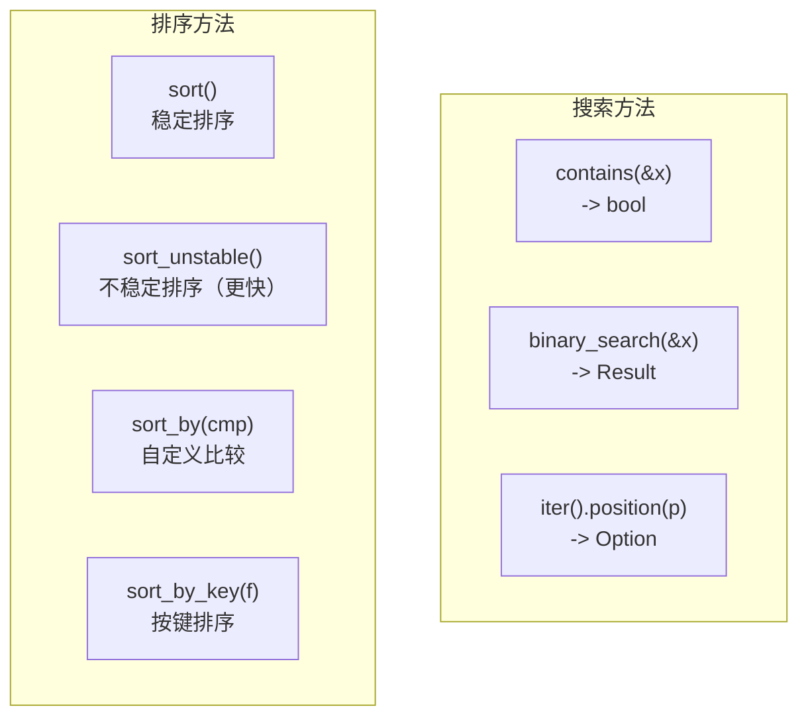

**binary_search 返回值**：

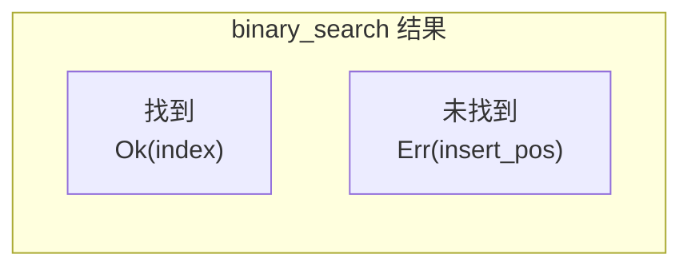

### 修改方法

| 方法 | 功能 |
|------|------|
| `swap(i, j)` | 交换两个元素 |
| `reverse()` | 原地反转 |
| `rotate_left(n)` | 左旋转 |
| `rotate_right(n)` | 右旋转 |
| `fill(value)` | 填充值 |
| `fill_with(f)` | 用闭包填充 |

### 分割方法

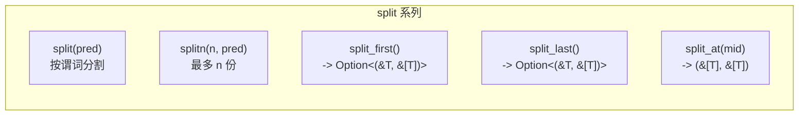

---

## core::str 模块

### str 类型

`str` 是 UTF-8 编码的字符串切片，是 DST 类型。

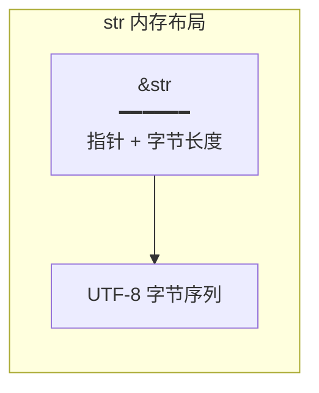

### 方法分类

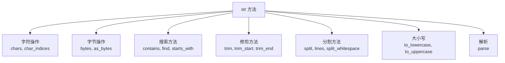

### 字符与字节

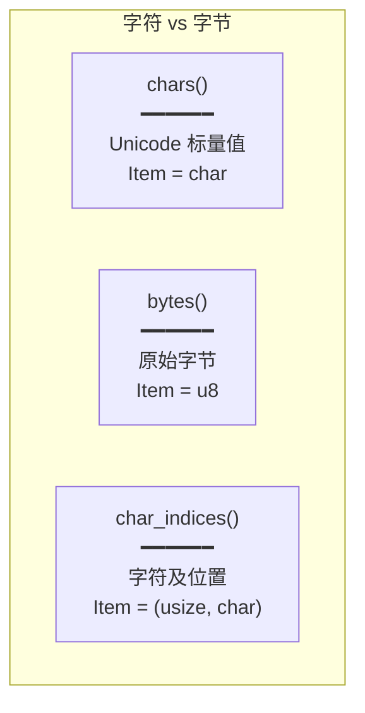

**重要区别**：

```rust
let s = "你好";
s.len();        // 6 (字节数)
s.chars().count(); // 2 (字符数)
```

### 搜索方法

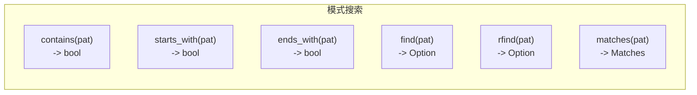

**Pattern trait 支持的类型**：
- `&str` - 字符串模式
- `char` - 单个字符
- `&[char]` - 字符集合
- `F: FnMut(char) -> bool` - 谓词函数

### 分割方法

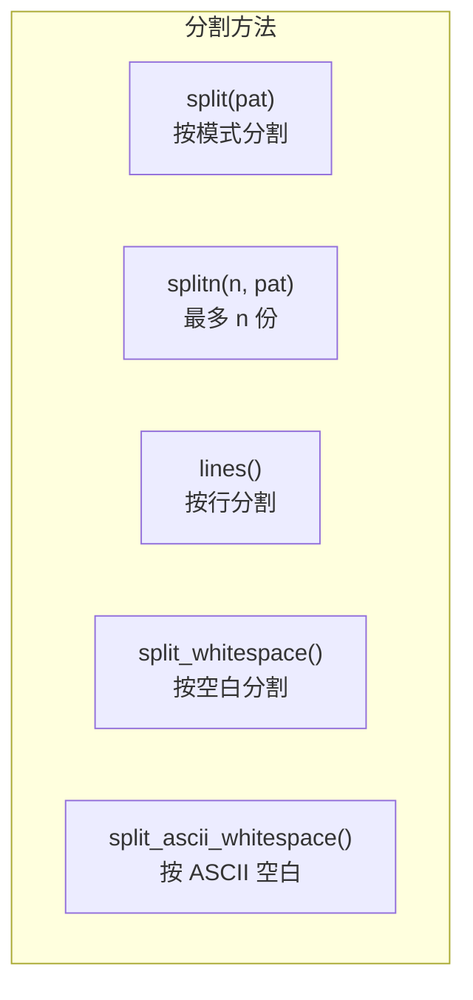

### 修剪方法

| 方法 | 功能 |
|------|------|
| `trim()` | 两端去空白 |
| `trim_start()` | 开头去空白 |
| `trim_end()` | 结尾去空白 |
| `trim_matches(pat)` | 两端去匹配 |
| `strip_prefix(pat)` | 去前缀 |
| `strip_suffix(pat)` | 去后缀 |

### 大小写转换

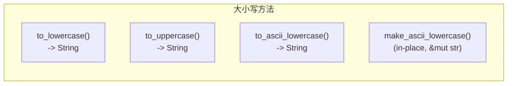

**注意**：`to_lowercase()` 和 `to_uppercase()` 返回 `String`，因为某些 Unicode 转换会改变长度。

---

## core::hash 模块

### Hash 和 Hasher

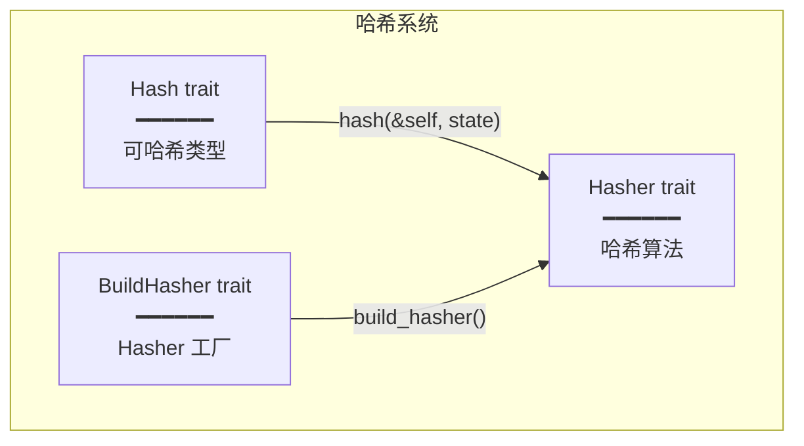

### Hash Trait

```rust
pub trait Hash {
    fn hash<H: Hasher>(&self, state: &mut H);

    fn hash_slice<H: Hasher>(data: &[Self], state: &mut H)
    where Self: Sized { ... }
}
```

**derive 规则**：
- 可以使用 `#[derive(Hash)]`
- 结构体所有字段必须实现 `Hash`
- 枚举判别值 + 变体数据都被哈希

### Hasher Trait

```rust
pub trait Hasher {
    fn finish(&self) -> u64;
    fn write(&mut self, bytes: &[u8]);

    // 便捷方法
    fn write_u8(&mut self, i: u8) { ... }
    fn write_u16(&mut self, i: u16) { ... }
    fn write_u32(&mut self, i: u32) { ... }
    fn write_u64(&mut self, i: u64) { ... }
    fn write_usize(&mut self, i: usize) { ... }
    // ...更多整数类型
}
```

### BuildHasher Trait

```rust
pub trait BuildHasher {
    type Hasher: Hasher;
    fn build_hasher(&self) -> Self::Hasher;
}
```

**用途**：`HashMap` 和 `HashSet` 使用 `BuildHasher` 创建 Hasher 实例。

### 哈希一致性规则

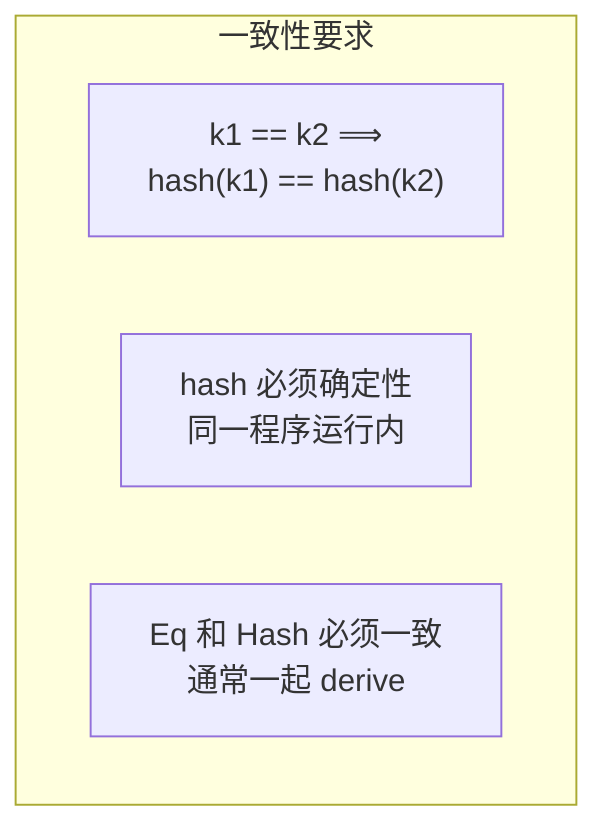

---

## core::io 模块

### 概述

`core::io` 提供了 `no_std` 环境下的基础 I/O 类型，主要是错误类型。

### Error 类型

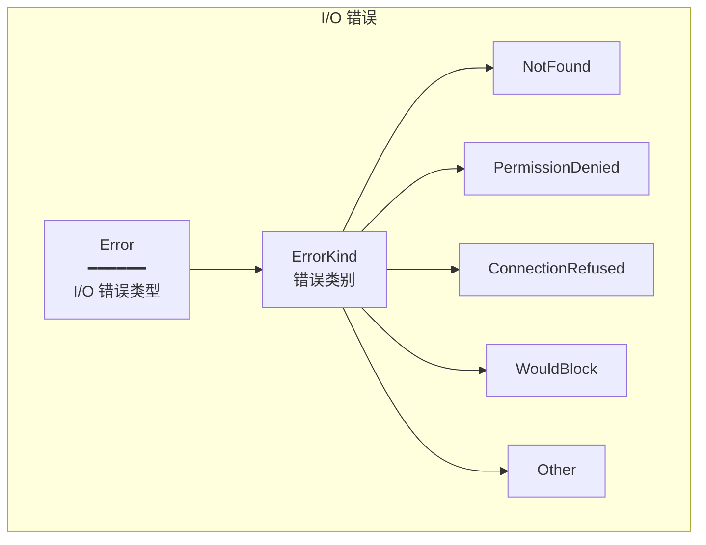

### BorrowedBuf（实验性）

```rust
pub struct BorrowedBuf<'data> {
    // 零拷贝缓冲区
}
```

**用途**：允许在不分配的情况下进行缓冲 I/O 操作。

---

## 模块交互

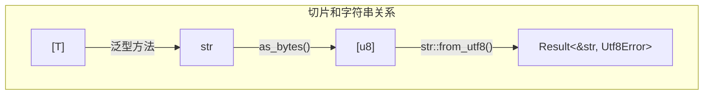

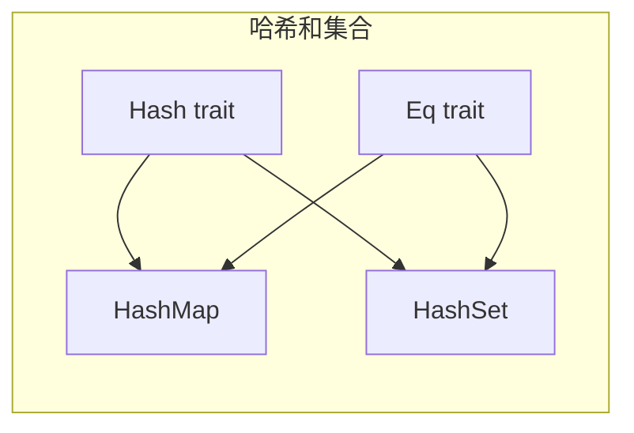

---

## 最佳实践

### 切片操作

```rust
// 优先使用 get() 而非索引
if let Some(first) = slice.get(0) {
    // 安全处理
}

// 使用 chunks_exact 当大小固定
for chunk in data.chunks_exact(4) {
    // chunk 总是 4 个元素
}

// 使用 split_at 而非多次切片
let (left, right) = slice.split_at(mid);
```

### 字符串操作

```rust
// 字符迭代而非字节
for c in s.chars() {
    // 处理 Unicode 字符
}

// 使用 split_whitespace 而非 split(' ')
for word in s.split_whitespace() {
    // 处理所有空白类型
}

// 检查前缀/后缀
if s.starts_with("http") {
    // ...
}
```

### 哈希实现

```rust
// 一起 derive Hash 和 Eq
#[derive(Hash, Eq, PartialEq)]
struct Key {
    id: u64,
    name: String,
}

// 或手动实现保持一致性
impl Hash for Key {
    fn hash<H: Hasher>(&self, state: &mut H) {
        self.id.hash(state);
        self.name.hash(state);
    }
}
```

---

## 速查表

### slice 常用方法

| 方法 | 功能 |
|------|------|
| `len()` | 元素数量 |
| `is_empty()` | 是否为空 |
| `get(i)` | 安全访问 |
| `first()/last()` | 首/尾元素 |
| `iter()` | 迭代器 |
| `chunks(n)` | 分块迭代 |
| `windows(n)` | 窗口迭代 |
| `split(pred)` | 分割 |
| `contains(&x)` | 包含检查 |
| `binary_search(&x)` | 二分查找 |
| `sort()` | 排序 |
| `reverse()` | 反转 |

### str 常用方法

| 方法 | 功能 |
|------|------|
| `len()` | 字节长度 |
| `is_empty()` | 是否为空 |
| `chars()` | 字符迭代 |
| `bytes()` | 字节迭代 |
| `contains(pat)` | 包含检查 |
| `starts_with(pat)` | 前缀检查 |
| `find(pat)` | 查找位置 |
| `split(pat)` | 分割 |
| `lines()` | 按行分割 |
| `trim()` | 去空白 |
| `to_lowercase()` | 转小写 |
| `parse()` | 解析 |
