# Rust Core 库架构图集

> 本文档包含 Rust Core 库的各种架构图和关系图

## 1. 整体架构

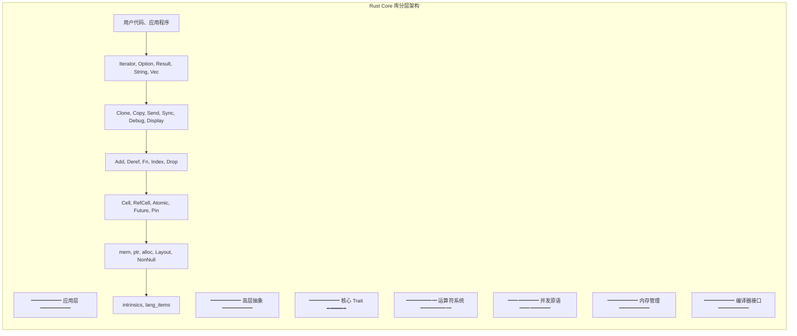

## 2. 模块依赖关系

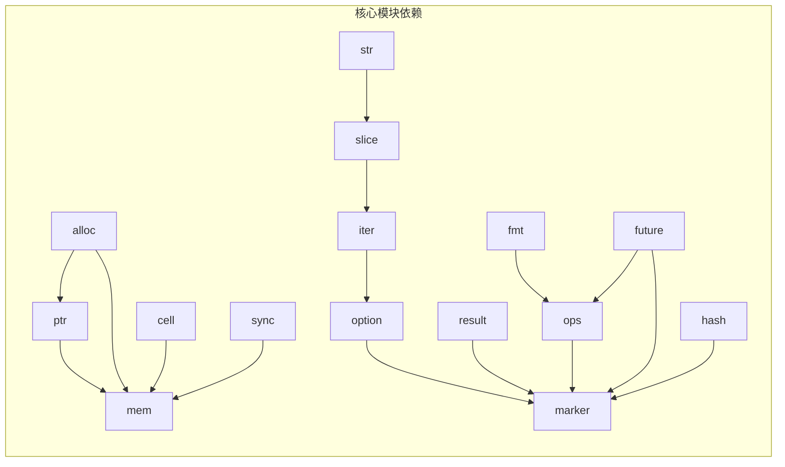

## 3. 类型安全体系

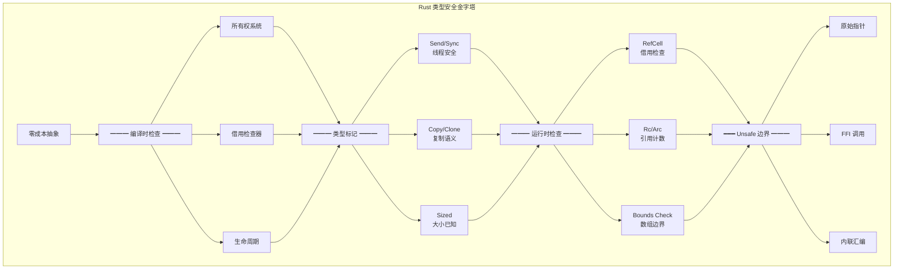

## 4. Trait 层级关系

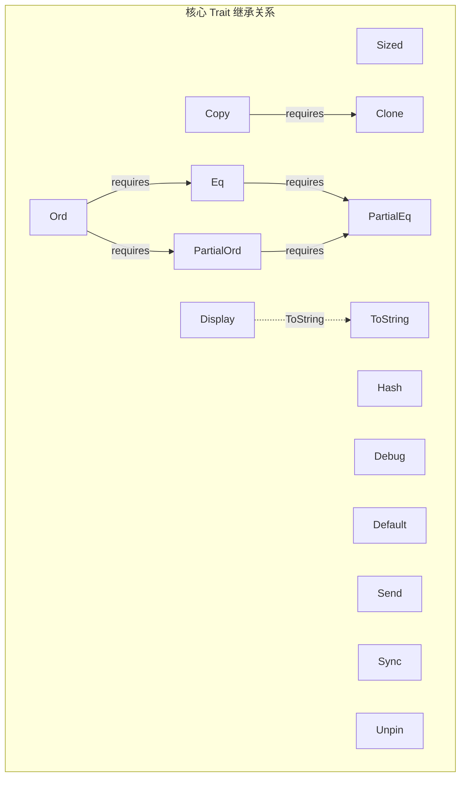

## 5. 迭代器适配器流水线

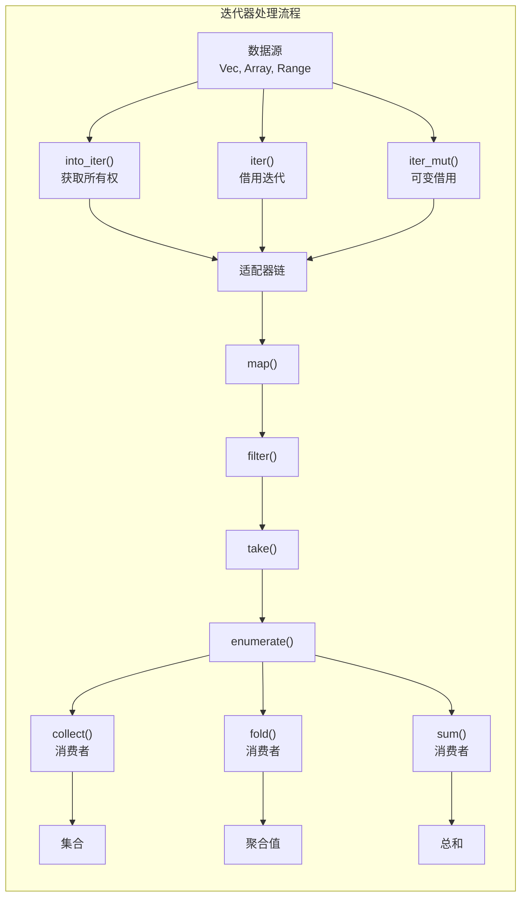

## 6. 内存管理流程

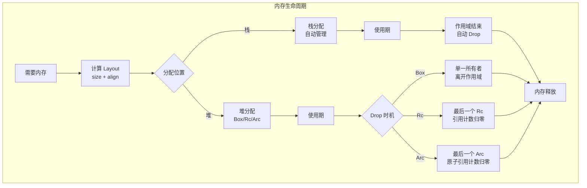

## 7. 错误处理流程

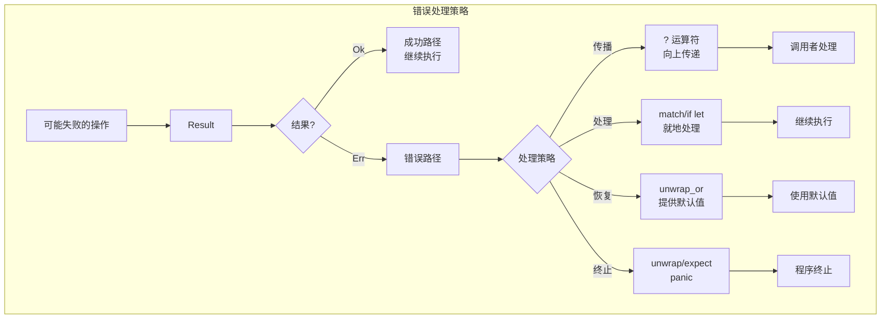

## 8. 并发模型

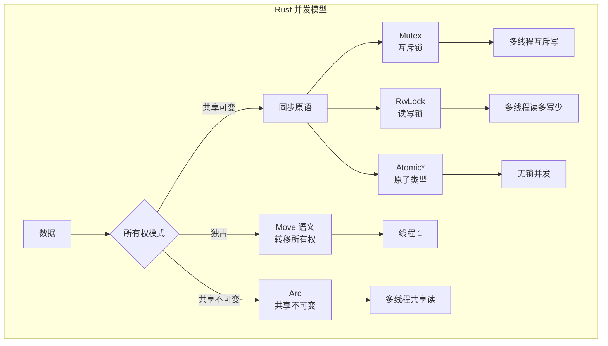

## 9. 异步执行模型

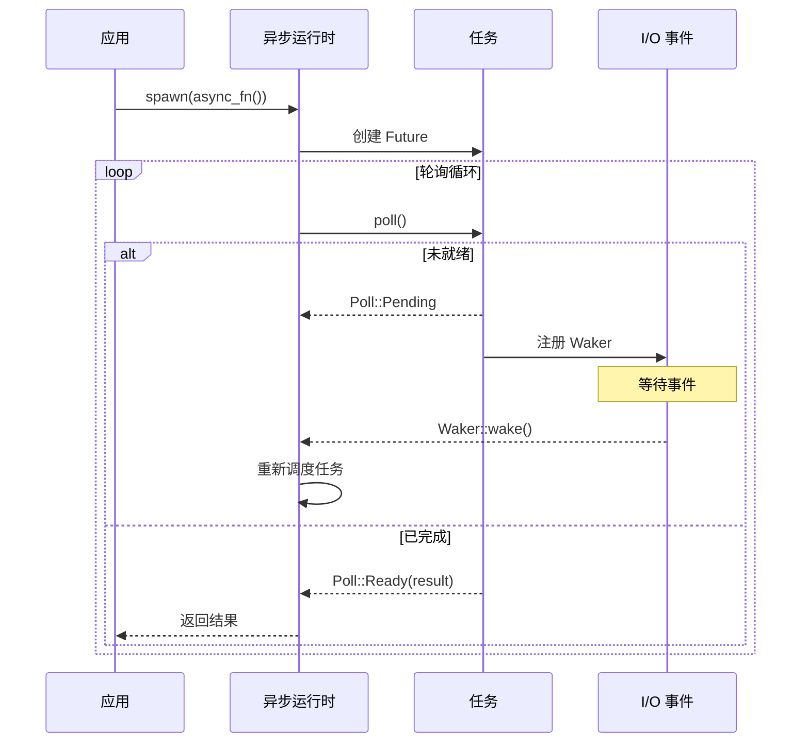

## 10. Pin 与自引用

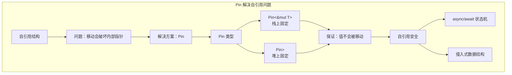

## 11. 智能指针对比

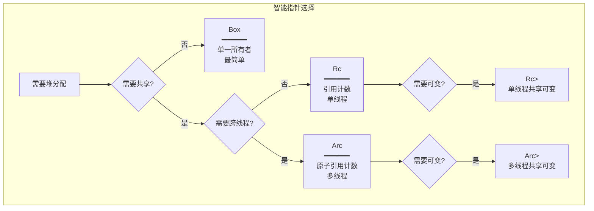

## 12. 内部可变性选择

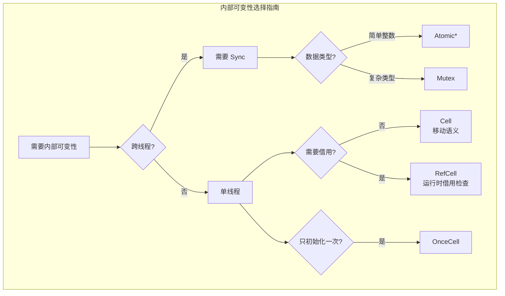

## 13. 生命周期关系

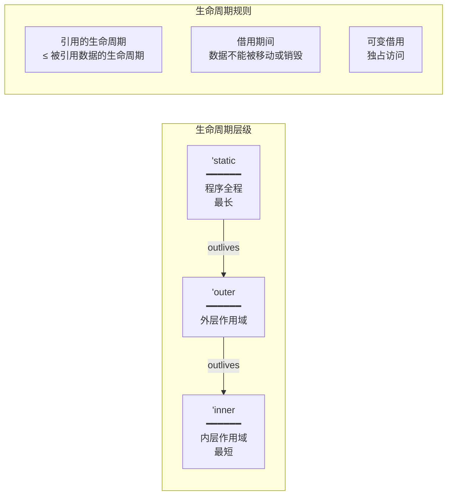

## 14. 宏系统概览

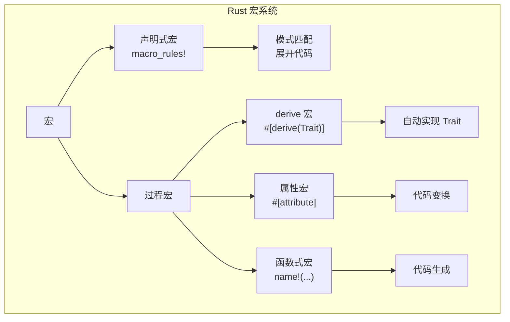

## 15. 特征对象与泛型

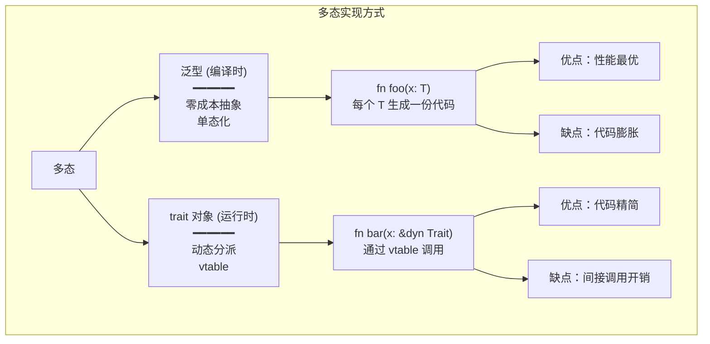

---

## 使用说明

本文档中的 Mermaid 图表可以在支持 Mermaid 的 Markdown 查看器中渲染，包括：

- GitHub
- GitLab
- VS Code (with Mermaid extension)
- Typora
- Obsidian
- HackMD

如果图表无法正确渲染，请确保您的查看器支持最新版本的 Mermaid 语法。
