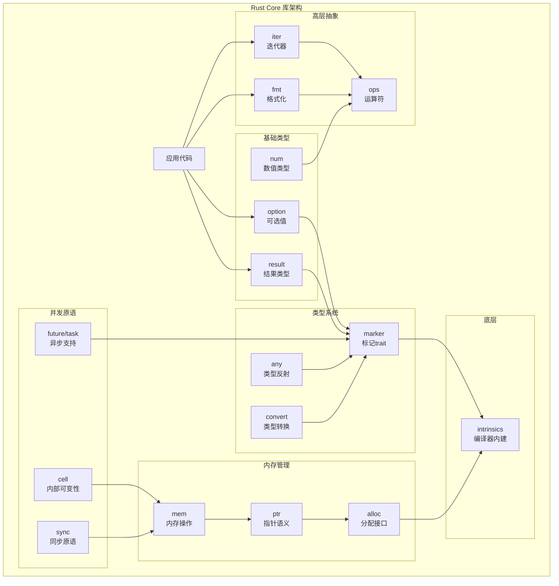
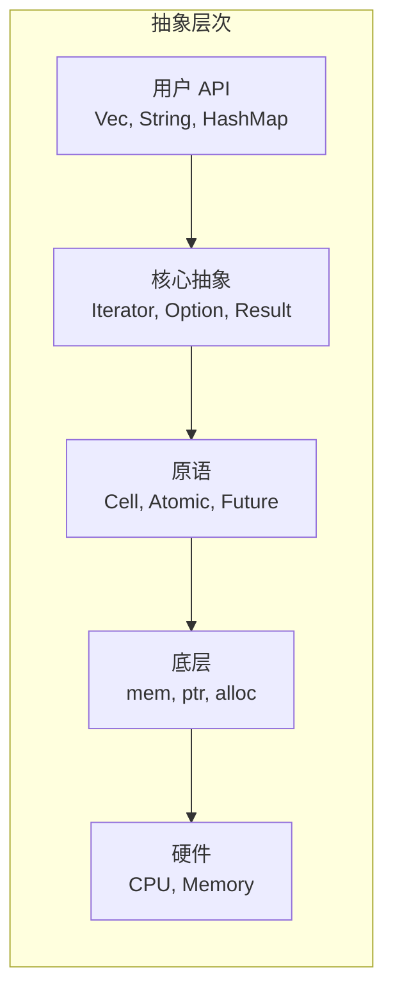
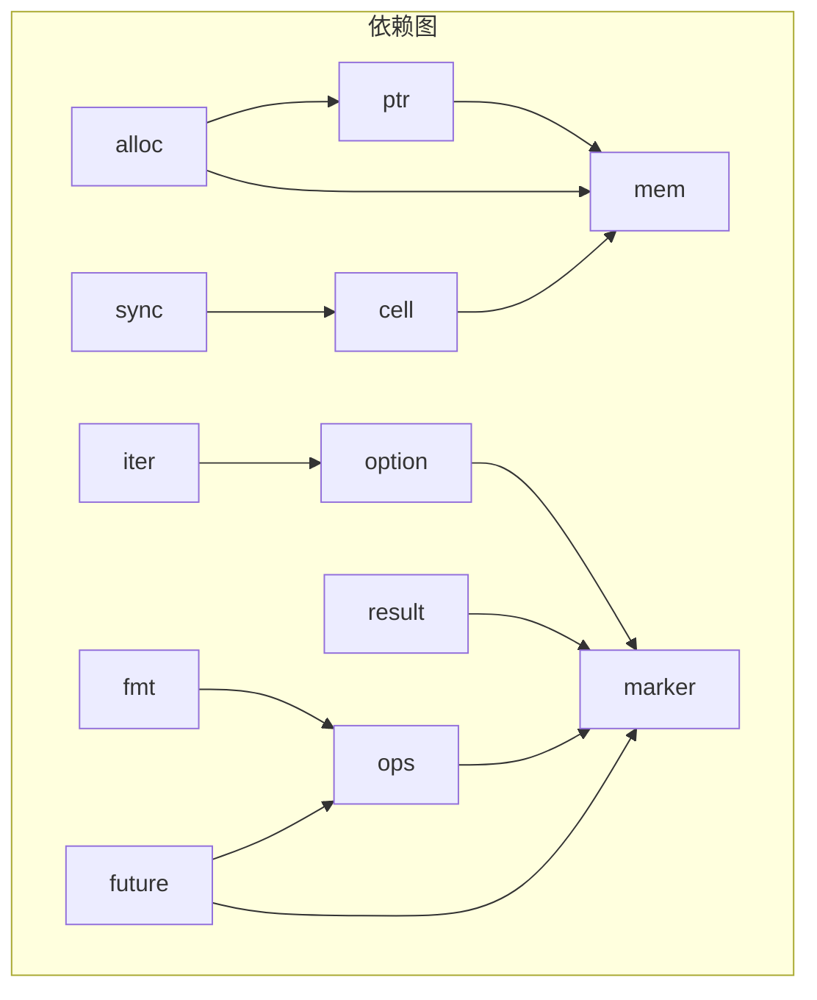

# Rust Core 库中文文档

> 基于 Rust 1.90.0 版本的 `core` 库深度分析文档

## 概述

Rust `core` 库是 Rust 标准库的核心组件，提供了语言的基础抽象和类型。它不依赖于操作系统或堆分配，可用于裸机（bare-metal）和嵌入式环境。

## 文档索引

### 内存管理
- [内存管理模块 (mem, ptr, alloc)](./01_memory.md) - 内存布局、指针操作、分配接口

### 类型系统
- [类型系统模块 (marker, any, convert)](./02_types.md) - 标记 trait、类型反射、类型转换

### 迭代器
- [迭代器模块 (iter)](./03_iterator.md) - Iterator trait 及适配器生态

### 并发与异步
- [并发模块 (sync, cell, future, task)](./04_concurrency.md) - 内部可变性、原子类型、异步支持

### 基础类型
- [基础类型模块 (option, result, num)](./05_fundamentals.md) - 可选值、错误处理、数值类型

### 运算符与格式化
- [运算符与格式化模块 (ops, fmt)](./06_ops_fmt.md) - 运算符重载、格式化 trait

### 其他核心模块
- [其他核心模块 (slice, str, hash, io)](./07_others.md) - 切片、字符串、哈希、I/O

### 架构图集
- [Rust Core 库架构图集](./08_diagrams.md) - 综合 Mermaid 图表集合

## 架构总览

## 设计原则

### 1. 零成本抽象
Rust core 库遵循"不为不使用的功能付出代价"的原则：
- 迭代器适配器编译后与手写循环等效
- 智能指针包装无运行时开销
- 泛型在编译时单态化

### 2. 类型安全
通过类型系统在编译时捕获错误：
- `Option<T>` 替代空指针
- `Result<T, E>` 强制错误处理
- 所有权和借用规则防止数据竞争

### 3. 显式优于隐式
- 内存顺序必须显式指定
- 类型转换需要明确调用
- 可变性必须显式声明

### 4. 分层设计

## 模块依赖关系

## 快速导航

| 模块 | 主要功能 | 关键类型/Trait |
|------|----------|----------------|
| `mem` | 内存操作 | `MaybeUninit`, `ManuallyDrop`, `size_of` |
| `ptr` | 指针语义 | `NonNull`, `read`, `write` |
| `alloc` | 分配接口 | `Layout`, `GlobalAlloc`, `Allocator` |
| `marker` | 类型标记 | `Copy`, `Send`, `Sync`, `Sized` |
| `ops` | 运算符 | `Add`, `Deref`, `Fn`, `Index` |
| `iter` | 迭代器 | `Iterator`, `IntoIterator` |
| `option` | 可选值 | `Option<T>` |
| `result` | 结果类型 | `Result<T, E>` |
| `fmt` | 格式化 | `Display`, `Debug`, `Formatter` |
| `cell` | 内部可变性 | `Cell`, `RefCell`, `UnsafeCell` |
| `sync` | 同步原语 | `atomic` 模块 |
| `future` | 异步支持 | `Future`, `Poll` |

## 版本信息

- **Rust 版本**: 1.90.0
- **文档生成日期**: 2025-11-30
- **文档语言**: 简体中文

## 许可证

本文档基于 Rust 官方文档创作，遵循相同的许可协议。
