# 第一章：Safe 与 Unsafe 的邂逅（深度扩展版）

## 概述

Rust 是一门独特的语言，它同时包含两种编程语言：**Safe Rust** 和 **Unsafe Rust**。理解这两者的关系是掌握 Rust 底层编程的关键。

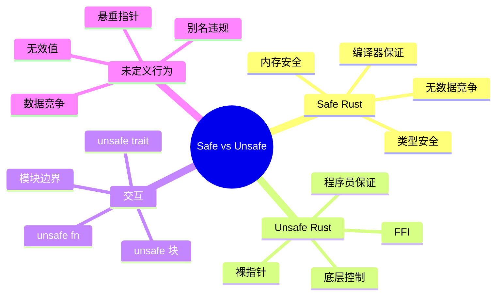

## 1.1 为什么需要 Unsafe？

### 安全语言的根本限制

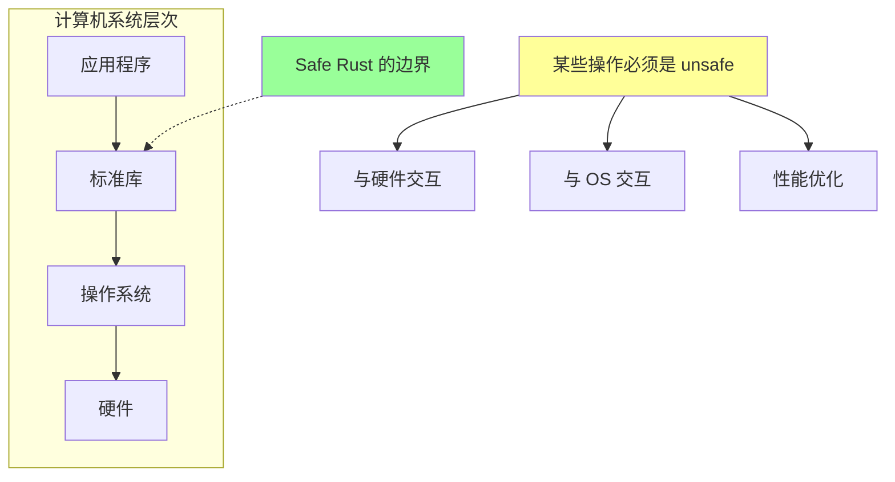

### 实际案例：为什么标准库需要 unsafe

```rust
// Vec::push 的简化实现
impl<T> Vec<T> {
    pub fn push(&mut self, value: T) {
        if self.len == self.capacity() {
            self.reserve(1);  // 可能重新分配
        }

        // 必须使用 unsafe！
        // 因为我们需要写入"未初始化"的内存
        unsafe {
            let end = self.as_mut_ptr().add(self.len);
            std::ptr::write(end, value);
            self.set_len(self.len + 1);
        }
    }
}
```

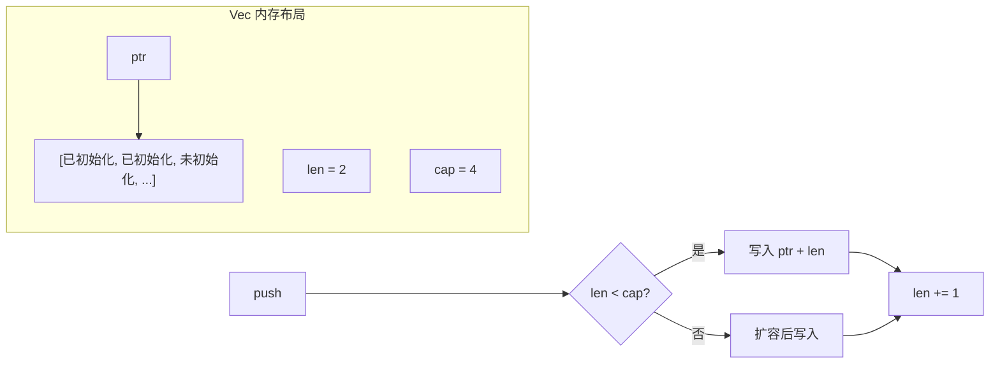

### 三种处理底层细节的方式对比

```rust
// 方式 1：引导编译器优化（有时不可行）
fn sum_safe(slice: &[i32]) -> i32 {
    slice.iter().sum()  // 编译器可能会向量化
}

// 方式 2：使用非惯用设计（代码变丑）
fn get_two_mut_ugly<T>(slice: &mut [T], i: usize, j: usize) -> (&mut T, &mut T) {
    assert!(i != j);
    let (left, right) = slice.split_at_mut(std::cmp::max(i, j));
    if i < j {
        (&mut left[i], &mut right[0])
    } else {
        (&mut right[0], &mut left[j])
    }
}

// 方式 3：使用 unsafe（直接且高效）
fn get_two_mut<T>(slice: &mut [T], i: usize, j: usize) -> (&mut T, &mut T) {
    assert!(i != j && i < slice.len() && j < slice.len());
    unsafe {
        let ptr = slice.as_mut_ptr();
        (&mut *ptr.add(i), &mut *ptr.add(j))
    }
}
```

## 1.2 Safe Rust 的核心保证

### 健全性定理 (Soundness Theorem)

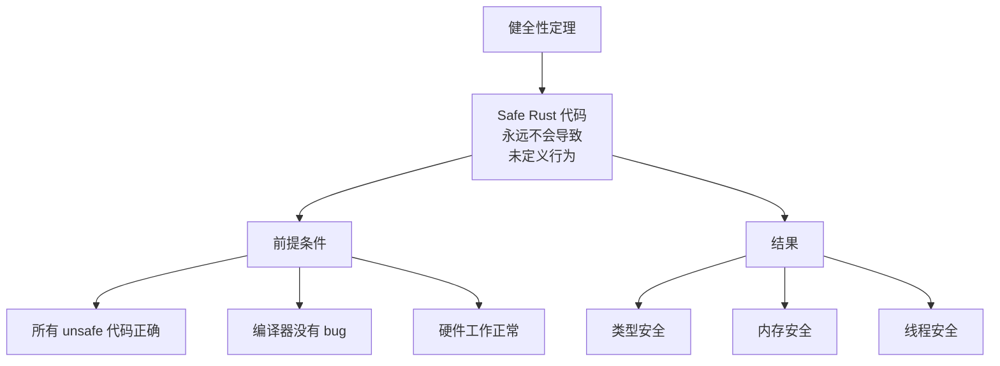

### Safe Rust 能阻止什么？

```rust
// 1. 悬垂指针 - 编译器拒绝
fn dangling() -> &i32 {
    let x = 42;
    &x  // 错误：x 在函数结束时被销毁
}

// 2. 数据竞争 - 编译器拒绝
fn data_race() {
    let mut data = vec![1, 2, 3];
    let r = &data[0];
    data.push(4);  // 错误：data 被借用时不能修改
    println!("{}", r);
}

// 3. 空指针解引用 - 类型系统阻止
fn null_deref(opt: Option<&i32>) {
    // 必须处理 None 情况
    match opt {
        Some(x) => println!("{}", x),
        None => println!("No value"),
    }
}

// 4. 缓冲区溢出 - 运行时检查
fn buffer_overflow() {
    let arr = [1, 2, 3];
    // arr[10];  // panic: index out of bounds
}
```

### Safe Rust 不能阻止什么？

```rust
// 这些都是"安全"的，但可能是逻辑错误

// 1. 死锁
use std::sync::Mutex;
fn deadlock() {
    let a = Mutex::new(1);
    let b = Mutex::new(2);

    // 线程 1
    let _ga = a.lock().unwrap();
    let _gb = b.lock().unwrap();  // 如果线程 2 以相反顺序获取锁...

    // 线程 2
    let _gb = b.lock().unwrap();
    let _ga = a.lock().unwrap();  // 死锁！
}

// 2. 内存泄漏
fn memory_leak() {
    let s = String::from("hello");
    std::mem::forget(s);  // 故意泄漏
    // 或者 Rc 循环引用
}

// 3. 整数溢出（release 模式下 wrap）
fn overflow() {
    let x: u8 = 255;
    let y = x.wrapping_add(1);  // y = 0
}

// 4. 逻辑错误
fn logic_error() {
    let result = 1 + 1;
    assert_eq!(result, 3);  // 逻辑错误，但类型正确
}
```

## 1.3 Unsafe 关键字详解

### unsafe 的四种用法

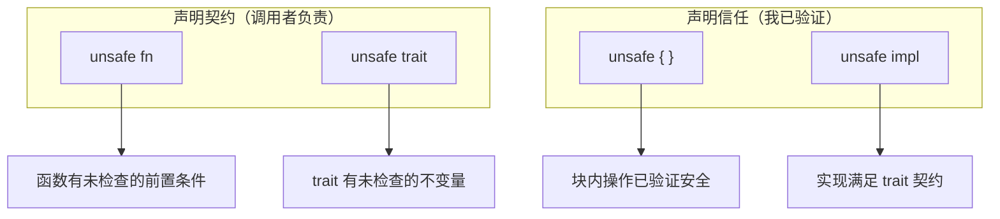

### 深入理解 unsafe fn

```rust
/// 从裸指针创建切片
///
/// # Safety
///
/// 调用者必须保证：
/// - `ptr` 必须有效且正确对齐
/// - `ptr` 必须指向 `len` 个连续的已初始化 T
/// - 引用的内存在返回的切片生命周期内不能被修改
/// - `len * size_of::<T>()` 不能超过 isize::MAX
unsafe fn slice_from_raw<'a, T>(ptr: *const T, len: usize) -> &'a [T] {
    std::slice::from_raw_parts(ptr, len)
}

// 调用时
fn use_slice() {
    let arr = [1, 2, 3, 4, 5];
    let ptr = arr.as_ptr();

    // 必须用 unsafe 块，因为我们在"信任"参数有效
    let slice = unsafe { slice_from_raw(ptr, 3) };
    println!("{:?}", slice);  // [1, 2, 3]
}
```

### 深入理解 unsafe trait

```rust
/// 标记类型可以安全地按字节复制
///
/// # Safety
///
/// 实现此 trait 的类型必须：
/// - 没有内部可变性
/// - 没有指向自身的指针
/// - 所有位模式都是有效的
unsafe trait Pod: Copy + 'static {
    fn zeroed() -> Self {
        unsafe { std::mem::zeroed() }
    }
}

// 安全实现
unsafe impl Pod for i32 {}
unsafe impl Pod for f32 {}
unsafe impl Pod for [u8; 16] {}

// 不能为这些类型实现：
// - &T（不能是全零）
// - String（内部有指针）
// - Cell<T>（内部可变性）

fn demo() {
    let x: i32 = Pod::zeroed();
    assert_eq!(x, 0);
}
```

## 1.4 Unsafe 的五种超能力

### 能力 1：解引用裸指针

```rust
fn raw_pointers() {
    let mut x = 42;

    // 创建裸指针（安全）
    let r1 = &x as *const i32;
    let r2 = &mut x as *mut i32;

    // 打印地址（安全）
    println!("r1: {:p}, r2: {:p}", r1, r2);

    // 解引用（必须 unsafe）
    unsafe {
        println!("*r1 = {}", *r1);
        *r2 = 100;
        println!("*r2 = {}", *r2);
    }

    // 裸指针算术
    let arr = [1, 2, 3, 4, 5];
    let ptr = arr.as_ptr();

    unsafe {
        for i in 0..5 {
            println!("arr[{}] = {}", i, *ptr.add(i));
        }
    }
}
```

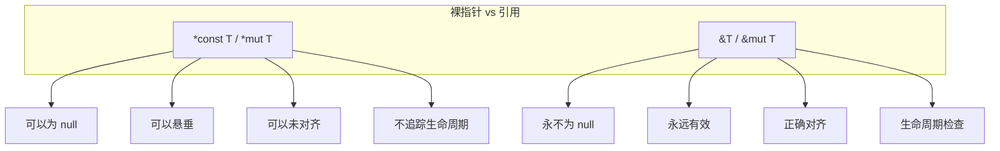

### 能力 2：调用 unsafe 函数

```rust
fn calling_unsafe() {
    let s = "hello";

    // 标准库的 unsafe 函数
    unsafe {
        // 不检查边界
        let byte = s.as_bytes().get_unchecked(0);
        println!("First byte: {}", byte);
    }

    // 内存操作
    let mut arr = [1, 2, 3];
    unsafe {
        // 原地交换
        std::ptr::swap(&mut arr[0], &mut arr[2]);
    }
    println!("{:?}", arr);  // [3, 2, 1]

    // 编译器内置函数
    let x = 42i32;
    unsafe {
        // 计算前导零
        let lz = std::intrinsics::ctlz(x);
        println!("Leading zeros: {}", lz);
    }
}
```

### 能力 3：实现 unsafe trait

```rust
use std::marker::PhantomData;

// 自定义的并发类型
struct MyChannel<T> {
    // ... 实现细节
    _marker: PhantomData<T>,
}

// 我们保证这个类型是线程安全的
unsafe impl<T: Send> Send for MyChannel<T> {}
unsafe impl<T: Send> Sync for MyChannel<T> {}
```

### 能力 4：访问/修改可变静态变量

```rust
static mut COUNTER: u32 = 0;

fn increment() {
    unsafe {
        COUNTER += 1;  // 数据竞争风险！
    }
}

// 更安全的替代方案
use std::sync::atomic::{AtomicU32, Ordering};

static SAFE_COUNTER: AtomicU32 = AtomicU32::new(0);

fn safe_increment() {
    SAFE_COUNTER.fetch_add(1, Ordering::SeqCst);
}
```

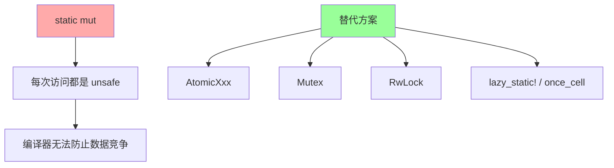

### 能力 5：访问 union 字段

```rust
#[repr(C)]
union IntOrFloat {
    i: i32,
    f: f32,
}

fn union_demo() {
    let mut u = IntOrFloat { i: 42 };

    // 读取任何字段都是 unsafe
    unsafe {
        println!("As int: {}", u.i);
        println!("As float: {}", u.f);  // 重新解释位
    }

    // 写入是安全的（对于 Copy 类型）
    u.f = 3.14;

    unsafe {
        println!("After write:");
        println!("As int: 0x{:08x}", u.i);
        println!("As float: {}", u.f);
    }
}

// 实际应用：IP 地址
#[repr(C)]
union IpAddress {
    v4: [u8; 4],
    v6: [u16; 8],
    raw: u128,
}
```

## 1.5 未定义行为 (UB) 完全指南

### UB 的可怕之处

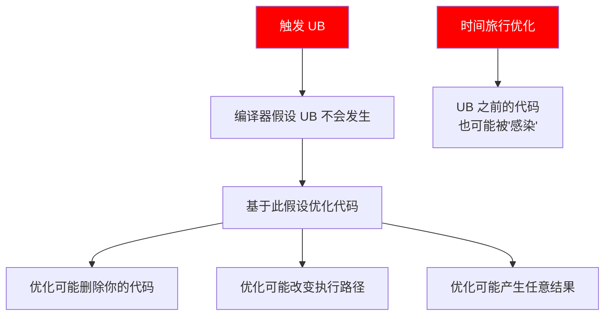

### UB 实例详解

```rust
// UB 1: 创建无效的布尔值
fn invalid_bool() {
    let x: bool = unsafe { std::mem::transmute(2u8) };
    // x 既不是 true 也不是 false
    // 任何使用 x 的代码都是 UB
    if x {
        // 可能执行
    } else {
        // 也可能执行
    }
    // 或者两个都不执行！
}

// UB 2: 创建无效的枚举
enum Color { Red, Green, Blue }

fn invalid_enum() {
    let c: Color = unsafe { std::mem::transmute(100u8) };
    // 100 不是有效的判别式
    match c {
        Color::Red => println!("red"),
        Color::Green => println!("green"),
        Color::Blue => println!("blue"),
        // 没有匹配 100 的分支！
    }
}

// UB 3: 数据竞争
use std::thread;

fn data_race() {
    static mut DATA: i32 = 0;

    let t1 = thread::spawn(|| {
        unsafe { DATA = 1; }
    });
    let t2 = thread::spawn(|| {
        unsafe { DATA = 2; }
    });

    t1.join().unwrap();
    t2.join().unwrap();

    // DATA 的值是未定义的
    unsafe { println!("{}", DATA); }
}

// UB 4: 违反别名规则
fn aliasing_violation() {
    let mut x = 42;
    let r1 = &x as *const i32;
    let r2 = &mut x as *mut i32;

    unsafe {
        // r1 和 r2 指向同一内存
        // 同时存在共享引用和可变引用的语义
        *r2 = 100;
        println!("{}", *r1);  // 编译器可能优化为 42
    }
}

// UB 5: 悬垂指针
fn dangling_pointer() -> *const i32 {
    let x = 42;
    &x as *const i32
    // x 在这里被销毁
    // 返回的指针指向已释放的栈内存
}

// UB 6: 未对齐访问
fn unaligned_access() {
    let arr: [u8; 8] = [0; 8];
    let ptr = arr.as_ptr().wrapping_add(1) as *const i32;

    unsafe {
        // 在需要 4 字节对齐的平台上
        // 从非 4 对齐的地址读取 i32 是 UB
        let _value = *ptr;  // 可能 crash 或返回错误值
    }
}
```

### UB 检测工具

```rust
// 使用 Miri 检测 UB
// cargo +nightly miri run

fn check_with_miri() {
    let x = [1, 2, 3];
    let ptr = x.as_ptr();

    unsafe {
        // Miri 会报告这是越界访问
        let _ = *ptr.add(10);
    }
}

// 使用 AddressSanitizer
// RUSTFLAGS="-Z sanitizer=address" cargo +nightly run

// 使用 ThreadSanitizer
// RUSTFLAGS="-Z sanitizer=thread" cargo +nightly run
```

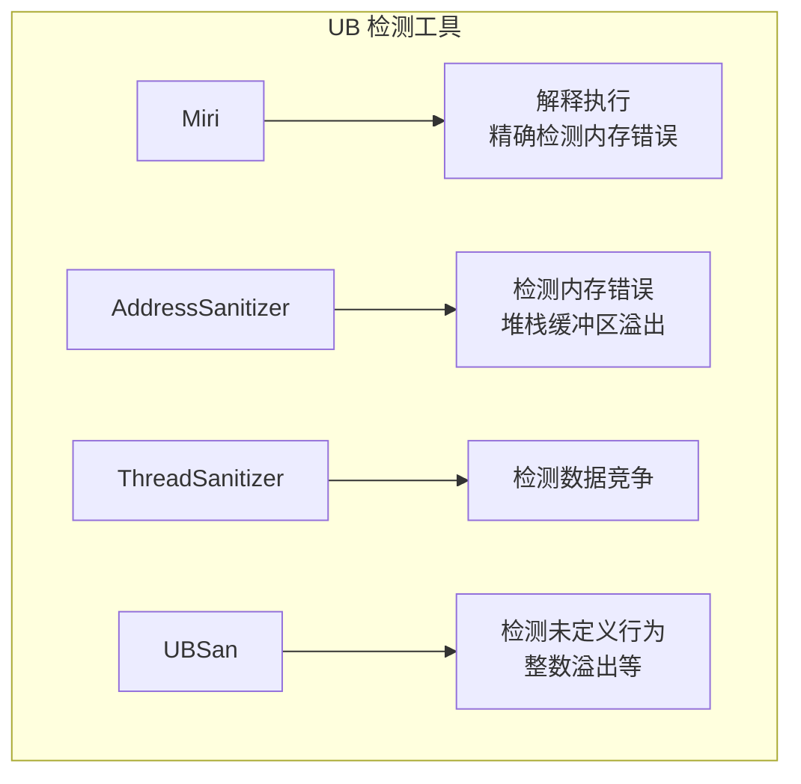

## 1.6 Safe 和 Unsafe 的信任边界

### 信任关系详解

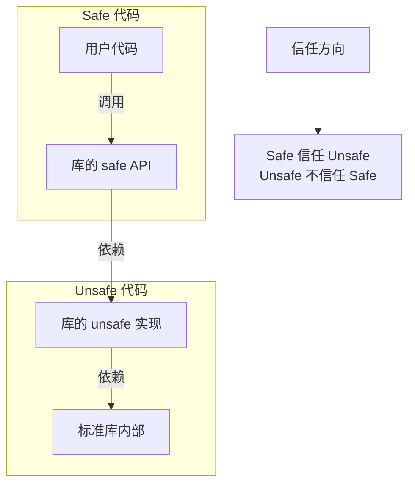

### 泛型代码的信任问题

```rust
// BTreeMap 不能完全信任用户的 Ord 实现
use std::collections::BTreeMap;

#[derive(Eq, PartialEq)]
struct BadKey(i32);

impl Ord for BadKey {
    fn cmp(&self, other: &Self) -> std::cmp::Ordering {
        // 故意写错的 Ord 实现
        use std::cmp::Ordering::*;
        match self.0.cmp(&other.0) {
            Less => Greater,  // 反转！
            Greater => Less,  // 反转！
            Equal => Equal,
        }
    }
}

impl PartialOrd for BadKey {
    fn partial_cmp(&self, other: &Self) -> Option<std::cmp::Ordering> {
        Some(self.cmp(other))
    }
}

fn bad_ord_demo() {
    let mut map = BTreeMap::new();

    // 插入可能以意想不到的顺序进行
    map.insert(BadKey(1), "one");
    map.insert(BadKey(2), "two");
    map.insert(BadKey(3), "three");

    // 查找可能找不到存在的键
    // BTreeMap 会行为异常，但不会触发 UB
    println!("{:?}", map.get(&BadKey(2)));
}
```

### 模块边界作为安全边界

```rust
mod my_vec {
    pub struct Vec<T> {
        ptr: *mut T,      // 私有！
        len: usize,       // 私有！
        cap: usize,       // 私有！
    }

    impl<T> Vec<T> {
        pub fn new() -> Self {
            Vec {
                ptr: std::ptr::NonNull::dangling().as_ptr(),
                len: 0,
                cap: 0,
            }
        }

        pub fn push(&mut self, value: T) {
            // ... 安全的实现
        }

        pub fn len(&self) -> usize {
            self.len  // 只读访问
        }

        // 这个方法如果是 pub 会破坏安全性！
        fn set_len(&mut self, new_len: usize) {
            self.len = new_len;
        }
    }
}

// 外部代码无法直接访问 ptr/len/cap
// 无法破坏 Vec 的不变量
```

## 1.7 编写健全 (Sound) 的 Unsafe 代码

### 健全性检查清单

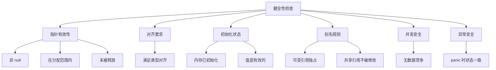

### 文档化安全约束

```rust
/// 从两个不重叠的切片创建一个合并视图
///
/// # Safety
///
/// 调用者必须确保：
/// - `a` 和 `b` 指向有效的、已初始化的内存
/// - `a` 和 `b` 的内存区域不重叠
/// - 返回值的生命周期不超过输入的生命周期
///
/// # Examples
///
/// ```
/// let arr1 = [1, 2, 3];
/// let arr2 = [4, 5, 6];
/// unsafe {
///     let view = merge_views(&arr1, &arr2);
///     // 使用 view...
/// }
/// ```
unsafe fn merge_views<'a, T>(a: &'a [T], b: &'a [T]) -> MergedView<'a, T> {
    MergedView {
        first: a.as_ptr(),
        first_len: a.len(),
        second: b.as_ptr(),
        second_len: b.len(),
        _marker: std::marker::PhantomData,
    }
}
```

## 1.8 实战案例分析

### 案例 1：实现 split_at_mut

```rust
fn split_at_mut<T>(slice: &mut [T], mid: usize) -> (&mut [T], &mut [T]) {
    let len = slice.len();
    let ptr = slice.as_mut_ptr();

    assert!(mid <= len, "mid out of bounds");

    // 为什么这是安全的？
    // 1. 我们有对整个切片的可变访问权
    // 2. 两个返回的切片不重叠
    // 3. 合起来覆盖原切片的所有元素
    unsafe {
        (
            std::slice::from_raw_parts_mut(ptr, mid),
            std::slice::from_raw_parts_mut(ptr.add(mid), len - mid),
        )
    }
}

// 使用示例
fn use_split() {
    let mut arr = [1, 2, 3, 4, 5];
    let (left, right) = split_at_mut(&mut arr, 2);

    left[0] = 10;
    right[0] = 30;

    println!("{:?}", arr);  // [10, 2, 30, 4, 5]
}
```

### 案例 2：实现 transmute 的安全封装

```rust
/// 将字节数组转换为指定类型
///
/// 仅对 "Plain Old Data" 类型安全
trait FromBytes: Sized {
    fn from_bytes(bytes: &[u8]) -> Option<&Self>;
}

impl FromBytes for u32 {
    fn from_bytes(bytes: &[u8]) -> Option<&Self> {
        if bytes.len() < std::mem::size_of::<Self>() {
            return None;
        }
        if bytes.as_ptr() as usize % std::mem::align_of::<Self>() != 0 {
            return None;  // 未对齐
        }

        // 现在可以安全转换
        unsafe {
            Some(&*(bytes.as_ptr() as *const Self))
        }
    }
}

fn from_bytes_demo() {
    let bytes = [0x78, 0x56, 0x34, 0x12];
    if let Some(value) = u32::from_bytes(&bytes) {
        println!("Value: 0x{:08x}", value);  // 0x12345678 (小端)
    }
}
```

### 案例 3：安全的引用计数

```rust
use std::cell::UnsafeCell;
use std::ops::Deref;

struct Rc<T> {
    ptr: *mut RcInner<T>,
}

struct RcInner<T> {
    count: UnsafeCell<usize>,
    value: T,
}

impl<T> Rc<T> {
    fn new(value: T) -> Self {
        let inner = Box::new(RcInner {
            count: UnsafeCell::new(1),
            value,
        });
        Rc {
            ptr: Box::into_raw(inner),
        }
    }

    fn strong_count(&self) -> usize {
        unsafe { *(*self.ptr).count.get() }
    }
}

impl<T> Clone for Rc<T> {
    fn clone(&self) -> Self {
        unsafe {
            *(*self.ptr).count.get() += 1;
        }
        Rc { ptr: self.ptr }
    }
}

impl<T> Deref for Rc<T> {
    type Target = T;

    fn deref(&self) -> &T {
        unsafe { &(*self.ptr).value }
    }
}

impl<T> Drop for Rc<T> {
    fn drop(&mut self) {
        unsafe {
            *(*self.ptr).count.get() -= 1;
            if *(*self.ptr).count.get() == 0 {
                drop(Box::from_raw(self.ptr));
            }
        }
    }
}

// 注意：这个实现不是线程安全的！
// 不应该实现 Send 或 Sync
```

## 1.9 总结与最佳实践

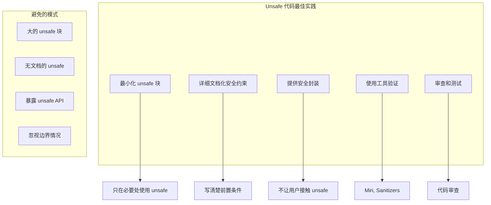

**核心要点：**

1. **Safe Rust 是真正安全的**：但安全建立在 unsafe 代码正确的基础上
2. **Unsafe 是一种契约**：程序员承诺已验证安全性
3. **最小化 unsafe**：只在绝对必要时使用
4. **文档化约束**：让维护者知道前置条件
5. **使用工具验证**：Miri、Sanitizers 是你的朋友
6. **模块边界是安全边界**：私有性保护不变量

---

下一章：[数据布局](./02-data-layout.md)
