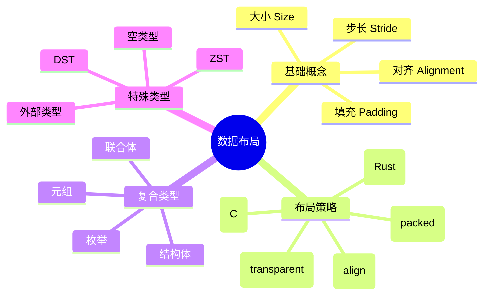
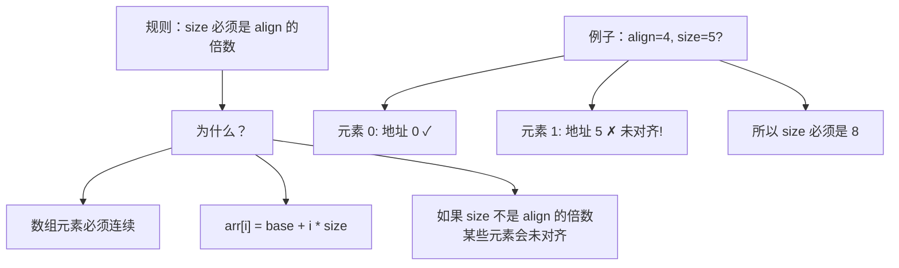
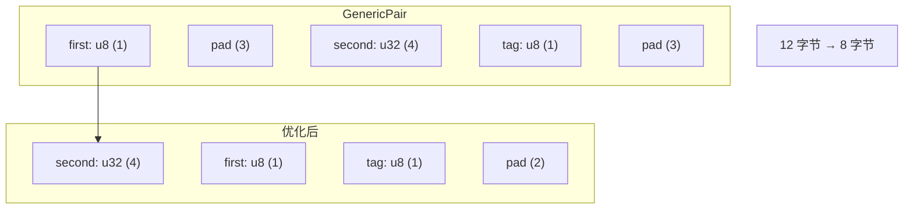
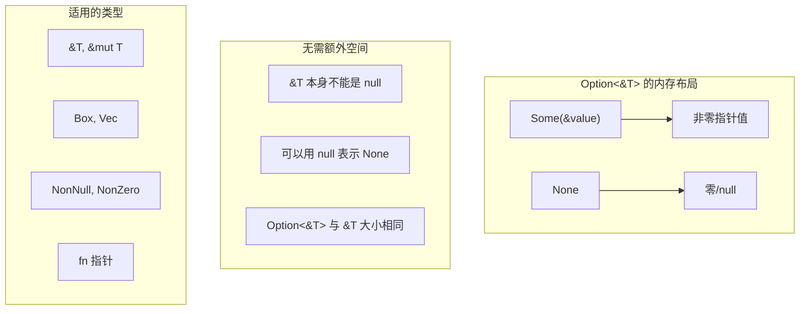
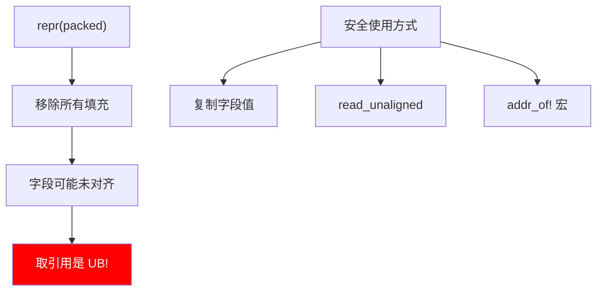
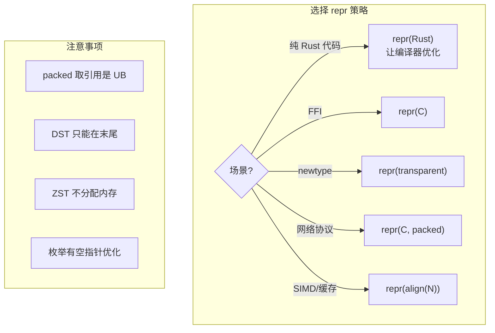

# 第二章：数据布局深度解析（扩展版）

## 概述

底层编程的核心是理解数据在内存中的表示。本章深入探讨 Rust 的数据布局，这对于 FFI、性能优化和 unsafe 代码至关重要。



## 2.1 对齐与大小的深入理解

### 为什么需要对齐？


### 对齐的硬件影响

```rust
use std::mem::{size_of, align_of};

fn alignment_demo() {
    // 基本类型对齐 = 大小
    println!("u8:  size={}, align={}", size_of::<u8>(),  align_of::<u8>());   // 1, 1
    println!("u16: size={}, align={}", size_of::<u16>(), align_of::<u16>()); // 2, 2
    println!("u32: size={}, align={}", size_of::<u32>(), align_of::<u32>()); // 4, 4
    println!("u64: size={}, align={}", size_of::<u64>(), align_of::<u64>()); // 8, 8

    // SIMD 类型需要更大对齐
    #[cfg(target_feature = "avx")]
    {
        use std::arch::x86_64::__m256;
        println!("__m256: size={}, align={}",
            size_of::<__m256>(), align_of::<__m256>());  // 32, 32
    }
}

// 检查地址对齐
fn is_aligned<T>(ptr: *const T) -> bool {
    (ptr as usize) % align_of::<T>() == 0
}

fn check_alignment() {
    let x: u32 = 42;
    let ptr = &x as *const u32;

    println!("Address: {:p}", ptr);
    println!("Aligned for u32: {}", is_aligned(ptr));

    // 故意创建未对齐指针
    let bytes: [u8; 8] = [0; 8];
    let unaligned_ptr = bytes.as_ptr().wrapping_add(1) as *const u32;
    println!("Unaligned: {}", is_aligned(unaligned_ptr));  // false
}
```

### 大小与对齐的关系



## 2.2 repr(Rust) 深度解析

### 编译器优化布局

```rust
// 原始定义
struct Suboptimal {
    a: u8,   // 1 字节
    b: u32,  // 4 字节
    c: u16,  // 2 字节
}
// 如果按声明顺序：1 + 3(pad) + 4 + 2 + 2(pad) = 12 字节

// 编译器可能重排为：
struct Optimized {
    b: u32,  // 4 字节
    c: u16,  // 2 字节
    a: u8,   // 1 字节
    // pad: 1 字节
}
// 优化后：4 + 2 + 1 + 1(pad) = 8 字节

fn layout_comparison() {
    use std::mem::size_of;

    // repr(Rust) - 编译器可以优化
    struct A { a: u8, b: u32, c: u16 }

    // repr(C) - 按声明顺序
    #[repr(C)]
    struct B { a: u8, b: u32, c: u16 }

    println!("A size: {}", size_of::<A>());  // 可能是 8
    println!("B size: {}", size_of::<B>());  // 一定是 12
}
```

### 泛型单态化的布局变化

```rust
struct GenericPair<T, U> {
    first: T,
    second: U,
    tag: u8,
}

fn generic_layout() {
    use std::mem::size_of;

    // 不同的单态化可能有不同的最优布局！
    println!("GenericPair<u8, u32>: {}",
        size_of::<GenericPair<u8, u32>>());     // 可能 8
    println!("GenericPair<u32, u8>: {}",
        size_of::<GenericPair<u32, u8>>());     // 可能 8
    println!("GenericPair<u64, u8>: {}",
        size_of::<GenericPair<u64, u8>>());     // 可能 16
}
```



### 枚举的判别式优化

```rust
// 基础枚举
enum BasicEnum {
    A,
    B,
    C,
}
// 大小：1 字节（判别式）

// 带数据的枚举
enum DataEnum {
    Int(i32),      // 判别式 + 4 字节
    Float(f64),    // 判别式 + 8 字节
    Nothing,       // 判别式
}
// 大小：16 字节（8 对齐 + 8 数据）

fn enum_size() {
    use std::mem::size_of;

    println!("BasicEnum: {}", size_of::<BasicEnum>());  // 1
    println!("DataEnum: {}", size_of::<DataEnum>());    // 16

    // 空指针优化
    println!("Option<&i32>: {}", size_of::<Option<&i32>>());      // 8
    println!("Option<Box<i32>>: {}", size_of::<Option<Box<i32>>>());  // 8
    println!("Option<NonNull<i32>>: {}",
        size_of::<Option<std::ptr::NonNull<i32>>>());  // 8

    // 多层 Option 也能优化！
    println!("Option<Option<&i32>>: {}",
        size_of::<Option<Option<&i32>>>());  // 8
}
```

### 空指针优化详解



## 2.3 repr(C) 完全指南

### C 兼容布局规则

```rust
#[repr(C)]
struct CStruct {
    a: u8,      // 偏移 0, 大小 1
    // padding: 3 字节
    b: u32,     // 偏移 4, 大小 4
    c: u16,     // 偏移 8, 大小 2
    // padding: 2 字节
}
// 总大小: 12, 对齐: 4

#[repr(C)]
struct Nested {
    x: u8,
    inner: CStruct,  // 需要 4 字节对齐
    y: u8,
}
// 布局: x(1) + pad(3) + inner(12) + y(1) + pad(3) = 20

fn print_offsets() {
    use std::mem::offset_of;

    println!("CStruct::a offset: {}", offset_of!(CStruct, a));  // 0
    println!("CStruct::b offset: {}", offset_of!(CStruct, b));  // 4
    println!("CStruct::c offset: {}", offset_of!(CStruct, c));  // 8

    println!("Nested::x offset: {}", offset_of!(Nested, x));        // 0
    println!("Nested::inner offset: {}", offset_of!(Nested, inner));// 4
    println!("Nested::y offset: {}", offset_of!(Nested, y));        // 16
}
```

### repr(C) 枚举

```rust
// 无字段枚举
#[repr(C)]
enum CEnum {
    A = 0,
    B = 1,
    C = 2,
}
// 大小：通常是 4（int）

// 指定判别式大小
#[repr(u8)]
enum SmallEnum {
    A = 0,
    B = 1,
    C = 255,
}
// 大小：1 字节

// 带字段的枚举（tagged union）
#[repr(C)]
enum TaggedUnion {
    Int(i32),
    Float(f32),
    Pair(i16, i16),
}
// 等价于 C 的：
// struct TaggedUnion {
//     int tag;
//     union {
//         int32_t int_val;
//         float float_val;
//         struct { int16_t a, b; } pair_val;
//     } data;
// };

fn c_enum_demo() {
    use std::mem::size_of;

    println!("CEnum: {}", size_of::<CEnum>());        // 4
    println!("SmallEnum: {}", size_of::<SmallEnum>()); // 1
    println!("TaggedUnion: {}", size_of::<TaggedUnion>()); // 8
}
```

### FFI 结构体实战

```rust
use std::os::raw::{c_int, c_char, c_void};

// 对应 C 的 struct sockaddr
#[repr(C)]
pub struct sockaddr {
    pub sa_family: u16,
    pub sa_data: [c_char; 14],
}

// 对应 C 的 struct timeval
#[repr(C)]
pub struct timeval {
    pub tv_sec: i64,
    pub tv_usec: i64,
}

// 带位域的结构体（需要手动处理）
#[repr(C)]
pub struct Flags {
    // C: unsigned int flag1 : 1;
    //    unsigned int flag2 : 1;
    //    unsigned int value : 30;
    // Rust 没有位域语法，需要手动打包
    packed: u32,
}

impl Flags {
    pub fn flag1(&self) -> bool {
        self.packed & 1 != 0
    }

    pub fn set_flag1(&mut self, value: bool) {
        if value {
            self.packed |= 1;
        } else {
            self.packed &= !1;
        }
    }

    pub fn flag2(&self) -> bool {
        self.packed & 2 != 0
    }

    pub fn value(&self) -> u32 {
        self.packed >> 2
    }
}
```

## 2.4 repr(transparent) 详解

### 用途与限制

```rust
// 基本用法
#[repr(transparent)]
struct Wrapper(i32);

// 可以有零大小的字段
#[repr(transparent)]
struct WrapperWithZst {
    value: i32,
    _marker: std::marker::PhantomData<()>,
}

// 单变体枚举也可以
#[repr(transparent)]
enum SingleVariant {
    Value(f64),
}

fn transparent_demo() {
    use std::mem::{size_of, align_of};

    assert_eq!(size_of::<Wrapper>(), size_of::<i32>());
    assert_eq!(align_of::<Wrapper>(), align_of::<i32>());

    // 可以安全地 transmute
    let w = Wrapper(42);
    let i: i32 = unsafe { std::mem::transmute(w) };
    assert_eq!(i, 42);
}
```

### 实际应用场景

```rust
// 场景 1：newtype 模式 + FFI
#[repr(transparent)]
pub struct FileDescriptor(c_int);

// FileDescriptor 可以直接传给期望 c_int 的 C 函数

// 场景 2：添加类型安全而不改变布局
#[repr(transparent)]
pub struct UserId(u64);

#[repr(transparent)]
pub struct ProductId(u64);

// UserId 和 ProductId 不能混用，但 ABI 相同

// 场景 3：包装外部类型
#[repr(transparent)]
pub struct MyString(String);

impl MyString {
    pub fn as_str(&self) -> &str {
        &self.0
    }
}
```

## 2.5 repr(packed) 危险指南

### 压缩布局的风险

```rust
#[repr(packed)]
struct Packed {
    a: u8,
    b: u32,  // 偏移 1，未对齐！
    c: u16,  // 偏移 5，未对齐！
}
// 总大小：7 字节（无填充）

fn packed_danger() {
    let p = Packed { a: 1, b: 2, c: 3 };

    // 危险！创建未对齐字段的引用
    // let b_ref = &p.b;  // 这是 UB！

    // 安全：通过复制访问
    let b_copy = p.b;  // OK：复制值
    let b_ref = &b_copy;  // OK：引用复制

    // 安全：使用 read_unaligned
    let b_value = unsafe {
        std::ptr::read_unaligned(&p.b as *const u32)
    };

    // 使用 addr_of! 宏
    let b_ptr = std::ptr::addr_of!(p.b);
    let b_read = unsafe { b_ptr.read_unaligned() };
}
```

### 网络协议结构

```rust
// 以太网帧头
#[repr(C, packed)]
struct EthernetHeader {
    dst_mac: [u8; 6],
    src_mac: [u8; 6],
    ether_type: u16,  // 注意：网络字节序
}

// IP 头（简化）
#[repr(C, packed)]
struct IpHeader {
    version_ihl: u8,
    tos: u8,
    total_length: u16,
    identification: u16,
    flags_fragment: u16,
    ttl: u8,
    protocol: u8,
    checksum: u16,
    src_ip: [u8; 4],
    dst_ip: [u8; 4],
}

impl IpHeader {
    fn total_length(&self) -> u16 {
        // 网络字节序是大端
        u16::from_be(unsafe {
            std::ptr::read_unaligned(&self.total_length)
        })
    }
}
```



## 2.6 repr(align) 应用

### 缓存行对齐

```rust
// 典型缓存行大小是 64 字节
#[repr(align(64))]
struct CacheLineAligned {
    data: u64,
    // 自动填充到 64 字节
}

// 避免伪共享
struct NoFalseSharing {
    // 每个计数器在自己的缓存行
    counter1: CacheLineAligned,
    counter2: CacheLineAligned,
}

fn cache_demo() {
    use std::mem::{size_of, align_of};

    println!("CacheLineAligned size: {}", size_of::<CacheLineAligned>());  // 64
    println!("CacheLineAligned align: {}", align_of::<CacheLineAligned>()); // 64
}
```

### SIMD 对齐

```rust
// AVX 需要 32 字节对齐
#[repr(align(32))]
struct AlignedF32x8 {
    data: [f32; 8],
}

// AVX-512 需要 64 字节对齐
#[repr(align(64))]
struct AlignedF32x16 {
    data: [f32; 16],
}

fn simd_demo() {
    let aligned = AlignedF32x8 { data: [0.0; 8] };

    // 检查对齐
    let ptr = &aligned as *const AlignedF32x8;
    assert!(ptr as usize % 32 == 0);

    // 现在可以安全使用 AVX 内部函数
    #[cfg(target_feature = "avx")]
    unsafe {
        use std::arch::x86_64::*;
        let vec = _mm256_load_ps(aligned.data.as_ptr());
        // ...
    }
}
```

## 2.7 动态大小类型 (DST)

### 切片类型

```rust
fn slice_layout() {
    let arr = [1, 2, 3, 4, 5];
    let slice: &[i32] = &arr;

    // 切片是胖指针
    use std::mem::size_of_val;

    // 指针本身的大小
    println!("&[i32] pointer size: {}", size_of::<&[i32]>());  // 16

    // 引用的数据大小
    println!("slice data size: {}", size_of_val(slice));  // 20

    // 胖指针结构
    let ptr = slice.as_ptr();
    let len = slice.len();
    println!("ptr: {:p}, len: {}", ptr, len);
}
```

### trait 对象

```rust
trait Animal {
    fn speak(&self);
}

struct Dog;
impl Animal for Dog {
    fn speak(&self) { println!("Woof!"); }
}

fn trait_object_layout() {
    let dog = Dog;
    let animal: &dyn Animal = &dog;

    // trait 对象也是胖指针
    use std::mem::size_of;
    println!("&dyn Animal size: {}", size_of::<&dyn Animal>());  // 16

    // 胖指针结构：数据指针 + vtable 指针
    let raw: (*const (), *const ()) = unsafe {
        std::mem::transmute(animal)
    };
    println!("data ptr: {:p}", raw.0);
    println!("vtable ptr: {:p}", raw.1);
}
```

### 自定义 DST

```rust
// 包含切片的结构体
struct MySlice {
    prefix: u32,
    data: [u8],  // DST 必须是最后一个字段
}

fn custom_dst() {
    // 不能直接在栈上创建
    // let s = MySlice { prefix: 0, data: [1, 2, 3] };  // 错误

    // 需要通过引用来使用
    // 使用 unsizing coercion
    struct MySized {
        prefix: u32,
        data: [u8; 4],
    }

    let sized = MySized { prefix: 42, data: [1, 2, 3, 4] };
    let dst: &MySlice = unsafe {
        &*(&sized as *const MySized as *const MySlice)
    };

    println!("prefix: {}, data len: {}", dst.prefix, dst.data.len());
}
```

## 2.8 零大小类型 (ZST)

### ZST 的高级应用

```rust
use std::marker::PhantomData;

// 类型状态模式
struct Locked;
struct Unlocked;

struct Door<State> {
    _state: PhantomData<State>,
}

impl Door<Unlocked> {
    fn new() -> Self {
        Door { _state: PhantomData }
    }

    fn lock(self) -> Door<Locked> {
        println!("Locking door");
        Door { _state: PhantomData }
    }
}

impl Door<Locked> {
    fn unlock(self) -> Door<Unlocked> {
        println!("Unlocking door");
        Door { _state: PhantomData }
    }
}

// 只有解锁的门才能打开
impl Door<Unlocked> {
    fn open(&self) {
        println!("Opening door");
    }
}

fn typestate_demo() {
    let door = Door::<Unlocked>::new();
    door.open();  // OK

    let locked_door = door.lock();
    // locked_door.open();  // 编译错误！

    let unlocked = locked_door.unlock();
    unlocked.open();  // OK again
}
```

### ZST 与分配器

```rust
use std::alloc::{alloc, dealloc, Layout};

fn zst_allocation() {
    // ZST 的分配特殊处理
    let layout = Layout::new::<()>();

    assert_eq!(layout.size(), 0);
    assert_eq!(layout.align(), 1);

    // 全局分配器通常要求非零大小
    // Layout::array::<T>(n) 对 ZST 返回 0 大小

    // Vec<()> 不实际分配内存
    let mut v: Vec<()> = Vec::with_capacity(1000);
    v.push(());
    v.push(());
    // 内部指针是悬垂指针，但永远不解引用
}
```

## 2.9 布局检查工具

### 使用 offset_of!

```rust
use std::mem::offset_of;

#[repr(C)]
struct Example {
    a: u8,
    b: u32,
    c: u16,
}

fn check_offsets() {
    assert_eq!(offset_of!(Example, a), 0);
    assert_eq!(offset_of!(Example, b), 4);
    assert_eq!(offset_of!(Example, c), 8);
}
```

### 编写布局测试

```rust
#[cfg(test)]
mod tests {
    use super::*;
    use std::mem::{size_of, align_of, offset_of};

    #[test]
    fn test_layout() {
        // 确保布局与 C 兼容
        assert_eq!(size_of::<CStruct>(), 12);
        assert_eq!(align_of::<CStruct>(), 4);

        // 确保字段偏移正确
        assert_eq!(offset_of!(CStruct, a), 0);
        assert_eq!(offset_of!(CStruct, b), 4);
        assert_eq!(offset_of!(CStruct, c), 8);
    }

    #[test]
    fn test_c_compatibility() {
        // 与 C 代码中的值比较
        extern "C" {
            fn get_c_struct_size() -> usize;
            fn get_c_field_offset() -> usize;
        }

        unsafe {
            assert_eq!(size_of::<CStruct>(), get_c_struct_size());
        }
    }
}
```

## 2.10 总结



**核心要点：**

1. **对齐是为了性能和正确性**：未对齐访问可能导致性能下降或崩溃
2. **repr(Rust) 允许编译器优化**：不要依赖具体布局
3. **repr(C) 保证 ABI 兼容**：FFI 必备
4. **repr(packed) 要小心使用**：取未对齐字段的引用是 UB
5. **理解 DST 和 ZST**：它们是 Rust 类型系统的强大特性

---

下一章：[所有权系统](./03-ownership.md)
