# 第三章：所有权系统深度解析（扩展版）

## 概述

所有权是 Rust 的突破性特性。它使 Rust 在没有垃圾回收的情况下实现完全的内存安全和高效性。本章深入探讨所有权系统的底层机制，包括借用检查器如何工作、生命周期推断的细节，以及各种高级用法。

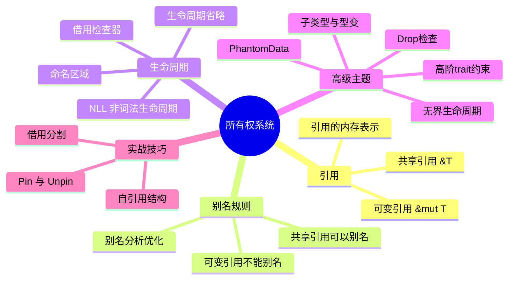

## 3.1 引用的深入理解

### 两种引用类型

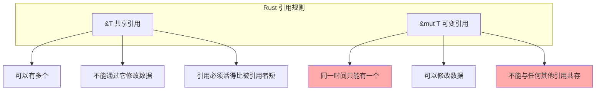

### 引用的内存表示

```rust
use std::mem::size_of;

fn reference_memory_layout() {
    // 普通引用是一个指针（瘦指针）
    println!("&i32 size: {}", size_of::<&i32>());       // 8 字节（64位系统）
    println!("&mut i32 size: {}", size_of::<&mut i32>());  // 8 字节

    // 切片引用是胖指针（指针 + 长度）
    println!("&[i32] size: {}", size_of::<&[i32]>());   // 16 字节
    println!("&str size: {}", size_of::<&str>());       // 16 字节

    // trait 对象也是胖指针（数据指针 + vtable 指针）
    println!("&dyn Display size: {}",
        size_of::<&dyn std::fmt::Display>());           // 16 字节
}

// 引用的本质
fn reference_essence() {
    let x = 42;
    let r: &i32 = &x;

    // r 在内存中就是 x 的地址
    let ptr = r as *const i32;
    println!("Address: {:p}", ptr);

    // 引用保证：
    // 1. 非空
    // 2. 正确对齐
    // 3. 指向有效数据
    // 4. 满足借用规则
}
```

### 引用的生命周期本质

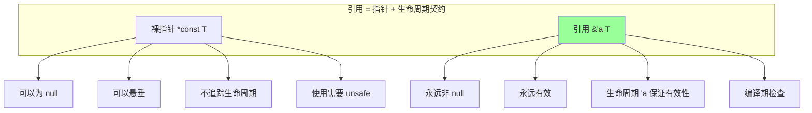

### 引用与借用的区别

```rust
fn borrow_vs_reference() {
    let mut data = vec![1, 2, 3];

    // 借用：概念上的"临时使用权"
    // 引用：借用的具体语法实现

    // 创建一个共享借用
    let r1: &Vec<i32> = &data;  // r1 借用 data
    let r2: &Vec<i32> = &data;  // r2 也借用 data（共享）

    println!("{:?} {:?}", r1, r2);
    // r1 和 r2 的借用在这里结束（NLL）

    // 现在可以创建可变借用
    let r3: &mut Vec<i32> = &mut data;  // r3 独占借用 data
    r3.push(4);
    // r3 的借用在这里结束

    // 再次可以使用 data
    println!("{:?}", data);
}

// 引用作为函数参数
fn process(data: &[i32]) -> i32 {
    // 函数"借用"了 data，在函数返回后归还
    data.iter().sum()
}

fn main() {
    let nums = vec![1, 2, 3];
    let sum = process(&nums);  // 借出 nums
    println!("Sum: {}, Original: {:?}", sum, nums);  // nums 仍可用
}
```

## 3.2 别名分析的深入理解

### 为什么别名很重要？

```rust
fn compute(input: &u32, output: &mut u32) {
    if *input > 10 {
        *output = 1;
    }
    if *input > 5 {
        *output *= 2;
    }
}

// 当 input 和 output 不别名时，编译器可以优化为：
fn compute_optimized(input: &u32, output: &mut u32) {
    let input_val = *input;  // 只读一次
    if input_val > 10 {
        *output = 2;  // 直接设置最终值
    } else if input_val > 5 {
        *output *= 2;
    }
}
```

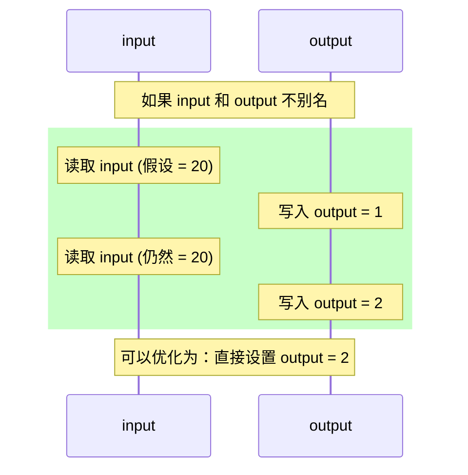

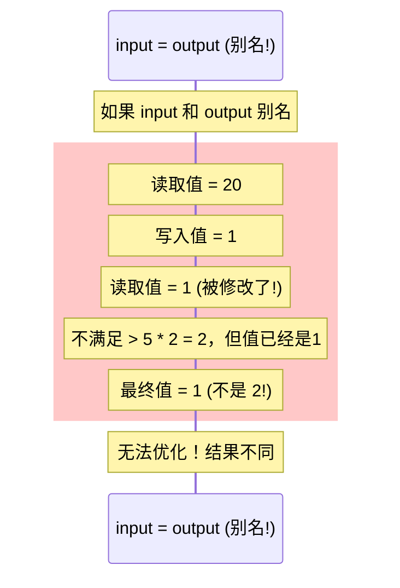

### 别名分析允许的优化

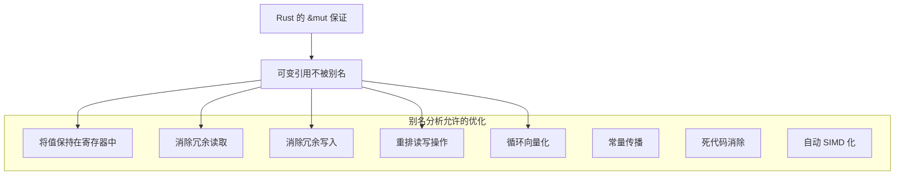

### LLVM 的 noalias 属性

```rust
// Rust 的 &mut 会被编译为带 noalias 属性的指针
// 这告诉 LLVM：这个指针指向的内存不会被其他指针访问

// 等效的 C 代码需要使用 restrict 关键字：
// void compute(const int* restrict input, int* restrict output)

fn vector_sum(data: &mut [f64]) -> f64 {
    // 由于 noalias 保证，LLVM 可以安全地向量化这个循环
    let mut sum = 0.0;
    for x in data.iter() {
        sum += *x;
    }
    sum
}

// 对比：如果没有别名保证
fn vector_sum_c_style(data: *mut f64, len: usize) -> f64 {
    // 编译器不确定 data 是否会在循环中被修改
    // 优化受限
    let mut sum = 0.0;
    for i in 0..len {
        unsafe { sum += *data.add(i); }
    }
    sum
}
```

### 内部可变性与别名

```rust
use std::cell::{Cell, RefCell};

fn interior_mutability() {
    // Cell 允许通过共享引用修改值
    let cell = Cell::new(42);

    let r1 = &cell;
    let r2 = &cell;

    // 虽然有多个共享引用，但仍能修改！
    r1.set(100);
    println!("{}", r2.get());  // 100

    // 这是安全的，因为 Cell 只能包含 Copy 类型
    // 修改是原子的（对于单线程）
}

fn refcell_interior_mutability() {
    let data = RefCell::new(vec![1, 2, 3]);

    // 运行时借用检查
    let r1 = data.borrow();      // 获取共享借用
    let r2 = data.borrow();      // 可以有多个共享借用

    println!("{:?} {:?}", r1, r2);

    drop(r1);
    drop(r2);

    // 现在可以获取可变借用
    let mut r3 = data.borrow_mut();
    r3.push(4);

    // 如果尝试同时借用，会 panic
    // let r4 = data.borrow();  // panic: already mutably borrowed
}
```

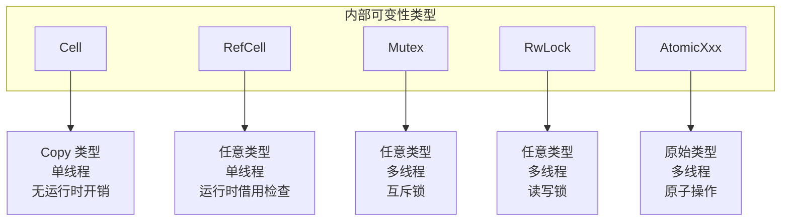

## 3.3 生命周期深度解析

### 生命周期是什么？

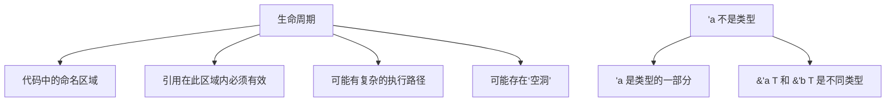

### 非词法生命周期 (NLL)

```rust
// Rust 2018 之前：词法生命周期
fn old_lifetimes() {
    let mut data = vec![1, 2, 3];

    let r = &data[0];  // 借用开始
    println!("{}", r);

    // 旧版：r 的生命周期延续到作用域结束
    // data.push(4);  // 错误！r 仍然存在
}  // r 的生命周期在这里结束

// Rust 2018+：非词法生命周期
fn new_lifetimes() {
    let mut data = vec![1, 2, 3];

    let r = &data[0];  // 借用开始
    println!("{}", r);
    // r 的借用在最后一次使用后立即结束

    data.push(4);  // OK！r 不再被使用
    println!("{:?}", data);
}
```

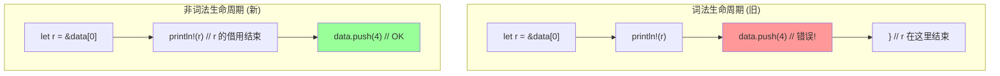

### 生命周期省略规则详解

```rust
// 规则 1: 每个引用参数获得独立的生命周期
fn rule1(x: &i32, y: &i32) { }
// 展开为:
fn rule1_expanded<'a, 'b>(x: &'a i32, y: &'b i32) { }

// 规则 2: 只有一个输入生命周期时，输出使用它
fn rule2(x: &i32) -> &i32 { x }
// 展开为:
fn rule2_expanded<'a>(x: &'a i32) -> &'a i32 { x }

// 规则 3: 方法中 &self 的生命周期用于输出
impl MyStruct {
    fn rule3(&self, x: &str) -> &str { &self.data }
    // 展开为:
    // fn rule3<'a, 'b>(&'a self, x: &'b str) -> &'a str
}

// 无法省略的情况
fn cannot_elide<'a, 'b>(x: &'a str, y: &'b str) -> &'a str {
    // 编译器无法推断返回哪个生命周期
    x
}
```

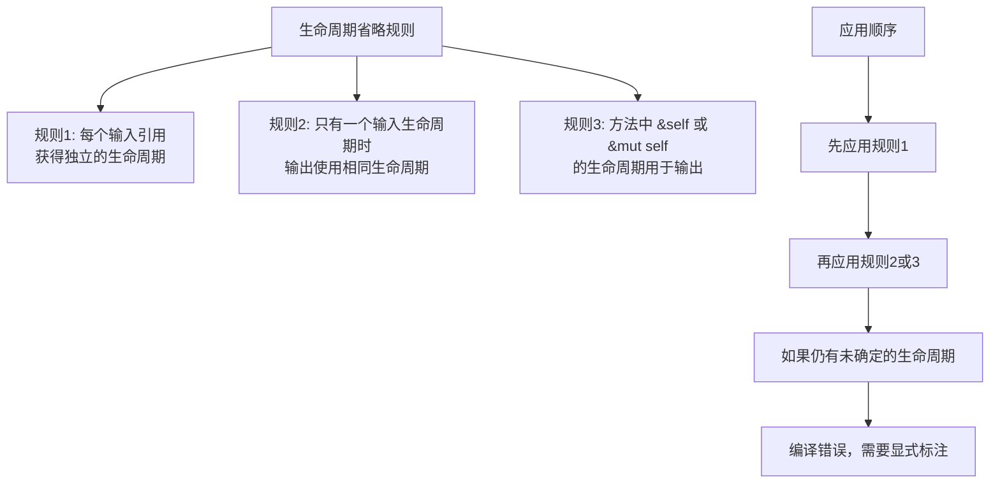

### 复杂的生命周期场景

```rust
// 场景 1: 条件返回
fn longest<'a>(x: &'a str, y: &'a str) -> &'a str {
    if x.len() > y.len() { x } else { y }
}

// 场景 2: 结构体中的生命周期
struct ImportantExcerpt<'a> {
    part: &'a str,
}

impl<'a> ImportantExcerpt<'a> {
    // 返回的生命周期与 self 相同
    fn level(&self) -> i32 { 3 }

    // 明确使用 'a
    fn announce_and_return_part(&self, announcement: &str) -> &'a str {
        println!("Attention: {}", announcement);
        self.part
    }
}

// 场景 3: 静态生命周期
fn static_lifetime() {
    let s: &'static str = "I have a static lifetime.";
    // 字符串字面量存储在程序的二进制文件中
    // 在整个程序运行期间都有效
}

// 场景 4: 泛型 + 生命周期 + trait 约束
fn longest_with_announcement<'a, T>(
    x: &'a str,
    y: &'a str,
    ann: T,
) -> &'a str
where
    T: std::fmt::Display,
{
    println!("Announcement! {}", ann);
    if x.len() > y.len() { x } else { y }
}
```

### 生命周期的空洞

```rust
fn lifetime_holes() {
    let mut data = vec![1, 2, 3];

    let r = &data;           // 'a 开始
    println!("{:?}", r);     // 'a 的最后使用
                             // 'a 在这里有一个"空洞"

    let r2 = &mut data;      // 'b 开始
    r2.push(4);              // 'b 中

    let r3 = &data;          // 'a 可以在这里"复活"? 不，是新的 'c
    println!("{:?}", r3);
}
```

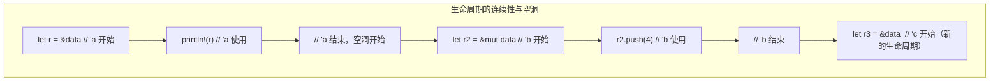

## 3.4 子类型与型变深度解析

### 生命周期的子类型关系

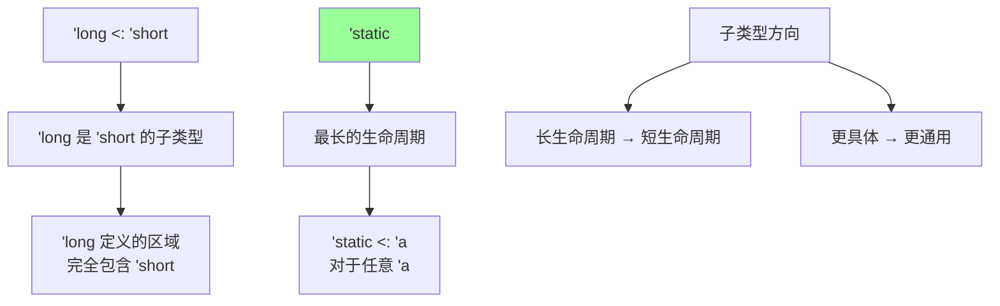

```rust
fn subtype_demo<'long: 'short, 'short>(
    long_ref: &'long str,
    short_ref: &'short str,
) {
    // 'long 是 'short 的子类型
    // 可以在需要 'short 的地方使用 'long

    let _: &'short str = long_ref;  // OK: 'long <: 'short
    // let _: &'long str = short_ref;  // 错误！
}

fn main() {
    let hello: &'static str = "hello";
    {
        let world = String::from("world");
        let world_ref = &world;  // 'world 生命周期

        // 'static <: 'world，所以可以传递
        subtype_demo(hello, world_ref);
    }
}
```

### 型变完全解析

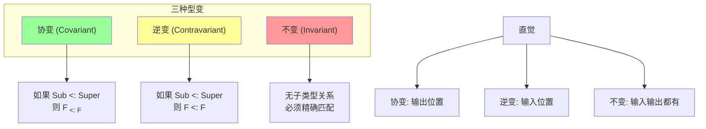

### 完整的型变表

| 类型 | 'a | T | U |
|------|:--:|:-:|:-:|
| `&'a T` | 协变 | 协变 | |
| `&'a mut T` | 协变 | **不变** | |
| `Box<T>` | | 协变 | |
| `Vec<T>` | | 协变 | |
| `UnsafeCell<T>` | | **不变** | |
| `Cell<T>` | | **不变** | |
| `RefCell<T>` | | **不变** | |
| `Mutex<T>` | | **不变** | |
| `fn(T) -> U` | | **逆变** | 协变 |
| `*const T` | | 协变 | |
| `*mut T` | | **不变** | |
| `PhantomData<T>` | | 协变 | |
| `PhantomData<fn(T)>` | | **逆变** | |

### 为什么 &mut T 是不变的？

```rust
fn assign<T>(input: &mut T, val: T) {
    *input = val;
}

fn main() {
    let mut hello: &'static str = "hello";
    {
        let world = String::from("world");
        // 如果 &mut T 对 T 协变，这将被允许：
        // assign(&mut hello, &world);
        //
        // 因为 &'static str 的子类型是更短的生命周期
        // 这意味着我们可以把 &'world str 赋值给 &'static str
    }
    // world 被销毁
    // println!("{hello}");  // 悬垂指针！use after free!
}
```

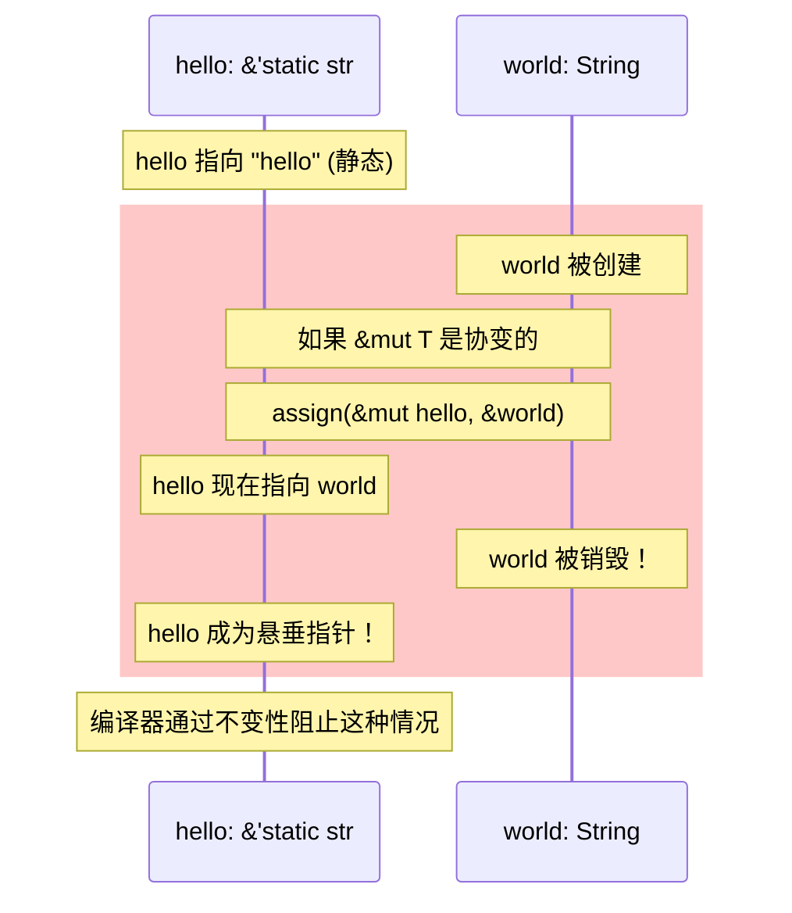

### 函数指针的逆变

```rust
// 函数的参数位置是逆变的
fn demo_contravariance() {
    // fn(&'static str) 可以在需要 fn(&'a str) 的地方使用
    // 因为能处理任意字符串的函数，肯定能处理静态字符串

    fn process_any(f: fn(&str)) {
        let s = String::from("hello");
        f(&s);
    }

    fn print_static(s: &'static str) {
        println!("{}", s);
    }

    fn print_any(s: &str) {
        println!("{}", s);
    }

    // process_any(print_static);  // 错误！需要能接受任意生命周期
    process_any(print_any);        // OK
}
```

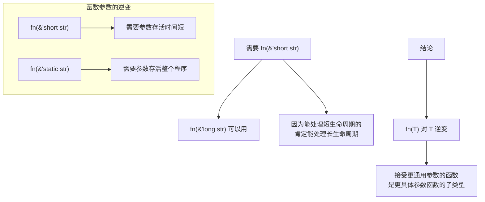

### 自定义类型的型变

```rust
use std::marker::PhantomData;

// 对 T 协变
struct Covariant<T> {
    data: Box<T>,  // Box<T> 是协变的
}

// 对 T 不变
struct Invariant<T> {
    data: *mut T,  // *mut T 是不变的
}

// 使用 PhantomData 控制型变
struct CustomVariance<'a, T> {
    ptr: *const T,
    // PhantomData<&'a T> 让我们对 'a 和 T 都协变
    _marker: PhantomData<&'a T>,
}

// 如果想要不变
struct CustomInvariant<T> {
    ptr: *const T,
    // PhantomData<fn(T) -> T> 让 T 在输入和输出位置都出现
    // 导致不变
    _marker: PhantomData<fn(T) -> T>,
}

// 如果想要逆变
struct CustomContravariant<T> {
    _marker: PhantomData<fn(T)>,
}
```

## 3.5 Drop 检查深度解析

### 析构函数与生命周期

```rust
#[derive(Debug)]
struct Inspector<'a>(&'a u8);

impl<'a> Drop for Inspector<'a> {
    fn drop(&mut self) {
        println!("Inspector({}) goes away", self.0);
    }
}

fn main() {
    let (inspector, days);
    days = Box::new(1u8);
    inspector = Inspector(&days);
    // 问题：inspector 的 drop 会访问 days 吗？
}
```

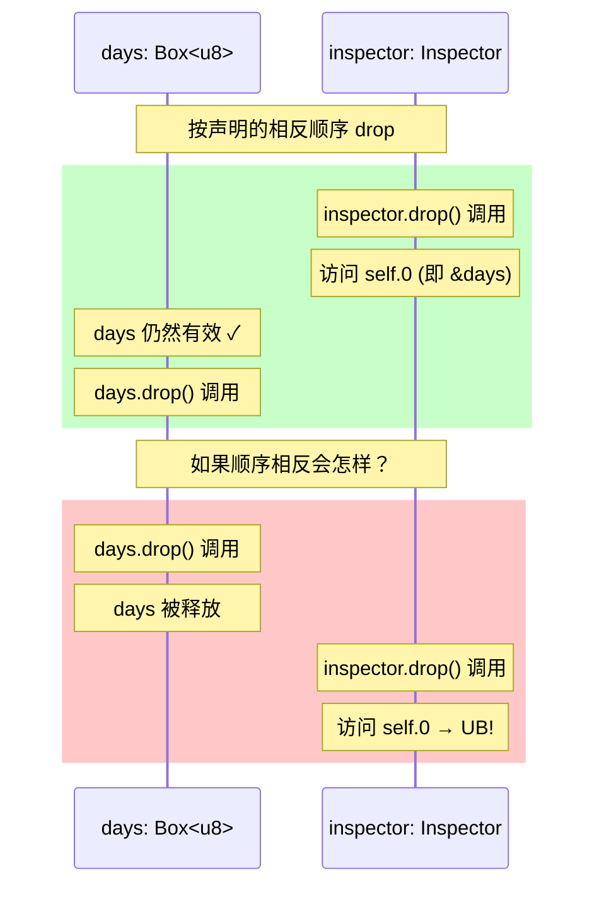

### Drop 检查的保守性

```rust
// 编译器假设泛型类型的 drop 可能访问所有泛型参数
struct Boks<T> {
    data: *mut T,
}

impl<T> Drop for Boks<T> {
    fn drop(&mut self) {
        // 编译器不知道我们是否真的访问 T
        // 所以保守地假设会访问
        unsafe {
            std::ptr::drop_in_place(self.data);
        }
    }
}

// 这个例子可能编译失败
fn drop_check_issue() {
    let (boks, data);
    data = Box::new(42);
    boks = Boks { data: Box::into_raw(data) };
    // boks 的 drop 可能访问 data
    // 但 data 先被 drop 了！
}
```

### #[may_dangle] 属性

```rust
#![feature(dropck_eyepatch)]

use std::marker::PhantomData;
use std::ptr::NonNull;

struct MyBox<T> {
    ptr: NonNull<T>,
    _marker: PhantomData<T>,
}

// 使用 may_dangle 告诉编译器：虽然 T 是泛型参数
// 但我们的 drop 不会访问 T 的内容
unsafe impl<#[may_dangle] T> Drop for MyBox<T> {
    fn drop(&mut self) {
        unsafe {
            // 我们只释放内存，不访问 T 的内容
            std::alloc::dealloc(
                self.ptr.as_ptr() as *mut u8,
                std::alloc::Layout::new::<T>(),
            );
        }
    }
}
```

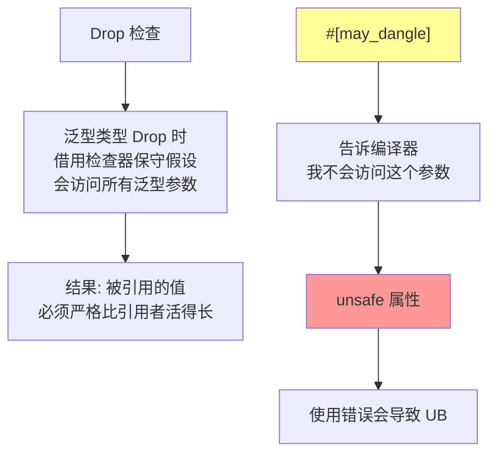

## 3.6 PhantomData 完全指南

### 用途总览

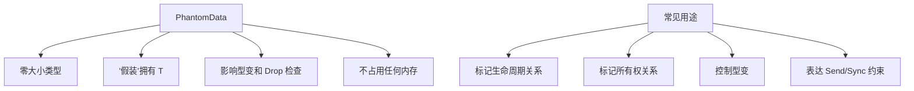

### 各种 PhantomData 用法

```rust
use std::marker::PhantomData;

// 用法 1: 标记生命周期
struct Iter<'a, T: 'a> {
    ptr: *const T,
    end: *const T,
    // 表示我们借用了 T，生命周期为 'a
    _marker: PhantomData<&'a T>,
}

// 用法 2: 表达所有权
struct MyBox<T> {
    ptr: *mut T,
    // 表示我们拥有 T（会 drop T）
    _marker: PhantomData<T>,
}

// 用法 3: 不拥有但需要不变
struct Invariant<T> {
    data: *mut T,
    // *mut T 已经是不变的，但如果我们想明确表达
    _marker: PhantomData<fn(T) -> T>,
}

// 用法 4: 标记线程安全性
struct NotSend<T> {
    data: T,
    // Rc 不是 Send，这会让整个类型不是 Send
    _marker: PhantomData<std::rc::Rc<()>>,
}

// 用法 5: 空类型参数（类型状态模式）
struct Locked;
struct Unlocked;

struct Door<State> {
    _state: PhantomData<State>,
}

impl Door<Unlocked> {
    fn lock(self) -> Door<Locked> {
        Door { _state: PhantomData }
    }
}

impl Door<Locked> {
    fn unlock(self) -> Door<Unlocked> {
        Door { _state: PhantomData }
    }
}
```

### PhantomData 型变总结

| PhantomData 类型 | 对 'a 的型变 | 对 T 的型变 | Drop 行为 |
|-----------------|:------------:|:-----------:|:---------:|
| `PhantomData<T>` | - | 协变 | 假装拥有 T |
| `PhantomData<&'a T>` | 协变 | 协变 | 假装借用 T |
| `PhantomData<&'a mut T>` | 协变 | 不变 | 假装可变借用 T |
| `PhantomData<*const T>` | - | 协变 | - |
| `PhantomData<*mut T>` | - | 不变 | - |
| `PhantomData<fn(T)>` | - | 逆变 | - |
| `PhantomData<fn() -> T>` | - | 协变 | - |
| `PhantomData<fn(T) -> T>` | - | 不变 | - |

## 3.7 借用分割实战

### 基本概念

```rust
let mut data = [1, 2, 3, 4];

// 这不行！借用检查器认为整个数组被可变借用
// let a = &mut data[0];
// let b = &mut data[1];  // 错误！

// 但这逻辑上是安全的，因为 data[0] 和 data[1] 不重叠
```

### split_at_mut 解决方案

```rust
fn split_at_mut_demo() {
    let mut data = [1, 2, 3, 4];

    let (left, right) = data.split_at_mut(2);
    // left = [1, 2], right = [3, 4]

    left[0] = 10;   // OK
    right[0] = 30;  // OK，不冲突

    println!("{:?}", data);  // [10, 2, 30, 4]
}
```

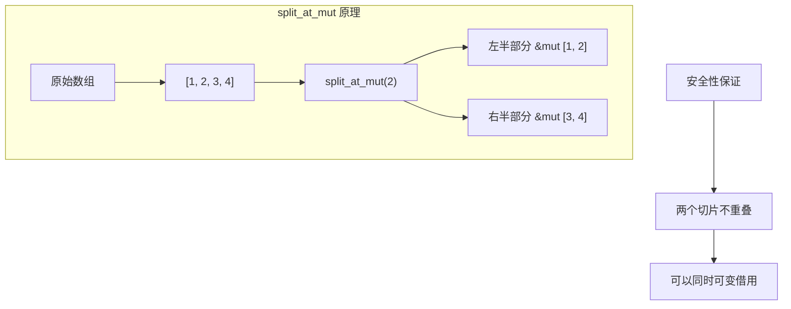

### 实现 split_at_mut

```rust
fn split_at_mut<T>(slice: &mut [T], mid: usize) -> (&mut [T], &mut [T]) {
    let len = slice.len();
    let ptr = slice.as_mut_ptr();

    assert!(mid <= len);

    // 为什么这是安全的？
    // 1. 我们拥有整个切片的可变访问权
    // 2. mid <= len 保证两个范围都在边界内
    // 3. 两个切片 [0..mid) 和 [mid..len) 不重叠
    unsafe {
        (
            std::slice::from_raw_parts_mut(ptr, mid),
            std::slice::from_raw_parts_mut(ptr.add(mid), len - mid),
        )
    }
}
```

### 更复杂的借用分割

```rust
use std::collections::HashMap;

// 问题：同时修改 HashMap 的两个不同条目
fn modify_two_entries() {
    let mut map = HashMap::new();
    map.insert("a", 1);
    map.insert("b", 2);

    // 这不行：
    // let a = map.get_mut("a").unwrap();
    // let b = map.get_mut("b").unwrap();  // 错误！
    // *a += *b;

    // 解决方案 1: 分开借用
    let a_val = *map.get("a").unwrap();
    *map.get_mut("b").unwrap() += a_val;

    // 解决方案 2: entry API
    map.entry("c").or_insert(0);

    // 解决方案 3: unsafe（谨慎使用）
    // 如果你确定键不同
}

// 结构体字段分割借用
struct Data {
    field1: Vec<i32>,
    field2: Vec<i32>,
}

fn struct_split_borrow(data: &mut Data) {
    // 这是允许的！不同字段可以同时可变借用
    let f1 = &mut data.field1;
    let f2 = &mut data.field2;

    f1.push(1);
    f2.push(2);
}
```

## 3.8 高阶 Trait 约束 (HRTB)

### 问题场景

```rust
struct Closure<F> {
    data: (u8, u16),
    func: F,
}

// 问题：F 需要是什么类型？
// F 必须能接受任意生命周期的引用
impl<F> Closure<F>
where
    // 普通写法不够：这要求特定的生命周期
    // F: Fn(&(u8, u16)) -> &u8,

    // HRTB：对任意生命周期都成立
    for<'a> F: Fn(&'a (u8, u16)) -> &'a u8,
{
    fn call(&self) -> &u8 {
        (self.func)(&self.data)
    }
}
```

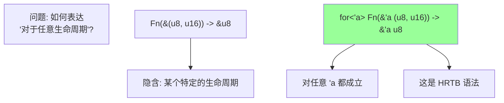

### HRTB 实际应用

```rust
// 例子 1: 闭包参数
fn apply<F>(f: F, x: &i32)
where
    for<'a> F: Fn(&'a i32) -> &'a i32,
{
    let result = f(x);
    println!("{}", result);
}

// 例子 2: 生命周期无关的比较
fn compare<T>(a: &T, b: &T) -> bool
where
    for<'a> &'a T: PartialEq,
{
    a == b
}

// 例子 3: 复杂的 trait 约束
trait MyTrait<'a> {
    fn process(&'a self) -> &'a str;
}

fn process_all<T>(items: &[T])
where
    for<'a> T: MyTrait<'a>,
{
    for item in items {
        println!("{}", item.process());
    }
}

// 例子 4: 函数指针
fn accepts_any_lifetime<'a>(s: &'a str) -> &'a str {
    s
}

fn use_function_pointer() {
    // 函数指针自动满足 HRTB
    let f: for<'a> fn(&'a str) -> &'a str = accepts_any_lifetime;

    let s = String::from("hello");
    println!("{}", f(&s));
}
```

### HRTB 与闭包

```rust
fn closure_hrtb() {
    // 闭包通常自动满足 HRTB
    let closure = |x: &(u8, u16)| -> &u8 { &x.0 };

    // 这个闭包可以处理任意生命周期的输入
    let data1 = (1u8, 2u16);
    let data2 = (3u8, 4u16);

    let r1 = closure(&data1);
    let r2 = closure(&data2);

    println!("{} {}", r1, r2);
}

// 但有时候闭包不满足 HRTB
fn closure_not_hrtb() {
    let static_ref: &'static str = "hello";

    // 这个闭包捕获了 static_ref
    // 它不满足 for<'a> Fn(&'a str) -> &'a str
    // 因为它返回的是 'static 生命周期
    let closure = |_: &str| -> &str { static_ref };
}
```

## 3.9 无界生命周期

### 危险来源

```mermaid
graph TB
    A[无界生命周期] --> B[从裸指针创建引用]
    A --> C[编译器无法推断生命周期]
    A --> D[被视为任意长的生命周期]

    E[危险] --> F[可能比 'static 还长]
    E --> G[实际可能很快失效]
    E --> H[这是 unsafe 代码常见的 UB 来源]

    style E fill:#f00,color:#fff
```

### 无界生命周期示例

```rust
// 危险！创建无界生命周期
unsafe fn create_unbounded<'a>() -> &'a i32 {
    let x = 42;
    let ptr = &x as *const i32;

    // 'a 是什么？调用者决定！
    // 可以是 'static，但 x 马上就被销毁了
    &*ptr
}

// 更隐蔽的例子
unsafe fn get_from_raw<'a>(ptr: *const i32) -> &'a i32 {
    &*ptr  // 'a 是无界的
}

fn misuse() {
    let r: &'static i32 = unsafe {
        let x = 42;
        get_from_raw(&x)  // 'a 被推断为 'static！
    };
    // x 已经被销毁
    // println!("{}", r);  // 悬垂引用！
}
```

### 正确处理无界生命周期

```rust
use std::marker::PhantomData;

// 方法 1: 使用 PhantomData 绑定生命周期
struct Wrapper<'a, T> {
    ptr: *const T,
    _marker: PhantomData<&'a T>,
}

impl<'a, T> Wrapper<'a, T> {
    // 生命周期被正确约束
    fn get(&self) -> &'a T {
        unsafe { &*self.ptr }
    }
}

// 方法 2: 通过参数绑定生命周期
unsafe fn get_ref<'a, T>(ptr: *const T, _bound: &'a T) -> &'a T {
    &*ptr
}

// 方法 3: 使用更短的生命周期
unsafe fn get_ref_with_self<'a, T>(self_ref: &'a Self, ptr: *const T) -> &'a T {
    // 返回的生命周期被绑定到 self_ref
    &*ptr
}

// 方法 4: 明确使用 'static
fn get_static(ptr: *const i32) -> &'static i32 {
    // 只有当你确定指针指向静态数据时才能这样做
    unsafe { &*ptr }
}
```

### 无界生命周期检测

```rust
// 使用 Miri 检测无界生命周期问题
// cargo +nightly miri run

fn check_with_miri() {
    let r: &i32 = unsafe {
        let x = 42;
        let ptr = &x as *const i32;
        &*ptr  // Miri 会在这里报告错误
    };
    // 使用 r 会被 Miri 检测到
}
```

## 3.10 自引用结构

### 问题描述

```rust
// 这个结构体想要存储字符串及其切片
struct SelfReferential {
    data: String,
    // slice 应该指向 data 的一部分
    // 但这不可能表达！
    // slice: &str,  // 生命周期是什么？
}

// 为什么这很难？
// 1. data 和 slice 有不同的生命周期
// 2. 当结构体移动时，data 的地址改变
// 3. 但 slice 仍然指向旧地址！
```

```mermaid
graph TB
    subgraph "自引用结构的问题"
        A["struct SelfRef"]
        B["data: String"]
        C["slice: &str → data"]
    end

    D["移动后"] --> E["data 地址改变"]
    E --> F["slice 成为悬垂指针!"]

    style F fill:#f99
```

### 解决方案 1: 使用索引

```rust
struct SafeSelfRef {
    data: String,
    // 存储索引而不是引用
    start: usize,
    end: usize,
}

impl SafeSelfRef {
    fn new(data: String) -> Self {
        SafeSelfRef {
            data,
            start: 0,
            end: 0,
        }
    }

    fn set_slice(&mut self, start: usize, end: usize) {
        assert!(end <= self.data.len());
        assert!(start <= end);
        self.start = start;
        self.end = end;
    }

    fn get_slice(&self) -> &str {
        &self.data[self.start..self.end]
    }
}
```

### 解决方案 2: 使用 Pin

```rust
use std::pin::Pin;
use std::marker::PhantomPinned;

struct SelfRefWithPin {
    data: String,
    slice: *const str,  // 裸指针
    _pin: PhantomPinned,
}

impl SelfRefWithPin {
    fn new(data: String) -> Pin<Box<Self>> {
        let mut boxed = Box::new(SelfRefWithPin {
            data,
            slice: std::ptr::null(),
            _pin: PhantomPinned,
        });

        // 设置自引用
        let slice = boxed.data.as_str() as *const str;
        unsafe {
            let mut_ref = Pin::as_mut(&mut Pin::new_unchecked(&mut *boxed));
            Pin::get_unchecked_mut(mut_ref).slice = slice;
        }

        unsafe { Pin::new_unchecked(boxed) }
    }

    fn get_slice(self: Pin<&Self>) -> &str {
        unsafe { &*self.slice }
    }
}
```

### 解决方案 3: 使用 ouroboros 库

```rust
// 使用第三方库简化自引用
// Cargo.toml: ouroboros = "0.18"

use ouroboros::self_referencing;

#[self_referencing]
struct MyStruct {
    data: String,
    #[borrows(data)]
    #[covariant]
    slice: &'this str,
}

fn use_ouroboros() {
    let my_struct = MyStructBuilder {
        data: String::from("hello world"),
        slice_builder: |data: &String| &data[0..5],
    }.build();

    my_struct.with_slice(|slice| {
        println!("{}", slice);  // "hello"
    });
}
```

## 3.11 总结与最佳实践

```mermaid
graph TB
    subgraph "所有权系统核心"
        A[引用规则] --> B["&T: 多读"]
        A --> C["&mut T: 独写"]

        D[生命周期] --> E[引用有效的区域]
        D --> F[NLL 更精确的分析]

        G[型变] --> H[子类型如何传播]
        G --> I[&mut T 不变很重要]

        J[Drop 检查] --> K[析构函数的安全性]
        J --> L[PhantomData 控制]
    end

    subgraph "高级技巧"
        M[借用分割]
        N[HRTB]
        O[自引用结构]
        P[Pin]
    end

    subgraph "常见陷阱"
        Q[无界生命周期]
        R[错误的型变]
        S[忽略 Drop 检查]
    end

    style C fill:#faa
    style I fill:#faa
    style Q fill:#faa
```

### 核心要点

1. **引用是借用**：它们必须比被借用的数据活得短
2. **可变引用独占**：这是 Rust 安全性的关键，也是优化的基础
3. **生命周期是区域**：编译器追踪引用的有效范围，NLL 让分析更精确
4. **型变很重要**：特别是 `&mut T` 的不变性，这防止了很多内存安全问题
5. **PhantomData 是控制器**：用它来表达所有权、借用和型变关系
6. **谨慎处理无界生命周期**：这是 unsafe 代码中最危险的部分之一
7. **自引用需要特殊处理**：使用 Pin 或索引来处理自引用结构

### 调试技巧

```rust
// 1. 使用显式生命周期标注帮助理解
fn explicit<'a, 'b>(x: &'a str, y: &'b str) -> &'a str {
    x
}

// 2. 使用编译器错误信息
// rustc 的生命周期错误通常很详细

// 3. 分解复杂的借用
fn complex_borrow(data: &mut Vec<i32>) {
    // 如果借用检查器抱怨，尝试分解
    let len = data.len();  // 先获取需要的值
    data.push(len as i32);  // 再修改
}

// 4. 使用 NLL 友好的模式
fn nll_friendly() {
    let mut data = vec![1, 2, 3];

    // 好：借用在最后使用后立即结束
    if let Some(first) = data.first() {
        println!("{}", first);
    }
    data.push(4);  // OK
}
```

---

下一章：[类型转换](./04-conversions.md)
