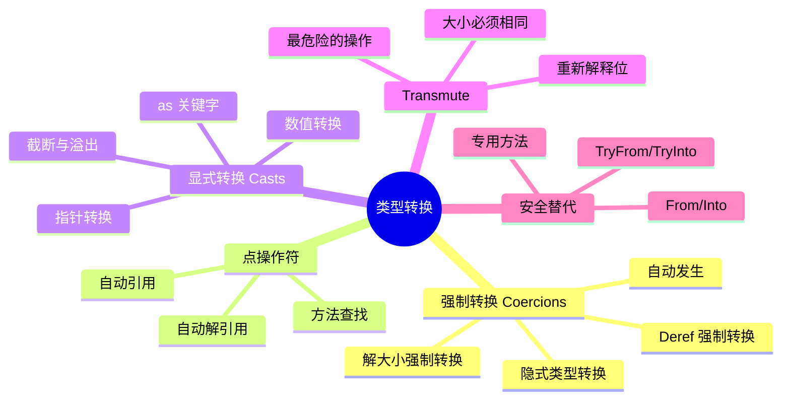
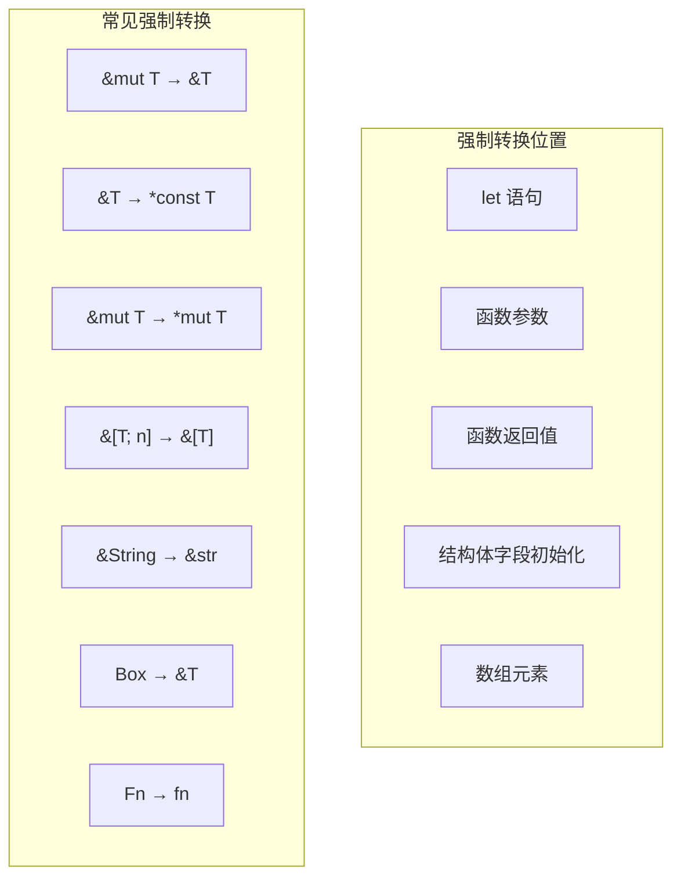
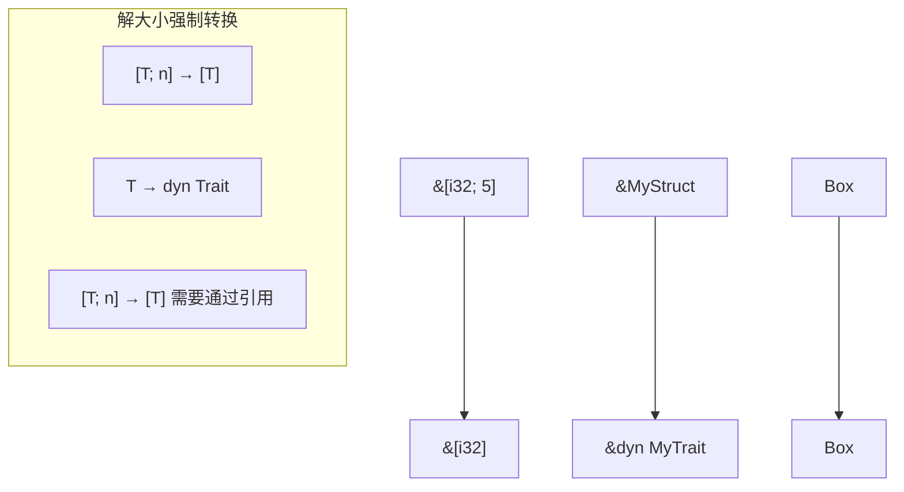
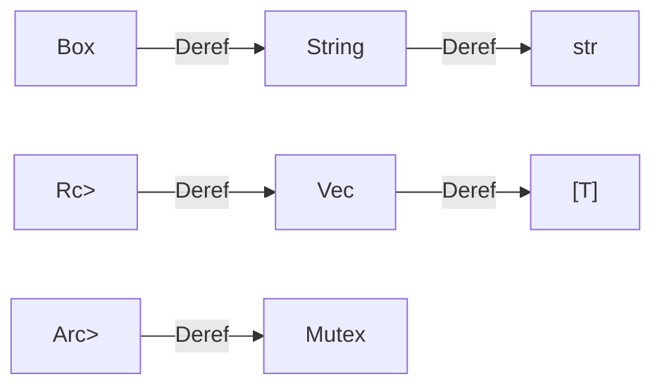
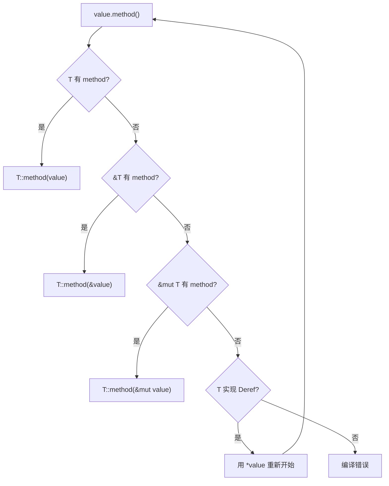
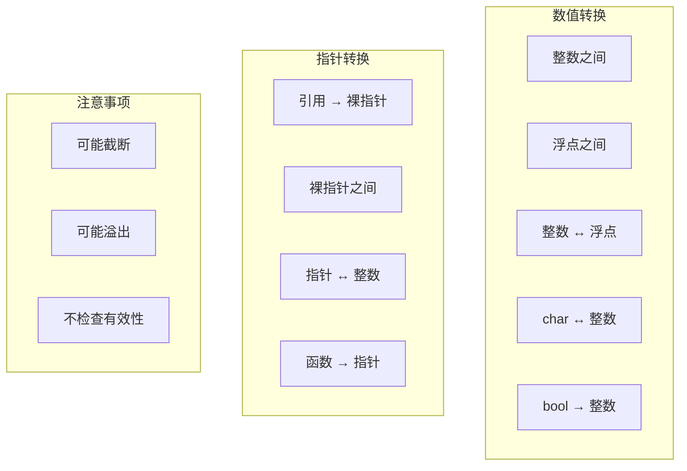
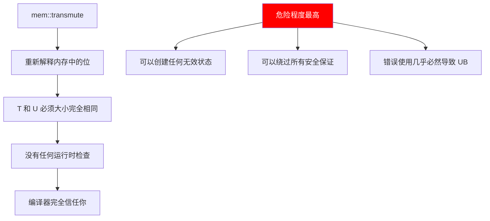
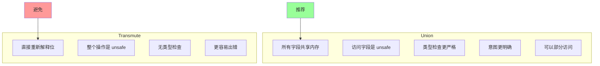
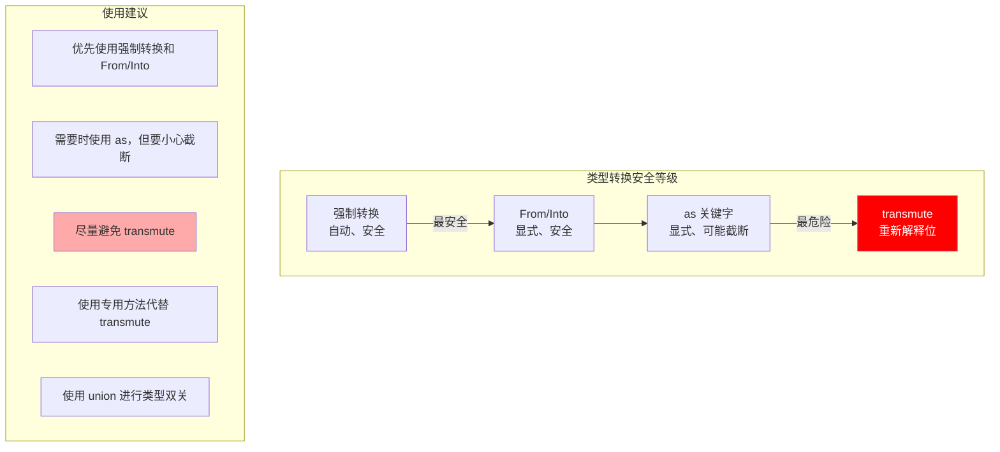
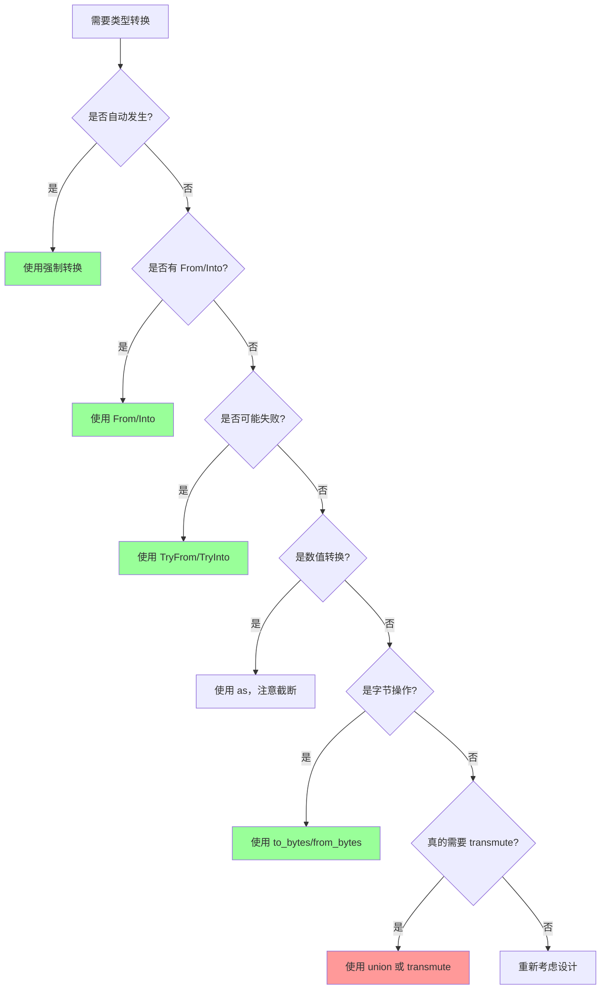

# 第四章：类型转换深度解析（扩展版）

## 概述

归根结底，一切都只是内存中的位序列，类型系统帮助我们正确使用这些位。本章深入探讨 Rust 中安全和不安全的类型转换方式，包括隐式转换、显式转换，以及最危险的 transmute 操作。



## 4.1 强制转换 (Coercions) 深入解析

### 什么是强制转换？

强制转换是 Rust 中隐式发生的类型转换，在特定的"强制转换位置"自动进行。编译器会自动插入必要的转换代码。



### 强制转换的完整列表

```rust
fn coercion_examples() {
    // 1. 解引用强制转换 (Deref coercion)
    let s = String::from("hello");
    let r: &str = &s;  // &String → &str

    // 2. 可变到不可变
    let mut x = 42;
    let r: &i32 = &mut x;  // &mut i32 → &i32

    // 3. 引用到裸指针
    let x = 42;
    let p: *const i32 = &x;  // &i32 → *const i32

    // 4. 可变引用到可变裸指针
    let mut x = 42;
    let p: *mut i32 = &mut x;  // &mut i32 → *mut i32

    // 5. 数组引用到切片
    let arr = [1, 2, 3];
    let slice: &[i32] = &arr;  // &[i32; 3] → &[i32]

    // 6. 函数项到函数指针
    fn foo() {}
    let f: fn() = foo;  // fn item → fn()

    // 7. 非捕获闭包到函数指针
    let c = |x: i32| x + 1;
    let f: fn(i32) -> i32 = c;  // 闭包 → fn(i32) -> i32

    // 8. ! (never type) 到任意类型
    fn diverges() -> ! { loop {} }
    let x: i32 = if false { diverges() } else { 42 };

    // 9. 子trait到父trait
    // impl Deref<Target=str> for String
    // 所以 &String 可以强制转换为 &str
}
```

### 解大小强制转换 (Unsizing Coercions)



```rust
trait Draw {
    fn draw(&self);
}

struct Circle { radius: f64 }
struct Square { side: f64 }

impl Draw for Circle {
    fn draw(&self) { println!("Drawing circle"); }
}

impl Draw for Square {
    fn draw(&self) { println!("Drawing square"); }
}

fn unsizing_coercion_demo() {
    // 具体类型到 trait 对象
    let circle = Circle { radius: 1.0 };
    let drawable: &dyn Draw = &circle;  // &Circle → &dyn Draw

    // Box 的解大小
    let boxed_square: Box<Square> = Box::new(Square { side: 2.0 });
    let boxed_drawable: Box<dyn Draw> = boxed_square;  // Box<Square> → Box<dyn Draw>

    // 数组到切片
    let arr = [1, 2, 3, 4, 5];
    let slice: &[i32] = &arr;  // &[i32; 5] → &[i32]

    // 使用 trait 对象的多态
    let shapes: Vec<Box<dyn Draw>> = vec![
        Box::new(Circle { radius: 1.0 }),
        Box::new(Square { side: 2.0 }),
    ];

    for shape in &shapes {
        shape.draw();
    }
}
```

### Deref 强制转换链



```rust
use std::ops::Deref;

// 自定义 Deref
struct MyBox<T>(T);

impl<T> Deref for MyBox<T> {
    type Target = T;
    fn deref(&self) -> &T { &self.0 }
}

// DerefMut 允许可变解引用
impl<T> std::ops::DerefMut for MyBox<T> {
    fn deref_mut(&mut self) -> &mut T { &mut self.0 }
}

fn takes_str(s: &str) {
    println!("{}", s);
}

fn takes_slice(s: &[i32]) {
    println!("{:?}", s);
}

fn deref_chain_demo() {
    // 多层 Deref 链
    let boxed_string = Box::new(String::from("hello"));

    // Box<String> → &String → &str
    takes_str(&boxed_string);

    let my_boxed = MyBox(MyBox(String::from("nested")));

    // MyBox<MyBox<String>> → &MyBox<String> → &String → &str
    takes_str(&my_boxed);

    // Vec 的 Deref
    let vec = vec![1, 2, 3];
    takes_slice(&vec);  // &Vec<i32> → &[i32]

    // 使用自定义 MyBox
    let my_vec = MyBox(vec![1, 2, 3]);
    takes_slice(&my_vec);  // &MyBox<Vec<i32>> → &Vec<i32> → &[i32]
}
```

### 强制转换位置详解

```rust
fn coercion_sites_demo() {
    // 1. let 语句的类型标注
    let s = String::from("hello");
    let r: &str = &s;  // 强制转换发生

    // 2. 函数/方法参数
    fn takes_ref(r: &str) {}
    takes_ref(&s);  // &String 强制转换为 &str

    // 3. 函数返回值
    fn returns_ref(s: &String) -> &str {
        s  // &String 强制转换为 &str
    }

    // 4. 结构体字段
    struct Holder<'a> {
        data: &'a str,
    }
    let h = Holder { data: &s };  // &String → &str

    // 5. 数组字面量
    let mut x = 1;
    let mut y = 2;
    let refs: [&i32; 2] = [&mut x, &mut y];  // &mut i32 → &i32

    // 6. 元组
    let tuple: (&str, &str) = (&s, &s);

    // 7. 块表达式的最后一个语句
    let r: &str = {
        let inner = String::from("inner");
        // 注意：这会失败，因为 inner 在块结束时被丢弃
        // &inner
        &s  // 必须引用外部的 s
    };
}
```

## 4.2 点操作符深入解析

### 方法调用的魔法



### 自动解引用的详细过程

```rust
struct Wrapper(String);

impl Wrapper {
    fn inner_method(&self) {
        println!("Wrapper::inner_method");
    }
}

impl std::ops::Deref for Wrapper {
    type Target = String;
    fn deref(&self) -> &String {
        &self.0
    }
}

fn method_resolution_demo() {
    let w = Wrapper(String::from("hello"));

    // 1. 首先尝试 Wrapper::inner_method
    w.inner_method();

    // 2. len() 不在 Wrapper 上，尝试 Deref
    // Wrapper → String，String::len(&self)
    let len = w.len();
    println!("Length: {}", len);

    // 3. chars() 不在 String 上，再次 Deref
    // String → str，str::chars(&self)
    for c in w.chars() {
        println!("Char: {}", c);
    }

    // 4. 如果需要调用被遮蔽的方法
    // 需要显式解引用或使用完全限定语法
    let s: &String = &w;
    s.len();

    // 完全限定语法
    String::len(&w);
}
```

### 自动引用与方法查找

```rust
#[derive(Clone)]
struct MyType {
    data: i32,
}

impl MyType {
    fn by_value(self) {
        println!("by_value: {}", self.data);
    }

    fn by_ref(&self) {
        println!("by_ref: {}", self.data);
    }

    fn by_mut_ref(&mut self) {
        self.data += 1;
        println!("by_mut_ref: {}", self.data);
    }
}

fn auto_ref_demo() {
    let mut t = MyType { data: 42 };

    // 自动借用为 &self
    t.by_ref();

    // 自动借用为 &mut self
    t.by_mut_ref();

    // by_value 消费 self
    // 如果 MyType: Copy，会自动复制
    // 否则会移动
    t.clone().by_value();  // 克隆以保留 t

    // t 仍然可用
    t.by_ref();
}

// 方法查找优先级
struct Priority;

impl Priority {
    fn method(&self) { println!("&self"); }
}

trait PriorityTrait {
    fn method(&self);
}

impl PriorityTrait for Priority {
    fn method(&self) { println!("trait method"); }
}

fn priority_demo() {
    let p = Priority;

    // 固有方法优先于 trait 方法
    p.method();  // 输出 "&self"

    // 要调用 trait 方法，使用完全限定语法
    PriorityTrait::method(&p);  // 输出 "trait method"
}
```

### 智能指针的方法调用

```rust
use std::rc::Rc;
use std::sync::Arc;

fn smart_pointer_methods() {
    // Box 的方法调用
    let boxed = Box::new(vec![1, 2, 3]);

    // Box<Vec<i32>> → Vec<i32> → [i32]
    // 自动解引用找到 len() 方法
    println!("Length: {}", boxed.len());

    // Rc 的方法调用
    let rc_string = Rc::new(String::from("hello"));

    // Rc<String> → String → str
    println!("Uppercase: {}", rc_string.to_uppercase());

    // 注意：某些方法在智能指针本身上
    println!("Strong count: {}", Rc::strong_count(&rc_string));

    // Arc 类似
    let arc_vec = Arc::new(vec![1, 2, 3]);
    println!("First: {:?}", arc_vec.first());
}
```

## 4.3 显式类型转换 (as) 深入解析

### as 关键字的所有用法



### 数值转换详解

```rust
fn numeric_casts() {
    // === 整数转换 ===

    // 扩展（无损）
    let u8_val: u8 = 42;
    let u32_val: u32 = u8_val as u32;  // 42

    // 截断（可能丢失数据）
    let big: u32 = 256;
    let truncated: u8 = big as u8;  // 0（256 % 256）

    let bigger: u32 = 257;
    let truncated2: u8 = bigger as u8;  // 1（257 % 256）

    // 有符号 ↔ 无符号（位模式保持）
    let signed: i8 = -1;
    let unsigned: u8 = signed as u8;  // 255

    let neg: i32 = -1;
    let as_u32: u32 = neg as u32;  // 4294967295

    // 符号扩展
    let small_signed: i8 = -1;  // 0xFF
    let big_signed: i32 = small_signed as i32;  // -1（符号扩展）

    // === 浮点转换 ===

    // f32 ↔ f64
    let f32_val: f32 = 3.14;
    let f64_val: f64 = f32_val as f64;  // 精度增加

    let big_f64: f64 = 3.141592653589793;
    let small_f32: f32 = big_f64 as f32;  // 精度损失

    // 浮点 → 整数（截断小数部分）
    let float: f64 = 3.99;
    let int: i32 = float as i32;  // 3（不是四舍五入）

    let neg_float: f64 = -3.99;
    let neg_int: i32 = neg_float as i32;  // -3

    // 整数 → 浮点
    let big_int: i64 = 9007199254740993;  // 2^53 + 1
    let as_f64: f64 = big_int as f64;  // 可能丢失精度！

    // === 特殊情况 ===

    // NaN 和无穷大
    let nan: f64 = f64::NAN;
    let nan_as_int: i32 = nan as i32;  // 0（saturating behavior since Rust 1.45）

    let inf: f64 = f64::INFINITY;
    let inf_as_int: i32 = inf as i32;  // i32::MAX

    // char ↔ 整数
    let c: char = 'A';
    let code: u32 = c as u32;  // 65

    let code: u32 = 128048;  // 🐶 的码点
    // let c: char = code as char;  // 不能直接转换
    let c: char = char::from_u32(code).unwrap();

    // bool → 整数
    let b: bool = true;
    let i: i32 = b as i32;  // 1

    let b: bool = false;
    let i: i32 = b as i32;  // 0

    println!("Examples completed");
}
```

### 指针转换详解

```rust
fn pointer_casts() {
    let x: i32 = 42;

    // === 引用到裸指针 ===
    let ptr: *const i32 = &x as *const i32;
    // 或者使用类型推断
    let ptr: *const i32 = &x;  // 隐式强制转换

    let mut y: i32 = 42;
    let mut_ptr: *mut i32 = &mut y as *mut i32;

    // === 裸指针之间 ===

    // *const T ↔ *mut T
    let const_ptr: *const i32 = ptr;
    let mut_ptr2: *mut i32 = const_ptr as *mut i32;  // 需要显式转换

    // 不同类型的指针
    let i32_ptr: *const i32 = &x;
    let u32_ptr: *const u32 = i32_ptr as *const u32;  // 类型双关
    let void_ptr: *const () = i32_ptr as *const ();  // 转为 void*

    // === 指针 ↔ 整数 ===
    let addr: usize = ptr as usize;
    println!("Address: 0x{:x}", addr);

    let back_to_ptr: *const i32 = addr as *const i32;

    // === 函数指针 ===
    fn foo(x: i32) -> i32 { x + 1 }

    let fn_ptr: fn(i32) -> i32 = foo;
    let fn_addr: usize = fn_ptr as usize;
    println!("Function address: 0x{:x}", fn_addr);

    // 函数指针到裸指针
    let raw_fn: *const () = fn_ptr as *const ();

    // === 切片指针 ===
    let arr = [1, 2, 3, 4, 5];
    let slice: &[i32] = &arr;

    // 胖指针的指针部分
    let slice_ptr: *const [i32] = slice as *const [i32];

    // 获取数据指针
    let data_ptr: *const i32 = slice.as_ptr();

    // 重建切片（unsafe）
    let rebuilt: &[i32] = unsafe {
        std::slice::from_raw_parts(data_ptr, 5)
    };

    println!("Rebuilt: {:?}", rebuilt);
}
```

### as 的陷阱与注意事项

```rust
fn as_pitfalls() {
    // 陷阱 1: 无声截断
    let big: u32 = 1000;
    let small: u8 = big as u8;  // 232，不是 1000！
    println!("Truncated: {}", small);

    // 陷阱 2: 符号问题
    let neg: i32 = -1;
    let as_usize: usize = neg as usize;  // 非常大的数！
    println!("Negative as usize: {}", as_usize);

    // 陷阱 3: 浮点精度
    let big: i64 = 9007199254740993;  // 2^53 + 1
    let as_f64: f64 = big as f64;
    let back: i64 = as_f64 as i64;
    println!("Original: {}, After roundtrip: {}", big, back);
    // 可能不相等！

    // 陷阱 4: 对齐问题
    let bytes: [u8; 8] = [1, 2, 3, 4, 5, 6, 7, 8];
    let ptr = bytes.as_ptr();

    // 这可能导致未对齐访问！
    let unaligned_ptr = unsafe { ptr.add(1) } as *const u32;
    // 在某些平台上，解引用 unaligned_ptr 是 UB

    // 正确做法：使用 read_unaligned
    let value = unsafe { unaligned_ptr.read_unaligned() };
}
```

## 4.4 Transmute 深入解析

### transmute 的本质



### transmute 的 UB 示例

```rust
use std::mem::transmute;

fn transmute_ub_examples() {
    // === 绝对不要这样做！===

    // UB 1: 创建无效的 bool
    // let invalid_bool: bool = unsafe { transmute(2u8) };
    // bool 只能是 0 或 1

    // UB 2: 创建无效的 enum
    enum Color { Red, Green, Blue }
    // let invalid_color: Color = unsafe { transmute(100u8) };
    // 判别式必须是有效值

    // UB 3: 创建 null 引用
    // let null_ref: &i32 = unsafe { transmute(0usize) };
    // 引用不能为 null

    // UB 4: 创建未对齐引用
    // let arr: [u8; 8] = [0; 8];
    // let unaligned: &u32 = unsafe { transmute(&arr[1]) };
    // 引用必须正确对齐

    // UB 5: 创建悬垂引用
    // let dangling: &i32 = unsafe {
    //     let x = 42;
    //     transmute(&x as *const i32)
    // };

    // UB 6: 违反别名规则
    // let mut x = 42;
    // let r1: &i32 = &x;
    // let r2: &mut i32 = unsafe { transmute(r1) };
    // 不能同时存在 &T 和 &mut T
}
```

### transmute 改变生命周期的危险

```rust
use std::mem::transmute;

fn lifetime_transmute_danger() {
    let static_ref: &'static str;

    {
        let s = String::from("temporary");
        // 危险：延长生命周期
        static_ref = unsafe {
            transmute::<&str, &'static str>(&s)
        };
        // s 在这里被丢弃
    }

    // static_ref 现在是悬垂引用！
    // println!("{}", static_ref);  // UB!
}

// 同样危险：缩短生命周期
fn shorten_lifetime<'a, 'b>(r: &'a str) -> &'b str {
    // 如果 'b 比 'a 长，这就是 UB
    unsafe { transmute(r) }
}
```

### transmute 的合法用途

```rust
use std::mem::transmute;

fn legitimate_transmute_uses() {
    // === 用途 1: 已知布局相同的类型 ===

    // repr(C) 保证布局
    #[repr(C)]
    struct Point { x: f32, y: f32 }

    #[repr(C)]
    struct Size { width: f32, height: f32 }

    let point = Point { x: 1.0, y: 2.0 };
    let size: Size = unsafe { transmute(point) };
    println!("Width: {}, Height: {}", size.width, size.height);

    // === 用途 2: 位模式重新解释 ===

    // 查看浮点数的位模式
    let f: f32 = 1.0;
    let bits: u32 = unsafe { transmute(f) };
    println!("1.0f32 bits: 0x{:08x}", bits);  // 0x3f800000

    // 从位模式创建浮点数
    let bits: u32 = 0x40000000;
    let f: f32 = unsafe { transmute(bits) };
    println!("0x40000000 as f32: {}", f);  // 2.0

    // === 用途 3: 非空优化类型 ===

    // Option<NonNull<T>> 和 *mut T 大小相同
    use std::ptr::NonNull;

    let ptr: *mut i32 = &mut 42 as *mut i32;
    let opt: Option<NonNull<i32>> = unsafe { transmute(ptr) };

    // === 用途 4: 函数指针转换 ===

    fn foo(x: i32) -> i32 { x + 1 }

    // 存储为 usize
    let addr: usize = foo as usize;

    // 恢复为函数指针（需要确保地址有效）
    let recovered: fn(i32) -> i32 = unsafe { transmute(addr) };
    println!("Result: {}", recovered(41));
}
```

### transmute 与大小检查

```rust
use std::mem::{transmute, size_of};

fn size_check_demo() {
    // transmute 要求源和目标大小完全相同
    // 否则编译失败

    // 这会编译失败：
    // let x: u64 = unsafe { transmute(42u32) };
    // error: cannot transmute between types of different sizes

    // 使用 transmute_copy 可以处理不同大小
    let x: u64 = 0x0102030405060708;
    let low: u32 = unsafe { std::mem::transmute_copy(&x) };
    println!("Low 32 bits: 0x{:08x}", low);

    // 打印各种类型的大小
    println!("u32: {} bytes", size_of::<u32>());
    println!("u64: {} bytes", size_of::<u64>());
    println!("&i32: {} bytes", size_of::<&i32>());
    println!("Option<&i32>: {} bytes", size_of::<Option<&i32>>());  // 相同！
}
```

## 4.5 安全替代方案

### From/Into Trait

```rust
use std::convert::From;

// 自定义 From 实现
struct Celsius(f64);
struct Fahrenheit(f64);

impl From<Celsius> for Fahrenheit {
    fn from(c: Celsius) -> Self {
        Fahrenheit(c.0 * 9.0 / 5.0 + 32.0)
    }
}

impl From<Fahrenheit> for Celsius {
    fn from(f: Fahrenheit) -> Self {
        Celsius((f.0 - 32.0) * 5.0 / 9.0)
    }
}

fn from_into_demo() {
    let celsius = Celsius(100.0);

    // 使用 From
    let fahrenheit = Fahrenheit::from(celsius);
    println!("100°C = {}°F", fahrenheit.0);

    // 使用 Into（自动实现）
    let celsius = Celsius(0.0);
    let fahrenheit: Fahrenheit = celsius.into();
    println!("0°C = {}°F", fahrenheit.0);

    // 标准库的 From 实现
    let s: String = String::from("hello");
    let s: String = "hello".into();

    let v: Vec<i32> = Vec::from([1, 2, 3]);
    let v: Vec<i32> = [1, 2, 3].into();
}
```

### TryFrom/TryInto Trait

```rust
use std::convert::TryFrom;

fn try_from_demo() {
    // 可能失败的转换
    let big: i64 = 1000;
    let result: Result<i32, _> = i32::try_from(big);
    assert!(result.is_ok());

    let too_big: i64 = i64::MAX;
    let result: Result<i32, _> = i32::try_from(too_big);
    assert!(result.is_err());

    // TryInto
    let x: i64 = 42;
    let y: Result<i32, _> = x.try_into();
    println!("Result: {:?}", y);

    // 自定义 TryFrom
    struct NonZero(i32);

    impl TryFrom<i32> for NonZero {
        type Error = &'static str;

        fn try_from(value: i32) -> Result<Self, Self::Error> {
            if value == 0 {
                Err("cannot be zero")
            } else {
                Ok(NonZero(value))
            }
        }
    }

    let nz = NonZero::try_from(42);
    assert!(nz.is_ok());

    let zero = NonZero::try_from(0);
    assert!(zero.is_err());
}
```

### 专用转换方法

```rust
fn specialized_methods() {
    // === 字节转换 ===

    let value: u32 = 0x12345678;

    // 转换为字节（各种字节序）
    let ne_bytes = value.to_ne_bytes();  // 本机字节序
    let le_bytes = value.to_le_bytes();  // 小端序
    let be_bytes = value.to_be_bytes();  // 大端序

    println!("NE: {:02x?}", ne_bytes);
    println!("LE: {:02x?}", le_bytes);
    println!("BE: {:02x?}", be_bytes);

    // 从字节恢复
    let from_ne = u32::from_ne_bytes(ne_bytes);
    let from_le = u32::from_le_bytes(le_bytes);
    let from_be = u32::from_be_bytes(be_bytes);

    assert_eq!(value, from_ne);
    assert_eq!(value, from_le);
    assert_eq!(value, from_be);

    // === 浮点数位操作 ===
    let f: f32 = 1.0;
    let bits = f.to_bits();
    println!("1.0f32 bits: 0x{:08x}", bits);

    let f_back = f32::from_bits(bits);
    assert_eq!(f, f_back);

    // === 指针转换 ===
    let x = 42;
    let ptr: *const i32 = &x;

    // 指针到整数
    let addr = ptr as usize;
    // 或者使用方法（更清晰）
    let addr2 = ptr.addr();  // 需要 #![feature(strict_provenance)]

    // 整数到指针（保持 provenance）
    // let ptr2 = ptr.with_addr(addr);

    // === 字符转换 ===
    let c: char = 'A';
    let code = c as u32;

    // 安全的逆转换
    let c_back = char::from_u32(code);
    assert_eq!(Some(c), c_back);

    // 对于 ASCII
    let ascii = b'A';
    let c_ascii = ascii as char;
    assert_eq!(c_ascii, 'A');
}
```

## 4.6 Union 作为类型双关

### Union 基础

```rust
#[repr(C)]
union IntFloat {
    i: i32,
    f: f32,
    bytes: [u8; 4],
}

fn union_basics() {
    // 创建 union
    let mut u = IntFloat { i: 0 };

    // 写入一个字段
    u.f = 1.0;

    // 读取另一个字段（unsafe）
    unsafe {
        println!("1.0f32 as i32: 0x{:08x}", u.i);
        println!("1.0f32 bytes: {:02x?}", u.bytes);
    }

    // 修改字节
    u.bytes = [0x00, 0x00, 0x00, 0x40];
    unsafe {
        println!("Modified float: {}", u.f);  // 2.0
    }
}
```

### Union vs Transmute



```rust
// 使用 union 更安全地进行类型双关
#[repr(C)]
union Bits32 {
    int: i32,
    uint: u32,
    float: f32,
    bytes: [u8; 4],
}

impl Bits32 {
    fn from_float(f: f32) -> Self {
        Bits32 { float: f }
    }

    fn as_int(&self) -> i32 {
        unsafe { self.int }
    }

    fn as_bytes(&self) -> [u8; 4] {
        unsafe { self.bytes }
    }
}

fn union_vs_transmute_demo() {
    // 使用 union（推荐）
    let bits = Bits32::from_float(1.0);
    println!("Via union: 0x{:08x}", bits.as_int());

    // 使用 transmute（不推荐）
    let bits: i32 = unsafe { std::mem::transmute(1.0f32) };
    println!("Via transmute: 0x{:08x}", bits);

    // 使用专用方法（最佳）
    let bits = 1.0f32.to_bits();
    println!("Via to_bits: 0x{:08x}", bits);
}
```

### 复杂的 Union 用例

```rust
use std::mem::ManuallyDrop;

// 带有非 Copy 类型的 union
union MaybeString {
    nothing: (),
    string: ManuallyDrop<String>,
}

impl MaybeString {
    fn new() -> Self {
        MaybeString { nothing: () }
    }

    fn set_string(&mut self, s: String) {
        self.string = ManuallyDrop::new(s);
    }

    unsafe fn get_string(&self) -> &String {
        &self.string
    }

    unsafe fn take_string(&mut self) -> String {
        ManuallyDrop::take(&mut self.string)
    }
}

// 网络协议解析
#[repr(C)]
union IpAddress {
    v4: [u8; 4],
    v6: [u16; 8],
    raw: u128,
}

fn network_parsing_demo() {
    // IPv4
    let addr = IpAddress {
        v4: [192, 168, 1, 1],
    };

    unsafe {
        println!("IPv4: {}.{}.{}.{}",
            addr.v4[0], addr.v4[1], addr.v4[2], addr.v4[3]);
    }

    // IPv6（简化）
    let addr = IpAddress {
        v6: [0x2001, 0x0db8, 0, 0, 0, 0, 0, 1],
    };

    unsafe {
        println!("IPv6 raw: 0x{:032x}", addr.raw);
    }
}
```

## 4.7 安全的类型转换工具

### 自定义安全转换 Trait

```rust
// 安全的数值转换 trait
trait SafeCast<T> {
    fn safe_cast(self) -> Option<T>;
}

// u32 → u8
impl SafeCast<u8> for u32 {
    fn safe_cast(self) -> Option<u8> {
        if self <= u8::MAX as u32 {
            Some(self as u8)
        } else {
            None
        }
    }
}

// i32 → u32
impl SafeCast<u32> for i32 {
    fn safe_cast(self) -> Option<u32> {
        if self >= 0 {
            Some(self as u32)
        } else {
            None
        }
    }
}

// f64 → i32
impl SafeCast<i32> for f64 {
    fn safe_cast(self) -> Option<i32> {
        if self.is_nan() {
            return None;
        }
        if self > i32::MAX as f64 || self < i32::MIN as f64 {
            return None;
        }
        Some(self as i32)
    }
}

fn safe_cast_demo() {
    let big: u32 = 300;
    let small: u32 = 42;

    println!("300 → u8: {:?}", big.safe_cast::<u8>());    // None
    println!("42 → u8: {:?}", small.safe_cast::<u8>());   // Some(42)

    let neg: i32 = -1;
    let pos: i32 = 42;

    println!("-1 → u32: {:?}", neg.safe_cast::<u32>());   // None
    println!("42 → u32: {:?}", pos.safe_cast::<u32>());   // Some(42)

    let nan: f64 = f64::NAN;
    let normal: f64 = 3.14;

    println!("NAN → i32: {:?}", nan.safe_cast::<i32>());     // None
    println!("3.14 → i32: {:?}", normal.safe_cast::<i32>()); // Some(3)
}
```

### 字节切片与类型的安全转换

```rust
// 安全地将字节切片转换为类型引用
fn safe_cast_bytes<T: bytemuck::Pod>(bytes: &[u8]) -> Option<&T> {
    if bytes.len() < std::mem::size_of::<T>() {
        return None;
    }

    let ptr = bytes.as_ptr();
    if ptr as usize % std::mem::align_of::<T>() != 0 {
        return None;
    }

    Some(unsafe { &*(ptr as *const T) })
}

// 或者使用 bytemuck crate（推荐）
// use bytemuck::{Pod, Zeroable, cast_slice};
//
// #[derive(Copy, Clone, Pod, Zeroable)]
// #[repr(C)]
// struct Vertex {
//     position: [f32; 3],
//     color: [f32; 3],
// }
//
// fn use_bytemuck(bytes: &[u8]) {
//     let vertices: &[Vertex] = cast_slice(bytes);
// }
```

## 4.8 总结



### 核心要点

1. **强制转换是自动的**：让编译器帮你处理，利用 Deref 链
2. **From/Into 是类型安全的**：为自定义类型实现这些 trait
3. **TryFrom/TryInto 处理可能失败的转换**：返回 Result
4. **as 是显式但危险的**：知道可能截断/溢出时使用
5. **transmute 是最危险的**：几乎总有更好的替代方案
6. **使用专用方法**：`to_ne_bytes`、`from_ne_bytes`、`to_bits` 等
7. **Union 用于类型双关**：比 transmute 更清晰、更安全

### 转换方法选择流程



---

下一章：[未初始化内存](./05-uninitialized.md)
