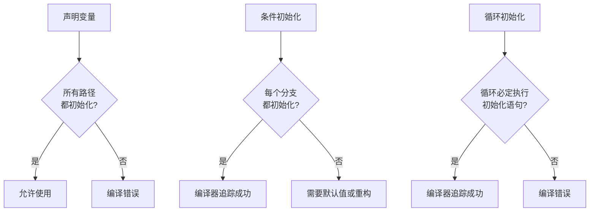
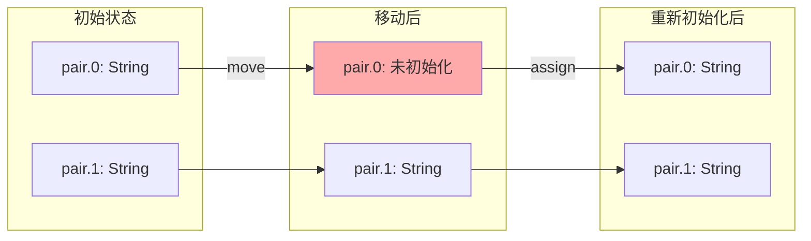
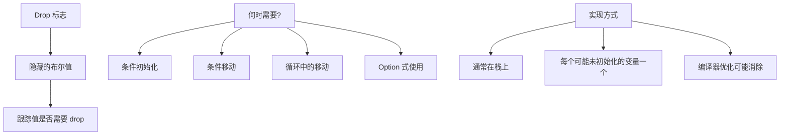
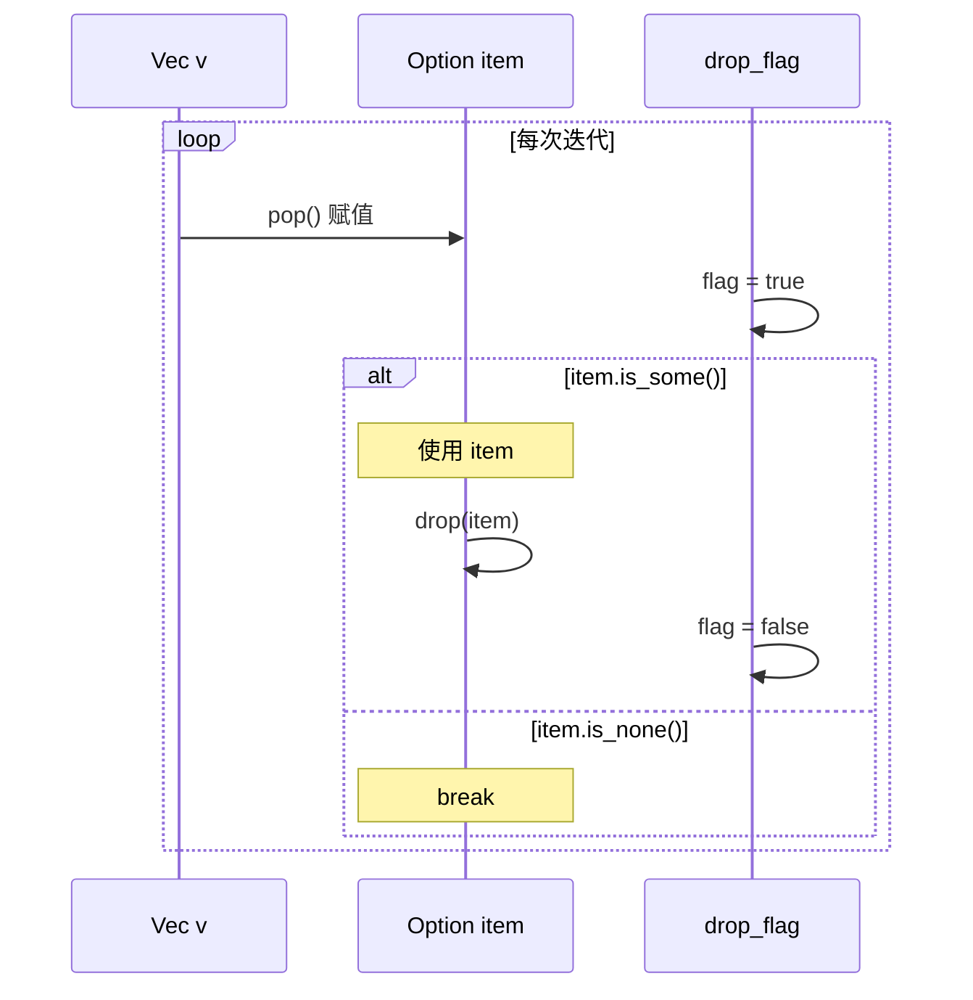
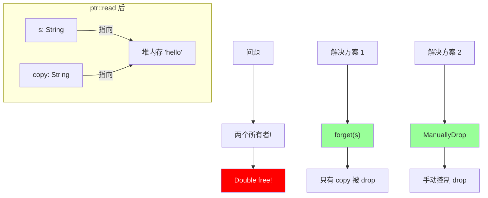
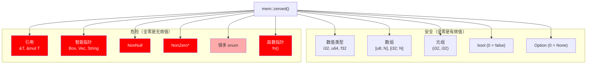
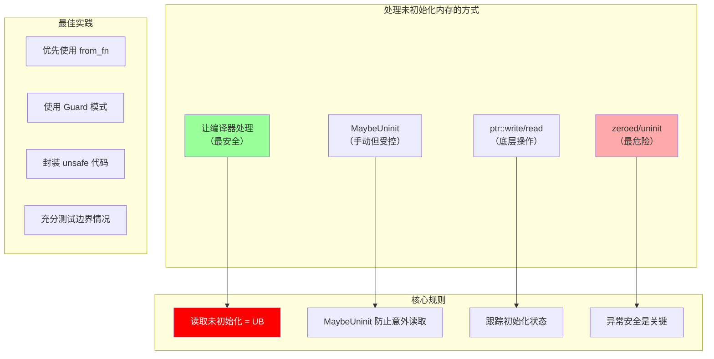

# 第五章：未初始化内存深度解析（扩展版）

## 概述

Rust 对未初始化内存的处理非常谨慎。读取未初始化内存是未定义行为，但正确使用未初始化内存可以带来显著的性能提升。本章深入探讨如何安全地处理未初始化内存。


## 5.1 编译器检查的初始化

### 基本检查

```rust
fn basic_init_check() {
    // 声明但不初始化
    let x: i32;

    // 编译错误！使用未初始化的变量
    // println!("{}", x);

    // 条件初始化 - 编译器需要确定所有路径都初始化
    let y: i32;
    if true {
        y = 42;
    }
    // 编译错误！编译器不确定 y 是否被初始化
    // println!("{}", y);

    // 所有路径都初始化 - OK
    let z: i32;
    if true {
        z = 1;
    } else {
        z = 2;
    }
    println!("{}", z);  // OK - 所有分支都初始化了 z

    // 循环中的初始化
    let mut w: i32;
    loop {
        w = 10;
        break;
    }
    println!("{}", w);  // OK - 编译器知道 break 前 w 被初始化
}
```



### 部分移动

```rust
fn partial_move_demo() {
    let mut pair = (String::from("hello"), String::from("world"));

    // 移出第一个元素
    let first = pair.0;

    // pair 现在是部分未初始化的！
    // println!("{:?}", pair);  // 编译错误！

    // 但可以使用未移动的部分
    println!("{}", pair.1);  // OK

    // 重新初始化后可以再次使用整个结构
    pair.0 = String::from("new");
    println!("{:?}", pair);  // OK
}

// 结构体的部分移动
struct Person {
    name: String,
    age: u32,
}

fn struct_partial_move() {
    let person = Person {
        name: String::from("Alice"),
        age: 30,
    };

    // 移出 name
    let name = person.name;

    // 可以继续访问 age（Copy 类型，实际上是复制）
    let age = person.age;  // OK - u32 是 Copy

    // 但不能访问整个 person
    // let p = person;  // 编译错误！

    // 不能再次移出 name（已经移出了）
    // let name2 = person.name;  // 编译错误！

    println!("{}, {}", name, age);
}
```



### 条件性初始化的高级情况

```rust
fn conditional_init_advanced() {
    // 编译器进行数据流分析
    let x: i32;
    let condition = std::env::args().len() > 1;

    if condition {
        x = 1;
        println!("In if: {}", x);  // OK
    }

    // 这里不能使用 x，因为可能未初始化
    // println!("{}", x);  // 编译错误！

    // 但如果 condition 后面有 else
    let y: i32;
    if condition {
        y = 1;
    } else {
        y = 2;
    }
    println!("{}", y);  // OK

    // match 表达式也类似
    let z: i32;
    match condition {
        true => z = 1,
        false => z = 2,
    }
    println!("{}", z);  // OK

    // 如果有分支返回/panic/循环永远不退出，也算"初始化"
    let w: i32;
    if condition {
        w = 1;
    } else {
        panic!("never returns");
    }
    println!("{}", w);  // OK - else 分支 never returns
}
```

## 5.2 Drop 标志 (Drop Flags) 深入解析

### 什么是 Drop 标志？



### Drop 标志的工作原理

```rust
fn drop_flag_example() {
    let condition = std::env::args().len() > 1;

    let x;
    if condition {
        x = Box::new(42);
        println!("{}", x);
    }
    // x 可能需要 drop，也可能不需要
    // 编译器生成 drop 标志来跟踪
}

// 编译器生成的伪代码
fn drop_flag_example_desugared() {
    let condition = std::env::args().len() > 1;

    let x: std::mem::MaybeUninit<Box<i32>>;
    let mut x_drop_flag = false;  // Drop 标志

    if condition {
        x = std::mem::MaybeUninit::new(Box::new(42));
        x_drop_flag = true;  // 标记为已初始化
        println!("{}", unsafe { x.assume_init_ref() });
    }

    // 在作用域结束时
    if x_drop_flag {
        unsafe { x.assume_init_drop(); }
    }
}
```

### 循环中的 Drop 标志

```rust
fn loop_drop_flags() {
    let mut v = vec![String::from("a"), String::from("b"), String::from("c")];

    loop {
        // 每次迭代，item 可能已经被移动
        let item = v.pop();
        if item.is_none() {
            break;
        }
        let item = item.unwrap();
        // item 在这里被使用
        println!("{}", item);
        // item 在这里被 drop（每次循环迭代结束）
    }
}

// 更复杂的例子：条件移动
fn conditional_move_in_loop() {
    let mut v = vec![
        Some(String::from("a")),
        None,
        Some(String::from("c")),
    ];

    for item in v.iter_mut() {
        if let Some(s) = item.take() {
            // s 在这里被移出
            println!("Got: {}", s);
            // s 在这里被 drop
        }
        // item 现在是 None
    }
}
```



### Drop 标志的性能影响

```rust
// 编译器通常能优化掉 drop 标志
fn optimized_drop_flags() {
    // 情况 1: 肯定初始化 - 无需 drop 标志
    let x = Box::new(42);
    // 编译器知道 x 一定被初始化，直接在作用域结束时 drop

    // 情况 2: 肯定不初始化 - 无需 drop 标志
    let y: Box<i32>;
    // 编译器知道 y 从未被初始化，不生成 drop 代码

    // 情况 3: 条件初始化 - 需要 drop 标志
    let condition = std::env::args().len() > 1;
    let z;
    if condition {
        z = Box::new(42);
    }
    // 编译器生成 drop 标志

    // 情况 4: 确定性移动 - 无需 drop 标志
    let a = Box::new(42);
    let b = a;  // a 被移动，b 被初始化
    // 编译器知道只需 drop b
}
```

## 5.3 MaybeUninit 深入解析

### 为什么需要 MaybeUninit？

```mermaid
graph TB
    A[问题场景] --> B[需要"稍后"初始化内存]
    A --> C[避免默认值开销]
    A --> D[FFI 输出参数]
    A --> E[性能关键的数组初始化]

    F["MaybeUninit<T>"] --> G[可以安全持有未初始化的 T]
    F --> H[不会自动 drop 内容]
    F --> I[提供安全的初始化 API]
    F --> J[防止编译器假设值有效]

    style F fill:#9f9
```

### MaybeUninit 的内部结构

```rust
// MaybeUninit 的简化定义
#[repr(transparent)]
pub union MaybeUninit<T> {
    uninit: (),
    value: std::mem::ManuallyDrop<T>,
}

// 关键特性：
// 1. 与 T 有相同的大小和对齐
// 2. 不实现 Drop（即使 T 实现了）
// 3. 可以安全地创建未初始化的实例
```

### MaybeUninit 的完整 API

```rust
use std::mem::MaybeUninit;

fn maybeuninit_api_demo() {
    // === 创建 ===

    // 创建未初始化的值
    let uninit: MaybeUninit<i32> = MaybeUninit::uninit();

    // 创建全零（仅对某些类型安全！）
    let zeroed: MaybeUninit<i32> = MaybeUninit::zeroed();

    // 从已知值创建
    let init: MaybeUninit<i32> = MaybeUninit::new(42);

    // === 写入 ===

    let mut uninit: MaybeUninit<String> = MaybeUninit::uninit();

    // 方法 1: 使用 write（推荐）
    uninit.write(String::from("hello"));

    // 方法 2: 使用 as_mut_ptr
    let mut uninit2: MaybeUninit<String> = MaybeUninit::uninit();
    unsafe {
        uninit2.as_mut_ptr().write(String::from("world"));
    }

    // === 读取 ===

    // 获取值（消耗 MaybeUninit）
    let s: String = unsafe { uninit.assume_init() };
    println!("{}", s);

    // 获取引用（不消耗）
    let s_ref: &String = unsafe { uninit2.assume_init_ref() };
    println!("{}", s_ref);

    // 获取可变引用
    let mut uninit3: MaybeUninit<String> = MaybeUninit::new(String::from("mutable"));
    let s_mut: &mut String = unsafe { uninit3.assume_init_mut() };
    s_mut.push_str(" string");
    println!("{}", s_mut);

    // === 丢弃 ===

    // 就地 drop（不移出值）
    unsafe { uninit2.assume_init_drop(); }

    // uninit3 还没被 drop，需要手动处理
    unsafe { uninit3.assume_init_drop(); }
}
```

### 数组初始化详解

```rust
use std::mem::MaybeUninit;

// 方法 1: 逐个初始化（传统方式）
fn init_array_traditional<T, F, const N: usize>(f: F) -> [T; N]
where
    F: Fn(usize) -> T,
{
    // 创建未初始化的数组
    let mut arr: [MaybeUninit<T>; N] = unsafe {
        MaybeUninit::uninit().assume_init()
    };

    // 跟踪初始化进度（用于异常安全）
    let mut initialized = 0;

    // 使用 scope guard 确保 panic 时正确清理
    struct Guard<'a, T, const N: usize> {
        arr: &'a mut [MaybeUninit<T>; N],
        initialized: &'a mut usize,
    }

    impl<T, const N: usize> Drop for Guard<'_, T, N> {
        fn drop(&mut self) {
            for i in 0..*self.initialized {
                unsafe { self.arr[i].assume_init_drop(); }
            }
        }
    }

    {
        let mut guard = Guard { arr: &mut arr, initialized: &mut initialized };

        for i in 0..N {
            guard.arr[i].write(f(i));
            *guard.initialized += 1;
        }

        // 成功完成，忘记 guard（不执行 drop）
        std::mem::forget(guard);
    }

    // 转换为初始化的数组
    unsafe {
        // 使用 ptr::read 是因为不能直接 transmute MaybeUninit 数组
        let ptr = arr.as_ptr() as *const [T; N];
        std::ptr::read(ptr)
    }
}

// 方法 2: 使用 std::array::from_fn（推荐，Rust 1.63+）
fn init_array_modern<T, F, const N: usize>(f: F) -> [T; N]
where
    F: FnMut(usize) -> T,
{
    std::array::from_fn(f)
}

// 方法 3: 使用迭代器（当可以收集时）
fn init_array_from_iter<T, const N: usize>(iter: impl Iterator<Item = T>) -> Option<[T; N]> {
    let vec: Vec<T> = iter.take(N).collect();
    vec.try_into().ok()
}

fn demo() {
    // 传统方式
    let arr1: [String; 5] = init_array_traditional(|i| format!("elem {}", i));

    // 现代方式（推荐）
    let arr2: [String; 5] = std::array::from_fn(|i| format!("elem {}", i));

    // 从迭代器
    let arr3: Option<[i32; 5]> = init_array_from_iter(0..5);

    println!("{:?}", arr1);
    println!("{:?}", arr2);
    println!("{:?}", arr3);
}
```

### MaybeUninit 与 FFI

```rust
use std::mem::MaybeUninit;

// C 函数通常通过输出参数返回数据
extern "C" {
    // int get_value(int* out);
    fn get_value(out: *mut i32) -> i32;

    // int fill_buffer(char* buf, size_t len, size_t* written);
    fn fill_buffer(buf: *mut u8, len: usize, written: *mut usize) -> i32;
}

fn ffi_output_param_demo() {
    // 简单输出参数
    let mut value = MaybeUninit::<i32>::uninit();
    let result = unsafe { get_value(value.as_mut_ptr()) };
    if result == 0 {
        let value = unsafe { value.assume_init() };
        println!("Got value: {}", value);
    }

    // 缓冲区输出参数
    const BUF_SIZE: usize = 1024;
    let mut buffer: [MaybeUninit<u8>; BUF_SIZE] = unsafe {
        MaybeUninit::uninit().assume_init()
    };
    let mut written = MaybeUninit::<usize>::uninit();

    let result = unsafe {
        fill_buffer(
            buffer.as_mut_ptr() as *mut u8,
            BUF_SIZE,
            written.as_mut_ptr(),
        )
    };

    if result == 0 {
        let written = unsafe { written.assume_init() };
        // 只有 buffer[0..written] 被初始化了
        let initialized_part: &[u8] = unsafe {
            std::slice::from_raw_parts(
                buffer.as_ptr() as *const u8,
                written,
            )
        };
        println!("Got {} bytes", initialized_part.len());
    }
}
```

## 5.4 ptr::write 和 ptr::read 深入解析

### ptr::write 详解

```rust
use std::ptr;

fn ptr_write_demo() {
    // ptr::write 的核心特性：
    // 1. 不读取目标位置
    // 2. 不 drop 目标位置的旧值
    // 3. 将值移动到目标位置

    // 场景 1: 写入未初始化内存
    let mut uninit: std::mem::MaybeUninit<String> =
        std::mem::MaybeUninit::uninit();

    unsafe {
        ptr::write(uninit.as_mut_ptr(), String::from("hello"));
    }

    let s = unsafe { uninit.assume_init() };
    println!("{}", s);

    // 场景 2: 覆盖已初始化的值（危险！）
    let mut s = String::from("old");
    let ptr = &mut s as *mut String;

    // 这会泄漏 "old"！因为 ptr::write 不 drop 旧值
    unsafe {
        ptr::write(ptr, String::from("new"));
    }
    // "old" 的内存被覆盖但没有被释放（内存泄漏）

    // 正确做法：先 drop 旧值
    let mut s2 = String::from("old2");
    unsafe {
        ptr::drop_in_place(&mut s2);
        ptr::write(&mut s2, String::from("new2"));
    }
    println!("{}", s2);
}

// ptr::write_unaligned - 写入未对齐的位置
fn write_unaligned_demo() {
    let mut bytes = [0u8; 8];

    unsafe {
        // 在偏移 1 处写入 u32（可能未对齐）
        let ptr = bytes.as_mut_ptr().add(1) as *mut u32;
        ptr::write_unaligned(ptr, 0x12345678u32);
    }

    println!("{:02x?}", bytes);
}
```

### ptr::read 详解

```rust
use std::ptr;

fn ptr_read_demo() {
    // ptr::read 的核心特性：
    // 1. 创建值的按位副本
    // 2. 不移动原值（原值仍然存在）
    // 3. 调用者负责确保不会 double free

    let s = String::from("hello");
    let ptr = &s as *const String;

    // 读取值（创建按位副本）
    let copy = unsafe { ptr::read(ptr) };

    // 危险！现在有两个 String 指向同一内存
    // 必须确保只有一个被 drop

    // 方案 1: 忘记原值
    std::mem::forget(s);
    println!("{}", copy);  // 只有 copy 被 drop

    // 方案 2: 使用 ManuallyDrop
    let s2 = std::mem::ManuallyDrop::new(String::from("world"));
    let ptr2 = &*s2 as *const String;
    let copy2 = unsafe { ptr::read(ptr2) };
    // s2 不会被自动 drop
    println!("{}", copy2);

    // 方案 3: 用于移出不可移动的位置
    let mut vec = vec![String::from("a"), String::from("b")];
    let first = unsafe { ptr::read(&vec[0]) };
    // vec[0] 现在是未初始化的！
    // 必须在 vec drop 前处理这个问题
    vec.truncate(0);  // 清空 vec，避免 double free
    println!("{}", first);
}

// ptr::read_unaligned - 读取未对齐的位置
fn read_unaligned_demo() {
    let bytes = [0x78, 0x56, 0x34, 0x12, 0x00, 0x00, 0x00, 0x00];

    unsafe {
        // 从偏移 0 读取 u32（可能未对齐）
        let ptr = bytes.as_ptr() as *const u32;
        let value = ptr::read_unaligned(ptr);
        println!("Value: 0x{:08x}", value);  // 依赖字节序
    }
}
```



### ptr::copy 和 ptr::copy_nonoverlapping

```rust
use std::ptr;

fn copy_demo() {
    let src = [1, 2, 3, 4, 5];
    let mut dst = [0i32; 5];

    unsafe {
        // copy_nonoverlapping: 源和目标不能重叠
        ptr::copy_nonoverlapping(
            src.as_ptr(),
            dst.as_mut_ptr(),
            5,
        );
    }
    println!("{:?}", dst);

    // copy: 允许源和目标重叠（像 memmove）
    let mut arr = [1, 2, 3, 4, 5];
    unsafe {
        // 将 [1,2,3] 复制到 [2,3,4] 的位置
        ptr::copy(
            arr.as_ptr(),
            arr.as_mut_ptr().add(1),
            3,
        );
    }
    println!("{:?}", arr);  // [1, 1, 2, 3, 5]
}
```

## 5.5 异常安全与未初始化内存

### 部分初始化的危险

```rust
use std::mem::MaybeUninit;

fn partial_init_danger() {
    let mut arr: [MaybeUninit<String>; 3] = unsafe {
        MaybeUninit::uninit().assume_init()
    };

    // 初始化前两个元素
    arr[0].write(String::from("a"));
    arr[1].write(String::from("b"));

    // 如果这里发生 panic...
    fn might_panic() {
        panic!("oops");
    }
    // might_panic();  // 取消注释会导致问题

    arr[2].write(String::from("c"));

    // 如果在 might_panic 处 panic：
    // - arr[0] 和 arr[1] 已初始化但不会被 drop
    // - 内存泄漏！
}
```

### 异常安全的解决方案

```rust
use std::mem::MaybeUninit;

// 方案 1: 使用 Guard 模式
struct InitGuard<'a, T, const N: usize> {
    data: &'a mut [MaybeUninit<T>; N],
    initialized: usize,
}

impl<T, const N: usize> Drop for InitGuard<'_, T, N> {
    fn drop(&mut self) {
        // 只 drop 已初始化的元素
        for i in 0..self.initialized {
            unsafe {
                self.data[i].assume_init_drop();
            }
        }
    }
}

fn safe_array_init<T, F, const N: usize>(mut f: F) -> [T; N]
where
    F: FnMut(usize) -> T,
{
    let mut data: [MaybeUninit<T>; N] = unsafe {
        MaybeUninit::uninit().assume_init()
    };

    let mut guard = InitGuard {
        data: &mut data,
        initialized: 0,
    };

    for i in 0..N {
        guard.data[i].write(f(i));
        guard.initialized += 1;
    }

    // 成功完成，不需要 guard 的清理
    std::mem::forget(guard);

    unsafe {
        let ptr = data.as_ptr() as *const [T; N];
        std::ptr::read(ptr)
    }
}

// 方案 2: 使用 scopeguard crate
// use scopeguard::defer;

// 方案 3: 封装成类型
struct PartiallyInitArray<T, const N: usize> {
    data: [MaybeUninit<T>; N],
    initialized: usize,
}

impl<T, const N: usize> PartiallyInitArray<T, N> {
    fn new() -> Self {
        Self {
            data: unsafe { MaybeUninit::uninit().assume_init() },
            initialized: 0,
        }
    }

    fn push(&mut self, value: T) -> Result<(), T> {
        if self.initialized < N {
            self.data[self.initialized].write(value);
            self.initialized += 1;
            Ok(())
        } else {
            Err(value)
        }
    }

    fn into_array(self) -> Option<[T; N]> {
        if self.initialized == N {
            let this = std::mem::ManuallyDrop::new(self);
            Some(unsafe {
                std::ptr::read(this.data.as_ptr() as *const [T; N])
            })
        } else {
            None
        }
    }
}

impl<T, const N: usize> Drop for PartiallyInitArray<T, N> {
    fn drop(&mut self) {
        for i in 0..self.initialized {
            unsafe { self.data[i].assume_init_drop(); }
        }
    }
}
```

```mermaid
sequenceDiagram
    participant A as Array
    participant G as Guard
    participant F as 初始化函数

    Note over A: data: [uninit; N]
    Note over G: initialized: 0

    loop i = 0..N
        F->>A: 初始化 data[i]
        G->>G: initialized++
        alt panic 发生
            G->>A: drop data[0..initialized]
            Note over A: 已初始化部分被正确清理
        end
    end

    Note over G: 成功完成
    G->>G: forget(guard)
    Note over A: 返回完整数组
```

## 5.6 zeroed 和 uninit 的区别

### mem::zeroed 的危险

```rust
use std::mem::zeroed;

fn zeroed_demo() {
    // 安全的情况（全零是有效值）
    let i: i32 = unsafe { zeroed() };  // 0
    let arr: [u8; 10] = unsafe { zeroed() };  // [0; 10]
    let b: bool = unsafe { zeroed() };  // false (0)

    // 危险！以下是 UB：
    // let s: String = unsafe { zeroed() };  // String 内部有指针，不能是 0
    // let b: Box<i32> = unsafe { zeroed() };  // Box 不能是 null
    // let r: &i32 = unsafe { zeroed() };  // 引用不能是 null

    // 特别危险：NonNull 和 NonZero 类型
    // use std::ptr::NonNull;
    // let nn: NonNull<i32> = unsafe { zeroed() };  // UB! NonNull 不能是 null

    // use std::num::NonZeroU32;
    // let nz: NonZeroU32 = unsafe { zeroed() };  // UB! NonZero 不能是 0
}
```



### MaybeUninit::zeroed vs MaybeUninit::uninit

```rust
use std::mem::MaybeUninit;

fn uninit_vs_zeroed() {
    // MaybeUninit::uninit() - 不初始化内存
    let uninit: MaybeUninit<i32> = MaybeUninit::uninit();
    // 内存内容是未定义的（可能是之前的值）

    // MaybeUninit::zeroed() - 零初始化
    let zeroed: MaybeUninit<i32> = MaybeUninit::zeroed();
    // 内存内容是全零

    // 区别在于：
    // 1. zeroed 有额外的初始化开销
    // 2. zeroed 对某些类型是有效值，uninit 永远不是

    // 如果你打算立即初始化，用 uninit
    let mut x = MaybeUninit::<String>::uninit();
    x.write(String::from("hello"));
    let s = unsafe { x.assume_init() };

    // 如果你需要一个零值，且零是有效的，用 zeroed
    let mut arr = MaybeUninit::<[u8; 1024]>::zeroed();
    let arr = unsafe { arr.assume_init() };
    // arr 现在是 [0; 1024]
}
```

## 5.7 实际应用场景

### 高性能缓冲区

```rust
use std::mem::MaybeUninit;

struct Buffer<const N: usize> {
    data: [MaybeUninit<u8>; N],
    len: usize,
}

impl<const N: usize> Buffer<N> {
    const fn new() -> Self {
        Self {
            data: unsafe { MaybeUninit::uninit().assume_init() },
            len: 0,
        }
    }

    fn write(&mut self, bytes: &[u8]) -> usize {
        let available = N - self.len;
        let to_write = bytes.len().min(available);

        unsafe {
            std::ptr::copy_nonoverlapping(
                bytes.as_ptr(),
                self.data.as_mut_ptr().add(self.len) as *mut u8,
                to_write,
            );
        }

        self.len += to_write;
        to_write
    }

    fn as_slice(&self) -> &[u8] {
        unsafe {
            std::slice::from_raw_parts(
                self.data.as_ptr() as *const u8,
                self.len,
            )
        }
    }

    fn clear(&mut self) {
        self.len = 0;
    }
}
```

### 延迟初始化（OnceCell 简化实现）

```rust
use std::cell::UnsafeCell;
use std::mem::MaybeUninit;
use std::sync::Once;

pub struct OnceCell<T> {
    once: Once,
    value: UnsafeCell<MaybeUninit<T>>,
}

unsafe impl<T: Send + Sync> Sync for OnceCell<T> {}
unsafe impl<T: Send> Send for OnceCell<T> {}

impl<T> OnceCell<T> {
    pub const fn new() -> Self {
        Self {
            once: Once::new(),
            value: UnsafeCell::new(MaybeUninit::uninit()),
        }
    }

    pub fn get(&self) -> Option<&T> {
        if self.once.is_completed() {
            Some(unsafe { (*self.value.get()).assume_init_ref() })
        } else {
            None
        }
    }

    pub fn get_or_init<F>(&self, f: F) -> &T
    where
        F: FnOnce() -> T,
    {
        self.once.call_once(|| {
            unsafe {
                (*self.value.get()).write(f());
            }
        });

        unsafe { (*self.value.get()).assume_init_ref() }
    }
}

impl<T> Drop for OnceCell<T> {
    fn drop(&mut self) {
        if self.once.is_completed() {
            unsafe { (*self.value.get()).assume_init_drop() }
        }
    }
}
```

### 对象池

```rust
use std::mem::MaybeUninit;

struct Pool<T, const N: usize> {
    slots: [MaybeUninit<T>; N],
    free_list: Vec<usize>,
    in_use: [bool; N],
}

impl<T, const N: usize> Pool<T, N> {
    fn new() -> Self {
        Self {
            slots: unsafe { MaybeUninit::uninit().assume_init() },
            free_list: (0..N).collect(),
            in_use: [false; N],
        }
    }

    fn alloc(&mut self) -> Option<(usize, &mut MaybeUninit<T>)> {
        let index = self.free_list.pop()?;
        self.in_use[index] = true;
        Some((index, &mut self.slots[index]))
    }

    fn get(&self, index: usize) -> Option<&T> {
        if self.in_use[index] {
            Some(unsafe { self.slots[index].assume_init_ref() })
        } else {
            None
        }
    }

    fn free(&mut self, index: usize) {
        if self.in_use[index] {
            unsafe { self.slots[index].assume_init_drop() }
            self.in_use[index] = false;
            self.free_list.push(index);
        }
    }
}

impl<T, const N: usize> Drop for Pool<T, N> {
    fn drop(&mut self) {
        for i in 0..N {
            if self.in_use[i] {
                unsafe { self.slots[i].assume_init_drop() }
            }
        }
    }
}
```

## 5.8 总结



### 核心要点

1. **读取未初始化内存是 UB**：即使是"只是读一下"
2. **使用 MaybeUninit**：它是处理未初始化内存的标准工具
3. **跟踪初始化状态**：特别是部分初始化的数组
4. **考虑异常安全**：panic 时不要 drop 未初始化的值
5. **避免 mem::zeroed**：除非你确定全零是有效值
6. **优先使用标准库工具**：`array::from_fn`、`OnceCell` 等
7. **封装 unsafe 代码**：提供安全的 API

### 检查清单

使用未初始化内存时，确保：

- [ ] 使用 `MaybeUninit` 而不是直接使用 `mem::uninit`
- [ ] 在 `assume_init` 前确保值已完全初始化
- [ ] 处理部分初始化的异常安全问题
- [ ] 使用 Guard 模式或类似技术
- [ ] 不要多次读取同一位置（除非类型是 Copy）
- [ ] 正确处理所有权（避免 double free）
- [ ] 考虑使用标准库的安全替代方案

---

下一章：[OBRM 资源管理](./06-obrm.md)
